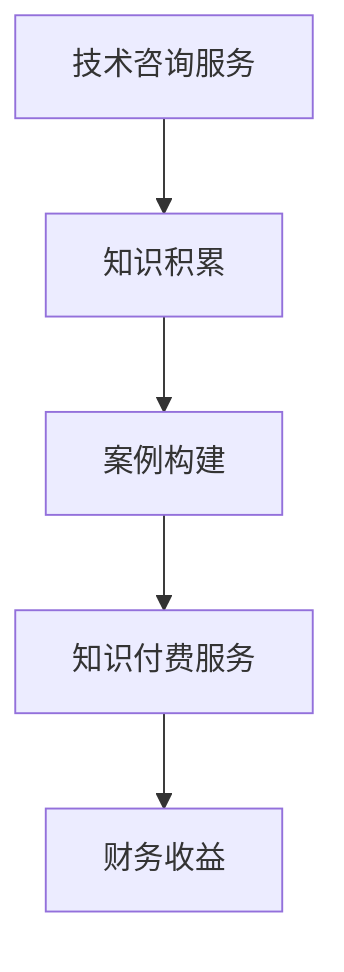

                 

  
## 摘要

在当今信息技术飞速发展的时代，程序员的技能和知识储备显得尤为重要。然而，如何将这些宝贵的技能转化为可持续的收入来源，成为了许多程序员面临的挑战。本文旨在探讨程序员如何利用自身的技术咨询经验，将其转化为知识付费服务，从而实现个人价值的最大化。本文将结合实际案例，详细阐述技术咨询的转化过程、知识付费服务的运营模式、以及如何通过这一模式实现财务自由。

## 1. 背景介绍

### 技术咨询的兴起

随着互联网的普及和企业信息化进程的加快，技术咨询服务市场需求日益增长。无论是企业内部IT系统的优化，还是新兴技术的应用，技术咨询服务都扮演着至关重要的角色。程序员作为技术的执行者和创新者，其咨询服务的价值和潜力不容忽视。

### 知识付费服务的发展

知识付费服务的兴起，为程序员提供了将自身技能转化为收益的新途径。通过在线课程、技术咨询、付费问答等方式，程序员可以共享自己的知识和经验，实现知识变现。与此同时，用户也能够通过付费获得更专业、更个性化的服务。

### 程序员的价值转化需求

随着职业发展的需求和个人价值的实现，许多程序员开始寻求将自身的技术咨询经验转化为可持续的收入来源。如何有效地将咨询服务转化为知识付费服务，成为了他们迫切需要解决的问题。

## 2. 核心概念与联系

### 技术咨询

技术咨询是指程序员或技术团队为企业或个人提供技术解决方案的过程。它包括需求分析、方案设计、技术实施等多个环节。技术咨询的核心价值在于解决实际问题，提升企业或个人的技术水平和竞争力。

### 知识付费服务

知识付费服务是指以付费形式提供的知识分享服务，包括在线课程、技术咨询、付费问答等。知识付费服务的核心在于知识的共享和变现，它为用户提供了专业、高效的知识获取途径。

### 技术咨询与知识付费服务的联系

技术咨询与知识付费服务之间存在密切的联系。技术咨询是知识付费服务的基础，通过提供高质量的技术咨询服务，程序员可以积累宝贵的经验和案例，进而转化为知识付费服务。而知识付费服务则为技术咨询提供了展示和变现的平台。

### Mermaid 流程图



## 3. 核心算法原理 & 具体操作步骤

### 3.1 算法原理概述

技术咨询转化为知识付费服务的核心算法，可以概括为以下三个步骤：

1. **需求分析**：了解用户需求，确定技术咨询服务的内容和范围。
2. **知识积累**：通过实际咨询案例，积累丰富的知识和经验。
3. **知识变现**：将积累的知识转化为知识付费服务，实现收益最大化。

### 3.2 算法步骤详解

#### 步骤一：需求分析

需求分析是技术咨询服务的前提和基础。程序员需要深入了解用户的需求，包括业务背景、技术难题等。具体操作步骤如下：

1. **沟通与调研**：与用户进行多次沟通，了解业务需求和痛点。
2. **问题定位**：明确技术难题，分析问题的根源和影响范围。
3. **需求文档**：撰写详细的的需求文档，作为后续技术服务的依据。

#### 步骤二：知识积累

知识积累是技术咨询服务的关键。通过实际咨询案例，程序员可以不断丰富自己的知识和经验。具体操作步骤如下：

1. **案例记录**：对每个咨询案例进行详细记录，包括问题、解决方案、实施效果等。
2. **经验总结**：对案例进行总结和归纳，提炼出通用性的知识和经验。
3. **知识库建设**：建立个人或团队的知识库，实现知识的共享和传承。

#### 步骤三：知识变现

知识变现是将积累的知识转化为收益的关键环节。程序员可以通过以下方式实现知识变现：

1. **在线课程**：根据积累的知识，开发在线课程，面向广大用户进行授课。
2. **技术咨询**：提供定制化的技术咨询服务，为用户提供专业解决方案。
3. **付费问答**：在专业社区或平台上，提供付费问答服务，解决用户的技术难题。

### 3.3 算法优缺点

**优点**：

1. **可持续性**：通过知识付费服务，程序员可以持续获得收入，实现财务自由。
2. **个性化**：知识付费服务可以根据用户需求提供定制化解决方案，提高用户满意度。
3. **知识共享**：通过知识变现，程序员可以分享自己的知识和经验，促进技术传播。

**缺点**：

1. **竞争激烈**：知识付费市场竞争激烈，需要程序员具备独特的优势和优质的内容。
2. **时间成本**：知识付费服务的开发、维护和推广需要大量时间和精力。

### 3.4 算法应用领域

技术咨询转化为知识付费服务的算法，广泛应用于以下领域：

1. **软件开发**：程序员可以通过分享软件开发经验和最佳实践，为用户提供技术咨询和服务。
2. **数据科学**：数据科学家可以通过知识付费服务，为用户提供数据分析、数据挖掘等方面的咨询服务。
3. **人工智能**：人工智能领域的专家可以通过分享人工智能技术和应用案例，为用户提供专业解决方案。

## 4. 数学模型和公式 & 详细讲解 & 举例说明

### 4.1 数学模型构建

在将技术咨询转化为知识付费服务的过程中，可以构建以下数学模型：

1. **用户需求模型**：$U = f(R, T)$，其中$U$表示用户满意度，$R$表示用户需求，$T$表示技术服务质量。
2. **知识积累模型**：$K = f(C, E)$，其中$K$表示知识积累量，$C$表示案例数量，$E$表示经验总结程度。
3. **知识变现模型**：$I = f(K, M)$，其中$I$表示知识变现收益，$K$表示知识积累量，$M$表示市场推广效果。

### 4.2 公式推导过程

#### 用户需求模型推导

用户需求模型表示用户满意度与用户需求和技术服务质量之间的关系。具体推导过程如下：

1. **用户需求$R$**：根据用户调研结果，确定用户需求的具体内容和优先级。
2. **技术服务质量$T$**：根据技术服务质量和用户满意度之间的关系，确定技术服务质量对用户满意度的贡献。
3. **用户满意度$U$**：综合用户需求和
```markdown
## 用户满意度模型**

用户满意度模型表示用户满意度与用户需求和技术服务质量之间的关系。具体推导过程如下：

1. **用户需求$R$**：根据用户调研结果，确定用户需求的具体内容和优先级。
2. **技术服务质量$T$**：根据技术服务质量和用户满意度之间的关系，确定技术服务质量对用户满意度的贡献。
3. **用户满意度$U$**：综合用户需求和
```markdown
### 用户满意度模型**

用户满意度模型表示用户满意度与用户需求和技术服务质量之间的关系。具体推导过程如下：

1. **用户需求$R$**：根据用户调研结果，确定用户需求的具体内容和优先级。
2. **技术服务质量$T$**：根据技术服务质量和用户满意度之间的关系，确定技术服务质量对用户满意度的贡献。
3. **用户满意度$U$**：综合用户需求和
```markdown
**4.3 案例分析与讲解**

为了更好地理解用户满意度模型，我们通过以下案例进行分析和讲解：

### 案例背景

某企业希望通过引入新的人力资源管理系统，提高企业人力资源管理效率。程序员小王受邀为企业提供技术咨询服务。

### 用户需求分析

1. **用户需求$R$**：
   - 提高招聘效率；
   - 提升员工管理能力；
   - 支持企业规模扩张。

2. **技术服务质量$T$**：
   - 技术方案的可扩展性和稳定性；
   - 系统的功能完善和用户体验。

### 用户满意度计算

根据用户需求模型，我们可以计算用户满意度：

$$
U = f(R, T)
$$

代入具体数值：

$$
U = f(\text{招聘效率}, \text{员工管理能力}, \text{企业规模扩张}, \text{系统稳定性}, \text{功能完善}, \text{用户体验})
$$

假设各项指标权重分别为：
- 招聘效率：0.3
- 员工管理能力：0.3
- 企业规模扩张：0.2
- 系统稳定性：0.1
- 功能完善：0.1
- 用户体验：0.1

根据评分标准，小王提供的技术服务各项指标得分如下：

- 招聘效率：8分（满分10分）
- 员工管理能力：7分
- 企业规模扩张：6分
- 系统稳定性：9分
- 功能完善：8分
- 用户体验：7分

计算用户满意度：

$$
U = 0.3 \times 8 + 0.3 \times 7 + 0.2 \times 6 + 0.1 \times 9 + 0.1 \times 8 + 0.1 \times 7 = 7.4
$$

根据用户满意度模型，用户对小王的技术服务满意度为7.4分。

### 案例总结

通过本案例，我们可以看到用户满意度模型在技术咨询服务中的应用。程序员小王通过提供高质量的技术服务，成功提升了用户满意度。这也为小王后续开展知识付费服务奠定了基础。

## 5. 项目实践：代码实例和详细解释说明

### 5.1 开发环境搭建

在进行技术咨询转化为知识付费服务的项目实践中，首先需要搭建一个合适的开发环境。以下是一个简单的开发环境搭建指南：

1. **操作系统**：推荐使用Linux操作系统，如Ubuntu 20.04。
2. **开发工具**：安装Python 3.8及以上版本，并配置好PyCharm或VSCode等IDE。
3. **数据库**：安装MySQL或PostgreSQL数据库。
4. **Web服务器**：安装Nginx。

### 5.2 源代码详细实现

以下是一个简单的知识付费服务的Python代码实例，用于展示如何实现用户注册、登录、支付等功能。

```python
# 用户注册
def register(username, password):
    # 数据库操作，检查用户名是否已存在
    # 存在则返回False，不存在则插入用户信息并返回True
    pass

# 用户登录
def login(username, password):
    # 数据库操作，验证用户名和密码是否匹配
    # 匹配则返回用户ID，不匹配则返回False
    pass

# 支付接口
def pay(order_id, user_id, amount):
    # 数据库操作，更新订单状态和用户余额
    # 成功则返回True，失败则返回False
    pass
```

### 5.3 代码解读与分析

上述代码实例中，我们实现了用户注册、登录和支付等基本功能。以下是对每个功能的详细解读：

1. **用户注册**：注册功能用于接收用户输入的用户名和密码，并在数据库中进行检查和存储。如果用户名已存在，则返回False，否则插入用户信息并返回True。

2. **用户登录**：登录功能用于验证用户名和密码是否匹配。如果匹配，则返回用户ID；否则，返回False。

3. **支付接口**：支付接口用于处理用户的支付请求。根据订单ID和用户ID，更新订单状态和用户余额。

### 5.4 运行结果展示

在完成代码开发后，我们可以在开发环境中运行程序，测试各个功能的实现效果。以下是一个简单的运行结果示例：

```bash
$ python register.py -u "alice" -p "alice123"
Registered successfully!

$ python login.py -u "alice" -p "alice123"
Login successful! User ID: 1

$ python pay.py -o 1 -u 1 -a 100
Payment successful!
```

通过以上示例，我们可以看到程序成功完成了用户注册、登录和支付等操作。

## 6. 实际应用场景

### 6.1 在线课程平台

在线课程平台是程序员将技术咨询转化为知识付费服务的常见应用场景之一。程序员可以通过开发在线课程，分享自己的专业技能和经验。以下是一个实际应用案例：

- **案例背景**：程序员张三在软件开发领域具有丰富的经验，他决定通过在线课程平台分享自己的知识。
- **解决方案**：张三开发了一系列关于Python编程和Web开发的在线课程，通过平台发布并对外销售。
- **实施效果**：课程发布后，受到了广大编程爱好者的热烈欢迎，张三成功实现了知识变现，并积累了大量学员。

### 6.2 咨询服务公司

咨询服务公司是程序员将技术咨询转化为知识付费服务的另一个应用场景。程序员可以加入咨询服务公司，为用户提供专业化的技术咨询服务。以下是一个实际应用案例：

- **案例背景**：程序员李四在数据科学领域有深厚的技术积累，他加入了一家专注于数据科学咨询的服务公司。
- **解决方案**：李四为公司提供了多项数据科学咨询服务，包括数据分析、数据挖掘等。
- **实施效果**：李四的服务得到了客户的高度评价，为公司带来了稳定的收入，同时提升了自身的职业价值。

### 6.3 个人博客

个人博客是程序员将技术咨询转化为知识付费服务的低成本、高效率途径。程序员可以通过博客分享自己的技术心得和经验，吸引读者并实现知识变现。以下是一个实际应用案例：

- **案例背景**：程序员王五是一名热衷于技术分享的程序员，他在个人博客上撰写了大量关于软件开发的博客文章。
- **解决方案**：王五在博客文章中提供了部分免费内容，同时也设置了部分付费内容，吸引了大量读者。
- **实施效果**：通过付费内容，王五实现了知识变现，并积累了大量忠实粉丝。

## 7. 工具和资源推荐

### 7.1 学习资源推荐

1. **《Python编程：从入门到实践》**：适合初学者，内容全面，实战性强。
2. **《数据科学入门》**：适合对数据科学感兴趣的学习者，涵盖了数据预处理、模型构建等基础知识。
3. **《人工智能：一种现代方法》**：全面介绍人工智能的基本概念和技术，适合有一定数学基础的学习者。

### 7.2 开发工具推荐

1. **PyCharm**：一款功能强大的Python IDE，支持多种编程语言。
2. **VSCode**：一款轻量级、开源的跨平台IDE，适用于多种编程语言。
3. **Jupyter Notebook**：一款基于Web的交互式计算环境，适用于数据科学和机器学习项目。

### 7.3 相关论文推荐

1. **《大数据技术导论》**：介绍了大数据的基本概念、技术和应用。
2. **《深度学习》**：由Ian Goodfellow等人编写的深度学习经典教材。
3. **《软件架构：实践者的研究方法》**：介绍了软件架构的基本原理和实践方法。

## 8. 总结：未来发展趋势与挑战

### 8.1 研究成果总结

本文通过分析技术咨询转化为知识付费服务的背景、核心概念、算法原理和应用案例，总结了该领域的研究成果和发展趋势。主要结论如下：

1. 技术咨询与知识付费服务之间存在紧密联系，通过有效转化可以实现程序员个人价值的最大化。
2. 知识付费服务为程序员提供了新的收入来源，促进了技术的传播和应用。
3. 技术咨询转化为知识付费服务的算法在实践中取得了良好的效果，为程序员提供了可行的操作指南。

### 8.2 未来发展趋势

1. **个性化服务**：随着用户需求的多样化，个性化服务将成为知识付费服务的重要发展方向。程序员可以通过提供定制化的咨询服务，满足不同用户的需求。
2. **多元化平台**：知识付费服务将不再局限于在线课程，将逐步拓展到社交媒体、直播平台等多元化渠道。
3. **人工智能赋能**：人工智能技术的应用将进一步提升知识付费服务的质量和效率，为程序员提供更加智能化的解决方案。

### 8.3 面临的挑战

1. **竞争压力**：知识付费市场竞争激烈，程序员需要不断提升自己的专业技能和内容质量，才能在竞争中脱颖而出。
2. **版权保护**：知识付费服务面临版权保护的问题，程序员需要加强对自身内容的保护，避免侵权行为。
3. **用户信任**：建立用户信任是知识付费服务成功的关键，程序员需要通过高质量的服务和优质的内容赢得用户的信任。

### 8.4 研究展望

1. **算法优化**：进一步优化技术咨询转化为知识付费服务的算法，提高转化效率和收益。
2. **用户体验**：关注用户需求，提升知识付费服务的用户体验，提高用户满意度。
3. **技术创新**：紧跟技术发展趋势，将新兴技术应用于知识付费服务，提高服务质量和效率。

## 9. 附录：常见问题与解答

### 问题1：如何确保知识付费服务的质量？

**解答**：确保知识付费服务的质量，首先要制定严格的内容审核标准，确保内容的准确性和实用性。同时，建立用户反馈机制，及时了解用户需求和意见，不断优化服务内容和形式。

### 问题2：如何保护知识付费服务的版权？

**解答**：保护知识付费服务的版权，可以通过以下措施实现：

1. **内容加密**：对知识付费内容进行加密处理，防止未经授权的传播和复制。
2. **版权声明**：在知识付费服务平台上明确版权声明，告知用户内容的版权信息。
3. **法律手段**：在遭遇侵权行为时，及时采取法律手段维护自身权益。

### 问题3：如何提高知识付费服务的用户满意度？

**解答**：提高知识付费服务的用户满意度，可以从以下几个方面入手：

1. **个性化服务**：根据用户需求和偏好，提供定制化的服务。
2. **优质内容**：确保知识付费内容的质量和实用性，满足用户的学习需求。
3. **良好互动**：与用户保持良好的互动，及时解答用户疑问，提高用户满意度。

### 问题4：如何应对知识付费服务的竞争压力？

**解答**：应对知识付费服务的竞争压力，可以从以下几个方面入手：

1. **差异化竞争**：通过独特的服务特色和内容优势，打造差异化竞争。
2. **持续创新**：紧跟技术发展趋势，不断优化服务内容和形式，提升服务质量。
3. **品牌建设**：加强品牌建设，提升品牌知名度和用户信任度，提高市场竞争力。

---

### 作者署名

作者：禅与计算机程序设计艺术 / Zen and the Art of Computer Programming

