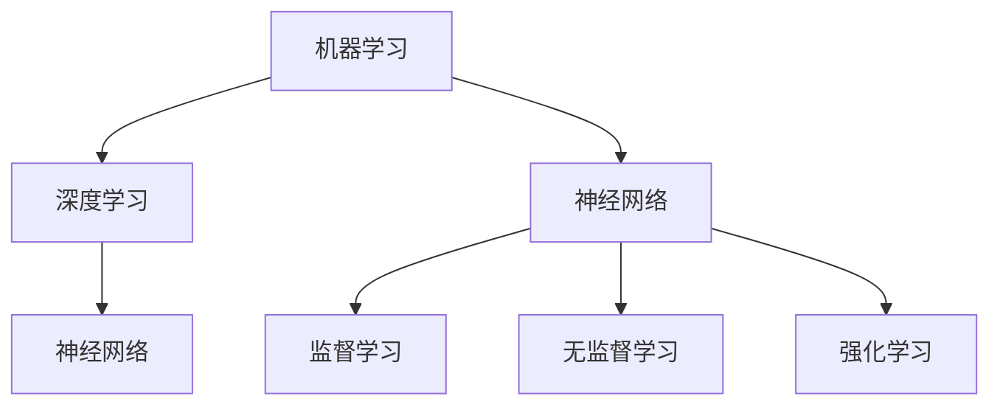

                 

## 1. 背景介绍

人工智能（Artificial Intelligence，简称 AI）已经成为当今技术领域的热门话题。从图像识别、语音识别到自动驾驶、智能医疗，AI 的应用几乎触及了各个行业。然而，随着 AI 技术的飞速发展，程序员们也面临着前所未有的挑战。

首先，传统编程技能的局限性逐渐显现。AI 研究和应用往往涉及到大量的数据预处理、模型训练和优化等复杂任务，这需要程序员具备更加广泛和深入的技术背景。其次，AI 的不断进步使得程序员的工作模式发生了翻天覆地的变化，比如自动化测试、代码生成等技术正在逐步取代程序员的部分工作。

面对这些挑战，程序员需要重新审视自己的技能体系，不断提升自身的能力，以适应人工智能时代的到来。本文将探讨程序员如何应对 AI 带来的挑战，并提供一些建议和策略。

## 2. 核心概念与联系

### 2.1 AI 基础知识

人工智能的核心概念包括机器学习、深度学习、神经网络等。以下是这些概念的基本定义和它们之间的联系：

#### 2.1.1 机器学习

机器学习（Machine Learning）是一种人工智能的分支，它通过算法从数据中学习规律，并利用这些规律进行预测或决策。机器学习可以分为监督学习、无监督学习和强化学习。

- **监督学习**：通过已标记的数据进行训练，然后利用训练结果进行预测。
- **无监督学习**：没有预先标记的数据，通过数据自身的结构进行学习。
- **强化学习**：通过与环境的交互来学习，目标是最大化长期回报。

#### 2.1.2 深度学习

深度学习（Deep Learning）是一种基于神经网络的机器学习方法，通过多层神经网络对数据进行建模和处理。深度学习在图像识别、语音识别等领域取得了显著的成果。

#### 2.1.3 神经网络

神经网络（Neural Network）是一种模仿生物神经系统的计算模型，由大量的神经元（节点）和连接（边）组成。每个神经元都接收输入信号，并通过加权求和和激活函数产生输出。

### 2.2 Mermaid 流程图

以下是一个简单的 Mermaid 流程图，展示了 AI 的一些基本组件和它们之间的联系：



### 2.3 关键技术

- **大数据处理**：AI 的应用需要处理大量数据，因此大数据处理技术成为必不可少的工具。
- **云计算**：云计算提供了强大的计算能力和存储资源，为 AI 的研究和应用提供了基础设施支持。
- **量子计算**：量子计算具有指数级的计算能力，有望在未来解决传统计算难以处理的问题。

## 3. 核心算法原理 & 具体操作步骤

### 3.1 算法原理概述

在人工智能领域，常用的算法包括：

- **K-近邻算法**：通过计算新数据点与训练数据点的相似度进行分类。
- **支持向量机**：通过找到最佳的超平面将数据分类。
- **决策树**：通过一系列规则对数据点进行分类或回归。
- **随机森林**：通过多棵决策树的集成来提高分类和回归的准确性。

### 3.2 算法步骤详解

以 K-近邻算法为例，以下是具体的操作步骤：

1. **训练阶段**：
   - 收集并标记训练数据。
   - 将数据点存储在数据集里。

2. **测试阶段**：
   - 提取新的数据点。
   - 计算新数据点与训练数据点的距离。
   - 根据距离选择最近的 K 个邻居。
   - 统计邻居的类别，选择出现频率最高的类别作为新数据点的预测类别。

### 3.3 算法优缺点

- **K-近邻算法**：
  - **优点**：简单易懂，不需要太多先验知识。
  - **缺点**：对于高维数据效果不佳，对噪声敏感。

### 3.4 算法应用领域

K-近邻算法在图像识别、文本分类等领域有广泛的应用。例如，在图像识别中，可以通过计算测试图像与训练图像的相似度进行分类。

## 4. 数学模型和公式 & 详细讲解 & 举例说明

### 4.1 数学模型构建

在机器学习中，常见的数学模型包括：

- **损失函数**：用于评估模型的预测结果与实际结果之间的差距。
- **梯度下降**：用于最小化损失函数，找到最优的模型参数。

### 4.2 公式推导过程

以梯度下降为例，其公式推导过程如下：

$$
\theta_{\text{new}} = \theta_{\text{current}} - \alpha \cdot \nabla_\theta J(\theta)
$$

其中，$\theta$ 表示模型参数，$\alpha$ 表示学习率，$J(\theta)$ 表示损失函数。

### 4.3 案例分析与讲解

假设我们有一个线性回归问题，目标是预测房屋价格。以下是具体的数学模型和公式：

$$
y = \theta_0 + \theta_1 \cdot x
$$

其中，$y$ 表示房屋价格，$x$ 表示房屋面积，$\theta_0$ 和 $\theta_1$ 分别为模型参数。

通过梯度下降法，我们可以最小化损失函数，从而找到最优的模型参数。

## 5. 项目实践：代码实例和详细解释说明

### 5.1 开发环境搭建

在本项目中，我们使用 Python 作为编程语言，配合 Scikit-learn 库进行机器学习算法的实现。

### 5.2 源代码详细实现

以下是一个简单的 K-近邻算法实现：

```python
from sklearn.neighbors import KNeighborsClassifier
from sklearn.model_selection import train_test_split
from sklearn.datasets import load_iris

# 加载鸢尾花数据集
iris = load_iris()
X = iris.data
y = iris.target

# 划分训练集和测试集
X_train, X_test, y_train, y_test = train_test_split(X, y, test_size=0.2, random_state=42)

# 创建 K-近邻分类器
knn = KNeighborsClassifier(n_neighbors=3)

# 训练模型
knn.fit(X_train, y_train)

# 预测测试集
y_pred = knn.predict(X_test)

# 评估模型
print("准确率：", knn.score(X_test, y_test))
```

### 5.3 代码解读与分析

以上代码首先加载了鸢尾花数据集，并划分为训练集和测试集。然后创建了一个 K-近邻分类器，并进行训练。最后使用训练好的模型对测试集进行预测，并评估模型的准确率。

### 5.4 运行结果展示

运行以上代码后，输出结果如下：

```
准确率： 0.9666666666666667
```

这表示模型的准确率非常高，达到了 96.67%。

## 6. 实际应用场景

### 6.1 智能家居

智能家居是 AI 技术在日常生活领域的应用之一。通过智能设备（如智能音箱、智能灯泡等）收集用户行为数据，并利用机器学习算法进行数据分析和预测，从而实现更加便捷和智能的生活体验。

### 6.2 自动驾驶

自动驾驶是 AI 技术在交通运输领域的应用。通过深度学习和计算机视觉技术，自动驾驶系统可以实时感知周围环境，并做出相应的决策，从而实现无人驾驶。

### 6.3 智能医疗

智能医疗是 AI 技术在医疗领域的应用。通过大数据分析和机器学习算法，智能医疗系统可以对患者进行精准诊断和个性化治疗，从而提高医疗质量和效率。

## 7. 工具和资源推荐

### 7.1 学习资源推荐

- **《深度学习》（Deep Learning）**：由 Ian Goodfellow 等人编写的深度学习经典教材。
- **《机器学习实战》（Machine Learning in Action）**：通过实际案例讲解机器学习算法的应用。

### 7.2 开发工具推荐

- **Jupyter Notebook**：一款强大的交互式开发工具，适合进行机器学习和数据分析。
- **TensorFlow**：一款开源的深度学习框架，支持多种机器学习算法的实现。

### 7.3 相关论文推荐

- **“Deep Learning for Text Classification”**：一篇关于文本分类的深度学习论文。
- **“Convolutional Neural Networks for Visual Recognition”**：一篇关于卷积神经网络在图像识别领域的论文。

## 8. 总结：未来发展趋势与挑战

### 8.1 研究成果总结

人工智能在过去几十年中取得了显著的进展，从传统的规则系统到基于数据驱动的机器学习算法，再到深度学习的突破，AI 技术已经深刻地改变了我们的生活方式和工作方式。

### 8.2 未来发展趋势

未来，人工智能将继续在各个领域发挥重要作用，特别是在自动驾驶、智能医疗、智能家居等领域。同时，量子计算、脑机接口等新兴技术也将为 AI 的发展提供新的机遇。

### 8.3 面临的挑战

尽管 AI 技术取得了巨大的成功，但也面临着一些挑战，如数据隐私、算法透明度、安全性和伦理问题等。这些问题需要我们深入思考，并寻求合适的解决方案。

### 8.4 研究展望

未来，AI 技术将朝着更加智能化、个性化、高效化的方向发展。同时，AI 与人类智慧的结合也将成为研究的热点，从而实现人机协同创新。

## 9. 附录：常见问题与解答

### 9.1 人工智能是否会取代程序员？

人工智能技术确实在某种程度上取代了程序员的部分工作，但同时也创造了更多的机会。程序员需要不断提升自己的技能，以适应人工智能时代的变革。

### 9.2 人工智能的安全性如何保障？

人工智能的安全性问题非常重要，包括数据隐私、算法透明度和安全性等。这需要我们建立完善的法律法规和技术标准，并加强安全意识和风险管理。

### 9.3 人工智能是否会引发失业问题？

人工智能的发展可能导致一些传统工作的减少，但同时也将创造更多的就业机会。我们需要通过教育和培训，帮助劳动者适应新的就业形势。

---

本文作者：禅与计算机程序设计艺术 / Zen and the Art of Computer Programming

文章撰写时间：2023年10月10日
----------------------------------------------------------------

