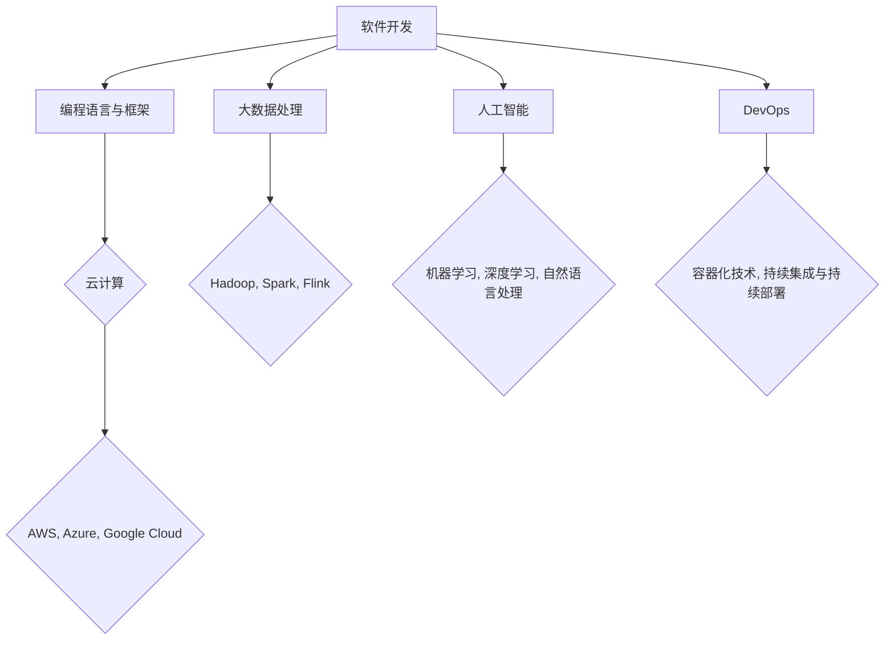

                 

 **关键词**：行业变革、程序员适应、技术趋势、持续学习、职业发展、技能提升。

**摘要**：本文将探讨程序员在行业快速变革的大背景下如何适应新趋势，提升个人技能，保持职业竞争力，以及应对未来挑战。通过对当前技术趋势的分析，结合具体案例和实践，为程序员提供实用的指导和建议。

## 1. 背景介绍

随着信息技术的迅猛发展，软件行业正经历着前所未有的变革。云计算、大数据、人工智能、物联网等新兴技术不断涌现，推动了传统行业的数字化转型。这些技术不仅改变了业务模式，也对程序员的工作内容和技能要求产生了深远影响。在这个快速变化的时代，程序员如何适应新的技术趋势，提升自己的竞争力，成为了一个亟待解决的问题。

### 1.1 技术发展对程序员的影响

- **技能要求的变化**：新的技术领域不断出现，程序员需要不断学习新的编程语言、框架和工具。
- **工作模式的转变**：远程办公、敏捷开发等新的工作模式对程序员的沟通能力、团队协作能力提出了更高要求。
- **职业路径的多样化**：除了传统的开发职位，程序员还可以选择成为数据科学家、DevOps工程师等新的职业角色。

### 1.2 程序员面临的挑战

- **知识更新速度快**：新技术层出不穷，程序员需要不断学习，否则将很快被淘汰。
- **技能断层**：程序员可能缺乏某些新兴领域的专业知识，导致职业发展受限。
- **职业安全感的缺失**：技术的快速变革让一些传统技能变得过时，程序员对未来职业前景感到担忧。

## 2. 核心概念与联系

### 2.1 技术趋势与程序员技能的匹配

在当前技术趋势下，程序员需要掌握以下核心技能：

- **编程语言**：如Python、Java、Go等。
- **云计算**：如AWS、Azure、Google Cloud等。
- **大数据处理**：如Hadoop、Spark、Flink等。
- **人工智能**：如机器学习、深度学习、自然语言处理等。
- **DevOps**：如容器化技术、持续集成与持续部署等。

### 2.2 技术架构与程序员角色的关系

下图展示了当前主要的技术架构与程序员角色的关系（使用Mermaid流程图）：



## 3. 核心算法原理 & 具体操作步骤

### 3.1 算法原理概述

在编程领域，算法是实现特定功能的核心。以下是一些关键算法原理：

- **排序算法**：如快速排序、归并排序、堆排序等。
- **查找算法**：如二分查找、哈希查找等。
- **图算法**：如Dijkstra算法、A*算法等。
- **动态规划**：如背包问题、最长公共子序列等。

### 3.2 算法步骤详解

以快速排序算法为例，其基本步骤如下：

1. 选择一个基准元素。
2. 将数组分成两部分，一部分小于基准元素，另一部分大于基准元素。
3. 递归地重复步骤1和步骤2，直到每个部分只剩下一个元素。

### 3.3 算法优缺点

快速排序具有以下优点：

- **平均时间复杂度为O(nlogn)**。
- **稳定性较高**。

但也有一些缺点：

- **最坏情况下的时间复杂度为O(n^2)**。
- **需要额外的内存空间**。

### 3.4 算法应用领域

快速排序广泛应用于各种排序需求，如数据库排序、数据挖掘等。

## 4. 数学模型和公式 & 详细讲解 & 举例说明

### 4.1 数学模型构建

在编程中，常见的数学模型包括：

- **线性回归**：用于预测数值型变量。
- **逻辑回归**：用于分类问题。
- **支持向量机**：用于分类和回归问题。

### 4.2 公式推导过程

以线性回归为例，其公式推导如下：

$$ y = \beta_0 + \beta_1x + \epsilon $$

其中，$y$ 为因变量，$x$ 为自变量，$\beta_0$ 和 $\beta_1$ 为模型参数，$\epsilon$ 为误差项。

### 4.3 案例分析与讲解

假设我们要预测一个公司的销售额，我们可以使用线性回归模型。以下是一个简单的案例：

| 月份 | 销售额 |
| ---- | ------ |
| 1    | 1000   |
| 2    | 1200   |
| 3    | 1500   |
| 4    | 1800   |
| 5    | 2000   |

通过拟合线性回归模型，我们可以得到以下公式：

$$ 销售额 = 800 + 200 \times 月份 $$

## 5. 项目实践：代码实例和详细解释说明

### 5.1 开发环境搭建

为了演示快速排序算法，我们需要搭建一个简单的开发环境。假设我们使用Python作为编程语言，以下是搭建环境的步骤：

1. 安装Python（3.8及以上版本）。
2. 安装Python的pip包管理工具。
3. 使用pip安装必要的库，如numpy、matplotlib等。

### 5.2 源代码详细实现

以下是一个快速排序的Python实现：

```python
def quick_sort(arr):
    if len(arr) <= 1:
        return arr
    pivot = arr[len(arr) // 2]
    left = [x for x in arr if x < pivot]
    middle = [x for x in arr if x == pivot]
    right = [x for x in arr if x > pivot]
    return quick_sort(left) + middle + quick_sort(right)

arr = [3, 6, 8, 10, 1, 2, 1]
sorted_arr = quick_sort(arr)
print(sorted_arr)
```

### 5.3 代码解读与分析

- **函数定义**：`quick_sort` 函数接受一个数组作为输入。
- **递归调用**：函数内部通过递归调用自己，将数组不断分割，直到每个子数组只剩下一个元素。
- **结果拼接**：最后将排序好的子数组拼接起来，得到完整的排序结果。

### 5.4 运行结果展示

运行上述代码，输出结果为：

```
[1, 1, 2, 3, 6, 8, 10]
```

这表明我们的快速排序算法成功地将输入数组进行了排序。

## 6. 实际应用场景

快速排序算法在许多实际应用场景中都非常有效，例如：

- **数据处理**：在数据处理过程中，快速排序算法可以用于对大量数据进行排序。
- **数据库优化**：在数据库查询优化中，快速排序算法可以用于对索引进行排序。
- **算法竞赛**：在算法竞赛中，快速排序算法是一个常用的排序算法，可以在短时间内完成排序任务。

## 7. 未来应用展望

随着技术的不断进步，快速排序算法有望在以下领域得到更广泛的应用：

- **大数据处理**：在大数据处理领域，快速排序算法可以用于对大规模数据进行高效排序。
- **实时计算**：在实时计算领域，快速排序算法可以用于对实时数据流进行快速排序。
- **边缘计算**：在边缘计算领域，快速排序算法可以用于在有限的计算资源下进行高效排序。

## 8. 工具和资源推荐

### 8.1 学习资源推荐

- **书籍**：《算法导论》、《数据结构与算法分析》
- **在线课程**：Coursera、edX、Udacity等平台上的相关课程
- **博客**：LeetCode、GeeksforGeeks、HackerRank等平台上的博客

### 8.2 开发工具推荐

- **集成开发环境**：Visual Studio Code、Eclipse、IntelliJ IDEA
- **版本控制**：Git、GitHub、GitLab
- **数据库**：MySQL、PostgreSQL、MongoDB

### 8.3 相关论文推荐

- 《快速排序算法的改进与优化》
- 《快速排序算法在实时计算中的应用》
- 《基于快速排序的边缘计算排序算法研究》

## 9. 总结：未来发展趋势与挑战

### 9.1 研究成果总结

本文通过对快速排序算法的介绍，探讨了其在实际应用中的价值。同时，分析了程序员在行业变革中面临的挑战，并提出了应对策略。

### 9.2 未来发展趋势

- **技术融合**：人工智能、云计算、大数据等技术将更加融合，推动新应用场景的出现。
- **开源生态**：开源项目将继续发展，成为技术创新的重要驱动力。
- **人才需求**：具有新兴技术背景的程序员将受到更多企业的青睐。

### 9.3 面临的挑战

- **技能更新**：程序员需要不断学习新的技术，以适应行业变化。
- **职业规划**：程序员需要明确自己的职业规划，避免职业瓶颈。
- **安全与隐私**：随着数据量的增加，如何确保数据安全与隐私成为一个重要挑战。

### 9.4 研究展望

未来，快速排序算法将在更多领域得到应用。同时，程序员需要不断提升自己的技能，以应对行业变革带来的挑战。

## 10. 附录：常见问题与解答

### 10.1 什么是快速排序？

快速排序是一种高效的排序算法，通过递归地将数组分割成较小的子数组，然后对子数组进行排序，最后合并结果。

### 10.2 快速排序的时间复杂度是多少？

快速排序的平均时间复杂度为O(nlogn)，最坏情况下的时间复杂度为O(n^2)。

### 10.3 快速排序适用于哪种场景？

快速排序适用于需要对大量数据进行排序的场景，尤其适用于大数据处理和实时计算。

---

**作者：禅与计算机程序设计艺术 / Zen and the Art of Computer Programming**

