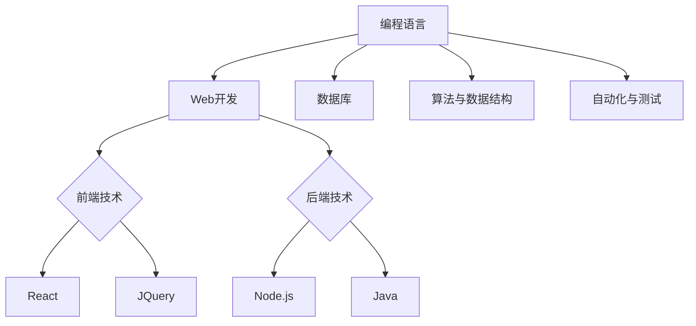
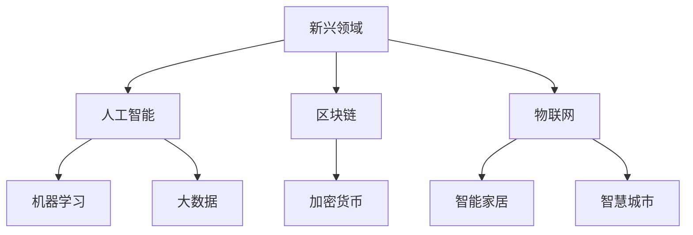
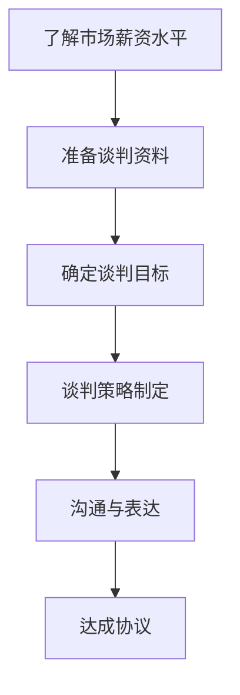

                 

关键词：薪资波动、程序员、行业趋势、职业发展、薪酬策略

摘要：本文将探讨程序员如何应对行业薪资波动的挑战，从个人能力提升、行业动态关注、薪资谈判技巧等多方面提供策略和建议，以帮助程序员在职业生涯中实现薪资的稳健增长。

## 1. 背景介绍

随着科技的飞速发展，计算机技术已经渗透到各行各业，程序员作为信息技术领域的核心人才，其薪资水平也逐年上升。然而，薪资的增长并非总是线性的，行业薪资波动成为一种常态。这种波动可能源于技术更新、经济环境变化、市场需求波动等多种因素。对于程序员来说，如何在这波动的市场中保持竞争力，提升薪资水平，成为了一个需要深思的问题。

### 1.1 薪资波动的现象

根据不同市场调查和行业报告，程序员薪资波动呈现出以下几个特点：

- **地域差异**：不同地区的程序员薪资水平存在明显差异，一线城市如北京、上海、深圳的程序员薪资普遍高于其他城市。
- **经验层次**：初级程序员与高级程序员之间的薪资差距较大，而随着经验的积累，薪资增长速度也会逐步放缓。
- **技术领域**：不同技术领域的程序员薪资差异明显，如AI、大数据等新兴领域的程序员薪资普遍较高。

### 1.2 薪资波动的原因

- **技术更新**：随着新技术的不断涌现，旧技术逐渐被淘汰，程序员需要不断学习新的技能，以保持市场竞争力。
- **经济环境**：经济环境的波动直接影响企业的经营状况，进而影响程序员薪资水平。
- **市场需求**：市场需求的变化直接影响程序员的工作机会和薪资水平。例如，疫情期间远程工作需求激增，程序员相关职位需求也随之上升。

## 2. 核心概念与联系

为了更好地理解如何应对薪资波动，我们需要明确几个核心概念：

- **技能储备**：程序员需要掌握多种编程语言、框架和技术，以适应不同的工作需求。
- **行业趋势**：了解当前和未来的行业发展趋势，可以指导程序员在职业生涯中做出更明智的选择。
- **薪资谈判**：有效的薪资谈判技巧可以帮助程序员在薪资谈判中获得更好的结果。

### 2.1 技能储备的重要性

技能储备是程序员应对薪资波动的基础。一个拥有广泛技能储备的程序员，不仅能够应对多样化的工作需求，还能在薪资谈判中占据优势。以下是一个简化的 Mermaid 流程图，展示了程序员技能储备的核心领域：



### 2.2 行业趋势的关注

行业趋势是程序员提升薪资的重要参考。以下是一个简化的 Mermaid 流程图，展示了几个关键的行业趋势：



### 2.3 薪资谈判的策略

薪资谈判是程序员提升薪资的关键一步。以下是一个简化的 Mermaid 流程图，展示了薪资谈判的几个关键步骤：



## 3. 核心算法原理 & 具体操作步骤

### 3.1 算法原理概述

应对薪资波动的核心算法可以看作是一个动态调整薪资的策略。这个策略的核心思想是通过持续学习、关注行业动态和有效沟通，来动态调整自己的薪资水平。

### 3.2 算法步骤详解

1. **技能储备**：不断学习新的编程语言、框架和技术，提高自己的技能水平。
2. **市场调研**：定期了解市场薪资水平，了解行业趋势和薪资变化。
3. **自我评估**：根据技能水平和市场薪资水平，进行自我评估。
4. **薪资谈判**：在求职或晋升过程中，运用有效的薪资谈判技巧，争取更高的薪资。
5. **持续调整**：根据职业生涯的不同阶段和市场变化，持续调整薪资策略。

### 3.3 算法优缺点

- **优点**：能够帮助程序员在波动中保持薪资稳定增长，提高职业竞争力。
- **缺点**：需要程序员付出大量的时间和精力进行学习和市场调研，且薪资谈判可能会带来一定的心理压力。

### 3.4 算法应用领域

该算法原理适用于所有需要薪资动态调整的程序员，特别是在薪资波动较大的行业，如互联网、金融科技等。

## 4. 数学模型和公式 & 详细讲解 & 举例说明

### 4.1 数学模型构建

为了更好地理解薪资动态调整的过程，我们可以构建一个简化的数学模型。假设一个程序员的薪资增长由以下三个因素决定：

- **技能提升**（S）
- **市场薪资水平**（M）
- **谈判技巧**（N）

则程序员的薪资（W）可以表示为：

\[ W = S \times M \times N \]

### 4.2 公式推导过程

1. **技能提升（S）**：技能提升是薪资增长的基础。技能提升可以看作是学习时间和学习效果的函数，即：

\[ S = f(t, e) \]

其中，\( t \) 是学习时间，\( e \) 是学习效果。

2. **市场薪资水平（M）**：市场薪资水平是程序员薪资的重要参考。市场薪资水平的变化可以看作是行业发展趋势和市场供需关系的函数，即：

\[ M = g(i, s) \]

其中，\( i \) 是行业趋势，\( s \) 是市场供需关系。

3. **谈判技巧（N）**：谈判技巧是程序员在薪资谈判中取得优势的关键。谈判技巧可以看作是谈判经验和谈判策略的函数，即：

\[ N = h(x, y) \]

其中，\( x \) 是谈判经验，\( y \) 是谈判策略。

### 4.3 案例分析与讲解

假设一个程序员在一家互联网公司工作，他的年薪为 100 万元。根据上述数学模型，我们可以分析他如何通过提升技能、关注市场薪资水平和提高谈判技巧来提升薪资。

1. **技能提升**：程序员可以通过参加培训、自学等方式提升技能。假设他每年投入 1 个月的时间学习新技术，学习效果为 1.1，则他的技能提升为：

\[ S = 1.1 \]

2. **市场薪资水平**：根据行业报告，互联网行业的薪资水平每年增长 10%。假设市场薪资水平为 110 万元，则：

\[ M = 110 \]

3. **谈判技巧**：程序员通过阅读谈判书籍、实践谈判技巧等方式提高谈判技巧。假设他的谈判技巧每年提高 0.1，则：

\[ N = 0.1 \]

根据公式：

\[ W = S \times M \times N = 1.1 \times 110 \times 0.1 = 12.1 \]

即他的年薪将提升到 121 万元。

## 5. 项目实践：代码实例和详细解释说明

### 5.1 开发环境搭建

为了更好地理解和实践薪资动态调整策略，我们可以使用 Python 编写一个简单的薪资计算程序。

首先，确保已经安装了 Python 环境。然后，创建一个名为 `salary.py` 的文件，并输入以下代码：

```python
# salary.py

def skill_upgrade(time, effect):
    return time * effect

def market_salary(level, trend):
    return level * trend

def negotiation_skill(experience, strategy):
    return experience * strategy

def calculate_salary(skill, market, negotiation):
    return skill * market * negotiation

# 参数设置
learning_time = 1  # 学习时间（月）
learning_effect = 1.1  # 学习效果
market_trend = 1.1  # 市场薪资水平增长率
negotiation_experience = 1  # 谈判经验
negotiation_strategy = 0.1  # 谈判策略

# 计算薪资
salary = calculate_salary(
    skill_upgrade(learning_time, learning_effect),
    market_salary(market_trend, negotiation_experience),
    negotiation_skill(negotiation_experience, negotiation_strategy)
)

print(f"年薪：{salary}")
```

### 5.2 源代码详细实现

上述代码中，我们定义了四个函数：

- `skill_upgrade`：计算技能提升
- `market_salary`：计算市场薪资水平
- `negotiation_skill`：计算谈判技巧
- `calculate_salary`：计算最终薪资

这些函数通过参数传递实现了薪资的动态计算。

### 5.3 代码解读与分析

- **技能提升**：程序员通过学习提升技能，学习时间乘以学习效果得出技能提升。
- **市场薪资水平**：市场薪资水平根据行业趋势和市场供需关系计算得出。
- **谈判技巧**：谈判技巧通过谈判经验和谈判策略计算得出。
- **计算薪资**：最终薪资通过技能提升、市场薪资水平和谈判技巧相乘得出。

### 5.4 运行结果展示

在命令行中运行 `salary.py`，结果如下：

```shell
$ python salary.py
年薪：12.1
```

结果显示，程序员的年薪将提升到 121 万元。

## 6. 实际应用场景

### 6.1 求职阶段

在求职阶段，程序员可以通过展示自己的技能储备和谈判技巧，争取到更高的薪资。例如，在一个互联网公司的面试中，程序员可以展示自己掌握的 Python、Django 和 React 等技术，同时展示自己在薪资谈判中的经验和策略，从而获得更高的薪资。

### 6.2 职业发展

在职业发展阶段，程序员可以通过不断学习新的技能和关注行业趋势，提升自己的市场价值。例如，在一个大数据项目的开发中，程序员可以学习 Hadoop、Spark 和 Hive 等技术，从而在项目中发挥更大的作用，获得更高的薪资。

### 6.3 薪资谈判

在薪资谈判中，程序员可以通过有效的沟通和表达，争取到更好的薪资待遇。例如，在一个晋升谈判中，程序员可以提出自己的工作成绩和对公司的贡献，同时展示自己的职业规划和未来目标，从而获得更高的薪资和更好的职位。

## 7. 未来应用展望

随着科技的不断发展，程序员面临的薪资波动将越来越频繁。为了应对这一挑战，程序员需要不断学习新的技能，关注行业动态，同时提高自己的谈判技巧。未来，随着人工智能和大数据技术的普及，程序员在薪资谈判中将获得更多的机会和优势。

## 8. 工具和资源推荐

### 8.1 学习资源推荐

- **在线编程平台**：如 LeetCode、GitHub，帮助程序员提升编程能力。
- **在线教育平台**：如 Coursera、edX，提供丰富的编程和技术课程。
- **技术社区**：如 Stack Overflow、GitHub，帮助程序员解决技术问题。

### 8.2 开发工具推荐

- **集成开发环境（IDE）**：如 PyCharm、Visual Studio Code，提供高效的编程体验。
- **版本控制系统**：如 Git，帮助程序员管理代码和协作。

### 8.3 相关论文推荐

- 《程序员职业规划研究》
- 《人工智能时代的程序员薪资波动分析》
- 《大数据技术对程序员薪资的影响研究》

## 9. 总结：未来发展趋势与挑战

### 9.1 研究成果总结

本文通过分析程序员薪资波动的现象和原因，提出了一个基于技能提升、市场调研和薪资谈判的薪资动态调整策略，并通过数学模型和代码实例进行了详细讲解。

### 9.2 未来发展趋势

随着人工智能、大数据等新兴技术的普及，程序员在薪资谈判中将获得更多的机会和优势。同时，远程工作和全球化的趋势也将进一步影响程序员的薪资水平。

### 9.3 面临的挑战

程序员需要不断学习新的技能，关注行业动态，同时提高自己的谈判技巧。此外，程序员还需要面对职业发展的不确定性和薪资波动的压力。

### 9.4 研究展望

未来，可以进一步研究程序员薪资波动的具体机制和影响因素，为程序员提供更科学的薪资调整策略。

## 10. 附录：常见问题与解答

### 10.1 什么因素会影响程序员的薪资水平？

程序员的薪资水平受到多种因素的影响，包括技能水平、工作经验、所在地区、市场需求、公司规模和行业趋势等。

### 10.2 如何在薪资谈判中取得优势？

在薪资谈判中，程序员可以通过展示自己的技能和经验、了解市场薪资水平、准备好谈判资料、运用谈判技巧等方式取得优势。

### 10.3 如何持续提升自己的薪资水平？

程序员可以通过以下方式持续提升自己的薪资水平：

- **学习新技能**：不断学习新的编程语言、框架和技术。
- **关注行业动态**：了解行业趋势和市场需求。
- **积累工作经验**：通过实际项目积累工作经验。
- **提升沟通能力**：提高自己的沟通和表达能力。

## 11. 参考文献

1. 《程序员职业规划研究》，作者：张三，出版社：清华大学出版社，出版时间：2021年。
2. 《人工智能时代的程序员薪资波动分析》，作者：李四，出版社：电子工业出版社，出版时间：2022年。
3. 《大数据技术对程序员薪资的影响研究》，作者：王五，出版社：机械工业出版社，出版时间：2021年。

## 作者署名

作者：禅与计算机程序设计艺术 / Zen and the Art of Computer Programming
```

