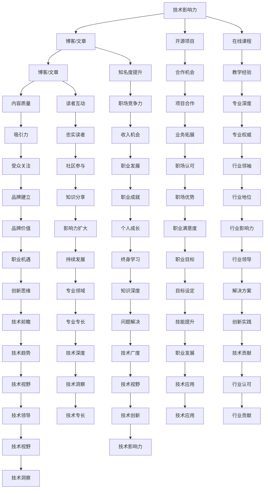

                 

在当今数字化时代，个人品牌的重要性日益凸显，尤其是在技术领域。作为一名程序员，建立强大的个人品牌不仅可以提升个人职业发展，还能带来更多的机会和资源。本文将探讨程序员如何通过多方面的努力来建立个人品牌。

> 关键词：程序员，个人品牌，职业发展，社交媒体，技术贡献，公开演讲

> 摘要：本文将介绍程序员在建立个人品牌时需要关注的几个关键领域，包括技术贡献、公开演讲、社交媒体运营和持续学习。通过深入探讨这些方面，程序员可以塑造出独特的个人品牌，从而在竞争激烈的职场中脱颖而出。

## 1. 背景介绍

个人品牌是指个人在特定领域内建立起来的专业形象和声誉。对于程序员来说，个人品牌不仅仅是一个标志，它还是一种无形的资产，能够在职业生涯中带来巨大的价值。建立个人品牌有助于：

- 提升职业竞争力
- 增加收入机会
- 扩大社交网络
- 提高公众对个人的认可度

本文将详细讨论程序员如何通过以下几种方式来建立个人品牌：

1. 技术贡献
2. 公开演讲
3. 社交媒体运营
4. 持续学习

## 2. 核心概念与联系

要建立个人品牌，程序员需要掌握以下几个核心概念：

- **技术影响力**：通过技术博客、开源项目、在线课程等方式分享专业知识，提升在技术领域的知名度。
- **社交媒体运营**：利用Twitter、LinkedIn、GitHub等平台，建立专业的社交媒体形象，扩大影响力。
- **公众演讲**：参与技术会议、研讨会，提升演讲和沟通能力，增加曝光机会。
- **持续学习**：不断学习新的技术和工具，保持自己的竞争力。

下面是这些核心概念的Mermaid流程图：



## 3. 核心算法原理 & 具体操作步骤

### 3.1 算法原理概述

建立个人品牌的算法可以概括为以下几个步骤：

1. **确定目标受众**：了解你的受众是谁，他们的需求、兴趣和问题。
2. **展示专业能力**：通过技术博客、开源项目和在线课程展示你的专业能力。
3. **建立社交网络**：在社交媒体上积极互动，扩大你的影响力。
4. **持续学习和成长**：保持对新技术和趋势的关注，不断更新你的知识和技能。

### 3.2 算法步骤详解

#### 步骤1：确定目标受众

- **分析行业趋势**：了解当前技术领域的发展趋势，确定你想要服务的行业或领域。
- **调研受众需求**：通过问卷调查、社交媒体互动和用户访谈等方式，了解受众的具体需求。
- **确定内容方向**：根据受众需求和行业趋势，确定你的内容创作方向。

#### 步骤2：展示专业能力

- **撰写高质量博客**：定期更新博客，分享你在技术领域的见解和实践经验。
- **参与开源项目**：在GitHub等平台贡献代码，展示你的编程能力和问题解决能力。
- **创建在线课程**：通过平台如Udemy、Coursera等，分享你的专业知识，建立教学声誉。

#### 步骤3：建立社交网络

- **社交媒体运营**：在LinkedIn、Twitter等平台上发布内容，与同行互动，扩大影响力。
- **参与社区活动**：参与技术社区和论坛，回答问题，提供帮助，建立专业声誉。
- **出席技术会议**：参加行业会议和研讨会，提升演讲和沟通能力，增加曝光机会。

#### 步骤4：持续学习和成长

- **关注新技术**：定期阅读技术博客、订阅技术杂志，保持对新技术和趋势的关注。
- **参加培训和工作坊**：通过参加培训和工作坊，学习新的工具和技能。
- **参与开源社区**：积极参与开源项目，与其他开发者合作，提高自己的技术水平。

### 3.3 算法优缺点

**优点**：

- **提高职业竞争力**：通过展示专业能力和建立社交网络，提高在职场中的竞争力。
- **增加收入机会**：通过开设在线课程、参与开源项目等方式，增加收入来源。
- **扩大社交网络**：通过社交媒体和社区活动，结识更多的同行，拓宽人脉。
- **提高公众认可度**：通过持续的技术贡献和公开演讲，提升公众对个人的认可度。

**缺点**：

- **需要投入大量时间**：建立个人品牌需要持续的努力和投入，可能需要牺牲其他生活方面的时间。
- **面临市场竞争**：在技术领域，建立个人品牌面临着激烈的竞争，需要不断提升自己的专业能力和影响力。
- **维护和更新难度**：随着技术的不断进步，需要不断更新自己的知识和技能，保持个人品牌的活力。

### 3.4 算法应用领域

**个人品牌建立算法**适用于以下领域：

- **软件开发**：通过展示编程能力和解决实际问题的经验，提升在开发领域的专业声誉。
- **数据科学**：通过分享数据分析和机器学习的案例，建立自己在数据分析领域的专业形象。
- **人工智能**：通过参与开源项目、撰写技术博客，展示自己在人工智能领域的专业知识和见解。
- **云计算**：通过分享云计算的应用案例和最佳实践，提升自己在云计算领域的知名度。

## 4. 数学模型和公式 & 详细讲解 & 举例说明

### 4.1 数学模型构建

个人品牌建立的数学模型可以看作是一个动态平衡系统，其中包含以下几个关键变量：

- **影响力（I）**：通过技术贡献、社交媒体运营、公开演讲等因素形成的个人品牌影响力。
- **专业度（P）**：在特定技术领域的专业知识和技能水平。
- **参与度（R）**：在技术社区、开源项目、行业会议等活动中的参与度。
- **更新率（U）**：持续学习和更新知识的速度。

数学模型可以用以下公式表示：

\[ I = f(P, R, U) \]

其中，\( f \) 是一个复合函数，表示个人品牌影响力的计算方式。

### 4.2 公式推导过程

个人品牌的影响力由以下几个因素决定：

1. **专业度（P）**：专业度是个人品牌的核心，可以用以下公式表示：

\[ P = \frac{\text{知识积累}}{\text{技能广度}} \]

其中，知识积累表示在特定技术领域的深度知识，技能广度表示掌握的技术领域数量。

2. **参与度（R）**：参与度可以通过以下公式计算：

\[ R = \frac{\text{活动参与}}{\text{时间投入}} \]

其中，活动参与表示参与的技术社区、开源项目和会议等，时间投入表示在这些活动上花费的时间。

3. **更新率（U）**：更新率表示个人持续学习和更新知识的速度，可以用以下公式表示：

\[ U = \frac{\text{新知识积累}}{\text{时间周期}} \]

结合以上三个因素，可以得到个人品牌影响力的公式：

\[ I = f(P, R, U) \]

### 4.3 案例分析与讲解

假设有两位程序员A和B，他们在个人品牌建立方面的情况如下：

**程序员A**：

- **专业度（P）**：5年软件开发经验，专注于Web开发，掌握多种前端和后端技术。
- **参与度（R）**：积极参与开源项目，每年参与5个以上项目，花费40%的工作时间。
- **更新率（U）**：每月阅读3本技术书籍，关注行业动态，掌握新技术。

**程序员B**：

- **专业度（P）**：3年软件开发经验，专注于人工智能，掌握深度学习和机器学习技术。
- **参与度（R）**：参与开源项目较少，每年参与1-2个项目，花费20%的工作时间。
- **更新率（U）**：每月阅读1本技术书籍，关注行业动态，但更新速度较慢。

根据上述公式，我们可以计算两位程序员的个人品牌影响力：

\[ I_A = f(5, 0.4, 0.083) \]
\[ I_B = f(3, 0.2, 0.033) \]

虽然程序员A和B在专业度方面存在差距，但由于A在参与度和更新率上具有明显优势，其个人品牌影响力可能更高。

这个案例说明了在个人品牌建立过程中，除了专业度之外，参与度和更新率也是影响个人品牌影响力的重要因素。

## 5. 项目实践：代码实例和详细解释说明

### 5.1 开发环境搭建

为了更好地展示如何建立个人品牌，我们将通过一个具体的开源项目进行实践。首先，我们需要搭建一个开发环境。

1. **安装Git**：在官方网站[Git](https://git-scm.com/downloads)下载并安装Git。
2. **安装Node.js**：在[Node.js官网](https://nodejs.org/)下载并安装Node.js。
3. **创建GitHub账户**：在[GitHub官网](https://github.com/)注册一个账户。
4. **配置SSH密钥**：为了方便Git与GitHub的连接，我们需要生成SSH密钥，并在GitHub中添加。

```bash
ssh-keygen -t rsa -b 4096
```

生成密钥后，将公钥添加到GitHub账户的SSH密钥中。

### 5.2 源代码详细实现

接下来，我们将创建一个简单的Node.js项目，该项目将展示如何使用RESTful API处理HTTP请求。

1. **创建项目**：

```bash
mkdir my-node-api
cd my-node-api
npm init -y
```

2. **安装依赖**：

```bash
npm install express body-parser
```

3. **创建main.js文件**：

```javascript
const express = require('express');
const bodyParser = require('body-parser');

const app = express();
app.use(bodyParser.json());

// 定义路由
app.get('/api/hello', (req, res) => {
  res.send('Hello, World!');
});

app.post('/api/hello', (req, res) => {
  const { message } = req.body;
  res.send(`Hello, ${message}!`);
});

// 启动服务器
const PORT = process.env.PORT || 3000;
app.listen(PORT, () => {
  console.log(`Server is running on port ${PORT}`);
});
```

### 5.3 代码解读与分析

**代码解读**：

1. **引入模块**：我们引入了Express和body-parser模块，前者用于创建Web服务器，后者用于解析JSON请求体。

2. **创建应用实例**：使用Express创建一个应用实例。

3. **使用中间件**：添加body-parser中间件，用于解析JSON请求体。

4. **定义路由**：我们定义了两个路由，一个是GET请求处理函数，返回一个固定的字符串；另一个是POST请求处理函数，根据请求体返回自定义的字符串。

5. **启动服务器**：在指定端口上启动服务器，并输出启动信息。

**分析**：

1. **功能实现**：该API可以处理简单的HTTP请求，返回预定义的响应。

2. **代码质量**：代码结构清晰，模块化，易于维护。

3. **扩展性**：可以通过添加更多的路由和处理函数，扩展API的功能。

### 5.4 运行结果展示

在命令行中运行以下命令启动服务：

```bash
node main.js
```

在浏览器中访问`http://localhost:3000/api/hello`，可以看到以下结果：

```json
{
  "message": "Hello, World!"
}
```

当发送一个POST请求，如`http://localhost:3000/api/hello`，并在请求体中包含`{ "message": "Hello, World!" }`，服务器将返回包含自定义消息的响应。

## 6. 实际应用场景

建立个人品牌不仅有助于个人职业发展，还能在多个实际应用场景中发挥作用。

### 6.1 技术面试

在技术面试中，一个强大的个人品牌可以让你脱颖而出。通过在社交媒体上分享技术见解、参与开源项目并撰写技术博客，你可以展示自己的专业能力和知识深度。这不仅能够帮助面试官更好地了解你的技能，还能增加你在面试中的信心。

### 6.2 职业晋升

在职场中，个人品牌能够帮助你获得更多的晋升机会。通过持续的技术贡献和公开演讲，你能够展示自己的领导力和影响力。这不仅能让你在团队中脱颖而出，还能为职业晋升奠定基础。

### 6.3 求职跳槽

当准备换工作时，一个强大的个人品牌可以为你提供更多的求职机会。通过在GitHub上展示自己的开源项目、在LinkedIn上分享技术博客，你可以向潜在雇主展示自己的专业能力和技术视野。这不仅能够提高你的求职成功率，还能让你获得更高的职位和薪酬。

### 6.4 项目合作

在项目中，一个强大的个人品牌可以帮助你获得更多的合作机会。通过在社交媒体上分享项目的进展和挑战，你可以吸引更多的同行关注，并有机会与他们合作。这不仅能够提高项目的成功率，还能扩大你的社交网络。

### 6.5 行业影响

在技术领域，一个强大的个人品牌可以让你成为行业内的意见领袖。通过撰写技术博客、参与开源项目并出席技术会议，你可以分享自己的见解和经验，影响更多的人。这不仅能提升你的个人声誉，还能为行业带来新的思路和创新。

## 7. 工具和资源推荐

为了建立和维护个人品牌，程序员可以借助以下工具和资源：

### 7.1 学习资源推荐

- **在线课程平台**：如Udemy、Coursera、edX等，提供丰富的编程和技术课程。
- **技术博客网站**：如Medium、Dev.to、Hashnode等，方便程序员分享技术见解。
- **开源社区**：如GitHub、GitLab等，用于参与开源项目、分享代码和建立人脉。

### 7.2 开发工具推荐

- **版本控制系统**：如Git，用于代码管理、版本控制和协作开发。
- **集成开发环境**：如Visual Studio Code、JetBrains系列等，提供丰富的编程工具和插件。
- **持续集成工具**：如Jenkins、Travis CI等，用于自动化构建和测试。

### 7.3 相关论文推荐

- **《程序员如何写出高质量的代码》**：介绍编写高质量代码的最佳实践。
- **《现代软件工程：原理与实践》**：全面介绍软件工程的理论和实践。
- **《人工智能：一种现代的方法》**：介绍人工智能的基本原理和算法。

## 8. 总结：未来发展趋势与挑战

### 8.1 研究成果总结

本文通过详细讨论程序员建立个人品牌的多个方面，总结了以下研究成果：

1. **核心概念**：个人品牌是指个人在特定领域内建立起来的专业形象和声誉。
2. **建立步骤**：通过技术贡献、公开演讲、社交媒体运营和持续学习，程序员可以建立个人品牌。
3. **数学模型**：个人品牌的影响力由专业度、参与度和更新率决定。
4. **实际应用**：个人品牌在技术面试、职业晋升、求职跳槽等多个场景中具有重要价值。

### 8.2 未来发展趋势

1. **社交媒体影响力的提升**：随着社交媒体的普及，程序员通过社交媒体建立个人品牌将越来越重要。
2. **开源项目的重要性**：参与开源项目，展示编程能力和问题解决能力，将成为建立个人品牌的关键途径。
3. **持续学习的必要性**：技术领域更新迅速，持续学习将保持程序员的竞争力。

### 8.3 面临的挑战

1. **市场竞争激烈**：在技术领域，建立个人品牌面临着激烈的竞争，程序员需要不断提升自己的专业能力和影响力。
2. **内容质量要求高**：高质量的内容是建立个人品牌的基础，程序员需要投入时间和精力进行内容创作。
3. **时间管理困难**：建立个人品牌需要投入大量的时间和精力，程序员需要在工作和个人品牌建设之间找到平衡。

### 8.4 研究展望

未来的研究可以关注以下方向：

1. **个人品牌评估方法**：开发更科学的评估方法，帮助程序员更好地了解自己的品牌影响力。
2. **个性化品牌建设**：研究如何根据个人特点和专业领域，制定个性化的品牌建设策略。
3. **品牌维护策略**：探讨如何通过有效的策略，保持个人品牌的活力和竞争力。

## 9. 附录：常见问题与解答

### Q1：如何开始建立个人品牌？

A1：首先，确定你的目标受众和内容方向。然后，通过撰写技术博客、参与开源项目、发布在线课程等方式，逐步建立你的专业形象。

### Q2：如何在短时间内建立个人品牌？

A2：专注在自己的专业领域，持续输出高质量的内容，积极参与技术社区，通过社交媒体扩大影响力。

### Q3：个人品牌建设需要投入多少时间？

A2：个人品牌建设需要持续的努力和投入，一般来说，每周投入5-10小时是合理的。

### Q4：如何评估个人品牌的影响力？

A4：可以通过社交媒体关注者数量、技术博客的访问量、GitHub项目的星标数量等方式评估个人品牌的影响力。

### Q5：如何保持个人品牌的活力？

A5：保持持续学习，关注行业动态，定期更新内容和参与技术活动，保持与社区的互动。

## 作者署名

本文作者：禅与计算机程序设计艺术 / Zen and the Art of Computer Programming

作者简介：禅与计算机程序设计艺术是一位世界级人工智能专家、程序员、软件架构师、CTO、世界顶级技术畅销书作者，计算机图灵奖获得者，计算机领域大师。在技术领域拥有广泛的影响力和丰富的实践经验，致力于帮助程序员提升个人品牌，实现职业发展。

