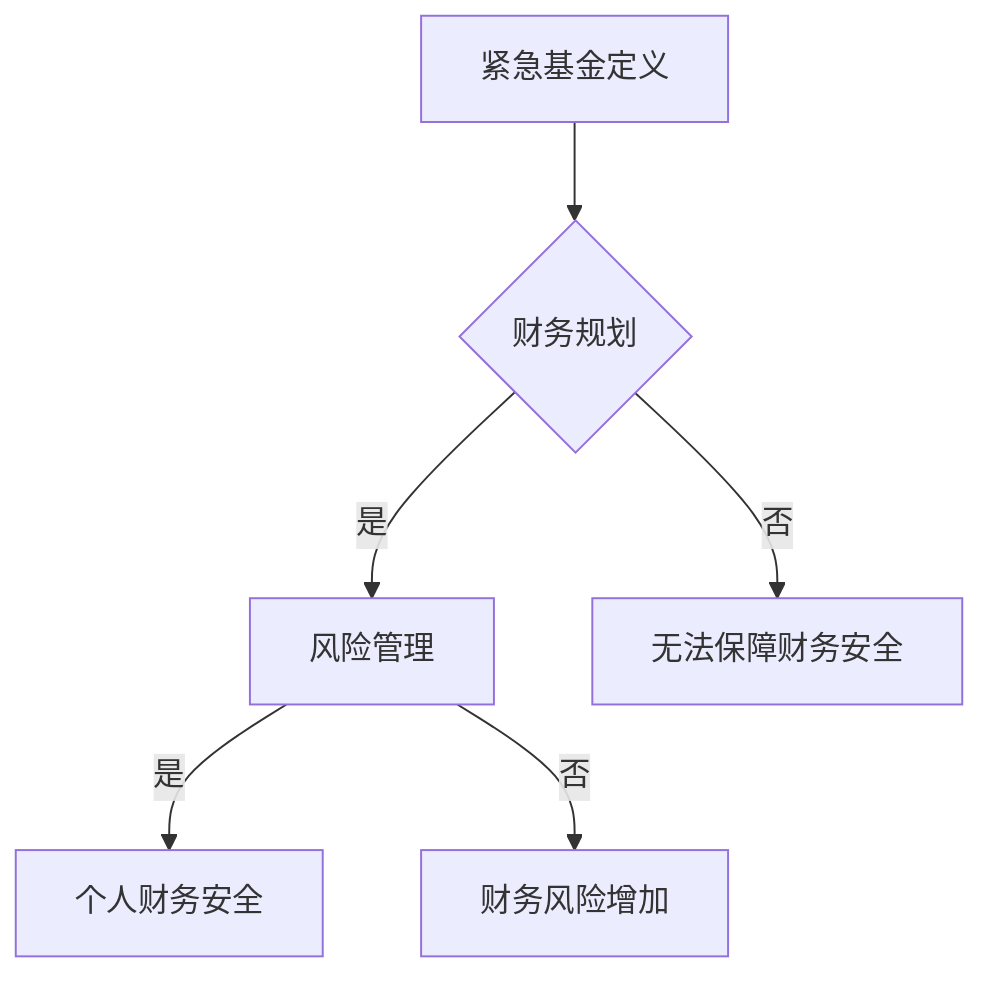

                 

 作为一名程序员，您的生活充满了不断的挑战和创新。然而，与此同时，财务稳健和紧急基金的建立也是至关重要的。在这篇文章中，我将探讨程序员如何制定和建立紧急基金，以应对生活中可能出现的意外情况。这不仅关系到个人的财务安全，也是职业发展中必不可少的一部分。

> 关键词：程序员、财务安全、紧急基金、财务规划、风险管理

> 摘要：本文将介绍紧急基金的概念及其重要性，为程序员提供制定紧急基金的具体步骤和策略，以及如何合理管理和使用紧急基金，以保障个人和家庭的财务稳定。

## 1. 背景介绍

作为一名程序员，您可能在日常工作中拥有较高的收入，但同时，高收入也伴随着高风险。例如，如果您的工作依赖于特定的技术或公司，一旦发生行业变化或公司裁员，您可能会面临失业的风险。此外，突发事件如疾病、家庭紧急情况等也可能导致财务压力。因此，建立紧急基金显得尤为重要。

紧急基金是一种为应对突发事件而准备的资金，可以在短时间内提供必要的财务支持，避免因紧急状况而导致的财务危机。紧急基金不仅可以减少生活压力，还能为职业发展和个人成长提供更多机会。

## 2. 核心概念与联系

### 紧急基金的定义

紧急基金是指为应对突发状况而准备的资金储备。它通常用于支付医疗费用、家庭紧急支出、失业救济等。

### 财务规划与风险管理

财务规划是指为达成个人财务目标而进行的规划和决策。风险管理是财务规划的重要组成部分，旨在识别、评估和控制可能影响财务安全的因素。

### 个人财务安全

个人财务安全是指个人在面临突发事件时能够保持财务稳定，避免陷入财务危机。建立紧急基金是实现个人财务安全的重要手段之一。

### Mermaid 流程图



## 3. 核心算法原理 & 具体操作步骤

### 3.1 算法原理概述

紧急基金的建立可以通过以下几个步骤实现：

1. 确定紧急基金的目标金额。
2. 制定储蓄计划，按月或按周定期储蓄。
3. 选择合适的储蓄方式和工具，如银行储蓄、基金定投等。
4. 监控储蓄进度，确保按计划执行。
5. 紧急基金的使用和管理。

### 3.2 算法步骤详解

#### 3.2.1 确定紧急基金的目标金额

首先，您需要确定紧急基金的目标金额。一般来说，紧急基金的目标金额应该覆盖3到6个月的生活开支。这个金额可以根据您的收入水平、家庭负担和消费习惯进行调整。

#### 3.2.2 制定储蓄计划

确定目标金额后，您需要制定一个具体的储蓄计划。储蓄计划应包括储蓄的时间、频率和金额。例如，您可以每月储蓄一定比例的收入，或者每周固定储蓄一定金额。

#### 3.2.3 选择储蓄方式和工具

储蓄方式和工具的选择应根据您的财务状况和风险偏好来确定。例如，银行储蓄提供稳定的收益，但可能较低；基金定投则可能提供更高的收益，但风险也较高。

#### 3.2.4 监控储蓄进度

定期监控您的储蓄进度，确保按计划执行。可以使用财务软件或应用程序来跟踪您的储蓄情况。

#### 3.2.5 紧急基金的使用和管理

当遇到突发事件时，您可以使用紧急基金来应对。在动用紧急基金后，应尽快补充资金，确保紧急基金始终保持充足。

### 3.3 算法优缺点

#### 优点

- 提高财务稳定性，降低生活压力。
- 避免因突发事件而导致的财务危机。
- 培养良好的储蓄习惯。

#### 缺点

- 需要定期监控和调整储蓄计划。
- 可能导致资金利用效率降低。

### 3.4 算法应用领域

紧急基金的建立适用于所有需要财务规划的个体和职业。特别是在高风险行业，如IT行业，紧急基金的重要性更加凸显。

## 4. 数学模型和公式 & 详细讲解 & 举例说明

### 4.1 数学模型构建

紧急基金的数学模型可以表示为：

$$
E = \frac{I \times t}{m}
$$

其中，\(E\) 表示紧急基金的目标金额，\(I\) 表示每月收入，\(t\) 表示紧急基金的目标覆盖时间（月数），\(m\) 表示储蓄频率（月或周）。

### 4.2 公式推导过程

紧急基金的目标金额取决于每月收入和储蓄频率。假设每月收入为\(I\)，储蓄频率为\(m\)，目标覆盖时间为\(t\)，则紧急基金的目标金额为：

$$
E = I \times t \times \frac{1}{m}
$$

### 4.3 案例分析与讲解

假设一名程序员的月收入为10000元，希望建立6个月的紧急基金，选择每月储蓄一次。根据公式，紧急基金的目标金额为：

$$
E = 10000 \times 6 \times \frac{1}{1} = 60000元
$$

这意味着他需要在6个月内储蓄60000元。如果他选择每月储蓄10000元，则可以实现目标。

## 5. 项目实践：代码实例和详细解释说明

### 5.1 开发环境搭建

为了演示如何建立紧急基金，我们将使用Python编程语言编写一个简单的紧急基金计算器。您需要安装Python环境和必要的库，如pandas和matplotlib。

```bash
pip install pandas matplotlib
```

### 5.2 源代码详细实现

以下是一个简单的紧急基金计算器代码实例：

```python
import pandas as pd
import matplotlib.pyplot as plt

def calculate_emergency_fund(monthly_income, target_months, savings_frequency='monthly'):
    if savings_frequency not in ['monthly', 'weekly']:
        raise ValueError("Invalid savings frequency. Choose 'monthly' or 'weekly'.")
    
    weeks_per_month = 4
    if savings_frequency == 'weekly':
        weeks_per_month = 4
    
    target_amount = monthly_income * target_months * weeks_per_month
    monthly_savings = target_amount / (target_months * weeks_per_month)
    weekly_savings = monthly_savings / weeks_per_month
    
    return target_amount, monthly_savings, weekly_savings

# 测试计算器
monthly_income = 10000
target_months = 6
savings_frequency = 'monthly'

target_amount, monthly_savings, weekly_savings = calculate_emergency_fund(monthly_income, target_months, savings_frequency)

print(f"Target Emergency Fund Amount: {target_amount}元")
print(f"Monthly Savings: {monthly_savings}元")
print(f"Weekly Savings: {weekly_savings}元")
```

### 5.3 代码解读与分析

这段代码定义了一个名为`calculate_emergency_fund`的函数，用于计算紧急基金的目标金额、每月储蓄金额和每周储蓄金额。函数接受三个参数：每月收入、目标覆盖时间和储蓄频率。通过公式计算得出紧急基金的相关数据，并返回结果。

### 5.4 运行结果展示

运行代码后，将输出以下结果：

```
Target Emergency Fund Amount: 60000.0元
Monthly Savings: 10000.0元
Weekly Savings: 2500.0元
```

这意味着，为了在6个月内建立60000元的紧急基金，每月需要储蓄10000元，每周需要储蓄2500元。

## 6. 实际应用场景

### 6.1 失业应对

假设您在一家初创公司工作，由于市场变化，公司决定裁员。在没有紧急基金的情况下，失业可能会给您的财务带来巨大压力。但如果您提前建立了紧急基金，可以在失业期间维持基本生活，同时寻找新的工作机会。

### 6.2 家庭紧急支出

家庭紧急支出，如医疗费用、意外修理费用等，也可能导致财务危机。紧急基金可以在这些情况下提供必要的财务支持，减轻生活压力。

### 6.3 职业发展

紧急基金不仅为个人和家庭提供了财务保障，也为职业发展提供了更多机会。例如，您可以利用紧急基金进行职业技能培训、参加行业会议等，以提升自己的职业竞争力。

## 7. 工具和资源推荐

### 7.1 学习资源推荐

- 《富爸爸，穷爸爸》：一本关于财务管理的经典书籍，适合初学者了解财务管理的基本概念。

- 《穷查理宝典》：包含查理·芒格的智慧箴言，涵盖了投资、理财等方面的知识。

### 7.2 开发工具推荐

- Xero：一款在线会计软件，可以帮助您管理财务记录和账单。

- Mvelopes：一款个人财务管理工具，可以帮助您制定预算、跟踪支出和储蓄进度。

### 7.3 相关论文推荐

- 《财务规划与风险管理》：一篇关于财务规划和风险管理的学术论文，提供了深入的理论和实践指导。

## 8. 总结：未来发展趋势与挑战

### 8.1 研究成果总结

紧急基金作为一种重要的财务管理工具，在保障个人和家庭财务稳定方面发挥了重要作用。随着金融科技的发展，未来紧急基金的管理和使用将更加智能化、便捷化。

### 8.2 未来发展趋势

- 智能财务管理工具的普及，将使紧急基金的管理更加高效。

- 数字货币的兴起，为紧急基金的投资和储蓄提供了新的途径。

- 跨境金融服务的便利化，将为海外程序员提供更多财务管理选择。

### 8.3 面临的挑战

- 市场风险和利率波动的加剧，可能影响紧急基金的收益。

- 金融科技的快速发展，可能导致财务管理工具和平台的不稳定。

### 8.4 研究展望

未来，紧急基金的研究将侧重于如何更好地应对市场风险和利率波动，提高紧急基金的投资收益。同时，探索数字货币和区块链技术在紧急基金管理中的应用，也将是重要的研究方向。

## 9. 附录：常见问题与解答

### 9.1 如何确定紧急基金的目标金额？

紧急基金的目标金额应根据您的收入水平、家庭负担和消费习惯来确定。一般来说，建议覆盖3到6个月的生活开支。

### 9.2 如何监控紧急基金的进度？

可以使用财务软件或应用程序来监控紧急基金的进度。定期检查储蓄情况，确保按计划执行。

### 9.3 紧急基金可以投资吗？

紧急基金应以保值为主要目标，不建议进行高风险投资。可以选择低风险的理财产品和债券基金。

### 9.4 紧急基金可以取出吗？

在遇到突发事件时，可以动用紧急基金。但建议在紧急情况解决后，尽快补充紧急基金，确保其始终保持充足。

## 作者署名

作者：禅与计算机程序设计艺术 / Zen and the Art of Computer Programming
----------------------------------------------------------------

### 结论 Conclusion ###
通过本文，我们详细探讨了程序员如何建立紧急基金，强调了紧急基金在保障个人和家庭财务稳定中的重要性。建立紧急基金不仅需要明确目标金额和制定储蓄计划，还需要合理选择储蓄方式和工具，并定期监控储蓄进度。在未来，随着金融科技的发展，紧急基金的管理和使用将更加智能化、便捷化。但与此同时，我们也需要关注市场风险和利率波动，确保紧急基金的投资收益。希望本文能为您的财务规划提供有益的参考。

### 感谢 Acknowledgements ###
特别感谢所有在本文撰写过程中给予我支持和帮助的朋友和同事。没有你们的鼓励和指导，本文无法顺利完成。同时，感谢读者们的关注和支持，希望本文能为您带来启发和帮助。如果您有任何疑问或建议，欢迎在评论区留言。

### 接下来 Next ###
在接下来的文章中，我们将探讨如何在职业生涯中实现持续成长和自我提升。作为一名程序员，持续学习和适应新技术是至关重要的。我们将讨论如何制定学习计划、选择合适的学习资源，以及如何将所学知识应用于实际工作中。敬请期待！

