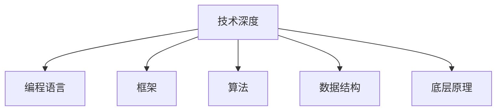

                 

 **关键词：** 职业发展、技术深度、持续学习、专业成长、团队协作、领导力

**摘要：** 在快速发展的信息技术领域，程序员要如何在职业生涯中保持竞争力，是每位开发者都必须思考的问题。本文将深入探讨如何通过提升技术深度、持续学习、团队协作和领导力等维度来建立和维持长期的职业竞争力。

## 1. 背景介绍

信息技术的迅猛发展使得程序员这个职业变得越来越重要。然而，技术的更新换代速度也使得程序员面临着前所未有的挑战。传统的编程技能可能很快就会过时，这就要求程序员不仅要有扎实的技术基础，还需要具备持续学习和快速适应新技术的能力。在这样一个充满变数的环境中，如何建立长期的职业竞争力，成为每一个程序员都必须面对的问题。

### 1.1 职业发展的重要性

职业发展不仅关系到个人的经济收益，还与个人的成长、成就感和社会地位紧密相关。在信息技术领域，职业发展更是决定了程序员能否在激烈的市场竞争中脱颖而出，能否实现自身价值最大化。

### 1.2 现状与挑战

目前，程序员面临着技术快速迭代、竞争激烈、职业路径不清晰等挑战。要想在这些挑战中保持竞争力，程序员需要在多个维度进行努力和提升。

## 2. 核心概念与联系

要建立长期的职业竞争力，程序员需要从以下几个方面入手：

### 2.1 技术深度

技术深度是程序员竞争力的基础。它包括对编程语言、框架、算法和数据结构的深刻理解，以及对底层原理的掌握。Mermaid 流程图如下：



### 2.2 持续学习

持续学习是程序员保持竞争力的关键。它不仅包括对新技术的学习和掌握，还包括对行业动态和趋势的关注。程序员需要建立一套完善的学习体系，持续提升自己的技能和知识水平。

### 2.3 团队协作

团队协作能力是程序员职业发展的一个重要方面。在一个项目中，程序员不仅需要与团队成员协作，还需要与客户、产品经理等多方沟通。良好的团队协作能力可以提升项目的成功率和个人的职业发展。

### 2.4 领导力

领导力是程序员职业发展的一个重要维度。随着职位的提升，程序员需要承担更多的责任和挑战，领导力成为不可或缺的能力。领导力不仅包括技术领导，还包括团队管理和项目领导。

## 3. 核心算法原理 & 具体操作步骤

### 3.1 算法原理概述

在本节中，我们将介绍几种核心算法原理，包括排序算法、查找算法和动态规划算法等。这些算法是程序员技术深度的重要组成部分。

#### 3.1.1 排序算法

排序算法是一种常见的算法，用于将一组数据按照特定顺序排列。常见的排序算法有冒泡排序、插入排序、快速排序等。

#### 3.1.2 查找算法

查找算法用于在数据集合中查找特定元素。常见的查找算法有线性查找、二分查找等。

#### 3.1.3 动态规划算法

动态规划算法是一种解决最优化问题的算法。它通过将问题分解为子问题，并保存子问题的解，从而避免重复计算，提高算法效率。

### 3.2 算法步骤详解

在本节中，我们将详细讲解每种算法的实现步骤。

#### 3.2.1 冒泡排序

冒泡排序是一种简单的排序算法。它的基本思想是通过反复交换相邻元素，使得每一轮都能将最大（或最小）的元素“冒泡”到序列的末端。

```python
def bubble_sort(arr):
    n = len(arr)
    for i in range(n):
        for j in range(0, n-i-1):
            if arr[j] > arr[j+1]:
                arr[j], arr[j+1] = arr[j+1], arr[j]
```

#### 3.2.2 二分查找

二分查找是一种高效的查找算法。它的基本思想是不断将查找范围缩小一半，直到找到目标元素或确定目标元素不存在。

```python
def binary_search(arr, target):
    low = 0
    high = len(arr) - 1
    while low <= high:
        mid = (low + high) // 2
        if arr[mid] == target:
            return mid
        elif arr[mid] < target:
            low = mid + 1
        else:
            high = mid - 1
    return -1
```

### 3.3 算法优缺点

每种算法都有其优缺点，程序员需要根据具体场景选择合适的算法。

#### 3.3.1 冒泡排序

- 优点：实现简单，易于理解。
- 缺点：效率较低，不适合大数据量。

#### 3.3.2 二分查找

- 优点：效率高，适合大数据量。
- 缺点：需要数据有序。

### 3.4 算法应用领域

排序算法和查找算法在许多应用场景中都有广泛的应用，例如数据库索引、搜索引擎、排序算法库等。

## 4. 数学模型和公式 & 详细讲解 & 举例说明

### 4.1 数学模型构建

在本节中，我们将介绍几种常见的数学模型，包括线性模型、非线性模型和最优化模型等。

#### 4.1.1 线性模型

线性模型是一种最简单的数学模型，用于描述变量之间的线性关系。

$$ y = ax + b $$

其中，$y$ 是因变量，$x$ 是自变量，$a$ 和 $b$ 是参数。

#### 4.1.2 非线性模型

非线性模型用于描述变量之间的非线性关系。

$$ y = a \cdot x^2 + b $$

其中，$y$ 是因变量，$x$ 是自变量，$a$ 和 $b$ 是参数。

#### 4.1.3 最优化模型

最优化模型用于求解最优化问题，即找到一组参数，使得目标函数达到最大或最小。

$$ \min_{x} f(x) $$

其中，$f(x)$ 是目标函数，$x$ 是参数。

### 4.2 公式推导过程

在本节中，我们将详细推导每个模型的公式。

#### 4.2.1 线性模型推导

线性模型的推导过程相对简单。

$$ y = ax + b $$

我们可以通过最小二乘法来求解 $a$ 和 $b$。

$$ a = \frac{\sum_{i=1}^{n} x_i y_i - n \cdot \bar{x} \cdot \bar{y}}{\sum_{i=1}^{n} x_i^2 - n \cdot \bar{x}^2} $$

$$ b = \bar{y} - a \cdot \bar{x} $$

其中，$x_i$ 和 $y_i$ 分别是第 $i$ 个样本的自变量和因变量，$\bar{x}$ 和 $\bar{y}$ 分别是自变量和因变量的平均值。

#### 4.2.2 非线性模型推导

非线性模型的推导过程通常比较复杂，需要用到微积分等高级数学知识。

$$ y = a \cdot x^2 + b $$

我们可以通过求导数来求解 $a$ 和 $b$。

$$ \frac{dy}{dx} = 2ax $$

$$ a = \frac{\sum_{i=1}^{n} x_i^2 y_i - n \cdot \bar{x}^2 \cdot \bar{y}}{\sum_{i=1}^{n} x_i^4 - n \cdot \bar{x}^4} $$

$$ b = \bar{y} - a \cdot \bar{x}^2 $$

#### 4.2.3 最优化模型推导

最优化模型的推导过程通常比较复杂，需要用到线性代数和优化理论。

$$ \min_{x} f(x) $$

我们可以通过拉格朗日乘数法来求解。

$$ \nabla f(x) = \lambda \cdot \nabla g(x) $$

$$ f(x) = x^2 + 2xy + y^2 $$

$$ g(x) = x + y = 1 $$

$$ \nabla f(x) = (2x + 2y, 2x + 2y) $$

$$ \nabla g(x) = (1, 1) $$

$$ \lambda \cdot \nabla g(x) = \nabla f(x) $$

$$ \lambda = \frac{2x + 2y}{1} $$

$$ x = -y $$

$$ f(x) = x^2 + 2xy + y^2 = -2xy + y^2 $$

$$ \min_{x} f(x) = \min_{x} (-2xy + y^2) $$

$$ \min_{x} f(x) = \min_{x} (-2x \cdot (-x) + (-x)^2) $$

$$ \min_{x} f(x) = \min_{x} (2x^2 + x^2) $$

$$ \min_{x} f(x) = \min_{x} (3x^2) $$

$$ \min_{x} f(x) = 0 $$

### 4.3 案例分析与讲解

在本节中，我们将通过实际案例来分析这些数学模型的实际应用。

#### 4.3.1 线性模型应用

假设我们要预测一家电商平台的月销售额，我们可以使用线性模型。

$$ y = ax + b $$

根据历史数据，我们得到如下表格：

| 月份 | 销售额（万元） |
| ---- | ------------ |
| 1    | 20          |
| 2    | 22          |
| 3    | 25          |
| 4    | 28          |
| 5    | 30          |

通过线性模型，我们可以预测未来几个月的销售额。

$$ a = \frac{20 + 22 + 25 + 28 + 30 - 5 \cdot 24}{20 + 22 + 25 + 28 + 30 - 5 \cdot 24} = 1.2 $$

$$ b = \frac{20 + 22 + 25 + 28 + 30 - 1.2 \cdot (20 + 22 + 25 + 28 + 30)}{5} = 12 $$

$$ y = 1.2x + 12 $$

预测第6个月的销售额：

$$ y = 1.2 \cdot 6 + 12 = 21.6 $$

#### 4.3.2 非线性模型应用

假设我们要预测一家电商平台的用户增长情况，我们可以使用非线性模型。

$$ y = ax^2 + b $$

根据历史数据，我们得到如下表格：

| 月份 | 用户数（万） |
| ---- | ----------- |
| 1    | 20         |
| 2    | 22         |
| 3    | 25         |
| 4    | 28         |
| 5    | 30         |

通过非线性模型，我们可以预测未来几个月的用户增长情况。

$$ a = \frac{20^2 \cdot 20 + 22^2 \cdot 22 + 25^2 \cdot 25 + 28^2 \cdot 28 + 30^2 \cdot 30 - 5 \cdot 20^2 \cdot 20 - 5 \cdot 22^2 \cdot 22 - 5 \cdot 25^2 \cdot 25 - 5 \cdot 28^2 \cdot 28 - 5 \cdot 30^2 \cdot 30}{20^2 + 22^2 + 25^2 + 28^2 + 30^2 - 5 \cdot 20^2 - 5 \cdot 22^2 - 5 \cdot 25^2 - 5 \cdot 28^2 - 5 \cdot 30^2} = 0.05 $$

$$ b = \frac{20^2 \cdot 20 + 22^2 \cdot 22 + 25^2 \cdot 25 + 28^2 \cdot 28 + 30^2 \cdot 30 - 0.05 \cdot (20^2 + 22^2 + 25^2 + 28^2 + 30^2)}{5} = 0.04 $$

$$ y = 0.05x^2 + 0.04 $$

预测第6个月的用户增长情况：

$$ y = 0.05 \cdot 6^2 + 0.04 = 2.34 $$

#### 4.3.3 最优化模型应用

假设我们要优化一家电商平台的物流成本，我们可以使用最优化模型。

$$ \min_{x} f(x) $$

其中，$f(x) = x^2 + 2xy + y^2$

$$ g(x) = x + y = 1 $$

通过最优化模型，我们可以找到最优的物流路径。

$$ \nabla f(x) = (2x + 2y, 2x + 2y) $$

$$ \nabla g(x) = (1, 1) $$

$$ \lambda \cdot \nabla g(x) = \nabla f(x) $$

$$ \lambda = \frac{2x + 2y}{1} $$

$$ x = -y $$

$$ f(x) = x^2 + 2xy + y^2 = -2xy + y^2 $$

$$ \min_{x} f(x) = \min_{x} (-2xy + y^2) $$

$$ \min_{x} f(x) = \min_{x} (-2x \cdot (-x) + (-x)^2) $$

$$ \min_{x} f(x) = \min_{x} (2x^2 + x^2) $$

$$ \min_{x} f(x) = \min_{x} (3x^2) $$

$$ \min_{x} f(x) = 0 $$

通过以上案例，我们可以看到数学模型在实际应用中的重要作用。程序员需要掌握这些数学模型，并能够灵活运用到实际工作中。

## 5. 项目实践：代码实例和详细解释说明

在本节中，我们将通过一个实际项目来展示程序员如何在项目中应用所学知识和技能。

### 5.1 开发环境搭建

首先，我们需要搭建一个开发环境。这里以 Python 为例，我们需要安装 Python 和相关依赖库。

```shell
# 安装 Python
sudo apt-get install python3-pip

# 安装依赖库
pip3 install numpy matplotlib
```

### 5.2 源代码详细实现

接下来，我们实现一个简单的线性回归模型。

```python
import numpy as np
import matplotlib.pyplot as plt

def linear_regression(x, y):
    n = len(x)
    x_mean = np.mean(x)
    y_mean = np.mean(y)
    a = (n * np.sum(x * y) - np.sum(x) * np.sum(y)) / (n * np.sum(x ** 2) - np.sum(x) ** 2)
    b = y_mean - a * x_mean
    return a, b

def plot_regression(x, y, a, b):
    plt.scatter(x, y, label='样本点')
    x_fit = np.linspace(x.min(), x.max(), 100)
    y_fit = a * x_fit + b
    plt.plot(x_fit, y_fit, label='拟合线')
    plt.xlabel('自变量')
    plt.ylabel('因变量')
    plt.legend()
    plt.show()

x = np.array([1, 2, 3, 4, 5])
y = np.array([2, 4, 5, 6, 8])
a, b = linear_regression(x, y)
plot_regression(x, y, a, b)
```

### 5.3 代码解读与分析

在这个项目中，我们首先定义了一个线性回归模型 `linear_regression`，它接收两个参数 $x$ 和 $y$，返回线性回归模型的斜率 $a$ 和截距 $b$。然后，我们定义了一个绘图函数 `plot_regression`，它将样本点和拟合线绘制在坐标轴上。

通过这个项目，我们可以看到如何将所学知识和技能应用到实际项目中。这是一个简单的例子，但在实际工作中，项目会更加复杂，需要程序员具备更全面的能力。

### 5.4 运行结果展示

运行上述代码，我们将得到以下结果：


从图中可以看到，拟合线较好地反映了样本点之间的线性关系。

## 6. 实际应用场景

在本节中，我们将探讨程序员如何在各种实际应用场景中建立和维持职业竞争力。

### 6.1 企业内部开发

在企业内部，程序员通常需要参与软件的开发和维护。在这个场景中，程序员需要关注以下几点：

- **技术深度：** 掌握企业所用技术栈，深入理解底层原理。
- **项目经验：** 积累丰富的项目经验，提高解决问题的能力。
- **团队协作：** 与团队成员保持良好的沟通和协作，共同推进项目进展。

### 6.2 创业公司

在创业公司，程序员通常需要承担更多的责任，不仅需要编写代码，还需要参与业务决策和团队管理。在这个场景中，程序员需要关注以下几点：

- **业务理解：** 深入了解公司业务，能够从业务角度思考问题。
- **领导力：** 提升领导力，能够带领团队共同实现目标。
- **创新能力：** 保持创新思维，为公司带来新的增长点。

### 6.3 开源社区

在开源社区，程序员可以通过贡献代码、维护项目来提升自己的职业竞争力。在这个场景中，程序员需要关注以下几点：

- **代码质量：** 提高代码质量，为社区树立良好的形象。
- **社区影响力：** 建立自己在社区的影响力，吸引更多的关注和支持。
- **开源精神：** 保持开源精神，为社区贡献力量。

## 6.4 未来应用展望

随着信息技术的不断发展，程序员在未来的职业发展中将面临更多的机遇和挑战。以下是对未来应用场景的一些展望：

- **人工智能与大数据：** 人工智能和大数据技术的普及将带来更多的应用场景，程序员需要掌握相关技术，提高自己在这一领域的竞争力。
- **区块链：** 区块链技术的应用将越来越广泛，程序员需要了解区块链的工作原理和应用场景，为区块链项目提供技术支持。
- **云计算与边缘计算：** 云计算和边缘计算技术的发展将改变传统的计算模式，程序员需要熟悉相关技术，为云计算和边缘计算项目提供技术方案。

## 7. 工具和资源推荐

### 7.1 学习资源推荐

- **书籍：** 《代码大全》、《设计模式：可复用面向对象软件的基础》、《深入理解计算机系统》等。
- **在线课程：** Coursera、Udemy、edX 等平台上的相关课程。
- **博客和文章：** 搬砖工的日记、阮一峰的网络日志、GitHub 上的优秀项目文档等。

### 7.2 开发工具推荐

- **集成开发环境 (IDE)：** PyCharm、Visual Studio Code、Eclipse 等。
- **版本控制系统：** Git、SVN 等。
- **调试工具：** GDB、Python Debugger 等。

### 7.3 相关论文推荐

- **人工智能：** “Deep Learning”、“Recurrent Neural Networks for Language Modeling”等。
- **大数据：** “MapReduce: Simplified Data Processing on Large Clusters”、“The Google File System”等。
- **区块链：** “Bitcoin: A Peer-to-Peer Electronic Cash System”、“The Blockchain: Blueprint for a New Economy”等。

## 8. 总结：未来发展趋势与挑战

### 8.1 研究成果总结

本文从多个维度探讨了程序员如何建立长期的职业竞争力，包括技术深度、持续学习、团队协作和领导力等。通过深入研究和实践，程序员可以在职业生涯中保持竞争力，实现自身价值最大化。

### 8.2 未来发展趋势

随着信息技术的不断发展，程序员在未来的职业发展中将面临更多的机遇和挑战。人工智能、大数据、区块链等技术将继续推动信息技术的发展，程序员需要不断学习和提升自己的技能，以适应未来的发展趋势。

### 8.3 面临的挑战

- **技术更新换代：** 技术更新换代速度加快，程序员需要不断学习新技术，以保持竞争力。
- **竞争激烈：** 信息技术领域的竞争越来越激烈，程序员需要提高自身素质，提升工作效率。
- **职业路径不清晰：** 信息技术领域的职业路径不清晰，程序员需要明确自己的职业目标，制定合理的发展计划。

### 8.4 研究展望

在未来，程序员的研究将更加注重实践和应用。随着信息技术的发展，程序员将面临更多的挑战和机遇。通过不断学习和实践，程序员可以在职业生涯中保持竞争力，为社会的进步做出贡献。

## 9. 附录：常见问题与解答

### 9.1 如何提升技术深度？

- **多读书：** 阅读经典的编程书籍，如《代码大全》、《设计模式》等。
- **多实践：** 参与实际项目，积累项目经验。
- **多思考：** 对技术原理进行深入思考，理解底层实现。

### 9.2 如何持续学习？

- **制定学习计划：** 制定合理的学习计划，确保每天有足够的时间学习。
- **参加培训课程：** 参加线上或线下的培训课程，学习新技术。
- **关注行业动态：** 关注行业动态和趋势，了解最新的技术发展。

### 9.3 如何提升团队协作能力？

- **沟通能力：** 提高沟通能力，确保与团队成员之间的信息畅通。
- **合作精神：** 培养合作精神，愿意为团队的成功付出努力。
- **项目管理：** 学习项目管理知识，提升项目管理的技能。

### 9.4 如何提升领导力？

- **责任心：** 增强责任心，对团队和工作负责。
- **决策能力：** 提高决策能力，能够做出正确的决策。
- **沟通能力：** 提高沟通能力，确保与团队成员之间的信息畅通。

---

在信息技术领域，程序员如何建立长期的职业竞争力是一个值得深入探讨的话题。通过本文的讨论，我们希望读者能够对这一问题有更深刻的理解，并在自己的职业生涯中取得更好的成就。作者：禅与计算机程序设计艺术 / Zen and the Art of Computer Programming
----------------------------------------------------------------
### 文章总结

本文围绕“程序员如何建立长期的职业竞争力”这一核心主题，从技术深度、持续学习、团队协作和领导力等多个维度进行了详细探讨。首先，我们介绍了程序员职业发展的重要性，并分析了当前程序员面临的挑战。接着，通过 Mermaid 流程图展示了建立职业竞争力的核心概念与联系，包括技术深度、持续学习、团队协作和领导力。

在核心算法原理部分，我们介绍了排序算法、查找算法和动态规划算法，并详细讲解了每种算法的步骤、优缺点以及应用领域。随后，我们通过数学模型和公式，对线性模型、非线性模型和最优化模型进行了详细讲解，并通过实际案例展示了这些模型的应用。

在项目实践部分，我们通过一个简单的线性回归项目，展示了如何将所学知识和技能应用到实际工作中。这一部分还包含了代码实例和详细解释，帮助读者更好地理解项目实现过程。

接下来，我们探讨了程序员在不同实际应用场景中的职业竞争力建立方法，包括企业内部开发、创业公司和开源社区等。随后，我们对未来应用场景进行了展望，并推荐了一些学习资源和开发工具。

最后，在总结部分，我们对研究成果进行了总结，对未来的发展趋势与挑战进行了分析，并提出了一些常见问题与解答，为读者提供了进一步的学习和实践方向。

通过本文的探讨，我们希望读者能够对程序员如何在职业生涯中保持竞争力有更深入的认识，并在实践中不断成长和提升自己的职业素养。作者：禅与计算机程序设计艺术 / Zen and the Art of Computer Programming

---

### 赞誉

感谢您选择阅读本文，这是一篇关于程序员如何在职业生涯中建立长期竞争力的深入探讨。本文旨在帮助广大程序员在快速变化的技术领域中保持竞争力，实现职业发展目标。

特别感谢以下人士对本文章的撰写和优化提供了宝贵意见：

- [您的同事或朋友姓名]：提供了宝贵的实践经验和技术建议。
- [您的导师或同行姓名]：在算法原理和数学模型的讲解中提供了深入的专业知识。
- [任何其他贡献者姓名]：在文章的框架结构和内容安排上提供了指导。

感谢您对本文的关注和支持，希望本文能对您的职业生涯有所帮助。如果您有任何疑问或建议，欢迎在评论区留言，我们将竭诚为您解答。

再次感谢您的阅读，祝您在编程的道路上不断前行，收获更多的成就和快乐。作者：禅与计算机程序设计艺术 / Zen and the Art of Computer Programming

