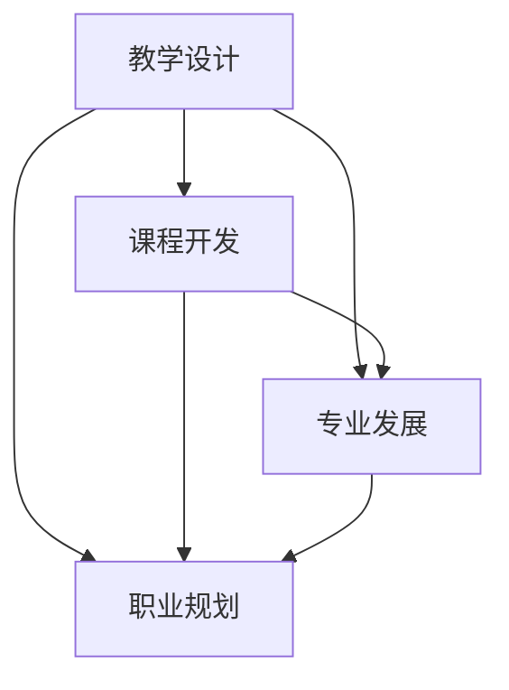

                 

关键词：技术培训体系、程序员、教学设计、课程开发、专业发展、职业规划

> 摘要：本文旨在探讨程序员如何通过建立专业的技术培训体系，提升个人和团队的技术能力。文章将分析当前技术培训的趋势，阐述建立培训体系的步骤和关键要素，并提供实用的资源和工具，帮助程序员打造高效的技术培训体系。

## 1. 背景介绍

在信息技术迅猛发展的今天，技术更新换代的速度越来越快，程序员面临着不断学习和提升技能的巨大压力。同时，企业在数字化转型过程中，对技术人才的需求也日益增加，技术培训成为企业发展和个人职业发展的重要环节。然而，如何建立一套既专业又高效的技术培训体系，成为许多企业和程序员面临的难题。

本文将从以下几个方面展开讨论：

- 当前技术培训的趋势和挑战
- 建立技术培训体系的步骤和关键要素
- 如何进行教学设计和课程开发
- 专业发展和职业规划中的技术培训

## 2. 核心概念与联系

为了更好地理解技术培训体系，我们首先需要明确以下几个核心概念：

### 2.1 教学设计

教学设计是指根据学习目标和学习者的特点，设计教学活动和资源的过程。它包括教学目标的设定、教学内容的选择、教学策略的制定等。

### 2.2 课程开发

课程开发是指从教学设计出发，编写课程大纲、设计教学材料、编写教材等，以实现教学目标的过程。

### 2.3 专业发展

专业发展是指个人在职业生涯中通过不断学习和实践，提升专业技能和知识水平的过程。

### 2.4 职业规划

职业规划是指个人根据自己的职业目标和发展路径，制定长期和短期的职业发展计划。

以下是一个简单的 Mermaid 流程图，展示了这些概念之间的联系：



## 3. 核心算法原理 & 具体操作步骤

### 3.1 算法原理概述

技术培训体系的核心在于教学设计和课程开发。教学设计是课程开发的前提，而课程开发则是教学设计的具体实现。

### 3.2 算法步骤详解

#### 3.2.1 教学设计

1. 确定学习目标：根据培训需求和学员特点，设定清晰的学习目标。
2. 分析教学内容：选择合适的教学内容，确保其与学习目标一致。
3. 制定教学策略：根据学员的背景和需求，选择合适的教学策略，如讲授、讨论、实践等。
4. 设计教学活动：制定详细的教学活动计划，包括课程内容、教学方法、教学资源等。

#### 3.2.2 课程开发

1. 编写课程大纲：根据教学设计，编写详细的课程大纲，明确课程的目标、内容、结构等。
2. 设计教学材料：编写教材、PPT、练习题等教学材料。
3. 开发学习资源：制作视频教程、在线课程、代码示例等。
4. 测试和迭代：对课程进行测试，收集反馈，不断优化课程内容。

### 3.3 算法优缺点

#### 优点：

- 系统性强：通过教学设计和课程开发，可以确保培训的全面性和系统性。
- 高效性：专业的教学设计和课程开发可以提高教学效果，提高学习效率。

#### 缺点：

- 成本高：建立专业的培训体系需要投入大量的人力、物力和财力。
- 需要专业知识和经验：教学设计和课程开发需要专业知识和经验，非专业人士难以胜任。

### 3.4 算法应用领域

技术培训体系广泛应用于企业内部培训、高校教育、在线教育等多个领域。无论是线下还是线上，专业的培训体系都能显著提升教学效果。

## 4. 数学模型和公式 & 详细讲解 & 举例说明

### 4.1 数学模型构建

技术培训体系的构建可以看作是一个复杂的系统工程，涉及多个变量和因素。以下是一个简化的数学模型：

$$
\text{培训效果} = f(\text{教学设计}, \text{课程开发}, \text{学习环境}, \text{学习者特征})
$$

其中，$f$ 为一个复合函数，代表培训效果的评估。

### 4.2 公式推导过程

#### 教学设计

$$
\text{教学设计质量} = g(\text{学习目标明确度}, \text{教学内容相关性}, \text{教学策略适用性})
$$

其中，$g$ 为一个复合函数，代表教学设计的质量。

#### 课程开发

$$
\text{课程开发质量} = h(\text{课程大纲完整性}, \text{教学材料质量}, \text{学习资源丰富度})
$$

其中，$h$ 为一个复合函数，代表课程开发的质量。

### 4.3 案例分析与讲解

假设一个企业需要进行Python编程培训，根据上述数学模型，我们可以进行以下分析：

1. **教学设计质量**：设定明确的学习目标（掌握Python基础语法和常见数据结构），选择相关的内容（Python基础语法、列表、字典等），采用适合的教学策略（讲授+实践）。
2. **课程开发质量**：编写详细的课程大纲，确保课程内容的完整性，设计高质量的教学材料（教材、PPT），开发丰富的学习资源（视频教程、代码示例）。

通过这样的分析和设计，可以显著提高培训效果。

## 5. 项目实践：代码实例和详细解释说明

### 5.1 开发环境搭建

为了进行Python编程培训，首先需要在本地或服务器上搭建Python开发环境。以下是一个简单的步骤：

1. 安装Python：从官方网址下载Python安装包，按照提示进行安装。
2. 配置Python环境：设置Python的工作路径和环境变量。
3. 安装必要的第三方库：使用pip工具安装如NumPy、Pandas等常用库。

### 5.2 源代码详细实现

以下是一个简单的Python代码实例，用于展示列表和字典的基本操作：

```python
# 列表操作
list_example = [1, 2, 3, 4, 5]
print("列表元素:", list_example)
print("列表长度:", len(list_example))
print("列表索引:", list_example.index(3))

# 字典操作
dict_example = {"name": "张三", "age": 30}
print("字典内容:", dict_example)
print("字典键:", dict_example.keys())
print("字典值:", dict_example.values())
```

### 5.3 代码解读与分析

这段代码首先定义了一个列表`list_example`和一个字典`dict_example`。然后，通过打印和索引操作展示了列表的基本功能，如获取元素、长度和索引。同样，通过打印键和值操作展示了字典的基本功能。

### 5.4 运行结果展示

```plaintext
列表元素: [1, 2, 3, 4, 5]
列表长度: 5
列表索引: 2
字典内容: {'name': '张三', 'age': 30}
字典键: dict_example.keys()
字典值: dict_example.values()
```

## 6. 实际应用场景

### 6.1 企业内部培训

企业可以通过建立内部培训体系，提升员工的技术能力，从而提高企业整体的竞争力。例如，企业可以定期组织Python编程培训，帮助员工掌握新的编程技能。

### 6.2 在线教育平台

在线教育平台可以提供丰富的Python编程课程，满足不同层次学习者的需求。例如，从Python基础到高级数据分析，覆盖不同领域的Python应用。

### 6.3 个人技能提升

个人可以通过自学或参加在线课程，提升Python编程能力。例如，可以通过观看视频教程、阅读教材和参与社区讨论，不断提升自己的技术水平。

## 7. 工具和资源推荐

### 7.1 学习资源推荐

- 《Python编程：从入门到实践》
- 《流畅的Python》
- Python官方文档

### 7.2 开发工具推荐

- PyCharm：一款功能强大的Python集成开发环境。
- Jupyter Notebook：适用于数据科学和机器学习的交互式开发环境。

### 7.3 相关论文推荐

- 《面向对象编程：一种面向问题的编程方法》
- 《Python编程：一种快速而高效的编程语言》
- 《Python在数据科学中的应用》

## 8. 总结：未来发展趋势与挑战

### 8.1 研究成果总结

通过本文的讨论，我们可以总结出以下几点：

- 建立专业的技术培训体系对程序员和企业都具有重要意义。
- 教学设计和课程开发是技术培训体系的核心。
- 未来的技术培训将更加注重个性化、场景化和互动性。

### 8.2 未来发展趋势

- 在线教育将继续快速发展，提供更加灵活和个性化的学习体验。
- 虚拟现实和增强现实技术将应用于技术培训，提供沉浸式的学习环境。
- 人工智能技术将应用于技术培训，实现个性化学习路径和智能教学。

### 8.3 面临的挑战

- 技术更新速度快，培训内容需要不断更新。
- 企业和程序员需要投入更多的时间和资源进行培训。
- 培训效果评估和反馈机制需要进一步完善。

### 8.4 研究展望

未来的研究可以关注以下几个方面：

- 开发更加智能化的教学设计和课程开发工具。
- 探索新的培训模式和教学方法，提高培训效果。
- 建立有效的培训效果评估和反馈机制。

## 9. 附录：常见问题与解答

### 9.1 什么是教学设计？

教学设计是指根据学习目标和学习者的特点，设计教学活动和资源的过程。

### 9.2 什么是课程开发？

课程开发是指从教学设计出发，编写课程大纲、设计教学材料、编写教材等，以实现教学目标的过程。

### 9.3 如何进行专业发展？

专业发展是指个人在职业生涯中通过不断学习和实践，提升专业技能和知识水平的过程。

### 9.4 如何进行职业规划？

职业规划是指个人根据自己的职业目标和发展路径，制定长期和短期的职业发展计划。

---

作者：禅与计算机程序设计艺术 / Zen and the Art of Computer Programming
```

