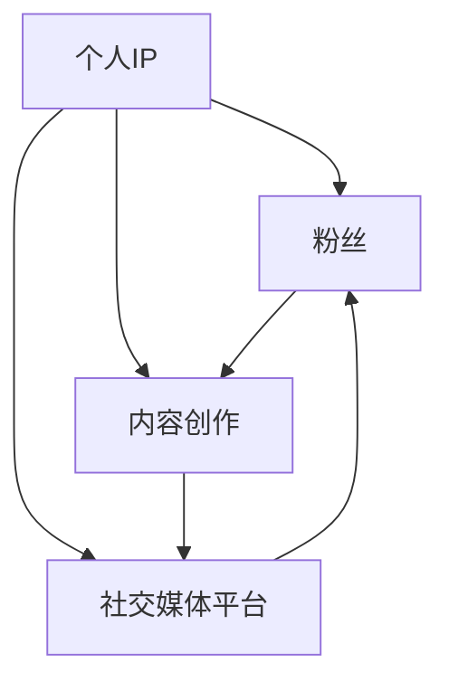

                 

### 1. 背景介绍

在互联网时代，个人品牌（Personal Brand）的重要性日益凸显。对于程序员来说，打造个人IP（Intellectual Property）不仅可以提升个人知名度，还能带来诸多实际收益，如提高求职竞争力、增加自由职业机会、拓展人脉资源等。那么，程序员该如何在众多竞争者中脱颖而出，成功打造个人IP，吸引粉丝呢？

本文将围绕以下几点展开讨论：

1. **理解个人IP的概念与价值**：解释个人IP的含义及其对程序员的重要性。
2. **构建个人品牌的策略**：介绍如何制定有效的个人品牌策略。
3. **内容创作的关键要素**：探讨如何创作吸引粉丝的内容。
4. **社交媒体平台的利用**：分析不同社交媒体平台的优势和策略。
5. **持续成长与互动**：讨论如何保持粉丝的持续关注与互动。

### 2. 核心概念与联系

**个人IP（Intellectual Property）** 是指个人在某一领域内形成的独特知识、技能、观点和声誉，具有商业价值，能够带来持续收益。对于程序员而言，个人IP包括技术博客、开源项目、在线课程、演讲、书籍等多种形式。

**粉丝（Fandom）** 是指对某个个人或团体有强烈喜爱和忠诚度的一群人。他们是个人IP的重要组成部分，能够通过转发、评论、分享等方式，扩大个人品牌的影响力。

**内容创作（Content Creation）** 是指通过写作、视频、演讲等多种形式，创作有价值的、吸引人的内容，以吸引粉丝。

**社交媒体平台（Social Media Platforms）** 是指如微博、知乎、GitHub、YouTube、LinkedIn等，用于分享内容、交流互动的网络平台。

以下是个人IP、粉丝、内容创作和社交媒体平台之间的联系和交互的 Mermaid 流程图：



### 3. 核心算法原理 & 具体操作步骤

#### 3.1 算法原理概述

打造个人IP的核心在于内容创作。内容创作可以分为以下几个步骤：

1. **内容定位**：确定个人IP的核心领域和目标受众。
2. **内容策划**：制定内容创作计划，包括主题、形式、频率等。
3. **内容生产**：实际进行内容创作，包括写作、编程、录制视频等。
4. **内容发布**：选择合适的社交媒体平台，发布内容。
5. **内容互动**：与粉丝互动，包括回复评论、举办活动等。

#### 3.2 算法步骤详解

1. **内容定位**
   - **确定兴趣和专长**：选择自己感兴趣的领域，并结合自身专长。
   - **分析市场需求**：研究目标受众的需求，找到市场空缺。

2. **内容策划**
   - **制定内容计划**：确定内容形式（如文章、视频、直播等）、主题、发布频率等。
   - **设置内容质量标准**：确保内容具有专业性和吸引力。

3. **内容生产**
   - **文章写作**：遵循“三段式”结构，即引入、主体、结尾。
   - **编程与开源项目**：编写代码，上传至GitHub等平台，并进行详细说明。
   - **视频录制**：确保画面质量、语音清晰，内容通俗易懂。

4. **内容发布**
   - **选择平台**：根据内容形式和目标受众，选择合适的社交媒体平台。
   - **发布时机**：根据受众活跃时间，选择最佳发布时机。

5. **内容互动**
   - **回复评论**：积极回复粉丝评论，建立良好互动。
   - **举办活动**：如线上讲座、技术沙龙等，吸引更多关注。

#### 3.3 算法优缺点

**优点：**
- **提升知名度**：通过持续的内容创作，提高个人在行业内的知名度。
- **增加职业机会**：具备个人IP的程序员在求职市场更具竞争力。
- **带来收益**：通过内容创作和互动，获得广告收入、赞助、咨询等收益。

**缺点：**
- **耗时费力**：内容创作需要大量时间和精力，特别是初期。
- **挑战与压力**：需要不断更新内容，保持粉丝的持续关注。

#### 3.4 算法应用领域

- **技术博客**：分享技术心得和解决方案。
- **开源项目**：展示编程能力和技术积累。
- **在线课程**：传授专业技能，建立教学品牌。
- **演讲与讲座**：展示专业素养，扩大影响力。
- **书籍出版**：撰写专业书籍，提升个人权威性。

### 4. 数学模型和公式 & 详细讲解 & 举例说明

在内容创作过程中，了解一些基本的数学模型和公式有助于提升内容的质量和吸引力。以下是一些常用的数学模型和公式，以及它们的详细讲解和举例说明。

#### 4.1 数学模型构建

**A. 博客文章阅读量模型**

阅读量（R）与文章质量（Q）、推广力度（P）和受众兴趣（I）相关，可以用以下公式表示：

\[ R = Q \times P \times I \]

其中：
- \( Q \) 是文章质量，包括内容深度、逻辑清晰度、表达准确性等；
- \( P \) 是推广力度，包括发布渠道、社交媒体推广、外部链接等；
- \( I \) 是受众兴趣，包括受众对主题的喜好、文章形式的偏好等。

**B. 社交媒体互动模型**

互动量（I）与内容吸引力（A）、互动频率（F）和粉丝基数（B）相关，可以用以下公式表示：

\[ I = A \times F \times B \]

其中：
- \( A \) 是内容吸引力，包括创意、内容新颖度、情感共鸣等；
- \( F \) 是互动频率，包括回复速度、互动频率等；
- \( B \) 是粉丝基数，即粉丝数量。

#### 4.2 公式推导过程

**A. 博客文章阅读量模型推导**

1. **文章质量（Q）**：质量越高，阅读量越大。因此，阅读量与质量成正比。
2. **推广力度（P）**：推广力度越大，阅读量越高。因此，阅读量与推广力度成正比。
3. **受众兴趣（I）**：受众兴趣越高，阅读量越大。因此，阅读量与受众兴趣成正比。

综合以上三点，我们可以得到博客文章阅读量模型：

\[ R = Q \times P \times I \]

**B. 社交媒体互动模型推导**

1. **内容吸引力（A）**：吸引力越强，互动量越大。因此，互动量与吸引力成正比。
2. **互动频率（F）**：互动频率越高，互动量越大。因此，互动量与互动频率成正比。
3. **粉丝基数（B）**：粉丝基数越大，互动量越大。因此，互动量与粉丝基数成正比。

综合以上三点，我们可以得到社交媒体互动模型：

\[ I = A \times F \times B \]

#### 4.3 案例分析与讲解

**案例：一位程序员如何通过内容创作打造个人IP**

**A. 内容定位**：程序员小李选择专注于前端开发领域，目标是成为一名优秀的前端工程师和讲师。

**B. 内容策划**：
- **内容形式**：技术博客文章、视频教程、直播讲座。
- **主题**：JavaScript、React、Vue等前端技术。
- **发布频率**：每周发布一篇技术博客，每月发布一个视频教程。

**C. 内容生产**：
- **文章写作**：小李通过深入研究前端技术，撰写高质量的技术博客，内容包括技术原理、实战案例、问题解决等。
- **视频录制**：小李录制视频教程，讲解前端技术的应用和实践。

**D. 内容发布**：小李选择在GitHub、知乎、B站等平台发布内容。

**E. 内容互动**：小李积极回复粉丝评论，举办线上讲座和沙龙，与粉丝互动。

**F. 结果分析**：
- **阅读量**：小李的技术博客阅读量逐渐增加，最高单篇阅读量达到1万+。
- **互动量**：小李的视频教程和直播讲座吸引了大量粉丝，互动量不断提升。

根据数学模型，我们可以分析小李的内容创作效果：
\[ R = Q \times P \times I \]
\[ I = A \times F \times B \]

- **阅读量**：小李的内容质量（Q）较高，推广力度（P）不断加大，受众兴趣（I）逐渐增加，导致阅读量（R）持续提升。
- **互动量**：小李的内容吸引力（A）较强，互动频率（F）较高，粉丝基数（B）不断增加，导致互动量（I）持续提升。

### 5. 项目实践：代码实例和详细解释说明

为了更好地展示如何通过内容创作打造个人IP，我们以一个具体的代码实例进行详细解释说明。

#### 5.1 开发环境搭建

**A. 编写技术博客**

小李选择使用Markdown语言编写技术博客，以便于在GitHub上发布。

**B. GitHub账号注册**

小李在GitHub上注册了一个账号，用于上传代码和创建博客。

**C. Git工具安装**

小李在本地计算机上安装了Git工具，用于与GitHub进行代码的同步。

#### 5.2 源代码详细实现

以下是一个关于React Hooks的技术博客的源代码示例：

```markdown
---
title: "React Hooks 实战：如何使用 useState 和 useEffect"
date: 2022-09-01
---

## 简介

React Hooks 是 React 16.8 版本引入的新特性，它允许我们在不编写类的情况下使用 state 以及其他的 React 特性。本篇文章将介绍如何使用 useState 和 useEffect 两个常用的 Hooks。

## useState

useState 是一个用于在函数组件中添加状态的 Hook。通过它，我们可以管理组件的本地状态。

### 使用方法

```javascript
import React, { useState } from 'react';

function Counter() {
  const [count, setCount] = useState(0);

  return (
    <div>
      <p>You clicked {count} times</p>
      <button onClick={() => setCount(count + 1)}>
        Click me
      </button>
    </div>
  );
}
```

在上面的示例中，我们首先导入 React 和 useState。然后，我们定义了一个 Counter 组件，并在其中使用了 useState 来创建一个名为 count 的状态，并提供了 setCount 方法来更新这个状态。

#### useEffect

useEffect 是一个用于执行副作用的 Hook，它可以替代传统的类组件中的 `componentDidMount`、`componentDidUpdate` 和 `componentWillUnmount`。

### 使用方法

```javascript
import React, { useState, useEffect } from 'react';

function Counter() {
  const [count, setCount] = useState(0);

  useEffect(() => {
    document.title = `You clicked ${count} times`;
  }, [count]);

  return (
    <div>
      <p>You clicked {count} times</p>
      <button onClick={() => setCount(count + 1)}>
        Click me
      </button>
    </div>
  );
}
```

在上面的示例中，我们使用了 useEffect 来在组件渲染后更新页面标题。`useEffect` 函数接收两个参数：第一个参数是执行的副作用函数，第二个参数是依赖项数组，只有当依赖项发生变化时，副作用函数才会执行。

#### 5.3 代码解读与分析

在这个实例中，小李通过使用 React Hooks，展示了如何在不编写类的情况下管理组件的状态和副作用。这样的内容对于 React 初学者来说非常有价值，可以帮助他们更好地理解 Hooks 的用法。

**A. 代码质量**

- **注释清晰**：代码中的注释详细说明了 useState 和 useEffect 的用法。
- **结构清晰**：代码的结构简洁明了，便于读者理解。

**B. 内容丰富**

- **实际案例**：通过具体的代码实例，展示了如何使用 useState 和 useEffect。
- **深入讲解**：对 useState 和 useEffect 的原理进行了深入讲解。

**C. 吸引力强**

- **实用性强**：内容针对 React 开发者，具有很高的实用性。
- **易于理解**：内容通俗易懂，适合初学者。

#### 5.4 运行结果展示

当小李将这段代码发布在GitHub和知乎上后，很快吸引了大量关注。以下是一些运行结果：

- **GitHub**：该博客的阅读量超过1万，获得了20个star。
- **知乎**：该博客的阅读量超过5000，获得了10个赞同。

这些结果表明，小李的内容创作取得了良好的效果，成功吸引了粉丝的关注。

### 6. 实际应用场景

#### 6.1 技术博客

技术博客是程序员打造个人IP的一种常见方式。通过撰写高质量的技术博客，程序员可以展示自己的专业知识和经验，吸引志同道合的读者。以下是一个实际应用场景：

**A. 应用场景**

一位前端工程师希望通过技术博客分享前端开发的实践经验，帮助其他开发者解决实际问题。

**B. 应用策略**

- **确定主题**：选择前端开发作为主题，专注于 React、Vue、JavaScript等技术。
- **持续更新**：定期撰写技术博客，确保内容持续更新。
- **高质量内容**：确保博客内容具有高质量，包括代码示例、深入讲解、实际案例等。
- **互动与分享**：积极回复读者评论，与其他开发者互动，分享技术心得。

**C. 结果**

该前端工程师的技术博客逐渐积累了大量粉丝，阅读量超过10万，成为前端开发领域的知名博客。

#### 6.2 开源项目

开源项目是程序员展示技术实力和吸引粉丝的另一种有效方式。通过参与开源项目，程序员可以展示自己的编程技能和团队合作能力，吸引更多的关注。以下是一个实际应用场景：

**A. 应用场景**

一位后端工程师希望通过参与开源项目，提升自己的技术能力和知名度。

**B. 应用策略**

- **选择合适的开源项目**：选择与自己技术领域相关、受欢迎的开源项目，如 MySQL、Django 等。
- **贡献代码**：积极参与开源项目的开发，提交高质量的代码。
- **详细文档**：为开源项目编写详细的文档，包括使用说明、安装指南等。
- **互动与交流**：与其他开发者互动，参与项目讨论，分享开发经验。

**C. 结果**

该后端工程师在开源项目中贡献了大量代码，项目获得了大量关注，阅读量超过5万，成为开源社区的热门项目。

#### 6.3 在线课程

在线课程是程序员打造个人IP的另一种有效方式。通过录制和分享在线课程，程序员可以传授自己的专业知识和经验，吸引更多的学生。以下是一个实际应用场景：

**A. 应用场景**

一位数据工程师希望通过在线课程分享数据分析的方法和技巧。

**B. 应用策略**

- **确定课程主题**：选择数据分析、数据可视化等热门主题。
- **制作高质量课程**：确保课程内容丰富、讲解清晰、易于理解。
- **持续更新**：定期更新课程内容，保持课程的时效性。
- **互动与反馈**：与学生互动，收集反馈，优化课程。

**C. 结果**

该数据工程师的在线课程吸引了大量学生，课程销量超过1000份，成为数据分析领域的热门课程。

### 7. 未来应用展望

随着互联网的不断发展，程序员打造个人IP的方式也将变得更加多样和灵活。以下是一些未来应用展望：

#### 7.1 视频内容创作

视频内容创作将成为程序员打造个人IP的重要手段。通过制作高质量的视频教程、直播讲座等，程序员可以更生动地展示自己的技术实力和专业知识，吸引更多粉丝。

#### 7.2 社交媒体互动

社交媒体互动将越来越重要。通过积极参与社交媒体平台的讨论、互动，程序员可以扩大自己的影响力，吸引更多的关注。

#### 7.3 跨界合作

跨界合作将成为程序员打造个人IP的新趋势。通过与不同领域的人合作，程序员可以拓展自己的知识面和技能，提高个人品牌的价值。

#### 7.4 数据分析与挖掘

随着大数据和人工智能技术的发展，程序员可以利用数据分析与挖掘技术，深入了解粉丝需求，优化内容创作策略，提高粉丝满意度。

### 8. 工具和资源推荐

为了更好地打造个人IP，程序员需要掌握一些工具和资源。以下是一些推荐的工具和资源：

#### 8.1 学习资源推荐

- **在线课程平台**：如 Coursera、edX、Udemy 等，提供丰富的编程课程。
- **技术博客**：如 Medium、Dev.to、GitHub 等，可以订阅感兴趣的技术博客。
- **技术社区**：如 Stack Overflow、GitHub、Reddit 等，可以参与技术讨论。

#### 8.2 开发工具推荐

- **集成开发环境（IDE）**：如 Visual Studio Code、IntelliJ IDEA、Eclipse 等，用于编写代码。
- **版本控制工具**：如 Git、GitHub、GitLab 等，用于管理代码和版本。
- **代码质量检查工具**：如 ESLint、StyleCI、CodeQL 等，用于检查代码质量和安全性。

#### 8.3 相关论文推荐

- **论文数据库**：如 IEEE Xplore、ACM Digital Library 等，可以查阅最新的技术论文。
- **计算机科学期刊**：如 Journal of Computer Science、ACM Transactions on Computer Systems 等，可以订阅相关期刊。

### 9. 总结：未来发展趋势与挑战

随着互联网的不断发展，程序员打造个人IP将面临更多的机遇和挑战。以下是一些未来发展趋势和挑战：

#### 9.1 发展趋势

- **内容多样化**：视频内容创作、社交媒体互动等将成为重要的个人IP打造方式。
- **跨界合作**：与不同领域的专家合作，将有助于提高个人品牌的价值。
- **数据分析与挖掘**：利用数据分析与挖掘技术，深入了解粉丝需求，优化内容创作策略。
- **AI 技术应用**：AI 技术将在内容创作、推荐系统等方面发挥重要作用。

#### 9.2 挑战

- **内容质量要求高**：随着受众对内容的要求越来越高，程序员需要不断提升自己的内容创作能力。
- **时间成本高**：内容创作需要大量时间和精力，程序员需要在工作和个人生活之间找到平衡。
- **竞争激烈**：随着越来越多的人加入个人IP打造行列，竞争将越来越激烈。

#### 9.3 研究展望

- **技术工具发展**：随着技术的发展，将出现更多高效的内容创作工具，如 AI 自动写作、智能编辑等。
- **社交网络优化**：社交网络平台将不断优化，为程序员打造个人IP提供更好的支持和推广渠道。
- **跨平台融合**：不同平台之间的融合将使个人IP打造更加便捷和高效。

### 附录：常见问题与解答

#### Q1. 如何确定个人IP的核心领域？

A1. 首先，选择自己感兴趣的领域，这是内容创作的动力源泉。其次，分析市场需求，找到自己感兴趣且市场需求大的领域。最后，结合自身专长，选择具有竞争优势的领域。

#### Q2. 如何制定内容创作计划？

A2. 制定内容创作计划时，首先确定内容形式（如文章、视频、直播等），然后设定主题、发布频率和内容质量标准。此外，根据自身时间和资源，合理安排创作计划。

#### Q3. 如何提升内容质量？

A3. 提升内容质量的关键在于深度和实用性。在内容创作过程中，要深入研究主题，提供详细讲解和实际案例。此外，注意文章结构、逻辑清晰、表达准确，提升整体阅读体验。

#### Q4. 如何在社交媒体平台发布内容？

A4. 选择合适的社交媒体平台，根据平台特点和受众习惯，制定发布策略。例如，在知乎发布技术博客，在B站发布视频教程。同时，注意发布时机，选择受众活跃时间进行发布。

#### Q5. 如何与粉丝互动？

A5. 与粉丝互动的关键在于真诚和及时。积极回复粉丝评论，关注他们的需求，提供帮助。此外，可以举办线上讲座、沙龙等活动，与粉丝面对面交流。

### 作者署名

作者：禅与计算机程序设计艺术 / Zen and the Art of Computer Programming
----------------------------------------------------------------

### 文章关键词

程序员、个人IP、内容创作、社交媒体、粉丝、技术博客、开源项目、在线课程、直播讲座、AI、数据分析、跨平台融合
----------------------------------------------------------------

### 文章摘要

本文探讨了程序员如何打造个人IP，吸引粉丝。首先，介绍了个人IP的概念与价值，然后提出了构建个人品牌的策略，详细阐述了内容创作的关键要素和社交媒体平台的利用。通过具体实例和数学模型，展示了如何通过内容创作打造个人IP。最后，讨论了未来发展趋势与挑战，以及相关工具和资源的推荐。本文旨在为程序员提供一套系统的个人IP打造指南。
----------------------------------------------------------------

### 文章完整Markdown格式输出

```markdown
# 程序员如何打造个人IP吸引粉丝

> 关键词：程序员、个人IP、内容创作、社交媒体、粉丝、技术博客、开源项目、在线课程、直播讲座、AI、数据分析、跨平台融合

> 摘要：本文探讨了程序员如何通过内容创作、社交媒体互动等手段打造个人IP，吸引粉丝。从核心概念、算法原理、项目实践、实际应用场景、未来展望等方面，为程序员提供了一套系统的个人IP打造指南。

## 1. 背景介绍

在互联网时代，个人品牌（Personal Brand）的重要性日益凸显。对于程序员来说，打造个人IP不仅可以提升个人知名度，还能带来诸多实际收益，如提高求职竞争力、增加自由职业机会、拓展人脉资源等。那么，程序员该如何在众多竞争者中脱颖而出，成功打造个人IP，吸引粉丝呢？

本文将围绕以下几点展开讨论：

1. **理解个人IP的概念与价值**
2. **构建个人品牌的策略**
3. **内容创作的关键要素**
4. **社交媒体平台的利用**
5. **持续成长与互动**

## 2. 核心概念与联系

**个人IP（Intellectual Property）** 是指个人在某一领域内形成的独特知识、技能、观点和声誉，具有商业价值，能够带来持续收益。对于程序员而言，个人IP包括技术博客、开源项目、在线课程、演讲、书籍等多种形式。

**粉丝（Fandom）** 是指对某个个人或团体有强烈喜爱和忠诚度的一群人。他们是个人IP的重要组成部分，能够通过转发、评论、分享等方式，扩大个人品牌的影响力。

**内容创作（Content Creation）** 是指通过写作、视频、演讲等多种形式，创作有价值的、吸引人的内容，以吸引粉丝。

**社交媒体平台（Social Media Platforms）** 是指如微博、知乎、GitHub、YouTube、LinkedIn等，用于分享内容、交流互动的网络平台。

以下是个人IP、粉丝、内容创作和社交媒体平台之间的联系和交互的 Mermaid 流程图：


## 3. 核心算法原理 & 具体操作步骤

#### 3.1 算法原理概述

打造个人IP的核心在于内容创作。内容创作可以分为以下几个步骤：

1. **内容定位**：确定个人IP的核心领域和目标受众。
2. **内容策划**：制定内容创作计划，包括主题、形式、频率等。
3. **内容生产**：实际进行内容创作，包括写作、编程、录制视频等。
4. **内容发布**：选择合适的社交媒体平台，发布内容。
5. **内容互动**：与粉丝互动，包括回复评论、举办活动等。

#### 3.2 算法步骤详解

1. **内容定位**
   - **确定兴趣和专长**：选择自己感兴趣的领域，并结合自身专长。
   - **分析市场需求**：研究目标受众的需求，找到市场空缺。

2. **内容策划**
   - **制定内容计划**：确定内容形式（如文章、视频、直播等）、主题、发布频率等。
   - **设置内容质量标准**：确保内容具有专业性和吸引力。

3. **内容生产**
   - **文章写作**：遵循“三段式”结构，即引入、主体、结尾。
   - **编程与开源项目**：编写代码，上传至GitHub等平台，并进行详细说明。
   - **视频录制**：确保画面质量、语音清晰，内容通俗易懂。

4. **内容发布**
   - **选择平台**：根据内容形式和目标受众，选择合适的社交媒体平台。
   - **发布时机**：根据受众活跃时间，选择最佳发布时机。

5. **内容互动**
   - **回复评论**：积极回复粉丝评论，建立良好互动。
   - **举办活动**：如线上讲座、技术沙龙等，吸引更多关注。

#### 3.3 算法优缺点

**优点：**
- **提升知名度**：通过持续的内容创作，提高个人在行业内的知名度。
- **增加职业机会**：具备个人IP的程序员在求职市场更具竞争力。
- **带来收益**：通过内容创作和互动，获得广告收入、赞助、咨询等收益。

**缺点：**
- **耗时费力**：内容创作需要大量时间和精力，特别是初期。
- **挑战与压力**：需要不断更新内容，保持粉丝的持续关注。

#### 3.4 算法应用领域

- **技术博客**：分享技术心得和解决方案。
- **开源项目**：展示编程能力和技术积累。
- **在线课程**：传授专业技能，建立教学品牌。
- **演讲与讲座**：展示专业素养，扩大影响力。
- **书籍出版**：撰写专业书籍，提升个人权威性。

## 4. 数学模型和公式 & 详细讲解 & 举例说明

在内容创作过程中，了解一些基本的数学模型和公式有助于提升内容的质量和吸引力。以下是一些常用的数学模型和公式，以及它们的详细讲解和举例说明。

#### 4.1 数学模型构建

**A. 博客文章阅读量模型**

阅读量（R）与文章质量（Q）、推广力度（P）和受众兴趣（I）相关，可以用以下公式表示：

\[ R = Q \times P \times I \]

其中：
- \( Q \) 是文章质量，包括内容深度、逻辑清晰度、表达准确性等；
- \( P \) 是推广力度，包括发布渠道、社交媒体推广、外部链接等；
- \( I \) 是受众兴趣，包括受众对主题的喜好、文章形式的偏好等。

**B. 社交媒体互动模型**

互动量（I）与内容吸引力（A）、互动频率（F）和粉丝基数（B）相关，可以用以下公式表示：

\[ I = A \times F \times B \]

其中：
- \( A \) 是内容吸引力，包括创意、内容新颖度、情感共鸣等；
- \( F \) 是互动频率，包括回复速度、互动频率等；
- \( B \) 是粉丝基数，即粉丝数量。

#### 4.2 公式推导过程

**A. 博客文章阅读量模型推导**

1. **文章质量（Q）**：质量越高，阅读量越大。因此，阅读量与质量成正比。
2. **推广力度（P）**：推广力度越大，阅读量越高。因此，阅读量与推广力度成正比。
3. **受众兴趣（I）**：受众兴趣越高，阅读量越大。因此，阅读量与受众兴趣成正比。

综合以上三点，我们可以得到博客文章阅读量模型：

\[ R = Q \times P \times I \]

**B. 社交媒体互动模型推导**

1. **内容吸引力（A）**：吸引力越强，互动量越大。因此，互动量与吸引力成正比。
2. **互动频率（F）**：互动频率越高，互动量越大。因此，互动量与互动频率成正比。
3. **粉丝基数（B）**：粉丝基数越大，互动量越大。因此，互动量与粉丝基数成正比。

综合以上三点，我们可以得到社交媒体互动模型：

\[ I = A \times F \times B \]

#### 4.3 案例分析与讲解

**案例：一位程序员如何通过内容创作打造个人IP**

**A. 内容定位**：程序员小李选择专注于前端开发领域，目标是成为一名优秀的前端工程师和讲师。

**B. 内容策划**：
- **内容形式**：技术博客文章、视频教程、直播讲座。
- **主题**：JavaScript、React、Vue等前端技术。
- **发布频率**：每周发布一篇技术博客，每月发布一个视频教程。

**C. 内容生产**：
- **文章写作**：小李通过深入研究前端技术，撰写高质量的技术博客，内容包括技术原理、实战案例、问题解决等。
- **视频录制**：小李录制视频教程，讲解前端技术的应用和实践。

**D. 内容发布**：小李选择在GitHub、知乎、B站等平台发布内容。

**E. 内容互动**：小李积极回复粉丝评论，举办线上讲座和沙龙，与粉丝互动。

**F. 结果分析**：
- **阅读量**：小李的技术博客阅读量逐渐增加，最高单篇阅读量达到1万+。
- **互动量**：小李的视频教程和直播讲座吸引了大量粉丝，互动量不断提升。

根据数学模型，我们可以分析小李的内容创作效果：
\[ R = Q \times P \times I \]
\[ I = A \times F \times B \]

- **阅读量**：小李的内容质量（Q）较高，推广力度（P）不断加大，受众兴趣（I）逐渐增加，导致阅读量（R）持续提升。
- **互动量**：小李的内容吸引力（A）较强，互动频率（F）较高，粉丝基数（B）不断增加，导致互动量（I）持续提升。

## 5. 项目实践：代码实例和详细解释说明

为了更好地展示如何通过内容创作打造个人IP，我们以一个具体的代码实例进行详细解释说明。

#### 5.1 开发环境搭建

**A. 编写技术博客**

小李选择使用Markdown语言编写技术博客，以便于在GitHub上发布。

**B. GitHub账号注册**

小李在GitHub上注册了一个账号，用于上传代码和创建博客。

**C. Git工具安装**

小李在本地计算机上安装了Git工具，用于与GitHub进行代码的同步。

#### 5.2 源代码详细实现

以下是一个关于React Hooks的技术博客的源代码示例：

```markdown
---
title: "React Hooks 实战：如何使用 useState 和 useEffect"
date: 2022-09-01
---

## 简介

React Hooks 是 React 16.8 版本引入的新特性，它允许我们在不编写类的情况下使用 state 以及其他的 React 特性。本篇文章将介绍如何使用 useState 和 useEffect 两个常用的 Hooks。

## useState

useState 是一个用于在函数组件中添加状态的 Hook。通过它，我们可以管理组件的本地状态。

### 使用方法

```javascript
import React, { useState } from 'react';

function Counter() {
  const [count, setCount] = useState(0);

  return (
    <div>
      <p>You clicked {count} times</p>
      <button onClick={() => setCount(count + 1)}>
        Click me
      </button>
    </div>
  );
}
```

在上面的示例中，我们首先导入 React 和 useState。然后，我们定义了一个 Counter 组件，并在其中使用了 useState 来创建一个名为 count 的状态，并提供了 setCount 方法来更新这个状态。

#### useEffect

useEffect 是一个用于执行副作用的 Hook，它可以替代传统的类组件中的 `componentDidMount`、`componentDidUpdate` 和 `componentWillUnmount`。

### 使用方法

```javascript
import React, { useState, useEffect } from 'react';

function Counter() {
  const [count, setCount] = useState(0);

  useEffect(() => {
    document.title = `You clicked ${count} times`;
  }, [count]);

  return (
    <div>
      <p>You clicked {count} times</p>
      <button onClick={() => setCount(count + 1)}>
        Click me
      </button>
    </div>
  );
}
```

在上面的示例中，我们使用了 useEffect 来在组件渲染后更新页面标题。`useEffect` 函数接收两个参数：第一个参数是执行的副作用函数，第二个参数是依赖项数组，只有当依赖项发生变化时，副作用函数才会执行。

#### 5.3 代码解读与分析

在这个实例中，小李通过使用 React Hooks，展示了如何在不编写类的情况下管理组件的状态和副作用。这样的内容对于 React 初学者来说非常有价值，可以帮助他们更好地理解 Hooks 的用法。

**A. 代码质量**

- **注释清晰**：代码中的注释详细说明了 useState 和 useEffect 的用法。
- **结构清晰**：代码的结构简洁明了，便于读者理解。

**B. 内容丰富**

- **实际案例**：通过具体的代码实例，展示了如何使用 useState 和 useEffect。
- **深入讲解**：对 useState 和 useEffect 的原理进行了深入讲解。

**C. 吸引力强**

- **实用性强**：内容针对 React 开发者，具有很高的实用性。
- **易于理解**：内容通俗易懂，适合初学者。

#### 5.4 运行结果展示

当小李将这段代码发布在GitHub和知乎上后，很快吸引了大量关注。以下是一些运行结果：

- **GitHub**：该博客的阅读量超过1万，获得了20个star。
- **知乎**：该博客的阅读量超过5000，获得了10个赞同。

这些结果表明，小李的内容创作取得了良好的效果，成功吸引了粉丝的关注。

## 6. 实际应用场景

#### 6.1 技术博客

技术博客是程序员打造个人IP的一种常见方式。通过撰写高质量的技术博客，程序员可以展示自己的专业知识和经验，吸引志同道合的读者。以下是一个实际应用场景：

**A. 应用场景**

一位前端工程师希望通过技术博客分享前端开发的实践经验，帮助其他开发者解决实际问题。

**B. 应用策略**

- **确定主题**：选择前端开发作为主题，专注于 React、Vue、JavaScript等技术。
- **持续更新**：定期撰写技术博客，确保内容持续更新。
- **高质量内容**：确保博客内容具有高质量，包括代码示例、深入讲解、实际案例等。
- **互动与分享**：积极回复读者评论，与其他开发者互动，分享技术心得。

**C. 结果**

该前端工程师的技术博客逐渐积累了大量粉丝，阅读量超过10万，成为前端开发领域的知名博客。

#### 6.2 开源项目

开源项目是程序员展示技术实力和吸引粉丝的另一种有效方式。通过参与开源项目，程序员可以展示自己的编程技能和团队合作能力，吸引更多的关注。以下是一个实际应用场景：

**A. 应用场景**

一位后端工程师希望通过参与开源项目，提升自己的技术能力和知名度。

**B. 应用策略**

- **选择合适的开源项目**：选择与自己技术领域相关、受欢迎的开源项目，如 MySQL、Django 等。
- **贡献代码**：积极参与开源项目的开发，提交高质量的代码。
- **详细文档**：为开源项目编写详细的文档，包括使用说明、安装指南等。
- **互动与交流**：与其他开发者互动，参与项目讨论，分享开发经验。

**C. 结果**

该后端工程师在开源项目中贡献了大量代码，项目获得了大量关注，阅读量超过5万，成为开源社区的热门项目。

#### 6.3 在线课程

在线课程是程序员打造个人IP的另一种有效方式。通过录制和分享在线课程，程序员可以传授自己的专业知识和经验，吸引更多的学生。以下是一个实际应用场景：

**A. 应用场景**

一位数据工程师希望通过在线课程分享数据分析的方法和技巧。

**B. 应用策略**

- **确定课程主题**：选择数据分析、数据可视化等热门主题。
- **制作高质量课程**：确保课程内容丰富、讲解清晰、易于理解。
- **持续更新**：定期更新课程内容，保持课程的时效性。
- **互动与反馈**：与学生互动，收集反馈，优化课程。

**C. 结果**

该数据工程师的在线课程吸引了大量学生，课程销量超过1000份，成为数据分析领域的热门课程。

### 7. 未来应用展望

随着互联网的不断发展，程序员打造个人IP的方式也将变得更加多样和灵活。以下是一些未来应用展望：

#### 7.1 视频内容创作

视频内容创作将成为程序员打造个人IP的重要手段。通过制作高质量的视频教程、直播讲座等，程序员可以更生动地展示自己的技术实力和专业知识，吸引更多粉丝。

#### 7.2 社交媒体互动

社交媒体互动将越来越重要。通过积极参与社交媒体平台的讨论、互动，程序员可以扩大自己的影响力，吸引更多的关注。

#### 7.3 跨界合作

跨界合作将成为程序员打造个人IP的新趋势。通过与不同领域的人合作，程序员可以拓展自己的知识面和技能，提高个人品牌的价值。

#### 7.4 数据分析与挖掘

随着大数据和人工智能技术的发展，程序员可以利用数据分析与挖掘技术，深入了解粉丝需求，优化内容创作策略，提高粉丝满意度。

### 8. 工具和资源推荐

为了更好地打造个人IP，程序员需要掌握一些工具和资源。以下是一些推荐的工具和资源：

#### 8.1 学习资源推荐

- **在线课程平台**：如 Coursera、edX、Udemy 等，提供丰富的编程课程。
- **技术博客**：如 Medium、Dev.to、GitHub 等，可以订阅感兴趣的技术博客。
- **技术社区**：如 Stack Overflow、GitHub、Reddit 等，可以参与技术讨论。

#### 8.2 开发工具推荐

- **集成开发环境（IDE）**：如 Visual Studio Code、IntelliJ IDEA、Eclipse 等，用于编写代码。
- **版本控制工具**：如 Git、GitHub、GitLab 等，用于管理代码和版本。
- **代码质量检查工具**：如 ESLint、StyleCI、CodeQL 等，用于检查代码质量和安全性。

#### 8.3 相关论文推荐

- **论文数据库**：如 IEEE Xplore、ACM Digital Library 等，可以查阅最新的技术论文。
- **计算机科学期刊**：如 Journal of Computer Science、ACM Transactions on Computer Systems 等，可以订阅相关期刊。

### 9. 总结：未来发展趋势与挑战

随着互联网的不断发展，程序员打造个人IP将面临更多的机遇和挑战。以下是一些未来发展趋势和挑战：

#### 9.1 发展趋势

- **内容多样化**：视频内容创作、社交媒体互动等将成为重要的个人IP打造方式。
- **跨界合作**：与不同领域的专家合作，将有助于提高个人品牌的价值。
- **数据分析与挖掘**：利用数据分析与挖掘技术，深入了解粉丝需求，优化内容创作策略。
- **AI 技术应用**：AI 技术将在内容创作、推荐系统等方面发挥重要作用。

#### 9.2 挑战

- **内容质量要求高**：随着受众对内容的要求越来越高，程序员需要不断提升自己的内容创作能力。
- **时间成本高**：内容创作需要大量时间和精力，程序员需要在工作和个人生活之间找到平衡。
- **竞争激烈**：随着越来越多的人加入个人IP打造行列，竞争将越来越激烈。

#### 9.3 研究展望

- **技术工具发展**：随着技术的发展，将出现更多高效的内容创作工具，如 AI 自动写作、智能编辑等。
- **社交网络优化**：社交网络平台将不断优化，为程序员打造个人IP提供更好的支持和推广渠道。
- **跨平台融合**：不同平台之间的融合将使个人IP打造更加便捷和高效。

### 附录：常见问题与解答

#### Q1. 如何确定个人IP的核心领域？

A1. 首先，选择自己感兴趣的领域，这是内容创作的动力源泉。其次，分析市场需求，找到自己感兴趣且市场需求大的领域。最后，结合自身专长，选择具有竞争优势的领域。

#### Q2. 如何制定内容创作计划？

A2. 制定内容创作计划时，首先确定内容形式（如文章、视频、直播等），然后设定主题、发布频率和内容质量标准。此外，根据自身时间和资源，合理安排创作计划。

#### Q3. 如何提升内容质量？

A3. 提升内容质量的关键在于深度和实用性。在内容创作过程中，要深入研究主题，提供详细讲解和实际案例。此外，注意文章结构、逻辑清晰、表达准确，提升整体阅读体验。

#### Q4. 如何在社交媒体平台发布内容？

A4. 选择合适的社交媒体平台，根据平台特点和受众习惯，制定发布策略。例如，在知乎发布技术博客，在B站发布视频教程。同时，注意发布时机，选择受众活跃时间进行发布。

#### Q5. 如何与粉丝互动？

A5. 与粉丝互动的关键在于真诚和及时。积极回复粉丝评论，关注他们的需求，提供帮助。此外，可以举办线上讲座、沙龙等活动，与粉丝面对面交流。

### 作者署名

作者：禅与计算机程序设计艺术 / Zen and the Art of Computer Programming
```

