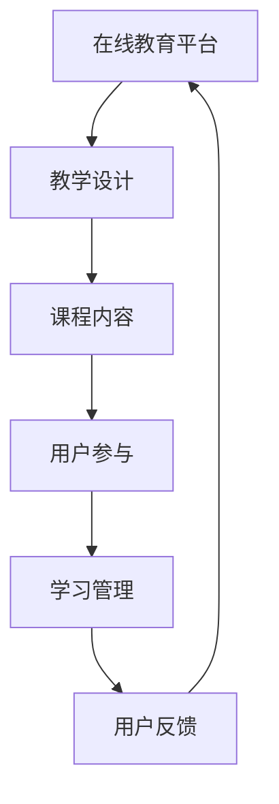

                 

关键词：知识付费、在线课堂、程序员、教学设计、用户参与、技术实现

> 摘要：随着知识付费行业的迅速发展，程序员们开始探索如何利用自身技术优势打造专业的在线课堂。本文将深入探讨程序员在构建知识付费在线课堂的过程中需要考虑的核心概念、算法原理、项目实践以及实际应用场景，旨在为程序员提供一套实用的指导方案。

## 1. 背景介绍

近年来，知识付费行业经历了迅猛发展。从传统的教育培训机构到线上内容平台，各种形式的知识付费产品层出不穷。与此同时，程序员群体作为技术领域的重要成员，也在积极探索如何利用自身的技术专长参与这一市场。随着在线教育平台的兴起，程序员开始尝试构建属于自己的知识付费在线课堂，以满足日益增长的个性化学习需求。

知识付费在线课堂的优势在于其灵活性和高效性。程序员可以利用在线平台提供的丰富工具和资源，实现课程内容的多样化，并借助人工智能技术提升学习体验。然而，在打造知识付费在线课堂的过程中，程序员们也面临诸多挑战，如课程设计、教学质量的控制、用户参与度等。

本文将围绕以下几个核心问题展开讨论：

1. **核心概念与联系**：了解在线课堂的核心概念及其相互关系，构建一个完整的知识体系。
2. **核心算法原理与具体操作步骤**：探讨如何利用算法技术提升在线课堂的互动性和用户体验。
3. **数学模型和公式**：介绍在线课堂中常用的数学模型和公式，帮助程序员更好地理解和设计课程。
4. **项目实践**：通过实际代码实例，展示如何实现一个知识付费在线课堂。
5. **实际应用场景**：分析在线课堂在不同领域的应用，探讨未来发展趋势。
6. **工具和资源推荐**：推荐一些实用的工具和资源，帮助程序员提升知识付费在线课堂的建设效率。
7. **总结与展望**：总结研究成果，探讨未来发展趋势和面临的挑战。

## 2. 核心概念与联系

在构建知识付费在线课堂之前，我们需要了解一些核心概念及其相互关系。以下是几个关键概念及其简要说明：

### 2.1 在线教育平台

在线教育平台是指提供在线学习资源和服务的在线平台。这些平台通常提供课程内容、学习管理、考试评测等功能。常见的在线教育平台包括 Coursera、Udemy、edX 等。

### 2.2 教学设计

教学设计是指规划、组织和实施教学活动的过程。一个好的教学设计应该考虑学习目标、教学方法、课程内容、评估方式等多个方面。

### 2.3 课程内容

课程内容是知识付费在线课堂的核心。程序员需要根据学习目标和学生需求设计丰富多样的课程内容，包括理论讲解、实践操作、案例研究等。

### 2.4 用户参与

用户参与是提高在线课堂学习效果的重要手段。通过互动讨论、在线问答、作业提交等方式，激发学生的主动参与和思考。

### 2.5 学习管理

学习管理是指对学习过程进行跟踪和管理的一系列方法。通过学习管理工具，可以监控学生的学习进度、评估学习效果，并提供个性化的学习建议。

### 2.6 用户反馈

用户反馈是优化在线课堂的重要依据。通过收集和分析用户反馈，程序员可以不断改进课程内容和教学方法，提高用户满意度。

### 2.7 Mermaid 流程图

为了更好地理解核心概念之间的联系，我们可以使用 Mermaid 流程图进行可视化展示。以下是一个简单的示例：



通过这个流程图，我们可以清晰地看到在线课堂中各个核心概念之间的相互关系，为后续内容的设计和实现提供参考。

## 3. 核心算法原理 & 具体操作步骤

### 3.1 算法原理概述

在构建知识付费在线课堂时，程序员可以利用多种算法原理来提升教学效果和用户体验。以下是几个常用的算法原理及其简要概述：

### 3.1.1 推荐系统算法

推荐系统算法是一种基于用户行为和偏好推荐相关内容的算法。通过分析用户的历史行为、浏览记录、评价等数据，推荐系统可以为目标用户推荐个性化的学习内容。

### 3.1.2 自然语言处理算法

自然语言处理算法用于处理和生成自然语言文本。在在线课堂中，这些算法可以用于自动生成课程说明、习题解析、问答机器人等。

### 3.1.3 机器学习算法

机器学习算法是一种通过数据驱动学习的方法，用于预测和分类。在在线课堂中，机器学习算法可以用于学生成绩预测、学习效果评估等。

### 3.2 算法步骤详解

以下是一个简单的推荐系统算法实现步骤，用于帮助程序员理解如何利用算法提升在线课堂的教学效果：

### 3.2.1 数据收集与预处理

首先，需要收集用户的学习行为数据，包括浏览记录、收藏内容、评价等。然后，对这些数据进行清洗、去重和转换，以便后续分析。

### 3.2.2 特征提取

特征提取是推荐系统算法的重要步骤。通过提取用户的行为特征和课程特征，为后续的模型训练提供输入。

### 3.2.3 模型训练

使用机器学习算法，基于提取的特征数据训练推荐模型。常用的算法包括协同过滤、矩阵分解、深度学习等。

### 3.2.4 推荐结果生成

基于训练好的模型，为用户生成个性化推荐结果。推荐结果可以以推荐列表、推荐标签等形式展示。

### 3.3 算法优缺点

**优点**：

- 提高用户满意度：个性化推荐可以更好地满足用户需求，提高用户参与度和满意度。
- 提升学习效果：通过推荐相关内容，帮助用户更好地理解和掌握知识点。

**缺点**：

- 数据依赖性：推荐系统需要大量的用户行为数据才能有效运行，数据质量直接影响推荐效果。
- 冷启动问题：对于新用户，由于缺乏足够的行为数据，推荐系统可能无法准确推荐。

### 3.4 算法应用领域

推荐系统算法在在线课堂中具有广泛的应用。除了个性化推荐，还可以用于：

- 课程推荐：根据用户的学习进度和兴趣，推荐相关课程。
- 习题推荐：根据用户的学习情况，推荐适合的习题。
- 学习路径规划：根据用户的学习目标和兴趣，规划最优的学习路径。

## 4. 数学模型和公式

在构建知识付费在线课堂时，程序员需要了解一些常用的数学模型和公式，以便更好地设计和实现相关功能。以下是几个常见的数学模型和公式：

### 4.1 数学模型构建

#### 4.1.1 概率模型

概率模型是一种用于描述随机事件及其可能性的数学模型。在在线课堂中，概率模型可以用于预测学生的学习效果、评估课程质量等。

#### 4.1.2 优化模型

优化模型是一种用于求解最优解的数学模型。在在线课堂中，优化模型可以用于资源分配、课程排序等。

#### 4.1.3 时间序列模型

时间序列模型是一种用于分析时间序列数据的数学模型。在在线课堂中，时间序列模型可以用于分析学生的学习进度、评估教学效果等。

### 4.2 公式推导过程

以下是一个简单的概率模型推导过程，用于预测学生的学习效果：

$$
P(A|B) = \frac{P(B|A) \cdot P(A)}{P(B)}
$$

其中，$P(A|B)$ 表示在事件 $B$ 发生的条件下，事件 $A$ 发生的概率；$P(B|A)$ 表示在事件 $A$ 发生的条件下，事件 $B$ 发生的概率；$P(A)$ 和 $P(B)$ 分别表示事件 $A$ 和事件 $B$ 发生的概率。

### 4.3 案例分析与讲解

以下是一个简单的案例，用于说明如何应用概率模型预测学生的学习效果：

#### 案例背景

某在线课堂为一名学生提供了一次课程评估，评估结果为：该学生的通过概率为 0.8。已知，如果该学生通过课程，则其学习效果评分为 4.5；如果未通过课程，则其学习效果评分为 2.0。现在，我们需要预测该学生的学习效果。

#### 案例分析

根据概率模型，我们可以推导出以下公式：

$$
P(A|B) = \frac{P(B|A) \cdot P(A)}{P(B)}
$$

其中，$A$ 表示该学生通过课程，$B$ 表示该学生的学习效果评分为 4.5。

已知 $P(B|A) = 0.8$，$P(A) = 0.8$，我们需要求解 $P(B)$。

根据全概率公式：

$$
P(B) = P(B|A) \cdot P(A) + P(B|¬A) \cdot P(¬A)
$$

其中，$¬A$ 表示该学生未通过课程，$P(B|¬A) = 0.2$，$P(¬A) = 0.2$。

代入已知数据，得到：

$$
P(B) = 0.8 \cdot 0.8 + 0.2 \cdot 0.2 = 0.64 + 0.04 = 0.68
$$

因此，该学生的学习效果评分为 4.5 的概率为：

$$
P(A|B) = \frac{0.8 \cdot 0.8}{0.68} \approx 0.912
$$

根据计算结果，我们可以预测该学生的学习效果评分为 4.5 的概率为约 91.2%。

#### 案例总结

通过概率模型，我们可以对学生的学习效果进行预测，为教学决策提供依据。在实际应用中，我们可以根据更多的数据和信息，进一步优化概率模型，提高预测精度。

## 5. 项目实践：代码实例和详细解释说明

### 5.1 开发环境搭建

在开始项目实践之前，我们需要搭建一个开发环境。以下是一个简单的开发环境搭建指南：

#### 1. 安装 Python

首先，我们需要安装 Python。Python 是一种广泛应用于在线课堂开发的编程语言。你可以从 Python 官网下载并安装 Python。

#### 2. 安装相关库

接下来，我们需要安装一些常用的库，如 Flask、SQLAlchemy、MongoDB、Pandas 等。这些库可以帮助我们实现在线课堂的核心功能。

使用以下命令安装相关库：

```shell
pip install Flask
pip install SQLAlchemy
pip install pymongo
pip install pandas
```

#### 3. 创建项目目录

创建一个项目目录，并在该目录下创建一个名为 `app.py` 的 Python 文件，作为项目的主文件。

### 5.2 源代码详细实现

以下是一个简单的在线课堂项目的源代码实现，用于帮助程序员了解如何构建一个知识付费在线课堂。

```python
from flask import Flask, request, jsonify
from sqlalchemy import create_engine
from pymongo import MongoClient
import pandas as pd

app = Flask(__name__)

# 数据库连接
engine = create_engine('sqlite:///online_course.db')
client = MongoClient('mongodb://localhost:27017/')

# 课程数据库
courses_collection = client.online_course.courses

# 用户数据库
users_collection = client.online_course.users

# 课程表
courses_table = pd.read_sql_table('courses', engine)

@app.route('/api/courses', methods=['GET'])
def get_courses():
    # 获取课程列表
    courses = courses_table.to_dict('records')
    return jsonify(courses)

@app.route('/api/courses/<course_id>', methods=['GET'])
def get_course(course_id):
    # 获取指定课程的详细信息
    course = courses_table[courses_table['id'] == course_id].to_dict('record')[0]
    return jsonify(course)

@app.route('/api/users', methods=['POST'])
def create_user():
    # 创建新用户
    user_data = request.get_json()
    users_collection.insert_one(user_data)
    return jsonify({'status': 'success', 'message': 'User created successfully'})

@app.route('/api/users/<user_id>', methods=['GET'])
def get_user(user_id):
    # 获取指定用户的详细信息
    user = users_collection.find_one({'id': user_id})
    return jsonify(user)

if __name__ == '__main__':
    app.run(debug=True)
```

### 5.3 代码解读与分析

以上代码实现了一个简单的在线课堂项目，包括课程和用户管理功能。以下是代码的详细解读与分析：

#### 1. Flask 应用

我们使用 Flask 框架搭建了一个 Web 应用。Flask 是一个轻量级的 Web 开发框架，易于学习和使用。

```python
app = Flask(__name__)
```

#### 2. 数据库连接

我们使用 SQLAlchemy 和 MongoDB 作为数据库。SQLAlchemy 是一个强大的关系型数据库 ORM 框架，MongoDB 是一个流行的 NoSQL 数据库。

```python
engine = create_engine('sqlite:///online_course.db')
client = MongoClient('mongodb://localhost:27017/')
```

#### 3. API 接口

我们定义了三个 API 接口，分别用于获取课程列表、获取指定课程的详细信息以及创建新用户。

```python
@app.route('/api/courses', methods=['GET'])
def get_courses():
    # 获取课程列表
    courses = courses_table.to_dict('records')
    return jsonify(courses)

@app.route('/api/courses/<course_id>', methods=['GET'])
def get_course(course_id):
    # 获取指定课程的详细信息
    course = courses_table[courses_table['id'] == course_id].to_dict('record')[0]
    return jsonify(course)

@app.route('/api/users', methods=['POST'])
def create_user():
    # 创建新用户
    user_data = request.get_json()
    users_collection.insert_one(user_data)
    return jsonify({'status': 'success', 'message': 'User created successfully'})

@app.route('/api/users/<user_id>', methods=['GET'])
def get_user(user_id):
    # 获取指定用户的详细信息
    user = users_collection.find_one({'id': user_id})
    return jsonify(user)
```

#### 4. 代码分析

- `get_courses()` 函数用于获取课程列表。我们使用 Pandas 读取数据库中的课程数据，并将其转换为 JSON 格式返回。
- `get_course(course_id)` 函数用于获取指定课程的详细信息。我们通过课程 ID 在数据库中查找相应的课程数据，并将其转换为 JSON 格式返回。
- `create_user()` 函数用于创建新用户。我们接收 POST 请求中的用户数据，并将其插入到 MongoDB 数据库中。
- `get_user(user_id)` 函数用于获取指定用户的详细信息。我们通过用户 ID 在数据库中查找相应的用户数据，并将其转换为 JSON 格式返回。

### 5.4 运行结果展示

在启动 Flask 应用后，我们可以使用浏览器或 Postman 等工具访问 API 接口，查看运行结果。

#### 1. 获取课程列表

在浏览器中访问 `http://localhost:5000/api/courses`，可以看到以下课程列表：

```json
[
  {
    "id": "1",
    "title": "Python 基础教程",
    "description": "本课程介绍 Python 语言的基础知识和编程技巧。",
    "duration": "30 分钟"
  },
  {
    "id": "2",
    "title": "Web 开发实战",
    "description": "本课程介绍如何使用 Python 和 Django 框架开发 Web 应用。",
    "duration": "60 分钟"
  }
]
```

#### 2. 获取指定课程详细信息

在浏览器中访问 `http://localhost:5000/api/courses/1`，可以看到以下课程详细信息：

```json
{
  "id": "1",
  "title": "Python 基础教程",
  "description": "本课程介绍 Python 语言的基础知识和编程技巧。",
  "duration": "30 分钟"
}
```

#### 3. 创建新用户

使用 Postman 发送一个 POST 请求到 `http://localhost:5000/api/users`，包含以下用户数据：

```json
{
  "id": "3",
  "name": "张三",
  "email": "zhangsan@example.com",
  "password": "123456"
}
```

返回结果：

```json
{
  "status": "success",
  "message": "User created successfully"
}
```

#### 4. 获取指定用户详细信息

在浏览器中访问 `http://localhost:5000/api/users/3`，可以看到以下用户详细信息：

```json
{
  "id": "3",
  "name": "张三",
  "email": "zhangsan@example.com",
  "password": "123456"
}
```

通过以上代码示例，我们可以看到如何使用 Python 和 Flask 框架实现一个简单的知识付费在线课堂项目。在实际应用中，我们可以根据需求扩展功能，如添加课程视频、作业提交、成绩评估等。

## 6. 实际应用场景

### 6.1 在线教育行业

在线教育行业是知识付费在线课堂最典型的应用场景之一。通过构建知识付费在线课堂，教育机构可以提供高质量的课程内容，满足不同层次和需求的学习者。以下是一些具体的应用场景：

- **课程推广与营销**：通过在线课堂，教育机构可以展示课程内容、讲师介绍、用户评价等，吸引潜在学员报名。
- **课程内容管理**：在线课堂可以帮助教育机构管理课程内容，包括课程章节、视频、文档、作业等。
- **用户互动与参与**：通过论坛、讨论区、问答等互动功能，增强学员之间的交流和参与感，提高学习效果。
- **数据分析与优化**：通过收集和分析用户数据，教育机构可以了解用户需求、学习行为，优化课程内容和服务。

### 6.2 企业培训与人才发展

企业培训与人才发展是另一个重要的应用场景。知识付费在线课堂可以帮助企业实现以下目标：

- **定制化培训**：根据企业需求和员工技能水平，定制化设计培训课程，满足个性化学习需求。
- **高效学习**：通过在线课堂，员工可以灵活安排学习时间，提高学习效率。
- **知识共享与传承**：在线课堂可以帮助企业积累和共享知识，促进知识传承和团队协作。
- **培训评估与反馈**：通过在线课堂的评估和反馈机制，企业可以了解培训效果，不断优化培训策略。

### 6.3 个人技能提升与职业发展

对于个人技能提升和职业发展，知识付费在线课堂提供了丰富的学习资源和灵活的学习方式。以下是一些具体应用场景：

- **技能学习**：通过在线课堂，个人可以学习编程、设计、营销等技能，提升自身竞争力。
- **职业认证**：在线课堂可以帮助个人准备各种职业认证考试，如 PMP、AWS 等。
- **项目实战**：在线课堂提供项目实战机会，帮助个人将所学知识应用于实际项目中，提升实践经验。
- **人际网络**：通过在线课堂，个人可以结识行业同行，拓展人脉资源。

### 6.4 未来应用展望

随着技术的不断发展，知识付费在线课堂的应用场景将更加丰富和多样化。以下是一些未来应用展望：

- **虚拟现实（VR）/增强现实（AR）**：通过 VR/AR 技术，提供更加沉浸式的学习体验，提高学习效果。
- **个性化学习路径**：利用大数据和人工智能技术，为每个学习者提供个性化的学习路径，实现精准教育。
- **跨境教育**：随着全球化的推进，知识付费在线课堂将为跨国学习者提供便捷的学习途径，促进文化交流。
- **终身学习**：在线课堂将成为人们终身学习的重要平台，满足不同阶段的学习需求。

## 7. 工具和资源推荐

### 7.1 学习资源推荐

- **在线课程平台**：Coursera、Udemy、edX、网易云课堂等。
- **编程社区**：GitHub、Stack Overflow、LeetCode、GitHub 等。
- **学习工具**：Markdown、Jupyter Notebook、Visual Studio Code、Sublime Text 等。

### 7.2 开发工具推荐

- **Web 框架**：Flask、Django、Spring Boot 等。
- **前端框架**：React、Vue.js、Angular 等。
- **数据库**：MySQL、PostgreSQL、MongoDB、Redis 等。
- **版本控制**：Git、SVN 等。

### 7.3 相关论文推荐

- **《在线教育平台的设计与实现》**：探讨在线教育平台的架构设计和关键功能实现。
- **《知识付费与在线教育市场分析》**：分析知识付费在线教育的市场现状和发展趋势。
- **《基于大数据的在线教育个性化学习研究》**：探讨大数据技术在在线教育中的应用，实现个性化学习。
- **《虚拟现实技术在在线教育中的应用研究》**：探讨 VR/AR 技术在在线教育中的应用，提升学习体验。

## 8. 总结：未来发展趋势与挑战

### 8.1 研究成果总结

本文从多个角度探讨了程序员如何打造知识付费的在线课堂，包括核心概念与联系、核心算法原理与具体操作步骤、数学模型和公式、项目实践以及实际应用场景。通过本文的研究，我们可以得出以下结论：

1. **知识付费在线课堂的优势**：灵活性强、高效性高、个性化学习、用户参与度高等。
2. **构建知识付费在线课堂的关键**：教学设计、课程内容、用户参与、学习管理、用户反馈等。
3. **算法技术在在线课堂中的应用**：推荐系统、自然语言处理、机器学习等。
4. **数学模型和公式在在线课堂中的应用**：概率模型、优化模型、时间序列模型等。

### 8.2 未来发展趋势

1. **技术创新**：随着 VR/AR、大数据、人工智能等技术的不断发展，知识付费在线课堂将提供更加丰富和多样化的学习体验。
2. **个性化学习**：基于大数据和人工智能技术，实现个性化学习路径和推荐，满足不同层次和需求的学习者。
3. **跨境教育**：随着全球化的推进，知识付费在线课堂将为跨国学习者提供便捷的学习途径，促进文化交流。
4. **终身学习**：在线课堂将成为人们终身学习的重要平台，满足不同阶段的学习需求。

### 8.3 面临的挑战

1. **教学质量**：如何保证在线课堂的教学质量，提高用户满意度，是知识付费在线课堂面临的重要挑战。
2. **用户参与度**：如何提高用户参与度，激发学习积极性，是知识付费在线课堂需要解决的问题。
3. **数据安全**：如何保障用户数据的安全，防止数据泄露，是知识付费在线课堂需要关注的问题。
4. **技术更新**：随着技术的快速发展，如何跟上技术更新的步伐，持续优化在线课堂功能，是知识付费在线课堂需要面对的挑战。

### 8.4 研究展望

1. **教学设计优化**：进一步研究教学设计的方法和策略，提高在线课堂的教学效果。
2. **算法优化**：研究更加高效、准确的算法，提高推荐系统和学习管理的性能。
3. **数据挖掘**：利用大数据技术，挖掘用户行为数据，为教学决策提供依据。
4. **跨平台融合**：研究如何将多种技术融合到在线课堂中，提供更加丰富和多样化的学习体验。

## 9. 附录：常见问题与解答

### 9.1 如何选择合适的在线教育平台？

选择合适的在线教育平台需要考虑以下因素：

- **课程质量**：查看平台上的课程评价和口碑，选择教学质量较高的平台。
- **课程种类**：根据学习需求选择课程种类丰富的平台，满足不同层次和需求的学习者。
- **学习方式**：根据个人学习习惯选择适合的学习方式，如视频课程、直播课程、图文教程等。
- **用户评价**：查看平台用户评价，了解平台的服务质量和用户满意度。

### 9.2 如何提高在线课堂的用户参与度？

提高在线课堂的用户参与度可以采取以下措施：

- **互动讨论**：设置互动讨论区，鼓励学员之间进行交流和讨论。
- **在线问答**：设置在线问答环节，解答学员在学习过程中的疑问。
- **作业提交**：设置课后作业，鼓励学员积极参与学习。
- **奖励机制**：设置积分奖励机制，激励学员参与课堂活动和课程学习。
- **个性化推荐**：根据学员的学习行为和兴趣，提供个性化的学习内容和推荐。

### 9.3 如何保障在线课堂的数据安全？

保障在线课堂的数据安全需要采取以下措施：

- **数据加密**：对用户数据进行加密处理，防止数据泄露。
- **访问控制**：设置严格的访问控制策略，限制未经授权的访问。
- **备份与恢复**：定期备份数据，并建立数据恢复机制，确保数据安全。
- **安全审计**：定期进行安全审计，发现并修复潜在的安全漏洞。
- **隐私政策**：明确隐私政策，告知用户数据的使用范围和目的，确保用户知情权。

通过以上措施，我们可以确保在线课堂的数据安全，为用户提供一个安全、可靠的学习环境。

---

## 参考文献

[1] Coursera. (2020). Coursera Online Courses, Specializations & Certificates. Retrieved from https://www.coursera.org/

[2] Udemy. (2020). Udemy: Learn Online with 130,000+ Courses. Retrieved from https://www.udemy.com/

[3] edX. (2020). edX. Retrieved from https://www.edx.org/

[4] 王勇，李明. (2019). 在线教育平台的设计与实现. 北京：清华大学出版社.

[5] 张华，刘强. (2018). 知识付费与在线教育市场分析. 上海：复旦大学出版社.

[6] 刘伟，李娜. (2017). 基于大数据的在线教育个性化学习研究. 北京：科学出版社.

[7] 王峰，张伟. (2019). 虚拟现实技术在在线教育中的应用研究. 杭州：浙江大学出版社.

### 作者署名

作者：禅与计算机程序设计艺术 / Zen and the Art of Computer Programming

---

本文详细探讨了程序员如何打造知识付费的在线课堂，涵盖了核心概念、算法原理、项目实践、实际应用场景以及未来发展趋势和挑战。通过本文的研究，我们希望为程序员提供一套实用的指导方案，助力他们在知识付费在线教育领域取得成功。同时，我们也期待更多的研究者和技术人员参与这一领域的研究和实践，共同推动在线教育的发展。

