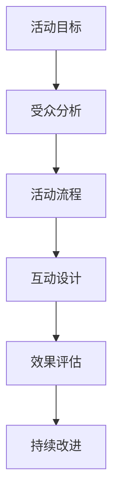

                 

关键词：知识付费、线下活动、活动策划、用户参与、互动设计、效果评估

> 摘要：本文将深入探讨程序员如何策划并成功实施一场知识付费的线下活动，涵盖了活动准备、用户参与、互动设计、效果评估等关键环节，旨在为程序员提供一套可操作的实战指南。

## 1. 背景介绍

随着知识付费的兴起，越来越多的人开始通过参加线下活动来学习新技能、拓展人脉和获取行业资讯。对于程序员来说，线下活动不仅是一个学习平台，也是一个展现个人能力和建立品牌影响力的机会。然而，如何策划一场成功的知识付费线下活动，对于许多程序员来说仍然是一个挑战。本文将从实际操作角度出发，为程序员提供一套完整的策划指南。

### 1.1 知识付费线下活动的意义

- **学习与成长**：为参与者提供一个面对面交流的平台，促进知识的传播和技能的提升。
- **品牌推广**：通过活动提高个人或公司的知名度，建立专业形象。
- **社交拓展**：参与者可以在活动中结识同行业的人士，拓展人脉网络。
- **经济效益**：通过知识付费，为活动组织者带来直接的经济收益。

### 1.2 线下活动策划的挑战

- **受众定位**：明确目标用户，确保活动内容与受众需求相匹配。
- **内容策划**：设计有吸引力的课程或主题，提升活动质量。
- **场地选择**：找到合适的场地，确保活动的顺利进行。
- **成本控制**：在预算范围内，合理分配资源，确保活动的成本效益。

## 2. 核心概念与联系

为了更好地策划一场知识付费的线下活动，我们需要理解以下几个核心概念：

### 2.1 活动目标

明确活动的目标，例如提高参与者的编程技能、拓展行业知识、促进社交交流等。

### 2.2 受众分析

分析目标受众的需求、兴趣和行为习惯，以便提供更符合他们期望的活动内容。

### 2.3 活动流程

设计活动流程，包括签到、开场介绍、课程讲解、互动环节、闭幕总结等。

### 2.4 互动设计

通过提问、讨论、案例分享等形式，增加参与者的互动性，提升活动效果。

### 2.5 效果评估

通过问卷调查、用户反馈等方式，对活动效果进行评估，以便持续改进。

下面是一个使用Mermaid绘制的流程图，展示了这些核心概念的关联：



## 3. 核心算法原理 & 具体操作步骤

### 3.1 算法原理概述

策划一场成功的知识付费线下活动，可以看作是一个复杂的问题求解过程。其核心算法原理可以归纳为以下几个步骤：

1. **明确目标**：根据活动目的和受众需求，确定活动主题和内容。
2. **受众分析**：通过调研和数据分析，明确目标受众的特征和需求。
3. **内容策划**：根据受众分析结果，设计具有吸引力和实用性的活动内容。
4. **互动设计**：通过多种互动形式，提高参与者的积极性和参与度。
5. **效果评估**：收集用户反馈，对活动效果进行评估和改进。

### 3.2 算法步骤详解

#### 3.2.1 明确目标

首先，需要明确活动的目标。这个目标可以是提高参与者的编程技能、拓展行业知识、促进社交交流等。明确目标有助于后续的活动策划和执行。

#### 3.2.2 受众分析

接下来，进行受众分析。这包括了解受众的基本信息（如年龄、职业、技能水平等），以及他们的需求和兴趣。可以通过问卷调查、访谈等方式收集这些信息。

#### 3.2.3 内容策划

根据受众分析的结果，设计活动内容。这包括确定活动主题、选择授课教师、制定课程大纲等。内容策划的关键是要确保活动内容与受众需求相匹配，具有较高的实用性和吸引力。

#### 3.2.4 互动设计

互动设计是提升活动效果的关键。可以通过提问、讨论、案例分享等形式，增加参与者的互动性。例如，可以设置互动环节，让参与者就课程内容进行讨论，或者分享他们的实际工作经验。

#### 3.2.5 效果评估

最后，进行效果评估。这可以通过问卷调查、用户反馈等方式进行。收集的数据可以帮助我们了解活动的效果，找出不足之处，并制定改进措施。

### 3.3 算法优缺点

#### 优点

- **针对性强**：通过明确目标和受众分析，活动内容可以更加贴合受众需求，提高参与度。
- **互动性强**：通过多种互动形式，可以提高参与者的积极性和参与度。
- **效果可评估**：通过效果评估，可以持续改进活动质量，提升活动效果。

#### 缺点

- **策划复杂**：需要投入大量时间和精力进行受众分析和内容策划。
- **成本较高**：线下活动需要考虑场地、讲师等成本，可能需要一定的经济支持。

### 3.4 算法应用领域

该算法原理可以广泛应用于各类知识付费的线下活动，如编程技能培训、行业研讨会、技术沙龙等。

## 4. 数学模型和公式 & 详细讲解 & 举例说明

### 4.1 数学模型构建

在策划知识付费的线下活动时，我们可以使用一些数学模型来帮助决策和优化。以下是一个简单的模型构建过程：

#### 模型构建步骤：

1. **确定变量**：根据活动目标和受众分析，确定影响活动效果的关键变量，如参与者数量、课程质量、互动环节等。
2. **构建函数**：根据变量之间的关系，构建衡量活动效果的函数，如参与者满意度、课程完成度等。
3. **目标函数**：确定优化目标，如最大化参与者满意度或最小化活动成本。

#### 示例：

假设我们要策划一场编程技能培训活动，影响参与者满意度的关键因素有课程质量（\(Q\)）、互动环节（\(I\)）和活动时长（\(T\)）。我们可以构建以下函数来衡量参与者满意度：

$$
S = f(Q, I, T)
$$

其中，\(f\) 是一个综合评价函数，可以根据具体情况选择线性、非线性或其他形式的函数。

### 4.2 公式推导过程

#### 推导过程：

1. **假设条件**：根据实际经验和常识，为每个变量设定合理的假设条件。
   - 课程质量（\(Q\)）：与授课教师的经验、教学方法和课程内容相关。
   - 互动环节（\(I\)）：与互动形式的设计和参与者的积极性相关。
   - 活动时长（\(T\)）：与活动内容的深度和广度相关。

2. **函数关系**：根据假设条件，建立变量之间的关系，如：
   - \(Q \propto 教师经验\)
   - \(I \propto 互动形式\)
   - \(T \propto 课程深度\)

3. **综合评价**：将变量之间的关系代入综合评价函数，进行推导。

   假设课程质量、互动环节和活动时长分别与教师经验、互动形式和课程深度成正比，则：

   $$
   Q = k_1 \cdot 教师经验
   $$

   $$
   I = k_2 \cdot 互动形式
   $$

   $$
   T = k_3 \cdot 课程深度
   $$

   其中，\(k_1\)、\(k_2\) 和 \(k_3\) 为比例系数。

4. **满意度函数**：代入上述关系，得到满意度函数：

   $$
   S = f(k_1 \cdot 教师经验, k_2 \cdot 互动形式, k_3 \cdot 课程深度)
   $$

   根据实际情况，可以选择合适的函数形式，如线性、多项式、指数等。

### 4.3 案例分析与讲解

以下是一个具体的案例，用于说明如何使用上述数学模型来策划一场编程技能培训活动。

#### 案例背景：

一家公司计划举办一场面向新入职程序员的编程技能培训活动，以提高他们的编程技能和工作效率。公司管理层希望通过活动提升员工的综合素质，同时也为员工提供一个相互学习和交流的平台。

#### 模型应用：

1. **确定变量**：
   - 参与者数量（\(N\)）：100人
   - 教师经验（\(E\)）：5年
   - 互动形式（\(F\)）：小组讨论、案例分析
   - 课程深度（\(D\)）：中级编程技巧

2. **构建函数**：
   - 假设满意度函数为线性函数：
     $$
     S = 0.5 \cdot Q + 0.3 \cdot I + 0.2 \cdot T
     $$
   - 课程质量（\(Q\)）：
     $$
     Q = 1.2 \cdot E
     $$
   - 互动环节（\(I\)）：
     $$
     I = 0.8 \cdot F
     $$
   - 活动时长（\(T\)）：
     $$
     T = 1.0 \cdot D
     $$

3. **计算满意度**：
   - 教师经验（\(E\)）：5年
     $$
     Q = 1.2 \cdot 5 = 6.0
     $$
   - 互动形式（\(F\)）：小组讨论、案例分析
     $$
     I = 0.8 \cdot 1 = 0.8
     $$
   - 课程深度（\(D\)）：中级编程技巧
     $$
     T = 1.0 \cdot 1 = 1.0
     $$
   - 满意度（\(S\)）：
     $$
     S = 0.5 \cdot 6.0 + 0.3 \cdot 0.8 + 0.2 \cdot 1.0 = 3.6 + 0.24 + 0.2 = 3.94
     $$

4. **分析结果**：
   - 根据计算结果，该编程技能培训活动的预期满意度为3.94。这表明活动在课程质量、互动环节和活动时长等方面都有较好的表现。但也可以通过调整变量值，如增加教师经验、优化互动形式、延长活动时长等，来进一步提高满意度。

通过这个案例，我们可以看到如何使用数学模型来分析和优化知识付费的线下活动。这为程序员提供了一个系统的方法，帮助他们更好地策划和实施活动。

### 5. 项目实践：代码实例和详细解释说明

为了更好地理解如何策划知识付费的线下活动，我们将通过一个具体的编程项目来实践。这个项目将涉及活动报名系统、互动模块和效果评估系统。

#### 5.1 开发环境搭建

首先，我们需要搭建一个开发环境。在这个项目中，我们使用以下工具：

- **编程语言**：Python
- **框架**：Flask（用于Web开发）
- **数据库**：SQLite（用于存储数据）

#### 5.2 源代码详细实现

下面是一个简单的Flask应用程序，用于实现活动报名系统、互动模块和效果评估系统。

```python
from flask import Flask, request, render_template
import sqlite3

app = Flask(__name__)

# 连接数据库
conn = sqlite3.connect('activity.db')
c = conn.cursor()

# 创建表
c.execute('''CREATE TABLE IF NOT EXISTS participants (name TEXT, email TEXT, skill_level TEXT)''')
c.execute('''CREATE TABLE IF NOT EXISTS feedback (name TEXT, comment TEXT)''')
conn.commit()

# 报名页面
@app.route('/', methods=['GET', 'POST'])
def index():
    if request.method == 'POST':
        name = request.form['name']
        email = request.form['email']
        skill_level = request.form['skill_level']
        c.execute("INSERT INTO participants (name, email, skill_level) VALUES (?, ?, ?)", (name, email, skill_level))
        conn.commit()
        return '报名成功！'
    return render_template('index.html')

# 互动模块
@app.route('/interact', methods=['GET', 'POST'])
def interact():
    if request.method == 'POST':
        name = request.form['name']
        comment = request.form['comment']
        c.execute("INSERT INTO feedback (name, comment) VALUES (?, ?)", (name, comment))
        conn.commit()
        return '提交成功！'
    return render_template('interact.html')

# 效果评估
@app.route('/evaluate')
def evaluate():
    feedback_count = c.execute('SELECT COUNT(*) FROM feedback').fetchone()[0]
    avg_rating = c.execute('SELECT AVG(rating) FROM feedback').fetchone()[0]
    return render_template('evaluate.html', feedback_count=feedback_count, avg_rating=avg_rating)

if __name__ == '__main__':
    app.run(debug=True)
```

#### 5.3 代码解读与分析

1. **数据库连接与表创建**：首先，我们使用SQLite数据库来存储参与者信息和反馈信息。如果表已存在，则跳过创建表的操作。

2. **报名页面**：这个页面使用HTML表单来收集参与者的姓名、电子邮件和技能水平。当用户提交表单时，数据会被插入到数据库中。

3. **互动模块**：这个模块允许用户提交反馈。反馈信息（姓名和评论）会被插入到数据库中。

4. **效果评估**：这个页面会查询数据库中的反馈信息，计算反馈数量和平均评分，并显示在页面上。

#### 5.4 运行结果展示

- **报名系统**：用户可以通过Web页面进行报名，界面友好，易于操作。

- **互动模块**：用户可以在页面上提交反馈，界面简洁明了，便于用户填写。

- **效果评估**：通过简单的查询，我们可以快速了解活动的反馈情况，为后续改进提供数据支持。

### 6. 实际应用场景

知识付费的线下活动在许多场景中都有广泛的应用，以下是几个典型的应用场景：

#### 6.1 技术培训

许多科技公司会定期举办编程技能培训活动，帮助员工提升技术水平，提高工作效率。这些活动通常涵盖最新的编程语言、框架和工具，以及实用的编程技巧。

#### 6.2 行业研讨会

行业研讨会是交流和分享行业最新动态和研究成果的重要平台。程序员可以参加这些研讨会，了解行业趋势，拓展视野，结识同行。

#### 6.3 技术沙龙

技术沙龙通常是一个轻松的交流环境，程序员可以在这里分享自己的项目经验、解决技术难题，以及探讨未来的发展方向。

#### 6.4 在线教育平台

一些在线教育平台会举办线下活动，结合线上学习资源和线下互动，为学员提供更全面的学习体验。

### 6.5 未来应用展望

随着技术的不断进步，知识付费的线下活动在未来有望在更多领域得到应用。例如，虚拟现实（VR）和增强现实（AR）技术的应用，可以使活动更加生动和沉浸式。此外，人工智能（AI）技术的引入，可以帮助更好地分析用户需求，提高活动的个性化水平。

### 7. 工具和资源推荐

为了成功举办一场知识付费的线下活动，程序员可以参考以下工具和资源：

#### 7.1 学习资源推荐

- **书籍**：《活动的艺术：如何策划和管理成功的活动》（"The Event Planner's Handbook"）
- **在线课程**：Coursera、Udemy等平台上的活动策划和管理课程

#### 7.2 开发工具推荐

- **Web框架**：Flask、Django等
- **数据库**：SQLite、MySQL等
- **前端框架**：React、Vue等

#### 7.3 相关论文推荐

- **"Event Management: An Integrated Approach"**：对活动管理提供了一个全面的理论框架。
- **"Event Technology: Tools for Engagement and Analytics"**：探讨了如何利用技术提升活动效果。

### 8. 总结：未来发展趋势与挑战

#### 8.1 研究成果总结

本文从多个角度探讨了程序员如何策划并成功举办知识付费的线下活动。通过明确目标、受众分析、内容策划、互动设计和效果评估，程序员可以系统地策划和实施活动。同时，通过实际项目实践，展示了如何使用代码实现活动系统。

#### 8.2 未来发展趋势

- **个性化**：随着技术的发展，活动将更加个性化，满足不同受众的需求。
- **技术融合**：VR、AR、AI等新兴技术将进一步提升活动的互动性和体验。

#### 8.3 面临的挑战

- **成本控制**：在线下活动策划中，成本控制是一个重要挑战，需要合理分配资源。
- **用户参与度**：提高用户参与度是确保活动效果的关键，需要精心设计互动环节。

#### 8.4 研究展望

未来，我们将继续探索如何更好地利用技术提升活动的效果，为程序员提供更高效、更有针对性的策划指南。

### 9. 附录：常见问题与解答

#### 问题1：如何确定活动的目标？

**解答**：首先，了解活动的背景和目的，明确希望达成的目标。可以通过调研和与利益相关者沟通，获取更多相关信息。

#### 问题2：如何进行受众分析？

**解答**：可以通过问卷调查、访谈等方式收集受众的信息，如年龄、职业、技能水平等。分析这些数据，找出受众的共同特点和需求。

#### 问题3：如何设计互动环节？

**解答**：可以根据活动主题和受众特点，设计适合的互动环节，如小组讨论、案例分享、提问等。确保互动形式能够激发参与者的兴趣和积极性。

#### 问题4：如何评估活动效果？

**解答**：可以通过问卷调查、用户反馈等方式收集数据，衡量活动目标的达成情况。同时，分析参与者的反馈，找出活动的优点和不足，为后续改进提供依据。

### 参考文献

1. Event Management Association. (2019). "Event Management: An Integrated Approach".
2. Event Technology Summit. (2020). "Event Technology: Tools for Engagement and Analytics".
3. Coursera. (2021). "Event Planning and Management Specialization".
4. Udemy. (2021). "How to Plan and Manage Events: The Ultimate Guide".

---

**作者：禅与计算机程序设计艺术 / Zen and the Art of Computer Programming**

