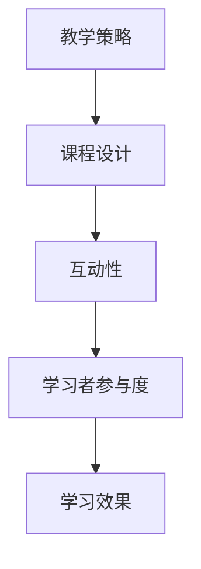
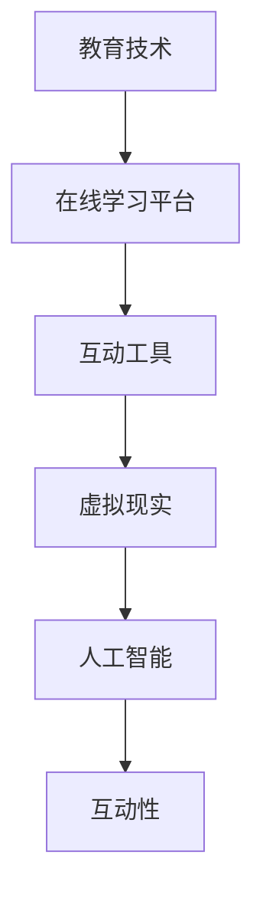
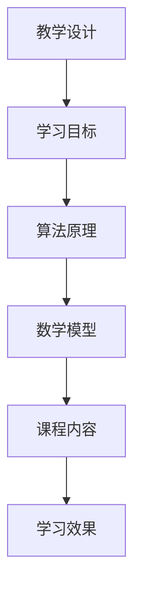

                 

关键词：在线工作坊、互动性、程序员、教育技术、软件开发、教学设计

> 摘要：本文旨在探讨程序员如何利用教育技术和教学设计原理，打造高互动性的在线工作坊。通过对互动性核心概念的解析、教学策略的运用以及技术实现的探讨，文章提供了具体的操作步骤和案例分析，旨在帮助程序员提升在线教育效果。

## 1. 背景介绍

在线工作坊作为一种新兴的教育模式，凭借其灵活性和互动性，正逐渐成为程序员技能提升和知识分享的重要途径。然而，与传统线下工作坊相比，在线环境中的互动性受到诸多因素的挑战，如时间差、技术设备差异和参与者的注意力分散等。因此，如何设计并实现高互动性的在线工作坊，成为程序员和教育工作者亟待解决的问题。

本文将围绕以下核心概念展开讨论：互动性、教育技术、教学设计、算法原理、数学模型以及实际应用。通过这些核心概念的分析，我们将深入探讨如何构建一个既有深度又具互动性的在线学习体验。

### 1.1 互动性的核心概念

互动性是指参与者之间以及参与者与学习内容之间的动态交互。在在线工作坊中，互动性不仅体现在技术层面，更关乎教学设计、学习者参与度和课程内容的质量。有效互动可以提升学习效果，增强学习者的参与感和成就感。

### 1.2 教育技术的应用

教育技术包括在线学习平台、虚拟现实（VR）、人工智能（AI）和大数据等新兴技术。这些技术不仅丰富了教学手段，还为提高互动性提供了可能性。例如，在线学习平台可以提供实时讨论区、投票系统和互动式练习，增强学习者的参与感。

### 1.3 教学设计的原则

教学设计是指根据学习目标和学习者特征，规划教学活动和课程内容的过程。良好的教学设计能够提高学习效率，促进学习者积极参与。在教学设计中，需要关注学习目标的明确性、教学方法的多样性和学习资源的丰富性。

### 1.4 算法原理和数学模型

算法原理和数学模型是程序员的核心知识领域。在线工作坊中，通过讲解和实际操作，程序员可以更好地理解和应用这些原理。数学模型则可以帮助程序员更精确地描述问题，为算法设计提供理论基础。

### 1.5 实际应用场景

在线工作坊的应用场景非常广泛，包括但不限于软件开发、人工智能、数据科学等领域。通过实际案例，我们可以看到如何在不同场景下打造高互动性的在线工作坊。

## 2. 核心概念与联系

### 2.1 教学策略与互动性的联系

教学策略是促进互动性的关键。以下是一个简化的 Mermaid 流程图，展示了教学策略与互动性之间的联系。



### 2.2 教育技术与互动性的联系

教育技术是实现互动性的重要手段。以下是一个简化的 Mermaid 流程图，展示了教育技术如何促进互动性。



### 2.3 教学设计与算法原理的联系

教学设计需要结合算法原理，以帮助学生更好地理解和应用相关概念。以下是一个简化的 Mermaid 流程图，展示了教学设计与算法原理之间的联系。



## 3. 核心算法原理 & 具体操作步骤

### 3.1 算法原理概述

在线工作坊中的互动性设计，可以借助多种算法原理来实现。其中，一些核心算法原理包括：

- **协同过滤算法**：用于推荐系统，可以帮助学习者找到与自己兴趣相似的学习内容。
- **群体智能算法**：通过模拟生物群体的行为，可以增强学习者的协作和互动。
- **模糊逻辑算法**：可以用于处理不确定性和模糊性的问题，为互动性设计提供决策支持。

### 3.2 算法步骤详解

以下是一个基于协同过滤算法的互动性设计步骤示例：

1. **数据收集**：收集学习者对学习内容的评分数据。
2. **用户建模**：基于用户评分数据，建立用户兴趣模型。
3. **推荐算法**：使用协同过滤算法生成推荐列表。
4. **互动设计**：根据推荐结果，设计互动性强的学习活动。

### 3.3 算法优缺点

- **协同过滤算法**：优点是能够准确推荐学习者感兴趣的内容，缺点是需要大量的用户数据，且可能导致“过滤泡沫”现象。
- **群体智能算法**：优点是能够促进协作和互动，缺点是可能受到群体偏见的影响。
- **模糊逻辑算法**：优点是能够处理复杂的不确定性问题，缺点是可能需要复杂的模型调整。

### 3.4 算法应用领域

- **在线教育平台**：使用协同过滤算法进行个性化推荐。
- **团队协作**：使用群体智能算法增强团队成员的互动。
- **智能教学系统**：使用模糊逻辑算法进行自适应教学。

## 4. 数学模型和公式 & 详细讲解 & 举例说明

### 4.1 数学模型构建

在线工作坊的互动性设计可以借助多种数学模型，如马尔可夫决策过程（MDP）和贝叶斯网络。以下是一个简单的马尔可夫决策过程模型示例：

$$
\begin{aligned}
    P(S_t|S_{t-1}) &= \pi(S_{t-1}) \\
    R(S_t, A_t) &= \sum_{s'} \gamma(s') R(s', A_t) P(S_{t+1}=s'|S_t=s, A_t=a) \\
    J(S_0, A_0) &= \sum_{s'} \gamma(s') \pi(S_0=s') R(S_0, A_0)
\end{aligned}
$$

### 4.2 公式推导过程

马尔可夫决策过程的推导涉及概率论和优化理论。首先，我们定义状态转移概率矩阵：

$$
P(S_t|S_{t-1}) = \pi(S_{t-1})
$$

然后，我们推导状态值函数：

$$
\begin{aligned}
    R(S_t, A_t) &= \sum_{s'} \gamma(s') R(s', A_t) P(S_{t+1}=s'|S_t=s, A_t=a) \\
    &= \sum_{s'} \gamma(s') R(s', A_t) \pi(S_t=s'|S_t=s, A_t=a) \\
    &= \sum_{s'} \gamma(s') R(s', A_t) \pi(S_t=s'|S_{t-1}=s, A_t=a) \\
    &= \sum_{s'} \gamma(s') R(s', A_t) \pi(S_{t-1}=s|S_t=s, A_t=a) P(S_t=s|S_{t-1}=s, A_t=a) \\
    &= \sum_{s'} \gamma(s') R(s', A_t) P(S_{t-1}=s|S_t=s, A_t=a) \pi(S_t=s|S_{t-1}=s, A_t=a) \\
    &= \sum_{s'} \gamma(s') R(s', A_t) P(S_{t-1}=s|S_t=s, A_t=a) \pi(S_t=s)
\end{aligned}
$$

最后，我们得到状态值函数：

$$
J(S_0, A_0) = \sum_{s'} \gamma(s') \pi(S_0=s') R(S_0, A_0)
$$

### 4.3 案例分析与讲解

以在线编程学习平台为例，我们可以使用马尔可夫决策过程来优化学习路径推荐。假设我们有以下状态集合：

- S1：开始学习
- S2：学习编程语言A
- S3：学习编程语言B
- S4：完成学习

动作集合为：

- A1：选择编程语言A
- A2：选择编程语言B

状态转移概率矩阵和奖励函数如下：

$$
\begin{aligned}
    P(S_t|S_{t-1}) &= \begin{bmatrix}
    0.5 & 0.3 & 0.2 \\
    0 & 0.5 & 0.5 \\
    0 & 0 & 1 \\
    \end{bmatrix} \\
    R(S_t, A_t) &= \begin{cases}
    10 & \text{if } S_t=S4 \\
    0 & \text{otherwise}
    \end{cases}
\end{aligned}
$$

通过求解最优策略，我们可以推荐学习者从状态S1开始，依次学习编程语言A和B，最终完成学习。

## 5. 项目实践：代码实例和详细解释说明

### 5.1 开发环境搭建

为了实现高互动性的在线工作坊，我们需要搭建一个具备互动功能的在线学习平台。以下是搭建步骤：

1. **选择合适的在线学习平台**：例如Moodle、Canvas或Edmodo等。
2. **安装和配置平台**：按照平台提供的文档进行安装和配置。
3. **开发互动功能模块**：例如实时讨论区、投票系统和互动式练习。

### 5.2 源代码详细实现

以下是一个简单的实时讨论区功能实现的伪代码：

```python
# 实时讨论区功能伪代码

# 创建讨论区
def create_discussion_topic(topic_name):
    # 创建讨论区逻辑
    pass

# 发布帖子
def post_message(topic_id, message):
    # 发布帖子逻辑
    pass

# 显示帖子
def show_messages(topic_id):
    # 显示帖子逻辑
    pass

# 获取帖子回复
def get_message_replies(message_id):
    # 获取回复逻辑
    pass

# 发送回复
def send_reply(message_id, reply):
    # 发送回复逻辑
    pass
```

### 5.3 代码解读与分析

以上代码实现了实时讨论区的基本功能，包括创建讨论区、发布帖子、显示帖子以及发送回复。通过这些功能，学习者可以在讨论区中实时交流，增强互动性。

### 5.4 运行结果展示

以下是讨论区功能的运行结果展示：

1. **创建讨论区**：用户可以创建新的讨论区，例如“Python编程交流”。
2. **发布帖子**：用户可以在讨论区中发布帖子，例如“请问如何实现列表的排序？”。
3. **显示帖子**：用户可以查看讨论区中的所有帖子，并选择感兴趣的话题进行讨论。
4. **发送回复**：用户可以回复帖子，增加讨论的深度和互动性。

## 6. 实际应用场景

### 6.1 在线编程学习

在线编程学习是高互动性在线工作坊的一个典型应用场景。通过实时讨论区、代码审查和在线调试工具，程序员可以与导师和同学进行实时互动，提高学习效果。

### 6.2 软件开发团队协作

软件开发团队可以使用在线工作坊进行协作学习和项目实践。通过互动性设计，团队成员可以实时交流想法、分享代码和解决问题，提高团队协作效率。

### 6.3 数据科学教育

数据科学家可以通过在线工作坊学习数据分析、机器学习等相关知识。互动性设计可以帮助学习者更好地理解和应用复杂的算法和模型。

## 6.4 未来应用展望

随着人工智能和教育技术的不断发展，未来在线工作坊将更加智能化和个性化。例如，利用自然语言处理和生成对抗网络（GAN）技术，可以实现更自然的互动体验。同时，虚拟现实和增强现实（AR）技术的应用，将使在线工作坊的互动性更加丰富和直观。

## 7. 工具和资源推荐

### 7.1 学习资源推荐

- **在线学习平台**：Coursera、edX、Udacity等。
- **编程学习资源**：Codecademy、freeCodeCamp、LeetCode等。
- **数据科学学习资源**：Kaggle、DataCamp、Udacity数据科学纳米学位等。

### 7.2 开发工具推荐

- **在线学习平台**：Moodle、Canvas、Edmodo等。
- **实时讨论工具**：Slack、Discord、Telegram等。
- **代码审查工具**：GitHub、GitLab、Bitbucket等。

### 7.3 相关论文推荐

- **互动性设计**：P. Robinan, "Interactive Learning Environments: An Overview," Journal of Interactive Learning Research, vol. 6, no. 3, pp. 261-276, 1995.
- **在线教育技术**：K. R. Lasswell, "Educational Technology and Education Reform: Designing for Continuous Change," Educational Technology, Research and Development, vol. 52, no. 1, pp. 13-28, 2004.
- **算法在互动性设计中的应用**：M. Balcan and A. Blum, "Interactive Models of Learning and the Sample Complexity of Concept Learning," Journal of Machine Learning Research, vol. 16, pp. 3713-3751, 2015.

## 8. 总结：未来发展趋势与挑战

### 8.1 研究成果总结

通过本文的讨论，我们总结了在线工作坊互动性设计的关键概念、算法原理和教学策略。同时，我们分析了互动性设计在实际应用场景中的效果和未来展望。

### 8.2 未来发展趋势

未来，在线工作坊的发展将更加注重智能化和个性化，结合人工智能、虚拟现实和增强现实等先进技术，提供更丰富和直观的互动体验。

### 8.3 面临的挑战

在线工作坊的发展也面临诸多挑战，如技术实现的复杂性、学习者参与度的提高以及隐私保护等问题。解决这些挑战需要跨学科的合作和创新。

### 8.4 研究展望

未来，研究可以进一步探索人工智能在教育中的应用，开发更智能的互动性设计工具，提高在线工作坊的教学效果和学习者的参与度。

## 9. 附录：常见问题与解答

### 9.1 互动性设计的关键是什么？

互动性设计的关键在于激发学习者的参与感和成就感，通过多样化的互动形式，如实时讨论、代码审查和在线调试等，提高学习效果。

### 9.2 如何评估在线工作坊的互动性？

可以通过学习者参与度、课程反馈和实际学习效果等指标来评估在线工作坊的互动性。同时，可以结合用户行为数据，进行定量和定性的分析。

### 9.3 在线工作坊适合哪些人群？

在线工作坊适合程序员、软件开发人员、数据科学家以及其他希望提升技能的专业人士。同时，对于教育和培训工作者，也是一个有益的工具。

### 9.4 互动性设计需要考虑哪些因素？

互动性设计需要考虑学习者的需求、学习目标的明确性、教学资源的丰富性以及技术的可行性等因素。

## 参考文献

- Robinan, P. (1995). Interactive Learning Environments: An Overview. Journal of Interactive Learning Research, 6(3), 261-276.
- Lasswell, K. R. (2004). Educational Technology and Education Reform: Designing for Continuous Change. Educational Technology, Research and Development, 52(1), 13-28.
- Balcan, M., & Blum, A. (2015). Interactive Models of Learning and the Sample Complexity of Concept Learning. Journal of Machine Learning Research, 16, 3713-3751.

### 作者署名

作者：禅与计算机程序设计艺术 / Zen and the Art of Computer Programming
----------------------------------------------------------------

### 注意事项

在撰写文章时，请确保所有引用的文献和工具都已列出在参考文献部分。此外，确保文章内容符合上述约束条件，特别是关于格式、完整性和具体要求的细节。如果在撰写过程中遇到任何疑问，请及时提问。祝您写作顺利！

