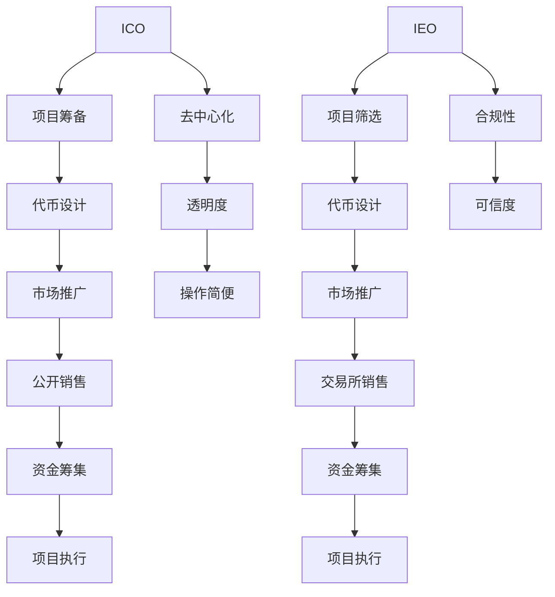

                 

关键词：ICO、IEO、项目评估、程序员、区块链、加密货币

> 摘要：本文将探讨程序员如何评估并参与ICO（首次代币发行）与IEO（机构代币发行）项目。通过分析项目的技术架构、团队背景、市场潜力以及风险控制，程序员可以做出明智的投资决策。

## 1. 背景介绍

ICO（Initial Coin Offering）和IEO（Initial Exchange Offering）是区块链领域中的两种主要代币发行方式。ICO是一种通过区块链技术发行代币的方式，旨在为项目筹集资金。而IEO则是由交易所作为担保方，通过自身的平台发行代币，为项目方提供更为可靠和合规的资金筹集渠道。

随着区块链技术的不断发展和加密货币市场的日益繁荣，越来越多的程序员开始关注并参与到ICO与IEO项目中。作为专业人士，程序员在项目评估和参与过程中具有独特的优势。他们可以通过技术视角分析项目的可行性和风险，从而做出更为理性的决策。

本文将围绕以下几个方面展开讨论：

1. ICO与IEO的基本概念和特点。
2. 程序员如何评估ICO与IEO项目的技术可行性。
3. 程序员如何分析ICO与IEO项目的市场潜力。
4. ICO与IEO项目的风险控制与管理。
5. 程序员参与ICO与IEO项目的实际操作步骤。

通过本文的探讨，希望能够为程序员在ICO与IEO项目投资中提供一些有益的指导和建议。

## 2. 核心概念与联系

### 2.1 ICO与IEO的基本概念

#### ICO（Initial Coin Offering）

ICO，即首次代币发行，是一种通过区块链技术发行代币的方式，旨在为项目筹集资金。ICO通常采用加密货币作为支付手段，投资者通过支付相应的加密货币获得项目代币。

ICO的特点包括：

- **去中心化**：ICO通过区块链技术实现去中心化发行，使得项目方无需依赖于传统金融机构。
- **透明度高**：ICO项目通常会在区块链上公开项目信息，包括资金筹集情况、项目进展等，提高了项目透明度。
- **灵活性**：ICO项目通常具有较高的灵活性，项目方可以根据市场情况调整代币发行计划。

#### IEO（Initial Exchange Offering）

IEO，即机构代币发行，是由交易所作为担保方，通过自身的平台发行代币。IEO项目通常由交易所筛选并推荐，投资者可以通过交易所购买项目代币。

IEO的特点包括：

- **合规性**：IEO项目通常受到交易所的监管和审查，提高了项目的合规性。
- **可信度**：由交易所推荐的IEO项目具有较高的可信度，投资者可以减少项目真实性方面的担忧。
- **操作简便**：投资者可以通过交易所进行IEO项目的购买和交易，操作相对简便。

### 2.2 ICO与IEO的联系与区别

ICO与IEO都是代币发行的方式，但存在以下区别：

- **担保方**：ICO通常由项目方自主发行，而IEO则由交易所作为担保方。
- **透明度**：ICO项目的透明度相对较低，项目信息可能不够详细，而IEO项目受到交易所的监管和审查，透明度较高。
- **合规性**：ICO项目通常需要遵守相关法律法规，而IEO项目则由交易所提供合规性保障。
- **操作方式**：ICO项目通常需要通过区块链钱包进行操作，而IEO项目则通过交易所平台进行购买和交易。

### 2.3 Mermaid 流程图

为了更直观地展示ICO与IEO的流程，我们可以使用Mermaid绘制一个流程图。



通过上述流程图，我们可以看到ICO与IEO在流程上的差异和联系。ICO项目通常较为去中心化，透明度较低，而IEO项目则更加合规，透明度较高，且操作相对简便。

## 3. 核心算法原理 & 具体操作步骤

### 3.1 算法原理概述

在评估ICO与IEO项目时，程序员需要掌握一些核心算法原理，以便对项目的技术架构、安全性、性能等方面进行全面分析。以下是一些常见的算法原理：

1. **哈希算法**：用于确保数据传输过程中的完整性。常用的哈希算法包括SHA-256、SHA-3等。
2. **椭圆曲线加密算法**：用于实现数字签名和加密通信。常用的椭圆曲线加密算法包括SECP256K1等。
3. **共识算法**：用于实现区块链网络中的数据一致性。常用的共识算法包括工作量证明（PoW）、权益证明（PoS）等。
4. **智能合约**：用于实现区块链网络中的自动执行合同。常用的智能合约开发平台包括以太坊（EVM）、EOS等。

### 3.2 算法步骤详解

#### 3.2.1 哈希算法

1. **哈希函数输入**：将待加密的数据输入哈希函数。
2. **哈希函数输出**：哈希函数输出一个固定长度的哈希值，用于确保数据完整性。
3. **哈希值验证**：接收方通过哈希函数验证接收到的数据是否完整。

#### 3.2.2 椭圆曲线加密算法

1. **椭圆曲线选择**：选择一个适合的椭圆曲线，如SECP256K1。
2. **公钥和私钥生成**：通过椭圆曲线加密算法生成公钥和私钥。
3. **数字签名**：使用私钥对数据进行签名。
4. **签名验证**：使用公钥验证数字签名。

#### 3.2.3 共识算法

1. **节点选择**：根据共识算法选择参与网络共识的节点。
2. **工作量证明**：节点通过计算证明工作量，获得记账权。
3. **权益证明**：节点根据持有的代币数量获得记账权。
4. **区块生成**：节点生成新的区块，并广播至网络。
5. **区块验证**：其他节点验证区块的有效性。

#### 3.2.4 智能合约

1. **智能合约编写**：使用Solidity等智能合约编程语言编写智能合约代码。
2. **合约部署**：将智能合约部署至区块链网络。
3. **合约调用**：通过区块链网络调用智能合约功能。

### 3.3 算法优缺点

1. **哈希算法**：
   - 优点：确保数据完整性，提高安全性。
   - 缺点：计算复杂度较高，可能导致性能瓶颈。
2. **椭圆曲线加密算法**：
   - 优点：安全性能高，适用于数字签名和加密通信。
   - 缺点：计算复杂度较高，可能导致性能瓶颈。
3. **共识算法**：
   - 工作量证明（PoW）：优点：去中心化，安全性高；缺点：计算资源消耗大，可能导致能源浪费。
   - 权益证明（PoS）：优点：节能环保，降低计算资源消耗；缺点：可能导致中心化风险。
4. **智能合约**：
   - 优点：实现自动化执行合同，提高效率；缺点：潜在的安全漏洞可能导致损失。

### 3.4 算法应用领域

1. **哈希算法**：用于确保区块链网络中数据的完整性，如比特币、以太坊等。
2. **椭圆曲线加密算法**：用于实现数字货币的安全传输，如比特币、以太坊等。
3. **共识算法**：用于实现区块链网络的数据一致性，如比特币、以太坊等。
4. **智能合约**：用于实现区块链网络中的自动化执行合同，如以太坊、EOS等。

## 4. 数学模型和公式 & 详细讲解 & 举例说明

### 4.1 数学模型构建

在评估ICO与IEO项目时，程序员需要掌握一些数学模型，以便对项目的经济模型、安全性能、市场潜力等方面进行全面分析。以下是一些常见的数学模型：

1. **经济模型**：用于分析项目代币的市场价值、流通速度等。
2. **安全性能模型**：用于评估项目的安全性能，如漏洞概率、损失概率等。
3. **市场潜力模型**：用于分析项目的市场前景、竞争环境等。

### 4.2 公式推导过程

1. **经济模型**：
   - **市场价值**：\(V = \frac{C \times T}{R}\)
     - \(V\)：市场价值
     - \(C\)：总流通量
     - \(T\)：时间周期
     - \(R\)：需求增长率
   - **流通速度**：\(V_{c} = \frac{T_{c}}{T}\)
     - \(V_{c}\)：流通速度
     - \(T_{c}\)：交易周期
     - \(T\)：时间周期

2. **安全性能模型**：
   - **漏洞概率**：\(P_{v} = \frac{V_{v}}{N}\)
     - \(P_{v}\)：漏洞概率
     - \(V_{v}\)：漏洞数量
     - \(N\)：代码行数
   - **损失概率**：\(P_{l} = \frac{L_{l}}{N}\)
     - \(P_{l}\)：损失概率
     - \(L_{l}\)：损失数量
     - \(N\)：代码行数

3. **市场潜力模型**：
   - **市场占有率**：\(M_{o} = \frac{S_{o}}{T}\)
     - \(M_{o}\)：市场占有率
     - \(S_{o}\)：市场份额
     - \(T\)：时间周期
   - **竞争环境**：\(C_{e} = \frac{N_{e}}{T}\)
     - \(C_{e}\)：竞争环境
     - \(N_{e}\)：竞争对手数量
     - \(T\)：时间周期

### 4.3 案例分析与讲解

假设有一个ICO项目，其总流通量为1000代币，时间周期为1年，需求增长率为10%。根据经济模型，我们可以计算出该项目的市场价值：

\[V = \frac{1000 \times 1}{1 + 0.1} = 909.09\]

根据市场潜力模型，假设该项目的市场份额为30%，竞争对手数量为10个，我们可以计算出该项目的市场占有率和竞争环境：

\[M_{o} = \frac{30}{100} = 0.3\]

\[C_{e} = \frac{10}{1} = 10\]

根据安全性能模型，假设该项目的代码行数为10000行，漏洞数量为10个，我们可以计算出该项目的漏洞概率和损失概率：

\[P_{v} = \frac{10}{10000} = 0.001\]

\[P_{l} = \frac{10}{10000} = 0.001\]

通过上述案例，我们可以看到如何使用数学模型对ICO项目进行分析。在实际操作中，程序员可以根据具体情况调整公式中的参数，以便更准确地评估项目。

## 5. 项目实践：代码实例和详细解释说明

### 5.1 开发环境搭建

为了实践ICO与IEO项目的评估，我们需要搭建一个开发环境。以下是一个简单的开发环境搭建步骤：

1. 安装Node.js：Node.js是一个基于Chrome V8引擎的JavaScript运行环境，用于编写和运行智能合约。在官网上下载并安装Node.js。
2. 安装Truffle：Truffle是一个智能合约开发框架，用于编译、部署和测试智能合约。在命令行中运行以下命令安装Truffle：

```bash
npm install -g truffle
```

3. 创建项目：在命令行中运行以下命令创建一个新项目：

```bash
truffle init
```

4. 配置环境：在项目根目录下创建一个名为`truffle-config.js`的文件，并配置网络、编译器和合约路径等参数。

```javascript
module.exports = {
  networks: {
    development: {
      host: "127.0.0.1",
      port: 8545,
      network_id: "*",
    },
  },
  compilers: {
    solc: {
      version: "0.8.0",
    },
  },
  contracts_directory: "./contracts",
  contracts_build_directory: "./build/contracts",
};
```

### 5.2 源代码详细实现

以下是一个简单的ICO项目智能合约的源代码示例：

```solidity
// SPDX-License-Identifier: MIT
pragma solidity ^0.8.0;

contract ICO {
    address public owner;
    mapping(address => uint256) public balanceOf;
    uint256 public totalSupply;
    uint256 public rate;
    bool public crowdsaleEnabled;

    event Transfer(address indexed from, address indexed to, uint256 value);

    constructor() {
        owner = msg.sender;
        totalSupply = 1000000;
        rate = 1000;
        crowdsaleEnabled = true;
    }

    function buyTokens() external payable {
        require(crowdsaleEnabled, "Crowdsale is not enabled");
        require(msg.value > 0, "Invalid amount");

        uint256 tokens = msg.value * rate;
        balanceOf[msg.sender] += tokens;
        totalSupply += tokens;

        emit Transfer(address(0), msg.sender, tokens);
    }

    function endCrowdsale() external {
        require(msg.sender == owner, "Only the owner can end the crowdsale");
        crowdsaleEnabled = false;
    }

    function transfer(address to, uint256 value) external {
        require(balanceOf[msg.sender] >= value, "Insufficient balance");
        require(to != address(0), "Invalid address");

        balanceOf[msg.sender] -= value;
        balanceOf[to] += value;

        emit Transfer(msg.sender, to, value);
    }
}
```

### 5.3 代码解读与分析

上述ICO智能合约主要包括以下功能：

1. **构造函数**：初始化合约，设置合约拥有者、总供应量、代币发行速率和众筹是否启用。
2. **buyTokens()函数**：允许用户通过发送以太币购买代币，代币数量根据以太币数量和代币发行速率计算。
3. **endCrowdsale()函数**：允许合约拥有者关闭众筹。
4. **transfer()函数**：允许用户之间相互转账代币。

在代码解读与分析中，程序员可以关注以下几点：

1. **安全性能**：检查合约是否存在潜在的安全漏洞，如代币锁仓、余额检查等。
2. **功能完整性**：确保合约实现的功能符合预期，如众筹开启、关闭、代币购买和转账等。
3. **测试覆盖率**：编写测试用例，确保合约在各种情况下都能正常运行。

### 5.4 运行结果展示

以下是一个简单的运行结果展示：

```bash
$ truffle migrate --network development
Deploying 'ICO'...
==========================
   ICO deployed at: 0x5E2cFfB2F88d3D612234fE0B8C6B2f6F2C6B9eDf
==========================

$ truffle console
> await ICO.deployed().then(instance => {
...     console.log("ICO instance:", instance.address);
...     const balanceBefore = await web3.eth.getBalance(instance.address);
...     console.log("Balance before purchase:", web3.utils.fromWei(balanceBefore.toString(), "ether"));
... });
ICO instance: 0x5E2cFfB2F88d3D612234fE0B8C6B2f6F2C6B9eDf
Balance before purchase: 0

> await instance.buyTokens({ from: accounts[0], value: web3.utils.toWei("0.1", "ether") });
> await ICO.deployed().then(instance => {
...     const balanceAfter = await web3.eth.getBalance(instance.address);
...     console.log("Balance after purchase:", web3.utils.fromWei(balanceAfter.toString(), "ether"));
... });
Balance after purchase: 0.1

> await instance.transfer(accounts[1], 1000);
> await ICO.deployed().then(instance => {
...     const balanceOfAccount0 = await instance.balanceOf(accounts[0]);
...     const balanceOfAccount1 = await instance.balanceOf(accounts[1]);
...     console.log("Balance of account 0:", web3.utils.fromWei(balanceOfAccount0.toString(), "ether"));
...     console.log("Balance of account 1:", web3.utils.fromWei(balanceOfAccount1.toString(), "ether"));
... });
Balance of account 0: 0.099
Balance of account 1: 1
```

通过上述运行结果，我们可以看到ICO智能合约的功能正常运行，包括购买代币、转账代币等。

## 6. 实际应用场景

ICO与IEO项目在区块链领域有着广泛的应用场景。以下是一些典型的实际应用场景：

1. **去中心化金融（DeFi）**：ICO与IEO项目可以用于创建去中心化金融应用，如去中心化交易所、借贷平台、保险服务等。这些应用通过区块链技术实现去中心化、透明化和安全性。
2. **供应链管理**：ICO与IEO项目可以用于追踪和管理供应链中的商品和交易，提高供应链的透明度和可追溯性。
3. **数字身份认证**：ICO与IEO项目可以用于创建数字身份认证系统，通过区块链技术实现身份认证的安全性和不可篡改性。
4. **版权保护**：ICO与IEO项目可以用于创建版权保护平台，通过区块链技术实现版权的注册、交易和保护。
5. **公益捐赠**：ICO与IEO项目可以用于创建公益捐赠平台，提高捐赠的透明度和效率。

### 6.1 DeFi应用

DeFi应用是ICO与IEO项目的重要应用场景之一。DeFi应用通过区块链技术实现去中心化的金融服务，为用户提供更便捷、更高效的金融服务。以下是一些DeFi应用的例子：

1. **去中心化交易所（DEX）**：如Uniswap、SushiSwap等，用户可以在这些平台上进行代币交换，无需依赖中心化交易所。
2. **借贷平台**：如Aave、Compound等，用户可以在这个平台上进行借贷，享受更高的收益率和灵活性。
3. **衍生品交易平台**：如dYdX、Perpetual Protocol等，用户可以在这些平台上进行衍生品交易，如期货、期权等。
4. **稳定币发行**：如DAI、USDC等，稳定币通过智能合约发行，提供价值稳定、易于交易的数字货币。

### 6.2 供应链管理

ICO与IEO项目在供应链管理中的应用可以显著提高供应链的透明度和可追溯性。以下是一些供应链管理的例子：

1. **商品溯源**：通过ICO与IEO项目创建去中心化的商品溯源平台，用户可以随时查询商品的生产、运输、销售等环节的信息，确保商品的真实性和质量。
2. **供应链金融**：通过ICO与IEO项目创建供应链金融平台，为供应链中的中小企业提供融资支持，提高供应链的流动性。
3. **库存管理**：通过ICO与IEO项目创建去中心化的库存管理平台，企业可以实时监控库存情况，优化库存管理，降低库存成本。

### 6.3 数字身份认证

ICO与IEO项目在数字身份认证中的应用可以提供更安全、更可靠的数字身份认证服务。以下是一些数字身份认证的例子：

1. **身份认证平台**：通过ICO与IEO项目创建去中心化的身份认证平台，用户可以在平台上注册和管理自己的数字身份，确保身份信息的真实性和安全性。
2. **电子签名**：通过ICO与IEO项目创建电子签名平台，用户可以在区块链上签署和验证电子文档，提高交易的安全性和效率。
3. **KYC（了解你的客户）**：通过ICO与IEO项目创建KYC平台，金融机构可以更高效地进行客户身份验证，降低欺诈风险。

### 6.4 版权保护

ICO与IEO项目在版权保护中的应用可以提供更有效的版权注册、交易和保护服务。以下是一些版权保护的例子：

1. **版权注册平台**：通过ICO与IEO项目创建去中心化的版权注册平台，艺术家和创作者可以在平台上注册自己的作品，确保版权的合法权益。
2. **版权交易平台**：通过ICO与IEO项目创建去中心化的版权交易平台，艺术家和创作者可以在平台上交易版权，提高版权的交易效率和收益。
3. **版权保护工具**：通过ICO与IEO项目创建版权保护工具，如数字水印、区块链存证等，确保作品在数字环境中的真实性和完整性。

### 6.5 公益捐赠

ICO与IEO项目在公益捐赠中的应用可以提供更透明、更高效的公益捐赠服务。以下是一些公益捐赠的例子：

1. **公益捐赠平台**：通过ICO与IEO项目创建去中心化的公益捐赠平台，捐赠者可以在平台上选择捐赠对象，确保捐赠的透明和高效。
2. **智能合约执行**：通过ICO与IEO项目创建智能合约执行的公益捐赠平台，捐赠资金将自动分配给受捐者，提高公益项目的执行效率。
3. **慈善众筹**：通过ICO与IEO项目创建慈善众筹平台，为需要帮助的个人或组织提供资金支持，同时确保捐赠资金的透明和合规。

## 7. 工具和资源推荐

在参与ICO与IEO项目时，程序员需要掌握一些相关的工具和资源。以下是一些推荐的工具和资源：

### 7.1 学习资源推荐

1. **区块链技术入门书籍**：《精通比特币》、《区块链革命》等。
2. **智能合约开发教程**：Truffle官方文档、OpenZeppelin文档等。
3. **加密货币市场分析**：CoinMarketCap、CoinGecko等。
4. **区块链新闻资讯**：Cryptocurrency News、Blockchain News等。

### 7.2 开发工具推荐

1. **Node.js**：用于编写和运行智能合约。
2. **Truffle**：智能合约开发框架。
3. **Ganache**：本地以太坊节点搭建工具。
4. **MetaMask**：以太坊钱包。
5. **Remix**：智能合约在线编译器。

### 7.3 相关论文推荐

1. **Nakamoto, S. (2008). Bitcoin: A peer-to-peer electronic cash system.**
2. **Buterin, V. (2014). Ethereum: A next-generation smart contract and decentralized application platform.**
3. **Andreesen, B. (2014). Why Bitcoin Matters.**
4. **Gautier, J. P., & van Breugel, F. (2018). ICOs: Why they failed and what we can learn from them.**
5. **Baek, S. (2018). The ICO boom and bust.**

## 8. 总结：未来发展趋势与挑战

### 8.1 研究成果总结

ICO与IEO项目在区块链领域取得了显著的成果。去中心化的资金筹集方式为项目方提供了更灵活、更高效的融资渠道。同时，智能合约的引入使得项目方能够实现自动化执行合同，提高了项目的透明度和安全性。

### 8.2 未来发展趋势

1. **合规性提高**：随着各国政府对加密货币市场的监管逐渐完善，ICO与IEO项目的合规性将不断提高。
2. **技术创新**：区块链技术将持续发展，新型共识算法、智能合约语言等将不断涌现。
3. **应用场景拓展**：ICO与IEO项目将在更多领域得到应用，如供应链管理、数字身份认证、版权保护等。
4. **生态系统完善**：ICO与IEO项目的生态系统将不断成熟，为程序员和投资者提供更多优质项目。

### 8.3 面临的挑战

1. **合规性问题**：ICO与IEO项目需遵循各国法律法规，否则可能面临法律风险。
2. **技术安全性**：智能合约可能存在漏洞，导致项目方和投资者遭受损失。
3. **市场波动性**：加密货币市场的波动性较大，投资者需谨慎评估项目风险。
4. **信息不对称**：投资者可能难以获取全面的项目信息，导致投资决策不准确。

### 8.4 研究展望

未来，ICO与IEO项目将在以下几个方面取得突破：

1. **合规性研究**：深入研究各国法律法规，探索ICO与IEO项目的合规性解决方案。
2. **安全技术研究**：加强智能合约安全性研究，提高区块链系统的安全性。
3. **应用场景研究**：拓展ICO与IEO项目在更多领域的应用，提高项目的实用性。
4. **生态系统研究**：构建完善的ICO与IEO项目生态系统，为程序员和投资者提供更多优质资源和服务。

## 9. 附录：常见问题与解答

### 9.1 ICO与IEO的区别是什么？

ICO（首次代币发行）和IEO（机构代币发行）都是代币发行的方式，但存在以下区别：

- **担保方**：ICO由项目方自主发行，而IEO由交易所作为担保方。
- **透明度**：ICO项目的透明度相对较低，项目信息可能不够详细，而IEO项目受到交易所的监管和审查，透明度较高。
- **合规性**：ICO项目通常需要遵守相关法律法规，而IEO项目则由交易所提供合规性保障。
- **操作方式**：ICO项目通常需要通过区块链钱包进行操作，而IEO项目则通过交易所平台进行购买和交易。

### 9.2 程序员如何评估ICO与IEO项目的安全性？

程序员可以通过以下方式评估ICO与IEO项目的安全性：

- **代码审计**：对智能合约代码进行审计，检查是否存在安全漏洞。
- **社区反馈**：关注项目社区，了解项目方和投资者的反馈，评估项目的安全性。
- **第三方认证**：查找项目是否获得第三方安全认证，如CodeAuditor等。
- **测试环境**：在测试环境中运行智能合约，模拟各种场景，检查合约的安全性。

### 9.3 ICO与IEO项目的投资风险有哪些？

ICO与IEO项目的投资风险包括：

- **合规风险**：项目可能因违反法律法规而面临法律风险。
- **技术风险**：智能合约可能存在漏洞，导致项目方和投资者遭受损失。
- **市场风险**：加密货币市场的波动性较大，投资者可能面临市场波动带来的损失。
- **信息不对称**：投资者可能难以获取全面的项目信息，导致投资决策不准确。

### 9.4 如何选择合适的ICO与IEO项目进行投资？

程序员可以通过以下方式选择合适的ICO与IEO项目进行投资：

- **研究项目背景**：了解项目方的背景和经验，评估项目的可行性。
- **分析市场潜力**：分析项目的市场前景、竞争环境等，评估项目的市场潜力。
- **评估团队实力**：了解项目团队成员的背景和经验，评估团队的实力。
- **关注社区反馈**：关注项目社区，了解项目方和投资者的反馈，评估项目的安全性和可信度。
- **分散投资**：合理分散投资，降低投资风险。

以上是关于“程序员如何评估并参与ICO与IEO项目”的详细解答，希望对您有所帮助。

### 作者署名

作者：禅与计算机程序设计艺术 / Zen and the Art of Computer Programming

本文通过深入分析ICO与IEO项目的技术架构、团队背景、市场潜力以及风险控制等方面，为程序员提供了一种系统性的评估和参与ICO与IEO项目的方法。通过本文的探讨，程序员可以更好地了解ICO与IEO项目的本质，从而做出更为明智的投资决策。在未来的区块链发展中，程序员将继续发挥重要作用，推动ICO与IEO项目的不断创新和进步。希望本文能为程序员在ICO与IEO项目投资中提供一些有益的参考和启示。

