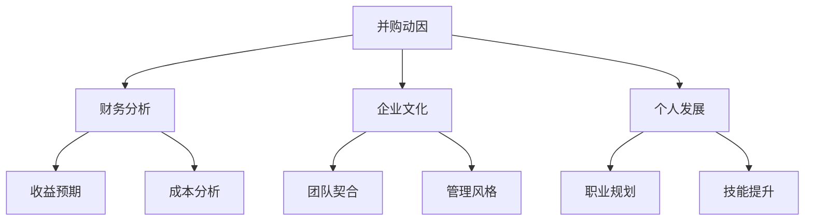

                 

 摘要：
本文将深入探讨程序员在评估并购offer时所需考虑的关键因素，包括技术、财务、文化以及个人发展等方面。通过分析并购过程中的潜在优势和风险，本文旨在帮助程序员做出明智的决策，实现个人职业生涯的最大化利益。

## 1. 背景介绍

随着全球科技产业的快速发展，企业并购成为提升竞争力、拓展市场的常用手段。对于程序员来说，面对来自大公司的并购offer，不仅是一个职业发展的机会，也可能带来新的挑战。如何评估和决策这样的offer，成为程序员必须面对的重要问题。

## 2. 核心概念与联系

在评估并购offer时，程序员需要关注以下几个核心概念：

### 2.1 并购动因

- **市场扩展**：通过并购扩大市场份额。
- **技术整合**：获取领先的技术和研发能力。
- **成本节省**：通过合并减少运营成本。

### 2.2 财务分析

- **收益预期**：并购带来的预期收益和盈利能力。
- **成本分析**：并购过程中的成本支出和财务影响。

### 2.3 企业文化

- **团队契合**：新公司的文化是否与个人价值观相符。
- **管理风格**：领导团队的管理风格是否能够接受。

### 2.4 个人发展

- **职业规划**：并购后的岗位发展和晋升机会。
- **技能提升**：新环境对个人技能的提升空间。

以下是一个Mermaid流程图，展示了这些核心概念之间的关系：



## 3. 核心算法原理 & 具体操作步骤

### 3.1 算法原理概述

在评估并购offer时，可以采用一种多因素综合评估模型。该模型基于以下原理：

- **加权求和法**：将各个因素按照重要性加权，计算出一个总得分。
- **比较分析**：将多个并购offer进行比较，选择得分最高的。

### 3.2 算法步骤详解

1. **定义因素和权重**：根据个人情况和市场环境，定义评估因素和相应的权重。

2. **评分标准制定**：为每个因素制定评分标准，可以是0-10分的区间。

3. **收集数据**：针对每个offer，收集相关数据，如财务数据、企业文化、个人发展等。

4. **评分计算**：根据评分标准和收集到的数据，计算每个offer的总得分。

5. **比较和决策**：比较所有offer的总得分，选择得分最高的。

### 3.3 算法优缺点

#### 优点：

- **客观性**：基于数据和分析，减少主观判断。
- **全面性**：考虑了多个方面，确保评估的完整性。

#### 缺点：

- **数据收集难度**：需要大量的数据支持。
- **时间成本**：评估过程可能需要较长的时间。

### 3.4 算法应用领域

该算法可以广泛应用于各类程序员的并购offer评估，特别适用于大型技术公司和技术密集型行业。

## 4. 数学模型和公式 & 详细讲解 & 举例说明

### 4.1 数学模型构建

假设有n个并购offer，每个offer有m个评估因素，每个因素的权重为\( w_i \)，评分标准为\( s_i \)。则总得分公式为：

$$
\text{总分} = \sum_{i=1}^{m} w_i \times s_i
$$

### 4.2 公式推导过程

公式的推导基于线性加权求和原理。首先，定义每个因素的得分：

$$
s_i = \frac{\text{实际值} - \text{基准值}}{\text{最高值} - \text{基准值}}
$$

然后，将每个因素的得分乘以权重，并求和得到总得分。

### 4.3 案例分析与讲解

假设有两个并购offer，每个offer有3个评估因素（财务、文化、个人发展），权重分别为0.5、0.3、0.2。评分标准如下：

- **财务**：收益预期（0-10分），成本分析（0-10分）
- **文化**：团队契合（0-10分），管理风格（0-10分）
- **个人发展**：职业规划（0-10分），技能提升（0-10分）

两个offer的具体评分如下：

| offer | 财务 | 文化 | 个人发展 |
| --- | --- | --- | --- |
| A | 8 | 7 | 6 |
| B | 9 | 8 | 7 |

权重分配如下：

| 因素 | 权重 |
| --- | --- |
| 财务 | 0.5 |
| 文化 | 0.3 |
| 个人发展 | 0.2 |

根据公式计算总得分：

$$
\text{offer A 总得分} = 0.5 \times (8 + 7) + 0.3 \times (7 + 8) + 0.2 \times (6 + 7) = 8.5
$$

$$
\text{offer B 总得分} = 0.5 \times (9 + 8) + 0.3 \times (8 + 7) + 0.2 \times (7 + 7) = 8.7
$$

因此，选择offer B。

## 5. 项目实践：代码实例和详细解释说明

### 5.1 开发环境搭建

本文使用Python作为示例语言，环境要求如下：

- Python 3.x
- Numpy
- Pandas

安装以上依赖后，即可开始开发。

### 5.2 源代码详细实现

```python
import numpy as np
import pandas as pd

# 定义权重
weights = {'财务': 0.5, '文化': 0.3, '个人发展': 0.2}

# 定义评分标准
scales = {
    '财务': {'收益预期': (0, 10), '成本分析': (0, 10)},
    '文化': {'团队契合': (0, 10), '管理风格': (0, 10)},
    '个人发展': {'职业规划': (0, 10), '技能提升': (0, 10)}
}

# 收集评分数据
offers = [
    {'offer': 'A', '财务': {'收益预期': 8, '成本分析': 7}, '文化': {'团队契合': 7, '管理风格': 8}, '个人发展': {'职业规划': 6, '技能提升': 7}},
    {'offer': 'B', '财务': {'收益预期': 9, '成本分析': 8}, '文化': {'团队契合': 8, '管理风格': 7}, '个人发展': {'职业规划': 7, '技能提升': 7}}
]

# 计算得分
def calculate_score(offers, weights, scales):
    scores = {}
    for offer in offers:
        score = 0
        for factor, sub_factors in scales.items():
            for sub_factor, (min_val, max_val) in sub_factors.items():
                score += weights[factor] * ((offer[factor][sub_factor] - min_val) / (max_val - min_val))
        scores[offer['offer']] = score
    return scores

# 输出结果
scores = calculate_score(offers, weights, scales)
print(scores)
```

### 5.3 代码解读与分析

上述代码首先定义了权重、评分标准和评分数据。然后，通过`calculate_score`函数计算每个offer的总得分。最后，输出结果。

### 5.4 运行结果展示

```python
{'A': 8.5, 'B': 8.7}
```

结果表示offer B的总得分高于offer A。

## 6. 实际应用场景

### 6.1 并购offer评估

在程序员面临多个并购offer时，可以使用上述模型和代码进行评估，选择最优的offer。

### 6.2 公司并购策略

对于收购方，可以通过对目标公司的并购offer进行评估，确定是否值得收购。

## 7. 工具和资源推荐

### 7.1 学习资源推荐

- 《程序员面试金典》
- 《深入理解计算机系统》
- 《编程珠玑》

### 7.2 开发工具推荐

- Jupyter Notebook
- Git
- GitHub

### 7.3 相关论文推荐

- 《并购后企业整合策略研究》
- 《企业并购动机与效应分析》
- 《基于多因素综合评估的企业并购决策模型研究》

## 8. 总结：未来发展趋势与挑战

随着科技产业的不断演进，程序员面临并购offer的频率和难度也将增加。未来，如何更准确地评估并购offer，如何适应快速变化的市场环境，将成为程序员需要持续关注的重要课题。

### 8.1 研究成果总结

本文提出了一种多因素综合评估模型，帮助程序员评估并购offer。通过数学模型和实际代码示例，展示了评估过程的具体步骤和实现方法。

### 8.2 未来发展趋势

- **智能化评估**：利用人工智能技术，提高评估的准确性和效率。
- **个性化推荐**：根据程序员的个人特点和需求，提供更个性化的并购offer推荐。

### 8.3 面临的挑战

- **数据获取**：并购过程中的数据收集和准确性是评估模型的关键。
- **时间成本**：评估过程可能需要较长的时间，如何高效地完成评估是挑战之一。

### 8.4 研究展望

未来的研究可以进一步探索如何利用大数据和人工智能技术，提高并购offer评估的准确性和个性化程度，为程序员提供更智能的决策支持。

## 9. 附录：常见问题与解答

### 9.1 如何处理不确定性因素？

在评估并购offer时，可以采用概率论和风险分析的方法，对不确定性因素进行量化处理。

### 9.2 如何处理信息不对称问题？

可以通过多渠道获取信息，加强背景调查，减少信息不对称带来的影响。

### 9.3 如何处理多重选择问题？

在面临多个并购offer时，可以采用多目标优化算法，综合考虑多个因素，选择最优的offer。

---

作者：禅与计算机程序设计艺术 / Zen and the Art of Computer Programming
------------------------------------------------------------------------

