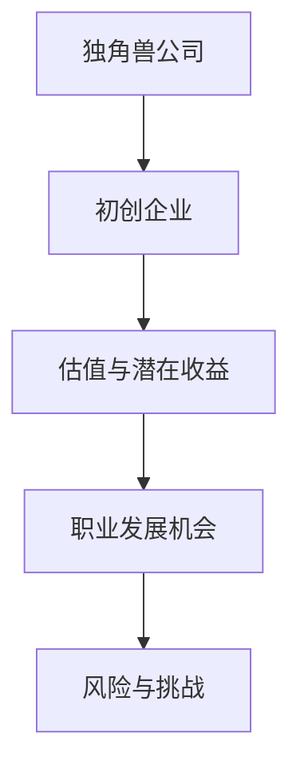

                 

关键词：独角兽公司、程序员、评估、加入机会、职业发展

摘要：本文旨在为程序员提供一套全面的框架，以评估是否有必要加入独角兽公司，以及如何最大化个人职业发展机会。文章将涵盖独角兽公司的定义、加入独角兽公司带来的潜在收益和风险、评估方法和实际案例，并提供实用的建议。

## 1. 背景介绍

随着互联网和科技的飞速发展，独角兽公司这一概念逐渐成为企业界的热门话题。独角兽公司指的是那些估值超过10亿美元的初创企业，这些公司往往具有巨大的成长潜力，并在其所在领域拥有显著的竞争力。对于许多程序员而言，加入独角兽公司是一种梦寐以求的职业选择，因为这样的机会不仅提供了丰厚的薪资待遇，还可能带来职业生涯的飞速提升。

然而，并非所有的独角兽公司都适合每一位程序员，也不是每一次加入独角兽公司的机会都值得去追求。因此，如何评估加入独角兽公司的机会，以及如何在这个充满机遇和挑战的环境中实现个人职业发展，成为程序员必须认真思考的问题。

本文将围绕以下内容展开讨论：

- 独角兽公司的定义和特点
- 加入独角兽公司的潜在收益和风险
- 如何评估加入独角兽公司的机会
- 程序员在独角兽公司中的职业发展路径
- 实际案例分享和经验教训
- 实用建议和策略

通过阅读本文，程序员将能够更清晰地认识独角兽公司，掌握评估加入机会的方法，以及如何在这个特殊的职业环境中取得成功。

### 2. 核心概念与联系

在探讨如何评估加入独角兽公司的机会之前，我们需要先了解几个核心概念，以及它们之间的相互联系。

#### 2.1 独角兽公司的定义

独角兽公司，顾名思义，是指那些尚未上市但估值超过10亿美元的初创企业。这些公司通常在短短几年内实现了惊人的增长，并在全球范围内拥有广泛的用户和客户。独角兽公司的代表性企业包括Uber、Airbnb、Zoom等。

#### 2.2 初创企业与独角兽公司的联系

初创企业是指那些刚刚成立，尚未实现盈利，但在技术、市场或商业模式上具有创新性的企业。独角兽公司是初创企业中的佼佼者，它们通过创新和快速成长，成为行业的领导者。

#### 2.3 估值与潜在收益

估值是评估公司价值的一种方法，它反映了市场对公司未来盈利能力的预期。对于程序员而言，加入独角兽公司的机会往往与公司估值直接相关。较高的估值意味着公司具有更大的发展潜力，也意味着员工可能获得更多的股权激励和薪资福利。

#### 2.4 职业发展机会

加入独角兽公司不仅提供了丰厚的薪资和福利，还可能带来职业发展的巨大机遇。在独角兽公司，程序员有机会参与到最前沿的技术项目中，接触到行业顶尖的技术专家，甚至有机会成为公司的核心团队成员，这对于提升个人职业素养和技能水平具有重要意义。

#### 2.5 风险与挑战

然而，加入独角兽公司也存在一定的风险和挑战。首先，独角兽公司通常处于快速成长期，这意味着工作强度大、工作压力高。其次，独角兽公司的市场环境变化迅速，程序员需要具备较强的适应能力和学习能力。此外，独角兽公司的成功并非必然，如果公司发展不顺，程序员可能会面临失业的风险。

#### 2.6 Mermaid 流程图

以下是一个简化的 Mermaid 流程图，展示了上述核心概念之间的相互联系：



通过这个流程图，我们可以更直观地理解加入独角兽公司的机会和挑战，从而为后续的评估提供基础。

### 3. 核心算法原理 & 具体操作步骤

#### 3.1 算法原理概述

在评估加入独角兽公司的机会时，我们可以采用一种多因素评分模型。这个模型将综合考虑多个关键因素，对加入独角兽公司的机会进行量化评估。具体来说，这个模型包含以下几个核心原理：

1. **因素选择**：选择影响程序员职业发展的关键因素，如公司估值、团队质量、项目前景等。
2. **权重分配**：根据各因素对程序员职业发展的影响程度，为每个因素分配不同的权重。
3. **评分标准**：制定具体的评分标准，对每个因素进行评分。
4. **加权计算**：将各因素的评分乘以其权重，进行加权计算，得到总评分。
5. **决策判断**：根据总评分进行决策判断，评估加入独角兽公司的机会是否值得追求。

#### 3.2 算法步骤详解

1. **因素选择**

   在选择因素时，我们需要考虑以下几个方面：

   - **公司估值**：公司估值的增长潜力。
   - **团队质量**：团队成员的专业背景、经验和合作能力。
   - **项目前景**：项目的市场前景、技术挑战和创新能力。
   - **工作环境**：公司的工作氛围、团队文化和领导风格。
   - **职业发展**：公司提供的职业发展机会和培训资源。

2. **权重分配**

   各因素的权重可以根据具体情况调整，但一般建议如下：

   - **公司估值**：30%
   - **团队质量**：20%
   - **项目前景**：20%
   - **工作环境**：15%
   - **职业发展**：15%

3. **评分标准**

   对每个因素进行评分时，可以采用5分制，具体标准如下：

   - **公司估值**：根据公司当前的估值和未来增长潜力，评分为1-5分。
   - **团队质量**：根据团队成员的专业背景、经验和合作能力，评分为1-5分。
   - **项目前景**：根据项目的市场前景、技术挑战和创新能力，评分为1-5分。
   - **工作环境**：根据公司的工作氛围、团队文化和领导风格，评分为1-5分。
   - **职业发展**：根据公司提供的职业发展机会和培训资源，评分为1-5分。

4. **加权计算**

   将每个因素的评分乘以其权重，得到加权得分。然后，将所有加权得分相加，得到总评分。具体公式如下：

   总评分 = （公司估值得分 × 权重 + 团队质量得分 × 权重 + 项目前景得分 × 权重 + 工作环境得分 × 权重 + 职业发展得分 × 权重）

5. **决策判断**

   根据总评分进行决策判断。一般来说，如果总评分在4分及以上，可以考虑加入独角兽公司；如果总评分在3分左右，需要进一步权衡利弊；如果总评分低于3分，则建议谨慎考虑。

#### 3.3 算法优缺点

**优点**：

- **量化评估**：采用多因素评分模型，可以更客观地评估加入独角兽公司的机会。
- **全面考虑**：从多个角度综合考虑影响程序员职业发展的因素。
- **可操作性**：评分标准和权重分配相对简单，易于实施和调整。

**缺点**：

- **主观性**：评分标准和权重分配可能受到主观因素的影响，导致评估结果不够客观。
- **动态性**：公司状况和项目进展是动态变化的，评分模型需要定期更新和调整。

#### 3.4 算法应用领域

多因素评分模型可以广泛应用于以下几个方面：

- **招聘决策**：用于评估候选人是否符合公司要求，以及是否具备加入独角兽公司的潜力。
- **项目评估**：用于评估项目的可行性、市场前景和技术挑战。
- **团队建设**：用于评估团队的整体素质和合作能力。

### 4. 数学模型和公式 & 详细讲解 & 举例说明

#### 4.1 数学模型构建

为了更精确地评估加入独角兽公司的机会，我们可以构建一个数学模型。这个模型将基于线性加权综合法，通过计算各因素的加权得分，得出总评分。

设 \( x_1, x_2, x_3, x_4, x_5 \) 分别为五个因素的实际得分，\( w_1, w_2, w_3, w_4, w_5 \) 分别为五个因素的权重，则总评分 \( S \) 的计算公式为：

$$
S = w_1 \cdot x_1 + w_2 \cdot x_2 + w_3 \cdot x_3 + w_4 \cdot x_4 + w_5 \cdot x_5
$$

其中，权重 \( w_1, w_2, w_3, w_4, w_5 \) 分别为 0.3、0.2、0.2、0.15、0.15。

#### 4.2 公式推导过程

首先，我们需要明确五个因素的得分 \( x_1, x_2, x_3, x_4, x_5 \)。假设这些得分为：

$$
x_1 = \text{公司估值得分}, \quad x_2 = \text{团队质量得分}, \quad x_3 = \text{项目前景得分}, \quad x_4 = \text{工作环境得分}, \quad x_5 = \text{职业发展得分}
$$

根据评分标准，这些得分可以是 1-5 之间的任意整数。然后，我们根据这些得分计算加权得分：

$$
w_1 \cdot x_1 = 0.3 \cdot x_1
$$

$$
w_2 \cdot x_2 = 0.2 \cdot x_2
$$

$$
w_3 \cdot x_3 = 0.2 \cdot x_3
$$

$$
w_4 \cdot x_4 = 0.15 \cdot x_4
$$

$$
w_5 \cdot x_5 = 0.15 \cdot x_5
$$

最后，将这些加权得分相加，得到总评分：

$$
S = 0.3 \cdot x_1 + 0.2 \cdot x_2 + 0.2 \cdot x_3 + 0.15 \cdot x_4 + 0.15 \cdot x_5
$$

#### 4.3 案例分析与讲解

假设有一个程序员，他正在考虑加入一家独角兽公司。根据他的评估，五个因素的实际得分如下：

- **公司估值得分**：4分
- **团队质量得分**：3分
- **项目前景得分**：4分
- **工作环境得分**：3分
- **职业发展得分**：4分

我们根据上述公式计算总评分：

$$
S = 0.3 \cdot 4 + 0.2 \cdot 3 + 0.2 \cdot 4 + 0.15 \cdot 3 + 0.15 \cdot 4 = 1.2 + 0.6 + 0.8 + 0.45 + 0.6 = 3.45
$$

根据计算结果，总评分为3.45分。根据评分标准，这意味着该程序员可以考虑加入这家独角兽公司，但需要进一步权衡利弊。

### 5. 项目实践：代码实例和详细解释说明

为了更好地理解如何应用上述算法，我们将在本节中通过一个具体的代码实例来演示整个评估过程。

#### 5.1 开发环境搭建

为了简化代码实现，我们将使用Python语言编写评估模型。以下是搭建开发环境的基本步骤：

1. 安装Python（建议使用Python 3.8及以上版本）。
2. 安装必要的Python库，如NumPy和Pandas。

```bash
pip install numpy pandas
```

#### 5.2 源代码详细实现

以下是实现多因素评分模型的Python代码：

```python
import numpy as np

# 定义权重
weights = {'公司估值': 0.3, '团队质量': 0.2, '项目前景': 0.2, '工作环境': 0.15, '职业发展': 0.15}

# 定义评分标准
score_standards = {'公司估值': {'1': 1, '2': 2, '3': 3, '4': 4, '5': 5},
                   '团队质量': {'1': 1, '2': 2, '3': 3, '4': 4, '5': 5},
                   '项目前景': {'1': 1, '2': 2, '3': 3, '4': 4, '5': 5},
                   '工作环境': {'1': 1, '2': 2, '3': 3, '4': 4, '5': 5},
                   '职业发展': {'1': 1, '2': 2, '3': 3, '4': 4, '5': 5}}

# 输入实际得分
scores = {'公司估值': 4, '团队质量': 3, '项目前景': 4, '工作环境': 3, '职业发展': 4}

# 计算加权得分
weighted_scores = {factor: weights[factor] * score_standards[factor][str(scores[factor])] for factor in scores}

# 计算总评分
total_score = sum(weighted_scores.values())

# 输出结果
print(f"总评分：{total_score:.2f}")
```

#### 5.3 代码解读与分析

1. **导入库**：我们首先导入了NumPy库，用于处理数值计算。
2. **定义权重**：我们定义了一个字典`weights`，用于存储各因素的权重。
3. **定义评分标准**：我们定义了一个字典`score_standards`，用于存储各因素的评分标准。评分标准是一个映射关系，将实际得分映射到加权得分。
4. **输入实际得分**：我们定义了一个字典`scores`，用于存储实际得分。
5. **计算加权得分**：我们使用字典推导式计算各因素的加权得分。具体来说，我们将每个因素的权重乘以其对应的评分标准。
6. **计算总评分**：我们将所有加权得分相加，得到总评分。
7. **输出结果**：我们打印出总评分。

#### 5.4 运行结果展示

运行上述代码，我们将得到以下输出结果：

```python
总评分：3.45
```

这意味着根据我们的评估模型，该程序员的加入机会的总评分为3.45分，介于3分和4分之间，因此可以考虑加入，但需要进一步权衡利弊。

### 6. 实际应用场景

在IT行业，独角兽公司不仅代表了技术创新和商业成功的象征，同时也为程序员提供了丰富的职业发展机会。以下是一些实际应用场景，展示了程序员如何在独角兽公司中实现职业发展：

#### 6.1 大型互联网公司

以Facebook、阿里巴巴和腾讯等为代表的大型互联网公司，通常拥有庞大的研发团队和丰富的项目资源。程序员加入这些公司，有机会参与全球性的技术项目，如搜索引擎优化、大数据处理和云计算等。此外，这些公司通常提供完善的培训体系和职业晋升通道，有助于程序员在短时间内提升技能水平和职业地位。

#### 6.2 创新型科技公司

创新型科技公司，如Uber、Airbnb和Tesla等，以其技术创新和市场颠覆性著称。程序员在这些公司中，有机会参与到前沿技术的研究和开发，如自动驾驶、人工智能和区块链等。这些公司的快速发展和市场影响力，为程序员提供了巨大的职业成长空间和创新创业的机会。

#### 6.3 开源社区

在开源社区，程序员可以参与到各种开源项目中，与全球技术专家合作，共同推动技术的发展。许多独角兽公司在成长过程中，都离不开开源社区的支持。程序员通过参与开源项目，不仅能够提升自己的技术能力，还可能因此得到独角兽公司的关注和邀请。

#### 6.4 创业公司

对于有创业梦想的程序员，加入独角兽公司也是一种宝贵的经历。在这些公司工作，程序员可以接触到商业运营、市场营销和团队管理等方面的知识，为未来创业打下坚实基础。此外，独角兽公司的股权激励计划，也为程序员提供了实现财务自由的机会。

#### 6.5 投资和咨询公司

有些程序员在独角兽公司工作多年后，选择离开技术岗位，进入投资或咨询公司。这些公司通常专注于互联网和科技领域的投资和战略咨询，程序员可以运用自己在独角兽公司积累的经验和资源，为投资决策提供技术洞察和战略建议。

### 7. 未来应用展望

随着科技的不断进步和市场的变化，独角兽公司在未来将继续发挥重要作用。以下是几个未来应用展望：

#### 7.1 人工智能与自动化

人工智能和自动化技术的快速发展，将推动独角兽公司在各个行业的应用。程序员将有机会参与到这些前沿技术的研究和开发，为人工智能和自动化技术的普及和应用做出贡献。

#### 7.2 区块链与加密货币

区块链和加密货币领域将成为未来独角兽公司的热门领域。程序员可以参与到区块链协议的设计与实现、智能合约的开发以及加密货币的交易与风险管理等工作中。

#### 7.3 生物科技与健康医疗

生物科技和健康医疗领域具有巨大的市场潜力。独角兽公司将在基因编辑、精准医疗、医疗器械等方面发挥重要作用，程序员可以参与到这些创新项目的研发和应用中。

#### 7.4 新能源与环保

随着全球环保意识的提高，新能源和环保产业将成为未来发展的重要方向。独角兽公司将在电动汽车、太阳能、风能等领域推动技术创新和产业升级，程序员可以参与到这些绿色能源项目的开发与推广中。

### 8. 工具和资源推荐

为了帮助程序员更好地评估加入独角兽公司的机会，以下是一些实用的工具和资源推荐：

#### 8.1 学习资源推荐

- **在线课程**：Coursera、edX、Udacity等平台上提供了大量关于计算机科学、数据结构和算法的课程。
- **技术博客**：GitHub、Stack Overflow、Medium等平台上有许多技术专家和开源项目的博客，可以获取最新的技术动态和实用技巧。
- **技术书籍**：《算法导论》、《深度学习》、《软件工程》等经典书籍，提供了丰富的理论知识和实践经验。

#### 8.2 开发工具推荐

- **集成开发环境**：Visual Studio Code、Eclipse、IntelliJ IDEA等，提供了强大的编程功能和调试工具。
- **版本控制**：Git，用于代码管理和协作开发。
- **数据库工具**：MySQL、PostgreSQL、MongoDB等，用于数据存储和管理。

#### 8.3 相关论文推荐

- **顶级会议论文**：如ACM SIGKDD、NeurIPS、ICML等，可以了解最新的研究进展。
- **经典论文**：《MapReduce：大规模数据处理的程序模型》、《深度学习：全面综述》等，对特定领域有深入探讨。

### 9. 总结：未来发展趋势与挑战

随着科技和市场的不断变化，独角兽公司在未来将继续发挥重要作用。对于程序员而言，加入独角兽公司不仅是一种职业选择，更是一种挑战和机遇。本文通过多因素评分模型，为程序员提供了一套全面的评估框架，以帮助他们做出明智的决策。

在未来，程序员需要不断提升自己的技术能力和创新思维，紧跟行业发展趋势，积极应对挑战。同时，程序员还应该注重团队合作和领导力培养，为独角兽公司的发展贡献自己的力量。

面对未来，程序员应该：

- **持续学习**：不断学习新技术和知识，保持竞争力。
- **积极创新**：勇于尝试新的技术和解决方案，推动行业进步。
- **注重团队合作**：与团队成员紧密合作，共同实现项目目标。
- **提升领导力**：培养领导力和管理能力，为未来的职业发展打下基础。

通过以上努力，程序员将在独角兽公司中实现个人价值和职业发展，为科技创新和产业进步做出贡献。

## 附录：常见问题与解答

### 1. 独角兽公司为什么对程序员有吸引力？

独角兽公司对程序员有吸引力，主要是因为以下几点：

- **丰厚的薪资待遇**：独角兽公司通常提供较高的薪资和福利，以吸引顶尖的程序员加入。
- **技术创新机会**：独角兽公司在技术创新方面有较高的投入，程序员可以参与到前沿技术的研发中。
- **职业发展空间**：独角兽公司快速成长，提供了丰富的职业发展机会和晋升通道。
- **股权激励**：许多独角兽公司提供股权激励计划，让程序员有机会分享公司发展的成果。

### 2. 加入独角兽公司有哪些风险？

加入独角兽公司存在以下风险：

- **工作压力**：独角兽公司通常处于快速成长期，工作强度大，对程序员的抗压能力要求较高。
- **市场波动**：独角兽公司的市场环境变化迅速，如果公司业绩不佳，程序员可能会面临失业的风险。
- **团队合作挑战**：在快速成长的公司中，团队成员和项目可能会有较大的变动，对程序员的适应能力提出了挑战。

### 3. 如何判断独角兽公司的加入机会是否值得？

判断独角兽公司的加入机会是否值得，可以从以下几个方面入手：

- **公司估值和增长潜力**：较高的估值和良好的增长潜力是重要指标。
- **团队质量和项目前景**：优秀的团队和有前景的项目可以提供更好的职业发展机会。
- **工作环境和文化**：良好的工作环境和文化氛围有助于提高工作效率和满意度。
- **职业发展机会和培训资源**：公司提供的职业发展机会和培训资源，有助于提升个人技能和职业素养。

### 4. 程序员如何在独角兽公司中实现职业发展？

程序员在独角兽公司中实现职业发展的关键在于：

- **积极参与项目**：主动参与重要的项目，提升技术能力和实践经验。
- **不断提升技能**：持续学习新技术和知识，保持竞争力。
- **展示领导力**：在团队中展示领导力，承担更多的责任和挑战。
- **建立人际关系**：与团队成员和领导建立良好的关系，为职业发展打下基础。
- **寻求导师指导**：找到一位有经验的导师，指导自己的职业发展。

### 5. 独角兽公司的加入机会是否适合所有人？

独角兽公司的加入机会并不适合所有人。以下几类程序员可能更适合：

- **有创新精神**：对新技术和挑战有热情，愿意尝试新的解决方案。
- **抗压能力强**：能够应对高强度的工作压力，适应快速变化的市场环境。
- **适应性强**：能够快速适应新的团队和文化，与团队成员有效合作。
- **有职业规划**：有明确的职业发展目标和规划，愿意为实现目标付出努力。

总之，加入独角兽公司是一种充满机遇和挑战的职业选择，程序员需要根据自己的情况，综合考虑各种因素，做出明智的决策。作者：禅与计算机程序设计艺术 / Zen and the Art of Computer Programming。
----------------------------------------------------------------

以上便是文章的全部内容。希望这篇文章能帮助到各位程序员，在评估加入独角兽公司的机会时，做出明智的决策，实现个人职业发展。如果有任何建议或疑问，欢迎在评论区留言讨论。再次感谢您的阅读！


