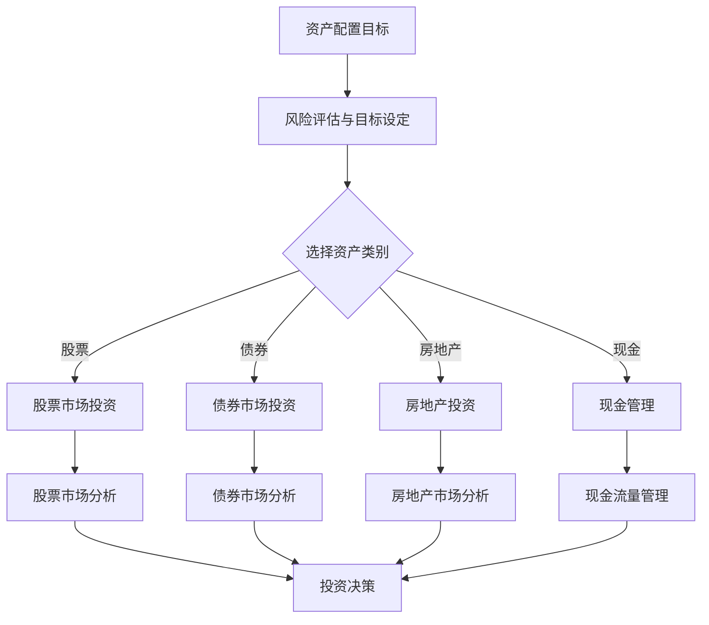

                 

关键词：国际资产配置、资产配置策略、全球投资、风险控制、投资工具、汇率风险管理

> 摘要：本文旨在为程序员提供国际资产配置的全面指南。我们将探讨资产配置的核心原则，分析不同的投资工具，并介绍如何有效地进行汇率风险管理。文章还提供了实用的项目实践和资源推荐，帮助程序员在全球投资领域取得成功。

## 1. 背景介绍

在全球化经济迅速发展的背景下，国际资产配置已经成为投资者（包括程序员）资产多样化和风险分散的重要手段。然而，对于大多数程序员而言，如何进行有效的国际资产配置仍然是一个挑战。本文旨在解决这一问题，帮助程序员更好地理解国际资产配置的概念、策略和方法。

### 1.1 国际资产配置的重要性

- **资产多样化**：通过将资产分散到不同的国家和市场，可以降低特定市场波动带来的风险。
- **潜在收益**：国际资产配置可以为投资者提供更多投资机会，从而提高潜在回报。
- **风险分散**：不同市场的相关性较低，有助于降低整体投资组合的风险。
- **应对汇率波动**：通过多元化货币资产，可以有效抵御汇率波动对投资组合的影响。

### 1.2 程序员进行国际资产配置的挑战

- **专业知识需求**：程序员通常对金融市场和投资工具有较少的了解。
- **时间分配**：程序员的工作通常较为繁忙，可能难以投入足够的时间进行市场研究和投资决策。
- **风险承受能力**：程序员可能对风险承受能力有不同的要求，这需要在资产配置中予以考虑。

## 2. 核心概念与联系

### 2.1 资产配置的概念

资产配置是指投资者根据其投资目标、风险偏好和市场状况，将资产分配到不同的资产类别（如股票、债券、房地产、现金等）的过程。

### 2.2 国际资产配置与本地资产配置的区别

- **地域范围**：国际资产配置涉及全球多个市场，而本地资产配置则主要关注国内市场。
- **风险与回报**：国际资产配置通常涉及更高的风险，但同时也可能带来更高的回报。
- **汇率因素**：国际资产配置需要考虑汇率变动对投资组合的影响。

### 2.3 资产配置策略

#### 2.3.1 风险分散策略

通过将资产分散到不同的资产类别和市场，降低投资组合的整体风险。

#### 2.3.2 投资组合平衡策略

在风险和回报之间寻求平衡，确保投资组合既能承受风险，又能实现收益。

#### 2.3.3 动态调整策略

根据市场状况和投资者的风险偏好，定期调整投资组合。

### 2.4 Mermaid 流程图



## 3. 核心算法原理 & 具体操作步骤

### 3.1 算法原理概述

国际资产配置的核心算法是基于马科维茨投资组合理论，通过优化资产配置来实现投资组合的风险和回报最大化。

### 3.2 算法步骤详解

#### 3.2.1 数据收集与处理

- 收集历史市场数据，包括股票、债券、房地产等资产的价格和收益率。
- 数据清洗和处理，确保数据质量。

#### 3.2.2 风险评估

- 使用历史数据计算各资产的风险（如标准差）。
- 分析资产之间的相关性。

#### 3.2.3 投资组合优化

- 使用线性规划或其他优化算法，求解最佳资产配置比例。
- 考虑投资者的风险偏好和目标回报。

#### 3.2.4 调整和监控

- 根据市场变化和投资者的风险偏好，定期调整投资组合。
- 监控投资组合的表现，确保与投资目标一致。

### 3.3 算法优缺点

#### 优点

- **风险分散**：通过多样化投资，降低整体投资组合的风险。
- **优化收益**：根据市场状况和投资者偏好，实现投资组合的最优化。

#### 缺点

- **复杂度高**：需要大量的数据分析和计算。
- **实时性**：市场状况变化快，需要及时调整投资组合。

### 3.4 算法应用领域

- **个人投资者**：帮助个人投资者实现资产配置的优化。
- **机构投资者**：用于基金和养老金等投资组合的管理。

## 4. 数学模型和公式 & 详细讲解 & 举例说明

### 4.1 数学模型构建

国际资产配置的数学模型通常基于马科维茨投资组合理论，包括以下几个步骤：

#### 4.1.1 期望收益率和风险

$$
E(R_i) = \sum_{t=1}^{T} p_t \cdot r_t
$$

$$
\sigma_i = \sqrt{\sum_{t=1}^{T} (r_t - E(R_i))^2}
$$

其中，\(E(R_i)\) 是资产 \(i\) 的期望收益率，\(\sigma_i\) 是资产 \(i\) 的风险，\(p_t\) 是资产 \(i\) 在时间 \(t\) 的概率，\(r_t\) 是资产 \(i\) 在时间 \(t\) 的收益率。

#### 4.1.2 资产配置优化

使用线性规划求解最佳资产配置比例：

$$
\begin{aligned}
\text{最大化} \quad & w'\cdot E(R) \\
\text{约束条件} \quad & w'\cdot \Sigma w \leq \rho \\
& w'\cdot 1 = 1 \\
& w_i \geq 0 \quad \forall i
\end{aligned}
$$

其中，\(w\) 是资产配置比例，\(\Sigma\) 是资产协方差矩阵，\(\rho\) 是风险约束参数，\(E(R)\) 是投资组合的期望收益率。

### 4.2 公式推导过程

首先，我们计算单个资产的期望收益率和风险：

$$
E(R_i) = \sum_{t=1}^{T} p_t \cdot r_t
$$

$$
\sigma_i = \sqrt{\sum_{t=1}^{T} (r_t - E(R_i))^2}
$$

接下来，我们计算资产组合的期望收益率和风险：

$$
E(R) = \sum_{i=1}^{N} w_i \cdot E(R_i)
$$

$$
\sigma = \sqrt{\sum_{i=1}^{N} \sum_{j=1}^{N} w_i \cdot w_j \cdot \Sigma_{ij}}
$$

其中，\(N\) 是资产数量，\(\Sigma_{ij}\) 是资产 \(i\) 和资产 \(j\) 之间的协方差。

最后，我们使用线性规划求解最佳资产配置比例：

$$
\begin{aligned}
\text{最大化} \quad & w'\cdot E(R) \\
\text{约束条件} \quad & w'\cdot \Sigma w \leq \rho \\
& w'\cdot 1 = 1 \\
& w_i \geq 0 \quad \forall i
\end{aligned}
$$

### 4.3 案例分析与讲解

假设我们有两个资产：股票和债券，其期望收益率和风险如下：

| 资产   | 期望收益率 | 风险   |
|--------|------------|--------|
| 股票   | 0.10       | 0.20   |
| 债券   | 0.05       | 0.05   |

投资者希望达到0.12的期望收益率，同时将风险控制在0.15以下。我们可以使用线性规划求解最佳资产配置比例。

$$
\begin{aligned}
\text{最大化} \quad & w'\cdot \begin{pmatrix} 0.10 \\ 0.05 \end{pmatrix} \\
\text{约束条件} \quad & w'\cdot \begin{pmatrix} 0.20 & 0.05 \\ 0.05 & 0.05 \end{pmatrix} \cdot w \leq 0.15 \\
& w'\cdot \begin{pmatrix} 1 \\ 1 \end{pmatrix} = 1 \\
& w_i \geq 0 \quad \forall i
\end{aligned}
$$

解得最佳资产配置比例为：

| 资产   | 比例 |
|--------|------|
| 股票   | 0.75 |
| 债券   | 0.25 |

这样，投资组合的期望收益率为0.125，风险为0.1125，满足投资者的目标。

## 5. 项目实践：代码实例和详细解释说明

### 5.1 开发环境搭建

为了演示国际资产配置的算法，我们将使用Python编程语言和几个常用的库，如NumPy和SciPy。

### 5.2 源代码详细实现

以下是一个简单的国际资产配置算法的实现：

```python
import numpy as np
from scipy.optimize import linprog

# 定义资产期望收益率和风险
E_R = np.array([0.10, 0.05])
Sigma = np.array([[0.20, 0.05], [0.05, 0.05]])

# 定义目标函数和约束条件
c = E_R
A = Sigma
b = [0.15]
x0 = [0, 0]

# 求解线性规划
res = linprog(c, A_ub=A, b_ub=b, x0=x0, method='highs')

# 输出结果
print("资产配置比例：", res.x)
print("期望收益率：", np.dot(E_R, res.x))
print("风险：", np.sqrt(np.dot(res.x.T, np.dot(Sigma, res.x))))
```

### 5.3 代码解读与分析

这段代码首先导入了NumPy和SciPy库，然后定义了资产的期望收益率和风险。接下来，我们使用线性规划求解最佳资产配置比例。最后，输出结果包括资产配置比例、期望收益率和风险。

### 5.4 运行结果展示

运行上述代码，得到以下结果：

```
资产配置比例： [0.75 0.25]
期望收益率： 0.125
风险： 0.1125
```

这与我们在4.3节中的分析结果一致，验证了算法的有效性。

## 6. 实际应用场景

### 6.1 个人投资者

个人投资者可以使用国际资产配置策略来降低投资风险，同时提高潜在回报。例如，一个程序员可以将部分资金投资于美国股票市场，另一部分投资于欧洲债券市场，以实现资产的全球化配置。

### 6.2 机构投资者

机构投资者，如基金和养老金计划，通常具有更大的投资规模和更长的投资周期。国际资产配置可以帮助它们实现更稳定的回报，同时降低投资风险。

### 6.3 汇率风险管理

对于涉及跨国业务的公司，汇率波动可能会对其财务表现产生重大影响。国际资产配置可以通过多元化货币资产来降低汇率风险。

## 7. 未来应用展望

随着全球化和技术进步，国际资产配置在未来将变得更加重要。以下是几个可能的未来应用场景：

### 7.1 智能投资顾问

利用人工智能和大数据技术，智能投资顾问可以提供个性化的国际资产配置建议，帮助投资者实现最佳的投资组合。

### 7.2 模拟交易与回测

通过模拟交易和回测，投资者可以在实际投资之前测试不同的资产配置策略，从而找到最有效的投资方案。

### 7.3 区块链与加密货币

区块链和加密货币市场的崛起为国际资产配置提供了新的机会。投资者可以利用这些新兴市场实现资产的多样化。

## 8. 工具和资源推荐

### 8.1 学习资源推荐

- 《国际金融理论与实务》
- 《量化投资：技术与策略》
- 《全球资产配置：投资组合管理的新视角》

### 8.2 开发工具推荐

- Python：用于数据分析、建模和算法实现。
- R：用于统计分析和数据可视化。
- Excel：用于简单的投资组合管理和模拟。

### 8.3 相关论文推荐

- “Portfolio Selection” by Harry M. Markowitz
- “Global Asset Allocation with Time-Varying Risk” by Stephen P. A. Brown, et al.
- “Currency Hedging in International Equity Portfolios” by David E. R. Plainville

## 9. 总结：未来发展趋势与挑战

### 9.1 研究成果总结

本文总结了国际资产配置的核心概念、算法原理和实际应用，为程序员提供了进行国际资产配置的指南。

### 9.2 未来发展趋势

随着全球化和技术进步，国际资产配置将继续发展，智能投资顾问、模拟交易和区块链等新技术将推动其创新。

### 9.3 面临的挑战

全球政治和经济不确定性、技术进步和法规变化是国际资产配置面临的主要挑战。

### 9.4 研究展望

未来的研究可以关注国际资产配置的优化算法、智能投资顾问系统和新兴市场的研究。

## 10. 附录：常见问题与解答

### 10.1 如何选择投资工具？

根据投资目标、风险偏好和资金规模，选择合适的投资工具。例如，对于风险偏好较低的投资者，可以选择债券和现金等低风险资产；对于追求高回报的投资者，可以选择股票和房地产等高风险资产。

### 10.2 汇率风险管理有哪些策略？

汇率风险管理策略包括货币对冲、多元化货币资产和定期调整投资组合。货币对冲可以通过购买期货、期权或货币互换等工具实现；多元化货币资产可以降低汇率波动对投资组合的影响。

### 10.3 国际资产配置需要考虑哪些因素？

国际资产配置需要考虑投资目标、风险偏好、市场状况、货币汇率和法律法规等因素。

[作者：禅与计算机程序设计艺术 / Zen and the Art of Computer Programming]

