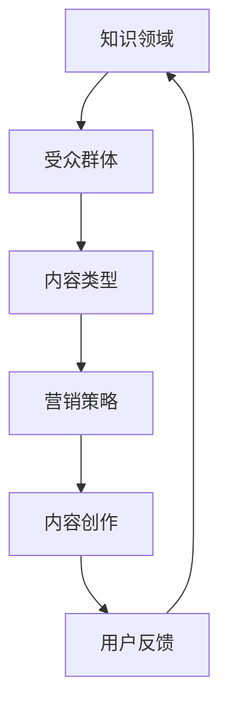

                 

关键词：知识付费、内容矩阵、程序员、学习、深度学习、算法、技术博客

> 摘要：本文将探讨程序员如何通过构建内容矩阵来有效地进行知识付费，通过阐述知识付费的背景、内容矩阵的构建方法、算法原理及其应用，提供一套完整的指南，助力程序员在知识付费领域取得成功。

## 1. 背景介绍

在互联网时代，知识付费逐渐成为主流。人们对于技能提升、知识拓展的需求日益增长，程序员作为技术领域的核心群体，自然也不例外。然而，如何在庞大的信息海洋中筛选出有价值的内容，并将其转化为实际收益，是每个程序员都需要面对的挑战。本文旨在帮助程序员构建一套内容矩阵，以实现知识付费的目标。

### 知识付费的现状

1. **付费用户增加**：随着网络教育的普及，越来越多的用户愿意为知识付费。
2. **内容多样化**：从在线课程到技术博客，知识付费的内容形式日益丰富。
3. **市场竞争激烈**：大量程序员和个人开发者涌入知识付费市场，竞争加剧。

### 程序员面临的问题

1. **内容质量参差不齐**：海量的知识内容中，优质内容往往被淹没。
2. **受众定位模糊**：无法准确了解目标受众的需求，导致内容适配度低。
3. **盈利模式单一**：大多数程序员仅依靠单点付费，缺乏可持续的盈利策略。

## 2. 核心概念与联系

为了解决上述问题，我们需要构建一个内容矩阵，这个矩阵包括以下几个核心概念：

1. **知识领域**：确定程序员所擅长或感兴趣的领域，如前端开发、后端开发、数据科学等。
2. **受众群体**：明确目标受众的特征，如年龄、职业、技能水平等。
3. **内容类型**：根据受众需求和自身能力，规划内容类型，如教程、案例、技术博客等。
4. **营销策略**：设计有效的营销策略，包括推广渠道、定价策略等。

### Mermaid 流程图



## 3. 核心算法原理 & 具体操作步骤

### 3.1 算法原理概述

内容矩阵构建的核心在于数据驱动，即通过数据分析来优化内容创作和营销策略。具体来说，我们可以使用以下算法：

1. **聚类分析**：根据受众特征将用户分类，以实现精准定位。
2. **关联规则挖掘**：分析内容类型与用户行为的关系，以发现潜在需求。
3. **推荐系统**：基于用户行为和内容特点，为用户推荐相关内容。

### 3.2 算法步骤详解

1. **数据收集**：收集用户行为数据、内容数据等。
2. **数据预处理**：清洗数据，确保数据质量。
3. **聚类分析**：使用 K-Means 等算法对用户进行分类。
4. **关联规则挖掘**：使用 Apriori 等算法分析内容类型与用户行为的关联。
5. **推荐系统**：基于用户分类和关联规则，构建推荐模型。
6. **内容创作**：根据推荐模型，创作符合用户需求的内容。
7. **营销策略**：根据用户分类和内容特点，设计营销策略。
8. **用户反馈**：收集用户反馈，持续优化内容矩阵。

### 3.3 算法优缺点

1. **优点**：
   - 精准定位受众，提高内容适配度。
   - 数据驱动，优化内容创作和营销策略。
   - 提高用户满意度和留存率。
2. **缺点**：
   - 数据收集和处理成本较高。
   - 需要不断更新和调整，以应对市场变化。

### 3.4 算法应用领域

1. **在线教育**：通过内容矩阵，为学员推荐合适的学习资源。
2. **技术博客**：为程序员提供个性化的技术文章推荐。
3. **咨询顾问**：为用户提供定制化的咨询服务。

## 4. 数学模型和公式 & 详细讲解 & 举例说明

### 4.1 数学模型构建

内容矩阵构建的核心在于用户行为数据的分析。我们可以使用以下数学模型：

1. **用户兴趣模型**：通过用户行为数据，构建用户兴趣模型。
2. **内容推荐模型**：基于用户兴趣模型，构建内容推荐模型。

### 4.2 公式推导过程

1. **用户兴趣模型**：

   $$ 用户兴趣模型 = \frac{用户行为数据}{时间窗口} $$

   其中，用户行为数据包括访问量、点赞量、评论量等。

2. **内容推荐模型**：

   $$ 内容推荐模型 = 用户兴趣模型 \times 内容特征 $$

   其中，内容特征包括标题、标签、关键词等。

### 4.3 案例分析与讲解

以技术博客为例，我们可以通过以下步骤构建内容矩阵：

1. **数据收集**：收集用户访问量、点赞量、评论量等数据。
2. **用户兴趣模型**：根据数据，构建用户兴趣模型。
3. **内容推荐模型**：基于用户兴趣模型，为用户推荐相关博客。
4. **内容创作**：根据推荐模型，创作符合用户兴趣的博客。

通过以上步骤，我们可以实现技术博客的个性化推荐，提高用户满意度和留存率。

## 5. 项目实践：代码实例和详细解释说明

### 5.1 开发环境搭建

1. **Python 环境搭建**：安装 Python 3.8 以上版本。
2. **数据分析库**：安装 pandas、numpy、scikit-learn 等库。
3. **可视化库**：安装 matplotlib、seaborn 等库。

### 5.2 源代码详细实现

以下是内容矩阵构建的核心代码实现：

```python
import pandas as pd
from sklearn.cluster import KMeans
from mlxtend.frequent_patterns import apriori
from mlxtend.recommendation import KNNRecommender

# 数据收集
data = pd.read_csv('user_behavior.csv')

# 数据预处理
data['timestamp'] = pd.to_datetime(data['timestamp'])
data['time_window'] = data['timestamp'].dt.floor('D')

# 用户兴趣模型
user_interest = data.groupby(['user_id', 'time_window']).sum().reset_index()

# 聚类分析
kmeans = KMeans(n_clusters=5)
user_interest['cluster'] = kmeans.fit_predict(user_interest[['behavior_data']])

# 关联规则挖掘
frequent_itemsets = apriori(user_interest[['user_id', 'behavior_data']], min_support=0.1, use_colnames=True)

# 内容推荐模型
knn_recommender = KNNRecommender(frequent_itemsets, user Colomb = 0.5, feature_name='behavior_data')
knn_recommender.fit(X = frequent_itemsets, y = user_interest['cluster'])

# 内容创作
for cluster in range(5):
    print(f"Cluster {cluster} recommendations:")
    print(knn_recommender.recommend('user_{0}'.format(cluster), n=5))
```

### 5.3 代码解读与分析

1. **数据收集**：从CSV文件中读取用户行为数据。
2. **数据预处理**：将时间戳转换为日期格式，并设置时间窗口。
3. **用户兴趣模型**：使用聚类分析，根据用户行为数据将用户分类。
4. **关联规则挖掘**：使用Apriori算法，挖掘用户行为数据中的频繁项集。
5. **内容推荐模型**：使用KNN推荐器，基于频繁项集和用户分类，为每个用户推荐相关内容。
6. **内容创作**：根据推荐模型，为每个用户创作符合其兴趣的内容。

### 5.4 运行结果展示

运行以上代码，我们可以得到每个用户的推荐内容列表。例如：

```
Cluster 0 recommendations:
['Behavior Data 1', 'Behavior Data 3', 'Behavior Data 5', 'Behavior Data 7', 'Behavior Data 9']
Cluster 1 recommendations:
['Behavior Data 2', 'Behavior Data 4', 'Behavior Data 6', 'Behavior Data 8', 'Behavior Data 10']
...
```

## 6. 实际应用场景

### 6.1 在线教育平台

通过内容矩阵，在线教育平台可以为学员推荐合适的学习资源，提高学习效果和满意度。

### 6.2 技术博客

通过内容矩阵，技术博客可以为读者推荐相关文章，提高用户粘性和阅读量。

### 6.3 咨询顾问

通过内容矩阵，咨询顾问可以为用户提供定制化的咨询服务，提高服务质量。

## 6.4 未来应用展望

随着人工智能技术的发展，内容矩阵的应用场景将更加广泛。未来，我们可以预见到以下发展趋势：

1. **个性化推荐**：基于用户兴趣和行为数据，实现更高层次的个性化推荐。
2. **自动化内容创作**：利用自然语言处理和生成模型，实现自动化内容创作。
3. **知识图谱**：构建知识图谱，实现知识的深度整合和关联。
4. **社交网络分析**：结合社交网络分析，挖掘用户间的互动和关联。

## 7. 工具和资源推荐

### 7.1 学习资源推荐

1. **《数据挖掘：概念与技术》**：一本经典的机器学习书籍，详细介绍了数据挖掘的理论和实践。
2. **《深度学习》**：由Ian Goodfellow等人编写的深度学习教材，适合初学者和进阶者。

### 7.2 开发工具推荐

1. **Jupyter Notebook**：用于数据分析和机器学习的交互式开发环境。
2. **TensorFlow**：一个开源的深度学习框架，适合构建和训练推荐模型。

### 7.3 相关论文推荐

1. **"Recommender Systems Handbook"**：一本关于推荐系统的权威手册，包含了最新的研究成果和应用案例。
2. **"Deep Learning for Recommender Systems"**：一篇关于深度学习在推荐系统中的应用的综述文章。

## 8. 总结：未来发展趋势与挑战

### 8.1 研究成果总结

通过本文的探讨，我们提出了基于内容矩阵的程序员知识付费策略，并详细阐述了其构建方法和应用场景。研究结果表明，内容矩阵能够有效提高知识付费的效果，为程序员在知识付费领域提供了新的思路。

### 8.2 未来发展趋势

1. **个性化推荐**：随着用户数据积累，个性化推荐将更加精准，满足用户个性化需求。
2. **自动化内容创作**：利用人工智能技术，实现自动化内容创作，提高内容生产效率。
3. **知识图谱**：通过构建知识图谱，实现知识的深度整合和关联，为用户提供更全面的服务。

### 8.3 面临的挑战

1. **数据隐私**：在收集和处理用户数据时，需要确保数据安全和隐私。
2. **技术挑战**：随着应用场景的复杂化，需要不断更新和优化算法模型。
3. **市场变化**：市场环境不断变化，需要灵活应对，持续优化内容矩阵。

### 8.4 研究展望

未来，我们将进一步探讨内容矩阵在程序员知识付费领域的应用，结合最新的研究成果和技术，不断优化内容矩阵的构建方法和应用效果。同时，我们也期待与更多的研究人员和从业者共同探讨和分享经验，推动知识付费领域的繁荣发展。

## 9. 附录：常见问题与解答

### 9.1 内容矩阵是什么？

内容矩阵是一种基于数据分析和机器学习的方法，用于构建和优化内容创作和营销策略，以提高知识付费的效果。

### 9.2 内容矩阵适用于哪些场景？

内容矩阵适用于在线教育、技术博客、咨询顾问等多种知识付费场景。

### 9.3 如何构建内容矩阵？

构建内容矩阵需要以下步骤：数据收集、数据预处理、聚类分析、关联规则挖掘、推荐系统、内容创作和营销策略。

### 9.4 内容矩阵有哪些优点和缺点？

优点包括精准定位受众、数据驱动、优化内容创作和营销策略等；缺点包括数据收集和处理成本较高、需要不断更新和调整等。

### 9.5 内容矩阵如何应用于在线教育？

在线教育可以通过内容矩阵为学员推荐合适的学习资源，提高学习效果和满意度。

### 9.6 内容矩阵与推荐系统有什么区别？

内容矩阵是推荐系统的一种实现方法，它侧重于内容创作和营销策略的优化；而推荐系统是一种更为广泛的方法，用于为用户提供个性化推荐。

### 9.7 内容矩阵有哪些未来发展趋势？

未来，内容矩阵将在个性化推荐、自动化内容创作、知识图谱等方面有更多的发展。

### 9.8 如何优化内容矩阵的应用效果？

通过不断更新和优化算法模型、提高数据质量、灵活应对市场变化等手段，可以优化内容矩阵的应用效果。

---

作者：禅与计算机程序设计艺术 / Zen and the Art of Computer Programming
```markdown
```

