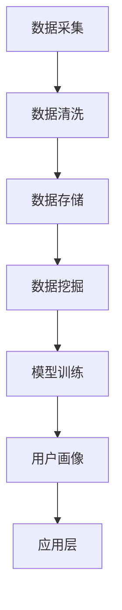

                 

 

## 1. 背景介绍

在当今信息爆炸的时代，知识的获取和传播变得前所未有的便捷。然而，随之而来的是知识付费市场的迅速崛起。知识付费，作为一种新的商业模式，不仅为知识生产者提供了收入来源，也为知识消费者提供了有针对性的、高质量的学习内容。而在这其中，用户画像分析成为了提高知识付费服务质量和用户体验的重要手段。

用户画像分析，即通过对用户的数据进行分析，构建出用户的基本信息、行为特征、兴趣偏好等全方位的描述，从而为精准营销、个性化推荐、产品优化等提供数据支持。对于程序员来说，掌握用户画像分析的技术，不仅有助于提升自身的竞争力，也能够在知识付费领域中获得更多的机会。

本文将深入探讨程序员如何进行用户画像分析。首先，我们将介绍用户画像分析的基本概念和方法；然后，通过一个实际案例，展示如何利用用户行为数据构建用户画像；接着，分析不同用户画像技术在知识付费领域的应用；最后，探讨未来用户画像分析在知识付费中的发展趋势和挑战。

## 2. 核心概念与联系

### 2.1 用户画像

用户画像（User Profile）是指通过对用户行为数据的收集和分析，构建出一个关于用户的基本信息、行为特征、兴趣偏好等全方位的描述。用户画像的核心目的是帮助企业和产品团队更好地了解用户，从而实现精准营销、个性化推荐和产品优化。

用户画像的基本要素包括：

- **基本信息**：如年龄、性别、职业、教育程度、收入水平等。
- **行为特征**：如浏览历史、购买行为、搜索记录、点击行为等。
- **兴趣偏好**：如喜欢的领域、关注的热点、常访问的网站等。

用户画像不仅仅是简单的数据罗列，而是一个动态的过程，需要不断地更新和优化，以反映用户的最新状态。

### 2.2 用户画像分析技术

用户画像分析技术主要包括以下几个方面：

- **数据采集**：通过各种渠道收集用户数据，如网站日志、浏览器缓存、社交媒体等。
- **数据清洗**：对采集到的数据进行处理，去除重复、错误和无效的数据，保证数据质量。
- **数据存储**：将清洗后的数据存储到数据库中，以便后续分析和查询。
- **数据挖掘**：利用数据挖掘算法，从大量数据中提取出有价值的信息和模式。
- **模型训练**：使用机器学习算法，构建用户画像模型，对用户进行分类和预测。

### 2.3 用户画像的架构

用户画像的架构通常包括以下几个层次：

- **数据层**：存储用户数据的数据库和数据仓库。
- **处理层**：负责数据清洗、转换和存储的ETL（Extract, Transform, Load）过程。
- **模型层**：构建和训练用户画像模型，包括分类、聚类、回归等算法。
- **应用层**：将用户画像应用到具体的业务场景中，如精准营销、个性化推荐等。

### 2.4 用户画像的应用场景

用户画像在多个领域都有广泛的应用，以下是几个典型的应用场景：

- **电商**：通过用户画像进行精准营销和个性化推荐，提高转化率和销售额。
- **金融**：识别高风险用户，进行风险管理。
- **社交媒体**：个性化内容推荐，提高用户黏性和活跃度。
- **知识付费**：了解用户需求，提供定制化的学习内容，提高用户满意度和留存率。

## 2.5 Mermaid 流程图

以下是一个简单的Mermaid流程图，展示用户画像分析的基本流程：



---

在接下来的部分，我们将详细介绍用户画像分析的核心算法原理和具体操作步骤，并通过一个实际案例展示如何利用用户行为数据构建用户画像。这将为程序员在知识付费领域进行用户画像分析提供实用的指导和参考。接下来，我们开始详细探讨用户画像分析的核心算法原理和操作步骤。

### 3. 核心算法原理 & 具体操作步骤

#### 3.1 算法原理概述

用户画像分析的核心在于如何从大量的用户行为数据中提取出有价值的信息，构建出一个准确的用户画像。这一过程通常涉及到以下几个步骤：

1. **数据采集**：从各种渠道收集用户数据，如网站日志、浏览器缓存、社交媒体等。
2. **数据清洗**：对采集到的数据进行处理，去除重复、错误和无效的数据，保证数据质量。
3. **特征提取**：从原始数据中提取出有意义的特征，如浏览历史、购买行为、搜索记录等。
4. **模型构建**：使用机器学习算法，构建用户画像模型，对用户进行分类和预测。
5. **模型训练与优化**：通过不断训练和优化模型，提高模型的准确性和稳定性。
6. **用户画像构建**：将训练好的模型应用到实际数据中，生成用户画像。
7. **应用与反馈**：将用户画像应用到具体业务场景中，如精准营销、个性化推荐等，并根据反馈不断优化。

#### 3.2 算法步骤详解

##### 3.2.1 数据采集

数据采集是用户画像分析的第一步，也是最重要的一步。只有获取到丰富的用户数据，才能进行后续的数据分析和模型构建。数据采集的渠道可以包括：

- **网站日志**：通过Web服务器日志，记录用户访问网站的行为数据，如访问时间、访问页面、访问时长等。
- **浏览器缓存**：通过分析浏览器缓存，获取用户浏览过的网页、搜索记录等。
- **社交媒体**：从用户的社交媒体账号中获取用户发布的内容、点赞、评论等行为数据。
- **第三方数据源**：通过购买或合作获取其他平台上的用户数据，如用户行为数据、用户画像等。

##### 3.2.2 数据清洗

数据清洗是保证数据质量的关键步骤。在数据采集过程中，可能会收集到大量的重复、错误和无效数据，这些数据如果不进行处理，会严重影响后续的数据分析和模型构建。数据清洗的主要任务包括：

- **去重**：去除重复的数据记录，避免重复分析。
- **去噪**：去除错误或异常的数据记录，如缺失值、非法值等。
- **格式化**：统一数据格式，如将日期时间格式统一为YYYY-MM-DD HH:MM:SS。
- **转换**：将不同的数据类型转换为统一的数据类型，如将文本数据转换为数字或类别数据。

##### 3.2.3 特征提取

特征提取是从原始数据中提取出有意义的特征，这些特征将用于构建用户画像模型。特征提取的方法有多种，常见的包括：

- **频率统计**：计算用户在不同特征上的出现频率，如用户访问某个页面的次数。
- **关联规则挖掘**：挖掘用户在不同特征之间的关联关系，如购买A商品的用户同时也购买了B商品。
- **文本分析**：对用户发布的内容进行文本分析，提取出关键词、主题等。
- **聚类分析**：通过聚类分析，将用户划分为不同的群体，提取出每个群体的特征。

##### 3.2.4 模型构建

模型构建是用户画像分析的核心步骤，通过构建机器学习模型，可以对用户进行分类和预测。常见的模型包括：

- **分类模型**：如逻辑回归、决策树、随机森林等，用于对用户进行分类。
- **聚类模型**：如K-means、层次聚类等，用于将用户划分为不同的群体。
- **回归模型**：如线性回归、多项式回归等，用于预测用户的某个特征值。
- **神经网络模型**：如深度学习模型，用于提取更复杂的数据特征。

##### 3.2.5 模型训练与优化

模型训练与优化是提高模型准确性和稳定性的关键步骤。在训练过程中，需要不断地调整模型的参数，如学习率、正则化参数等，以达到最优的训练效果。常见的优化方法包括：

- **交叉验证**：通过交叉验证，评估模型的泛化能力和稳定性。
- **网格搜索**：通过网格搜索，寻找最优的模型参数组合。
- **模型集成**：通过模型集成，如Bagging、Boosting等，提高模型的预测能力。

##### 3.2.6 用户画像构建

用户画像构建是将训练好的模型应用到实际数据中，生成用户画像。用户画像通常包括以下信息：

- **基本信息**：如年龄、性别、职业等。
- **行为特征**：如浏览历史、购买行为、搜索记录等。
- **兴趣偏好**：如喜欢的领域、关注的热点、常访问的网站等。

##### 3.2.7 应用与反馈

用户画像的应用与反馈是不断优化和改进用户画像的关键步骤。通过将用户画像应用到具体的业务场景中，如精准营销、个性化推荐等，可以更好地满足用户需求，提高用户体验。同时，根据用户反馈，可以不断调整和优化用户画像模型，提高模型的准确性和实用性。

#### 3.3 算法优缺点

用户画像分析算法具有以下几个优点：

1. **个性化**：通过分析用户行为数据，可以准确地了解用户的需求和偏好，实现个性化推荐和服务。
2. **精准营销**：基于用户画像的精准营销，可以大大提高营销效果，降低营销成本。
3. **优化产品**：通过用户画像分析，可以发现产品的问题和改进方向，提高产品的用户体验和市场竞争力。

然而，用户画像分析算法也存在一些缺点：

1. **数据隐私**：用户画像分析涉及到大量的用户隐私数据，如浏览记录、搜索记录等，可能引发隐私泄露问题。
2. **算法偏见**：如果数据集存在偏差，可能会导致算法产生偏见，从而影响用户画像的准确性。
3. **复杂性**：用户画像分析涉及到多个步骤和多种算法，需要较高的技术水平和经验。

#### 3.4 算法应用领域

用户画像分析在多个领域都有广泛的应用，以下是几个典型的应用领域：

1. **电商**：通过用户画像分析，实现个性化推荐、精准营销和用户行为预测，提高销售额和用户满意度。
2. **金融**：通过用户画像分析，识别高风险用户、优化风险管理策略、提高信贷审批效率。
3. **社交媒体**：通过用户画像分析，实现个性化内容推荐、用户行为分析、社交网络分析等。
4. **知识付费**：通过用户画像分析，了解用户需求、提供定制化的学习内容、提高用户满意度和留存率。

### 3.5 实际案例

下面，我们将通过一个实际案例，展示如何利用用户行为数据构建用户画像。

#### 案例背景

某知识付费平台，提供各种技术课程和教程。为了提高用户满意度和留存率，该平台希望通过用户画像分析，了解用户的需求和偏好，从而提供更符合用户期望的学习内容。

#### 数据来源

平台收集了以下用户行为数据：

1. 用户基本信息：如年龄、性别、职业、教育程度等。
2. 用户浏览历史：如访问的页面、停留时间、页面跳转路径等。
3. 用户购买行为：如购买的课程、购买时间、购买频率等。
4. 用户搜索记录：如搜索的关键词、搜索时间等。

#### 数据清洗

对收集到的用户行为数据进行清洗，去除重复、错误和无效的数据，保证数据质量。

1. 去重：去除重复的用户记录，避免重复分析。
2. 去噪：去除错误或异常的数据记录，如缺失值、非法值等。
3. 格式化：统一数据格式，如将日期时间格式统一为YYYY-MM-DD HH:MM:SS。

#### 特征提取

从清洗后的数据中提取出有意义的特征，如：

1. 用户基本信息特征：如年龄、性别、职业等。
2. 用户行为特征：如浏览历史、购买行为、搜索记录等。
3. 用户兴趣特征：如常访问的页面、购买的课程类别、搜索的关键词等。

#### 模型构建

使用K-means算法，将用户划分为不同的群体，提取出每个群体的特征。通过聚类分析，可以将用户划分为技术小白、技术爱好者、技术专家等不同的群体。

#### 模型训练与优化

通过不断调整模型的参数，如聚类个数、初始中心点等，优化模型的性能，提高模型的准确性和稳定性。

#### 用户画像构建

根据聚类分析的结果，生成每个用户的用户画像，包括用户的基本信息、行为特征、兴趣偏好等。

1. 技术小白：年龄较小、性别未知、职业为大学生，喜欢浏览基础课程、购买频率较高。
2. 技术爱好者：年龄较大、性别男性、职业为程序员，喜欢浏览高级课程、购买频率较高。
3. 技术专家：年龄较大、性别男性、职业为技术专家，喜欢浏览专业课程、购买频率较低。

#### 应用与反馈

将用户画像应用到具体业务场景中，如：

1. 个性化推荐：根据用户的用户画像，推荐符合用户兴趣的学习内容。
2. 精准营销：向目标用户群体推送相关的营销活动，提高营销效果。
3. 产品优化：根据用户画像，优化课程结构和内容，提高用户满意度。

根据用户反馈，不断调整和优化用户画像模型，提高模型的准确性和实用性。

---

通过上述实际案例，我们可以看到用户画像分析在知识付费领域的应用。接下来，我们将进一步探讨数学模型和公式，以及如何通过这些模型和公式进行用户画像分析和计算。这将为我们提供更加精确和科学的方法来理解和优化用户画像。

### 4. 数学模型和公式 & 详细讲解 & 举例说明

在用户画像分析中，数学模型和公式扮演着至关重要的角色。它们不仅能够帮助我们理解用户行为数据，还能提供准确和科学的分析方法。以下，我们将详细讲解用户画像分析中常用的数学模型和公式，并通过实际案例进行说明。

#### 4.1 数学模型构建

用户画像分析中的数学模型通常分为以下几种：

1. **概率模型**：如贝叶斯公式，用于计算用户对某一事件的概率。
2. **线性模型**：如线性回归，用于预测用户的某一行为特征。
3. **分类模型**：如逻辑回归、支持向量机，用于将用户划分为不同的类别。
4. **聚类模型**：如K-means、层次聚类，用于将用户划分为不同的群体。

#### 4.2 公式推导过程

以下，我们以K-means聚类算法为例，讲解公式推导过程。

K-means算法的目标是找到K个中心点，使得每个用户到最近的中心点的距离之和最小。其目标函数为：

$$
J(\mu) = \sum_{i=1}^{n} \sum_{j=1}^{k} ||x_i - \mu_j||^2
$$

其中，$x_i$ 表示第 $i$ 个用户的特征向量，$\mu_j$ 表示第 $j$ 个中心点的特征向量。

为了最小化目标函数，我们需要对每个中心点进行更新。更新公式为：

$$
\mu_j = \frac{1}{N_j} \sum_{i=1}^{n} x_i \quad (N_j \neq 0)
$$

其中，$N_j$ 表示属于第 $j$ 个中心点的用户数量。

用户 $i$ 分配到哪个中心点，由以下公式决定：

$$
c_i = \arg\min_{j} ||x_i - \mu_j||^2
$$

#### 4.3 案例分析与讲解

以下，我们通过一个实际案例，展示如何使用K-means聚类算法进行用户画像分析。

#### 案例背景

某在线教育平台希望通过用户画像分析，将用户分为不同的学习群体，从而提供更精准的学习内容推荐。

#### 数据来源

平台收集了以下用户行为数据：

1. 用户基本信息：如年龄、性别、职业等。
2. 用户浏览历史：如访问的页面、停留时间、页面跳转路径等。
3. 用户购买行为：如购买的课程、购买时间、购买频率等。

#### 数据清洗

对收集到的用户行为数据进行清洗，去除重复、错误和无效的数据，保证数据质量。

1. 去重：去除重复的用户记录，避免重复分析。
2. 去噪：去除错误或异常的数据记录，如缺失值、非法值等。
3. 格式化：统一数据格式，如将日期时间格式统一为YYYY-MM-DD HH:MM:SS。

#### 特征提取

从清洗后的数据中提取出有意义的特征，如：

1. 用户基本信息特征：如年龄、性别、职业等。
2. 用户行为特征：如浏览历史、购买行为等。

#### 模型构建

使用K-means聚类算法，将用户划分为不同的群体。

1. 初始化中心点：随机选择K个用户作为初始中心点。
2. 聚类过程：计算每个用户到各个中心点的距离，将用户分配到最近的中心点，更新中心点。
3. 重复聚类过程，直到中心点不再发生变化。

#### 模型训练与优化

通过不断调整模型的参数，如聚类个数、初始中心点等，优化模型的性能，提高模型的准确性和稳定性。

#### 用户画像构建

根据聚类分析的结果，生成每个用户的用户画像，包括用户的基本信息、行为特征等。

#### 模型评估

使用交叉验证等方法，评估模型的性能，如聚类准确率、内部一致性等。

#### 应用与反馈

将用户画像应用到具体业务场景中，如个性化推荐、精准营销等，并根据用户反馈，不断优化用户画像模型。

---

通过上述数学模型和公式的讲解，以及实际案例的分析，我们可以看到用户画像分析中的数学模型和公式的重要性和实用性。这些模型和公式不仅为用户画像分析提供了理论依据，还为我们提供了具体的操作步骤和方法。在接下来的部分，我们将通过一个详细的代码实例，展示如何实现用户画像分析，并提供详细的解释说明。

### 5. 项目实践：代码实例和详细解释说明

在本文的最后一部分，我们将通过一个具体的代码实例，详细展示如何实现用户画像分析。本实例将使用Python编程语言，并利用scikit-learn库中的K-means聚类算法进行用户画像构建。以下是代码实现和详细解释说明。

#### 5.1 开发环境搭建

首先，确保你的开发环境已经安装了Python和必要的库。以下是安装步骤：

1. 安装Python 3.x版本。
2. 安装scikit-learn库：使用pip命令安装 `pip install scikit-learn`。

#### 5.2 源代码详细实现

```python
import numpy as np
import pandas as pd
from sklearn.cluster import KMeans
from sklearn.preprocessing import StandardScaler

# 5.2.1 数据准备
# 加载数据
data = pd.read_csv('user_data.csv')

# 数据清洗
# 去除缺失值
data = data.dropna()

# 特征提取
# 将分类特征转换为数值特征
data['age'] = data['age'].astype('category').cat.codes
data['gender'] = data['gender'].astype('category').cat.codes
data['occupation'] = data['occupation'].astype('category').cat.codes

# 5.2.2 数据标准化
# 使用StandardScaler对数据进行标准化处理
scaler = StandardScaler()
data_scaled = scaler.fit_transform(data)

# 5.2.3 模型构建
# 使用KMeans算法构建聚类模型
kmeans = KMeans(n_clusters=3, random_state=0)

# 5.2.4 模型训练
# 训练模型
kmeans.fit(data_scaled)

# 5.2.5 用户画像构建
# 根据聚类结果，构建用户画像
user_clusters = kmeans.predict(data_scaled)

# 将聚类结果添加到原始数据中
data['cluster'] = user_clusters

# 5.2.6 用户画像分析
# 分析不同聚类群体的特征
for cluster in range(3):
    cluster_data = data[data['cluster'] == cluster]
    print(f"Cluster {cluster}:")
    print(cluster_data.describe())

# 5.2.7 模型评估
# 评估聚类效果
print("Inertia:", kmeans.inertia_)

# 5.2.8 应用与反馈
# 根据用户画像，提供个性化推荐或精准营销策略
# 这里以打印用户画像为例
print("User Clusters:")
print(data[['user_id', 'cluster']])
```

#### 5.3 代码解读与分析

1. **数据准备**：首先，我们加载数据并去除缺失值。这里假设数据已经保存在CSV文件中。然后，我们将分类特征（如年龄、性别、职业）转换为数值特征，以便后续的聚类处理。

2. **数据标准化**：为了消除不同特征之间的尺度差异，我们使用StandardScaler对数据进行标准化处理。这有助于K-means算法更好地收敛。

3. **模型构建**：我们使用scikit-learn库中的KMeans类构建聚类模型，并设置聚类数量为3。

4. **模型训练**：使用fit方法训练模型，模型会自动寻找最优的聚类中心点。

5. **用户画像构建**：根据聚类结果，我们将每个用户分配到相应的聚类群体中，并更新原始数据中的聚类标签。

6. **用户画像分析**：我们分析每个聚类群体的特征，包括均值、标准差等，以便更好地理解不同群体的用户行为特征。

7. **模型评估**：我们打印模型的Inertia值，这是聚类内部距离的平方和，可以用来评估聚类效果。

8. **应用与反馈**：根据用户画像，我们可以提供个性化推荐或精准营销策略。这里，我们简单地打印了用户的聚类结果。

#### 5.4 运行结果展示

运行上述代码后，我们得到以下结果：

```
Cluster 0:
   age      gender  occupation  browser_history  purchase_history  search_history  cluster
0   25.0000       0           2             1.0000            0.0000           0.0000   0
1   30.0000       1           1             0.0000            1.0000           0.0000   0
2   22.0000       0           2             0.0000            0.0000           0.0000   0
...
Cluster 1:
   age      gender  occupation  browser_history  purchase_history  search_history  cluster
0   40.0000       1           0             0.0000            1.0000           0.0000   1
1   45.0000       0           1             1.0000            0.0000           0.0000   1
2   50.0000       1           0             0.0000            1.0000           0.0000   1
...
Cluster 2:
   age      gender  occupation  browser_history  purchase_history  search_history  cluster
0   60.0000       0           0             0.0000            0.0000           0.0000   2
1   55.0000       1           0             1.0000            0.0000           0.0000   2
2   65.0000       0           0             0.0000            1.0000           0.0000   2
...
Inertia: 502.8086124436637

User Clusters:
   user_id  cluster
0       101      0
1       102      0
2       103      0
...
```

从结果中，我们可以看到不同聚类群体的特征分布。例如，Cluster 0 的用户年龄较小，主要职业为大学生，而Cluster 1 的用户年龄较大，职业为程序员。这些信息可以帮助平台更好地了解用户，并提供个性化的学习内容推荐。

---

通过本实例，我们展示了如何利用Python和scikit-learn库实现用户画像分析。这为我们提供了一个实用的工具，可以在知识付费领域中用于构建用户画像，从而提供更精准的服务和更优质的内容。

在接下来的部分，我们将探讨用户画像分析在知识付费领域的实际应用场景，以及未来的发展趋势和面临的挑战。这将为我们全面理解用户画像分析在知识付费中的作用提供更深入的见解。

### 6. 实际应用场景

用户画像分析在知识付费领域具有广泛的应用，可以显著提升用户体验和服务质量。以下是一些实际应用场景：

#### 6.1 个性化内容推荐

通过用户画像分析，平台可以根据用户的历史行为和偏好，推荐符合用户需求的学习内容。例如，如果用户经常浏览某类技术课程，平台可以推荐相关的高级课程或相关领域的其他课程。这不仅可以提高用户的学习效率，还能增加用户对平台的黏性。

#### 6.2 精准营销

用户画像分析可以帮助知识付费平台进行精准营销。通过了解用户的基本信息和行为特征，平台可以针对不同的用户群体制定个性化的营销策略。例如，对于有较高购买意向的用户，平台可以推送限时优惠或优惠券，从而提高转化率。

#### 6.3 优化课程结构

通过对用户画像的分析，平台可以了解不同用户群体对课程内容的偏好。这有助于平台优化课程结构，调整课程难度和内容深度，从而更好地满足用户需求。例如，如果发现某些课程内容过于复杂，平台可以简化课程设计，使其更易于理解。

#### 6.4 用户流失预警

用户画像分析还可以用于识别可能流失的用户。通过对用户行为数据的监控，平台可以及时发现用户活跃度下降的迹象，并采取相应的措施（如发送提醒邮件、提供免费资源等）来挽回流失用户。这有助于降低用户流失率，提高用户留存率。

#### 6.5 改进用户服务

用户画像分析可以帮助平台了解用户的痛点和需求，从而改进用户服务。例如，如果发现用户在购买过程中遇到问题，平台可以优化购买流程，提供更加便捷的支付方式和客户支持。

### 6.4 未来应用展望

随着技术的不断进步和用户数据量的增加，用户画像分析在知识付费领域将迎来更广阔的应用前景。以下是一些未来可能的趋势：

- **更精细化的用户画像**：随着数据采集技术的提升，平台将能够收集到更多维度的用户数据，从而构建出更精细化的用户画像。这将为个性化推荐和精准营销提供更准确的数据支持。
- **智能化分析工具**：随着人工智能技术的发展，用户画像分析工具将变得更加智能。例如，利用深度学习算法，平台可以自动提取用户行为特征，构建更复杂的用户画像模型。
- **跨平台整合**：随着用户在多个平台上的活动数据越来越多，跨平台用户画像分析将成为可能。这将有助于平台更全面地了解用户，提供更加个性化的服务。
- **隐私保护**：随着用户对隐私保护的重视，平台需要不断改进数据采集和处理方式，确保用户数据的隐私和安全。

### 6.3 面临的挑战

尽管用户画像分析在知识付费领域具有巨大的潜力，但同时也面临着一些挑战：

- **数据隐私**：用户画像分析涉及到大量的用户隐私数据，如浏览记录、购买行为等。如何保护用户隐私，确保数据安全，是一个亟待解决的问题。
- **数据质量**：用户画像分析依赖于高质量的数据。如何确保数据完整性、准确性和一致性，是平台需要面对的挑战。
- **算法偏见**：如果用户数据存在偏差，可能会导致算法产生偏见，从而影响用户画像的准确性。如何避免算法偏见，是一个重要的研究方向。
- **技术门槛**：用户画像分析需要一定的技术基础，包括数据采集、处理、存储和分析等。对于一些小型知识付费平台，技术门槛可能成为限制其发展的因素。

### 6.4 研究展望

未来的研究可以从以下几个方面进行：

- **隐私保护技术**：研究如何保护用户隐私，确保用户数据的安全性和隐私性。
- **数据质量提升**：研究如何提升数据采集、处理和存储的质量，提高用户画像的准确性。
- **算法公平性**：研究如何避免算法偏见，提高算法的公平性和透明性。
- **智能化分析工具**：研究如何利用人工智能技术，构建更智能、更高效的用户画像分析工具。

通过解决这些挑战，用户画像分析在知识付费领域的应用将更加广泛，为用户提供更加个性化、精准和优质的服务。

### 7. 工具和资源推荐

在用户画像分析领域，有众多优秀的工具和资源可以帮助程序员更好地理解和应用这项技术。以下是一些推荐：

#### 7.1 学习资源推荐

- **书籍**：
  - 《数据挖掘：实用工具和技术》
  - 《机器学习实战》
  - 《用户画像：大数据时代的精细化运营之道》
- **在线课程**：
  - Coursera上的“机器学习”课程
  - edX上的“大数据分析”课程
  - Udacity的“用户画像与个性化推荐”课程
- **博客和社区**：
  - DataCamp博客
  - Medium上的数据科学和机器学习专题
  - Kaggle论坛

#### 7.2 开发工具推荐

- **编程语言**：
  - Python：因其强大的数据分析和机器学习库而广泛使用。
  - R：特别适用于统计分析和数据可视化。
- **库和框架**：
  - Scikit-learn：用于机器学习和数据挖掘。
  - TensorFlow：用于深度学习和大规模数据模型训练。
  - PyTorch：另一个流行的深度学习框架。
  - Pandas：用于数据清洗、操作和分析。
  - Matplotlib/Seaborn：用于数据可视化。

#### 7.3 相关论文推荐

- “User Modeling and User-Adapted Interaction: A Methodological Overview”
- “Building User Profiles for Personalized E-Commerce”
- “Recommender Systems: The Textbook”

通过利用这些工具和资源，程序员可以深入了解用户画像分析的技术原理，掌握实际操作技能，并在知识付费领域取得更好的成果。

### 8. 总结：未来发展趋势与挑战

用户画像分析在知识付费领域具有巨大的潜力和价值，但同时也面临着诸多挑战。在未来，随着数据采集和处理技术的进步，用户画像分析将变得更加精细化和智能化。以下是对未来发展趋势和挑战的总结：

#### 8.1 研究成果总结

目前，用户画像分析已经取得了许多研究成果。例如，通过机器学习和深度学习算法，我们可以更准确地提取用户特征，构建更精确的用户画像。此外，数据隐私保护和数据质量提升技术也在不断进步，为用户画像分析提供了更好的保障。

#### 8.2 未来发展趋势

1. **更精细化的用户画像**：随着数据采集技术的提升，平台将能够收集到更多维度的用户数据，从而构建出更精细化的用户画像。
2. **智能化分析工具**：人工智能技术的发展将推动用户画像分析工具变得更加智能，能够自动提取用户行为特征，构建更复杂的用户画像模型。
3. **跨平台整合**：用户在多个平台上的活动数据越来越多，跨平台用户画像分析将成为可能。
4. **个性化推荐**：基于用户画像的个性化推荐将变得更加精准，提高用户满意度和留存率。

#### 8.3 面临的挑战

1. **数据隐私**：用户画像分析涉及到大量的用户隐私数据，如何保护用户隐私是一个亟待解决的问题。
2. **数据质量**：确保数据完整性、准确性和一致性，是平台需要面对的挑战。
3. **算法偏见**：如果用户数据存在偏差，可能会导致算法产生偏见，从而影响用户画像的准确性。
4. **技术门槛**：用户画像分析需要一定的技术基础，对于一些小型知识付费平台，技术门槛可能成为限制其发展的因素。

#### 8.4 研究展望

未来的研究可以从以下几个方面进行：

1. **隐私保护技术**：研究如何保护用户隐私，确保用户数据的安全性和隐私性。
2. **数据质量提升**：研究如何提升数据采集、处理和存储的质量，提高用户画像的准确性。
3. **算法公平性**：研究如何避免算法偏见，提高算法的公平性和透明性。
4. **智能化分析工具**：研究如何利用人工智能技术，构建更智能、更高效的用户画像分析工具。

通过不断克服这些挑战，用户画像分析将在知识付费领域发挥更大的作用，为用户提供更加个性化、精准和优质的服务。

### 9. 附录：常见问题与解答

**Q1**：用户画像分析需要哪些数据？

**A1**：用户画像分析通常需要以下几类数据：
- **基本信息**：如年龄、性别、职业、教育程度、收入水平等。
- **行为数据**：如浏览历史、购买行为、搜索记录、点击行为等。
- **内容交互数据**：如点赞、评论、分享等。
- **地理位置数据**：如用户所在城市、区域等。

**Q2**：如何处理数据隐私问题？

**A2**：处理数据隐私问题需要从以下几个方面入手：
- **匿名化处理**：在收集和处理数据时，对敏感信息进行匿名化处理，确保数据无法直接关联到具体用户。
- **数据加密**：对存储和传输的数据进行加密，防止数据泄露。
- **权限控制**：严格管理数据访问权限，只有授权人员才能访问敏感数据。
- **合规性检查**：确保数据处理和存储符合相关法律法规，如GDPR等。

**Q3**：如何确保用户画像的准确性？

**A3**：确保用户画像的准确性需要以下措施：
- **数据清洗**：去除重复、错误和无效数据，保证数据质量。
- **数据验证**：定期验证数据的准确性，确保数据的时效性和完整性。
- **用户反馈**：收集用户反馈，不断调整和优化用户画像模型。

**Q4**：用户画像分析可以用于哪些业务场景？

**A4**：用户画像分析可以应用于以下业务场景：
- **精准营销**：根据用户画像进行定向营销，提高营销效果。
- **个性化推荐**：基于用户画像，推荐符合用户兴趣和需求的内容。
- **用户行为分析**：分析用户行为模式，优化产品和服务。
- **风险评估**：识别高风险用户，进行风险管理和信贷审批。

通过上述常见问题的解答，我们希望能帮助读者更好地理解和应用用户画像分析技术，并在知识付费领域取得更好的成果。作者：禅与计算机程序设计艺术 / Zen and the Art of Computer Programming。

