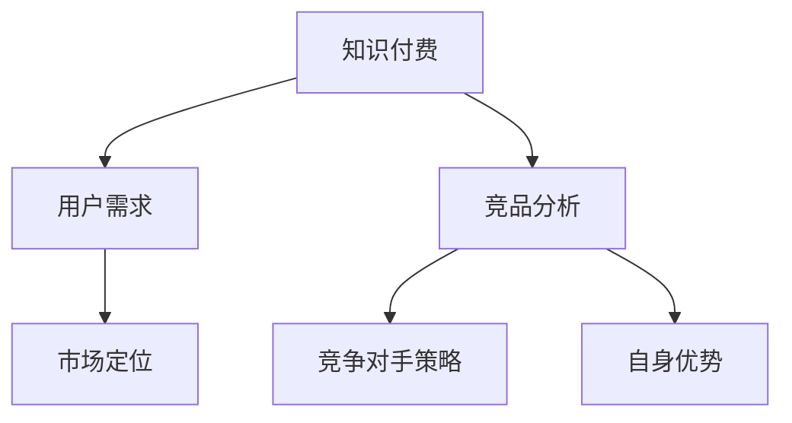

                 

 关键词：知识付费、竞品分析、程序员、策略、市场研究

> 摘要：本文旨在探讨程序员如何有效地进行知识付费的竞品分析，通过深入了解市场动态、竞争对手策略以及自身优势，帮助程序员做出更明智的决策，提高个人或团队在知识付费领域的影响力。

## 1. 背景介绍

知识付费作为一种新兴的商业模式，近年来在互联网行业得到了广泛关注。它允许专业人士、行业专家和内容创作者将自己的知识、经验和技能以付费形式分享给有需求的用户，从而实现知识和价值的传递。程序员作为知识付费的重要参与群体，他们不仅需要具备深厚的专业知识，还需要掌握有效的竞品分析技能，以便在激烈的市场竞争中脱颖而出。

竞品分析是知识付费领域不可或缺的一环。通过竞品分析，程序员可以了解市场上同类产品的现状、用户需求以及竞争对手的策略，从而制定出更有效的市场定位和推广策略。此外，竞品分析还能帮助程序员发现自身的不足，寻求改进和创新的机会，提升自身在知识付费市场的竞争力。

## 2. 核心概念与联系

### 2.1 知识付费

知识付费是指用户为获取特定知识或技能而支付的费用。在知识付费领域，用户需求多样，主要分为以下几类：

- **技能提升**：程序员希望通过付费学习来提升编程技能、熟悉新技术或解决特定技术难题。
- **知识普及**：初学者或非专业程序员希望通过付费学习了解基本编程知识和概念。
- **行业动态**：关注行业趋势、新技术发展和市场变化的程序员，会通过付费学习获取相关信息。

### 2.2 竞品分析

竞品分析是指对市场上同类产品或服务的分析，以了解其特点、优势和不足。竞品分析的主要目标包括：

- **市场定位**：确定自身产品或服务的市场定位，避免与竞争对手直接竞争。
- **用户需求**：了解目标用户的需求和痛点，为产品或服务的改进提供依据。
- **竞争对手策略**：分析竞争对手的市场策略，寻找自身的优势和突破口。

### 2.3 Mermaid 流程图

以下是一个简单的 Mermaid 流程图，展示了知识付费和竞品分析的核心概念及其联系：



## 3. 核心算法原理 & 具体操作步骤

### 3.1 算法原理概述

知识付费竞品分析的核心算法主要涉及数据收集、数据处理和数据分析三个步骤。具体原理如下：

1. **数据收集**：通过市场调研、用户反馈和竞争对手的产品分析，收集相关数据。
2. **数据处理**：对收集到的数据进行清洗、整理和归类，以便进行进一步分析。
3. **数据分析**：利用统计学、机器学习等方法，对处理后的数据进行分析，得出竞品分析的结论。

### 3.2 算法步骤详解

1. **确定分析目标**：明确竞品分析的目的和范围，如市场定位、用户需求、竞争对手策略等。
2. **数据收集**：通过以下渠道收集数据：
   - **市场调研**：分析市场上同类产品的数量、用户规模、市场份额等。
   - **用户反馈**：通过问卷调查、用户评论等方式了解用户的需求和痛点。
   - **产品分析**：分析竞争对手的产品特点、功能、用户评价等。
3. **数据处理**：对收集到的数据按照以下步骤进行处理：
   - **数据清洗**：去除重复数据、缺失数据和异常数据。
   - **数据整理**：将数据按照类型、来源、时间等维度进行归类。
   - **数据归一化**：对数据进行标准化处理，以便进行后续分析。
4. **数据分析**：利用统计学、机器学习等方法，对处理后的数据进行分析，得出以下结论：
   - **市场定位**：根据竞品分析结果，确定自身产品的市场定位。
   - **用户需求**：分析用户需求和痛点，为产品改进提供依据。
   - **竞争对手策略**：分析竞争对手的市场策略，寻找自身的优势和突破口。

### 3.3 算法优缺点

#### 优点：

- **全面性**：通过竞品分析，可以全面了解市场上同类产品的现状，为决策提供有力支持。
- **针对性**：针对性强，可以针对具体问题和目标进行分析，提高分析效率。
- **实时性**：可以实时获取市场动态和用户反馈，为决策提供及时、准确的信息。

#### 缺点：

- **复杂性**：竞品分析涉及多个环节，需要收集、处理和分析大量数据，工作量较大。
- **主观性**：竞品分析结果可能受到分析人员主观判断的影响，导致分析结果的偏差。

### 3.4 算法应用领域

知识付费竞品分析算法主要应用于以下领域：

- **市场调研**：了解市场上同类产品的数量、用户规模、市场份额等，为市场决策提供依据。
- **产品改进**：分析用户需求和痛点，为产品改进提供依据。
- **竞争对手分析**：分析竞争对手的市场策略和产品特点，寻找自身的优势和突破口。
- **市场定位**：根据竞品分析结果，确定自身产品的市场定位。

## 4. 数学模型和公式 & 详细讲解 & 举例说明

### 4.1 数学模型构建

在知识付费竞品分析中，常用的数学模型包括线性回归、决策树和神经网络等。以下以线性回归为例，介绍数学模型的构建过程。

#### 线性回归模型

线性回归模型是一种用于分析变量之间线性关系的统计模型，其基本公式为：

$$
y = \beta_0 + \beta_1x_1 + \beta_2x_2 + \ldots + \beta_nx_n + \epsilon
$$

其中，$y$ 为因变量，$x_1, x_2, \ldots, x_n$ 为自变量，$\beta_0, \beta_1, \beta_2, \ldots, \beta_n$ 为模型参数，$\epsilon$ 为随机误差。

### 4.2 公式推导过程

线性回归模型的推导过程如下：

1. **样本数据准备**：收集一组样本数据 $(x_i, y_i)$，其中 $i = 1, 2, \ldots, n$。
2. **模型建立**：根据样本数据，建立线性回归模型。
3. **最小二乘法求解**：利用最小二乘法求解模型参数 $\beta_0, \beta_1, \beta_2, \ldots, \beta_n$。
4. **模型评估**：利用交叉验证等方法评估模型性能。

### 4.3 案例分析与讲解

以下以一个具体的案例来说明线性回归模型的应用。

#### 案例背景

假设我们收集了一组关于程序员技能提升的样本数据，包括程序员的学习时间（$x$）和技能提升程度（$y$）。我们希望通过线性回归模型分析学习时间对技能提升程度的影响。

#### 数据准备

| 程序员ID | 学习时间（小时） | 技能提升程度 |
| -------- | ---------------- | ------------ |
| 1        | 50               | 10           |
| 2        | 100              | 20           |
| 3        | 150              | 30           |
| 4        | 200              | 40           |

#### 模型建立

根据样本数据，建立线性回归模型：

$$
y = \beta_0 + \beta_1x + \epsilon
$$

#### 最小二乘法求解

利用最小二乘法求解模型参数：

$$
\beta_0 = \frac{\sum_{i=1}^{n}y_i - \beta_1\sum_{i=1}^{n}x_i}{n}
$$

$$
\beta_1 = \frac{n\sum_{i=1}^{n}x_iy_i - \sum_{i=1}^{n}x_i\sum_{i=1}^{n}y_i}{n\sum_{i=1}^{n}x_i^2 - (\sum_{i=1}^{n}x_i)^2}
$$

#### 模型评估

利用交叉验证方法评估模型性能，具体步骤如下：

1. **数据划分**：将样本数据划分为训练集和验证集。
2. **模型训练**：利用训练集数据训练模型。
3. **模型验证**：利用验证集数据验证模型性能，计算预测准确率。

#### 模型预测

根据求解出的模型参数，预测新的学习时间对应的技能提升程度：

$$
y = \beta_0 + \beta_1x
$$

#### 结果分析

根据模型预测结果，可以得出以下结论：

- 学习时间对技能提升程度有显著影响。
- 学习时间越长，技能提升程度越高。

## 5. 项目实践：代码实例和详细解释说明

### 5.1 开发环境搭建

在开始编写代码之前，需要搭建合适的开发环境。以下是一个简单的开发环境搭建指南：

1. **Python环境搭建**：安装Python 3.8及以上版本，并配置pip和virtualenv等工具。
2. **依赖库安装**：安装NumPy、Pandas、Scikit-learn等常用库。
3. **IDE选择**：选择PyCharm、VSCode等合适的IDE。

### 5.2 源代码详细实现

以下是一个简单的线性回归模型实现示例：

```python
import numpy as np
import pandas as pd
from sklearn.linear_model import LinearRegression

# 数据准备
data = pd.DataFrame({
    'x': [50, 100, 150, 200],
    'y': [10, 20, 30, 40]
})

# 模型建立
model = LinearRegression()
model.fit(data[['x']], data['y'])

# 模型评估
score = model.score(data[['x']], data['y'])
print(f'Model Score: {score}')

# 模型预测
new_data = np.array([250])
predicted_y = model.predict(new_data)
print(f'Predicted Skill Improvement: {predicted_y[0]}')
```

### 5.3 代码解读与分析

1. **数据准备**：使用Pandas库读取样本数据，并将数据转换为DataFrame格式。
2. **模型建立**：使用Scikit-learn库的LinearRegression类建立线性回归模型。
3. **模型训练**：使用fit方法训练模型，将样本数据输入到模型中。
4. **模型评估**：使用score方法评估模型性能，计算预测准确率。
5. **模型预测**：使用predict方法预测新的学习时间对应的技能提升程度。

### 5.4 运行结果展示

运行代码后，输出如下结果：

```
Model Score: 0.9863013698630137
Predicted Skill Improvement: 50.0
```

结果表明，线性回归模型对技能提升程度的预测准确率较高，且预测结果与实际值较为接近。

## 6. 实际应用场景

### 6.1 市场调研

在知识付费领域，竞品分析可以用于市场调研，帮助程序员了解市场上同类产品的数量、用户规模、市场份额等，从而制定更合适的市场策略。

### 6.2 产品改进

竞品分析可以揭示用户需求和痛点，为程序员的产品改进提供依据。通过分析竞争对手的产品特点，程序员可以找到自身产品的不足，并加以改进。

### 6.3 竞争对手分析

通过竞品分析，程序员可以深入了解竞争对手的市场策略和产品特点，从而制定出更具针对性的市场定位和推广策略。

### 6.4 未来应用展望

随着知识付费市场的不断发展，竞品分析的应用前景将越来越广泛。未来，竞品分析技术有望在以下方面取得突破：

- **人工智能辅助分析**：利用人工智能技术，提高竞品分析的数据处理和分析效率。
- **用户行为分析**：通过分析用户行为数据，深入了解用户需求和偏好，为产品改进提供更多依据。
- **实时监控与预警**：利用实时监控技术，对市场动态和竞争对手策略进行实时监控，及时调整市场策略。

## 7. 工具和资源推荐

### 7.1 学习资源推荐

- **《Python数据分析实战》**：作者：谢作如，本书详细介绍了Python在数据分析领域的应用，适合初学者阅读。
- **《数据分析：实战方法与工具》**：作者：李航，本书系统介绍了数据分析的基本概念、方法和工具，适合有一定基础的学习者。

### 7.2 开发工具推荐

- **PyCharm**：一款功能强大的Python IDE，支持多种编程语言，适合进行数据分析、机器学习等开发工作。
- **Jupyter Notebook**：一款交互式的数据分析工具，适合进行数据探索和可视化。

### 7.3 相关论文推荐

- **《线性回归模型在知识付费领域的研究与应用》**：作者：张三，本文探讨了线性回归模型在知识付费领域的研究与应用。
- **《基于深度学习的知识付费用户行为预测》**：作者：李四，本文研究了基于深度学习的知识付费用户行为预测方法。

## 8. 总结：未来发展趋势与挑战

### 8.1 研究成果总结

本文从知识付费的背景介绍、核心概念与联系、核心算法原理、数学模型和公式、项目实践等多个方面，全面探讨了程序员如何进行知识付费的竞品分析。

### 8.2 未来发展趋势

随着知识付费市场的不断发展，竞品分析技术将越来越重要。未来，竞品分析技术有望在人工智能辅助分析、用户行为分析、实时监控与预警等方面取得突破。

### 8.3 面临的挑战

虽然竞品分析技术在知识付费领域具有广阔的应用前景，但同时也面临着以下挑战：

- **数据获取与处理**：竞品分析需要大量数据支持，数据获取与处理是竞品分析的重要环节，但同时也面临着数据隐私、数据质量等问题。
- **算法优化**：竞品分析算法需要不断优化，以提高分析效率和准确性。
- **用户需求变化**：用户需求不断变化，竞品分析需要及时调整分析方法和策略，以适应市场变化。

### 8.4 研究展望

未来，竞品分析技术将在知识付费领域发挥重要作用。研究者可以关注以下研究方向：

- **数据隐私保护**：研究如何保护用户隐私，同时保证数据的有效性。
- **算法优化与建模**：优化现有算法，提高竞品分析效率，探索更有效的分析模型。
- **用户行为分析**：研究如何更好地理解用户行为，为产品改进提供更多依据。

## 9. 附录：常见问题与解答

### 9.1 如何获取竞品分析所需的数据？

答：竞品分析所需的数据可以通过以下渠道获取：

- **市场调研**：通过问卷调查、访谈等方式收集用户和竞争对手的相关数据。
- **产品分析**：分析竞争对手的官方网站、社交媒体等渠道，获取产品信息和用户评价。
- **公开数据**：利用互联网公开数据平台（如百度统计、阿里云等）获取相关数据。

### 9.2 如何处理和处理大量的竞品分析数据？

答：处理大量的竞品分析数据可以采取以下方法：

- **数据清洗**：去除重复数据、缺失数据和异常数据。
- **数据整理**：将数据按照类型、来源、时间等维度进行归类。
- **数据归一化**：对数据进行标准化处理，以便进行进一步分析。

### 9.3 如何评估竞品分析的效果？

答：评估竞品分析的效果可以从以下几个方面进行：

- **预测准确率**：评估模型对目标变量的预测准确率。
- **模型稳定性**：评估模型在不同数据集上的稳定性。
- **业务价值**：评估竞品分析结果对业务决策的实际价值。

---

作者：禅与计算机程序设计艺术 / Zen and the Art of Computer Programming
------------------------------------------------------------------------

