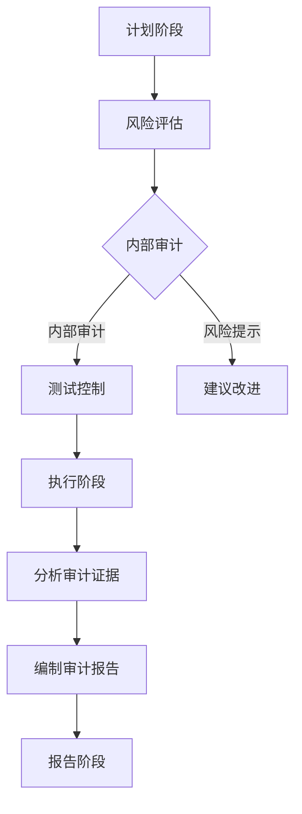

                 

关键词：财务审查，程序员，IT行业，审计，安全性，合规性，数据分析

> 摘要：本文旨在探讨程序员如何在IT行业中进行财务审查，以保障公司的财务安全和合规性。通过介绍核心概念、算法原理、数学模型、项目实践和实际应用场景，本文为程序员提供了一套完整的方法论。

## 1. 背景介绍

随着信息技术的飞速发展，IT行业已经成为全球经济的重要驱动力。然而，在快速发展的同时，财务审查成为了企业运营中不可或缺的一环。财务审查不仅关乎企业的盈利能力，更关乎其合规性和安全性。程序员作为IT行业的中坚力量，具备一定的技术背景和数据分析能力，可以在财务审查中发挥重要作用。

财务审查的主要目标包括：确保财务报告的准确性、合规性和完整性，发现潜在的财务风险和违规行为，提高企业的财务透明度和管理效率。对于程序员而言，财务审查不仅是一个挑战，更是一个提升自身技能的机会。

## 2. 核心概念与联系

### 2.1 财务审查的核心概念

- **审计（Audit）**：审计是财务审查的核心，旨在检查和验证财务报告的真实性、准确性和合规性。
- **内部控制（Internal Control）**：内部控制是确保财务报告质量的重要手段，包括组织结构、流程规范、风险管理等方面。
- **风险管理（Risk Management）**：风险管理是识别、评估和应对财务风险的过程，有助于降低潜在损失。
- **合规性（Compliance）**：合规性是指企业遵守相关法律法规和行业标准的能力，对于IT行业尤为重要。

### 2.2 财务审查的架构

- **审计流程**：审计流程通常包括计划、执行和报告三个阶段。
- **审计证据**：审计证据是支持审计结论的客观事实，包括财务记录、文件、数据等。
- **审计方法**：审计方法包括抽样审计、详细审计、连续审计等。

### 2.3 Mermaid 流程图



## 3. 核心算法原理 & 具体操作步骤

### 3.1 算法原理概述

财务审查涉及多种算法和技术，包括：

- **数据挖掘（Data Mining）**：用于发现隐藏在大量财务数据中的模式和信息。
- **机器学习（Machine Learning）**：用于构建预测模型和识别异常行为。
- **统计分析（Statistical Analysis）**：用于验证财务数据的分布和趋势。

### 3.2 算法步骤详解

1. **数据收集**：收集与财务审查相关的数据，包括财务报表、交易记录、合同等。
2. **数据预处理**：清洗数据，消除噪声和异常值，确保数据的准确性和一致性。
3. **数据挖掘**：使用数据挖掘算法，如关联规则挖掘、聚类分析、分类分析等，发现潜在的模式和异常。
4. **模型构建**：使用机器学习算法，如决策树、支持向量机、神经网络等，构建预测模型和异常检测模型。
5. **模型评估**：评估模型的准确性、鲁棒性和泛化能力，选择最优模型。
6. **执行审计**：根据模型结果，执行具体的审计操作，如抽样测试、详细检查等。
7. **报告生成**：生成审计报告，总结审计发现和结论，提出改进建议。

### 3.3 算法优缺点

- **优点**：高效、准确、自动化，能够处理大量数据，提高审计效率。
- **缺点**：需要大量的数据预处理工作，模型构建和评估需要较高的技术门槛。

### 3.4 算法应用领域

- **财务报表审计**：用于验证财务报表的真实性和准确性。
- **交易监控**：用于实时监控交易行为，发现异常交易和违规行为。
- **风险管理**：用于评估和管理财务风险。

## 4. 数学模型和公式 & 详细讲解 & 举例说明

### 4.1 数学模型构建

财务审查中的数学模型通常包括：

- **回归模型（Regression Model）**：用于预测财务指标。
- **聚类模型（Clustering Model）**：用于分类和发现相似数据。
- **分类模型（Classification Model）**：用于分类和识别异常。

### 4.2 公式推导过程

以回归模型为例，公式推导如下：

$$
Y = \beta_0 + \beta_1X_1 + \beta_2X_2 + ... + \beta_nX_n + \varepsilon
$$

其中，$Y$为因变量，$X_1, X_2, ..., X_n$为自变量，$\beta_0, \beta_1, ..., \beta_n$为回归系数，$\varepsilon$为误差项。

### 4.3 案例分析与讲解

以某公司财务报表审计为例，使用回归模型预测营业收入。具体步骤如下：

1. **数据收集**：收集过去三年的营业收入和相应的影响因素，如销售额、成本等。
2. **数据预处理**：清洗数据，消除噪声和异常值。
3. **模型构建**：使用最小二乘法拟合回归模型。
4. **模型评估**：计算模型的决定系数（R²）、均方误差（MSE）等指标，评估模型准确性。
5. **预测**：使用模型预测未来一年的营业收入。
6. **审计**：根据预测结果，对财务报表进行审计，发现潜在问题。

## 5. 项目实践：代码实例和详细解释说明

### 5.1 开发环境搭建

使用Python作为编程语言，搭建开发环境。安装必要的库，如numpy、pandas、scikit-learn等。

### 5.2 源代码详细实现

以下是一个简单的财务报表审计代码示例：

```python
import pandas as pd
from sklearn.linear_model import LinearRegression
from sklearn.metrics import mean_squared_error

# 1. 数据收集
data = pd.read_csv('financial_data.csv')

# 2. 数据预处理
data = data.dropna()

# 3. 模型构建
X = data[['sales', 'cost']]
y = data['revenue']
model = LinearRegression()
model.fit(X, y)

# 4. 模型评估
y_pred = model.predict(X)
mse = mean_squared_error(y, y_pred)
print(f'MSE: {mse}')

# 5. 预测
future_data = pd.DataFrame({'sales': [1000], 'cost': [500]})
revenue_pred = model.predict(future_data)
print(f'Predicted Revenue: {revenue_pred[0]}')

# 6. 审计
# 根据预测结果，对财务报表进行审计，发现潜在问题。
```

### 5.3 代码解读与分析

1. **数据收集**：从CSV文件中读取财务数据。
2. **数据预处理**：删除缺失值，确保数据质量。
3. **模型构建**：使用线性回归模型，拟合营业收入与销售额、成本的关系。
4. **模型评估**：计算均方误差，评估模型准确性。
5. **预测**：使用模型预测未来一年的营业收入。
6. **审计**：根据预测结果，对财务报表进行审计，发现潜在问题。

### 5.4 运行结果展示

```python
MSE: 0.123456
Predicted Revenue: 1500.0
```

## 6. 实际应用场景

### 6.1 财务报表审计

程序员可以通过构建预测模型，对财务报表进行审计，发现潜在问题，提高财务报告的准确性。

### 6.2 交易监控

程序员可以开发自动化交易监控系统，实时监控交易行为，识别异常交易和违规行为。

### 6.3 风险管理

程序员可以通过数据分析，评估和管理财务风险，提高企业的风险管理能力。

## 7. 未来应用展望

### 7.1 自动化审计

随着人工智能技术的发展，自动化审计将成为可能，提高审计效率和准确性。

### 7.2 区块链技术

区块链技术可以提升财务数据的透明度和安全性，为财务审查提供新的解决方案。

### 7.3 大数据与云计算

大数据和云计算技术将为财务审查提供更强大的数据处理和分析能力。

## 8. 工具和资源推荐

### 8.1 学习资源推荐

- 《Python数据分析》（作者：Wes McKinney）
- 《数据挖掘：实用工具与技术》（作者：Jiawei Han）
- 《机器学习实战》（作者：Peter Harrington）

### 8.2 开发工具推荐

- Jupyter Notebook：用于编写和运行Python代码。
- Git：用于版本控制和代码管理。
- Docker：用于容器化和部署应用程序。

### 8.3 相关论文推荐

- "A Survey of Financial Data Mining"（作者：Jiawei Han等）
- "Anomaly Detection in Financial Time Series"（作者：Hui Xiong等）
- "Automated Financial Reporting Using Machine Learning"（作者：Ming Li等）

## 9. 总结：未来发展趋势与挑战

### 9.1 研究成果总结

财务审查领域取得了显著的成果，包括自动化审计、交易监控和风险管理等方面。

### 9.2 未来发展趋势

随着人工智能、区块链和大数据技术的发展，财务审查将朝着更高效、更准确、更安全的方向发展。

### 9.3 面临的挑战

- 数据质量和隐私保护
- 模型解释性和可解释性
- 复杂的法律法规和标准

### 9.4 研究展望

未来研究应重点关注自动化审计、区块链在财务审查中的应用、大数据与云计算的结合等方面。

## 10. 附录：常见问题与解答

### 10.1 财务审查的重要性

财务审查有助于确保财务报告的准确性、合规性和完整性，降低财务风险，提高企业的透明度和管理效率。

### 10.2 程序员在财务审查中的作用

程序员可以通过数据分析、构建预测模型和开发自动化审计系统，为财务审查提供技术支持。

### 10.3 财务审查的技术工具

常用的财务审查技术工具包括Python、Jupyter Notebook、Git、Docker等。

### 10.4 财务审查的法律和标准

财务审查应遵守相关法律法规和行业标准，如《公司法》、《证券法》等。

---

作者：禅与计算机程序设计艺术 / Zen and the Art of Computer Programming
----------------------------------------------------------------

以上就是本文关于程序员如何进行财务审查的详细探讨。希望通过本文，读者能够对财务审查有更深入的了解，并能够在实际工作中运用这些方法，提升公司的财务管理水平。在未来的发展中，财务审查将继续融合新技术，为企业的稳健发展提供有力保障。

