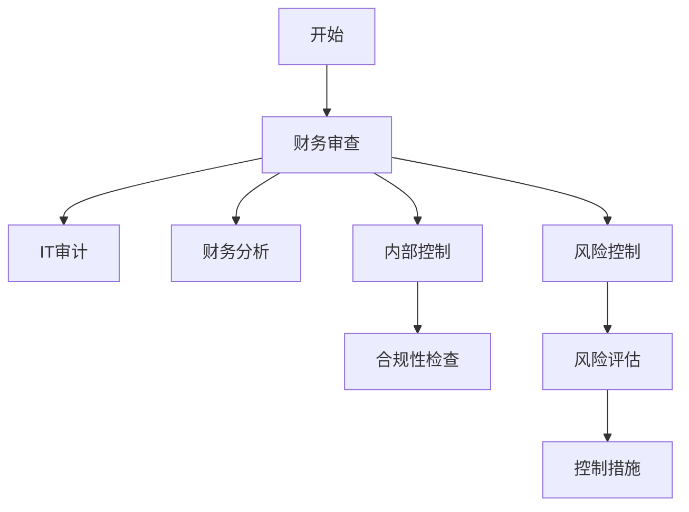

                 

关键词：财务审查、程序员、财务分析、IT审计、风险控制、数据分析、审计流程、合规性检查、代码审查、内部控制

摘要：本文将探讨程序员如何利用其技术专长参与财务审查，提高企业财务透明度和合规性。我们将深入分析财务审查的核心概念、算法原理、数学模型及其在具体项目中的实现，为程序员提供一整套操作指南，以帮助他们在财务领域发挥重要作用。

## 1. 背景介绍

财务审查是确保企业财务报表真实、合规的重要手段。随着信息技术的飞速发展，财务审查也从传统的手工审查逐渐向自动化、智能化的方向转变。程序员作为信息技术的主要推动者，有能力也有责任参与到财务审查的过程中，发挥其在数据分析、系统架构设计、代码审查等方面的专业优势。

本文旨在帮助程序员了解财务审查的基本概念和方法，掌握财务数据分析的核心算法，熟悉审计流程和合规性检查的标准，从而能够在实际项目中有效进行财务审查，提高财务管理的质量和效率。

## 2. 核心概念与联系

### 2.1 财务审查的定义

财务审查是指对企业财务报表及其相关信息进行审核，以验证其真实性、准确性和合规性。它包括对财务报表的编制、记录、分类、汇总等环节的审查，以及对财务内部控制和风险管理制度的评估。

### 2.2 IT审计

IT审计是审计过程中的一部分，它关注信息系统及其相关业务流程的完整性和安全性。IT审计师通过审查系统的设计和实施，确保其符合组织的内部控制要求，并能够有效保护企业资产。

### 2.3 财务分析

财务分析是通过分析企业的财务数据，评估其财务状况和经营成果。常见的财务分析工具包括比率分析、趋势分析、现金流量分析等。

### 2.4 风险控制

风险控制是指通过识别、评估和应对财务风险，确保企业财务稳定和安全。程序员在财务审查中可以通过分析数据，发现潜在的风险点，并提出相应的控制措施。

### 2.5 内部控制

内部控制是企业为了合理保证财务报告的可靠性、经营的效率和效果、相关法律法规的遵循，由治理层、管理层和其他人员实施的程序。程序员需要理解和评估这些内部控制措施的有效性。

#### 2.5.1 Mermaid 流程图



## 3. 核心算法原理 & 具体操作步骤

### 3.1 算法原理概述

财务审查涉及多种算法，主要包括：

- **数据清洗算法**：用于处理和整理原始数据，去除错误和重复信息。
- **统计分析算法**：用于分析数据分布、趋势和相关性。
- **机器学习算法**：用于预测和分类，如异常检测、风险评分等。

### 3.2 算法步骤详解

#### 3.2.1 数据清洗

1. **数据采集**：从不同的数据源获取财务数据。
2. **数据清洗**：去除重复数据、纠正错误、填补缺失值。
3. **数据格式转换**：将数据转换成统一的格式，如CSV或数据库。

#### 3.2.2 统计分析

1. **描述性统计**：计算均值、方差、中位数等。
2. **相关性分析**：使用皮尔逊相关系数或其他方法评估变量之间的关系。
3. **趋势分析**：通过时间序列分析，观察数据随时间的变化趋势。

#### 3.2.3 机器学习

1. **数据预处理**：特征选择、归一化等。
2. **模型训练**：选择合适的模型，如决策树、随机森林、神经网络等。
3. **模型评估**：使用交叉验证、AUC、准确率等指标评估模型性能。
4. **异常检测**：检测数据中的异常值或异常交易。

### 3.3 算法优缺点

- **数据清洗算法**：高效处理大量数据，但可能引入新的错误。
- **统计分析算法**：直观易懂，但可能忽略复杂关系。
- **机器学习算法**：能够发现复杂模式，但需要大量数据和计算资源。

### 3.4 算法应用领域

- **财务报表分析**：用于评估企业的财务健康状况。
- **审计**：用于发现潜在问题，支持审计决策。
- **风险管理**：用于评估和预测风险，制定控制措施。

## 4. 数学模型和公式 & 详细讲解 & 举例说明

### 4.1 数学模型构建

财务审查常用的数学模型包括：

- **比率分析模型**：用于计算各种财务比率，如流动比率、负债比率等。
- **现金流量分析模型**：用于计算自由现金流量、净现值等。

### 4.2 公式推导过程

- **流动比率**：流动资产 / 流动负债
- **负债比率**：总负债 / 总资产
- **净现值**：NPV = Σ(CF_t / (1 + r)^t)，其中CF_t为第t年的现金流量，r为折现率。

### 4.3 案例分析与讲解

#### 案例一：比率分析

假设某公司的财务数据如下：

| 项目       | 金额（万元） |
|------------|-------------|
| 流动资产   | 500         |
| 流动负债   | 200         |
| 总资产     | 800         |
| 总负债     | 600         |

根据上述数据，我们可以计算出以下比率：

- **流动比率**：500 / 200 = 2.5
- **负债比率**：600 / 800 = 0.75

这些比率可以帮助我们评估公司的偿债能力和财务结构。

#### 案例二：现金流量分析

假设某项目的现金流量如下（单位：万元）：

| 年份 | 现金流入 | 现金流出 |
|------|---------|---------|
| 1    | 100     | 50      |
| 2    | 150     | 70      |
| 3    | 200     | 90      |

假设折现率为10%，我们可以计算出该项目的净现值：

$$
NPV = \frac{100}{(1+0.1)^1} + \frac{150}{(1+0.1)^2} + \frac{200}{(1+0.1)^3} = 100 \times 0.9091 + 150 \times 0.8264 + 200 \times 0.7513 = 220.64
$$

由于NPV大于0，该项目的投资是有利的。

## 5. 项目实践：代码实例和详细解释说明

### 5.1 开发环境搭建

在开始项目之前，我们需要搭建一个适合财务审查的Python开发环境。以下是一些建议的软件和库：

- **Python**：版本3.8及以上
- **Jupyter Notebook**：用于编写和运行代码
- **Pandas**：用于数据处理
- **NumPy**：用于数值计算
- **Matplotlib**：用于数据可视化
- **Scikit-learn**：用于机器学习

### 5.2 源代码详细实现

以下是财务审查项目的一部分代码实现：

```python
import pandas as pd
import numpy as np
import matplotlib.pyplot as plt
from sklearn.ensemble import RandomForestClassifier

# 数据读取与预处理
data = pd.read_csv('financial_data.csv')
data = data.dropna()  # 去除缺失值

# 描述性统计
descriptive_stats = data.describe()
print(descriptive_stats)

# 比率分析
ratios = data[['current_assets', 'current_liabilities', 'total_assets', 'total_liabilities']]
ratios['流动比率'] = ratios['current_assets'] / ratios['current_liabilities']
ratios['负债比率'] = ratios['total_liabilities'] / ratios['total_assets']
print(ratios)

# 趋势分析
data['year'] = data['date'].dt.year
trend = data.groupby('year')['revenue'].mean()
trend.plot()
plt.show()

# 机器学习：异常检测
X = data[['revenue', 'expenses', 'profit']]
y = data['is_healthy']  # 健康状态分类标签
clf = RandomForestClassifier(n_estimators=100)
clf.fit(X, y)
predictions = clf.predict(X)

# 结果展示
results = pd.DataFrame({'Actual': y, 'Predicted': predictions})
print(results)

# 可视化：异常交易
data[data['is_healthy'] != data['predicted']].plot(x='date', y='revenue', kind='line')
plt.show()
```

### 5.3 代码解读与分析

上述代码首先读取了财务数据，进行了预处理，然后进行了描述性统计和比率分析，接着使用机器学习算法进行了异常检测。最后，代码展示了分析结果，包括描述性统计、比率分析结果和异常交易的可视化。

## 6. 实际应用场景

### 6.1 内部审计

程序员可以协助内部审计团队，通过数据分析和异常检测，发现潜在的风险和问题，提高内部审计的效率和准确性。

### 6.2 第三方审计

在第三方审计过程中，程序员可以利用其技术专长，协助审计师进行数据分析和风险评估，提高审计报告的可靠性和专业性。

### 6.3 风险管理

程序员可以帮助企业建立风险管理系统，通过数据分析，识别和评估风险，制定相应的控制措施。

## 7. 工具和资源推荐

### 7.1 学习资源推荐

- 《Python for Data Analysis》
- 《Machine Learning Yearning》
- 《The Data Analysis Cookbook》

### 7.2 开发工具推荐

- Jupyter Notebook：适用于数据分析
- PyCharm：适用于Python开发
- Tableau：适用于数据可视化

### 7.3 相关论文推荐

- "A Survey on Financial Auditing and Data Mining"
- "Application of Machine Learning in Financial Risk Management"
- "A Comparative Study of Financial Statement Analysis Methods"

## 8. 总结：未来发展趋势与挑战

### 8.1 研究成果总结

随着大数据和人工智能技术的发展，财务审查正逐渐从手工审查向自动化、智能化方向转变。程序员在这一过程中发挥了重要作用，通过数据分析和机器学习算法，提高了财务审查的效率和准确性。

### 8.2 未来发展趋势

- **自动化审计**：利用机器学习和自然语言处理技术，实现自动化审计。
- **实时审计**：通过实时数据分析和异常检测，实现实时审计。
- **区块链审计**：利用区块链技术，提高审计的透明度和可信度。

### 8.3 面临的挑战

- **数据隐私和安全**：确保审计过程中数据的安全和隐私。
- **算法透明度和可解释性**：提高机器学习算法的透明度和可解释性，确保审计结果的可靠性。

### 8.4 研究展望

未来，财务审查领域将继续融合大数据、人工智能和区块链技术，为提高财务管理的质量和效率提供新的解决方案。程序员在这一过程中将发挥更加重要的作用，推动财务审查向智能化、自动化方向不断迈进。

## 9. 附录：常见问题与解答

### 9.1 财务审查与IT审计的区别是什么？

财务审查主要关注财务报表的真实性、准确性和合规性，而IT审计则关注信息系统及其相关业务流程的完整性和安全性。两者都旨在确保企业的财务和IT系统健康运行。

### 9.2 程序员如何学习财务知识？

程序员可以通过阅读财务书籍、参加财务培训课程、与财务专业人士交流等方式学习财务知识。此外，实践项目也是提高财务技能的有效途径。

### 9.3 财务审查中的数据来源有哪些？

财务审查的数据来源包括企业的财务报表、会计记录、审计报告、市场数据等。程序员需要从这些数据源中提取和处理相关信息，进行财务分析。

### 9.4 如何保证财务审查的准确性？

保证财务审查的准确性需要从数据采集、处理、分析到报告的各个环节进行严格控制和验证。此外，采用先进的数据分析技术和工具也有助于提高审查的准确性。

### 9.5 财务审查与合规性检查的关系是什么？

财务审查是合规性检查的一部分，它旨在确保企业的财务活动符合相关法律法规和内部控制要求。合规性检查则更侧重于评估企业是否遵守了具体的法规和规定。

### 9.6 财务审查中的内部控制如何评估？

内部控制评估通常通过风险评估、流程分析、测试和验证等方法进行。程序员需要理解内部控制的概念，能够评估其设计和实施的有效性。

### 9.7 如何处理财务审查中发现的异常情况？

在财务审查过程中，发现的异常情况需要及时记录并报告给相关责任人。根据异常的性质和影响，可能需要进行深入调查、调整内部控制或采取其他措施。

### 9.8 财务审查在跨国企业中的作用是什么？

跨国企业在不同国家和地区的财务要求可能有所不同，财务审查有助于确保企业的财务报表符合各国的会计准则和法规，同时提高财务报告的透明度和可比性。

### 9.9 财务审查与风险管理的关系是什么？

财务审查是风险管理的重要组成部分，它通过识别和评估财务风险，帮助企业管理风险、制定控制措施，确保企业的财务稳定和安全。

### 9.10 财务审查的未来发展趋势是什么？

财务审查的未来发展趋势包括自动化、智能化和区块链技术的应用。随着技术的不断进步，财务审查将更加高效、准确和透明。程序员在这一过程中将发挥更加重要的作用。

### 结论 Conclusion

本文介绍了程序员如何参与财务审查，提高企业财务透明度和合规性。通过理解核心概念、掌握算法原理、应用数学模型和进行项目实践，程序员可以在财务领域发挥重要作用。未来，随着技术的不断发展，财务审查将更加智能化和自动化，程序员将在其中扮演关键角色。

作者：禅与计算机程序设计艺术 / Zen and the Art of Computer Programming
----------------------------------------------------------------

### 后记 Postscript

本文旨在为程序员提供财务审查的技术指南，帮助他们更好地参与财务管理和审计工作。随着信息技术的发展，财务审查将不断演进，程序员的技术专长将在其中发挥越来越重要的作用。希望本文能对您的工作和学习有所启发，如果您在财务审查方面有任何疑问或经验，欢迎在评论区分享，让我们共同探讨和进步。感谢您的阅读！

