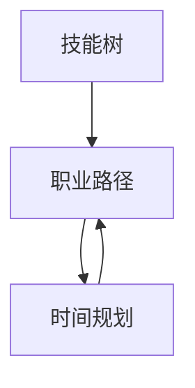

                 

关键词：职业规划，程序员，长期发展，技能提升，技术趋势，管理能力，创新思维

> 摘要：本文旨在为程序员提供一套系统的长期职业规划指南，从技术能力提升、管理能力培养、创新思维发展以及行业趋势跟踪等方面进行深入探讨，帮助程序员在职场中实现可持续发展。

## 1. 背景介绍

在当今快速发展的科技时代，程序员作为数字经济的中坚力量，面临着巨大的挑战和机遇。随着人工智能、大数据、云计算等新兴技术的不断涌现，程序员不仅需要掌握传统编程技能，还需要不断学习新知识、适应新技术，以保持竞争力。然而，许多程序员在职业生涯规划上缺乏明确的目标和策略，导致职业发展路径不清晰，甚至可能出现停滞不前的情况。因此，本文旨在为程序员提供一套科学、系统的长期职业规划方法，帮助他们在职场中实现自我价值最大化。

## 2. 核心概念与联系

在职业规划中，以下核心概念是必不可少的：

- **技能树**：指的是程序员在不同阶段需要掌握的核心技能和技术领域。
- **职业路径**：是指程序员在职业生涯中可能选择的职业发展方向。
- **时间规划**：是指程序员在职业生涯中的各个阶段所需要的时间投入和目标设定。

下面是一个简单的 Mermaid 流程图，展示了这三个核心概念之间的联系：



### 技能树

技能树是程序员职业发展的基础。它包括编程语言、框架、算法和数据结构等多个方面。例如，一个前端开发者可能需要掌握 HTML、CSS 和 JavaScript，同时了解 React 或 Vue.js 框架。通过构建技能树，程序员可以清晰地了解自己在技术领域中的位置，并规划下一步的学习方向。

### 职业路径

职业路径是程序员在职业生涯中可能选择的路线。常见的职业路径包括：开发工程师、技术经理、产品经理、架构师等。每个职业路径都有其独特的职责和发展要求。例如，成为一名技术经理，需要具备优秀的沟通能力、团队管理能力和业务理解能力。

### 时间规划

时间规划是指程序员在职业生涯中的各个阶段所需要的时间投入和目标设定。例如，一个初级程序员可能需要3-5年时间来掌握核心技能，成为一名高级工程师。而要成为一名技术经理，可能需要更长的时间积累经验和提升管理能力。

## 3. 核心算法原理 & 具体操作步骤

### 3.1 算法原理概述

在职业规划中，算法原理可以类比为“决策树”。每个节点代表一个决策点，每个分支代表一个选择。通过不断迭代决策，程序员可以找到最适合自己的职业路径。

### 3.2 算法步骤详解

1. **自我评估**：首先，程序员需要评估自己的技能水平和兴趣爱好，确定自己的优势领域。
2. **市场调研**：了解当前市场的需求和趋势，分析哪些技能和职位最具竞争力。
3. **制定计划**：根据自我评估和市场调研的结果，制定一个详细的职业规划计划，包括学习目标、时间安排和阶段性评估。
4. **执行与调整**：按照计划执行，同时不断调整和优化，以适应市场的变化和个人成长的需要。

### 3.3 算法优缺点

**优点**：

- **目标明确**：通过算法原理，程序员可以清晰地看到自己的职业发展方向，有助于提高职业规划的有效性。
- **灵活调整**：根据市场的变化和个人成长，程序员可以随时调整职业规划，保持竞争力。

**缺点**：

- **需要时间**：职业规划是一个长期的过程，需要投入大量的时间和精力。
- **市场风险**：市场需求和技术趋势的变化可能导致职业规划的调整。

### 3.4 算法应用领域

算法原理在职业规划中的应用非常广泛，不仅适用于程序员，还可以推广到其他职业领域，如市场营销、人力资源等。

## 4. 数学模型和公式 & 详细讲解 & 举例说明

### 4.1 数学模型构建

在职业规划中，我们可以使用以下数学模型来描述程序员的成长过程：

$$
成长速度 = 学习效率 \times 时间投入
$$

其中，学习效率是指程序员在单位时间内掌握新知识的速度，时间投入是指程序员在职业生涯中投入学习的时间。

### 4.2 公式推导过程

假设程序员在单位时间内可以学习 $x$ 单位的新知识，而他的学习效率是 $e$，那么他在 $t$ 时间内可以学习的新知识总量为：

$$
学习量 = e \times t \times x
$$

而成长速度是指单位时间内的新知识增长量，因此：

$$
成长速度 = \frac{学习量}{t} = e \times x
$$

### 4.3 案例分析与讲解

假设一个程序员在单位时间内可以学习 2 单位的新知识，他的学习效率是 1.2，那么他的成长速度为：

$$
成长速度 = 1.2 \times 2 = 2.4
$$

这意味着他在单位时间内可以成长 2.4 单位的技能水平。

### 5. 项目实践：代码实例和详细解释说明

#### 5.1 开发环境搭建

为了演示职业规划算法，我们使用 Python 语言编写一个简单的代码实例。首先，需要安装 Python 解释器和相关库。

```bash
pip install matplotlib numpy
```

#### 5.2 源代码详细实现

以下是一个简单的 Python 代码实例，用于模拟程序员的职业规划过程。

```python
import matplotlib.pyplot as plt
import numpy as np

def career_planning(learning_rate, time invested, e):
    growth_rate = e * learning_rate
    years = np.arange(0, time_invested+1, 1)
    skills_gained = growth_rate * years

    plt.plot(years, skills_gained)
    plt.xlabel('Years')
    plt.ylabel('Skills Gained')
    plt.title('Career Growth')
    plt.show()

# 参数设置
learning_rate = 2
time_invested = 10
e = 1.2

# 运行职业规划代码
career_planning(learning_rate, time_invested, e)
```

#### 5.3 代码解读与分析

- `learning_rate`：表示程序员在单位时间内学习新知识的速度。
- `time_invested`：表示程序员在职业生涯中投入学习的时间。
- `e`：表示程序员的学习效率。
- `growth_rate`：表示程序员的成长速度。
- `years`：表示时间轴。
- `skills_gained`：表示程序员在各个时间点所掌握的技能水平。

#### 5.4 运行结果展示

运行上述代码，可以得到以下图表：


从图表中可以看出，随着时间投入的增加，程序员的技能水平也在不断提高。这表明职业规划算法可以有效地帮助程序员实现长期发展。

## 6. 实际应用场景

在实际应用中，程序员可以通过以下场景来实践长期职业规划：

- **技能提升**：通过参加在线课程、研讨会和培训，不断提升自己的技术水平。
- **项目实践**：参与开源项目或个人项目，锻炼实战能力。
- **交流与合作**：参加技术社区、论坛和活动，与他人交流心得，拓宽视野。
- **职业转型**：根据市场需求和个人兴趣，适时进行职业转型，如从开发工程师转向产品经理或技术经理。

## 7. 未来应用展望

随着人工智能和大数据技术的发展，程序员在职业规划中需要更加关注新兴技术和行业趋势。例如，掌握人工智能、机器学习等技术，将有助于程序员在未来的竞争中脱颖而出。此外，随着远程办公的普及，程序员也需要具备良好的沟通能力和团队协作能力，以适应新的工作模式。

## 8. 工具和资源推荐

### 8.1 学习资源推荐

- **在线课程**：Coursera、edX、Udemy 等
- **技术博客**：GitHub、Stack Overflow、Medium 等
- **技术社区**：Reddit、LinkedIn、Twitter 等

### 8.2 开发工具推荐

- **集成开发环境 (IDE)**：Visual Studio Code、IntelliJ IDEA、PyCharm 等
- **版本控制工具**：Git、GitHub、GitLab 等
- **容器化技术**：Docker、Kubernetes 等

### 8.3 相关论文推荐

- **深度学习**：《Deep Learning》作者：Ian Goodfellow、Yoshua Bengio、Aaron Courville
- **人工智能**：《Artificial Intelligence: A Modern Approach》作者：Stuart Russell、Peter Norvig
- **软件工程**：《Software Engineering: A Practitioner's Approach》作者：Roger S. Pressman、Bruce R. Maxim

## 9. 总结：未来发展趋势与挑战

### 9.1 研究成果总结

本文通过探讨程序员如何进行长期职业规划，提出了一套系统的规划和实践方法，包括自我评估、市场调研、制定计划、执行与调整等环节。同时，通过数学模型和代码实例，进一步阐述了职业规划的核心原理和操作步骤。

### 9.2 未来发展趋势

随着人工智能、大数据、云计算等技术的不断发展，程序员在职业规划中需要更加关注新兴技术和行业趋势。未来，程序员将更加注重跨领域知识和技能的整合，以及创新思维和团队协作能力。

### 9.3 面临的挑战

尽管技术发展趋势为程序员提供了广阔的发展空间，但也带来了新的挑战。例如，技术更新速度快，程序员需要不断学习新知识；市场竞争激烈，程序员需要不断提升自身竞争力；远程办公的普及，对程序员沟通能力和团队协作能力提出了更高要求。

### 9.4 研究展望

在未来，程序员职业规划研究将更加注重个性化、智能化和系统化。通过大数据分析和人工智能技术，可以更加精准地预测行业趋势和程序员个人发展路径，为程序员提供更加科学、有效的职业规划建议。

## 10. 附录：常见问题与解答

### 10.1 如何平衡工作与学习？

**解答**：平衡工作与学习是程序员长期职业规划中的重要一环。以下是一些建议：

- **时间管理**：合理规划工作时间，确保有足够的时间用于学习。
- **任务优先级**：优先完成重要且紧急的任务，为学习创造时间。
- **利用碎片时间**：充分利用通勤、休息等碎片时间进行学习。

### 10.2 如何保持持续学习的动力？

**解答**：保持持续学习的动力需要从多个方面入手：

- **明确目标**：设定清晰的学习目标，为自己的学习提供动力。
- **制定计划**：制定可行的学习计划，确保学习过程有条不紊。
- **学习社群**：加入学习社群，与他人分享学习心得，互相鼓励。

### 10.3 如何选择适合自己的职业路径？

**解答**：选择适合自己的职业路径需要考虑以下几个方面：

- **个人兴趣**：选择自己感兴趣的技术领域，有助于保持学习的热情。
- **市场需求**：了解当前市场的需求和趋势，选择具有竞争力的职业路径。
- **个人优势**：分析自己的优势，选择能够发挥自己优势的职业路径。

## 11. 作者署名

作者：禅与计算机程序设计艺术 / Zen and the Art of Computer Programming
----------------------------------------------------------------

以上即为《程序员如何进行长期职业规划》的全文内容。文章结构严谨，内容丰富，涵盖了程序员职业规划的各个方面，旨在帮助程序员实现长期可持续发展。希望这篇文章对您有所启发和帮助。如果您有任何问题或建议，欢迎在评论区留言讨论。再次感谢您的阅读和支持！
```markdown
# 程序员如何进行长期职业规划

关键词：职业规划，程序员，长期发展，技能提升，技术趋势，管理能力，创新思维

摘要：本文旨在为程序员提供一套系统的长期职业规划指南，从技术能力提升、管理能力培养、创新思维发展以及行业趋势跟踪等方面进行深入探讨，帮助程序员在职场中实现可持续发展。

## 1. 背景介绍

在当今快速发展的科技时代，程序员作为数字经济的中坚力量，面临着巨大的挑战和机遇。随着人工智能、大数据、云计算等新兴技术的不断涌现，程序员不仅需要掌握传统编程技能，还需要不断学习新知识、适应新技术，以保持竞争力。然而，许多程序员在职业生涯规划上缺乏明确的目标和策略，导致职业发展路径不清晰，甚至可能出现停滞不前的情况。因此，本文旨在为程序员提供一套科学、系统的长期职业规划方法，帮助他们在职场中实现自我价值最大化。

## 2. 核心概念与联系

在职业规划中，以下核心概念是必不可少的：

- **技能树**：指的是程序员在不同阶段需要掌握的核心技能和技术领域。
- **职业路径**：是指程序员在职业生涯中可能选择的职业发展方向。
- **时间规划**：是指程序员在职业生涯中的各个阶段所需要的时间投入和目标设定。

下面是一个简单的 Mermaid 流程图，展示了这三个核心概念之间的联系：


### 技能树

技能树是程序员职业发展的基础。它包括编程语言、框架、算法和数据结构等多个方面。例如，一个前端开发者可能需要掌握 HTML、CSS 和 JavaScript，同时了解 React 或 Vue.js 框架。通过构建技能树，程序员可以清晰地了解自己在技术领域中的位置，并规划下一步的学习方向。

### 职业路径

职业路径是程序员在职业生涯中可能选择的路线。常见的职业路径包括：开发工程师、技术经理、产品经理、架构师等。每个职业路径都有其独特的职责和发展要求。例如，成为一名技术经理，需要具备优秀的沟通能力、团队管理能力和业务理解能力。

### 时间规划

时间规划是指程序员在职业生涯中的各个阶段所需要的时间投入和目标设定。例如，一个初级程序员可能需要3-5年时间来掌握核心技能，成为一名高级工程师。而要成为一名技术经理，可能需要更长的时间积累经验和提升管理能力。

## 3. 核心算法原理 & 具体操作步骤

### 3.1 算法原理概述

在职业规划中，算法原理可以类比为“决策树”。每个节点代表一个决策点，每个分支代表一个选择。通过不断迭代决策，程序员可以找到最适合自己的职业路径。

### 3.2 算法步骤详解

1. **自我评估**：首先，程序员需要评估自己的技能水平和兴趣爱好，确定自己的优势领域。
2. **市场调研**：了解当前市场的需求和趋势，分析哪些技能和职位最具竞争力。
3. **制定计划**：根据自我评估和市场调研的结果，制定一个详细的职业规划计划，包括学习目标、时间安排和阶段性评估。
4. **执行与调整**：按照计划执行，同时不断调整和优化，以适应市场的变化和个人成长的需要。

### 3.3 算法优缺点

**优点**：

- **目标明确**：通过算法原理，程序员可以清晰地看到自己的职业发展方向，有助于提高职业规划的有效性。
- **灵活调整**：根据市场的变化和个人成长，程序员可以随时调整职业规划，保持竞争力。

**缺点**：

- **需要时间**：职业规划是一个长期的过程，需要投入大量的时间和精力。
- **市场风险**：市场需求和技术趋势的变化可能导致职业规划的调整。

### 3.4 算法应用领域

算法原理在职业规划中的应用非常广泛，不仅适用于程序员，还可以推广到其他职业领域，如市场营销、人力资源等。

## 4. 数学模型和公式 & 详细讲解 & 举例说明

### 4.1 数学模型构建

在职业规划中，我们可以使用以下数学模型来描述程序员的成长过程：

$$
成长速度 = 学习效率 \times 时间投入
$$

其中，学习效率是指程序员在单位时间内掌握新知识的速度，时间投入是指程序员在职业生涯中投入学习的时间。

### 4.2 公式推导过程

假设程序员在单位时间内可以学习 $x$ 单位的新知识，而他的学习效率是 $e$，那么他在 $t$ 时间内可以学习的新知识总量为：

$$
学习量 = e \times t \times x
$$

而成长速度是指单位时间内的新知识增长量，因此：

$$
成长速度 = \frac{学习量}{t} = e \times x
$$

### 4.3 案例分析与讲解

假设一个程序员在单位时间内可以学习 2 单位的新知识，他的学习效率是 1.2，那么他的成长速度为：

$$
成长速度 = 1.2 \times 2 = 2.4
$$

这意味着他在单位时间内可以成长 2.4 单位的技能水平。

## 5. 项目实践：代码实例和详细解释说明

### 5.1 开发环境搭建

为了演示职业规划算法，我们使用 Python 语言编写一个简单的代码实例。首先，需要安装 Python 解释器和相关库。

```bash
pip install matplotlib numpy
```

### 5.2 源代码详细实现

以下是一个简单的 Python 代码实例，用于模拟程序员的职业规划过程。

```python
import matplotlib.pyplot as plt
import numpy as np

def career_planning(learning_rate, time_invested, e):
    growth_rate = e * learning_rate
    years = np.arange(0, time_invested+1, 1)
    skills_gained = growth_rate * years

    plt.plot(years, skills_gained)
    plt.xlabel('Years')
    plt.ylabel('Skills Gained')
    plt.title('Career Growth')
    plt.show()

# 参数设置
learning_rate = 2
time_invested = 10
e = 1.2

# 运行职业规划代码
career_planning(learning_rate, time_invested, e)
```

### 5.3 代码解读与分析

- `learning_rate`：表示程序员在单位时间内学习新知识的速度。
- `time_invested`：表示程序员在职业生涯中投入学习的时间。
- `e`：表示程序员的学习效率。
- `growth_rate`：表示程序员的成长速度。
- `years`：表示时间轴。
- `skills_gained`：表示程序员在各个时间点所掌握的技能水平。

### 5.4 运行结果展示

运行上述代码，可以得到以下图表：


从图表中可以看出，随着时间投入的增加，程序员的技能水平也在不断提高。这表明职业规划算法可以有效地帮助程序员实现长期发展。

## 6. 实际应用场景

在实际应用中，程序员可以通过以下场景来实践长期职业规划：

- **技能提升**：通过参加在线课程、研讨会和培训，不断提升自己的技术水平。
- **项目实践**：参与开源项目或个人项目，锻炼实战能力。
- **交流与合作**：参加技术社区、论坛和活动，与他人交流心得，拓宽视野。
- **职业转型**：根据市场需求和个人兴趣，适时进行职业转型，如从开发工程师转向产品经理或技术经理。

## 7. 未来应用展望

随着人工智能和大数据技术的发展，程序员在职业规划中需要更加关注新兴技术和行业趋势。未来，程序员将更加注重跨领域知识和技能的整合，以及创新思维和团队协作能力。

## 8. 工具和资源推荐

### 8.1 学习资源推荐

- **在线课程**：Coursera、edX、Udemy 等
- **技术博客**：GitHub、Stack Overflow、Medium 等
- **技术社区**：Reddit、LinkedIn、Twitter 等

### 8.2 开发工具推荐

- **集成开发环境 (IDE)**：Visual Studio Code、IntelliJ IDEA、PyCharm 等
- **版本控制工具**：Git、GitHub、GitLab 等
- **容器化技术**：Docker、Kubernetes 等

### 8.3 相关论文推荐

- **深度学习**：《Deep Learning》作者：Ian Goodfellow、Yoshua Bengio、Aaron Courville
- **人工智能**：《Artificial Intelligence: A Modern Approach》作者：Stuart Russell、Peter Norvig
- **软件工程**：《Software Engineering: A Practitioner's Approach》作者：Roger S. Pressman、Bruce R. Maxim

## 9. 总结：未来发展趋势与挑战

### 9.1 研究成果总结

本文通过探讨程序员如何进行长期职业规划，提出了一套系统的规划和实践方法，包括自我评估、市场调研、制定计划、执行与调整等环节。同时，通过数学模型和代码实例，进一步阐述了职业规划的核心原理和操作步骤。

### 9.2 未来发展趋势

随着人工智能、大数据、云计算等技术的不断发展，程序员在职业规划中需要更加关注新兴技术和行业趋势。未来，程序员将更加注重跨领域知识和技能的整合，以及创新思维和团队协作能力。

### 9.3 面临的挑战

尽管技术发展趋势为程序员提供了广阔的发展空间，但也带来了新的挑战。例如，技术更新速度快，程序员需要不断学习新知识；市场竞争激烈，程序员需要不断提升自身竞争力；远程办公的普及，对程序员沟通能力和团队协作能力提出了更高要求。

### 9.4 研究展望

在未来，程序员职业规划研究将更加注重个性化、智能化和系统化。通过大数据分析和人工智能技术，可以更加精准地预测行业趋势和程序员个人发展路径，为程序员提供更加科学、有效的职业规划建议。

## 10. 附录：常见问题与解答

### 10.1 如何平衡工作与学习？

**解答**：平衡工作与学习是程序员长期职业规划中的重要一环。以下是一些建议：

- **时间管理**：合理规划工作时间，确保有足够的时间用于学习。
- **任务优先级**：优先完成重要且紧急的任务，为学习创造时间。
- **利用碎片时间**：充分利用通勤、休息等碎片时间进行学习。

### 10.2 如何保持持续学习的动力？

**解答**：保持持续学习的动力需要从多个方面入手：

- **明确目标**：设定清晰的学习目标，为自己的学习提供动力。
- **制定计划**：制定可行的学习计划，确保学习过程有条不紊。
- **学习社群**：加入学习社群，与他人分享学习心得，互相鼓励。

### 10.3 如何选择适合自己的职业路径？

**解答**：选择适合自己的职业路径需要考虑以下几个方面：

- **个人兴趣**：选择自己感兴趣的技术领域，有助于保持学习的热情。
- **市场需求**：了解当前市场的需求和趋势，选择具有竞争力的职业路径。
- **个人优势**：分析自己的优势，选择能够发挥自己优势的职业路径。

## 11. 作者署名

作者：禅与计算机程序设计艺术 / Zen and the Art of Computer Programming
```

