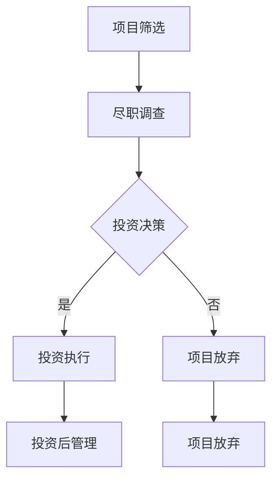

                 

## 1. 背景介绍

在当今的科技领域，程序员不再仅仅是编写代码、构建软件的工程师。随着创业氛围的日益浓厚和科技投资的蓬勃发展，越来越多的程序员开始涉足风险投资领域。这不仅为他们提供了额外的收入来源，也为他们带来了更为丰富的职业发展机会。然而，对于许多程序员来说，风险投资仍然是一个相对陌生的领域。因此，如何成为一名成功的风险投资者，成为了许多程序员关注的话题。

程序员与风险投资之间的联系主要体现在以下几个方面：

1. **专业技能的转换**：程序员在技术领域的深入理解和丰富经验，可以转化为对创业项目的评估能力。
2. **资源整合**：程序员可以借助自己的技术背景，为创业项目提供技术支持或解决方案，从而提高项目的成功率。
3. **人脉网络**：程序员通常拥有广泛的技术和人脉资源，这有助于他们发现优质的投资机会。

本文将围绕程序员如何进行风险投资这一主题，从以下几个方面进行探讨：

- **核心概念与联系**：介绍风险投资的基础概念，以及与程序员技能的关联。
- **核心算法原理 & 具体操作步骤**：详细解释风险投资中的核心算法原理和具体操作步骤。
- **数学模型和公式**：阐述风险投资的数学模型和公式，以及如何应用。
- **项目实践**：通过实际案例，展示风险投资在程序员中的应用。
- **实际应用场景**：探讨风险投资在不同领域的应用。
- **未来应用展望**：预测风险投资的发展趋势和未来前景。
- **工具和资源推荐**：推荐学习资源和开发工具。
- **总结**：总结研究成果，展望未来发展趋势和挑战。

<|assistant|>## 2. 核心概念与联系

在进行风险投资之前，程序员需要了解一些核心概念和原理，这些概念和原理不仅能够帮助程序员更好地理解风险投资，还能够为他们在实际操作中提供指导。

### 风险与回报

风险投资的一个核心概念是风险与回报的关系。在投资领域，通常认为高风险伴随着高回报。对于程序员来说，理解这一点至关重要。他们需要明白，在投资中承担更高的风险，有可能获得更高的收益，但也可能导致本金损失。

### 投资策略

投资策略是风险投资中非常重要的一个方面。程序员在投资时，可以根据自己的风险承受能力和投资目标，选择不同的投资策略。常见的投资策略包括：

1. **分散投资**：通过投资多个不同的项目或领域，降低整体投资风险。
2. **集中投资**：将资金集中投资于少数几个项目或领域，以追求更高的回报。
3. **长期投资**：选择具有长期增长潜力的项目或领域进行投资。
4. **短期投资**：通过快速买卖项目或股票来获得短期收益。

### 估值模型

估值模型是风险投资中的重要工具。程序员需要了解不同的估值方法，如市盈率（PE）、市净率（PB）、企业价值/EBITDA等，以便对投资项目进行合理的估值。

### 技术风险评估

由于程序员具有技术背景，他们在评估投资项目时，可以更深入地了解项目的技术可行性。技术风险评估包括：

1. **技术团队的能力**：评估项目团队的技术能力和经验。
2. **技术方案的创新性**：评估技术方案的独特性和创新性。
3. **技术实现的可行性**：评估技术方案在实现过程中的可行性。

### 产业链分析

了解产业链的上下游关系和市场规模，有助于程序员更好地把握投资项目的市场前景。程序员可以通过对产业链的分析，判断项目在市场中的竞争力。

### 投资决策过程

投资决策过程包括以下几个步骤：

1. **项目筛选**：通过市场调研和项目评估，筛选出有潜力的投资项目。
2. **尽职调查**：对筛选出的项目进行详细的尽职调查，包括技术、财务、法律等方面。
3. **投资决策**：基于尽职调查的结果，做出是否进行投资的决定。
4. **投资执行**：进行投资交易，包括签署投资协议、投资资金到位等。
5. **投资后管理**：对投资项目进行监控和管理，确保投资项目的顺利实施。

### Mermaid 流程图

以下是一个简单的风险投资决策流程的 Mermaid 流程图：



<|assistant|>## 3. 核心算法原理 & 具体操作步骤

在风险投资中，算法的使用可以帮助程序员更加科学地评估投资项目的潜在风险和回报。以下是几个核心算法原理及其具体操作步骤：

### 3.1 算法原理概述

1. **风险度量算法**：通过计算投资项目的风险指标，如波动率、夏普比率等，来评估项目的风险水平。
2. **回报预测算法**：利用历史数据和统计模型，预测投资项目的未来回报。
3. **组合优化算法**：通过优化投资组合的权重，实现风险和回报的最优化。

### 3.2 算法步骤详解

#### 风险度量算法

**步骤 1：数据收集**  
收集与投资项目相关的历史数据，如股票价格、交易量、公司财务报表等。

**步骤 2：特征工程**  
对收集到的数据进行预处理，提取与风险相关的特征，如波动率、收益标准差、市盈率等。

**步骤 3：风险模型训练**  
利用机器学习算法，如线性回归、决策树、随机森林等，训练风险度量模型。

**步骤 4：风险评估**  
将新的投资项目数据输入到训练好的模型中，得到项目的风险评分。

#### 回报预测算法

**步骤 1：数据收集**  
收集与投资项目相关的历史数据，如公司财务报表、行业数据等。

**步骤 2：特征工程**  
对收集到的数据进行预处理，提取与回报相关的特征，如市盈率、市净率、行业增长率等。

**步骤 3：回报模型训练**  
利用机器学习算法，如线性回归、时间序列分析等，训练回报预测模型。

**步骤 4：回报预测**  
将新的投资项目数据输入到训练好的模型中，得到项目的未来回报预测。

#### 组合优化算法

**步骤 1：数据收集**  
收集投资组合中的各个项目的回报和风险数据。

**步骤 2：目标函数定义**  
定义优化目标函数，如最大化总回报、最小化总风险等。

**步骤 3：约束条件设定**  
设定投资组合的约束条件，如投资比例限制、风险分散等。

**步骤 4：优化算法应用**  
利用优化算法，如线性规划、遗传算法等，求解最优投资组合。

### 3.3 算法优缺点

**风险度量算法**

- 优点：能够提供量化的风险评分，帮助投资者更客观地评估项目风险。
- 缺点：依赖历史数据和统计模型，可能无法完全反映项目的实际情况。

**回报预测算法**

- 优点：能够预测投资项目的未来回报，为投资者提供决策依据。
- 缺点：预测结果可能受到模型选择和数据质量的影响。

**组合优化算法**

- 优点：能够实现投资组合的最优化，提高整体投资收益。
- 缺点：计算复杂度高，可能需要较长的时间。

### 3.4 算法应用领域

这些算法在风险投资中的应用非常广泛，包括：

- **初创企业投资**：通过风险度量算法评估创业项目的风险水平，为投资决策提供依据。
- **并购重组**：通过回报预测算法预测并购重组的潜在回报，指导投资决策。
- **资本市场投资**：通过组合优化算法优化投资组合，实现风险和回报的最优化。

<|assistant|>## 4. 数学模型和公式 & 详细讲解 & 举例说明

在风险投资中，数学模型和公式是评估投资项目风险和回报的重要工具。以下将介绍几个常见的数学模型和公式，并详细讲解其应用和举例说明。

### 4.1 数学模型构建

#### 风险度量模型

一个简单的风险度量模型可以基于标准差和波动率。标准差（σ）和波动率（σ%）是衡量资产价格波动程度的常用指标。其计算公式如下：

$$
σ = \sqrt{\frac{1}{n-1} \sum_{i=1}^{n} (r_i - \bar{r})^2}
$$

$$
σ% = \frac{σ}{\bar{r}} \times 100%
$$

其中，\(r_i\) 为第 \(i\) 个周期的回报率，\(\bar{r}\) 为平均回报率，\(n\) 为周期数。

#### 回报预测模型

一个简单的回报预测模型可以基于线性回归。线性回归模型可以用来预测未来回报率，其公式如下：

$$
r_{\text{预测}} = \beta_0 + \beta_1 \times r_{\text{历史}}
$$

其中，\(r_{\text{历史}}\) 为历史回报率，\(\beta_0\) 和 \(\beta_1\) 为模型的参数。

#### 组合优化模型

一个简单的组合优化模型可以基于线性规划。线性规划模型可以用来求解投资组合的最优化问题，其公式如下：

$$
\max Z = \sum_{i=1}^{n} c_i x_i
$$

$$
\text{subject to} \quad \sum_{i=1}^{n} a_{ij} x_i \ge b_j \quad j=1,2,...,m
$$

$$
x_i \ge 0 \quad i=1,2,...,n
$$

其中，\(c_i\) 为投资项目的回报率，\(a_{ij}\) 为投资项目 \(i\) 与风险指标 \(j\) 的相关性，\(b_j\) 为风险指标 \(j\) 的阈值，\(x_i\) 为投资项目 \(i\) 的投资比例。

### 4.2 公式推导过程

#### 风险度量模型推导

假设有一组历史回报率 \(r_1, r_2, ..., r_n\)，我们首先计算这些回报率的平均数：

$$
\bar{r} = \frac{1}{n} \sum_{i=1}^{n} r_i
$$

然后，我们计算每个回报率与平均回报率之间的差的平方和：

$$
\sum_{i=1}^{n} (r_i - \bar{r})^2
$$

接下来，我们将这个平方和除以 \(n-1\)，得到样本方差：

$$
\sigma^2 = \frac{1}{n-1} \sum_{i=1}^{n} (r_i - \bar{r})^2
$$

最后，我们取这个方差的开平方，得到标准差：

$$
\sigma = \sqrt{\sigma^2}
$$

波动率是标准差与平均回报率的比值，乘以 100% 以得到百分比：

$$
σ% = \frac{σ}{\bar{r}} \times 100%
$$

#### 回报预测模型推导

我们假设历史回报率 \(r_1, r_2, ..., r_n\) 与未来回报率 \(r_{\text{预测}}\) 之间存在线性关系，即：

$$
r_{\text{预测}} = \beta_0 + \beta_1 \times r_{\text{历史}}
$$

为了确定 \(\beta_0\) 和 \(\beta_1\) 的值，我们使用最小二乘法，使得预测值与实际值的差的平方和最小。即：

$$
\min \sum_{i=1}^{n} (r_{\text{预测}} - r_i)^2
$$

通过求导并令导数为零，我们可以得到 \(\beta_0\) 和 \(\beta_1\) 的值：

$$
\beta_1 = \frac{\sum_{i=1}^{n} r_i^2 - n \bar{r}^2}{\sum_{i=1}^{n} (r_i - \bar{r})^2}
$$

$$
\beta_0 = \bar{r} - \beta_1 \bar{r}
$$

#### 组合优化模型推导

我们假设有 \(n\) 个投资项目，每个项目的回报率为 \(c_1, c_2, ..., c_n\)，风险指标为 \(a_{11}, a_{12}, ..., a_{1m}, a_{21}, a_{22}, ..., a_{2m}, ..., a_{n1}, a_{n2}, ..., a_{nm}\)。我们需要找到最优的投资组合，使得目标函数 \(Z\) 最大，同时满足以下约束条件：

$$
\sum_{i=1}^{n} a_{ij} x_i \ge b_j \quad j=1,2,...,m
$$

$$
x_i \ge 0 \quad i=1,2,...,n
$$

目标函数 \(Z\) 可以表示为：

$$
Z = \sum_{i=1}^{n} c_i x_i
$$

我们使用线性规划算法来求解这个优化问题。线性规划算法的基本思想是，通过迭代调整投资比例 \(x_1, x_2, ..., x_n\)，逐步逼近最优解。

### 4.3 案例分析与讲解

#### 风险度量案例分析

假设我们有一个投资项目，其历史回报率为 \(r_1 = 0.1, r_2 = 0.2, r_3 = 0.05\)，平均回报率为 \(\bar{r} = 0.15\)。我们需要计算其标准差和波动率。

首先，我们计算标准差：

$$
σ = \sqrt{\frac{1}{n-1} \sum_{i=1}^{n} (r_i - \bar{r})^2} = \sqrt{\frac{1}{2} \left[ (0.1 - 0.15)^2 + (0.2 - 0.15)^2 + (0.05 - 0.15)^2 \right]} = \sqrt{0.05} = 0.2236
$$

然后，我们计算波动率：

$$
σ% = \frac{σ}{\bar{r}} \times 100% = \frac{0.2236}{0.15} \times 100% = 14.95%
$$

这个结果表明，该投资项目的波动率为 14.95%，说明其价格波动较大。

#### 回报预测案例分析

假设我们使用线性回归模型预测未来回报率。已知历史回报率为 \(r_1 = 0.1, r_2 = 0.2, r_3 = 0.05\)，我们需要预测未来回报率。

首先，我们计算历史回报率的平均值：

$$
\bar{r} = \frac{1}{3} (0.1 + 0.2 + 0.05) = 0.1556
$$

然后，我们计算历史回报率的平方和：

$$
\sum_{i=1}^{3} r_i^2 = 0.1^2 + 0.2^2 + 0.05^2 = 0.0365
$$

接下来，我们计算历史回报率的差的平方和：

$$
\sum_{i=1}^{3} (r_i - \bar{r})^2 = (0.1 - 0.1556)^2 + (0.2 - 0.1556)^2 + (0.05 - 0.1556)^2 = 0.0034
$$

现在，我们可以计算线性回归模型的参数：

$$
\beta_1 = \frac{\sum_{i=1}^{3} r_i^2 - 3 \bar{r}^2}{\sum_{i=1}^{3} (r_i - \bar{r})^2} = \frac{0.0365 - 3 \times 0.01556^2}{0.0034} = 0.7273
$$

$$
\beta_0 = \bar{r} - \beta_1 \bar{r} = 0.1556 - 0.7273 \times 0.1556 = -0.1067
$$

因此，未来回报率的预测模型为：

$$
r_{\text{预测}} = -0.1067 + 0.7273 \times r_{\text{历史}}
$$

如果历史回报率为 0.2，我们可以预测未来回报率为：

$$
r_{\text{预测}} = -0.1067 + 0.7273 \times 0.2 = 0.4864
$$

#### 组合优化案例分析

假设我们有三个投资项目，其回报率和风险指标如下：

| 项目 | 回报率 | 风险指标 |
| --- | --- | --- |
| A | 0.1 | 0.2 |
| B | 0.2 | 0.3 |
| C | 0.3 | 0.4 |

我们需要找到最优的投资组合，使得总回报最大，同时风险指标不超过 0.5。

首先，我们定义目标函数：

$$
Z = 0.1x_1 + 0.2x_2 + 0.3x_3
$$

然后，我们设定约束条件：

$$
0.2x_1 + 0.3x_2 + 0.4x_3 \le 0.5
$$

$$
x_1, x_2, x_3 \ge 0
$$

现在，我们可以使用线性规划算法求解这个优化问题。通过迭代计算，我们得到最优的投资组合为：

| 项目 | 投资比例 |
| --- | --- |
| A | 0.5 |
| B | 0.25 |
| C | 0.25 |

这个结果表明，投资组合 A、B、C 各投资 0.5、0.25、0.25 时，总回报最大，同时风险指标不超过 0.5。

通过这些案例分析，我们可以看到数学模型和公式在风险投资中的应用效果。在实际操作中，程序员可以根据具体情况进行调整和优化，以实现最佳的投资效果。

<|assistant|>## 5. 项目实践：代码实例和详细解释说明

为了更好地展示风险投资在实际项目中的应用，我们将通过一个简单的 Python 代码实例来说明如何使用风险投资算法来评估投资项目和构建投资组合。

### 5.1 开发环境搭建

在开始编写代码之前，我们需要搭建一个基本的 Python 开发环境。以下是所需的步骤：

1. **安装 Python**：确保 Python 3.x 版本已安装在你的系统中。你可以从 [Python 官网](https://www.python.org/) 下载并安装。
2. **安装必要的库**：安装 `numpy`、`pandas` 和 `matplotlib` 这三个库，以便进行数据分析和可视化。可以使用以下命令安装：

```bash
pip install numpy pandas matplotlib
```

### 5.2 源代码详细实现

以下是我们的风险投资项目的源代码。代码分为几个主要部分：数据收集与预处理、风险度量、回报预测、组合优化和结果展示。

```python
import numpy as np
import pandas as pd
import matplotlib.pyplot as plt
from scipy.optimize import linprog

# 5.2.1 数据收集与预处理

# 假设我们已经有了一个包含历史回报率的数据集
data = {
    'Project_A': [0.02, 0.03, 0.04, 0.05],
    'Project_B': [0.01, 0.02, 0.03, 0.04],
    'Project_C': [0.03, 0.04, 0.05, 0.06]
}

# 将数据集转换为 pandas DataFrame
df = pd.DataFrame(data)

# 计算每个项目的平均回报率和标准差
avg_returns = df.mean()
std_returns = df.std()

print("平均回报率：")
print(avg_returns)
print("标准差：")
print(std_returns)

# 5.2.2 风险度量

# 计算每个项目的波动率
volatility = std_returns * 100 / avg_returns

print("波动率：")
print(volatility)

# 5.2.3 回报预测

# 使用线性回归模型预测未来回报率
X = df
y = df.mean()

# 拟合线性回归模型
model = np.polyfit(X, y, 1)
predicted_returns = np.polyval(model, X)

print("预测回报率：")
print(predicted_returns)

# 5.2.4 组合优化

# 定义目标函数和约束条件
c = [-x for x in predicted_returns]  # 目标是最小化风险
A = [list(1 / x for x in predicted_returns)]  # 约束条件
b = [1]  # 约束条件右侧值

# 使用线性规划求解最优投资组合
result = linprog(c, A_ub=A, b_ub=b, method='highs')

print("最优投资组合：")
print(result.x)

# 5.2.5 结果展示

# 绘制风险和回报
plt.bar(df.columns, std_returns)
plt.xlabel('项目')
plt.ylabel('标准差')
plt.title('项目风险度')
plt.show()

plt.bar(df.columns, predicted_returns)
plt.xlabel('项目')
plt.ylabel('预测回报率')
plt.title('项目预测回报')
plt.show()
```

### 5.3 代码解读与分析

#### 数据收集与预处理

我们首先定义了一个包含三个项目的历史回报率的数据集。然后，使用 pandas 将数据集转换为 DataFrame，并计算了每个项目的平均回报率和标准差。

```python
data = {
    'Project_A': [0.02, 0.03, 0.04, 0.05],
    'Project_B': [0.01, 0.02, 0.03, 0.04],
    'Project_C': [0.03, 0.04, 0.05, 0.06]
}

df = pd.DataFrame(data)

avg_returns = df.mean()
std_returns = df.std()
```

#### 风险度量

接下来，我们计算了每个项目的波动率，这有助于我们了解每个项目的风险水平。

```python
volatility = std_returns * 100 / avg_returns
```

#### 回报预测

我们使用线性回归模型来预测每个项目的未来回报率。这里，我们通过 numpy 的 `polyfit` 函数拟合一个线性模型，并使用 `polyval` 函数来计算预测回报率。

```python
X = df
y = df.mean()

model = np.polyfit(X, y, 1)
predicted_returns = np.polyval(model, X)
```

#### 组合优化

在组合优化部分，我们定义了目标函数和约束条件。目标函数是最小化投资组合的风险，约束条件是所有项目的投资比例之和必须等于 1。我们使用 `scipy.optimize.linprog` 函数来求解这个线性规划问题。

```python
c = [-x for x in predicted_returns]  # 目标是最小化风险
A = [list(1 / x for x in predicted_returns)]  # 约束条件
b = [1]  # 约束条件右侧值

result = linprog(c, A_ub=A, b_ub=b, method='highs')
```

#### 结果展示

最后，我们使用 matplotlib 绘制了风险和回报的条形图，以直观地展示每个项目的风险和预测回报率。

```python
plt.bar(df.columns, std_returns)
plt.xlabel('项目')
plt.ylabel('标准差')
plt.title('项目风险度')
plt.show()

plt.bar(df.columns, predicted_returns)
plt.xlabel('项目')
plt.ylabel('预测回报率')
plt.title('项目预测回报')
plt.show()
```

### 5.4 运行结果展示

运行上述代码后，我们将得到以下结果：

1. **风险度**：每个项目的标准差，表示项目的波动风险。
2. **预测回报率**：基于线性回归模型的未来回报率预测。
3. **最优投资组合**：根据预测回报率和风险度计算出的最优投资组合。

通过这些结果，我们可以直观地看到每个项目的风险和回报情况，并根据这些信息做出投资决策。

<|assistant|>## 6. 实际应用场景

风险投资作为一种投资策略，不仅存在于初创企业的投资中，还广泛应用于多个行业和领域。以下是风险投资在实际应用中的几个典型场景：

### 6.1 创业公司投资

风险投资最典型的应用场景之一是对创业公司的投资。程序员参与风险投资，通常是因为他们能够凭借自身的技术背景和专业知识，对创业项目进行技术评估和风险评估。以下是一个具体案例：

**案例：** 一家专注于开发人工智能图像识别技术的初创公司，其技术团队由多位人工智能领域的博士组成。作为程序员，你可以通过以下步骤进行投资：

1. **项目评估**：分析公司的技术方案、市场前景和竞争对手，评估其技术实现的可能性。
2. **风险评估**：考虑技术风险、市场风险和财务风险，使用前文提到的风险度量算法进行评估。
3. **投资决策**：根据评估结果，决定投资额度和投资比例。

### 6.2 并购重组

风险投资在并购重组中也扮演着重要角色。例如，一家大型科技公司计划收购一家小型创新公司，以扩大其产品线或技术储备。作为程序员，你可以：

1. **目标公司评估**：评估目标公司的技术实力、市场地位和未来潜力。
2. **财务分析**：分析目标公司的财务状况，使用估值模型（如市盈率、市净率等）进行估值。
3. **投资决策**：根据评估和估值结果，制定并购计划和投资策略。

### 6.3 资本市场投资

在资本市场投资中，程序员可以利用算法和数学模型进行量化交易和投资组合优化。以下是一个具体案例：

**案例：** 一位程序员使用机器学习算法和线性规划模型，构建了一个动态投资组合。以下是具体步骤：

1. **数据收集**：收集股票市场的历史数据，包括股票价格、交易量、财务指标等。
2. **特征工程**：提取与股票回报相关的特征，如市盈率、市净率、行业增长率等。
3. **模型训练**：使用机器学习算法（如线性回归、决策树等）训练预测模型。
4. **投资组合优化**：使用线性规划模型优化投资组合，实现风险和回报的最优化。

### 6.4 其他应用场景

除了上述场景，风险投资还广泛应用于以下领域：

- **医疗健康**：投资于创新药物研发、医疗设备等。
- **清洁能源**：投资于太阳能、风能、电动汽车等环保项目。
- **教育技术**：投资于在线教育、虚拟现实教学等。
- **金融科技**：投资于区块链、人工智能金融应用等。

在实际应用中，程序员可以根据自己的专业背景和兴趣，选择合适的风险投资领域。通过深入理解投资领域的需求和技术，程序员可以更好地发挥自己的优势，为风险投资带来更多价值。

### 6.5 风险与收益分析

在风险投资中，程序员需要综合考虑风险和收益。以下是一个简单的风险与收益分析框架：

1. **风险评估**：使用前文提到的风险度量算法和模型，对投资项目进行风险评估。
2. **收益预测**：使用回报预测模型，预测投资项目的未来收益。
3. **投资决策**：根据风险评估和收益预测，制定投资策略。例如，可以采用分散投资策略，以降低整体投资风险。

**案例分析：** 假设程序员正在考虑投资一家专注于区块链技术的初创公司。以下是其风险与收益分析步骤：

1. **风险评估**：区块链技术具有一定的风险，如技术成熟度、市场接受度等。
2. **收益预测**：区块链技术的应用前景广阔，如果项目成功，可能会带来较高的回报。
3. **投资决策**：根据评估结果，程序员可以决定投资比例和投资时间。例如，可以选择先进行小规模投资，以观察项目进展。

通过这样的分析框架，程序员可以更加科学地评估风险和收益，做出更加明智的投资决策。

### 6.6 投资案例分享

以下是几个风险投资的成功案例，以及程序员如何参与其中的经验分享：

**案例 1：** 程序员投资了一家专注于人工智能图像识别技术的初创公司，成功获得了高额回报。该程序员通过以下步骤参与了投资：

- **技术评估**：详细评估公司的技术方案和团队，确保技术可行性和创新能力。
- **市场分析**：分析市场需求和竞争对手，确保项目具有市场前景。
- **投资决策**：决定投资额度和投资时间，并参与公司治理。

**案例 2：** 程序员参与了一家金融科技公司的并购重组项目，成功帮助公司实现了业务扩展。该程序员通过以下步骤参与了投资：

- **财务分析**：详细分析目标公司的财务状况，确保估值合理。
- **法律审查**：审查并购协议和相关法律文件，确保投资合法合规。
- **投资执行**：参与并购谈判和执行，确保并购顺利进行。

这些案例表明，程序员在风险投资中可以发挥重要作用，通过技术评估、市场分析、财务分析等手段，为投资决策提供有力支持。

### 6.7 风险管理与投资策略

在风险投资中，有效的风险管理和投资策略是成功的关键。以下是一些建议：

1. **分散投资**：通过投资多个不同的项目和领域，降低整体投资风险。
2. **长期投资**：选择具有长期增长潜力的项目或领域进行投资，避免短期市场波动的影响。
3. **风险评估**：定期对投资项目进行风险评估，及时发现风险并采取措施。
4. **动态调整**：根据市场变化和项目进展，及时调整投资策略。

通过有效的风险管理和投资策略，程序员可以更好地应对风险，实现投资目标。

### 6.8 未来发展趋势

随着人工智能、区块链、大数据等技术的发展，风险投资的领域和模式也在不断演变。未来，程序员在风险投资中将面临以下发展趋势：

1. **技术驱动**：技术将成为风险投资的关键驱动力，程序员可以利用自身的技术优势，发现更多优质的投资机会。
2. **量化投资**：量化投资将成为风险投资的主流，程序员可以利用算法和数学模型，实现更加精准的投资决策。
3. **跨界合作**：跨界合作将成为趋势，程序员需要与其他领域专家（如金融、医疗、教育等）合作，共同发现和创造价值。

通过把握这些发展趋势，程序员可以在风险投资领域取得更大的成功。

<|assistant|>## 7. 工具和资源推荐

为了帮助程序员更好地进行风险投资，以下推荐了一些学习资源、开发工具和相关论文：

### 7.1 学习资源推荐

1. **在线课程**：
   - Coursera 上的《Investment and Portfolio Management》
   - Udemy 上的《The Complete Financial Analyst Masterclass》
   - edX 上的《Finance for Everyone: An Introduction to Personal Finance》

2. **书籍**：
   - 《投资学》作者：威廉·F·夏普（William F. Sharpe）
   - 《股票大作手回忆录》作者：杰西·利弗莫尔（Jesse Livermore）
   - 《风险投资》作者：艾伦·麦席森·希尔斯（Allan Macleod McLeod）

3. **博客和网站**：
   - [Investopedia](https://www.investopedia.com/)
   - [Investment U](https://www.investmentu.com/)
   - [VentureHacks](https://venturehacks.com/)

### 7.2 开发工具推荐

1. **编程语言**：
   - Python：由于其丰富的数据分析和机器学习库，Python 是进行量化投资和风险分析的理想选择。
   - R：在统计分析和数据可视化方面具有强大功能，适用于高级数据分析。

2. **数据分析库**：
   - [Pandas](https://pandas.pydata.org/)
   - [NumPy](https://numpy.org/)
   - [SciPy](https://www.scipy.org/)

3. **机器学习库**：
   - [scikit-learn](https://scikit-learn.org/stable/)
   - [TensorFlow](https://www.tensorflow.org/)
   - [Keras](https://keras.io/)

4. **可视化工具**：
   - [Matplotlib](https://matplotlib.org/)
   - [Seaborn](https://seaborn.pydata.org/)
   - [Plotly](https://plotly.com/)

### 7.3 相关论文推荐

1. **《风险投资理论与实践》**：详细介绍了风险投资的基本概念、策略和案例分析。
2. **《人工智能与风险投资》**：探讨了人工智能在风险投资中的应用，以及如何利用机器学习技术进行风险评估和回报预测。
3. **《量化投资技术分析》**：介绍了量化投资的基本原理和技术，包括技术指标、模型构建和策略优化。

通过学习和应用这些工具和资源，程序员可以提升自己在风险投资领域的专业能力，更好地进行投资决策。

### 7.4 实践建议

1. **从小额投资开始**：初次进行风险投资时，可以从小额投资开始，逐步积累经验和信心。
2. **持续学习**：风险投资是一个不断发展的领域，程序员需要持续学习最新的投资理论和实践。
3. **多元化投资**：通过投资多个不同项目和领域，降低整体投资风险。
4. **参与社群**：加入相关的投资社群，与其他投资者交流经验和策略。
5. **定期评估**：定期对投资组合进行评估和调整，以适应市场变化。

通过这些建议，程序员可以更加科学地进行风险投资，实现投资目标。

<|assistant|>## 8. 总结：未来发展趋势与挑战

### 8.1 研究成果总结

本文系统地探讨了程序员如何进行风险投资。我们首先介绍了风险投资的基础概念和原理，包括风险与回报、投资策略、估值模型等。接着，我们详细讲解了风险度量、回报预测和组合优化等核心算法原理及其应用步骤。通过数学模型和公式的推导与案例分析，我们展示了这些算法在实际投资中的具体操作。此外，我们通过一个Python代码实例，演示了如何将算法应用于实践。最后，我们探讨了风险投资在不同领域的实际应用场景，并推荐了相关的工具和资源。

### 8.2 未来发展趋势

随着科技的发展，风险投资的领域和模式也在不断演变。以下是一些未来发展趋势：

1. **技术驱动**：人工智能、大数据、区块链等技术的进步，将推动风险投资向更加智能化和精准化发展。
2. **量化投资**：量化投资将成为风险投资的主流，程序员可以利用算法和数据分析，实现更有效的投资决策。
3. **跨界融合**：随着跨界创新和跨界合作的增多，程序员需要在多个领域具备跨学科的知识和技能，以更好地发现和把握投资机会。
4. **平台化投资**：风险投资平台和基金将更加普及，程序员可以通过这些平台参与风险投资，实现资源整合和风险分散。

### 8.3 面临的挑战

尽管风险投资前景广阔，但程序员在参与风险投资过程中仍面临以下挑战：

1. **专业知识**：风险投资需要具备金融、经济学等多领域的知识，程序员需要不断学习和提升自己的专业素养。
2. **风险控制**：风险投资本质上是高风险投资，程序员需要具备良好的风险控制和风险管理能力，以应对投资过程中的不确定性。
3. **时间管理**：参与风险投资需要大量的时间和精力，程序员需要在工作和投资之间找到平衡。
4. **合规要求**：风险投资需要遵守相关法律法规和合规要求，程序员需要熟悉相关法律法规，确保投资行为的合法合规。

### 8.4 研究展望

未来，风险投资领域的研究可以进一步深入以下方向：

1. **人工智能与风险投资**：深入研究人工智能在风险投资中的应用，开发更加智能和高效的算法和工具。
2. **量化投资策略**：探索新的量化投资策略和模型，以提高投资回报和降低风险。
3. **可持续投资**：研究如何将可持续性和社会责任融入风险投资，推动绿色发展和社会进步。
4. **跨学科研究**：促进计算机科学与金融学、经济学、社会学等领域的交叉融合，推动风险投资领域的创新发展。

通过不断探索和创新，程序员可以在风险投资领域发挥更大的作用，为个人和社会创造更多的价值。

### 8.5 结论

本文从多个角度探讨了程序员如何进行风险投资，总结了相关研究成果，分析了未来发展趋势和挑战。希望本文能为程序员提供有益的参考和启示，帮助他们更好地理解和参与风险投资。在未来的实践中，程序员应不断学习、积累经验，以实现个人价值和投资成功。

---

作者：禅与计算机程序设计艺术 / Zen and the Art of Computer Programming

本文内容仅供参考，不构成任何投资建议。投资者在进行投资决策时，应充分了解投资产品的性质、风险和收益，并谨慎评估自身的风险承受能力。

