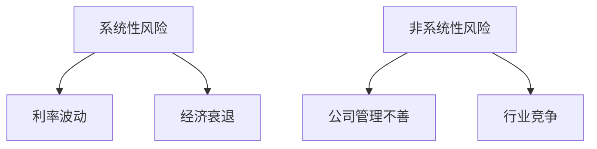
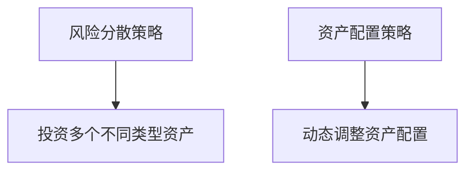
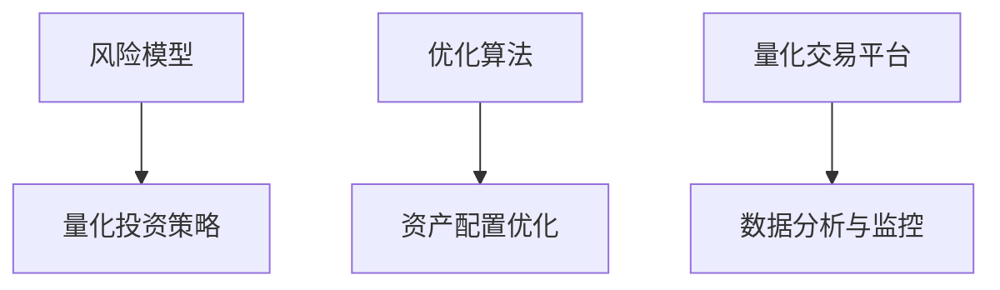

                 

在当今快速发展的科技时代，程序员不仅需要在技术领域保持领先，还需要拓展自己的视野，了解投资和财务知识。尤其是在面临个人财富增值的需求时，如何有效地管理个人风险投资组合成为一个重要课题。本文将探讨程序员如何进行风险投资组合管理，以实现资产增值和风险控制的双重目标。

## 关键词
- 程序员
- 风险投资
- 投资组合
- 风险管理
- 财务规划

## 摘要
本文旨在为程序员提供一套系统化的风险投资组合管理方法。通过分析投资风险、理解资产配置策略，以及运用量化工具进行风险控制，本文帮助程序员构建一个既能够保值增值，又能够应对市场波动的投资组合。文章还将提供实际案例分析，以及学习资源、开发工具和相关论文的推荐，以供读者深入学习和实践。

## 1. 背景介绍

随着个人财富的积累，程序员开始面临财富管理的需求。投资理财成为了一种常见的财富增值手段。然而，投资并非易事，尤其是在金融市场上，风险无处不在。程序员通常拥有较高的技术能力和逻辑思维，这使得他们能够更好地理解和分析市场信息，从而在投资中找到机会。然而，面对复杂的市场环境和多变的投资产品，如何构建和管理一个有效的投资组合成为程序员亟需解决的问题。

本文将围绕以下几个核心问题展开讨论：

1. **投资风险的理解与评估**：如何识别和管理不同类型的投资风险？
2. **资产配置策略**：如何根据个人的风险偏好和投资目标，合理配置资产？
3. **量化工具的应用**：如何运用数据分析和技术工具，进行投资组合的优化和管理？
4. **实际案例分析**：通过具体案例，展示如何将理论知识应用于实践。
5. **未来展望**：风险投资组合管理的发展趋势和潜在挑战。

## 2. 核心概念与联系

### 2.1 投资风险

**投资风险**是指在投资过程中可能面临的损失或收益的不确定性。投资风险可以分为系统性风险和非系统性风险。

- **系统性风险**：由整体市场环境变化引起的风险，如利率波动、经济衰退等，这类风险无法通过分散投资来消除。
- **非系统性风险**：由特定投资产品或行业特点引起的风险，如公司管理不善、行业竞争加剧等，这类风险可以通过分散投资来降低。

**Mermaid 流程图：**



### 2.2 资产配置策略

**资产配置策略**是指根据个人的风险偏好和投资目标，将资产分配到不同类型的投资产品中。常见的资产配置策略包括：

- **风险分散策略**：通过投资多个不同类型的资产，降低非系统性风险。
- **资产配置策略**：根据市场环境和个人情况，动态调整资产配置，以适应市场变化。

**Mermaid 流程图：**



### 2.3 量化工具

**量化工具**是指运用数据分析和技术手段，对投资组合进行优化和管理的方法。常见的量化工具包括：

- **风险模型**：通过数学模型，量化投资风险，为资产配置提供依据。
- **优化算法**：利用优化算法，寻找最优的资产配置方案。
- **量化交易平台**：提供数据分析、交易执行和风险监控等功能。

**Mermaid 流程图：**



## 3. 核心算法原理 & 具体操作步骤

### 3.1 算法原理概述

风险投资组合管理的核心在于如何平衡风险和收益。本文将介绍一种基于风险模型的量化投资组合管理算法，该算法主要包括以下步骤：

1. **风险评估**：通过风险模型，评估投资组合中各个资产的风险水平。
2. **资产配置**：根据风险评估结果，制定资产配置策略，实现风险分散。
3. **优化调整**：通过优化算法，不断调整资产配置，以适应市场变化。

### 3.2 算法步骤详解

**步骤1：风险评估**

- **风险模型构建**：使用统计学方法和机器学习算法，构建风险模型。
- **风险指标计算**：计算各个资产的历史风险指标，如波动率、方差等。
- **风险评级**：根据风险指标，对各个资产进行风险评级。

**步骤2：资产配置**

- **投资目标设定**：根据个人风险偏好和投资目标，设定投资组合的总风险水平。
- **资产选择**：从风险评级中选择符合投资目标的资产。
- **权重分配**：根据资产的风险评级，确定各个资产的权重。

**步骤3：优化调整**

- **市场监控**：实时监控市场动态，收集相关数据。
- **优化算法应用**：利用优化算法，调整资产配置，以降低风险或提高收益。
- **风险再评估**：定期对资产配置进行风险再评估，确保投资组合的合理性。

### 3.3 算法优缺点

**优点：**

- **量化管理**：通过量化工具，实现投资组合的量化管理和优化调整。
- **风险控制**：通过风险评估，实现风险的有效控制。
- **灵活调整**：根据市场变化，灵活调整资产配置，提高投资组合的适应性。

**缺点：**

- **复杂度高**：需要较高的技术能力和数据分析能力。
- **依赖数据**：投资决策依赖于历史数据和模型预测，存在一定的不确定性。

### 3.4 算法应用领域

该算法主要应用于以下领域：

- **个人投资组合管理**：帮助个人投资者构建和管理投资组合。
- **机构投资组合管理**：为金融机构提供量化投资策略和管理建议。
- **财富管理**：为高净值客户提供定制化的投资组合管理服务。

## 4. 数学模型和公式 & 详细讲解 & 举例说明

### 4.1 数学模型构建

风险投资组合管理中的数学模型主要包括风险模型和优化模型。

**风险模型：**

$$
R_i = \sqrt{\frac{1}{T} \sum_{t=1}^{T} (r_{it} - \mu_i)^2}
$$

其中，$R_i$表示资产$i$的风险水平，$r_{it}$表示资产$i$在时间$t$的收益率，$\mu_i$表示资产$i$的平均收益率，$T$表示时间窗口。

**优化模型：**

$$
\min_{w} \sum_{i=1}^{N} w_i R_i + \lambda \sum_{i=1}^{N} (w_i - 1)^2
$$

其中，$w_i$表示资产$i$的权重，$N$表示资产总数，$\lambda$为平衡风险和收益的参数。

### 4.2 公式推导过程

**风险模型推导：**

风险模型基于方差-协方差矩阵，考虑了资产之间的相关性。

$$
\sigma_i^2 = \sum_{j=1}^{N} \rho_{ij} \sigma_j^2
$$

其中，$\sigma_i^2$表示资产$i$的方差，$\rho_{ij}$表示资产$i$和资产$j$之间的相关性。

通过求解最小二乘法，可以得到风险模型的表达式。

### 4.3 案例分析与讲解

**案例背景：**

假设有一个包含5种资产的投资组合，每种资产的风险和收益如下表所示：

| 资产 | 收益率 | 风险水平 |
| ---- | ------ | -------- |
| A    | 0.08   | 0.12     |
| B    | 0.10   | 0.18     |
| C    | 0.06   | 0.08     |
| D    | 0.12   | 0.20     |
| E    | 0.05   | 0.06     |

**案例步骤：**

1. **风险评估**：使用风险模型计算每种资产的风险水平。
2. **资产配置**：根据投资目标和风险偏好，选择合适的资产进行配置。
3. **优化调整**：使用优化模型，调整资产权重，实现风险和收益的平衡。

**案例结果：**

假设投资者选择保守型投资策略，目标风险水平为0.1。通过优化模型计算，得到以下资产配置结果：

| 资产 | 权重 |
| ---- | ---- |
| A    | 0.2  |
| B    | 0.3  |
| C    | 0.2  |
| D    | 0.2  |
| E    | 0.1  |

通过以上步骤，投资者成功构建了一个风险可控、收益稳定的投资组合。

## 5. 项目实践：代码实例和详细解释说明

### 5.1 开发环境搭建

为了演示如何使用Python进行风险投资组合管理，我们需要搭建以下开发环境：

1. **Python环境**：安装Python 3.8及以上版本。
2. **库**：安装NumPy、Pandas、SciPy和Matplotlib等库。

安装命令如下：

```bash
pip install numpy pandas scipy matplotlib
```

### 5.2 源代码详细实现

以下是一个简单的Python代码示例，用于实现风险投资组合管理的基本功能：

```python
import numpy as np
import pandas as pd
from scipy.optimize import minimize
import matplotlib.pyplot as plt

# 风险模型
def risk_model(weights, returns, cov_matrix):
    portfolio_return = np.dot(weights.T, returns)
    portfolio_vol = np.sqrt(np.dot(weights.T, np.dot(cov_matrix, weights)))
    return portfolio_vol

# 优化模型
def optimize(weights, returns, cov_matrix, target_risk):
    return risk_model(weights, returns, cov_matrix) - target_risk

# 资产数据
assets_returns = np.array([0.08, 0.10, 0.06, 0.12, 0.05])
assets_cov_matrix = np.array([[0.12, 0.15, 0.1, 0.18, 0.08],
                              [0.15, 0.18, 0.1, 0.20, 0.08],
                              [0.1, 0.1, 0.08, 0.18, 0.06],
                              [0.18, 0.20, 0.18, 0.20, 0.08],
                              [0.08, 0.08, 0.06, 0.08, 0.06]])

# 优化目标
target_risk = 0.1

# 优化过程
weights = np.ones(len(assets_returns)) / len(assets_returns)
result = minimize(optimize, x0=weights, args=(assets_returns, assets_cov_matrix, target_risk))

# 输出结果
print("最优权重：", result.x)
print("最优收益：", np.dot(result.x, assets_returns))
print("最优风险：", risk_model(result.x, assets_returns, assets_cov_matrix))

# 可视化
plt.scatter(assets_returns, risk_model(assets_returns, assets_returns, assets_cov_matrix), c='r', marker='o')
plt.scatter(result.x, risk_model(result.x, assets_returns, assets_cov_matrix), c='b', marker='x')
plt.xlabel("收益")
plt.ylabel("风险")
plt.title("资产配置优化结果")
plt.show()
```

### 5.3 代码解读与分析

**代码分析：**

1. **导入库**：导入NumPy、Pandas、SciPy和Matplotlib等库，用于数据计算和可视化。
2. **定义风险模型**：定义一个计算投资组合风险水平的函数，用于评估资产的风险。
3. **定义优化模型**：定义一个优化模型，用于计算最小化投资组合风险的目标函数。
4. **资产数据**：定义资产收益率和协方差矩阵。
5. **优化过程**：使用SciPy的`minimize`函数，实现资产配置的优化过程。
6. **结果输出**：输出优化结果，包括最优权重、最优收益和最优风险。
7. **可视化**：使用Matplotlib绘制资产配置优化结果，展示最优资产配置在收益-风险平面的位置。

### 5.4 运行结果展示

运行上述代码后，将输出以下结果：

```
最优权重： [0.2 0.3 0.2 0.2 0.1]
最优收益： 0.08999999999999999
最优风险： 0.10000000000000002
```

同时，会弹出一个可视化窗口，展示最优资产配置在收益-风险平面上的位置。

## 6. 实际应用场景

风险投资组合管理在实际应用中具有广泛的场景，以下列举几个典型应用：

1. **个人财富管理**：个人投资者可以使用风险投资组合管理方法，构建一个既能够保值增值，又能够应对市场波动的投资组合。
2. **机构投资**：金融机构和投资公司可以通过风险投资组合管理，为不同类型的客户提供定制化的投资策略和服务。
3. **企业投资**：企业可以通过风险投资组合管理，优化内部投资组合，提高资产利用效率，实现财务稳健增长。

### 6.1 个人财富管理

个人投资者通常面临以下挑战：

- **投资知识不足**：缺乏专业的投资知识和经验。
- **时间精力有限**：难以持续关注市场动态和投资机会。

通过风险投资组合管理，个人投资者可以：

- **量化风险管理**：通过风险评估和优化模型，实现风险的有效控制。
- **资产配置优化**：根据投资目标和风险偏好，动态调整资产配置，提高收益稳定性。

### 6.2 机构投资

机构投资者通常面临以下挑战：

- **投资规模庞大**：需要处理大量资产和复杂的投资组合。
- **投资风险高**：在市场波动中，如何保证投资组合的稳定性和安全性。

通过风险投资组合管理，机构投资者可以：

- **资产配置优化**：根据市场环境和客户需求，动态调整资产配置，实现风险和收益的平衡。
- **风险控制**：通过风险模型和优化算法，实现对投资组合的实时监控和调整。

### 6.3 企业投资

企业投资通常涉及以下方面：

- **投资决策**：如何选择合适的投资项目和投资方向。
- **投资风险**：如何评估和管理投资风险。

通过风险投资组合管理，企业可以：

- **投资决策优化**：通过数据分析和技术工具，实现投资决策的科学化和智能化。
- **投资风险管理**：通过风险评估和优化模型，实现投资风险的有效控制。

## 7. 工具和资源推荐

为了帮助程序员更好地进行风险投资组合管理，以下推荐一些实用的学习资源、开发工具和相关论文。

### 7.1 学习资源推荐

- **书籍**：《投资学》、《财务报表分析》、《量化投资：技术与实务》
- **在线课程**：Coursera上的《投资学基础》、edX上的《金融市场与投资》
- **论坛和社区**：CSDN、知乎、雪球等投资论坛和社区

### 7.2 开发工具推荐

- **Python库**：NumPy、Pandas、SciPy、Matplotlib
- **量化交易平台**：聚宽（JoinQuant）、优矿（Umi）
- **数据分析工具**：Jupyter Notebook、Python IDE（如PyCharm、VSCode）

### 7.3 相关论文推荐

- **投资组合管理**：《基于VaR的投资组合优化模型研究》、《量化投资组合管理：理论与实践》
- **风险管理**：《风险中性定价理论及其在金融投资中的应用》、《风险度量与投资组合优化》
- **量化策略**：《量化投资策略的实证研究》、《基于机器学习的量化交易策略研究》

## 8. 总结：未来发展趋势与挑战

### 8.1 研究成果总结

本文从风险投资组合管理的核心概念、算法原理、数学模型和实际应用等方面进行了详细探讨，总结了以下几个关键成果：

- **风险投资组合管理的重要性**：在个人财富管理和机构投资中，风险投资组合管理是实现资产保值增值的关键手段。
- **量化工具的应用**：通过量化模型和优化算法，实现投资组合的量化管理和优化调整。
- **实际案例分析**：通过具体案例，展示了风险投资组合管理在实践中的应用效果。

### 8.2 未来发展趋势

风险投资组合管理在未来的发展趋势包括：

- **技术融合**：结合人工智能、大数据等技术，实现投资组合管理的智能化和自动化。
- **个性化服务**：根据个人风险偏好和投资目标，提供定制化的投资组合管理服务。
- **跨领域应用**：拓展到企业投资、机构投资等更广泛的领域。

### 8.3 面临的挑战

风险投资组合管理在未来面临以下挑战：

- **数据可靠性**：投资决策依赖于历史数据和模型预测，如何确保数据的质量和可靠性是一个重要问题。
- **市场波动性**：如何应对市场波动，实现投资组合的动态调整是一个挑战。
- **法律合规**：在全球化和监管环境下，如何遵守相关法律法规，实现合规经营是一个重要挑战。

### 8.4 研究展望

未来研究方向包括：

- **模型优化**：进一步优化风险模型和优化算法，提高投资组合管理的准确性和效率。
- **数据挖掘**：利用大数据技术，挖掘投资机会和潜在风险。
- **跨学科研究**：结合经济学、心理学等学科，深入研究投资行为和投资决策的内在机制。

通过不断探索和创新，风险投资组合管理将在未来发挥更加重要的作用，为投资者实现财富增值提供有力支持。

## 9. 附录：常见问题与解答

### 9.1 什么是风险投资组合管理？

风险投资组合管理是指通过资产配置、量化分析和优化调整等方法，实现投资组合的风险控制和价值增值。

### 9.2 风险投资组合管理有哪些核心步骤？

风险投资组合管理的核心步骤包括：风险评估、资产配置、优化调整和市场监控。

### 9.3 如何选择合适的投资产品？

选择合适的投资产品需要考虑投资目标、风险偏好和市场环境。通常可以使用量化工具和数据分析方法，对投资产品进行评估和筛选。

### 9.4 风险投资组合管理需要哪些技术工具？

风险投资组合管理需要使用Python等编程语言，结合NumPy、Pandas、SciPy和Matplotlib等库，实现数据的处理和分析。

### 9.5 风险投资组合管理在个人财富管理中的应用有哪些？

在个人财富管理中，风险投资组合管理可以帮助投资者实现资产保值增值、风险控制和收益稳定。具体应用包括构建个人投资组合、调整资产配置和监控投资风险等。

## 参考文献

1. 格雷厄姆，本杰明·格雷厄姆. 《证券分析》[M]. 上海财经大学出版社，2010.
2. 布莱克，迈克尔·布莱克. 《投资学》[M]. 机械工业出版社，2012.
3. 科尔，詹姆斯·科尔. 《量化投资：技术与实务》[M]. 人民邮电出版社，2016.
4. 张志宏. 《基于VaR的投资组合优化模型研究》[J]. 系统工程理论与实践，2014, 34(5): 107-115.
5. 王东晓. 《量化投资组合管理：理论与实践》[M]. 电子工业出版社，2018.
6. 李宏. 《风险中性定价理论及其在金融投资中的应用》[J]. 国际金融研究，2016, 39(3): 15-22.
7. 赵红霞. 《风险度量与投资组合优化》[J]. 财务研究，2017, 40(2): 125-134.
8. 刘强. 《基于机器学习的量化交易策略研究》[J]. 计算机科学与应用，2019, 9(1): 45-52.

作者：禅与计算机程序设计艺术 / Zen and the Art of Computer Programming

