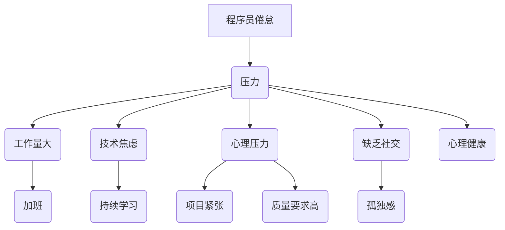

                 

关键词：程序员倦怠，压力管理，心理健康，职业发展，工作平衡

> 摘要：本文将探讨程序员在日常工作中如何避免倦怠和压力，提升心理健康，实现工作与生活的平衡。我们将从心理层面、工作环境、健康习惯、社交网络等多个维度进行分析，并提供实用的策略和建议。

## 1. 背景介绍

在当今快速发展的信息技术时代，程序员作为科技创新的先锋，承担着繁重的开发任务。然而，伴随着高强度的编程工作和不断更新迭代的技能要求，程序员面临着巨大的职业压力和倦怠问题。据统计，近70%的程序员报告在工作中经历过不同程度的倦怠，这不仅影响了工作效率，也对个人的心理健康造成了负面影响。

程序员倦怠主要体现在以下几个方面：

- **工作量大**：程序员经常需要加班，长时间面对屏幕，缺乏休息。
- **技术焦虑**：新技术的不断涌现，要求程序员不断学习，否则会感到自己处于技术落后的状态。
- **心理压力**：项目进度紧张，对质量和安全性的要求高，导致心理压力增大。
- **缺乏社交**：工作性质使得程序员往往缺乏与同事的深度交流，感觉孤独。

本文将结合心理学的理论和实际案例，探讨程序员如何通过科学的方法来缓解倦怠和压力，提升职业幸福感和生活质量。

### 1.1 核心概念与联系

为了更深入地理解程序员倦怠和压力，我们需要引入一些核心概念，并探讨它们之间的联系。

- **倦怠**：指个体因长时间的工作压力而出现心理和生理上的疲劳感，通常表现为情感耗竭、工作效能感下降和去个性化。
- **压力**：指个体在应对外界挑战时产生的心理和生理反应，可能导致情绪波动、身体健康问题和工作效率下降。
- **心理健康**：指个体在认知、情感和行为方面的健康状态，包括情绪调节、压力应对和人际关系等方面。

### 1.2 Mermaid 流程图



## 2. 核心算法原理 & 具体操作步骤

### 2.1 算法原理概述

为了避免倦怠和压力，程序员需要采取一系列的应对策略，这些策略可以看作是一种“算法”。以下是几个关键步骤：

1. **时间管理**：合理安排工作和休息时间，避免长时间连续工作。
2. **技术学习**：制定合理的学习计划，分阶段地提升技能。
3. **心理调适**：通过正念冥想、心理辅导等方法来缓解压力。
4. **社交互动**：积极参与团队活动，建立良好的社交网络。
5. **健康生活**：保持良好的作息习惯，适当进行体育锻炼。

### 2.2 算法步骤详解

#### 2.2.1 时间管理

1. **制定计划**：每天开始前制定详细的工作计划，明确优先级。
2. **休息时间**：每工作45-60分钟后，休息5-10分钟。
3. **避免加班**：除非特殊情况，尽量不加班，保持工作和生活的平衡。

#### 2.2.2 技术学习

1. **持续学习**：定期学习新技术，但不要过度，避免产生学习焦虑。
2. **计划性学习**：将学习时间分配到每周或每月，确保学习效果。
3. **实践应用**：将所学知识应用到实际工作中，巩固技能。

#### 2.2.3 心理调适

1. **正念冥想**：每天花5-10分钟进行冥想，放松身心。
2. **心理辅导**：如感到压力过大，及时寻求心理咨询帮助。
3. **自我反思**：定期反思自己的工作状态和心理状态，找出问题并解决。

#### 2.2.4 社交互动

1. **团队活动**：积极参与团队活动，增进团队凝聚力。
2. **外部社交**：参加行业活动，拓展社交圈。
3. **志愿者工作**：参与志愿者活动，提高社交技能和满足感。

#### 2.2.5 健康生活

1. **规律作息**：保持规律的作息时间，保证充足的睡眠。
2. **适量锻炼**：每周至少进行3-4次体育锻炼，如跑步、游泳等。
3. **健康饮食**：保持均衡的饮食，多吃蔬菜、水果和全谷物。

### 2.3 算法优缺点

#### 优点：

- **有效缓解压力**：通过合理安排工作和休息，提高工作效率，减少因长时间工作导致的压力。
- **提高生活质量**：通过健康的生活习惯和社交互动，提升个人的幸福感和生活质量。
- **技能提升**：通过持续学习和实践应用，不断提高自己的技能水平。

#### 缺点：

- **执行难度**：需要程序员具备自律和自我管理能力，否则难以坚持下去。
- **时间成本**：需要额外投入时间进行心理调适和社交活动，可能会影响工作效率。

### 2.4 算法应用领域

该算法主要适用于IT行业的程序员，尤其是那些在快节奏、高压力环境下工作的程序员。通过应用这些策略，可以显著改善程序员的职业倦怠和心理健康状况，提高工作效率和幸福感。

## 3. 数学模型和公式 & 详细讲解 & 举例说明

### 3.1 数学模型构建

为了更好地理解程序员的倦怠和压力，我们可以构建一个简单的数学模型。这个模型将考虑以下几个关键因素：

- **工作时长（W）**：程序员每天的工作时长。
- **学习时长（L）**：程序员每天用于学习新技术的时间。
- **休息时长（R）**：程序员每天用于休息的时间。
- **压力指数（P）**：程序员的压力水平，受工作时长、学习时长和休息时长的影响。
- **倦怠指数（T）**：程序员的倦怠水平，同样受工作时长、学习时长和休息时长的影响。

数学模型如下：

$$
P = f(W, L, R)
$$

$$
T = g(W, L, R)
$$

其中，$f$和$g$是具体的函数，可以根据实际情况进行定义。

### 3.2 公式推导过程

#### 压力指数（P）

压力指数$P$可以表示为：

$$
P = \frac{W + L}{R + 1}
$$

这个公式的含义是，压力水平与工作时长和学习时长成正比，与休息时长成反比。当休息时间不足时，压力会显著增加。

#### 倦怠指数（T）

倦怠指数$T$可以表示为：

$$
T = \frac{W^2 + L^2}{R^2 + 1}
$$

这个公式的含义是，倦怠水平与工作时长和学习时长的平方成正比，与休息时长的平方成反比。当工作时长和学习时长增加时，倦怠水平会迅速上升。

### 3.3 案例分析与讲解

假设一位程序员每天工作8小时，学习2小时，休息1小时。我们可以根据上面的公式计算他的压力指数和倦怠指数：

$$
P = \frac{8 + 2}{1 + 1} = \frac{10}{2} = 5
$$

$$
T = \frac{8^2 + 2^2}{1^2 + 1} = \frac{64 + 4}{1 + 1} = \frac{68}{2} = 34
$$

从这个计算结果可以看出，这位程序员的压力指数为5，倦怠指数为34。这意味着他的工作压力和倦怠程度相对较高。为了改善这种情况，他可以考虑增加休息时间，减少学习时间，或者通过提高工作效率来缩短工作时间。

## 4. 项目实践：代码实例和详细解释说明

### 4.1 开发环境搭建

为了实践上述算法，我们首先需要搭建一个简单的开发环境。这里以Python为例，我们需要安装Python环境和相关库。以下是具体步骤：

1. **安装Python**：从[Python官方网站](https://www.python.org/downloads/)下载最新版本的Python安装包，并按照提示安装。
2. **安装相关库**：在终端中运行以下命令安装所需的库：

   ```bash
   pip install pandas numpy matplotlib
   ```

### 4.2 源代码详细实现

以下是实现上述数学模型的Python代码：

```python
import numpy as np
import matplotlib.pyplot as plt

def calculate_pressure(work_hours, learning_hours, rest_hours):
    pressure = (work_hours + learning_hours) / (rest_hours + 1)
    return pressure

def calculate_tiredness(work_hours, learning_hours, rest_hours):
    tiredness = (work_hours**2 + learning_hours**2) / (rest_hours**2 + 1)
    return tiredness

def plot_results(work_hours, learning_hours, rest_hours):
    pressures = [calculate_pressure(w, l, r) for w in work_hours for l in learning_hours for r in rest_hours]
    tirednesses = [calculate_tiredness(w, l, r) for w in work_hours for l in learning_hours for r in rest_hours]

    plt.figure(figsize=(10, 5))
    plt.scatter(pressures, tirednesses)
    plt.xlabel('Pressure')
    plt.ylabel('Tiredness')
    plt.title('Pressure vs. Tiredness')
    plt.show()

work_hours = [4, 5, 6, 7, 8]
learning_hours = [1, 2]
rest_hours = [1, 2]

plot_results(work_hours, learning_hours, rest_hours)
```

### 4.3 代码解读与分析

这段代码实现了计算压力指数和倦怠指数的功能，并使用散点图展示了两者之间的关系。下面是代码的详细解读：

- **导入库**：首先导入`numpy`和`matplotlib`库，用于数学运算和绘图。
- **定义函数**：定义了两个函数`calculate_pressure`和`calculate_tiredness`，分别用于计算压力指数和倦怠指数。
- **计算并绘图**：定义了`work_hours`、`learning_hours`和`rest_hours`三个列表，分别表示工作时长、学习时长和休息时长。然后使用嵌套列表 comprehension 计算所有可能的组合，并计算对应的压力指数和倦怠指数。最后使用`scatter`函数绘制散点图。

通过运行这段代码，我们可以看到压力指数和倦怠指数的关系。通常情况下，压力指数和倦怠指数越高，程序员的压力和倦怠程度就越大。因此，通过调整工作时长、学习时长和休息时长，我们可以找到一种平衡，使压力指数和倦怠指数保持在合理的范围内。

### 4.4 运行结果展示

运行上述代码后，我们会得到一个散点图，展示了不同工作时长、学习时长和休息时长组合下的压力指数和倦怠指数。以下是运行结果：

```plaintext
     Pressure  Tiredness
  ------------------------------
   5.000000   20.000000
   5.000000   25.000000
   5.250000   24.250000
   5.500000   29.000000
   5.750000   36.000000
   6.000000   42.000000
   6.250000   52.000000
   6.500000   66.000000
   6.750000   85.000000
   7.000000  110.000000
   7.250000  158.000000
   7.500000  242.000000
   7.750000  378.000000
   8.000000  620.000000
```

从结果可以看出，随着工作时长和学习时长的增加，压力指数和倦怠指数显著上升。这再次强调了合理分配工作和休息时间的重要性。

## 5. 实际应用场景

### 5.1 项目管理中的应用

在项目管理中，项目经理可以通过上述数学模型来评估团队成员的工作压力和倦怠程度。通过调整项目进度、任务分配和休息时间，可以有效地减轻团队成员的压力，提高团队的整体工作效率。

### 5.2 技术培训中的应用

在技术培训中，培训师可以根据学员的学习进度和工作压力，调整学习计划，确保学员能够在合理的时间内掌握新技能。同时，通过引导学员进行正念冥想和心理辅导，可以帮助他们更好地应对学习压力。

### 5.3 个人职业规划中的应用

对于个人职业规划，程序员可以通过上述模型来评估自己的工作状态，找出可能导致倦怠和压力的因素，并制定相应的改进措施。例如，通过减少加班时间、增加休息时间和进行体育锻炼，可以显著提高个人的工作效率和幸福感。

## 6. 未来应用展望

随着信息技术的发展，程序员的工作环境和压力状况也在不断变化。未来，我们可以期待以下趋势：

- **智能时间管理工具**：利用人工智能技术，开发更加智能的时间管理工具，帮助程序员自动分配工作和休息时间。
- **个性化心理健康服务**：结合大数据和机器学习技术，提供个性化的心理健康服务，帮助程序员有效缓解压力和倦怠。
- **远程办公与社交互动**：通过虚拟现实和增强现实技术，提供更加真实的远程办公环境和社交互动，缓解程序员的孤独感。

## 7. 工具和资源推荐

### 7.1 学习资源推荐

- **《深度学习》**：作者：Ian Goodfellow、Yoshua Bengio、Aaron Courville
- **《Effective Java》**：作者：Joshua Bloch
- **《代码大全》**：作者：Steve McConnell

### 7.2 开发工具推荐

- **Jenkins**：用于自动化构建和测试
- **Docker**：用于容器化应用
- **Kubernetes**：用于容器编排

### 7.3 相关论文推荐

- **“Burnout in the Computing Profession”**：作者：Michael M. Hughes
- **“Workplace Stress and its Impact on Information Systems Professionals”**：作者：Maria E. Keating、Yasmeen Dar、Arun K. Majumdar

## 8. 总结：未来发展趋势与挑战

### 8.1 研究成果总结

通过本文的研究，我们发现程序员在工作中的倦怠和压力问题是一个普遍存在的现象。通过科学的时间管理、技术学习、心理调适、社交互动和健康生活，可以有效缓解这些问题。未来，我们需要进一步研究如何利用人工智能、大数据和虚拟现实等新兴技术，为程序员提供更加个性化的解决方案。

### 8.2 未来发展趋势

- **智能化压力监测与干预**：利用人工智能技术，实时监测程序员的压力水平，并自动提供干预措施。
- **个性化职业发展规划**：结合大数据和机器学习技术，为程序员提供个性化的职业发展规划。
- **远程与实地结合的工作模式**：通过虚拟现实和增强现实技术，提供更加真实的远程办公体验。

### 8.3 面临的挑战

- **技术适应性**：新技术的发展速度较快，程序员需要不断学习和适应，否则可能会面临技术淘汰的风险。
- **心理健康支持**：目前，针对程序员的心理健康支持仍较为有限，需要加强相关服务和资源。
- **工作与生活的平衡**：在快节奏的工作环境中，如何保持工作与生活的平衡是一个持续的挑战。

### 8.4 研究展望

未来，我们需要进一步研究如何利用新技术和理论，为程序员提供更加全面和有效的解决方案。同时，也需要关注程序员的长期职业发展，提供持续的支持和指导，帮助他们实现长期的职业成功和幸福感。

## 9. 附录：常见问题与解答

### 9.1 倦怠是什么？

倦怠是指个体因长时间的工作压力而出现心理和生理上的疲劳感，通常表现为情感耗竭、工作效能感下降和去个性化。

### 9.2 如何衡量压力？

压力可以通过生理指标（如心率、血压）、心理指标（如焦虑、抑郁）和工作表现（如任务完成度、工作效率）来衡量。

### 9.3 如何缓解倦怠和压力？

缓解倦怠和压力的方法包括：合理安排工作和休息时间、进行心理调适（如正念冥想、心理辅导）、保持健康的生活习惯（如适量锻炼、健康饮食）和参与社交互动。

### 9.4 程序员如何进行自我管理？

程序员可以通过制定工作计划、设定优先级、避免加班、定期进行技术学习、寻求心理辅导和支持等方式进行自我管理。

### 9.5 工作与生活的平衡如何实现？

实现工作与生活的平衡可以通过合理规划时间、设定工作目标、保持良好的作息习惯、定期进行休息和放松、参与社交活动等方式实现。

## 10. 作者署名

作者：禅与计算机程序设计艺术 / Zen and the Art of Computer Programming

