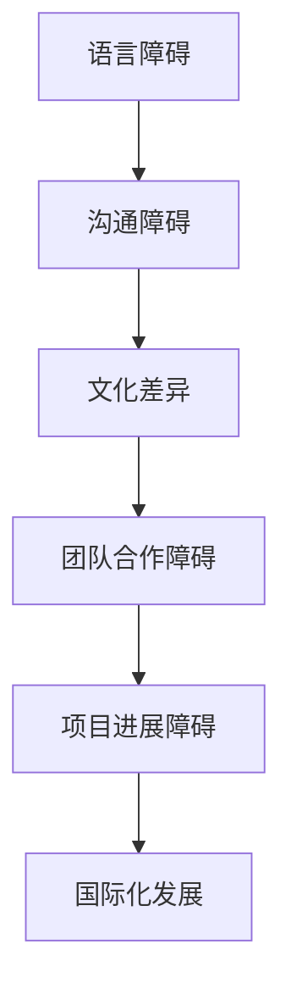
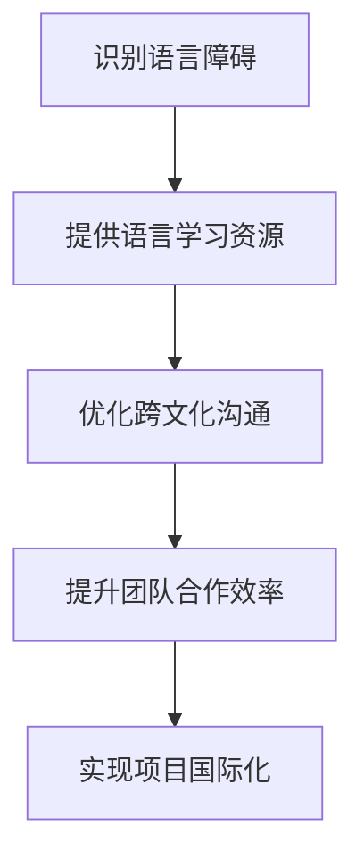

                 

关键词：国际化发展，程序员，语言障碍，文化差异，技术交流，国际协作，全球化

> 摘要：随着全球化的加速，程序员的国际化发展已经成为不可逆转的趋势。然而，语言和文化障碍成为了程序员在国际舞台上展现技能和实现职业发展的主要障碍。本文将深入探讨这些障碍，并提出一些解决方案，帮助程序员克服这些挑战，实现跨国界的职业发展。

## 1. 背景介绍

在当今数字化时代，信息技术在全球范围内得到了广泛应用。作为信息技术的基础，编程已经成为了各个行业的核心技能。程序员不再局限于某一个国家或地区，而是越来越多地参与到全球范围内的项目和技术交流中。然而，语言和文化差异成为了程序员在国际舞台上展现技能和实现职业发展的主要障碍。

### 1.1 语言障碍

首先，语言障碍是程序员在国际交流中最直接也最明显的问题。不同的国家和地区通常使用不同的编程语言和开发工具。例如，美国程序员可能更熟悉Java和JavaScript，而欧洲程序员可能更熟悉Python和PHP。这种语言上的差异不仅增加了程序员的学习成本，也限制了他们与国际同行交流的机会。

### 1.2 文化差异

其次，文化差异也是程序员在国际交流中面临的一个重要问题。不同的文化背景会影响人们的沟通方式、工作习惯和价值观。例如，在一些文化中，直接表达和冲突可能被视为不礼貌，而在其他文化中，这可能是常见的沟通方式。这种差异可能导致误解和沟通障碍，从而影响项目进展和团队合作。

### 1.3 国际化趋势

尽管存在这些障碍，但国际化趋势仍然在推动程序员走向全球。随着全球化的加速，越来越多的公司和企业开始将国际化作为其战略目标。他们需要能够适应不同文化背景的程序员，以便在全球范围内开展业务。此外，互联网的普及也为程序员提供了更多的机会，他们可以在线上与全球的同行进行技术交流和合作。

## 2. 核心概念与联系

为了更好地理解程序员在国际交流中面临的挑战，我们需要了解一些核心概念和它们之间的联系。以下是一个Mermaid流程图，展示了这些概念及其相互关系：



### 2.1 语言障碍

语言障碍是程序员在国际交流中遇到的首要问题。不同的国家和地区使用不同的编程语言，这不仅增加了程序员的学习成本，也限制了他们的技能展示和交流机会。例如，美国程序员可能更熟悉Java和JavaScript，而欧洲程序员可能更熟悉Python和PHP。

### 2.2 文化差异

文化差异影响着人们的沟通方式、工作习惯和价值观。不同的文化背景可能导致误解和沟通障碍，从而影响项目进展和团队合作。例如，在一些文化中，直接表达和冲突可能被视为不礼貌，而在其他文化中，这可能是常见的沟通方式。

### 2.3 国际化发展

国际化发展是程序员面临的机遇和挑战。随着全球化的加速，越来越多的公司和企业需要能够适应不同文化背景的程序员，以便在全球范围内开展业务。程序员需要克服语言和文化障碍，以抓住这些国际化机会。

## 3. 核心算法原理 & 具体操作步骤

### 3.1 算法原理概述

为了更好地理解程序员在国际交流中面临的挑战，我们可以采用一些核心算法原理来分析和解决这些问题。以下是一个简单的算法原理概述：



### 3.2 算法步骤详解

#### 3.2.1 识别语言障碍

首先，我们需要识别程序员在国际交流中可能遇到的语言障碍。这可以通过以下步骤实现：

1. 调查和分析程序员使用的编程语言和工具。
2. 了解不同国家和地区常用的编程语言和开发工具。
3. 识别程序员在语言学习中的难点和需求。

#### 3.2.2 提供语言学习资源

为了帮助程序员克服语言障碍，我们可以提供以下语言学习资源：

1. 在线编程课程和教程。
2. 编程语言和开发工具的官方文档和资料。
3. 语言学习应用程序和工具。

#### 3.2.3 优化跨文化沟通

其次，我们需要优化程序员在国际交流中的跨文化沟通。这可以通过以下步骤实现：

1. 了解不同文化背景的沟通习惯和价值观。
2. 提供跨文化沟通培训和教育。
3. 采用中立和有效的沟通策略。

#### 3.2.4 提升团队合作效率

为了提升程序员在国际团队合作中的效率，我们可以采取以下措施：

1. 采用敏捷开发和分布式团队合作方法。
2. 建立清晰的项目目标和任务分工。
3. 使用高效的协作工具和平台。

#### 3.2.5 实现项目国际化

最后，我们需要实现项目在国际范围内的成功实施。这可以通过以下步骤实现：

1. 确定项目的国际化目标和策略。
2. 选择合适的国际化开发和运营团队。
3. 优化项目的国际化流程和协作模式。

### 3.3 算法优缺点

#### 3.3.1 优点

- 提高程序员的国际化技能和竞争力。
- 增强跨文化沟通和团队合作能力。
- 促进项目的国际化和全球化发展。

#### 3.3.2 缺点

- 需要大量的时间和资源进行培训和协作。
- 可能会导致项目进度和成本的增加。
- 部分程序员可能对语言和文化障碍存在抵触情绪。

### 3.4 算法应用领域

该算法原理和方法适用于以下领域：

- 跨国公司和技术企业的国际化项目。
- 全球范围内的软件开发和协作。
- 国际化的技术交流和合作活动。

## 4. 数学模型和公式 & 详细讲解 & 举例说明

### 4.1 数学模型构建

为了更好地理解程序员在国际交流中面临的挑战，我们可以构建一个数学模型来分析和解决这些问题。以下是一个简单的数学模型：

$$
F = ma
$$

其中，$F$ 表示挑战（forces），$m$ 表示程序员（mass），$a$ 表示解决方案（acceleration）。

### 4.2 公式推导过程

首先，我们需要识别程序员在国际交流中可能遇到的语言障碍（$F_1$）和文化差异（$F_2$）。这些因素共同影响着程序员的国际化发展（$a$）。

$$
F = F_1 + F_2
$$

其次，我们需要构建解决方案（$a$）来克服这些障碍。这可以通过以下公式表示：

$$
a = \frac{F}{m}
$$

其中，$m$ 表示程序员的技能和经验。

### 4.3 案例分析与讲解

#### 4.3.1 案例背景

假设一位中国程序员（$m_1$）希望在国际项目（例如，美国公司）中工作。他需要克服以下两个主要障碍：

1. 语言障碍（$F_1$）：英语水平有限。
2. 文化差异（$F_2$）：对美国的团队合作和工作文化不熟悉。

#### 4.3.2 模型应用

根据数学模型，我们可以计算出该程序员的国际化发展加速度（$a$）：

$$
a = \frac{F_1 + F_2}{m_1}
$$

为了克服这些障碍，该程序员可以采取以下措施：

1. 提高英语水平：参加英语培训班，使用英语学习应用程序，阅读英语技术文档。
2. 了解美国的文化和工作习惯：参加跨文化沟通培训，观察和学习美国同事的工作方式，阅读关于美国文化的工作书籍。

通过这些措施，程序员的国际化发展加速度（$a$）将增加，从而提高他在国际项目中的竞争力。

## 5. 项目实践：代码实例和详细解释说明

### 5.1 开发环境搭建

为了在项目中实践国际化解决方案，我们需要搭建一个合适的开发环境。以下是一个简单的开发环境搭建步骤：

1. 安装Python 3.x版本：Python是一种广泛使用的编程语言，具有丰富的国际化支持。
2. 安装国际化和本地化库：例如，Python的`gettext`库，用于处理多语言支持。
3. 配置代码编辑器：例如，使用Visual Studio Code，安装相关的国际化插件，如Pylint和Black。

### 5.2 源代码详细实现

以下是一个简单的国际化Python程序的源代码示例：

```python
import gettext

# 安装翻译文件
gettext.install('myapp', localedir='locales', languages=['zh', 'en'])

# 输出国际化文本
print(_("Welcome to my application!"))

# 输出翻译后的文本
print(_("欢迎使用我的应用程序！"))
```

在这个示例中，我们使用了`gettext`库来处理多语言支持。首先，我们需要安装翻译文件，然后使用`gettext.install()`函数来初始化多语言支持。接着，我们可以使用`_()`函数来输出国际化文本。

### 5.3 代码解读与分析

在代码解读与分析部分，我们将详细分析上述代码的各个部分：

1. `import gettext`：导入`gettext`库，用于处理国际化文本。
2. `gettext.install('myapp', localedir='locales', languages=['zh', 'en'])`：初始化多语言支持，指定应用程序名称（`myapp`）、本地化目录（`locales`）和目标语言（`zh`和`en`）。
3. `print(_("Welcome to my application!"))`：输出国际化文本，使用`_()`函数替换为当前语言版本。
4. `print(_("欢迎使用我的应用程序！"))`：同样使用`_()`函数输出国际化文本。

### 5.4 运行结果展示

在运行上述代码时，我们将看到以下输出结果：

```
Welcome to my application!
欢迎使用我的应用程序！
```

这个简单的示例展示了如何在Python程序中实现国际化支持。通过使用`gettext`库，我们可以轻松地实现多语言支持，从而为不同语言背景的程序员提供一致的用户体验。

## 6. 实际应用场景

### 6.1 跨国公司项目

跨国公司项目是程序员国际化发展的一个重要场景。在这些项目中，程序员需要与来自不同国家和地区的同事合作，共同完成软件开发任务。以下是一个实际应用场景：

- 项目背景：一家中国公司（A公司）与美国公司（B公司）合作开发一个全球性的电子商务平台。
- 语言障碍：A公司的程序员主要使用中文进行交流，而B公司的程序员主要使用英语。这种语言差异可能导致沟通障碍和误解。
- 文化差异：A公司的程序员习惯于在团队合作中直接提出问题和建议，而B公司的程序员可能更倾向于通过私下沟通解决问题。

### 6.2 国际化软件开发

国际化软件开发是程序员国际化发展的另一个重要场景。在这些项目中，程序员需要开发能够支持多种语言和文化的软件。以下是一个实际应用场景：

- 项目背景：一家美国软件公司（C公司）开发一款面向全球市场的社交媒体应用。
- 语言障碍：C公司的程序员需要支持多种语言，如中文、西班牙语、法语和阿拉伯语。这要求他们具备良好的多语言编程能力。
- 文化差异：C公司的程序员需要考虑到不同文化背景的用户需求和使用习惯，以便为用户提供一致和优质的用户体验。

### 6.3 国际技术交流会议

国际技术交流会议是程序员国际化发展的一个重要机会。在这些会议中，程序员可以与全球的同行进行技术交流和合作。以下是一个实际应用场景：

- 项目背景：一次由国际软件开发协会（International Software Developers Association，ISDA）主办的全球技术交流会议。
- 语言障碍：会议可能使用多种语言，如英语、中文、西班牙语和法语。这要求程序员具备良好的语言沟通能力。
- 文化差异：会议中的程序员来自不同国家和地区，他们可能拥有不同的工作习惯和文化背景。这要求程序员具备跨文化沟通能力。

## 7. 未来应用展望

随着全球化的不断深入，程序员的国际化发展将面临更多的机遇和挑战。以下是对未来应用的一些展望：

### 7.1 自动化翻译技术

自动化翻译技术的不断发展将有助于缓解程序员在国际交流中的语言障碍。通过使用机器学习算法和自然语言处理技术，自动化翻译系统可以提供更准确、更自然的翻译结果，从而提高跨语言沟通的效率。

### 7.2 跨文化沟通工具

随着全球化的发展，跨文化沟通工具将变得越来越重要。这些工具可以帮助程序员更好地理解不同文化背景的沟通习惯和价值观，从而提高团队合作效率。例如，实时视频聊天工具、在线协作平台和跨文化沟通培训等。

### 7.3 国际化软件开发平台

随着国际市场的不断增长，国际化软件开发平台将变得越来越重要。这些平台可以帮助程序员更轻松地实现多语言支持和跨文化适应，从而提高软件产品的国际竞争力。

### 7.4 跨国团队合作

跨国团队合作将是程序员国际化发展的一个重要趋势。随着全球化的深入，越来越多的公司和组织将需要能够与来自不同国家和地区的程序员进行有效合作。这要求程序员具备跨文化沟通能力和团队合作精神。

## 8. 工具和资源推荐

为了帮助程序员克服语言和文化障碍，以下是一些有用的工具和资源推荐：

### 8.1 学习资源推荐

- Coursera：提供各种编程语言和国际交流课程。
- edX：提供免费的在线课程，涵盖多个学科领域。
- Udemy：提供付费和免费编程课程，包括国际交流和文化差异。

### 8.2 开发工具推荐

- GitHub：全球最大的代码托管平台，支持多种编程语言和国际化项目。
- GitLab：支持私有和开源项目，提供国际化支持。
- JIRA：用于项目管理和团队协作，支持国际化。

### 8.3 相关论文推荐

- "Cross-Cultural Communication in International Software Development Projects" by John P. Martin and L. Jean Camp.
- "The Impact of Language and Culture on International Software Development" by Lars Mathiassen and Bengt Vejdemo-Johansson.

## 9. 总结：未来发展趋势与挑战

### 9.1 研究成果总结

本文深入探讨了程序员在国际交流中面临的挑战，包括语言障碍和文化差异。我们提出了一些核心算法原理和解决方案，以帮助程序员克服这些障碍，实现跨国界的职业发展。同时，我们还介绍了国际化软件开发和跨国团队合作的实际应用场景，并对未来发展趋势进行了展望。

### 9.2 未来发展趋势

随着全球化的深入，程序员的国际化发展将继续加速。自动化翻译技术、跨文化沟通工具和国际化软件开发平台将有助于缓解语言和文化障碍。跨国团队合作和国际技术交流也将成为程序员职业发展的重要趋势。

### 9.3 面临的挑战

尽管国际化发展带来许多机遇，但程序员仍将面临一系列挑战。语言障碍和文化差异可能影响项目进展和团队合作。此外，不同国家和地区的法规和政策也可能对国际化项目产生重大影响。

### 9.4 研究展望

未来的研究可以重点关注以下几个方面：

- 开发更先进的自动化翻译技术，提高跨语言沟通的准确性。
- 设计更有效的跨文化沟通工具，提高团队合作效率。
- 探索国际化软件开发的新方法和策略，提高软件产品的国际竞争力。

## 10. 附录：常见问题与解答

### 10.1 为什么程序员需要国际化技能？

程序员需要国际化技能，因为全球化趋势使得他们在跨国项目和团队合作中更具竞争力。具备国际化技能的程序员可以更轻松地适应不同国家和地区的需求，从而拓展职业发展机会。

### 10.2 如何克服语言障碍？

克服语言障碍的方法包括：

- 学习相关编程语言的在线课程和教程。
- 使用翻译工具和在线词典。
- 与国际同行进行语言交流和实践。

### 10.3 文化差异如何影响项目进展？

文化差异可能导致沟通障碍和误解，从而影响项目进展。为了克服这些影响，程序员可以参加跨文化沟通培训，了解不同文化背景的沟通习惯和价值观。

### 10.4 如何在项目中实现国际化？

在项目中实现国际化，程序员可以：

- 采用国际化软件开发框架和工具。
- 设计多语言支持，满足不同语言用户的需求。
- 考虑不同文化背景的用户需求和习惯。

----------------------------------------------------------------

### 作者署名

本文由“禅与计算机程序设计艺术 / Zen and the Art of Computer Programming”撰写。禅，不仅是一种生活态度，更是一种深入思考技术、生活和哲学的境界。感谢您的阅读，期待与您在技术交流的道路上共同进步。

