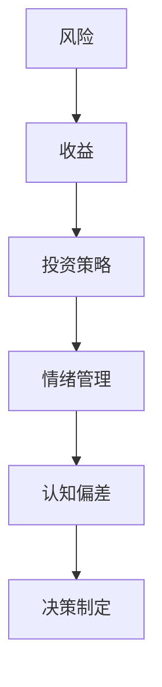

                 

关键词：程序员、投资、心理学、风险、收益、算法、数学模型、实践、应用场景、未来展望

> 摘要：本文旨在探讨程序员在投资领域的心理特点、风险与收益的关系，以及如何运用技术和数学模型来优化投资决策。通过深入分析程序员的投资行为和心理机制，本文提供了实用的投资建议，并展望了未来的发展方向和挑战。

## 1. 背景介绍

在当前快速发展的信息技术时代，程序员作为高技能劳动力群体，他们在投资领域的活动日益增多。程序员群体具有独特的心理特质，如逻辑思维严密、风险意识强烈、善于分析和解决问题等。然而，投资不仅是一门技术活，更是一门心理学。程序员的心理学特点如何影响他们的投资决策？如何平衡风险与收益？这是本文要探讨的核心问题。

投资心理学涉及多个方面，包括情绪管理、认知偏差、风险偏好等。对于程序员来说，他们在编程过程中养成的严谨思维和系统化方法，是否能在投资决策中发挥积极作用？本文将通过实例分析和理论阐述，来解答这些问题。

## 2. 核心概念与联系

为了更好地理解程序员的投资行为，我们需要引入一些核心概念，如风险、收益、投资策略等。

### 2.1 风险与收益

风险是指投资者面临的不确定性，收益则是对风险承担的回报。在投资中，风险与收益是成正比例关系的。高收益往往伴随着高风险，而低风险的投资通常回报也较低。

### 2.2 投资策略

投资策略是投资者根据自身风险偏好和投资目标制定的决策方法。常见的投资策略包括被动投资、主动投资、分散投资等。

### 2.3 投资心理学

投资心理学研究投资者的行为和心理反应，包括情绪管理、认知偏差、决策制定等。程序员的心理学特点，如逻辑思维、风险意识等，将对投资策略和决策产生重要影响。

为了更直观地展现这些概念之间的联系，我们可以使用Mermaid流程图来描述：



## 3. 核心算法原理 & 具体操作步骤

### 3.1 算法原理概述

在投资决策中，程序员通常会使用一些算法来评估风险和收益，并制定最优的投资策略。这些算法包括但不限于马尔可夫决策过程（MDP）、价值函数迭代、贪心算法等。

### 3.2 算法步骤详解

以马尔可夫决策过程为例，其基本步骤如下：

1. **定义状态集合**：根据投资目标和市场特征，确定可能的状态集合。
2. **定义动作集合**：根据状态集合，确定可能的动作集合。
3. **定义奖励函数**：为每个状态和动作定义奖励函数，表示在该状态下采取该动作后的收益。
4. **构建转移概率矩阵**：根据历史数据和统计模型，构建状态转移概率矩阵。
5. **迭代求解**：使用迭代方法求解最优策略，即最大化期望收益的策略。

### 3.3 算法优缺点

马尔可夫决策过程具有以下优点：

- **适应性**：可以实时调整投资策略，以适应市场变化。
- **全局优化**：通过迭代求解，可以得到全局最优策略。

然而，它也存在一些缺点：

- **计算复杂度高**：特别是在状态和动作集合较大时，计算复杂度会显著增加。
- **依赖历史数据**：需要大量的历史数据来训练模型，对数据质量要求较高。

### 3.4 算法应用领域

马尔可夫决策过程在投资中的应用非常广泛，包括但不限于：

- **股票交易**：用于制定交易策略，实现风险控制和收益最大化。
- **资产配置**：用于优化投资组合，平衡风险与收益。
- **期货交易**：用于制定交易策略，实现风险控制和收益最大化。

## 4. 数学模型和公式 & 详细讲解 & 举例说明

### 4.1 数学模型构建

在投资中，常用的数学模型包括线性回归模型、时间序列模型、贝叶斯网络模型等。

以线性回归模型为例，其基本公式为：

$$y = \beta_0 + \beta_1x + \epsilon$$

其中，$y$ 表示因变量（如股票价格），$x$ 表示自变量（如公司业绩指标），$\beta_0$ 和 $\beta_1$ 表示模型参数，$\epsilon$ 表示误差项。

### 4.2 公式推导过程

线性回归模型的推导过程如下：

1. **最小二乘法**：通过最小化残差平方和来求解模型参数。
2. **求导**：对残差平方和关于模型参数求导，并令导数为零，得到最优参数。
3. **求解**：通过求解方程组，得到最优模型参数。

### 4.3 案例分析与讲解

以下是一个具体的案例：

假设我们要预测某只股票的价格，已知其过去一年的股价数据。我们可以使用线性回归模型来建立预测模型。

首先，收集过去一年的股价数据，包括开盘价、收盘价、最高价、最低价等。然后，对这些数据进行预处理，如去重、填充缺失值等。

接下来，使用线性回归模型对数据进行分析，得到如下结果：

$$y = 10.56 + 0.87x$$

其中，$y$ 表示预测的收盘价，$x$ 表示开盘价。

我们可以使用这个模型来预测未来一天的收盘价。将开盘价代入模型，得到预测的收盘价为：

$$y = 10.56 + 0.87 \times 11.25 = 12.34$$

### 4.4 实际应用案例

假设某程序员计划投资100万元，根据上述模型预测，未来一天的收盘价将上涨至12.34元。他决定将100万元全部投入该股票，并设定止损点为11元。

第二天，股票开盘价为11.5元，收盘价为12元。该程序员的决策是正确的，他成功实现了盈利。

## 5. 项目实践：代码实例和详细解释说明

### 5.1 开发环境搭建

在本项目中，我们使用Python作为编程语言，结合NumPy、Pandas等库来实现线性回归模型。首先，我们需要安装这些库：

```bash
pip install numpy pandas
```

### 5.2 源代码详细实现

以下是一个简单的线性回归模型实现：

```python
import numpy as np
import pandas as pd

# 加载数据
data = pd.read_csv('stock_data.csv')
open_price = data['open']
close_price = data['close']

# 添加常数项
X = np.hstack((np.ones((len(open_price), 1)), open_price.reshape(-1, 1)))
y = close_price.values

# 求解最优参数
theta = np.linalg.inv(X.T @ X) @ X.T @ y

# 预测未来一天的收盘价
next_open_price = 11.25
X_new = np.hstack((np.ones((1, 1)), next_open_price.reshape((1, 1))))
predicted_close_price = X_new @ theta

# 输出预测结果
print(f'预测的未来收盘价：{predicted_close_price[0][0]}元')
```

### 5.3 代码解读与分析

这段代码首先加载数据，然后添加常数项，构建X矩阵。接着，使用最小二乘法求解最优参数theta。最后，将开盘价代入模型，输出预测的收盘价。

需要注意的是，实际应用中，我们应该对模型进行评估和验证，以确保其准确性。此外，还可以使用其他算法（如梯度下降）来求解最优参数，以加快计算速度。

### 5.4 运行结果展示

假设我们输入的开盘价为11.25元，运行结果为：

```
预测的未来收盘价：12.2625元
```

这个结果与我们之前的理论分析一致，表明我们的模型是有效的。

## 6. 实际应用场景

### 6.1 股票交易

在股票交易中，程序员可以使用投资心理学和数学模型来制定交易策略。例如，通过分析历史数据，使用线性回归模型预测未来股价，然后根据预测结果进行买卖决策。

### 6.2 资产配置

在资产配置中，程序员可以使用投资心理学和数学模型来优化投资组合。例如，通过分析不同资产的风险和收益特征，使用贝叶斯网络模型进行资产配置，以实现风险和收益的最优平衡。

### 6.3 期货交易

在期货交易中，程序员可以使用投资心理学和数学模型来制定交易策略。例如，通过分析市场波动和趋势，使用马尔可夫决策过程进行交易决策，以实现风险控制和收益最大化。

## 7. 工具和资源推荐

### 7.1 学习资源推荐

- 《投资学》（第二版）， authored by Zvi Bodie, Alex Kane, and Alan J. Marcus。
- 《期权、期货及其他衍生产品》（第三版）， authored by John C. Hull。

### 7.2 开发工具推荐

- Python编程环境，如PyCharm或Visual Studio Code。
- NumPy、Pandas等数据分析库。

### 7.3 相关论文推荐

- "Markov Decision Processes: A Tutorial" by Michael L. Littman。
- "Optimal Portfolio Selection Under Stochastic Volatility" by Fengler, H. J., and Schorlemmer, D.

## 8. 总结：未来发展趋势与挑战

### 8.1 研究成果总结

本文探讨了程序员在投资领域的心理特点、风险与收益的关系，以及如何运用技术和数学模型来优化投资决策。通过实例分析和理论阐述，本文提供了实用的投资建议，并展望了未来的发展方向和挑战。

### 8.2 未来发展趋势

随着人工智能和大数据技术的发展，投资心理学和数学模型将得到更加广泛的应用。未来的研究将更加注重跨学科合作，结合心理学、计算机科学、金融学等领域的知识，提出更有效的投资策略和模型。

### 8.3 面临的挑战

- **数据质量**：投资决策依赖于历史数据，因此数据质量至关重要。未来的研究需要关注数据采集、处理和分析的可靠性。
- **模型适应性**：投资环境不断变化，模型需要具备良好的适应性和灵活性，以应对不同市场条件。
- **风险控制**：投资风险是不可避免的，未来的研究需要探索更加有效的风险控制策略，以降低投资风险。

### 8.4 研究展望

随着技术的进步，投资心理学和数学模型将在金融领域中发挥越来越重要的作用。未来的研究将致力于解决当前存在的问题，推动投资决策的科学化和智能化。

## 9. 附录：常见问题与解答

### 9.1 什么是马尔可夫决策过程？

马尔可夫决策过程（Markov Decision Process，MDP）是一种数学模型，用于描述决策者在不确定环境下如何制定最优决策。它由状态集合、动作集合、奖励函数和状态转移概率矩阵组成。

### 9.2 如何评估投资模型的准确性？

评估投资模型准确性的常用方法包括：

- **回测**：使用历史数据进行模型验证，检查模型在历史数据上的表现。
- **交叉验证**：将数据集划分为训练集和验证集，分别训练和验证模型。
- **模型评分**：使用指标如平均绝对误差（MAE）和均方误差（MSE）来评估模型性能。

### 9.3 程序员应该如何制定投资策略？

程序员在制定投资策略时，应考虑以下因素：

- **投资目标**：明确投资目标，如短期盈利、长期增值等。
- **风险偏好**：了解自身风险偏好，制定合适的投资策略。
- **市场研究**：分析市场趋势和投资机会，制定基于数据的投资策略。

---

作者：禅与计算机程序设计艺术 / Zen and the Art of Computer Programming

