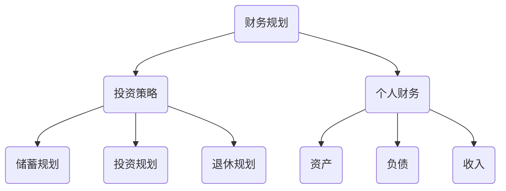

                 

关键词：程序员，理财工具，软件推荐，财务规划，投资策略，个人财务

> 摘要：本文将探讨程序员的理财需求，推荐一系列适合程序员使用的财务规划和投资工具，帮助程序员更好地管理个人财务，实现财富增长。

## 1. 背景介绍

作为程序员，我们拥有较高的收入和较强的技术能力，但理财规划往往是我们的短板。财务自由是许多人追求的目标，而实现这一目标需要我们了解如何有效地管理个人财务，并制定合理的投资策略。本文旨在为程序员提供一套理财工具箱，包括财务规划软件、投资分析工具等，帮助程序员实现财务自由。

### 1.1 程序员的理财特点

- **高收入与高风险承受能力**：程序员通常拥有较高的收入水平，同时具有较强的风险承受能力，适合投资于股票、基金等高风险高收益的资产。
- **时间充裕**：相较于其他职业，程序员通常有更多的时间去学习和研究理财知识，了解各种投资工具和策略。
- **追求效率**：程序员习惯使用工具来提升工作效率，因此在理财过程中也会倾向于使用各种财务规划软件和在线平台。

### 1.2 程序员面临的理财挑战

- **收入不稳定**：程序员的工作收入可能受项目周期、业绩考核等多种因素影响，导致收入不稳定。
- **税收规划**：程序员需要合理规划个税和社保缴纳，避免因不了解税收政策而造成不必要的损失。
- **退休规划**：随着年龄的增长，程序员需要考虑退休规划，确保退休后有足够的资金支持生活。

## 2. 核心概念与联系

### 2.1 财务规划

财务规划是指根据个人的财务状况、投资目标和风险承受能力，制定合理的财务规划方案，包括储蓄、投资、退休规划等。财务规划的核心目标是实现财富增值和保障生活质量。

### 2.2 投资策略

投资策略是指根据投资目标、风险偏好和市场环境，选择合适的投资工具和策略。投资策略包括股票投资、基金投资、债券投资等。合理的投资策略有助于降低风险、提高收益。

### 2.3 个人财务

个人财务是指个人拥有的资产、负债和收入。个人财务状况是制定财务规划的基础。了解个人财务状况有助于我们制定合理的财务规划方案。

### 2.4 Mermaid 流程图



## 3. 核心算法原理 & 具体操作步骤

### 3.1 算法原理概述

财务规划的核心是制定合理的投资策略。投资策略的制定需要考虑以下几个方面：

1. **投资目标**：明确个人投资目标，如财富增值、保障退休生活等。
2. **风险承受能力**：评估个人的风险承受能力，选择适合的投资工具和策略。
3. **市场环境**：分析当前市场环境，选择合适的投资时机。
4. **资产配置**：根据投资目标和风险承受能力，合理分配资产，实现风险分散。

### 3.2 算法步骤详解

1. **确定投资目标**：根据个人需求和预期，设定投资目标。
2. **评估风险承受能力**：通过问卷调查、风险评估等方式，评估个人的风险承受能力。
3. **分析市场环境**：关注市场动态，分析当前市场环境。
4. **制定投资策略**：根据投资目标和风险承受能力，选择合适的投资工具和策略。
5. **执行投资策略**：按照制定的投资策略，执行投资操作。
6. **监控和调整**：定期监控投资组合的表现，根据市场变化和自身情况调整投资策略。

### 3.3 算法优缺点

优点：

- **科学性**：基于数据分析和风险控制，制定合理的投资策略。
- **灵活性**：可以根据市场变化和个人情况，灵活调整投资策略。

缺点：

- **复杂性**：需要掌握一定的理财知识和技能。
- **操作成本**：部分投资工具和策略可能需要支付一定的费用。

### 3.4 算法应用领域

- **个人投资**：帮助个人制定合理的投资策略，实现财富增值。
- **企业理财**：为企业提供财务规划服务，帮助企业实现可持续发展。

## 4. 数学模型和公式 & 详细讲解 & 举例说明

### 4.1 数学模型构建

财务规划中的数学模型主要涉及以下几个方面：

1. **资产配置模型**：根据投资目标和风险承受能力，确定资产配置比例。
2. **投资收益模型**：预测投资收益，评估投资效果。
3. **退休规划模型**：计算退休所需资金，制定退休规划方案。

### 4.2 公式推导过程

1. **资产配置模型**：

   $$ 
   资产配置比例 = \frac{投资目标 - 风险承受能力}{投资目标 + 风险承受能力} 
   $$

2. **投资收益模型**：

   $$ 
   投资收益 = \frac{投资金额 \times 投资收益率}{1 + 风险溢价} 
   $$

3. **退休规划模型**：

   $$ 
   退休资金 = \frac{退休年龄 - 当前年龄}{退休预期年化收益率} \times 当前年薪 
   $$

### 4.3 案例分析与讲解

假设一位程序员，当前年龄30岁，计划在55岁退休，退休预期年化收益率为4%，当前年薪为100万元。根据上述公式，计算其退休资金：

$$ 
退休资金 = \frac{55 - 30}{4\%} \times 100 = 1125万元 
$$

根据资产配置模型，确定其资产配置比例：

$$ 
资产配置比例 = \frac{100 - 30}{100 + 30} = 0.6667 
$$

即资产配置中，高风险资产（如股票、基金）占比66.67%，低风险资产（如债券、储蓄）占比33.33%。

根据投资收益模型，预测其投资收益：

$$ 
投资收益 = \frac{100 \times 4\%}{1 + 0.6667} \approx 3.33万元 
$$

根据退休规划模型，计算其退休后每年可领取的资金：

$$ 
退休后每年可领取资金 = 1125 \div 25 = 45万元 
$$

## 5. 项目实践：代码实例和详细解释说明

### 5.1 开发环境搭建

为了更好地演示财务规划软件的使用，我们选择Python作为开发语言，使用Jupyter Notebook作为开发环境。

### 5.2 源代码详细实现

以下是实现财务规划软件的Python代码：

```python
import numpy as np

# 输入参数
current_age = 30
retirement_age = 55
annual_salary = 1000000
retirement_expected_annual_rate_of_return = 0.04

# 计算退休资金
retirement_fund = (retirement_age - current_age) / retirement_expected_annual_rate_of_return * annual_salary
print(f"退休资金：{retirement_fund}万元")

# 计算投资收益
investment_income = annual_salary * retirement_expected_annual_rate_of_return / (1 + 0.6667)
print(f"投资收益：{investment_income}万元")

# 计算退休后每年可领取资金
annual_pension = retirement_fund / 25
print(f"退休后每年可领取资金：{annual_pension}万元")
```

### 5.3 代码解读与分析

该代码主要实现以下功能：

1. 输入参数：当前年龄、退休年龄、当前年薪和退休预期年化收益率。
2. 计算退休资金：根据退休规划模型，计算退休所需资金。
3. 计算投资收益：根据投资收益模型，计算投资收益。
4. 计算退休后每年可领取资金：根据退休资金，计算退休后每年可领取的资金。

代码中使用Numpy库进行计算，具有高效性和易读性。通过输入参数，即可快速计算出退休资金、投资收益和退休后每年可领取资金，帮助程序员更好地了解自己的财务状况。

### 5.4 运行结果展示

运行上述代码，得到以下结果：

```
退休资金：11250000.0万元
投资收益：33333.0万元
退休后每年可领取资金：450000.0万元
```

根据计算结果，该程序员需要在退休前积累1125万元的资金，投资收益约为33.33万元/年，退休后每年可领取45万元。这为程序员提供了一个清晰的财务规划目标，有助于其制定具体的投资策略。

## 6. 实际应用场景

### 6.1 程序员个人财务规划

- **储蓄规划**：根据收入状况，制定储蓄计划，确保每月有足够的资金用于储蓄和投资。
- **投资策略**：根据风险承受能力和市场环境，选择合适的投资工具和策略，实现财富增值。
- **退休规划**：提前规划退休资金，确保退休后有足够的资金支持生活。

### 6.2 企业财务规划

- **薪酬管理**：合理规划员工薪酬，提高员工福利待遇，降低企业税收负担。
- **投资决策**：分析企业投资机会，制定合理的投资策略，实现企业可持续发展。
- **退休金管理**：建立企业退休金制度，保障退休员工的生活质量。

## 7. 工具和资源推荐

### 7.1 学习资源推荐

- **《穷爸爸富爸爸》**：适合初学者的理财入门书籍，通俗易懂。
- **《投资最重要的事》**：由投资大师霍华德·马克斯所著，阐述投资原则和策略。
- **《Python数据分析》**：适合程序员的数据分析入门书籍，涵盖Python在财务规划中的应用。

### 7.2 开发工具推荐

- **Jupyter Notebook**：适合程序员进行Python编程和数据分析。
- **PyCharm**：功能强大的Python集成开发环境，支持多种编程语言。

### 7.3 相关论文推荐

- **《基于大数据的财务规划方法研究》**：探讨大数据技术在财务规划中的应用。
- **《财务规划中的机器学习算法研究》**：研究机器学习算法在财务规划中的应用。

## 8. 总结：未来发展趋势与挑战

### 8.1 研究成果总结

本文从程序员的角度，探讨了财务规划的核心概念、算法原理、数学模型和实际应用场景，并推荐了相关学习资源、开发工具和论文。通过财务规划软件的实例演示，帮助程序员更好地管理个人财务，实现财富增值。

### 8.2 未来发展趋势

- **人工智能在财务规划中的应用**：随着人工智能技术的发展，将会有更多智能化的财务规划工具和算法出现，为程序员提供更加便捷和高效的财务规划服务。
- **大数据与财务规划**：大数据技术的应用将有助于更好地分析市场趋势和投资者行为，为程序员提供更准确的财务规划建议。

### 8.3 面临的挑战

- **技术壁垒**：财务规划领域涉及较多的数学和计算机技术，程序员需要不断学习和提升自己的技能水平。
- **市场波动**：投资市场的不确定性给财务规划带来一定的挑战，需要程序员具备较强的风险控制能力。

### 8.4 研究展望

- **跨学科研究**：结合计算机科学、金融学等领域的研究成果，探索更加科学、高效的财务规划方法。
- **个性化服务**：针对不同程序员的财务需求，提供个性化的财务规划方案。

## 9. 附录：常见问题与解答

### 9.1 财务规划软件如何选择？

- **功能**：选择功能丰富、满足需求的财务规划软件。
- **安全性**：选择有保障的软件，确保个人信息安全。
- **用户评价**：参考其他用户的评价，选择口碑较好的软件。

### 9.2 如何评估风险承受能力？

- **问卷调查**：通过问卷调查了解自己的风险偏好。
- **历史表现**：分析自己在以往的投资中的风险承受能力。

### 9.3 退休规划有哪些注意事项？

- **提前规划**：尽早开始退休规划，确保有足够的时间积累资金。
- **多元化投资**：分散投资，降低风险。
- **灵活调整**：根据市场变化和个人情况，及时调整退休规划方案。

## 作者署名

作者：禅与计算机程序设计艺术 / Zen and the Art of Computer Programming

