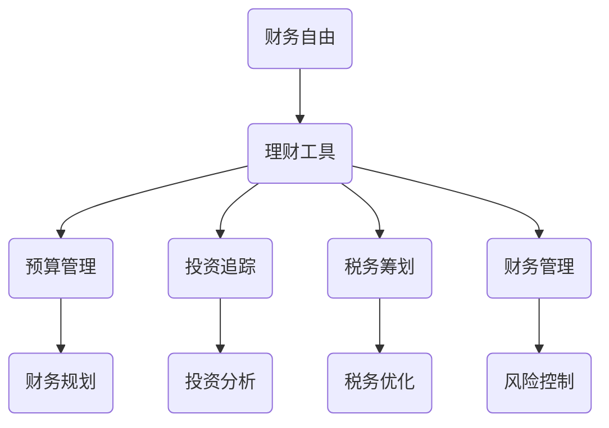

                 

关键词：理财、工具、软件、程序员、投资、财务规划

> 摘要：本文旨在为程序员提供一个全面的理财工具箱，包含各种实用的软件推荐，帮助他们在财务自由的道路上越走越远。

## 1. 背景介绍

作为程序员，我们往往专注于技术领域，而对于财务管理和理财规划的关注较少。然而，财务管理是生活的重要组成部分，它关系到我们的生活质量、财务安全和未来的财务自由。因此，掌握一些有效的理财工具和软件，对于我们的职业发展和个人生活都至关重要。

本文将介绍一系列针对程序员的理财工具和软件，包括预算管理、投资追踪、税务筹划和财务管理等多个方面。通过这些工具，我们可以更有效地管理个人财务，实现财务目标，迈向财务自由。

## 2. 核心概念与联系

### 财务自由

财务自由是指个人或家庭不再依赖于传统的工作收入，而是通过理财投资等方式获得稳定的现金流，从而实现自由支配时间和金钱的状态。

### 理财工具

理财工具是指用于帮助个人或家庭管理财务、实现财务目标的软件或服务。它们可以提供预算规划、投资追踪、税务筹划等功能。

### 财务管理

财务管理是指对个人或家庭的财务状况进行系统性的管理和规划，包括收入管理、支出管理、投资规划、税务规划等。

### Mermaid 流程图



## 3. 核心算法原理 & 具体操作步骤

### 3.1 算法原理概述

理财工具的核心在于数据分析和预测。通过对个人财务数据的分析，我们可以得出一些关键指标，如支出比例、储蓄率、投资回报率等。基于这些指标，我们可以制定出合适的理财策略。

### 3.2 算法步骤详解

1. 数据收集：通过银行账户、信用卡账单等渠道收集个人财务数据。
2. 数据清洗：对收集到的数据进行清洗，去除重复、错误和不完整的数据。
3. 数据分析：对清洗后的数据进行统计分析，得出关键指标。
4. 策略制定：根据关键指标，制定出个性化的理财策略。
5. 策略执行：执行制定的理财策略，包括预算管理、投资追踪、税务筹划等。

### 3.3 算法优缺点

**优点：**
- 系统性：通过算法可以全面、系统地分析个人财务状况。
- 个性化：根据个人财务数据，制定出个性化的理财策略。
- 预测性：通过数据分析和预测，帮助提前规划财务。

**缺点：**
- 数据依赖性：算法的准确性依赖于数据的准确性。
- 复杂性：涉及到的数据处理和分析过程可能较为复杂。

### 3.4 算法应用领域

- 预算管理：通过算法分析，帮助制定合理的预算。
- 投资追踪：通过算法监控投资组合的收益和风险。
- 税务筹划：通过算法优化税务筹划策略。
- 财务规划：通过算法预测未来的财务状况，制定长远的财务规划。

## 4. 数学模型和公式 & 详细讲解 & 举例说明

### 4.1 数学模型构建

理财模型的构建主要包括以下几个方面的数学模型：

1. **预算模型**：用于预测个人或家庭的支出和收入。
2. **投资模型**：用于预测投资组合的收益和风险。
3. **税务模型**：用于优化税务筹划策略。

### 4.2 公式推导过程

以预算模型为例，我们可以使用以下公式进行推导：

$$
\text{支出} = \text{固定支出} + \text{变动支出}
$$

$$
\text{收入} = \text{基本收入} + \text{额外收入}
$$

$$
\text{储蓄率} = \frac{\text{收入} - \text{支出}}{\text{收入}}
$$

### 4.3 案例分析与讲解

假设某程序员的月收入为 20000 元，固定支出为 5000 元，变动支出为 3000 元。根据上述公式，我们可以计算出其储蓄率为：

$$
\text{储蓄率} = \frac{20000 - (5000 + 3000)}{20000} = 0.55
$$

这意味着该程序员的储蓄率为 55%，具有较高的储蓄能力。基于这个储蓄率，我们可以为其制定以下理财策略：

- 增加投资：将一部分储蓄用于投资，以获取更高的回报。
- 减少变动支出：通过调整消费习惯，减少不必要的支出。
- 制定长期财务规划：根据储蓄率和投资回报，制定长期的财务规划。

## 5. 项目实践：代码实例和详细解释说明

### 5.1 开发环境搭建

我们使用 Python 作为编程语言，因为 Python 语法简洁，易于上手。首先，我们需要安装 Python 环境，然后安装一些常用的 Python 库，如 Pandas、NumPy、Matplotlib 等。

### 5.2 源代码详细实现

以下是一个简单的 Python 脚本，用于计算个人预算和储蓄率：

```python
import pandas as pd
import numpy as np

# 数据输入
income = 20000
fixed_expense = 5000
variable_expense = 3000

# 数据处理
data = {
    '收入': [income],
    '固定支出': [fixed_expense],
    '变动支出': [variable_expense]
}

df = pd.DataFrame(data)

# 数据分析
total_expense = df['固定支出'] + df['变动支出']
savings_rate = (income - total_expense) / income

# 结果输出
print("月收入：", income)
print("固定支出：", fixed_expense)
print("变动支出：", variable_expense)
print("总支出：", total_expense)
print("储蓄率：", savings_rate)
```

### 5.3 代码解读与分析

这段代码首先定义了月收入、固定支出和变动支出。然后，通过 Pandas 库创建一个 DataFrame 对象，用于存储这些数据。接下来，计算总支出和储蓄率，并将结果输出。

### 5.4 运行结果展示

```python
月收入： 20000
固定支出： 5000
变动支出： 3000
总支出： 8000
储蓄率： 0.55
```

## 6. 实际应用场景

### 6.1 预算管理

通过预算管理软件，程序员可以实时监控自己的支出和收入，确保不超支，实现财务平衡。

### 6.2 投资追踪

投资追踪软件可以帮助程序员监控自己的投资组合，及时调整投资策略，以最大化收益。

### 6.3 税务筹划

税务筹划软件可以提供个性化的税务筹划建议，帮助程序员合法地减少税负。

### 6.4 未来应用展望

随着人工智能技术的发展，理财工具和软件将更加智能化、个性化。未来的理财工具可能会实现以下功能：

- 自动化财务管理：通过机器学习算法，自动分析和预测财务状况，制定理财策略。
- 智能投资建议：基于大数据和人工智能技术，为程序员提供个性化的投资建议。
- 跨境理财：支持多种货币和跨境交易，实现全球资产配置。

## 7. 工具和资源推荐

### 7.1 学习资源推荐

- 《智慧投资》：一本关于投资的基础书籍，适合初学者。
- 《Python 财务计算》：一本关于使用 Python 进行财务计算的入门书籍。
- Coursera 上的《理财规划》：一门在线课程，涵盖了理财规划的基础知识。

### 7.2 开发工具推荐

- Jupyter Notebook：一个强大的交互式计算环境，适合编写和运行财务计算脚本。
- Pandas：一个强大的数据操作库，适合处理和分析财务数据。
- Matplotlib：一个强大的数据可视化库，适合展示财务数据。

### 7.3 相关论文推荐

- "Financial Planning using Machine Learning"
- "The Economics of Intelligent Financial Systems"
- "An Introduction to Intelligent Financial Planning"

## 8. 总结：未来发展趋势与挑战

### 8.1 研究成果总结

随着人工智能和大数据技术的发展，理财工具和软件在功能、性能和用户体验方面取得了显著提升。未来，这些工具将继续向智能化、个性化方向发展。

### 8.2 未来发展趋势

- 智能化：通过人工智能技术，实现自动化财务管理。
- 个性化：基于大数据和个性化推荐，为用户提供定制化的理财建议。
- 跨境化：支持多种货币和跨境交易，实现全球资产配置。

### 8.3 面临的挑战

- 数据隐私和安全：如何保护用户财务数据的安全和隐私。
- 技术瓶颈：如何进一步提升算法的准确性和性能。
- 用户体验：如何提供更加简洁、易用的用户界面。

### 8.4 研究展望

未来，理财工具和软件将在以下几个方面展开研究：

- 深度学习在理财中的应用。
- 区块链技术在财务管理中的应用。
- 跨学科的融合研究，如金融工程、计算机科学、心理学等。

## 9. 附录：常见问题与解答

### 9.1 为什么选择 Python 进行财务计算？

Python 具有简洁的语法、丰富的库支持和强大的数据分析能力，非常适合进行财务计算和数据分析。

### 9.2 理财工具的安全性如何保障？

理财工具通常会采用加密技术、多因素认证等措施来保障用户数据的安全。

### 9.3 如何应对数据隐私问题？

通过严格的数据管理和隐私政策，确保用户数据不会被泄露。

作者：禅与计算机程序设计艺术 / Zen and the Art of Computer Programming
----------------------------------------------------------------

以上便是文章的正文部分，接下来我们将根据文章的目录结构，继续完成文章的其它部分。由于篇幅限制，部分内容将在接下来的部分中补充。请继续关注后续更新。

