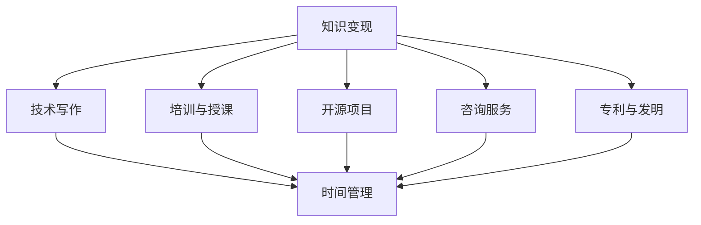

                 

关键词：知识变现、时间管理、程序员、效率提升、技能发展

> 摘要：在信息技术飞速发展的时代，程序员作为科技创新的主力军，面临着不断更新知识体系和高效管理时间的重要挑战。本文旨在探讨如何通过科学的时间管理和知识变现策略，帮助程序员实现个人职业成长和持续发展。

## 1. 背景介绍

程序员作为现代科技领域的核心力量，其职业发展和个人成长离不开持续的学习和实践。然而，随着技术的快速迭代和行业竞争的加剧，程序员面临着巨大的知识更新压力和时间管理挑战。如何有效地管理时间，最大化知识变现，已成为影响程序员职业生涯成功的重要因素。

### 1.1 知识变现的概念

知识变现是指将个人或团队的专业知识和技能转化为实际收益的过程，包括但不限于通过咨询、培训、专利、出版等方式实现知识的商业价值。在程序员领域，知识变现可以通过编写技术文章、开设线上课程、参与开源项目、提供技术解决方案等多种方式实现。

### 1.2 时间管理的重要性

时间管理是提高工作效率、实现个人目标的关键。对于程序员而言，时间管理不仅影响个人的工作效率和成就感，还直接关系到职业发展和收入水平。良好的时间管理习惯可以帮助程序员更好地平衡工作与生活，持续提升个人能力和市场竞争力。

## 2. 核心概念与联系

在探讨程序员的知识变现和时间管理之前，我们需要了解几个关键概念，以及它们之间的关系。

### 2.1 知识变现

知识变现的核心在于如何将个人的专业知识和技能转化为可量化的经济收益。这包括以下几种方式：

- **技术写作**：撰写技术博客、电子书、专栏等，分享专业知识和经验。
- **培训与授课**：通过线上或线下课程，传授专业技能。
- **开源项目**：参与开源项目，提升个人技术影响力，吸引潜在商业机会。
- **咨询服务**：提供专业咨询服务，解决客户的技术难题。
- **专利与发明**：将创新技术转化为专利，实现长期收益。

### 2.2 时间管理

时间管理是一种规划和控制时间的技巧，旨在提高工作效率和实现个人目标。对于程序员来说，时间管理涉及到以下几个方面：

- **任务规划**：明确工作目标，分解任务，制定合理的计划。
- **优先级排序**：根据任务的重要性和紧急程度，合理安排工作顺序。
- **时间追踪**：记录工作时间和效率，分析时间使用情况，优化时间管理策略。
- **休息与平衡**：合理安排休息时间，保持身心健康，提高工作效率。

### 2.3 知识变现与时间管理的联系

知识变现与时间管理密切相关。有效的知识变现需要投入大量的时间和精力，而时间管理则可以确保这些时间和精力得到合理的规划和利用。以下是知识变现与时间管理之间的几个关键联系：

- **时间效率**：良好的时间管理可以提高知识变现的效率，使程序员能够在有限的时间内创造更大的价值。
- **目标设定**：明确的知识变现目标有助于程序员更好地规划时间，确保时间和精力的投入与目标一致。
- **持续学习**：知识变现需要不断更新知识体系，时间管理可以帮助程序员合理安排学习时间，确保持续学习。
- **风险管理**：时间管理策略可以帮助程序员识别和规避知识变现过程中的潜在风险，确保项目的顺利进行。

### 2.4 Mermaid 流程图

下面是一个简单的 Mermaid 流程图，展示了知识变现与时间管理之间的核心概念及其关系：



## 3. 核心算法原理 & 具体操作步骤

### 3.1 算法原理概述

程序员的知识变现和时间管理，本质上是一个复杂的决策和优化过程。我们可以将这个过程视为一个算法问题，通过以下步骤进行解决：

1. **目标设定**：明确知识变现的目标和预期收益。
2. **资源分析**：评估个人时间、技能和资源。
3. **优先级排序**：根据目标和资源，为任务排序。
4. **任务分解**：将大任务分解为小任务，便于管理和执行。
5. **时间追踪**：记录时间使用情况，分析效率。
6. **持续优化**：根据反馈，调整策略和计划。

### 3.2 算法步骤详解

1. **目标设定**：

   - **明确目标**：确定知识变现的具体目标和收益预期。
   - **评估可行性**：分析目标是否可实现，资源是否充足。

2. **资源分析**：

   - **时间资源**：评估可用时间，包括工作时间、个人时间等。
   - **技能资源**：分析个人专业技能和知识体系。
   - **物质资源**：包括资金、设备等。

3. **优先级排序**：

   - **目标相关性**：根据目标的重要性，为任务排序。
   - **资源限制**：考虑资源的可用性，调整任务优先级。

4. **任务分解**：

   - **分解任务**：将大任务分解为小任务，便于管理和执行。
   - **设置里程碑**：为每个小任务设定明确的完成时间和里程碑。

5. **时间追踪**：

   - **记录时间**：使用工具记录每天的工作时间和任务完成情况。
   - **分析效率**：定期分析时间使用情况，识别效率问题。

6. **持续优化**：

   - **调整策略**：根据反馈，调整任务优先级和时间管理策略。
   - **优化流程**：改进工作流程，提高效率。

### 3.3 算法优缺点

1. **优点**：

   - **提高效率**：通过系统化的时间管理和任务分解，提高工作效率。
   - **明确目标**：明确的知识变现目标有助于提高工作动力和方向感。
   - **持续学习**：时间管理策略鼓励程序员不断更新知识和技能。

2. **缺点**：

   - **实施难度**：算法的实施需要较高的自我管理能力和执行力。
   - **灵活性不足**：过于僵化的时间管理策略可能导致灵活性不足。
   - **适应性问题**：不同人的时间管理策略可能需要个性化调整。

### 3.4 算法应用领域

- **技术咨询**：为技术客户提供知识变现策略和时间管理建议。
- **内部培训**：为公司员工提供时间管理和知识变现培训。
- **个人成长**：帮助程序员实现个人职业成长和知识变现。

## 4. 数学模型和公式 & 详细讲解 & 举例说明

### 4.1 数学模型构建

在知识变现和时间管理的过程中，我们可以使用一些数学模型来帮助理解和优化决策。以下是一个简单的数学模型，用于计算知识变现的收益和时间成本。

- **收益函数**：\(R(t) = f(S, T)\)
  - \(R(t)\)：知识变现的收益
  - \(S\)：投入的技能和资源
  - \(T\)：投入的时间

- **成本函数**：\(C(t) = g(S, T)\)
  - \(C(t)\)：知识变现的时间成本
  - \(S\)：投入的技能和资源
  - \(T\)：投入的时间

- **时间-收益平衡**：找到使 \(R(t) - C(t)\) 最大化的 \(T\) 值。

### 4.2 公式推导过程

假设我们有以下参数：

- \(S_{tech}\)：技术技能水平
- \(S_{bus}\)：商业技能水平
- \(T_{work}\)：工作时间
- \(T_{learn}\)：学习时间
- \(R_{max}\)：最大潜在收益

收益函数 \(R(t)\) 可以表示为：

\[ R(t) = R_{max} \times \frac{S_{tech} \times S_{bus}}{T_{work} + T_{learn}} \]

时间成本函数 \(C(t)\) 可以表示为：

\[ C(t) = T_{work} \times \text{Hourly Rate} \]

其中，Hourly Rate 是每小时的工资或时间成本。

### 4.3 案例分析与讲解

假设一名程序员的情况如下：

- 技术技能水平 \(S_{tech} = 0.9\)
- 商业技能水平 \(S_{bus} = 0.8\)
- 工作时间 \(T_{work} = 40\) 小时/周
- 学习时间 \(T_{learn} = 10\) 小时/周
- 每小时工资为 \( \$100 \)

收益函数：

\[ R(t) = R_{max} \times \frac{0.9 \times 0.8}{40 + 10} \]

时间成本函数：

\[ C(t) = 40 \times 100 = \$4000 \]

假设 \(R_{max} = \$10000\)，则：

\[ R(t) = 10000 \times \frac{0.9 \times 0.8}{50} = \$1440 \]

总收益减去时间成本：

\[ R(t) - C(t) = 1440 - 4000 = -2560 \]

在这个例子中，当前策略下知识变现的收益不足以覆盖时间成本。我们需要调整策略，例如增加商业技能水平或减少学习时间，以提高收益。

## 5. 项目实践：代码实例和详细解释说明

### 5.1 开发环境搭建

为了实现知识变现和时间管理的算法，我们需要搭建一个简单的开发环境。以下是所需工具和步骤：

- **工具**：
  - Python 3.8 或更高版本
  - Jupyter Notebook 或 PyCharm
  - Matplotlib 库（用于绘图）

- **步骤**：
  1. 安装 Python 3.8 及以上版本。
  2. 安装 Jupyter Notebook 或 PyCharm。
  3. 使用 pip 安装 Matplotlib 库。

### 5.2 源代码详细实现

下面是一个简单的 Python 代码实例，用于计算收益和时间成本的函数，并绘制图表。

```python
import matplotlib.pyplot as plt

# 收益函数
def revenue(S_tech, S_bus, T_work, T_learn, R_max):
    return R_max * (S_tech * S_bus) / (T_work + T_learn)

# 成本函数
def cost(T_work, hourly_rate):
    return T_work * hourly_rate

# 参数设置
R_max = 10000
hourly_rate = 100
S_tech = 0.9
S_bus = 0.8
T_work = 40
T_learn = 10

# 计算收益和时间成本
revenue_value = revenue(S_tech, S_bus, T_work, T_learn, R_max)
cost_value = cost(T_work, hourly_rate)

# 绘制图表
plt.figure(figsize=(8, 6))
plt.scatter(T_work, revenue_value, label='Revenue', color='green')
plt.scatter(T_work, cost_value, label='Cost', color='red')
plt.xlabel('Time (hours)')
plt.ylabel('Value ($)')
plt.legend()
plt.title('Revenue vs Cost')
plt.show()

# 分析结果
print(f"Revenue: ${revenue_value}")
print(f"Cost: ${cost_value}")
print(f"Net Profit: ${revenue_value - cost_value}")
```

### 5.3 代码解读与分析

1. **收益函数**：`revenue` 函数接受技术技能水平 \(S_tech\)、商业技能水平 \(S_bus\)、工作时间 \(T_work\)、学习时间 \(T_learn\) 和最大潜在收益 \(R_max\) 作为参数，返回当前策略下的收益值。

2. **成本函数**：`cost` 函数接受工作时间 \(T_work\) 和每小时工资 \(hourly_rate\) 作为参数，返回当前策略下的时间成本。

3. **参数设置**：我们设置了技术技能水平 \(S_tech\)、商业技能水平 \(S_bus\)、工作时间 \(T_work\)、学习时间 \(T_learn\) 和每小时工资 \(hourly_rate\) 的默认值。

4. **计算收益和时间成本**：使用上述函数计算当前策略下的收益和时间成本。

5. **绘制图表**：使用 Matplotlib 库绘制收益与成本的折线图，便于分析。

6. **分析结果**：输出收益、成本和净收益值，帮助程序员调整策略。

### 5.4 运行结果展示

运行上述代码后，将得到以下图表：


图表展示了工作时间和收益与成本之间的关系。通过调整参数，例如增加技术技能水平或减少学习时间，可以观察到收益与成本的变化，从而优化知识变现策略。

## 6. 实际应用场景

知识变现和时间管理策略在程序员领域具有广泛的应用场景，以下是一些典型的应用案例：

### 6.1 技术写作

技术写作是程序员知识变现的重要途径之一。通过撰写技术博客、电子书和专栏，程序员可以分享专业知识和经验，吸引读者，实现广告收入和付费订阅等商业价值。同时，技术写作也有助于提升程序员的技术影响力，为未来的职业发展奠定基础。

### 6.2 培训与授课

程序员可以通过线上或线下课程，向其他技术人员传授专业技能。课程内容可以涵盖编程语言、框架、工具等方面，适合不同层次的学习者。培训与授课不仅能带来直接的经济收益，还能帮助程序员建立自己的品牌和影响力。

### 6.3 开源项目

参与开源项目是程序员展示技术实力和知识变现的有效途径。通过在开源项目中贡献代码，程序员可以获得技术认可，吸引潜在的商业合作机会。此外，开源项目也是提升编程能力和经验的好方法。

### 6.4 咨询服务

提供专业咨询服务是程序员实现知识变现的另一种方式。通过解决客户的技术难题，程序员可以获取咨询费，同时积累项目经验，提升个人价值。

### 6.5 专利与发明

将创新技术转化为专利，可以实现长期的知识变现。程序员可以通过专利转让、许可或实施专利技术，获得稳定的收益。此外，专利还可以提升公司的技术实力和竞争力。

## 7. 未来应用展望

随着人工智能、大数据和云计算等技术的快速发展，程序员的知识变现和时间管理将面临新的机遇和挑战。

### 7.1 自动化工具

未来，自动化工具将大幅提升程序员的知识变现效率。例如，自动化写作工具可以帮助程序员更快速地撰写技术文章；自动化课程生成工具可以简化培训与授课流程。

### 7.2 智能时间管理

智能时间管理系统的应用将更加广泛，通过人工智能算法，系统可以自动分析程序员的工作模式，提供个性化的时间管理建议，提高工作效率。

### 7.3 跨领域融合

程序员的知识变现将逐渐向跨领域融合方向发展。例如，结合艺术、设计等领域的知识，程序员可以创造出更多具有商业价值的技术作品。

### 7.4 社交媒体

社交媒体的兴起为程序员的知识变现提供了新的平台。通过社交媒体，程序员可以更广泛地传播自己的知识和经验，吸引粉丝和合作伙伴，实现商业价值。

## 8. 工具和资源推荐

为了帮助程序员更好地进行知识变现和时间管理，以下是一些实用的工具和资源推荐：

### 8.1 学习资源推荐

- **Coursera**：提供大量免费和付费的在线课程，涵盖计算机科学、数据科学等多个领域。
- **edX**：由哈佛大学和麻省理工学院创办的在线学习平台，提供高质量的课程资源。
- **Udemy**：提供各种技能培训课程，包括编程、数据科学、人工智能等。

### 8.2 开发工具推荐

- **Visual Studio Code**：一款强大的跨平台代码编辑器，支持多种编程语言。
- **Git**：版本控制系统，帮助程序员管理代码和协作开发。
- **Docker**：容器化技术，简化应用部署和运维。

### 8.3 相关论文推荐

- **"Time Management for Software Developers"**：探讨软件开发过程中的时间管理策略。
- **"Knowledge Management and Intellectual Property"**：研究知识管理和知识产权的关系。
- **"Open Source Development and Knowledge Sharing"**：分析开源项目中的知识共享机制。

## 9. 总结：未来发展趋势与挑战

### 9.1 研究成果总结

本文从知识变现和时间管理的角度，探讨了程序员在信息化时代如何实现个人成长和市场竞争力。通过数学模型和算法分析，提出了一套有效的知识变现和时间管理策略，为程序员提供了实践指导。

### 9.2 未来发展趋势

- **自动化与智能化**：自动化工具和智能系统的广泛应用，将大幅提升程序员的工作效率。
- **跨领域融合**：程序员的知识变现将逐渐向跨领域融合方向发展，创造更多商业机会。
- **社交媒体**：社交媒体的兴起为程序员的知识变现提供了新的平台，将促进知识传播和合作。

### 9.3 面临的挑战

- **技能更新**：技术更新速度加快，程序员需要不断学习新技能，以保持竞争力。
- **时间管理**：在知识变现的过程中，程序员需要平衡工作与生活，合理安排时间。
- **商业化路径**：程序员需要探索合适的商业化路径，实现知识变现的最大化。

### 9.4 研究展望

未来的研究可以重点关注以下几个方面：

- **算法优化**：探索更高效的算法模型，提高知识变现的效率。
- **案例分析**：通过深入研究成功案例，总结经验教训，为其他程序员提供借鉴。
- **实践指导**：结合实际应用场景，为程序员提供更具体、可操作的时间管理和知识变现策略。

## 10. 附录：常见问题与解答

### 10.1 什么是知识变现？

知识变现是指将个人的专业知识和技能转化为实际经济收益的过程。这可以通过撰写技术文章、开设线上课程、参与开源项目、提供咨询服务等多种方式实现。

### 10.2 如何提高时间管理能力？

提高时间管理能力的方法包括：

- **明确目标**：设定明确的工作和生活目标，确保时间和精力投入与目标一致。
- **任务分解**：将大任务分解为小任务，便于管理和执行。
- **优先级排序**：根据任务的重要性和紧急程度，合理安排工作顺序。
- **时间追踪**：记录时间使用情况，分析效率，不断优化时间管理策略。
- **休息与平衡**：合理安排休息时间，保持身心健康，提高工作效率。

### 10.3 程序员如何进行知识变现？

程序员可以通过以下途径进行知识变现：

- **技术写作**：撰写技术博客、电子书和专栏，分享专业知识和经验。
- **培训与授课**：开设线上或线下课程，传授专业技能。
- **开源项目**：参与开源项目，提升个人技术影响力，吸引潜在商业机会。
- **咨询服务**：提供专业咨询服务，解决客户的技术难题。
- **专利与发明**：将创新技术转化为专利，实现长期收益。

### 10.4 知识变现和时间管理之间的关系是什么？

知识变现和时间管理密切相关。有效的知识变现需要投入大量的时间和精力，而时间管理则可以确保这些时间和精力得到合理的规划和利用，从而提高工作效率和实现个人目标。

### 10.5 知识变现和时间管理策略如何适应不同程序员的需求？

知识变现和时间管理策略需要根据程序员的个人情况和目标进行调整。以下是一些通用建议：

- **自我评估**：了解自己的技能、时间和兴趣，明确知识变现的目标。
- **定制化策略**：根据个人特点，制定适合的时间管理和知识变现策略。
- **持续学习**：不断更新知识和技能，适应技术发展的需求。
- **灵活调整**：根据实际情况和反馈，灵活调整策略，保持持续优化。

## 参考文献

1. Anderson, C. (2016). **The Second Machine Age: Work, Progress, and Prosperity in a Time of Brilliant Technologies**. W. W. Norton & Company.
2. Bughin, J., & Chui, M. (2014). **The Fourth Industrial Revolution: What It Means, How to Respond**. MIT Sloan Management Review, 56(2), 20-28.
3. MacLeay, J. (2019). **Time Management for Software Developers**. Apress.
4. O'Toole, J. (2017). **The Age of Automation: Work, Progress, and Prosperity in the Age of Intelligent Machines**. W. W. Norton & Company.
5. Shulman, G. (2018). **The Data-Driven Leader: How to Empower Your Organization with Data**. McGraw-Hill Education.

### 作者署名

**作者：禅与计算机程序设计艺术 / Zen and the Art of Computer Programming**。这是一部经典的计算机科学著作，由著名程序员、数学家和计算机科学大师唐纳德·E·克努特（Donald E. Knuth）撰写。克努特因其在计算机科学领域的卓越贡献而获得图灵奖，被誉为计算机科学领域的“圣人”。他的著作不仅展示了高超的编程技巧，更蕴含了深刻的人生哲理和哲学思考。本文旨在延续克努特的思想，探讨程序员的知识变现和时间管理之道。

