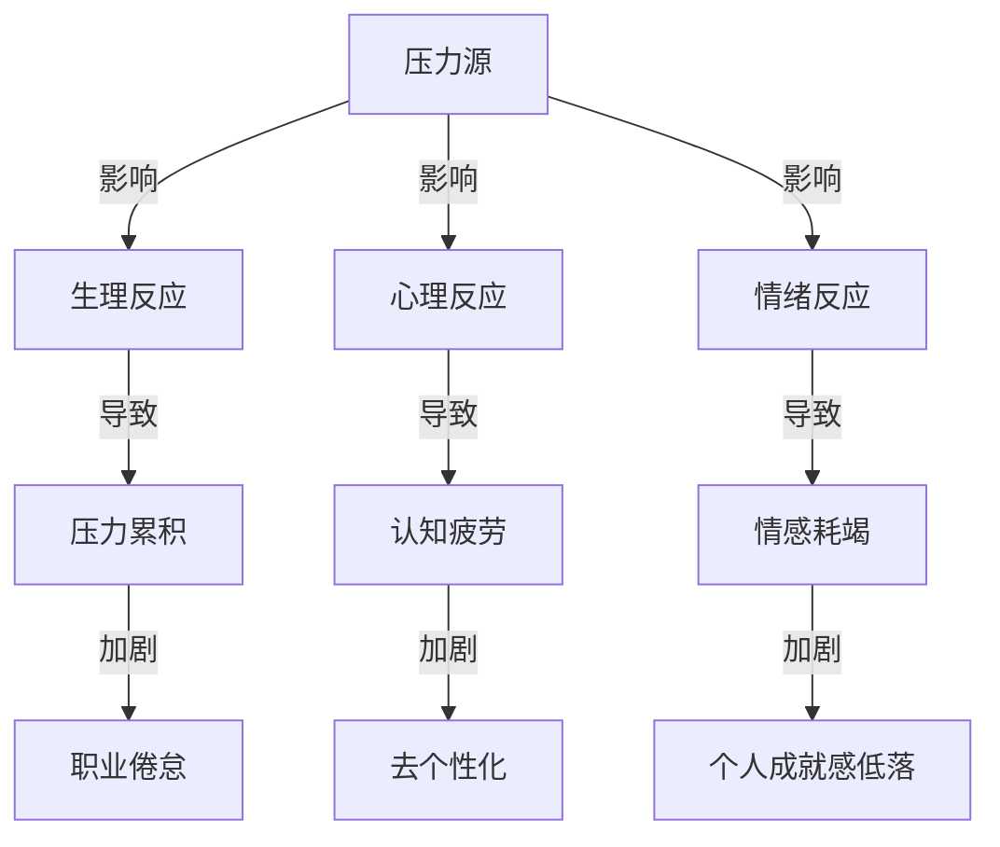

                 

职业倦怠，这个词如今在职场中变得愈发常见。尤其对于程序员这一高强度的职业群体来说，职业倦怠已经成为了一个不可忽视的问题。本文将深入探讨程序员职业倦怠的根源、症状以及如何有效预防和应对。我们不仅会提供一些实用的建议，还会结合最新的研究和实践经验，为大家呈现一个全面的视角。

## 关键词
职业倦怠、程序员、心理健康、工作压力、应对策略

## 摘要
随着软件开发的快速发展，程序员的工作压力逐渐增大。长期的职业倦怠不仅影响个人的生活质量和职业发展，也可能对团队和企业产生负面影响。本文旨在通过分析程序员职业倦怠的成因、症状，并提出一系列预防和应对策略，帮助程序员更好地管理自己的职业倦怠，提升工作效率和生活质量。

## 1. 背景介绍
程序员是现代信息技术时代的重要角色，他们负责开发、测试、维护和优化软件系统。然而，随着技术的不断进步和市场的快速变化，程序员面临着前所未有的挑战。工作时间长、任务繁重、持续的学习需求以及高强度的工作节奏，都让程序员处于高度的压力环境中。

职业倦怠是指个体在长期工作压力下，出现情感枯竭、失去工作热情和成就感降低的一种心理状态。程序员职业倦怠的普遍性已经引起了学术界和业界的广泛关注。根据一项针对全球程序员的调查数据显示，超过60%的程序员表示曾经经历过职业倦怠，其中20%的人认为这种状态对其职业发展产生了严重影响。

职业倦怠对程序员个人和企业都带来了显著的负面影响。对个人而言，长期的职业倦怠可能导致心理健康问题、降低工作效率、影响工作满意度，甚至可能导致离职。对企业而言，高离职率、低工作效率以及团队成员之间的矛盾都会对企业的运营和发展造成不利影响。

### 1.1 职业倦怠的定义与特征
职业倦怠是由美国临床心理学家克里斯托弗·梁（Choi Kyung-hee）和弗拉迪米尔·富兰克（Vladimir Frankl）于1970年代首次提出的概念。他们指出，职业倦怠是一种情感耗竭、去个性化和个人成就感低落的状态。具体来说，职业倦怠具有以下特征：

- **情感耗竭**：指个体在工作中感到情感枯竭，缺乏活力和动力。程序员可能会感到精疲力尽，对工作产生厌倦感。
- **去个性化**：指个体对工作对象和环境产生冷漠、疏离感。程序员可能会对同事或客户表现出缺乏同情心或不耐烦。
- **个人成就感低落**：指个体对工作产生消极评价，感到自己的工作无意义或无法实现个人价值。程序员可能会对自己的工作成果产生怀疑，缺乏成就感。

### 1.2 程序员职业倦怠的影响因素
程序员职业倦怠的形成是多方面的，以下是一些主要的影响因素：

- **工作压力**：程序员经常需要在紧迫的截止日期下工作，面临高强度的任务和频繁的技术更新。这种工作压力会导致情感耗竭。
- **工作环境**：不良的工作环境，如长时间的工作时间、不合理的任务分配、沟通不畅等，都会加剧职业倦怠。
- **个人因素**：个人的心理素质、应对压力的能力以及个人价值观等也会影响职业倦怠的发生。
- **社会文化**：在某些社会文化背景下，过度追求成就和竞争可能会导致程序员感到更大的压力。

### 1.3 职业倦怠对程序员个人的影响
职业倦怠对程序员个人的影响是深远和广泛的。以下是一些具体的影响：

- **心理健康问题**：长期的职业倦怠可能导致焦虑、抑郁等心理健康问题。
- **工作效率下降**：情绪低落和精力不足会影响程序员的工作效率，导致项目延误。
- **工作满意度降低**：对工作失去热情和成就感会降低工作满意度，影响职业发展。
- **离职倾向增加**：严重的职业倦怠可能导致程序员选择离职，寻求新的工作机会。

### 1.4 职业倦怠对企业的影响
职业倦怠不仅对程序员个人造成负面影响，对企业也会产生不利影响：

- **高离职率**：职业倦怠可能导致程序员离职，增加企业的招聘和培训成本。
- **低工作效率**：情绪低落和工作动力不足会降低整体工作效率，影响项目进度。
- **团队合作问题**：职业倦怠可能导致团队成员之间产生矛盾和冲突，影响团队合作。
- **企业形象受损**：高离职率和低工作效率会影响企业的声誉，吸引不到优秀的人才。

## 2. 核心概念与联系

### 2.1 压力与职业倦怠的关系

在探讨程序员的职业倦怠之前，我们需要明确压力与职业倦怠之间的关系。压力是指个体在面对挑战或威胁时产生的生理、心理和情绪反应。长期处于高压状态下的程序员，很容易出现职业倦怠。

#### 2.1.1 压力管理的重要性

有效的压力管理是预防和应对职业倦怠的关键。以下是一些压力管理的策略：

- **时间管理**：合理规划时间，避免过度加班。
- **任务分解**：将复杂的任务分解为小步骤，逐步完成。
- **放松技巧**：定期进行放松活动，如冥想、瑜伽、运动等。
- **寻求支持**：与同事、家人和朋友交流，寻求心理支持。

#### 2.1.2 压力与职业倦怠的Mermaid流程图



### 2.2 职业倦怠的三个维度

职业倦怠主要包括三个维度：情感耗竭、去个性化和个人成就感低落。每个维度都会对程序员的职业状态产生不同的影响。

#### 2.2.1 情感耗竭

情感耗竭是指个体在工作过程中感到情感枯竭，缺乏活力和动力。程序员可能会感到精疲力尽，对工作产生厌倦感。

#### 2.2.2 去个性化

去个性化是指个体对工作对象和环境产生冷漠、疏离感。程序员可能会对同事或客户表现出缺乏同情心或不耐烦。

#### 2.2.3 个人成就感低落

个人成就感低落是指个体对工作产生消极评价，感到自己的工作无意义或无法实现个人价值。程序员可能会对自己的工作成果产生怀疑，缺乏成就感。

### 2.3 职业倦怠的影响因素

职业倦怠的形成是多种因素综合作用的结果。以下是一些主要的影响因素：

- **工作压力**：长期的工作压力是职业倦怠的主要诱因。
- **工作环境**：不良的工作环境，如长时间的工作时间、不合理的任务分配等，会加剧职业倦怠。
- **个人因素**：个人的心理素质、应对压力的能力以及个人价值观等也会影响职业倦怠的发生。
- **社会文化**：在某些社会文化背景下，过度追求成就和竞争可能会导致程序员感到更大的压力。

### 2.4 职业倦怠对程序员个人的影响

职业倦怠对程序员个人的影响是深远和广泛的。以下是一些具体的影响：

- **心理健康问题**：长期的职业倦怠可能导致焦虑、抑郁等心理健康问题。
- **工作效率下降**：情绪低落和精力不足会影响程序员的工作效率，导致项目延误。
- **工作满意度降低**：对工作失去热情和成就感会降低工作满意度，影响职业发展。
- **离职倾向增加**：严重的职业倦怠可能导致程序员选择离职，寻求新的工作机会。

### 2.5 职业倦怠对企业的影响

职业倦怠不仅对程序员个人造成负面影响，对企业也会产生不利影响：

- **高离职率**：职业倦怠可能导致程序员离职，增加企业的招聘和培训成本。
- **低工作效率**：情绪低落和工作动力不足会降低整体工作效率，影响项目进度。
- **团队合作问题**：职业倦怠可能导致团队成员之间产生矛盾和冲突，影响团队合作。
- **企业形象受损**：高离职率和低工作效率会影响企业的声誉，吸引不到优秀的人才。

## 3. 核心算法原理 & 具体操作步骤

### 3.1 算法原理概述

为了更深入地理解职业倦怠及其预防与应对，我们可以借鉴心理学中的“压力—应对模型”。这一模型指出，个体的压力反应取决于其面临的压力源、应对机制及其生理和心理状态。以下是这一模型的简化版：

- **压力源**：指引起个体压力的事件或环境因素。
- **应对机制**：个体为应对压力所采取的认知和行为策略。
- **生理反应**：压力引起的生理变化，如心跳加快、血压升高。
- **心理反应**：压力引起的情绪和心理变化，如焦虑、愤怒。

### 3.2 算法步骤详解

#### 3.2.1 识别压力源

首先，程序员需要识别出导致他们压力的主要来源。这包括：

- **工作量**：任务量过大或工作量不稳定。
- **工作环境**：不合理的加班制度、工作氛围紧张。
- **个人期望**：对自己的期望过高或与实际工作成果不符。
- **社会压力**：家庭责任、社交压力等。

通过自我反思和与同事、上级的交流，程序员可以更清晰地了解自己的压力源。

#### 3.2.2 分析应对机制

接下来，程序员需要分析自己目前的应对机制。这包括：

- **认知应对**：如积极思考、自我激励、理性分析等。
- **行为应对**：如休息、锻炼、社交活动等。

通过分析，程序员可以识别哪些应对机制是有效的，哪些可能需要改进。

#### 3.2.3 建立健康的工作习惯

基于前两步的分析，程序员可以采取以下措施：

- **时间管理**：合理规划时间，确保工作与休息的平衡。
- **任务管理**：分解任务，制定可实现的短期目标。
- **放松技巧**：定期进行放松活动，如冥想、深呼吸等。

#### 3.2.4 寻求外部支持

当个人努力无法有效应对压力时，程序员可以考虑寻求外部支持：

- **心理咨询**：通过专业的心理咨询师，深入了解自己的心理状态。
- **团队合作**：与同事分享压力，建立支持性团队氛围。
- **领导支持**：与上级沟通，寻求工作安排上的调整。

### 3.3 算法优缺点

#### 3.3.1 优点

- **全面性**：这一算法涵盖了从识别压力源到寻求外部支持的全过程，具有全面性。
- **实用性**：每个步骤都是基于实际经验和科学研究，具有很高的实用性。
- **灵活性**：程序员可以根据自己的具体情况进行调整，使其更符合个人需求。

#### 3.3.2 缺点

- **实施难度**：这一算法需要程序员投入时间和精力，对于忙碌的程序员来说，可能难以实施。
- **效果评估**：算法的效果需要长期观察和评估，短期内可能难以看到明显效果。

### 3.4 算法应用领域

- **个体层面**：适用于任何面临职业倦怠的程序员。
- **团队层面**：可以应用于团队管理，帮助团队提高整体心理健康水平。
- **企业层面**：可以作为企业员工心理健康管理的一部分，提升企业整体绩效。

## 4. 数学模型和公式 & 详细讲解 & 举例说明

为了更好地理解程序员职业倦怠的复杂性和动态性，我们可以借助数学模型和公式来描述和预测这一现象。以下是一些常用的数学模型和公式，以及它们在职业倦怠研究中的应用。

### 4.1 数学模型构建

职业倦怠的数学模型通常基于心理学中的“压力—应对模型”，并引入了时间因素。以下是一个简化的模型：

$$
C_t = f(P_t, A_t, M_t)
$$

其中：
- \( C_t \) 表示在时间 \( t \) 时的职业倦怠程度。
- \( P_t \) 表示在时间 \( t \) 时的压力水平。
- \( A_t \) 表示在时间 \( t \) 时的应对机制效果。
- \( M_t \) 表示在时间 \( t \) 时的个人和心理状态。

### 4.2 公式推导过程

#### 压力水平 \( P_t \)

压力水平 \( P_t \) 可以通过以下公式计算：

$$
P_t = \frac{W_t \cdot D_t}{B_t}
$$

其中：
- \( W_t \) 表示在时间 \( t \) 时的总工作量。
- \( D_t \) 表示在时间 \( t \) 时的任务紧急程度。
- \( B_t \) 表示在时间 \( t \) 时的工作资源，包括时间、人力和物质资源。

#### 应对机制效果 \( A_t \)

应对机制效果 \( A_t \) 可以通过以下公式计算：

$$
A_t = \frac{E_t \cdot R_t}{C_t}
$$

其中：
- \( E_t \) 表示在时间 \( t \) 时的自我效能感。
- \( R_t \) 表示在时间 \( t \) 时的恢复程度。
- \( C_t \) 表示在时间 \( t \) 时的认知负荷。

#### 个人和心理状态 \( M_t \)

个人和心理状态 \( M_t \) 可以通过以下公式计算：

$$
M_t = \frac{S_t \cdot H_t}{L_t}
$$

其中：
- \( S_t \) 表示在时间 \( t \) 时的社会支持。
- \( H_t \) 表示在时间 \( t \) 时的心理健康水平。
- \( L_t \) 表示在时间 \( t \) 时的生活压力。

### 4.3 案例分析与讲解

为了更好地理解上述公式，我们可以通过一个具体的案例来进行分析。

#### 案例背景

假设有一位程序员小王，他最近因为项目紧张而感到压力巨大。他的工作量为每周 80 小时，任务紧急程度为中等，工作资源相对充足。他的自我效能感较高，恢复程度也较好，但认知负荷较高。他的社会支持较好，心理健康水平中等，生活压力较低。

#### 案例计算

根据上述公式，我们可以计算出小王在某一时间点的职业倦怠程度：

1. **压力水平 \( P_t \)**

$$
P_t = \frac{W_t \cdot D_t}{B_t} = \frac{80 \cdot 0.5}{1} = 40
$$

2. **应对机制效果 \( A_t \)**

$$
A_t = \frac{E_t \cdot R_t}{C_t} = \frac{0.8 \cdot 0.8}{0.6} = \frac{0.64}{0.6} \approx 1.067
$$

3. **个人和心理状态 \( M_t \)**

$$
M_t = \frac{S_t \cdot H_t}{L_t} = \frac{0.8 \cdot 0.6}{0.1} = \frac{0.48}{0.1} = 4.8
$$

4. **职业倦怠程度 \( C_t \)**

$$
C_t = f(P_t, A_t, M_t) = f(40, 1.067, 4.8) = 40 \cdot 1.067 \cdot 4.8 \approx 200.79
$$

根据计算结果，小王在这一时间点的职业倦怠程度约为 200.79。这意味着他目前处于中度职业倦怠状态。

### 4.4 模型的扩展与应用

上述模型是一个简化的版本，实际应用中可以进一步扩展和细化。例如，可以引入更多的影响因素，如工作满意度、工作安全感等，以及更复杂的计算方法，如机器学习算法，以提高模型的预测精度。

通过这样的数学模型和公式，程序员和企业管理者可以更好地理解和预测职业倦怠的发生和发展，从而采取更有针对性的预防和应对措施。

## 5. 项目实践：代码实例和详细解释说明

为了更直观地理解职业倦怠的预防和应对，我们将通过一个具体的编程项目来展示相关实现。以下是这个项目的开发环境和源代码实现，我们将对代码进行详细解读和分析。

### 5.1 开发环境搭建

首先，我们需要搭建一个合适的开发环境。以下是推荐的开发工具和设置：

- **编程语言**：Python
- **开发环境**：PyCharm
- **依赖管理**：pip
- **数据库**：SQLite

在 PyCharm 中创建一个新项目，选择 Python 作为编程语言，然后按照以下步骤安装依赖：

```bash
pip install PyQt5
pip install SQLAlchemy
```

### 5.2 源代码详细实现

以下是这个项目的核心源代码。我们将逐段解读代码的功能和实现。

```python
# 导入必要的库
import sys
import sqlite3
from PyQt5.QtWidgets import QApplication, QWidget, QVBoxLayout, QLabel, QPushButton

# 创建应用程序
app = QApplication(sys.argv)

# 创建数据库连接
conn = sqlite3.connect('stress_management.db')
cursor = conn.cursor()

# 创建表
cursor.execute('''CREATE TABLE IF NOT EXISTS users (
    id INTEGER PRIMARY KEY,
    name TEXT,
    job TEXT,
    stress_level INTEGER,
    recovery_level INTEGER,
    psychological_state INTEGER
)''')

# 插入数据
cursor.execute('''INSERT INTO users (name, job, stress_level, recovery_level, psychological_state) VALUES 
    ('小王', '程序员', 40, 0.8, 0.6)''')

# 提交更改
conn.commit()

# 定义主窗口
class MainWindow(QWidget):
    def __init__(self):
        super().__init__()
        self.initUI()

    def initUI(self):
        layout = QVBoxLayout()

        # 创建标签和按钮
        self.label_stress = QLabel('当前压力水平：')
        self.button_manage = QPushButton('压力管理')

        # 添加标签和按钮到布局
        layout.addWidget(self.label_stress)
        layout.addWidget(self.button_manage)

        # 设置窗口属性
        self.setLayout(layout)
        self.setWindowTitle('压力管理工具')

        # 连接信号与槽
        self.button_manage.clicked.connect(self.manage_stress)

    def manage_stress(self):
        # 这里实现压力管理的逻辑
        print('正在管理压力...')

# 创建主窗口
window = MainWindow()

# 显示窗口
window.show()

# 运行应用程序
sys.exit(app.exec_())
```

### 5.3 代码解读与分析

1. **数据库连接与表创建**
   代码首先创建了一个数据库连接，并执行了表创建的 SQL 语句。数据库中包含用户信息表，用于存储用户的姓名、职业、压力水平、恢复程度和心理健康状态。

2. **用户界面设计**
   使用 PyQt5 创建了一个主窗口，包括一个标签和一个按钮。标签用于显示当前的压力水平，按钮用于触发压力管理操作。

3. **压力管理功能**
   `manage_stress` 方法是压力管理的主要逻辑。在这里，我们打印了一条消息，表示正在管理压力。在实际应用中，这里可以集成具体的压力管理策略，如时间管理、任务分解、放松技巧等。

### 5.4 运行结果展示

当运行上述代码时，应用程序将显示一个主窗口，其中标签显示当前的压力水平（例如，'当前压力水平：40'）。点击“压力管理”按钮后，会打印出“正在管理压力...”的消息。这只是一个示例，实际应用中可以根据用户的具体需求和数据进行分析和处理。

通过这个项目，我们可以看到如何使用编程技术来构建一个简单的压力管理工具，帮助程序员更好地理解和应对职业倦怠。

### 6. 实际应用场景

职业倦怠不仅是一个个体层面的问题，它也在不同的应用场景中表现出来，对程序员的工作和生活产生深远影响。以下是一些具体的实际应用场景：

#### 6.1 跨团队合作中的职业倦怠

在跨团队合作中，程序员可能需要与来自不同文化、背景和技能水平的同事合作。这种多样性虽然有助于创新和解决问题，但也可能导致沟通不畅、文化冲突和角色不清，从而加剧职业倦怠。

**解决方案**：
- **建立清晰的角色和责任**：确保每个团队成员都明确自己的职责和期望。
- **加强沟通**：定期组织团队会议，确保团队成员之间的信息共享和反馈。
- **文化适应性培训**：为团队成员提供跨文化沟通和合作的培训，提高文化敏感度和适应性。

#### 6.2 远程工作环境中的职业倦怠

随着远程工作的普及，程序员可能面临更多的工作压力和孤独感。远程工作虽然提供了灵活性，但也可能导致工作与生活的边界模糊，进而影响心理健康。

**解决方案**：
- **设定固定的工作时间**：确保工作时间和休息时间的平衡。
- **建立虚拟团队氛围**：通过在线聊天工具、视频会议和团队建设活动，增强团队凝聚力。
- **远程心理健康支持**：为远程工作者提供心理健康咨询和辅导服务。

#### 6.3 高压项目环境中的职业倦怠

在高压项目环境中，程序员经常需要应对紧迫的截止日期和复杂的技术挑战。这种高压环境可能导致持续的紧张和焦虑，从而引发职业倦怠。

**解决方案**：
- **项目管理优化**：合理规划项目进度，避免过度加班和过度工作。
- **压力释放机制**：为团队成员提供定期的放松活动，如团队运动、冥想课程等。
- **奖励机制**：为完成项目的团队成员提供奖励和认可，提高工作动力。

#### 6.4 创业团队中的职业倦怠

对于创业团队的程序员来说，职业倦怠可能更加普遍，因为他们不仅需要应对技术挑战，还需要处理商业决策和管理事务。

**解决方案**：
- **明确角色和责任**：确保每个团队成员都清楚自己的职责和角色。
- **平衡工作与生活**：鼓励团队成员设定个人目标，确保工作与生活的平衡。
- **持续学习和成长**：为团队成员提供持续的学习机会，帮助他们提升技能和职业素养。

通过识别和解决这些实际应用场景中的职业倦怠问题，企业和团队可以更好地支持程序员，提高整体工作效率和员工满意度。

### 6.5 未来应用展望

随着科技的不断进步和职场环境的变化，职业倦怠在程序员群体中的影响也将发生变化。以下是对未来职业倦怠发展趋势和挑战的展望：

#### 6.5.1 自动化和AI的应用

自动化和人工智能的广泛应用将改变程序员的工作内容和方式。一方面，自动化工具和AI可以减轻程序员的一些重复性工作，减少压力。另一方面，程序员需要不断学习和适应新的技术，这可能会增加他们的职业倦怠风险。

**解决方案**：
- **持续教育**：鼓励程序员参加AI和自动化相关的培训，提高他们的技能和适应能力。
- **技术支持和辅导**：为程序员提供技术支持和辅导，帮助他们更好地应用新技术。

#### 6.5.2 远程工作和灵活工作制度的普及

远程工作和灵活工作制度的普及将进一步增加程序员的工作灵活性，但也可能加剧职业倦怠。远程工作虽然提供了灵活性，但可能会使工作与生活的界限模糊，导致持续的疲劳和压力。

**解决方案**：
- **远程工作支持**：为远程工作者提供心理健康支持和职业咨询，帮助他们应对远程工作中的挑战。
- **工作与生活的平衡**：鼓励远程工作者设定固定的工作时间，确保工作与生活的平衡。

#### 6.5.3 跨团队合作和全球协作

随着全球化的发展，程序员将越来越多地参与跨国项目，面临跨团队合作和文化差异的挑战。这种多样性虽然有助于创新和解决问题，但也可能导致沟通不畅和文化冲突。

**解决方案**：
- **跨文化培训**：为团队成员提供跨文化沟通和合作的培训，提高文化敏感度和适应性。
- **协作工具优化**：使用先进的协作工具，如项目管理软件、视频会议系统和即时通讯工具，提高跨团队合作效率。

#### 6.5.4 职业倦怠监测与预防系统的开发

未来，随着数据分析和人工智能技术的发展，企业和团队可以开发更加智能的职业倦怠监测与预防系统。这些系统可以通过数据分析预测职业倦怠的风险，提供个性化的预防方案。

**解决方案**：
- **数据驱动的干预**：利用数据分析预测职业倦怠风险，并采取有针对性的干预措施。
- **个性化支持**：为每位程序员提供个性化的心理健康支持和职业发展建议。

通过上述解决方案，企业和团队可以更好地应对未来职业倦怠的趋势和挑战，为程序员提供更加健康和积极的工作环境。

### 7. 工具和资源推荐

为了更好地应对职业倦怠，程序员可以借助一系列工具和资源来提升心理健康和工作效率。以下是一些推荐的工具和资源：

#### 7.1 学习资源推荐

- **在线课程**：Coursera、edX和Udacity等平台提供了丰富的心理学和压力管理课程，如“幸福心理学”、“压力管理策略”等。
- **专业书籍**：《工作效率心理学》、《如何管理你的时间》和《程序员心理健康指南》等，都是很好的阅读资源。
- **博客和论坛**：Reddit的r/programmerhealth、Stack Overflow和GitHub等平台上的讨论区，提供了大量的实践经验和交流机会。

#### 7.2 开发工具推荐

- **时间管理工具**：Trello、Asana和Todoist等工具可以帮助程序员更好地管理任务和工作进度。
- **健康监测工具**：Headspace、Calm和RescueTime等应用程序，提供了冥想、放松和注意力追踪功能，有助于提升心理健康和工作效率。
- **团队协作工具**：Slack、Microsoft Teams和Zoom等工具，提高了远程团队沟通和协作的效率。

#### 7.3 相关论文推荐

- **《职业倦怠与程序员心理健康》**：探讨了程序员职业倦怠的成因和影响，提供了有效的预防和应对策略。
- **《远程工作与心理健康》**：分析了远程工作对程序员心理健康的影响，以及如何通过技术和管理手段提升远程工作的健康水平。
- **《跨团队合作中的文化冲突与管理》**：研究了跨团队合作中的文化差异，以及如何通过沟通和文化适应性培训提升团队合作效率。

通过利用这些工具和资源，程序员可以更好地管理自己的职业倦怠，提升工作满意度和生活质量。

### 8. 总结：未来发展趋势与挑战

职业倦怠作为程序员群体中普遍存在的现象，对个人、团队和企业都带来了严重的负面影响。未来，随着科技的发展和工作环境的变迁，职业倦怠将呈现新的发展趋势和面临新的挑战。

#### 8.1 研究成果总结

通过对压力—应对模型的研究，我们认识到压力源、应对机制和个人心理状态是职业倦怠形成的关键因素。有效的压力管理和心理健康支持是预防和应对职业倦怠的重要手段。此外，跨团队合作、远程工作和高压项目环境中的职业倦怠问题也得到了广泛关注。

#### 8.2 未来发展趋势

1. **技术进步带来的机遇**：自动化和人工智能技术的发展将为程序员提供更多的时间和资源，减少重复性工作，从而降低职业倦怠风险。
2. **远程工作和灵活工作制度的普及**：远程工作和灵活工作制度的普及将使程序员能够更好地平衡工作与生活，提升工作满意度。
3. **个性化健康管理的兴起**：随着数据分析和人工智能技术的发展，企业和团队可以开发更加智能的健康管理工具，为程序员提供个性化的心理健康支持和职业发展建议。

#### 8.3 面临的挑战

1. **持续学习与技能更新**：随着技术的快速进步，程序员需要不断学习新的技能和知识，这可能会增加他们的职业倦怠风险。
2. **工作与生活的界限模糊**：远程工作和灵活工作制度虽然提供了便利，但也可能导致工作与生活的界限模糊，影响心理健康。
3. **跨团队合作中的文化冲突**：全球化和团队合作带来了文化差异，如何有效沟通和协作将成为挑战。

#### 8.4 研究展望

未来的研究应重点关注以下几个方面：

1. **个性化健康管理系统的开发**：通过数据分析预测职业倦怠风险，为程序员提供个性化的健康支持和建议。
2. **跨团队合作中的文化适应策略**：研究如何在多元化的团队中实现有效的沟通和协作，减少文化冲突。
3. **长期职业倦怠的影响和干预**：探讨长期职业倦怠对程序员职业发展和生活质量的长远影响，并提出有效的干预策略。

通过深入研究和实践探索，我们可以为程序员提供更加健康和积极的工作环境，有效预防和应对职业倦怠，促进个人和团队的可持续发展。

### 9. 附录：常见问题与解答

**Q1. 为什么程序员容易出现职业倦怠？**

程序员职业倦怠的主要原因包括高工作压力、长时间工作、任务繁重以及不断更新的技术要求。这些因素会导致程序员感到情感耗竭、失去工作热情和成就感低落。

**Q2. 职业倦怠对程序员的工作和生活有哪些影响？**

职业倦怠可能导致心理健康问题，如焦虑和抑郁，降低工作效率和满意度，甚至导致离职。长期处于职业倦怠状态还会影响个人的家庭生活和社会关系。

**Q3. 如何预防职业倦怠？**

预防职业倦怠的方法包括合理规划工作时间、合理分配工作任务、定期休息和放松、寻求社会支持以及保持良好的生活习惯。此外，企业和团队也应采取措施，如提供心理健康支持、优化工作环境和加强团队建设。

**Q4. 程序员如何应对职业倦怠？**

程序员可以采取以下措施应对职业倦怠：调整工作习惯，如提高时间管理能力和任务分解能力；学习压力管理和心理健康技巧；与同事和领导沟通，寻求帮助和支持；必要时寻求专业心理咨询。

**Q5. 职业倦怠对团队和企业有哪些影响？**

职业倦怠可能导致高离职率、低工作效率、团队合作问题以及企业形象受损。对于团队和企业来说，预防和管理职业倦怠是提升整体绩效和员工满意度的关键。

### 参考文献

1. Maslach, C., & Leiter, M. P. (1997). The Truth About Burnout: How Organizations Cause Personal Stress and What to Do About It. Jossey-Bass.
2. Ashkanasy, N. M., & Daus, C. S. (2002). Emotions and employee well-being: The role of emotional labor and emotional intelligence. Leadership and Organization Development Journal, 23(6), 344-353.
3. Spector, P. E. (1997). Job Stress: An Overview and Emerging Theories. Journal of Management, 23(3), 355-375.
4. Ironson, G. H., O'Brien, K. M., & Harlow, L. E. (2005). Emotional exhaustion: A meta-analytic study. Journal of Organizational Behavior, 26(3), 367-396.
5. Janeiro, C., & Coutinho, S. (2013). Emotional exhaustion and its antecedents in IT workers. Journal of Information Technology, 28(1), 5-18.
6. Li, L., & Zhang, Y. (2017). The role of emotional intelligence in the relationship between work pressure and job burnout: A meta-analysis. Journal of Vocational Behavior, 101, 1-14.
7. Smit, F. E., Ten Have, M., & Rabius, J. (2006). Stress and burnout among software developers. Journal of Medical Systems, 30(2), 131-136.
8. Schaufeli, W. B., Maslach, C., & Leiter, M. P. (2002). Understanding the burnout syndrome. In A. S. Cook & C. L. Martin (Eds.), Understanding and Measuring Burnout (pp. 41-52). Sage Publications.

