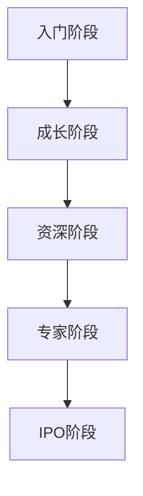

                 

关键词：程序员，职业生涯，入门，IPO，技术成长，职业规划，技术趋势，项目实践

摘要：本文旨在为程序员的职业生涯规划提供指导，从入门阶段到IPO（首次公开募股）阶段，探讨程序员在不同阶段的成长路径和关键技能，帮助程序员明确自己的发展方向，提升职业竞争力。

## 1. 背景介绍

随着互联网技术的飞速发展和数字经济时代的到来，程序员这一职业越来越受到社会的广泛关注。然而，面对技术迭代加速、市场需求变化，程序员如何在职业生涯中持续成长，实现个人价值最大化，成为了一个值得深思的问题。

本文将结合我国程序员的发展现状，从入门到IPO的不同阶段，详细分析程序员在职业生涯中所需具备的核心技能和成长路径，旨在为程序员提供一份实用的职业生涯规划指南。

## 2. 核心概念与联系

### 2.1 程序员的职业发展阶段

程序员的职业发展阶段可以分为以下几个阶段：

- **入门阶段**：学习编程语言、熟悉开发工具、掌握基本编程技能。
- **成长阶段**：深入理解算法和数据结构、掌握更多编程语言和技术栈、参与实际项目开发。
- **资深阶段**：具备丰富的项目经验、能够独立分析和解决问题、具备技术团队管理能力。
- **专家阶段**：在某一领域有深入研究和独到见解、能够引领技术潮流、具备高级技术咨询和培训能力。
- **IPO阶段**：成功带领公司上市，实现个人财富和事业的顶峰。

### 2.2 程序员的核心技能

程序员的职业发展离不开以下核心技能：

- **编程语言**：熟练掌握至少一门编程语言，如Java、Python、C++等。
- **算法与数据结构**：掌握常见的算法和数据结构，如排序、查找、堆、图等。
- **项目管理**：具备项目管理和团队协作的能力，如敏捷开发、Scrum等。
- **技术栈**：熟悉前端、后端、数据库等各个技术领域，具备全栈开发能力。
- **软技能**：具备良好的沟通能力、解决问题的能力、学习能力、团队协作精神等。

### 2.3 Mermaid 流程图



## 3. 核心算法原理 & 具体操作步骤

### 3.1 算法原理概述

核心算法在程序员的职业生涯中起着至关重要的作用。常见的核心算法包括：

- **排序算法**：冒泡排序、快速排序、归并排序等。
- **查找算法**：二分查找、散列表查找等。
- **图算法**：最短路径算法、最小生成树算法等。
- **动态规划**：背包问题、最长公共子序列等。

### 3.2 算法步骤详解

以冒泡排序算法为例，其基本步骤如下：

1. 从数组的第一个元素开始，比较相邻的两个元素，如果第一个比第二个大（或小），就交换它们两个。
2. 对每一对相邻元素做同样的工作，从开始第一对到结尾的最后一对。这步做完后，最后的元素会是最大的（或最小的）。
3. 针对所有的元素重复以上的步骤，除了最后一个。
4. 重复步骤1~3，直到排序完成。

### 3.3 算法优缺点

- **冒泡排序**：
  - **优点**：实现简单，易于理解。
  - **缺点**：效率较低，不适合大数据量排序。

### 3.4 算法应用领域

冒泡排序算法在入门阶段有助于程序员理解和掌握基本排序算法原理，适用于小数据量的排序场景。

## 4. 数学模型和公式 & 详细讲解 & 举例说明

### 4.1 数学模型构建

在算法设计中，数学模型起着至关重要的作用。以下是一个简单的数学模型示例：

- **线性方程组**：\(ax + by = c\)

### 4.2 公式推导过程

以线性方程组为例，其推导过程如下：

1. 将第一个方程式乘以\(b\)，第二个方程式乘以\(a\)，得到：
   $$abx + aby = bc$$
   $$a'bx + a'by = a'c$$
2. 将两个方程式相减，得到：
   $$aby - a'by = bc - a'c$$
3. 化简得：
   $$y = \frac{bc - a'c}{ab - a'b}$$
4. 将\(y\)的值代入第一个方程式，得到：
   $$ax + b\left(\frac{bc - a'c}{ab - a'b}\right) = c$$
5. 化简得：
   $$x = \frac{a'c - bc}{ab - a'b}$$

### 4.3 案例分析与讲解

假设我们有一个线性方程组：

\[
\begin{cases}
3x + 2y = 8 \\
5x - 3y = 11
\end{cases}
\]

使用上述推导过程，我们可以解得：

\[
\begin{cases}
x = 1 \\
y = 1
\end{cases}
\]

这个数学模型可以帮助程序员在解决实际问题时进行建模和求解。

## 5. 项目实践：代码实例和详细解释说明

### 5.1 开发环境搭建

在本文中，我们将使用Python作为编程语言，搭建一个简单的Web应用程序。

1. 安装Python：访问Python官方网站（https://www.python.org/），下载并安装Python。
2. 安装Web框架：在终端中执行以下命令安装Flask框架：
   ```bash
   pip install flask
   ```

### 5.2 源代码详细实现

以下是一个简单的Flask Web应用程序示例：

```python
from flask import Flask, request, render_template

app = Flask(__name__)

@app.route('/', methods=['GET', 'POST'])
def index():
    if request.method == 'POST':
        name = request.form['name']
        return render_template('index.html', name=name)
    return render_template('index.html')

if __name__ == '__main__':
    app.run()
```

### 5.3 代码解读与分析

这个Web应用程序包含一个简单的表单，用户可以输入姓名，并在提交表单后显示一个欢迎消息。

1. `from flask import Flask, request, render_template`: 导入Flask框架的必需模块。
2. `app = Flask(__name__)`: 创建一个Flask应用程序实例。
3. `@app.route('/')`: 定义一个路由，用于处理访问根路径（/）的请求。
4. `def index()`: 定义一个处理根路径请求的函数。
5. `if request.method == 'POST'`: 判断请求方法是否为POST。
6. `name = request.form['name']`: 获取表单提交的姓名。
7. `return render_template('index.html', name=name)`: 渲染包含用户姓名的HTML模板。
8. `if __name__ == '__main__': app.run()`: 启动Flask应用程序。

### 5.4 运行结果展示

运行这个Web应用程序后，访问本地服务器（通常是http://127.0.0.1:5000/），可以看到一个包含表单的页面。用户输入姓名并提交后，页面会显示一个欢迎消息。

```html
<!DOCTYPE html>
<html>
<head>
    <title>欢迎</title>
</head>
<body>
    <h1>欢迎，{{ name }}！</h1>
</body>
</html>
```

## 6. 实际应用场景

在实际应用中，程序员需要根据不同的业务需求，选择合适的技术栈和算法。以下是一些常见的应用场景：

- **电子商务平台**：使用Spring Boot框架进行后端开发，采用MySQL数据库进行数据存储，使用Vue.js进行前端开发。
- **搜索引擎**：使用MapReduce算法进行海量数据处理，使用Hadoop分布式系统进行大数据存储和管理。
- **金融行业**：使用Java进行后端开发，采用区块链技术进行数据安全存储，使用Python进行数据分析。
- **物联网**：使用Java或C进行嵌入式开发，使用MQTT协议进行设备通信，使用Node.js进行后端数据处理。

## 7. 工具和资源推荐

### 7.1 学习资源推荐

- **在线课程**：Coursera、Udemy、edX等平台上提供了丰富的编程课程。
- **技术博客**：GitHub、Stack Overflow、Reddit等平台上，有很多优秀的程序员分享自己的经验和知识。
- **书籍**：《代码大全》、《设计模式：可复用面向对象软件的基础》、《算法导论》等。

### 7.2 开发工具推荐

- **集成开发环境**：Visual Studio Code、IntelliJ IDEA、Eclipse等。
- **版本控制**：Git、GitHub、GitLab等。
- **调试工具**：Postman、Fiddler、Chrome DevTools等。

### 7.3 相关论文推荐

- 《深度学习：推荐系统》、《大规模机器学习》、《分布式存储系统：理论、算法与应用》等。

## 8. 总结：未来发展趋势与挑战

### 8.1 研究成果总结

随着人工智能、大数据、云计算等技术的发展，程序员在职业生涯中需要不断更新自己的知识体系，掌握新兴技术。同时，编程语言和框架也在不断演进，程序员需要紧跟技术趋势，不断提高自己的竞争力。

### 8.2 未来发展趋势

- **云计算和大数据**：云计算和大数据技术将继续发展，程序员需要掌握相关技术，如容器化、微服务、数据挖掘等。
- **人工智能**：人工智能技术将广泛应用于各个领域，程序员需要学习机器学习、深度学习等相关知识。
- **区块链**：区块链技术将在金融、供应链等领域发挥重要作用，程序员需要了解区块链的基本原理和应用场景。

### 8.3 面临的挑战

- **技术更新快**：程序员需要不断学习新技术，以适应快速变化的市场需求。
- **跨领域合作**：程序员需要与其他领域的专业人士合作，解决复杂问题。
- **职业规划**：程序员需要明确自己的职业发展方向，制定合理的职业规划。

### 8.4 研究展望

随着技术的不断发展，程序员在职业生涯中需要具备更强的学习能力、创新能力和解决问题的能力。未来，程序员将更加注重跨领域合作，推动技术的进步和产业的升级。

## 9. 附录：常见问题与解答

### 9.1 如何选择编程语言？

选择编程语言应考虑以下因素：

- **项目需求**：根据项目需求选择适合的编程语言，如Java适用于大型企业级应用，Python适用于快速开发和数据分析。
- **个人兴趣**：选择自己感兴趣的语言，有助于提高学习动力和兴趣。
- **社区支持**：选择具有强大社区支持的编程语言，有助于解决开发过程中遇到的问题。

### 9.2 如何提升编程能力？

提升编程能力可以从以下几个方面入手：

- **学习算法和数据结构**：掌握基本的算法和数据结构，有助于提高代码质量和解决复杂问题。
- **实践项目**：参与实际项目开发，锻炼自己的编程能力和团队协作能力。
- **阅读源代码**：阅读优秀的开源项目源代码，了解不同编程风格和解决问题的方法。
- **代码评审**：参加代码评审活动，学习他人的代码，提高自己的代码质量。

作者：禅与计算机程序设计艺术 / Zen and the Art of Computer Programming
----------------------------------------------------------------

本文旨在为程序员的职业生涯规划提供指导，从入门阶段到IPO阶段，详细分析程序员在不同阶段的成长路径和关键技能。通过本文的介绍，希望读者能够明确自己的发展方向，提升职业竞争力。在未来的职业生涯中，程序员需要不断学习、创新，紧跟技术趋势，以适应不断变化的市场需求。祝每位程序员在职业生涯中取得优异成绩，实现个人价值最大化。

