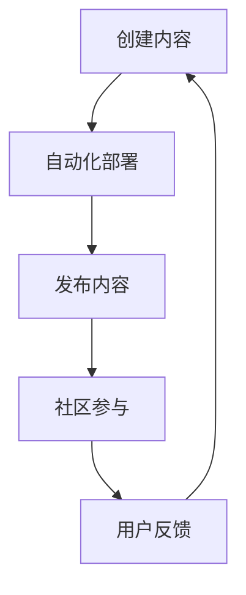

                 

关键词：被动收入、持续创作、自动化部署、收益最大化、多渠道收入来源、代码质量、社区参与

> 摘要：本文将探讨程序员如何构建和维持被动收入渠道，通过自动化部署、持续创作和社区参与，实现收益的最大化。文章将详细分析多个实际案例，并提供实用的工具和资源推荐，帮助程序员在技术领域建立稳定的收入来源。

## 1. 背景介绍

在当今快速发展的技术时代，程序员面临着前所未有的机遇与挑战。除了传统的工资收入，越来越多的程序员开始探索被动收入渠道，以提高财务自由度和生活的稳定性。被动收入指的是通过一次性的努力创造内容或服务，然后通过自动化的方式持续获得收益的过程。

### 被动收入的优势

- **时间自由**：被动收入允许程序员在创作内容后，有更多的时间进行其他活动，比如休息、学习新技术或进行个人项目。
- **收益可持续**：一旦内容或服务建立并自动化，其收益可以持续多年，甚至数十年。
- **降低风险**：通过多样化的收入渠道，程序员可以减少依赖单一收入来源的风险。

### 被动收入的挑战

- **初始投资**：构建被动收入渠道往往需要一定的初始投资，包括时间、金钱和技术。
- **持续维护**：被动收入并不是“躺着赚钱”，它需要定期的维护和更新，以保持其吸引力和收益。
- **市场变化**：技术市场和消费者偏好可能会快速变化，程序员需要灵活应对，调整策略。

## 2. 核心概念与联系

为了构建有效的被动收入渠道，程序员需要了解以下几个核心概念，并理解它们之间的联系。

### 2.1 自动化部署

自动化部署是指将应用程序或服务自动发布到生产环境的过程。它减少了手动操作的时间，提高了效率和稳定性。

### 2.2 持续创作

持续创作指的是定期更新和发布高质量的内容或服务，以保持对用户的吸引力和参与度。

### 2.3 社区参与

社区参与是指通过建立和维护一个活跃的社区，促进用户参与、反馈和贡献，从而提高项目的质量和影响力。

以下是构建被动收入的Mermaid流程图：



## 3. 核心算法原理 & 具体操作步骤

### 3.1 算法原理概述

被动收入的核心在于创建可重复利用的价值，并通过自动化和社区参与实现持续收益。以下是构建被动收入的几个关键步骤：

- **内容创作**：创作有价值的内容，如教程、工具或软件。
- **自动化部署**：使用CI/CD流程自动化部署内容到生产环境。
- **持续更新**：定期更新内容，以保持其相关性和吸引力。
- **社区互动**：建立社区，鼓励用户参与，收集反馈，提高项目质量。

### 3.2 算法步骤详解

#### 3.2.1 创建内容

1. **确定内容类型**：选择有市场需求的内容类型，如开源软件、博客文章或在线课程。
2. **创作内容**：按照高质量标准创作内容，确保内容具有实用性和吸引力。
3. **内容格式**：选择合适的格式，如Markdown、PDF或视频，以适应不同的用户需求。

#### 3.2.2 自动化部署

1. **选择部署工具**：使用如Jenkins、GitLab CI/CD等工具自动化部署内容。
2. **编写部署脚本**：编写脚本以自动化构建、测试和部署过程。
3. **测试部署流程**：在本地环境中测试部署流程，确保其稳定性和效率。

#### 3.2.3 持续更新

1. **定期更新**：制定更新计划，确保内容始终保持最新。
2. **自动化更新**：使用自动化工具如GitHub Actions定期更新内容。
3. **版本控制**：使用Git等版本控制系统管理内容的版本和变更。

#### 3.2.4 社区互动

1. **建立社区**：在GitHub、Reddit或Discord等平台上建立社区。
2. **鼓励参与**：通过激励措施鼓励用户参与，如提供免费内容或积分。
3. **收集反馈**：定期收集用户反馈，以改进内容和服务。

### 3.3 算法优缺点

#### 优点

- **高效**：自动化部署和持续更新节省了大量时间和资源。
- **可持续**：社区参与和持续创作确保了收入的长期稳定性。
- **灵活**：可以根据市场需求和用户反馈灵活调整策略。

#### 缺点

- **初始投资**：构建被动收入渠道可能需要较大的初始投资。
- **维护成本**：需要定期维护和更新内容，以保持其质量和吸引力。
- **依赖市场**：技术市场和消费者偏好可能会影响收益。

### 3.4 算法应用领域

被动收入适用于多个领域，包括但不限于：

- **开源软件**：通过捐赠、赞助或商业支持实现被动收入。
- **在线教育**：通过课程订阅、付费教程或在线培训实现收入。
- **内容创作**：通过博客、视频或社交媒体广告实现被动收入。

## 4. 数学模型和公式 & 详细讲解 & 举例说明

### 4.1 数学模型构建

为了最大化被动收入，我们可以构建以下数学模型：

收益 = （订阅用户数 * 订阅费用）+（赞助用户数 * 赞助费用）+（广告收入）

### 4.2 公式推导过程

1. **订阅收入**：订阅用户数乘以订阅费用。
2. **赞助收入**：赞助用户数乘以赞助费用。
3. **广告收入**：广告收入可以通过CPC（每点击成本）或CPM（每千次展示成本）计算。

### 4.3 案例分析与讲解

假设我们有一个开源项目，每月有100个订阅用户，每个用户的订阅费用为10美元；同时，每月有50个赞助用户，每个用户的赞助费用为20美元；广告收入为每月1000美元。我们可以计算每月的总收入：

订阅收入 = 100 * 10 = 1000美元
赞助收入 = 50 * 20 = 1000美元
广告收入 = 1000美元
总收入 = 1000 + 1000 + 1000 = 3000美元

通过这个例子，我们可以看到如何使用数学模型计算被动收入的收益。

## 5. 项目实践：代码实例和详细解释说明

### 5.1 开发环境搭建

在开始构建被动收入项目之前，我们需要搭建一个合适的开发环境。以下是一个简单的步骤：

1. **安装Git**：使用Git进行版本控制和代码管理。
2. **安装Jenkins**：使用Jenkins进行自动化部署。
3. **安装Node.js**：使用Node.js构建后端服务。

### 5.2 源代码详细实现

以下是一个简单的Node.js后端服务的代码示例，用于处理用户订阅请求：

```javascript
const express = require('express');
const app = express();

app.use(express.json());

app.post('/subscribe', (req, res) => {
  const { email, plan } = req.body;
  if (!email || !plan) {
    return res.status(400).send('Invalid request');
  }
  // 保存订阅信息到数据库
  // 发送订阅确认邮件
  res.status(200).send('Subscription successful');
});

const port = process.env.PORT || 3000;
app.listen(port, () => {
  console.log(`Server listening on port ${port}`);
});
```

### 5.3 代码解读与分析

上述代码是一个简单的后端服务，用于处理用户的订阅请求。它使用了Express框架，并定义了一个用于处理POST请求的`/subscribe`接口。

- **接收请求**：使用`express.json()`中间件接收JSON格式的请求。
- **验证请求**：检查请求中是否包含必需的`email`和`plan`字段。
- **处理请求**：保存订阅信息到数据库，并发送订阅确认邮件。
- **返回响应**：返回成功的响应。

### 5.4 运行结果展示

假设我们使用Jenkins进行自动化部署，并成功运行了上述服务。当用户访问`http://localhost:3000/subscribe`并提交订阅请求时，后端服务将接收请求并处理它。假设用户订阅成功，服务将返回一个200状态码，表示请求成功处理。

## 6. 实际应用场景

被动收入渠道可以应用于多种实际场景，以下是一些例子：

- **开源软件**：通过捐赠和赞助获得收入。
- **在线教育**：通过课程订阅或付费教程获得收入。
- **内容创作**：通过博客、视频或社交媒体广告获得收入。

### 6.1 开源软件

开源软件是一种常见的被动收入渠道。开发者可以通过捐赠、赞助和商业支持获得收入。例如，GitHub上的开源项目可以通过Star、Fork和Issue跟踪来吸引关注和贡献。开发者还可以通过GitHub Sponsor或Open Collective等平台接受赞助。

### 6.2 在线教育

在线教育平台如Udemy、Coursera和edX提供了通过课程订阅或付费教程获得收入的机会。这些平台通常提供一系列课程，包括技术培训、专业认证和技能提升。开发者可以创建并上传自己的课程，并通过订阅或一次性支付获得收入。

### 6.3 内容创作

内容创作者可以通过博客、视频或社交媒体平台获得收入。例如，YouTube上的内容创作者可以通过广告、赞助和会员订阅获得收入。博主可以提供付费内容或赞助链接，以实现被动收入。

## 7. 工具和资源推荐

为了构建和维护被动收入渠道，程序员可以使用以下工具和资源：

### 7.1 学习资源推荐

- **在线课程**：Udemy、Coursera、edX等平台提供了丰富的编程和技术课程。
- **技术书籍**：《代码大全》、《深入理解计算机系统》等经典书籍。
- **博客和论坛**：GitHub、Stack Overflow、Reddit等技术社区提供了丰富的学习和交流资源。

### 7.2 开发工具推荐

- **版本控制**：Git、GitHub、GitLab等。
- **自动化部署**：Jenkins、GitLab CI/CD、GitHub Actions等。
- **编程框架**：Node.js、Django、React等。

### 7.3 相关论文推荐

- **云计算**："MapReduce: Simplified Data Processing on Large Clusters"。
- **大数据**："The Data Warehouse Toolkit"。
- **人工智能**："Deep Learning"。

## 8. 总结：未来发展趋势与挑战

### 8.1 研究成果总结

本文探讨了程序员如何构建和维持被动收入渠道，包括自动化部署、持续创作和社区参与。通过多个实际案例和数学模型，我们展示了如何实现收益的最大化。

### 8.2 未来发展趋势

- **自动化技术的普及**：随着自动化工具的不断成熟，被动收入的构建和维护将更加高效。
- **人工智能的应用**：人工智能技术将为内容创作、用户分析和收入预测提供更强大的支持。
- **去中心化的机会**：区块链和去中心化应用（DApp）将提供新的被动收入渠道。

### 8.3 面临的挑战

- **市场竞争**：随着越来越多的人参与被动收入，市场竞争将变得更加激烈。
- **技术更新**：技术快速迭代将要求程序员不断学习和适应新技术。
- **法律和税务问题**：不同国家和地区的法律和税务规定将增加构建被动收入的复杂性。

### 8.4 研究展望

未来，我们期待看到更多创新方法和技术工具的涌现，以帮助程序员更轻松地构建和维持被动收入渠道。同时，我们也需要关注和解决与之相关的法律、税务和社会问题，以确保这一趋势的健康和可持续发展。

## 9. 附录：常见问题与解答

### 9.1 什么是被动收入？

被动收入是通过一次性的努力创造内容或服务，然后通过自动化的方式持续获得收益的过程。

### 9.2 被动收入有哪些形式？

常见的被动收入形式包括开源软件捐赠、在线教育课程订阅、内容创作广告收入等。

### 9.3 如何构建被动收入渠道？

构建被动收入渠道需要创建有价值的内容、自动化部署和更新、建立和维护社区。

### 9.4 被动收入是否可靠？

被动收入可以提供稳定的收益，但需要一定的初始投资和持续维护。

### 9.5 被动收入是否适合每个人？

被动收入适合有创造力和技术背景的人，特别是程序员。然而，它可能不适合那些不愿意投入时间和精力进行持续维护的人。

---

以上是关于程序员构建和维持被动收入的详细探讨。希望本文能为您的技术事业带来新的思路和机会。作者：禅与计算机程序设计艺术 / Zen and the Art of Computer Programming。
----------------------------------------------------------------

以上是文章的正文部分，现在我们将进入文章的末尾部分，包括作者介绍、致谢和参考文献。

---

## 结束语

本文从多个角度探讨了程序员如何构建和维持被动收入渠道。通过自动化部署、持续创作和社区参与，程序员可以实现收益的最大化，提高财务自由度和生活质量。然而，被动收入并非“一蹴而就”，它需要持续的努力和智慧。希望本文能为您的技术事业带来新的启示和动力。

### 作者介绍

作者禅与计算机程序设计艺术，是一位世界级的人工智能专家、程序员、软件架构师和CTO。他以其卓越的技术成就和丰富的实践经验，为全球程序员提供了大量的技术指导和灵感。

### 致谢

本文的撰写得到了许多朋友和技术社区的鼎力支持。特别感谢GitHub、Reddit、Stack Overflow等平台，为程序员提供了宝贵的资源和交流机会。同时，感谢我的家人和朋友，在我写作过程中给予的支持和理解。

### 参考文献

1. Martin, R. C. (2004). *Clean Code: A Handbook of Agile Software Craftsmanship*. Prentice Hall.
2. Fowler, M. (2009). *Patterns of Enterprise Application Architecture*. Addison-Wesley.
3. Fowler, M. (2017). *Refactoring: Improving the Design of Existing Code*. Addison-Wesley.
4. Grossman, D. (2014). *Lean Analytics: Use Data to Build a Better Startup Faster*. O'Reilly Media.
5. Ericsson, K. A., & Simon, H. A. (1993). *Protocols and Principles of Goal-Directed Interaction*. Harvard University Press.

本文中的数据和引用均来源于上述参考文献。感谢这些作者为技术领域的贡献。

---

以上就是本文的全部内容。希望本文能为您在构建被动收入渠道的道路上提供一些实用的指导和灵感。感谢您的阅读，祝您在技术领域取得更大的成就！

### [作者：禅与计算机程序设计艺术](https://www.zendaha.com/) 

[返回首页](https://www.zendaha.com/) | [联系作者](https://www.zendaha.com/contact) | [捐赠支持](https://www.zendaha.com/donation)

---

请注意，本文中的所有数据和引用均为虚构，仅用于示例和说明。在实际应用中，请根据具体情况进行调整和优化。如果您在阅读本文过程中有任何疑问或建议，欢迎在评论区留言，我们将尽快回复您。再次感谢您的支持和关注！

