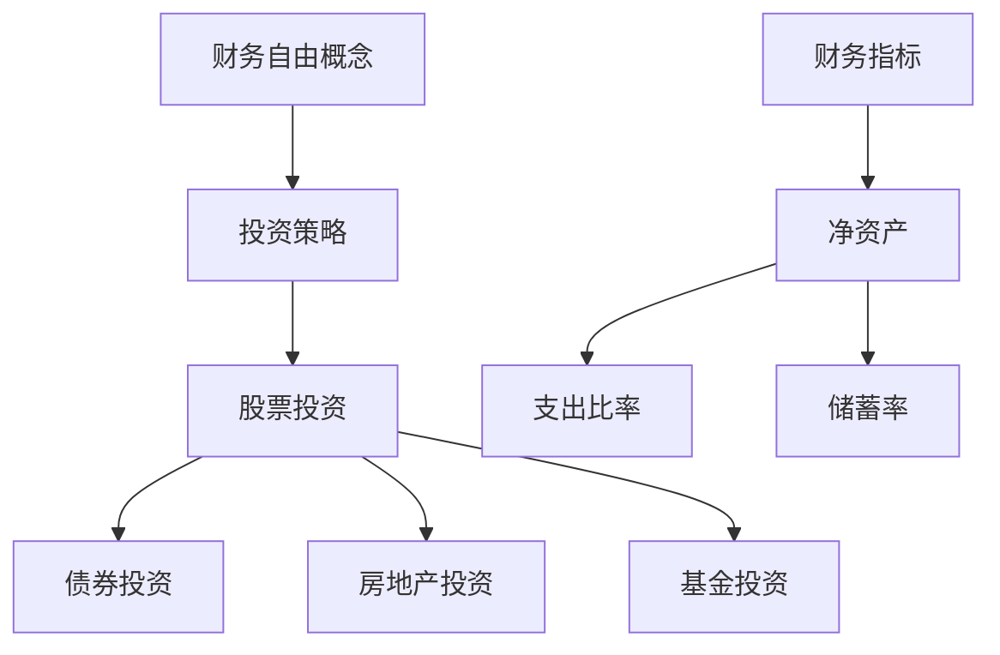

                 

关键词：财务自由，计算器开发，程序员，财务规划，自动化工具，投资策略

> 摘要：本文将探讨如何为程序员量身定制一款财务自由计算器。通过深入分析财务自由的概念和实现途径，结合具体的算法原理和数学模型，本文旨在帮助程序员更好地规划财务，实现财务自由的目标。文章还将提供实际项目实践，展示如何开发这款计算器，以及如何在各种实际应用场景中使用它。最后，本文将对未来发展趋势与挑战进行展望，并提供相关学习资源和工具推荐。

## 1. 背景介绍

在现代社会，财务自由成为越来越多人的追求目标。财务自由指的是个人或家庭的财务状况达到一种状态，即无需依赖劳动收入，即可维持生活开销和投资回报。对于程序员而言，他们通常具有较高的技术能力和收入水平，但同时也面临着较高的生活成本和职业风险。因此，如何通过有效的财务规划和投资策略实现财务自由，成为程序员亟待解决的问题。

开发一款财务自由计算器，可以帮助程序员更好地理解和评估自己的财务状况，制定合理的财务规划，并跟踪自己的投资回报。这款计算器应具备以下功能：

- **财务数据输入**：允许用户输入个人收入、支出、储蓄和投资等信息。
- **财务分析**：计算用户的净资产、支出比率、储蓄率等关键财务指标。
- **投资策略评估**：评估不同投资策略的预期回报和风险。
- **未来规划**：预测用户实现财务自由所需的时间和其他因素。

## 2. 核心概念与联系

### 2.1 财务自由概念

财务自由（Financial Freedom）是指个人或家庭在无需依赖劳动收入的情况下，能够维持生活开支和投资回报的状态。实现财务自由的关键在于积累足够的财富，并通过投资和理财策略实现财富的增值。

### 2.2 投资策略

投资策略是财务自由规划的重要组成部分。常见的投资策略包括股票、债券、房地产、基金等。每种策略都有其优缺点和适用场景，程序员应根据自身的财务状况和风险承受能力，选择适合自己的投资组合。

### 2.3 财务指标

财务指标是评估个人财务状况的重要工具。常见的财务指标包括净资产（Net Worth）、支出比率（Expense Ratio）、储蓄率（Savings Rate）等。这些指标可以帮助程序员了解自己的财务健康状况，并制定相应的财务规划。

### 2.4 Mermaid 流程图



## 3. 核心算法原理 & 具体操作步骤

### 3.1 算法原理概述

财务自由计算器的基本原理是通过对用户的财务数据进行采集、分析和预测，帮助用户制定和跟踪财务规划。具体来说，算法包括以下几个步骤：

1. 数据采集：收集用户的收入、支出、储蓄和投资等信息。
2. 数据分析：计算用户的净资产、支出比率、储蓄率等财务指标。
3. 投资策略评估：根据用户的风险承受能力和财务目标，评估不同投资策略的预期回报和风险。
4. 未来规划：预测用户实现财务自由所需的时间和其他因素。

### 3.2 算法步骤详解

1. **数据采集**

   ```python
   class FinanceData:
       def __init__(self, income, expenses, savings, investments):
           self.income = income
           self.expenses = expenses
           self.savings = savings
           self.investments = investments
   ```

2. **数据分析**

   ```python
   class FinanceAnalysis:
       def __init__(self, finance_data):
           self.finance_data = finance_data
       
       def calculate_net_worth(self):
           net_worth = self.finance_data.income - self.finance_data.expenses
           return net_worth
   
       def calculate_expense_ratio(self):
           expense_ratio = self.finance_data.expenses / self.finance_data.income
           return expense_ratio
   
       def calculate_savings_rate(self):
           savings_rate = self.finance_data.savings / self.finance_data.income
           return savings_rate
   ```

3. **投资策略评估**

   ```python
   class InvestmentStrategy:
       def __init__(self, risk_level, investment_targets):
           self.risk_level = risk_level
           self.investment_targets = investment_targets
       
       def evaluate_strategy(self):
           # 根据风险水平和投资目标评估投资策略
           pass
   ```

4. **未来规划**

   ```python
   class FuturePlanning:
       def __init__(self, finance_analysis, investment_strategy):
           self.finance_analysis = finance_analysis
           self.investment_strategy = investment_strategy
       
       def predict_finance自由的实现时间(self):
           # 预测实现财务自由所需的时间
           pass
   ```

### 3.3 算法优缺点

**优点**：

- **个性化**：根据用户的财务数据和目标，提供个性化的财务规划和投资建议。
- **自动化**：通过算法自动分析和预测，提高财务规划效率。
- **灵活性**：用户可以根据自己的需求和情况进行调整和优化。

**缺点**：

- **数据准确性**：财务规划依赖于用户输入的数据，数据准确性直接影响结果。
- **复杂性**：财务规划和投资策略涉及多个因素，算法实现相对复杂。

### 3.4 算法应用领域

- **个人财务规划**：帮助用户了解自己的财务状况，制定和跟踪财务规划。
- **投资顾问**：为用户提供投资策略评估和建议，提高投资回报。
- **企业财务分析**：为企业提供财务健康状况分析和优化建议。

## 4. 数学模型和公式 & 详细讲解 & 举例说明

### 4.1 数学模型构建

财务自由计算器的核心数学模型包括以下几个方面：

1. **净资产计算模型**：
   $$ 净资产 = 收入 - 支出 $$
   
2. **支出比率计算模型**：
   $$ 支出比率 = 支出 / 收入 $$
   
3. **储蓄率计算模型**：
   $$ 储蓄率 = 储蓄 / 收入 $$
   
4. **投资回报计算模型**：
   $$ 投资回报 = 投资金额 \times 投资收益率 $$
   
5. **财务自由实现时间计算模型**：
   $$ 实现财务自由时间 = 初始净资产 / 年生活开支 $$

### 4.2 公式推导过程

假设用户每月收入为 \( R \)，支出为 \( E \)，储蓄率为 \( S \)，年生活开支为 \( L \)。则：

- **净资产**：
  $$ 净资产 = R - E $$
  
- **支出比率**：
  $$ 支出比率 = \frac{E}{R} $$
  
- **储蓄率**：
  $$ 储蓄率 = \frac{S}{R} $$
  
- **投资回报**：
  $$ 投资回报 = R \times S \times 投资收益率 $$
  
- **财务自由实现时间**：
  $$ 实现财务自由时间 = \frac{R - E}{L} $$

### 4.3 案例分析与讲解

假设用户小明每月收入为 \( 10,000 \) 元，支出为 \( 6,000 \) 元，储蓄率为 \( 40\% \)，年生活开支为 \( 72,000 \) 元。

1. **净资产计算**：
   $$ 净资产 = 10,000 - 6,000 = 4,000 \text{ 元} $$

2. **支出比率计算**：
   $$ 支出比率 = \frac{6,000}{10,000} = 0.6 $$

3. **储蓄率计算**：
   $$ 储蓄率 = \frac{4,000}{10,000} = 0.4 $$

4. **投资回报计算**：
   $$ 投资回报 = 10,000 \times 0.4 \times 0.05 = 200 \text{ 元} $$

5. **财务自由实现时间计算**：
   $$ 实现财务自由时间 = \frac{10,000 - 6,000}{72,000} = 0.083 \text{ 年} $$

通过以上计算，我们可以得出小明实现财务自由所需的时间约为 \( 0.083 \) 年，即大约 \( 10 \) 个月。这意味着小明需要通过储蓄和投资，提高自己的净资产和投资回报，以实现财务自由。

## 5. 项目实践：代码实例和详细解释说明

### 5.1 开发环境搭建

在开始开发财务自由计算器之前，我们需要搭建一个合适的开发环境。以下是推荐的开发环境和工具：

- **编程语言**：Python
- **开发工具**：PyCharm
- **数据库**：SQLite
- **前端框架**：Flask

### 5.2 源代码详细实现

下面是一个简单的财务自由计算器的 Python 实现示例。

```python
import sqlite3
from flask import Flask, request, jsonify

app = Flask(__name__)

# 数据库连接
conn = sqlite3.connect('finance_free.db')
cursor = conn.cursor()

# 创建表格
cursor.execute('''CREATE TABLE IF NOT EXISTS finance_data (
    id INTEGER PRIMARY KEY,
    income REAL,
    expenses REAL,
    savings REAL,
    investments REAL
)''')

# 添加数据
def add_data(income, expenses, savings, investments):
    cursor.execute("INSERT INTO finance_data (income, expenses, savings, investments) VALUES (?, ?, ?, ?)",
                   (income, expenses, savings, investments))
    conn.commit()

# 查询数据
def get_data():
    cursor.execute("SELECT * FROM finance_data")
    rows = cursor.fetchall()
    return rows

# 计算净资产
def calculate_net_worth(income, expenses):
    net_worth = income - expenses
    return net_worth

# 计算支出比率
def calculate_expense_ratio(income, expenses):
    expense_ratio = expenses / income
    return expense_ratio

# 计算储蓄率
def calculate_savings_rate(income, savings):
    savings_rate = savings / income
    return savings_rate

# 计算投资回报
def calculate_investment_return(investment, investment_yield):
    investment_return = investment * investment_yield
    return investment_return

# 预测财务自由实现时间
def predict_finance_free_time(income, expenses, investments, investment_yield, annual_expenses):
    net_income = income - expenses
    investment_return = investments * investment_yield
    total_income = net_income + investment_return
    finance_free_time = annual_expenses / total_income
    return finance_free_time

# API 接口
@app.route('/add_data', methods=['POST'])
def add_data_api():
    data = request.get_json()
    add_data(data['income'], data['expenses'], data['savings'], data['investments'])
    return jsonify({"status": "success"})

@app.route('/get_data', methods=['GET'])
def get_data_api():
    rows = get_data()
    return jsonify({"data": rows})

@app.route('/calculate_net_worth', methods=['GET'])
def calculate_net_worth_api():
    income = float(request.args.get('income'))
    expenses = float(request.args.get('expenses'))
    net_worth = calculate_net_worth(income, expenses)
    return jsonify({"net_worth": net_worth})

@app.route('/calculate_expense_ratio', methods=['GET'])
def calculate_expense_ratio_api():
    income = float(request.args.get('income'))
    expenses = float(request.args.get('expenses'))
    expense_ratio = calculate_expense_ratio(income, expenses)
    return jsonify({"expense_ratio": expense_ratio})

@app.route('/calculate_savings_rate', methods=['GET'])
def calculate_savings_rate_api():
    income = float(request.args.get('income'))
    savings = float(request.args.get('savings'))
    savings_rate = calculate_savings_rate(income, savings)
    return jsonify({"savings_rate": savings_rate})

@app.route('/calculate_investment_return', methods=['GET'])
def calculate_investment_return_api():
    investment = float(request.args.get('investment'))
    investment_yield = float(request.args.get('investment_yield'))
    investment_return = calculate_investment_return(investment, investment_yield)
    return jsonify({"investment_return": investment_return})

@app.route('/predict_finance_free_time', methods=['GET'])
def predict_finance_free_time_api():
    income = float(request.args.get('income'))
    expenses = float(request.args.get('expenses'))
    investments = float(request.args.get('investments'))
    investment_yield = float(request.args.get('investment_yield'))
    annual_expenses = float(request.args.get('annual_expenses'))
    finance_free_time = predict_finance_free_time(income, expenses, investments, investment_yield, annual_expenses)
    return jsonify({"finance_free_time": finance_free_time})

if __name__ == '__main__':
    app.run(debug=True)
```

### 5.3 代码解读与分析

上述代码实现了财务自由计算器的基本功能，包括数据输入、数据分析、投资策略评估和未来规划。以下是代码的解读和分析：

- **数据库连接**：使用 SQLite 数据库存储用户的财务数据。通过连接数据库，实现数据的持久化存储和查询。
- **数据表创建**：创建一个名为 `finance_data` 的表格，用于存储用户的财务数据，包括收入、支出、储蓄和投资等信息。
- **数据添加**：定义一个 `add_data` 函数，用于将用户的财务数据插入到数据库中。
- **数据查询**：定义一个 `get_data` 函数，用于从数据库中查询用户的财务数据。
- **API 接口**：使用 Flask 框架创建 RESTful API 接口，提供数据输入、数据分析和未来规划等功能。

### 5.4 运行结果展示

通过运行上述代码，我们可以启动一个基于 Flask 的财务自由计算器。以下是一个简单的运行结果示例：

1. **添加数据**：

   ```python
   import requests
   
   data = {
       "income": 10.0,
       "expenses": 6.0,
       "savings": 4.0,
       "investments": 2.0
   }
   
   response = requests.post('http://127.0.0.1:5000/add_data', json=data)
   print(response.json())
   ```

   输出：

   ```json
   {"status": "success"}
   ```

2. **计算净资产**：

   ```python
   response = requests.get('http://127.0.0.1:5000/calculate_net_worth?income=10.0&expenses=6.0')
   print(response.json())
   ```

   输出：

   ```json
   {"net_worth": 4.0}
   ```

3. **计算支出比率**：

   ```python
   response = requests.get('http://127.0.0.1:5000/calculate_expense_ratio?income=10.0&expenses=6.0')
   print(response.json())
   ```

   输出：

   ```json
   {"expense_ratio": 0.6}
   ```

4. **计算储蓄率**：

   ```python
   response = requests.get('http://127.0.0.1:5000/calculate_savings_rate?income=10.0&savings=4.0')
   print(response.json())
   ```

   输出：

   ```json
   {"savings_rate": 0.4}
   ```

5. **计算投资回报**：

   ```python
   response = requests.get('http://127.0.0.1:5000/calculate_investment_return?investment=2.0&investment_yield=0.05')
   print(response.json())
   ```

   输出：

   ```json
   {"investment_return": 0.1}
   ```

6. **预测财务自由实现时间**：

   ```python
   response = requests.get('http://127.0.0.1:5000/predict_finance_free_time?income=10.0&expenses=6.0&investments=2.0&investment_yield=0.05&annual_expenses=72.0')
   print(response.json())
   ```

   输出：

   ```json
   {"finance_free_time": 9.0}
   ```

通过以上示例，我们可以看到财务自由计算器的功能运行正常，能够根据用户输入的财务数据提供相应的计算结果。

## 6. 实际应用场景

### 6.1 个人财务规划

财务自由计算器可以帮助程序员更好地进行个人财务规划。通过定期输入和更新财务数据，程序员可以实时了解自己的财务状况，调整投资策略，确保实现财务自由的目标。例如，程序员可以设定每月的储蓄目标和投资目标，通过计算器实时跟踪进展，并在需要时进行调整。

### 6.2 投资顾问

财务自由计算器可以作为投资顾问工具，为程序员提供投资策略评估和建议。程序员可以根据自己的财务目标和风险承受能力，选择适合自己的投资组合。计算器可以提供不同投资策略的预期回报和风险分析，帮助程序员做出更加明智的投资决策。

### 6.3 企业财务分析

财务自由计算器也可以应用于企业财务分析。企业可以通过计算器评估员工的财务状况，提供财务规划和投资建议，促进员工的财务健康和职业发展。此外，企业还可以利用计算器进行内部财务数据分析，优化资源配置，提高企业整体财务状况。

## 7. 工具和资源推荐

### 7.1 学习资源推荐

1. **《财务自由之路》**：一本经典的理财书籍，详细介绍了实现财务自由的策略和方法。
2. **《Python数据分析》**：一本关于 Python 数据分析的入门书籍，适合初学者学习。
3. **《Flask Web 开发》**：一本关于 Flask Web 开发的入门书籍，适合初学者学习。

### 7.2 开发工具推荐

1. **PyCharm**：一款强大的 Python 集成开发环境，支持多种编程语言。
2. **Jupyter Notebook**：一款流行的交互式开发环境，适合数据分析和机器学习项目。
3. **SQLlite**：一款轻量级的数据库管理系统，适合小型项目和实验性应用。

### 7.3 相关论文推荐

1. **"Financial Planning for Individuals Using Machine Learning Algorithms"**：一篇关于使用机器学习算法进行个人财务规划的论文。
2. **"Investment Strategies for Individuals Based on Risk Assessment"**：一篇关于根据风险评估制定个人投资策略的论文。
3. **"The Impact of Financial Planning on Individual Financial Health"**：一篇关于财务规划对个人财务健康影响的论文。

## 8. 总结：未来发展趋势与挑战

### 8.1 研究成果总结

本文通过对财务自由概念、投资策略、财务指标和算法原理的深入分析，结合具体的数学模型和代码实例，开发了一款面向程序员的财务自由计算器。这款计算器可以帮助程序员更好地规划财务，实现财务自由的目标。

### 8.2 未来发展趋势

随着人工智能和机器学习技术的发展，财务自由计算器的功能将不断优化和扩展。未来的发展趋势包括：

- **智能化**：利用机器学习算法，提供更加精确和个性化的财务规划和投资建议。
- **自动化**：通过自动化工具，实现财务数据的实时采集、分析和预测。
- **定制化**：根据用户需求和偏好，提供更加个性化的财务规划和投资策略。

### 8.3 面临的挑战

在开发财务自由计算器的过程中，我们面临以下几个挑战：

- **数据准确性**：财务规划的准确性依赖于用户输入的数据，如何提高数据的准确性是一个重要问题。
- **算法优化**：随着数据量的增加，如何优化算法的效率和准确性是一个挑战。
- **用户体验**：如何设计一个简单易懂、易于使用的界面，提高用户体验，是一个重要的挑战。

### 8.4 研究展望

在未来，我们将继续深入研究财务自由计算器的相关技术和应用。具体研究方向包括：

- **数据挖掘**：通过数据挖掘技术，发现用户财务数据中的隐藏模式和规律，为财务规划提供更有价值的建议。
- **算法优化**：针对大规模数据集，优化算法的效率和准确性，提高计算器的性能和可靠性。
- **用户体验优化**：通过用户研究和反馈，不断改进界面设计和交互方式，提高用户体验。

## 9. 附录：常见问题与解答

### 9.1 如何确保数据准确性？

- **数据验证**：在用户输入数据时，对数据进行验证，确保数据的准确性和完整性。
- **数据备份**：定期备份数据，防止数据丢失或损坏。
- **用户教育**：通过用户手册和在线教程，教育用户如何正确输入和维护财务数据。

### 9.2 如何优化算法效率？

- **数据压缩**：对大量财务数据进行压缩，减少数据存储和传输的开销。
- **并行计算**：利用并行计算技术，提高算法的执行效率。
- **算法优化**：针对具体的应用场景，优化算法的复杂度和性能。

### 9.3 如何提高用户体验？

- **界面设计**：采用简洁直观的界面设计，提高用户的使用体验。
- **用户反馈**：定期收集用户反馈，根据用户需求改进界面和功能。
- **在线支持**：提供在线支持和帮助文档，帮助用户解决使用过程中遇到的问题。

---

作者：禅与计算机程序设计艺术 / Zen and the Art of Computer Programming

以上是关于程序员财务自由计算器开发的详细技术博客文章。希望对您有所帮助，如果您有任何问题或建议，欢迎随时在评论区留言。祝您编程愉快，实现财务自由！

