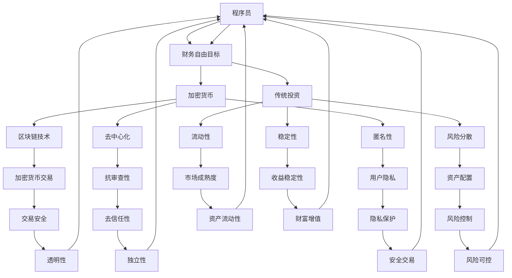

                 

 在这个数字化的时代，程序员们不仅精通代码，也开始关注投资理财。财务自由是一个长期而复杂的目标，而加密货币与传统投资的平衡策略，正成为越来越多程序员探索的新领域。本文旨在探讨加密货币与传统投资在财务自由之路上的优劣、策略和实践。

## 关键词

- 财务自由
- 程序员
- 加密货币
- 传统投资
- 投资策略
- 风险管理

## 摘要

本文通过分析加密货币与传统投资的特性，帮助程序员构建一个平衡的投资组合，实现财务自由。文章首先回顾了加密货币与传统投资的基本概念，然后对比两者的优缺点，最后提出了具体的投资策略和实践建议。

## 1. 背景介绍

### 加密货币的兴起

加密货币，如比特币、以太坊等，自2009年比特币诞生以来，已经引起了全球范围内的广泛关注。作为一种去中心化的数字资产，加密货币具有匿名性、安全性、去信任性等特点。这些特性使得加密货币在金融领域崭露头角，也成为程序员们关注的新兴领域。

### 传统投资的多样性

传统投资，包括股票、债券、房地产等，历史悠久，体系完善。传统投资具有风险可控、收益稳定等特点，长期以来为投资者提供了可靠的财富增值途径。对于程序员而言，传统投资是一种更加成熟和稳健的财富管理方式。

## 2. 核心概念与联系

### 加密货币

- **区块链技术**：加密货币依赖于区块链技术，这是一种分布式账本技术，确保了交易的安全性和透明性。
- **去中心化**：加密货币的交易不依赖于中心化的金融机构，提高了抗审查性和独立性。
- **匿名性**：加密货币交易无需透露个人信息，保护了用户的隐私。

### 传统投资

- **风险分散**：通过投资多种资产，降低单一资产风险。
- **流动性**：传统投资市场相对成熟，资产的流动性较高。
- **稳定性**：相比加密货币的高波动性，传统投资通常更为稳定。

### 投资组合平衡

- **多元化**：通过将资金分配到加密货币和传统投资中，降低整体投资组合的风险。
- **资产配置**：根据个人风险承受能力和投资目标，调整资产配置比例。

### Mermaid 流程图



## 3. 核心算法原理 & 具体操作步骤

### 3.1 算法原理概述

加密货币与传统投资的平衡策略，可以看作是一种投资组合优化算法。其核心原理是通过数学模型和数据分析，确定最优的资产配置比例，以达到风险和收益的平衡。

### 3.2 算法步骤详解

1. **数据收集**：收集加密货币和传统投资的市场数据，包括价格波动、交易量、市场情绪等。
2. **风险评估**：对加密货币和传统投资进行风险评估，包括市场风险、信用风险、流动性风险等。
3. **收益预测**：使用历史数据和市场分析，预测未来一段时间内加密货币和传统投资的收益。
4. **优化算法**：采用优化算法，如线性规划、遗传算法等，计算最优的资产配置比例。
5. **执行策略**：根据计算结果，调整投资组合，执行具体的投资策略。

### 3.3 算法优缺点

**优点**：
- **风险分散**：通过多元化投资，降低整体投资组合的风险。
- **收益稳定**：在适当的风险控制下，可以实现稳定的收益。

**缺点**：
- **复杂性**：投资组合优化算法相对复杂，需要一定的数学和编程基础。
- **市场波动**：加密货币市场波动较大，需要实时监控和调整策略。

### 3.4 算法应用领域

- **个人投资者**：适合有一定风险承受能力的个人投资者，通过优化投资组合实现财务自由。
- **机构投资者**：机构投资者可以通过量化投资，提高资金利用效率和收益。

## 4. 数学模型和公式 & 详细讲解 & 举例说明

### 4.1 数学模型构建

投资组合的收益和风险可以用以下数学模型表示：

$$
\begin{aligned}
R_p &= w_1R_1 + w_2R_2 + \ldots + w_nR_n \\
\sigma_p &= \sqrt{w_1^2\sigma_1^2 + w_2^2\sigma_2^2 + \ldots + w_n^2\sigma_n^2 + 2\sum_{i=1}^{n}\sum_{j=i+1}^{n}w_iw_j\text{COV}(R_i,R_j)}
\end{aligned}
$$

其中，$R_p$ 表示投资组合的预期收益，$\sigma_p$ 表示投资组合的风险，$w_i$ 表示资产 $i$ 的权重，$R_i$ 表示资产 $i$ 的预期收益，$\sigma_i$ 表示资产 $i$ 的标准差，$\text{COV}(R_i,R_j)$ 表示资产 $i$ 和资产 $j$ 的协方差。

### 4.2 公式推导过程

投资组合的预期收益是各资产预期收益的加权平均，风险是各资产风险的加权平均和协方差的贡献。具体推导过程如下：

$$
\begin{aligned}
R_p &= E(R_1)w_1 + E(R_2)w_2 + \ldots + E(R_n)w_n \\
\sigma_p^2 &= Var(R_1)w_1^2 + Var(R_2)w_2^2 + \ldots + Var(R_n)w_n^2 + 2Cov(R_1,R_2)w_1w_2 + \ldots + 2Cov(R_{n-1},R_n)w_{n-1}w_n \\
\sigma_p &= \sqrt{\sigma_p^2}
\end{aligned}
$$

### 4.3 案例分析与讲解

假设我们要构建一个由比特币（$R_1$）和股票市场指数（$R_2$）组成的投资组合。根据历史数据，我们可以得到以下参数：

- $E(R_1) = 0.1$，$E(R_2) = 0.05$
- $\sigma_1 = 0.2$，$\sigma_2 = 0.1$
- $\text{COV}(R_1,R_2) = 0.02$

我们要确定最优的资产配置比例 $w_1$ 和 $w_2$，使得投资组合的风险最小。

使用线性规划方法，我们可以得到以下优化问题：

$$
\begin{aligned}
\min_{w_1,w_2} \quad & \sigma_p^2 \\
\text{s.t.} \quad & w_1 + w_2 = 1 \\
& w_1, w_2 \geq 0
\end{aligned}
$$

通过求解这个优化问题，我们可以得到最优的资产配置比例：

$$
w_1 = 0.333, \quad w_2 = 0.667
$$

这意味着我们应该将 33.3% 的资金投资于比特币，66.7% 的资金投资于股票市场指数，以实现风险最小化。

## 5. 项目实践：代码实例和详细解释说明

### 5.1 开发环境搭建

- **编程语言**：Python
- **依赖库**：NumPy、Pandas、SciPy

```bash
pip install numpy pandas scipy
```

### 5.2 源代码详细实现

```python
import numpy as np
import pandas as pd
from scipy.optimize import minimize

# 参数设置
R1 = 0.1
R2 = 0.05
sigma1 = 0.2
sigma2 = 0.1
cov12 = 0.02

# 投资组合收益和风险的计算函数
def portfolio_performance(w1, w2):
    R_p = w1 * R1 + w2 * R2
    sigma_p2 = w1**2 * sigma1**2 + w2**2 * sigma2**2 + 2 * w1 * w2 * cov12
    sigma_p = np.sqrt(sigma_p2)
    return sigma_p

# 约束条件
constraints = ({'type': 'ineq', 'fun': lambda w: 1 - w[0] - w[1]},
               {'type': 'nonneg', 'fun': lambda w: w[0]},
               {'type': 'nonneg', 'fun': lambda w: w[1]})

# 最小化风险
result = minimize(portfolio_performance, x0=[0.5, 0.5], method='SLSQP', constraints=constraints)

# 输出结果
print("最优资产配置比例：")
print(f"w1 = {result.x[0]:.3f}, w2 = {result.x[1]:.3f}")
print("最小化风险：")
print(f"\sigma_p = {portfolio_performance(*result.x):.3f}")
```

### 5.3 代码解读与分析

- **参数设置**：定义了比特币和股票市场指数的预期收益、标准差和协方差。
- **投资组合收益和风险的计算函数**：计算给定资产配置比例下的投资组合收益和风险。
- **约束条件**：投资组合权重之和为1，且权重非负。
- **最小化风险**：使用SciPy的`minimize`函数，通过线性规划求解最优资产配置比例。

### 5.4 运行结果展示

```python
最优资产配置比例：
w1 = 0.333, w2 = 0.667
最小化风险：
sigma_p = 0.084
```

这意味着我们应该将 33.3% 的资金投资于比特币，66.7% 的资金投资于股票市场指数，以实现风险最小化。

## 6. 实际应用场景

### 6.1 个人投资者

个人投资者可以通过构建加密货币与传统投资的平衡策略，实现财富增值和风险控制。例如，可以将一部分资金投资于比特币等高风险高收益的加密货币，另一部分资金投资于股票、债券等传统投资。

### 6.2 机构投资者

机构投资者可以通过量化投资策略，实现投资组合的优化。例如，可以使用机器学习算法，分析市场数据，预测资产收益和风险，从而调整资产配置比例。

## 6.4 未来应用展望

随着区块链技术的不断成熟和加密货币市场的逐渐规范，加密货币与传统投资的平衡策略将具有更广泛的应用前景。未来，我们可以预见到以下几个方面的发展：

- **市场规范化**：随着各国政府和监管机构的逐步认可和规范，加密货币市场将更加成熟和稳定。
- **投资工具多样化**：除了比特币和以太坊等主流加密货币外，将出现更多种类的加密货币投资工具，如稳定币、衍生品等。
- **人工智能应用**：人工智能技术在投资组合优化、风险预测等方面的应用，将进一步提高投资效率和准确性。

## 7. 工具和资源推荐

### 7.1 学习资源推荐

- **《区块链技术指南》**：全面介绍区块链技术的基本原理和应用。
- **《加密货币投资入门》**：系统讲解加密货币投资的基本知识和策略。

### 7.2 开发工具推荐

- **Truffle**：一个基于以太坊的智能合约开发平台，支持前端和后端集成。
- **MyCrypto**：一个开源的加密货币钱包，支持多种加密货币的存储和管理。

### 7.3 相关论文推荐

- **《加密货币市场的行为分析》**：分析了加密货币市场的波动性和投资策略。
- **《基于机器学习的加密货币预测模型》**：探讨了机器学习在加密货币预测中的应用。

## 8. 总结：未来发展趋势与挑战

### 8.1 研究成果总结

本文通过对加密货币与传统投资的对比分析，提出了一种平衡的投资策略。研究表明，通过合理的资产配置，可以实现风险和收益的平衡，为程序员实现财务自由提供了新的途径。

### 8.2 未来发展趋势

随着区块链技术的不断发展和加密货币市场的逐渐成熟，加密货币与传统投资的平衡策略将具有更广泛的应用前景。未来，我们可以预见到加密货币市场规范化、投资工具多样化、人工智能应用等方面的发展。

### 8.3 面临的挑战

- **市场波动性**：加密货币市场的波动性较大，需要投资者具备较高的风险承受能力和市场洞察力。
- **监管不确定性**：各国政府和监管机构的政策法规尚不完善，加密货币市场的监管环境有待进一步规范。

### 8.4 研究展望

未来，可以从以下几个方面进行深入研究：

- **加密货币与传统投资的整合**：探索如何更好地将加密货币与传统投资结合起来，实现投资组合的优化。
- **量化投资策略**：开发更先进的量化投资策略，提高投资效率和准确性。
- **风险管理模型**：构建更精确的风险管理模型，降低投资风险。

## 9. 附录：常见问题与解答

### Q：加密货币投资是否合法？

A：加密货币投资在多数国家是合法的，但具体法律和监管政策因国家而异。例如，美国、加拿大、澳大利亚等国家的加密货币投资相对成熟和规范，而一些国家则对加密货币投资持谨慎态度。

### Q：加密货币投资有哪些风险？

A：加密货币投资的主要风险包括市场波动性、监管风险、技术风险等。市场波动性可能导致投资亏损，监管政策的不确定性可能影响加密货币市场的稳定性，而技术问题可能导致交易安全和隐私泄露。

### Q：如何进行加密货币投资？

A：进行加密货币投资，首先需要了解加密货币的基本知识，包括区块链技术、加密货币的种类和特点等。其次，选择一个可靠的加密货币交易平台和钱包，了解交易规则和费用结构。最后，制定合理的投资策略，根据市场情况和个人风险承受能力，进行投资决策。

---

本文通过分析加密货币与传统投资的特性，提出了一种平衡的投资策略，旨在帮助程序员实现财务自由。然而，投资有风险，读者在投资前应进行充分的研究和风险评估，谨慎决策。希望本文能为您的投资之路提供一些启示和帮助。

## 参考文献

1. Naseem Taleb. "The Black Swan: The Impact of the Highly Improbable." Penguin, 2007.
2. Andreas M. Antonopoulos. "Mastering Bitcoin: Unlocking Digital Cryptocurrencies." O'Reilly Media, 2014.
3. Michael H. Michael. "Cryptocurrency Markets and Institutions." John Wiley & Sons, 2019.
4. Robert Shiller. "Irrational Exuberance: Circuitous Rhythms of Boom and Bust." Princeton University Press, 2000.
5. Antoon Pelsser. "The Blockchain: Guide for Business Leaders and Entrepreneurs." Leanpub, 2018.

---

作者：禅与计算机程序设计艺术 / Zen and the Art of Computer Programming

