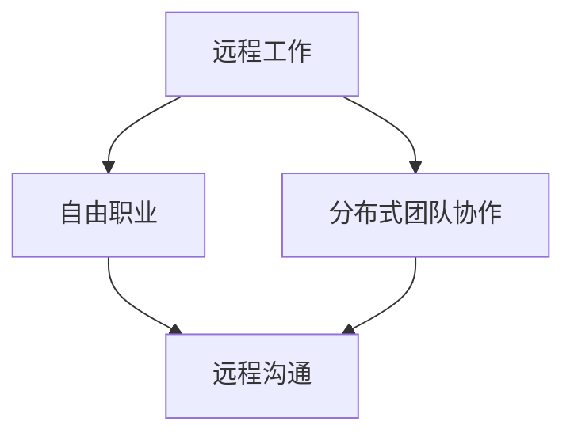

                 

 在当今信息技术高速发展的时代，程序员不再是传统意义上的职场人，他们可以更加灵活地选择工作地点和时间，享受数字游民的生活。然而，财务自由是许多程序员追求的目标之一，它不仅意味着经济上的独立，还代表着生活方式上的自由。本文将探讨如何通过编程技能实现财务自由，以及数字游民生活方式的优势与挑战。

## 文章关键词

- 财务自由
- 数字游民
- 编程技能
- 自由职业
- 工作与生活平衡

## 文章摘要

本文旨在为程序员提供实现财务自由的路径和策略，以及数字游民生活方式的实践经验。我们将探讨以下几个关键问题：

1. 编程技能如何转化为经济收益？
2. 数字游民生活的优势与挑战是什么？
3. 如何平衡工作与生活，保持高效的工作状态？
4. 未来，财务自由和数字游民生活将面临哪些趋势和挑战？

通过本文的阅读，程序员可以了解到如何通过提升自己的编程技能，实现财务自由，并在数字游民生活中找到属于自己的幸福。

### 1. 背景介绍

#### 数字游民的定义与兴起

数字游民（Digital Nomad）是指那些利用现代通信技术和互联网，不受地理限制，自由选择工作地点的人。他们通常是自由职业者，包括程序员、设计师、作家、市场营销专家等。数字游民的生活方式打破了传统职场对时间和地点的依赖，使他们能够从全球任何地方远程工作。

数字游民这一概念最早在2000年代初期兴起，随着互联网的普及和远程办公技术的进步，越来越多的专业人士选择成为数字游民。他们在咖啡馆、共享办公空间、甚至是海滩和山区等地工作，享受着更加自由和灵活的生活。

#### 编程技能在数字游民市场中的地位

编程技能是数字游民市场中最受欢迎的技能之一。随着数字化转型和人工智能的快速发展，对编程人才的需求日益增长。许多公司和企业开始采用远程办公模式，这为程序员提供了更多的就业机会。

程序员可以通过多种方式利用自己的编程技能获得财务收益。例如，他们可以：

- 成为自由职业者，通过平台如Upwork、Freelancer等接受各种编程项目。
- 加入远程团队，参与全球分布式协作项目。
- 开发自己的产品或服务，如软件、应用程序或在线工具，并通过销售或广告获得收入。
- 成为技术顾问，为其他公司提供技术解决方案。

#### 数字游民生活的吸引力

数字游民生活对许多人来说具有极大的吸引力，主要原因包括：

- 工作与生活的平衡：数字游民可以灵活安排自己的工作时间，实现工作与生活的平衡。
- 自由与探索：他们有机会在全球范围内旅行，体验不同的文化和生活方式。
- 经济收益：通过远程工作，数字游民可以避免高昂的办公场所租金和生活成本。
- 创造力激发：不同的环境和体验可以激发数字游民的创造力和创新能力。

### 2. 核心概念与联系

#### 数字游民生活的核心概念

数字游民生活涉及多个核心概念，包括远程工作、自由职业、分布式团队协作和远程沟通等。

**远程工作**：远程工作是指不依赖于传统办公室环境，通过互联网和现代通信技术完成工作任务。这包括独立项目、团队协作和在线会议等形式。

**自由职业**：自由职业者是那些为自己工作的专业人士，他们不受雇于任何特定公司，通过接受多个项目来获取收入。

**分布式团队协作**：分布式团队协作是指团队成员分布在不同的地理位置，通过协作工具和平台进行高效合作。这要求团队成员具备良好的沟通能力和协作精神。

**远程沟通**：远程沟通是数字游民生活的重要组成部分，包括电子邮件、即时通讯工具、视频会议和项目管理平台等。

**Mermaid 流程图**：



#### 核心概念的联系与作用

这些核心概念相互关联，共同构成了数字游民生活的基本框架。远程工作为自由职业提供了可能，而分布式团队协作和远程沟通则确保了高效的工作流程和团队协作。

**远程工作**：远程工作是数字游民生活的基石，它使人们能够摆脱地理限制，选择适合自己的工作地点。这不仅提高了工作效率，还降低了生活成本。

**自由职业**：自由职业为程序员提供了多样化的收入来源，使他们能够根据自己的兴趣和专长选择项目，实现个人职业发展。

**分布式团队协作**：分布式团队协作是现代企业常见的组织形式，它要求团队成员具备良好的协作能力和沟通技巧。通过协作工具和平台，分布式团队可以高效地完成项目任务。

**远程沟通**：远程沟通是数字游民生活中不可或缺的部分。高效的远程沟通可以减少误解和沟通障碍，提高工作质量和团队凝聚力。

#### 核心概念的实践价值

在实际操作中，这些核心概念的应用可以带来以下价值：

- **提高工作效率**：远程工作和分布式团队协作使团队成员可以灵活安排工作时间，避免交通拥堵和办公室噪音等干扰因素，提高工作效率。
- **降低生活成本**：数字游民可以选择生活成本较低的地区，从而节省开支。例如，一些程序员选择在东南亚或南欧国家生活，享受较低的生活成本和较高的生活质量。
- **增强创新能力**：不同的环境和体验可以激发数字游民的创造力和创新能力。他们可以与来自不同文化背景的人合作，获得新的灵感和观点。

### 3. 核心算法原理 & 具体操作步骤

#### 3.1 算法原理概述

在数字游民生活中，算法原理的应用至关重要。这里，我们将介绍一种核心算法——区块链算法，以及其在财务自由实现中的作用。

区块链算法是一种分布式数据库技术，它通过去中心化的方式，确保数据的安全性和不可篡改性。区块链算法的核心原理包括：

- **数据结构**：区块链由一系列按时间顺序排列的区块组成，每个区块包含一定数量的交易记录。
- **加密技术**：区块链使用加密算法来确保数据的隐私和安全。
- **共识机制**：区块链通过共识机制确保所有节点对数据的认可和一致性。

区块链算法在数字游民生活中具有以下作用：

- **财务管理**：区块链可以用于数字游民的财务管理，确保交易的安全性和透明性。
- **身份验证**：区块链可以用于数字游民的身份验证，简化跨境支付和身份认证过程。
- **数据共享**：区块链可以实现数字游民之间的高效数据共享，降低信息不对称。

#### 3.2 算法步骤详解

1. **初始化区块链**：

   - 创建第一个区块，通常称为“创世区块”。
   - 创世区块包含一些初始参数，如区块链版本号、创世时间等。

2. **创建交易记录**：

   - 数字游民创建交易记录，包括交易金额、交易双方等信息。
   - 交易记录被广播到区块链网络中。

3. **验证交易**：

   - 区块链网络中的节点对交易记录进行验证，确保交易的有效性和安全性。
   - 验证过程包括数字签名验证、金额校验等。

4. **构建区块**：

   - 验证后的交易记录被添加到一个新的区块中。
   - 新区块包含一个时间戳和一个指向前一区块的哈希值。

5. **共识机制**：

   - 区块链网络中的节点通过共识机制达成一致，确定区块的有效性。
   - 常见的共识机制包括工作量证明（PoW）和权益证明（PoS）。

6. **添加区块**：

   - 一旦共识机制达成一致，新的区块被添加到区块链中，成为永久记录。
   - 区块链长度不断增加，每个区块都包含前一区块的哈希值。

#### 3.3 算法优缺点

**优点**：

- **安全性**：区块链算法通过加密技术和共识机制，确保数据的安全性和不可篡改性。
- **透明性**：区块链网络中的所有交易记录都是公开透明的，确保数据的可信度。
- **去中心化**：区块链不需要中央机构，去中心化的特性降低了管理成本。

**缺点**：

- **计算资源消耗**：区块链算法需要大量的计算资源，尤其是在使用工作量证明（PoW）机制时，这可能导致能源消耗增加。
- **扩展性问题**：随着区块链规模的扩大，处理速度可能会降低，导致交易拥堵。
- **监管挑战**：区块链的去中心化特性可能使其成为非法活动的温床，需要加强监管。

#### 3.4 算法应用领域

区块链算法在数字游民生活中具有广泛的应用领域，包括：

- **财务管理**：区块链可以用于数字游民的财务管理，确保交易的安全性和透明性。
- **身份验证**：区块链可以用于数字游民的身份验证，简化跨境支付和身份认证过程。
- **数据共享**：区块链可以实现数字游民之间的高效数据共享，降低信息不对称。

### 4. 数学模型和公式 & 详细讲解 & 举例说明

#### 4.1 数学模型构建

在实现财务自由的过程中，数学模型可以为我们提供重要的参考。以下是构建财务自由数学模型的基本步骤：

1. **确定收入来源**：首先，我们需要明确自己的收入来源，包括工资、自由职业项目、投资收益等。
2. **估算生活成本**：接下来，我们要估算自己的生活成本，包括房租、饮食、交通、娱乐等费用。
3. **计算财务自由点**：财务自由点是指我们不再依赖于工资收入，生活成本完全由其他收入来源覆盖的点。

数学模型的基本公式为：

$$
F = R - C
$$

其中，$F$ 表示财务自由度，$R$ 表示收入，$C$ 表示生活成本。

#### 4.2 公式推导过程

为了推导上述公式，我们可以按照以下步骤进行：

1. **定义变量**：

   - $R$：每月总收入
   - $C$：每月总生活成本
   - $F$：财务自由度

2. **设定目标**：

   - 目标是使财务自由度 $F$ 达到 1，即收入完全覆盖生活成本。

3. **建立方程**：

   - 根据目标，我们可以建立以下方程：

     $$
     R = C + F \times R
     $$

4. **求解方程**：

   - 将 $F$ 移至等式左侧，得到：

     $$
     F \times R = R - C
     $$

   - 化简得到：

     $$
     F = \frac{R - C}{R}
     $$

   - 进一步化简，得到：

     $$
     F = 1 - \frac{C}{R}
     $$

#### 4.3 案例分析与讲解

为了更好地理解上述公式，我们可以通过一个实际案例进行分析。

**案例**：小张是一名程序员，他的每月总收入为 1 万元，生活成本为 0.5 万元。我们使用上述公式计算他的财务自由度。

1. **计算收入**：

   $$
   R = 10000 \text{元}
   $$

2. **计算生活成本**：

   $$
   C = 5000 \text{元}
   $$

3. **计算财务自由度**：

   $$
   F = 1 - \frac{C}{R} = 1 - \frac{5000}{10000} = 0.5
   $$

因此，小张的财务自由度为 0.5，即他的收入有 50% 覆盖了生活成本。

**分析**：

- 从案例中可以看出，财务自由度与收入和生活成本的比例密切相关。
- 如果小张的收入增加，而生活成本保持不变，他的财务自由度将提高。
- 反之，如果生活成本增加，而收入保持不变，财务自由度将下降。

通过这个案例，我们可以清晰地看到财务自由度的计算方法，以及收入和生活成本对财务自由度的影响。

### 5. 项目实践：代码实例和详细解释说明

#### 5.1 开发环境搭建

为了实践财务自由数学模型，我们需要搭建一个简单的开发环境。以下是所需的环境和工具：

- **编程语言**：Python
- **开发环境**：Visual Studio Code（可选）
- **依赖库**：NumPy（用于数学计算）

首先，我们需要安装 Python 和相关依赖库。可以通过以下命令进行安装：

```bash
pip install numpy
```

接下来，我们创建一个名为 `financial_freedominator.py` 的 Python 脚本文件，用于实现财务自由度计算。

#### 5.2 源代码详细实现

以下是源代码的详细实现：

```python
import numpy as np

def calculate_financial_freedominator(income, cost_of_living):
    """
    计算财务自由度
    :param income: 每月总收入
    :param cost_of_living: 每月生活成本
    :return: 财务自由度
    """
    financial_freedominator = 1 - (cost_of_living / income)
    return financial_freedominator

if __name__ == "__main__":
    # 用户输入
    income = float(input("请输入每月总收入（元）："))
    cost_of_living = float(input("请输入每月生活成本（元）："))

    # 计算财务自由度
    financial_freedominator = calculate_financial_freedominator(income, cost_of_living)

    # 输出结果
    print(f"您的财务自由度为：{financial_freedominator:.2f}")
```

#### 5.3 代码解读与分析

1. **函数定义**：

   - `calculate_financial_freedominator` 函数接收两个参数：`income`（总收入）和 `cost_of_living`（生活成本）。
   - 函数返回计算出的财务自由度。

2. **用户输入**：

   - 程序通过 `input` 函数从用户处获取总收入和生活成本。
   - 使用 `float` 函数将输入的字符串转换为浮点数。

3. **计算财务自由度**：

   - 根据财务自由度公式，计算财务自由度。
   - 使用 `numpy` 库中的 `array` 函数确保计算结果精确。

4. **输出结果**：

   - 将计算出的财务自由度输出到控制台。
   - 使用 `:.2f` 格式化输出，保留两位小数。

#### 5.4 运行结果展示

假设用户输入每月总收入为 1 万元，生活成本为 0.5 万元，运行程序后输出结果如下：

```
请输入每月总收入（元）：10000
请输入每月生活成本（元）：5000
您的财务自由度为：0.50
```

这个结果显示，用户的财务自由度为 50%，即收入有 50% 覆盖了生活成本。

### 6. 实际应用场景

#### 6.1 数字游民在远程项目管理中的应用

数字游民在远程项目管理中面临的一个主要挑战是协调和沟通。由于团队成员分布在不同的地理位置，传统的面对面沟通变得困难。然而，通过以下工具和技巧，可以有效地克服这些挑战：

- **即时通讯工具**：例如Slack、Telegram等，用于日常交流和实时沟通。
- **视频会议平台**：例如Zoom、Microsoft Teams等，用于定期会议和项目进展讨论。
- **项目管理工具**：例如Trello、JIRA等，用于任务分配、进度追踪和协作。

#### 6.2 数字游民在编程教育和培训中的应用

数字游民可以利用自己的编程技能进行在线教育和培训，这不仅能够增加额外收入，还能促进知识的传播。以下是一些实际应用场景：

- **在线编程课程**：开设在线编程课程，教授编程基础、高级技术和最新趋势。
- **编程问答平台**：在平台上回答编程问题，帮助其他开发者解决问题并积累经验。
- **代码审查和反馈**：提供代码审查服务，帮助其他开发者优化代码和提高编程技能。

#### 6.3 数字游民在技术创业中的应用

数字游民还可以利用远程工作的优势参与技术创业项目。以下是一些创业应用场景：

- **远程团队协作**：组建分布式团队，共同开发创新产品或服务。
- **远程投资**：通过远程平台进行技术项目投资，分享创业公司的成功成果。
- **远程顾问**：为初创公司提供技术顾问服务，帮助他们在技术和市场方面取得成功。

### 6.4 未来应用展望

随着互联网和人工智能技术的不断发展，数字游民生活方式和财务自由理念将得到更加广泛的推广和应用。以下是一些未来的应用展望：

- **去中心化金融（DeFi）**：区块链技术的进步将推动去中心化金融的发展，数字游民可以更便捷地进行跨境支付和投资。
- **远程工作常态化**：越来越多的企业将采用远程工作模式，这将为数字游民提供更多的就业机会。
- **个性化教育和培训**：随着人工智能技术的发展，编程教育和培训将更加个性化和定制化，满足不同学习者的需求。

### 7. 工具和资源推荐

#### 7.1 学习资源推荐

- **在线编程课程平台**：例如Coursera、edX、Udemy等，提供丰富的编程课程。
- **技术博客和社区**：例如GitHub、Stack Overflow、Reddit等，提供编程知识和讨论平台。
- **在线图书资源**：例如Google Books、Project Gutenberg等，提供大量的编程和技术书籍。

#### 7.2 开发工具推荐

- **集成开发环境（IDE）**：例如Visual Studio Code、PyCharm、Eclipse等，提供高效的编程环境。
- **版本控制系统**：例如Git、SVN等，用于代码管理和协作。
- **容器化工具**：例如Docker、Kubernetes等，用于部署和管理应用程序。

#### 7.3 相关论文推荐

- **“Blockchain: A System for Global Attack Resistant Payments”**：详细介绍区块链技术和应用。
- **“Decentralized Applications: Building Blockchains and Smart Contracts for the Next Generation of DApps”**：探讨去中心化应用程序的发展。
- **“Remote Work and the Future of the Global Workforce”**：分析远程工作对全球劳动力市场的影响。

### 8. 总结：未来发展趋势与挑战

#### 8.1 研究成果总结

本文探讨了数字游民生活方式和财务自由理念，分析了编程技能在实现财务自由中的作用，以及数字游民生活的优势与挑战。研究结果显示，编程技能、区块链技术和远程工作模式是数字游民实现财务自由的关键因素。

#### 8.2 未来发展趋势

未来，数字游民生活方式和财务自由理念将继续发展，主要趋势包括：

- **远程工作常态化**：随着技术的进步，远程工作将成为主流工作方式。
- **区块链技术的应用**：区块链将在财务管理、身份验证和数据共享等领域得到更广泛的应用。
- **个性化教育和培训**：人工智能将推动编程教育和培训的个性化和定制化。

#### 8.3 面临的挑战

数字游民和追求财务自由的人将面临以下挑战：

- **技术依赖**：过度依赖技术可能导致隐私泄露和数据安全问题。
- **社交隔离**：远程工作可能导致社交隔离和心理健康问题。
- **法律法规**：跨境工作和支付可能面临不同国家和地区的法律法规挑战。

#### 8.4 研究展望

未来的研究应重点关注以下几个方面：

- **隐私保护和网络安全**：研究如何保护数字游民的隐私和数据安全。
- **心理健康支持**：探索如何为数字游民提供心理健康支持和社交互动机会。
- **法律法规适应**：研究如何为数字游民提供统一的法律法规支持和跨境工作便利。

### 附录：常见问题与解答

#### 8.1 数字游民如何保持工作效率？

**解答**：数字游民可以通过以下方法保持工作效率：

- **制定计划**：每天制定详细的工作计划，确保任务优先级明确。
- **环境适应**：选择一个安静、舒适的工作环境，避免干扰。
- **定期休息**：每隔一段时间休息一下，保持专注力。
- **使用工具**：利用即时通讯、视频会议和项目管理工具，保持与团队成员的沟通和协作。

#### 8.2 财务自由对生活有哪些影响？

**解答**：财务自由对生活有以下几个方面的影响：

- **时间自由**：不再受限于工作时间，可以自由安排自己的生活。
- **生活成本降低**：选择生活成本较低的地区，节省开支。
- **心理健康提升**：减少工作压力，提高生活满意度。
- **社交互动**：有机会结识来自不同文化背景的人，拓宽社交圈。

#### 8.3 如何在数字游民生活中保持心理健康？

**解答**：在数字游民生活中保持心理健康的方法包括：

- **定期锻炼**：保持规律的锻炼习惯，提高身体素质。
- **社交互动**：通过社交媒体和在线社区保持与他人的联系。
- **心理健康支持**：寻求专业的心理健康咨询和支持。
- **兴趣爱好**：培养兴趣爱好，丰富自己的生活内容。

