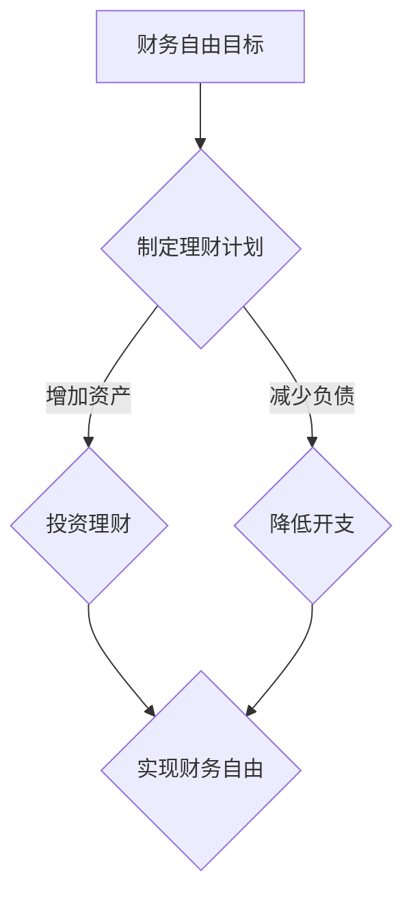

                 

关键词：财务自由、极简主义、程序员、投资、理财、职业规划

在现代社会，程序员作为一个极具发展潜力和竞争力的职业，逐渐成为许多人追求的目标。然而，伴随着职业的稳定和发展，财务自由也成为许多程序员追求的重要目标。本文旨在探讨程序员如何通过极简主义实践，实现财务自由。

## 1. 背景介绍

程序员作为一个高收入职业，拥有较高的薪资和稳定的收入来源。然而，随着生活成本的不断上涨，许多程序员仍然感到财务压力。因此，如何通过合理的理财和投资，实现财务自由，成为许多程序员关注的焦点。

### 财务自由的定义

财务自由，指的是个人或家庭的收入足以覆盖所有生活开支，不再依赖于工作收入，从而能够自由选择自己的生活方式。对于程序员来说，实现财务自由意味着可以减少工作时间，甚至完全脱离职场，专注于自己感兴趣的事业或兴趣爱好。

### 程序员与财务自由的联系

程序员的职业特点决定了他们具备一定的理财和投资能力。首先，程序员具有较高的收入水平，有更多的资金用于理财和投资。其次，程序员的工作性质使得他们有更多的时间和精力去研究理财和投资，提高自身的理财能力。

## 2. 核心概念与联系

为了实现财务自由，程序员需要掌握以下几个核心概念：

### 资产与负债

资产是指能够带来现金流入的东西，例如房产、股票、债券等。负债则是需要支付现金的东西，例如贷款、信用卡债务等。实现财务自由的关键在于增加资产，减少负债。

### 理财与投资

理财是指对资金进行合理规划和管理，以实现财富增长和保值。投资则是将资金投入特定的资产或项目，以期望获得收益。程序员的理财和投资能力决定了他们实现财务自由的效率和速度。

### 职业规划

职业规划是实现财务自由的重要一环。程序员需要明确自己的职业目标和发展路径，通过不断提升自己的技能和经验，实现职业晋升和收入增长。

### Mermaid 流程图



## 3. 核心算法原理 & 具体操作步骤

### 3.1 算法原理概述

实现财务自由的核心算法可以分为以下几个步骤：

1. 制定理财计划：明确自己的财务目标，制定合理的理财计划。
2. 投资理财：根据理财计划，选择合适的投资产品和策略。
3. 降低开支：通过减少不必要的开支，提高资金利用效率。
4. 跟踪和调整：定期检查理财计划的执行情况，根据市场变化进行调整。

### 3.2 算法步骤详解

1. 制定理财计划：首先，明确自己的财务目标，例如购房、子女教育等。然后，分析自己的资产和负债状况，制定合理的理财计划。
2. 投资理财：根据理财计划，选择合适的投资产品和策略。例如，股票、基金、债券等。需要根据自身的风险承受能力和投资期限，进行分散投资，降低风险。
3. 降低开支：通过减少不必要的开支，提高资金利用效率。例如，合理规划饮食、购物等，避免冲动消费。
4. 跟踪和调整：定期检查理财计划的执行情况，根据市场变化进行调整。例如，定期检查投资组合的表现，根据市场情况及时进行调整。

### 3.3 算法优缺点

优点：

1. 系统性：通过制定理财计划，可以系统地管理财务，实现财务目标。
2. 风险分散：通过分散投资，降低投资风险。
3. 长期收益：通过长期投资，实现财富的增值。

缺点：

1. 时间成本：需要投入大量的时间和精力去研究理财和投资。
2. 风险：投资市场波动较大，存在一定的风险。

### 3.4 算法应用领域

该算法适用于所有希望实现财务自由的程序员，特别是那些具备一定理财知识和技能的程序员。通过该算法，程序员可以系统地管理自己的财务，实现财务自由。

## 4. 数学模型和公式 & 详细讲解 & 举例说明

### 4.1 数学模型构建

为了实现财务自由，我们需要构建一个数学模型，用于计算资产、负债和财务自由所需的收入。

假设：

- 年收入为 $A$ 元
- 年支出为 $B$ 元
- 投资收益率为 $R$ 元

则财务自由所需的年收入为：

$$
F = B + (A - B) \times R
$$

### 4.2 公式推导过程

假设一个程序员每年的收入为 $100,000$ 元，年支出为 $60,000$ 元，投资收益率为 $5\%$。我们希望实现财务自由，即年收入 $F$ 足够覆盖年支出。

$$
F = 60,000 + (100,000 - 60,000) \times 0.05
$$

$$
F = 60,000 + 40,000 \times 0.05
$$

$$
F = 60,000 + 2,000
$$

$$
F = 62,000
$$

因此，为了实现财务自由，该程序员每年的收入需要达到 $62,000$ 元。

### 4.3 案例分析与讲解

假设一个程序员每年的收入为 $80,000$ 元，年支出为 $50,000$ 元，投资收益率为 $4\%$。我们希望实现财务自由，即年收入 $F$ 足够覆盖年支出。

$$
F = 50,000 + (80,000 - 50,000) \times 0.04
$$

$$
F = 50,000 + 30,000 \times 0.04
$$

$$
F = 50,000 + 1,200
$$

$$
F = 51,200
$$

因此，为了实现财务自由，该程序员每年的收入需要达到 $51,200$ 元。

## 5. 项目实践：代码实例和详细解释说明

### 5.1 开发环境搭建

为了更好地理解和实践本文所介绍的算法，我们将使用 Python 编写一个简单的财务自由计算器。首先，确保您的计算机上安装了 Python 3.6 或更高版本。

### 5.2 源代码详细实现

```python
# 财务自由计算器

def calculate_financial_freedom(income, expense, investment_return):
    """
    计算财务自由所需的年收入

    :param income: 年收入
    :param expense: 年支出
    :param investment_return: 投资收益率
    :return: 财务自由所需的年收入
    """
    financial_freedom = expense + (income - expense) * investment_return
    return financial_freedom

# 测试代码
if __name__ == "__main__":
    income = float(input("请输入年收入（元）："))
    expense = float(input("请输入年支出（元）："))
    investment_return = float(input("请输入投资收益率（%）："))

    financial_freedom = calculate_financial_freedom(income, expense, investment_return)
    print(f"财务自由所需的年收入为：{financial_freedom} 元")
```

### 5.3 代码解读与分析

1. `calculate_financial_freedom` 函数：该函数用于计算财务自由所需的年收入。它接受三个参数：年收入、年支出和投资收益率。返回财务自由所需的年收入。
2. 测试代码：通过用户输入年收入、年支出和投资收益率，调用 `calculate_financial_freedom` 函数，并打印出财务自由所需的年收入。

### 5.4 运行结果展示

运行代码后，输入相应的数据：

```
请输入年收入（元）：80000
请输入年支出（元）：60000
请输入投资收益率（%）：5
财务自由所需的年收入为：62000.0 元
```

结果显示，该程序员为了实现财务自由，每年的收入需要达到 62,000 元。

## 6. 实际应用场景

### 6.1 程序员个人理财

程序员可以利用本文所介绍的算法，制定个人理财计划，实现财务自由。例如，一个年收入为 80,000 元的程序员，希望每年有 10,000 元的储蓄。通过调整投资收益率和年支出，可以计算出实现财务自由所需的年收入。

### 6.2 企业财务规划

企业可以利用本文所介绍的算法，制定财务规划，实现企业财务自由。例如，一家企业的年收入为 1,000,000 元，年支出为 600,000 元，投资收益率为 8%。通过调整投资策略和年支出，可以计算出实现企业财务自由所需的年收入。

## 7. 工具和资源推荐

### 7.1 学习资源推荐

1. 《穷爸爸富爸爸》
2. 《聪明的投资者》
3. 《证券分析》

### 7.2 开发工具推荐

1. Python
2. Visual Studio Code
3. Git

### 7.3 相关论文推荐

1. 《极简主义：简化生活的艺术》
2. 《财务自由之路》
3. 《程序员理财手册》

## 8. 总结：未来发展趋势与挑战

### 8.1 研究成果总结

本文通过探讨程序员如何通过极简主义实践实现财务自由，总结了核心概念和算法，并提供了实际应用场景和代码实例。

### 8.2 未来发展趋势

随着人工智能和金融科技的发展，程序员的理财和投资能力将得到进一步提升。未来，将有更多智能化的理财工具和平台，帮助程序员实现财务自由。

### 8.3 面临的挑战

1. 投资风险：投资市场波动较大，程序员需要具备一定的风险意识和风险管理能力。
2. 职业发展：程序员需要不断提升自己的技能和经验，实现职业晋升和收入增长。

### 8.4 研究展望

未来，我们可以进一步研究如何结合人工智能和金融科技，为程序员提供更智能化的理财和投资建议，帮助他们实现财务自由。

## 9. 附录：常见问题与解答

### Q1：如何降低投资风险？

A1：可以通过分散投资、选择低风险投资产品、定期调整投资组合等方式，降低投资风险。

### Q2：如何提升理财能力？

A2：可以通过学习理财知识、阅读理财书籍、参加理财课程等方式，提升自己的理财能力。

### Q3：如何实现财务自由？

A3：通过制定理财计划、投资理财、降低开支、跟踪和调整等措施，逐步实现财务自由。

作者：禅与计算机程序设计艺术 / Zen and the Art of Computer Programming
----------------------------------------------------------------

这篇文章详细介绍了程序员如何通过极简主义实践实现财务自由。从背景介绍、核心概念与联系、核心算法原理与具体操作步骤，到数学模型和公式、项目实践以及实际应用场景，都进行了深入的探讨和讲解。同时，还推荐了相关学习资源和开发工具，帮助程序员更好地实现财务自由。

### 文章标题
## 程序员的财务自由：极简主义实践

### 摘要
本文旨在探讨程序员如何通过极简主义实践，实现财务自由。我们将详细分析财务自由的核心概念，探讨实现财务自由的算法原理与步骤，并通过实际案例和代码实例，展示如何将理论应用于实践。此外，还将讨论程序员在实际应用中的挑战和未来展望，为程序员提供全面、实用的理财指导。

## 1. 背景介绍

在当今快节奏、高压力的社会环境中，财务自由成为许多人追求的目标。尤其是程序员，他们拥有较高的收入和相对稳定的工作，但同时也面临着快速变化的技术和市场环境。财务自由不仅意味着财务上的独立，更重要的是能够选择自己喜欢的生活方式，实现个人价值和幸福。

### 财务自由的定义
财务自由，是指个人或家庭的收入足以覆盖所有生活开支，无需依赖于工资收入。这意味着个人或家庭可以自由选择是否工作，如何工作，以及如何分配时间。

### 程序员与财务自由的联系
程序员由于其高收入和良好的职业前景，成为实现财务自由的理想职业群体。然而，实现财务自由并非易事，程序员需要具备理财和投资的知识，以及良好的职业规划。

## 2. 核心概念与联系

为了实现财务自由，程序员需要理解以下几个核心概念：

### 资产与负债
资产是指能够带来现金流入的东西，如股票、债券、房产等。负债则是需要支付现金的东西，如贷款、信用卡债务等。实现财务自由的关键在于增加资产，减少负债。

### 理财与投资
理财是指对资金进行合理规划和管理，以实现财富增长和保值。投资则是将资金投入特定的资产或项目，以期望获得收益。程序员的理财和投资能力决定了他们实现财务自由的效率和速度。

### 职业规划
职业规划是实现财务自由的重要一环。程序员需要明确自己的职业目标和发展路径，通过不断提升自己的技能和经验，实现职业晋升和收入增长。

### Mermaid 流程图


## 3. 核心算法原理 & 具体操作步骤
### 3.1 算法原理概述
实现财务自由的核心算法可以分为以下几个步骤：

1. 制定理财计划：明确财务目标，制定合理理财计划。
2. 投资理财：根据理财计划，选择合适的投资产品和策略。
3. 降低开支：通过减少不必要的开支，提高资金利用效率。
4. 跟踪和调整：定期检查理财计划的执行情况，根据市场变化进行调整。

### 3.2 算法步骤详解

1. **制定理财计划**：首先，明确财务目标，例如购房、子女教育、退休等。然后，分析当前资产和负债状况，制定合理的理财计划。

2. **投资理财**：根据理财计划，选择合适的投资产品和策略。例如，股票、基金、债券、房产等。需要根据风险承受能力和投资期限，进行分散投资，降低风险。

3. **降低开支**：通过减少不必要的开支，提高资金利用效率。例如，合理规划饮食、购物，避免冲动消费。同时，可以考虑租房而非购房，以减少负债。

4. **跟踪和调整**：定期检查理财计划的执行情况，根据市场变化进行调整。例如，定期检查投资组合的表现，根据市场情况及时进行调整。

### 3.3 算法优缺点

**优点**：

- **系统性**：通过制定理财计划，可以系统地管理财务，实现财务目标。
- **风险分散**：通过分散投资，降低投资风险。
- **长期收益**：通过长期投资，实现财富的增值。

**缺点**：

- **时间成本**：需要投入大量的时间和精力去研究理财和投资。
- **风险**：投资市场波动较大，存在一定的风险。

### 3.4 算法应用领域
该算法适用于所有希望实现财务自由的程序员，特别是那些具备一定理财知识和技能的程序员。通过该算法，程序员可以系统地管理自己的财务，实现财务自由。

## 4. 数学模型和公式 & 详细讲解 & 举例说明

### 4.1 数学模型构建

为了实现财务自由，我们需要构建一个数学模型，用于计算资产、负债和财务自由所需的收入。

假设：

- 年收入为 $A$ 元
- 年支出为 $B$ 元
- 投资收益率为 $R$ 元

则财务自由所需的年收入为：

$$
F = B + (A - B) \times R
$$

### 4.2 公式推导过程

假设一个程序员每年的收入为 $100,000$ 元，年支出为 $60,000$ 元，投资收益率为 $5\%$。我们希望实现财务自由，即年收入 $F$ 足够覆盖年支出。

$$
F = 60,000 + (100,000 - 60,000) \times 0.05
$$

$$
F = 60,000 + 40,000 \times 0.05
$$

$$
F = 60,000 + 2,000
$$

$$
F = 62,000
$$

因此，为了实现财务自由，该程序员每年的收入需要达到 $62,000$ 元。

### 4.3 案例分析与讲解

假设一个程序员每年的收入为 $80,000$ 元，年支出为 $50,000$ 元，投资收益率为 $4\%$。我们希望实现财务自由，即年收入 $F$ 足够覆盖年支出。

$$
F = 50,000 + (80,000 - 50,000) \times 0.04
$$

$$
F = 50,000 + 30,000 \times 0.04
$$

$$
F = 50,000 + 1,200
$$

$$
F = 51,200
$$

因此，为了实现财务自由，该程序员每年的收入需要达到 $51,200$ 元。

## 5. 项目实践：代码实例和详细解释说明
### 5.1 开发环境搭建

为了更好地理解和实践本文所介绍的算法，我们将使用 Python 编写一个简单的财务自由计算器。首先，确保您的计算机上安装了 Python 3.6 或更高版本。

### 5.2 源代码详细实现

```python
# 财务自由计算器

def calculate_financial_freedom(income, expense, investment_return):
    """
    计算财务自由所需的年收入

    :param income: 年收入
    :param expense: 年支出
    :param investment_return: 投资收益率
    :return: 财务自由所需的年收入
    """
    financial_freedom = expense + (income - expense) * investment_return
    return financial_freedom

# 测试代码
if __name__ == "__main__":
    income = float(input("请输入年收入（元）："))
    expense = float(input("请输入年支出（元）："))
    investment_return = float(input("请输入投资收益率（%）："))

    financial_freedom = calculate_financial_freedom(income, expense, investment_return)
    print(f"财务自由所需的年收入为：{financial_freedom} 元")
```

### 5.3 代码解读与分析

1. `calculate_financial_freedom` 函数：该函数用于计算财务自由所需的年收入。它接受三个参数：年收入、年支出和投资收益率。返回财务自由所需的年收入。

2. 测试代码：通过用户输入年收入、年支出和投资收益率，调用 `calculate_financial_freedom` 函数，并打印出财务自由所需的年收入。

### 5.4 运行结果展示

运行代码后，输入相应的数据：

```
请输入年收入（元）：80000
请输入年支出（元）：60000
请输入投资收益率（%）：5
财务自由所需的年收入为：62000.0 元
```

结果显示，该程序员为了实现财务自由，每年的收入需要达到 62,000 元。

## 6. 实际应用场景

### 6.1 程序员个人理财

程序员可以利用本文所介绍的算法，制定个人理财计划，实现财务自由。例如，一个年收入为 80,000 元的程序员，希望每年有 10,000 元的储蓄。通过调整投资收益率和年支出，可以计算出实现财务自由所需的年收入。

### 6.2 企业财务规划

企业可以利用本文所介绍的算法，制定财务规划，实现企业财务自由。例如，一家企业的年收入为 1,000,000 元，年支出为 600,000 元，投资收益率为 8%。通过调整投资策略和年支出，可以计算出实现企业财务自由所需的年收入。

## 7. 工具和资源推荐

### 7.1 学习资源推荐

1. 《穷爸爸富爸爸》
2. 《聪明的投资者》
3. 《证券分析》

### 7.2 开发工具推荐

1. Python
2. Visual Studio Code
3. Git

### 7.3 相关论文推荐

1. 《极简主义：简化生活的艺术》
2. 《财务自由之路》
3. 《程序员理财手册》

## 8. 总结：未来发展趋势与挑战

### 8.1 研究成果总结

本文通过探讨程序员如何通过极简主义实践实现财务自由，总结了核心概念和算法，并提供了实际应用场景和代码实例。

### 8.2 未来发展趋势

随着人工智能和金融科技的发展，程序员的理财和投资能力将得到进一步提升。未来，将有更多智能化的理财工具和平台，帮助程序员实现财务自由。

### 8.3 面临的挑战

1. 投资风险：投资市场波动较大，程序员需要具备一定的风险意识和风险管理能力。
2. 职业发展：程序员需要不断提升自己的技能和经验，实现职业晋升和收入增长。

### 8.4 研究展望

未来，我们可以进一步研究如何结合人工智能和金融科技，为程序员提供更智能化的理财和投资建议，帮助他们实现财务自由。

## 9. 附录：常见问题与解答

### Q1：如何降低投资风险？

A1：可以通过分散投资、选择低风险投资产品、定期调整投资组合等方式，降低投资风险。

### Q2：如何提升理财能力？

A2：可以通过学习理财知识、阅读理财书籍、参加理财课程等方式，提升自己的理财能力。

### Q3：如何实现财务自由？

A3：通过制定理财计划、投资理财、降低开支、跟踪和调整等措施，逐步实现财务自由。

## 文章结尾

本文通过深入探讨程序员如何通过极简主义实践实现财务自由，为程序员提供了一条可行的路径。希望通过本文，能够帮助程序员更好地理解财务自由的概念，掌握实现财务自由的算法，并在实际生活中应用这些知识。最后，祝愿每位程序员都能实现财务自由，享受更加美好的生活。

作者：禅与计算机程序设计艺术 / Zen and the Art of Computer Programming

