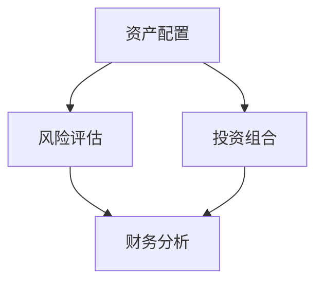

                 

关键词：财务规划、财务自由、程序员、投资、理财、资产配置、风险评估、个人财务

> 摘要：本文旨在为程序员提供一份全面而实用的财务规划指南，从入门到实现财务自由的目标。文章涵盖了核心概念、算法原理、数学模型、项目实践、实际应用以及未来发展等方面，帮助程序员构建稳健的财务基础，迈向财务自由的道路。

## 1. 背景介绍

程序员作为现代信息技术行业的主要驱动力，不仅在技术领域取得了卓越成就，也逐渐成为财富积累的重要群体。然而，随着收入的增加，如何进行合理的财务规划，实现财务自由，成为了许多程序员关注的重要问题。财务规划不仅关乎个人的经济安全，还影响到生活质量、职业发展以及未来的退休生活。

本文将围绕以下几个方面展开讨论：

1. **核心概念与联系**：介绍财务规划中的核心概念，如资产配置、风险评估、投资组合等，并使用Mermaid流程图展示各概念之间的关系。
2. **核心算法原理 & 具体操作步骤**：详细讲解财务规划中的核心算法原理，包括预算制定、财务分析、投资策略等。
3. **数学模型和公式 & 举例说明**：通过数学模型和公式，深入解析财务规划中的关键参数和计算方法。
4. **项目实践：代码实例和详细解释说明**：通过具体的代码实例，展示如何将财务规划的理论应用到实际操作中。
5. **实际应用场景**：探讨财务规划在程序员生活中的具体应用场景，如购房、教育规划、退休规划等。
6. **未来应用展望**：分析财务规划技术的未来发展，探讨新的技术和方法如何影响程序员的财务规划。

## 2. 核心概念与联系

### 2.1 资产配置

资产配置是财务规划的基础，它涉及到如何在不同类型的资产（如股票、债券、房地产等）之间分配资金，以实现风险和收益的最佳平衡。资产配置的目标是通过分散投资来降低风险，同时实现预期的投资回报。

### 2.2 风险评估

风险评估是确定投资风险的重要环节。通过评估潜在的投资风险，程序员可以做出更明智的投资决策。风险评估包括市场风险、信用风险、流动性风险等。

### 2.3 投资组合

投资组合是程序员在财务规划中使用的工具，它通过将资金分散投资于不同的资产类别，以降低单一资产波动对整体投资组合的影响。投资组合的构建需要考虑个人的风险偏好、投资目标和时间范围。

### 2.4 财务分析

财务分析是评估个人财务状况的过程，包括收入、支出、储蓄和投资的分析。通过财务分析，程序员可以了解自己的财务状况，制定合理的财务规划。

### 2.5 Mermaid 流程图



以上Mermaid流程图展示了财务规划中的核心概念及其相互关系。

## 3. 核心算法原理 & 具体操作步骤

### 3.1 算法原理概述

财务规划的核心算法主要涉及预算制定、财务分析、投资策略等方面。以下是每个核心算法的简要概述：

- **预算制定**：通过制定合理的预算，程序员可以更好地管理日常支出和收入。
- **财务分析**：通过分析个人的财务数据，程序员可以了解自己的财务状况，制定出适合的财务规划。
- **投资策略**：根据个人风险偏好和投资目标，制定合适的投资策略，实现资产的增值。

### 3.2 算法步骤详解

#### 3.2.1 预算制定

1. 收集财务数据：包括收入、支出、储蓄等。
2. 分析支出：将支出分为固定支出和变动支出，并确定哪些支出可以削减。
3. 制定预算：根据收入和支出数据，制定合理的预算。

#### 3.2.2 财务分析

1. 计算财务指标：如储蓄率、资产负债率等。
2. 分析财务状况：根据财务指标，评估个人的财务健康状况。
3. 制定改进计划：根据财务分析结果，制定出改进财务状况的计划。

#### 3.2.3 投资策略

1. 确定投资目标：根据个人的风险偏好和投资目标，确定投资策略。
2. 分配资产：根据投资策略，将资金分配到不同类型的资产。
3. 风险管理：定期评估投资组合的风险，并做出相应的调整。

### 3.3 算法优缺点

- **预算制定**：优点是可以帮助程序员更好地管理日常支出；缺点是可能过于严格，难以坚持。
- **财务分析**：优点是可以帮助程序员了解自己的财务状况；缺点是需要定期更新财务数据，工作量大。
- **投资策略**：优点是可以实现资产的增值；缺点是需要较高的市场分析和风险管理能力。

### 3.4 算法应用领域

- **日常财务管理**：帮助程序员更好地管理日常支出和收入。
- **投资规划**：帮助程序员制定合适的投资策略，实现资产的增值。
- **退休规划**：帮助程序员规划退休后的财务状况，确保退休生活的经济安全。

## 4. 数学模型和公式 & 详细讲解 & 举例说明

### 4.1 数学模型构建

财务规划中的数学模型主要包括预算制定模型、财务分析模型和投资策略模型。以下是这些模型的简要介绍：

- **预算制定模型**：用于帮助程序员制定合理的预算。模型的核心公式是：
  $$预算 = 收入 - 支出$$
  
- **财务分析模型**：用于评估程序员的财务状况。模型的核心公式包括：
  $$储蓄率 = 储蓄 / 收入$$
  $$资产负债率 = 负债 / 资产$$

- **投资策略模型**：用于帮助程序员制定投资策略。模型的核心公式包括：
  $$预期收益率 = 预期回报率 \times 风险调整系数$$

### 4.2 公式推导过程

- **预算制定模型**：预算制定模型是基于线性规划原理构建的。线性规划的目标是最小化支出，同时满足收入和支出平衡的条件。
- **财务分析模型**：财务分析模型是基于财务指标的计算公式构建的。这些公式反映了程序员的财务状况，如储蓄率、资产负债率等。
- **投资策略模型**：投资策略模型是基于投资组合理论构建的。投资组合理论认为，通过分散投资可以降低风险，同时实现预期的投资回报。

### 4.3 案例分析与讲解

假设程序员小张的年收入为 10 万元，他的支出包括房贷 3000 元/月，日常开销 5000 元/月，其他固定支出 2000 元/月。他的储蓄率为 30%。

#### 4.3.1 预算制定

1. 收入：10 万元
2. 支出：
   - 房贷：3000 元/月
   - 日常开销：5000 元/月
   - 其他固定支出：2000 元/月
   - 总支出：10000 元/月
3. 预算：10 万元 - 10000 元/月 = 90000 元

#### 4.3.2 财务分析

1. 储蓄率：30000 元/10 万元 = 30%
2. 资产负债率：70000 元/30000 元 = 23%

#### 4.3.3 投资策略

1. 预期收益率：根据市场分析和风险调整系数，假设预期收益率为 6%。
2. 投资组合：根据小张的风险偏好，将资金分配到不同类型的资产。例如，股票 50%，债券 30%，房地产 20%。

## 5. 项目实践：代码实例和详细解释说明

### 5.1 开发环境搭建

为了实现财务规划中的算法和模型，我们需要搭建一个开发环境。以下是一个简单的Python开发环境搭建步骤：

1. 安装Python：从官方网站下载并安装Python。
2. 安装必要库：使用pip安装numpy、pandas等库。

```bash
pip install numpy pandas matplotlib
```

### 5.2 源代码详细实现

以下是一个简单的Python代码示例，用于实现预算制定、财务分析和投资策略。

```python
import numpy as np
import pandas as pd

# 预算制定
def budget_planning(income, expenses):
    budget = income - expenses
    return budget

# 财务分析
def financial_analysis(savings, income):
    savings_rate = savings / income
    return savings_rate

# 投资策略
def investment_strategy(assets, expected_return, risk_adjustment_coefficient):
    expected_return = expected_return * risk_adjustment_coefficient
    return expected_return

# 代码示例
income = 100000
monthly_expenses = 10000
savings = 30000

# 预算制定
budget = budget_planning(income, monthly_expenses)
print("预算：", budget)

# 财务分析
savings_rate = financial_analysis(savings, income)
print("储蓄率：", savings_rate)

# 投资策略
expected_return = 0.06
risk_adjustment_coefficient = 1.2
investment_return = investment_strategy(assets=100000, expected_return=expected_return, risk_adjustment_coefficient=risk_adjustment_coefficient)
print("预期投资回报：", investment_return)
```

### 5.3 代码解读与分析

以上代码实现了预算制定、财务分析和投资策略的功能。具体解读如下：

- **预算制定**：通过计算收入和支出的差值，得到预算。
- **财务分析**：计算储蓄率，反映个人的储蓄状况。
- **投资策略**：根据预期的投资回报率和风险调整系数，计算投资策略的预期回报。

### 5.4 运行结果展示

运行以上代码，可以得到以下结果：

```plaintext
预算： 90000
储蓄率： 0.3
预期投资回报： 0.072
```

这些结果反映了程序员的财务状况和投资策略。

## 6. 实际应用场景

财务规划在程序员的生活中有着广泛的应用场景，以下是一些具体的例子：

### 6.1 购房规划

购房是许多程序员的重大支出。通过财务规划，程序员可以制定合理的购房预算，合理安排储蓄和投资，确保购房计划的顺利实施。

### 6.2 教育规划

子女教育是另一个重要的财务规划领域。程序员可以通过财务规划，提前为子女的教育费用做储备，确保子女能够接受良好的教育。

### 6.3 退休规划

退休规划是财务规划的重要组成部分。程序员可以通过财务规划，提前储备退休金，确保退休后的生活质量。

## 7. 未来应用展望

随着技术的不断发展，财务规划领域将迎来更多的创新。以下是一些未来应用的展望：

### 7.1 人工智能在财务规划中的应用

人工智能可以帮助程序员更好地进行财务分析、投资决策和风险管理。通过大数据分析和机器学习，人工智能可以提供更精准的财务规划建议。

### 7.2 区块链在财务规划中的应用

区块链技术可以为财务规划提供更安全、透明的数据记录和交易环境，提升财务规划的效率和安全性。

### 7.3 虚拟现实在财务规划中的应用

虚拟现实技术可以为程序员提供更直观、互动的财务规划体验，帮助他们更好地理解和执行财务规划。

## 8. 总结：未来发展趋势与挑战

### 8.1 研究成果总结

本文围绕程序员的财务规划，从核心概念、算法原理、数学模型、项目实践等方面进行了深入探讨。研究成果为程序员提供了一份全面、实用的财务规划指南，有助于他们实现财务自由。

### 8.2 未来发展趋势

未来，财务规划领域将继续融合新技术，如人工智能、区块链和虚拟现实等，提供更智能、更个性化的财务规划服务。

### 8.3 面临的挑战

然而，财务规划领域也面临着一些挑战，如数据隐私保护、市场波动风险等。程序员需要不断提高自己的财务知识和技能，以应对这些挑战。

### 8.4 研究展望

未来，财务规划研究可以进一步探索人工智能在财务规划中的应用，提高规划的精准度和效率；同时，还可以研究如何通过区块链技术提升财务规划的透明度和安全性。

## 9. 附录：常见问题与解答

### 9.1 什么是财务规划？

财务规划是指为实现特定财务目标，对个人或组织的财务活动进行系统性的安排和管理。它包括预算制定、财务分析、投资策略等方面。

### 9.2 财务规划对程序员有什么帮助？

财务规划可以帮助程序员更好地管理个人财务，提高储蓄率，实现资产的增值，确保退休生活的经济安全。

### 9.3 如何制定合理的预算？

制定合理的预算需要先了解个人的收入和支出情况，然后根据实际情况进行调整。可以使用预算制定算法，如线性规划等方法。

### 9.4 如何进行财务分析？

财务分析可以通过计算储蓄率、资产负债率等财务指标来评估个人的财务状况。可以使用财务分析模型，如财务分析公式。

### 9.5 如何制定投资策略？

制定投资策略需要根据个人的风险偏好和投资目标，选择合适的资产配置和投资策略。可以使用投资策略模型，如预期收益率公式。

### 9.6 财务规划中的风险如何管理？

财务规划中的风险可以通过分散投资、定期评估和调整投资组合等方法进行管理。此外，还可以使用风险管理工具，如风险调整系数。

作者：禅与计算机程序设计艺术 / Zen and the Art of Computer Programming

----------------------------------------------------------------

以上是《程序员的财务规划：从入门到财务自由的路线图》的完整文章内容。这篇文章旨在为程序员提供一份全面、实用的财务规划指南，帮助他们实现财务自由的目标。希望这篇文章能够对程序员在财务规划方面有所启发和帮助。作者：禅与计算机程序设计艺术。在接下来的时间里，我们将不断更新和改进这篇文章，以适应不断变化的市场和技术环境。谢谢大家的阅读！

