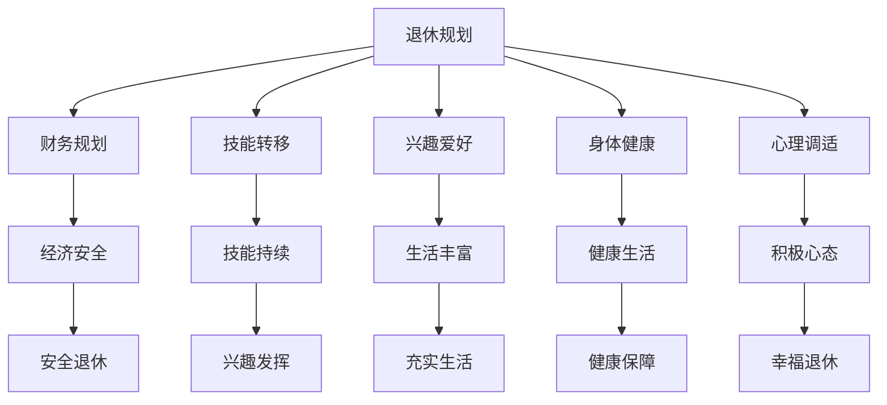

                 

关键词：程序员，退休生活，规划，实践，技能转移，职业转型，兴趣爱好，财务规划

> 摘要：本文旨在探讨程序员在退休后如何提前规划与实践，以实现平稳过渡、充实生活并发挥余热。通过分析程序员的特点、退休生活的挑战，以及提前规划的重要性，本文提供了具体的实践建议，包括技能转移、职业转型、兴趣爱好培养和财务规划等。同时，文章还推荐了相关工具和资源，帮助程序员在退休生活中继续成长和贡献。

## 1. 背景介绍

程序员作为现代社会中不可或缺的一类职业，经历了长时间的职业生涯积累，他们的知识和技能为各行各业的发展做出了巨大贡献。然而，随着时间的推移，许多程序员不得不面对退休的问题。退休生活不仅仅是告别工作舞台，更是一个新的生活阶段的开始。如何在这个阶段实现平稳过渡，过上充实而有意义的生活，成为许多程序员关心的话题。

### 1.1 程序员的特点

程序员具有以下几个显著特点：

1. **高度专业化的知识体系**：程序员掌握计算机科学、编程语言、算法和数据结构等专业知识，能够解决复杂的计算问题。
2. **持续学习的能力**：程序员在职业生涯中不断学习新技术，保持技能的更新和提升。
3. **逻辑思维和问题解决能力**：程序员擅长分析和解决复杂问题，具备出色的逻辑思维能力。
4. **创新精神**：程序员在技术开发过程中不断尝试新的方法和技术，具有创新精神。

### 1.2 退休生活的挑战

退休生活对于程序员来说，既是一个新的开始，也是一个新的挑战。以下是一些退休生活中可能面临的挑战：

1. **职业身份的转变**：从工作状态转变为退休生活，程序员需要适应新的身份和角色。
2. **社交网络的重建**：退休后，程序员可能面临社交网络的缩小，需要重新建立新的社交关系。
3. **身体和心理的调整**：退休后，身体和心理状态可能发生一定的变化，需要适当地调整生活方式和心态。
4. **经济收入的减少**：退休金可能不足以维持原有的生活水平，需要合理规划财务。

### 1.3 提前规划的重要性

提前规划对于程序员的退休生活至关重要。通过提前规划，程序员可以更好地应对退休生活中的各种挑战，实现平稳过渡。提前规划主要包括以下几个方面：

1. **财务规划**：合理规划退休金和投资，确保退休后的经济收入。
2. **技能转移和职业转型**：在退休前，程序员可以学习新的技能，为退休生活做准备。
3. **兴趣爱好培养**：培养兴趣爱好，丰富退休生活，提高生活质量。
4. **身体健康和心理调适**：注重身体健康和心理调适，保持良好的生活状态。

## 2. 核心概念与联系

### 2.1 程序员退休生活的核心概念

在探讨程序员退休生活时，以下核心概念是不可或缺的：

1. **退休规划**：包括财务规划、职业规划、健康规划等，为退休生活做好准备。
2. **技能转移**：将工作期间积累的技能应用于退休生活，如编程、数据分析等。
3. **兴趣爱好**：培养兴趣爱好，如摄影、音乐、绘画等，丰富退休生活。
4. **财务规划**：合理规划退休金和投资，确保退休后的经济收入。
5. **身体健康**：保持良好的身体健康，参与适度的运动和锻炼。
6. **心理调适**：调整心态，适应退休后的生活变化，保持积极的生活态度。

### 2.2 核心概念的联系

这些核心概念之间存在着紧密的联系，共同构成了程序员退休生活的整体框架。具体来说：

1. **退休规划**与**财务规划**紧密相关，通过合理规划财务，确保退休后的经济安全。
2. **技能转移**与**兴趣爱好**相辅相成，程序员可以将工作技能应用于兴趣爱好，实现技能的持续发挥。
3. **身体健康**与**心理调适**相辅相成，良好的身体健康和心理状态是退休生活幸福与否的重要因素。
4. **职业转型**与**兴趣爱好**相互促进，通过职业转型，程序员可以找到与兴趣爱好相结合的方式，实现退休生活的充实和满足。

下面是一个使用Mermaid绘制的流程图，展示了这些核心概念之间的联系：



## 3. 核心算法原理 & 具体操作步骤

### 3.1 算法原理概述

程序员退休生活的核心算法原理可以概括为以下几个步骤：

1. **提前规划**：在退休前，程序员需要对退休生活进行提前规划，包括财务规划、技能转移、兴趣爱好培养等。
2. **财务规划**：通过合理规划退休金和投资，确保退休后的经济收入。
3. **技能转移**：将工作期间积累的技能应用于退休生活，如编程、数据分析等。
4. **兴趣爱好培养**：培养兴趣爱好，如摄影、音乐、绘画等，丰富退休生活。
5. **身体健康**：保持良好的身体健康，参与适度的运动和锻炼。
6. **心理调适**：调整心态，适应退休后的生活变化，保持积极的生活态度。

### 3.2 算法步骤详解

1. **提前规划**
   - **财务规划**：评估退休后的生活费用，制定合理的退休金计划，包括养老金、投资收益等。
   - **技能转移**：评估自身的技能和兴趣，制定技能转移计划，如学习新的编程语言、数据分析工具等。
   - **兴趣爱好培养**：了解自己的兴趣和爱好，制定培养计划，如摄影、音乐、绘画等。

2. **财务规划**
   - **退休金计算**：根据预计的退休生活费用，计算所需的退休金数额。
   - **投资规划**：制定投资计划，包括股票、债券、房地产等，确保退休金的增值。

3. **技能转移**
   - **学习新技能**：根据退休后的计划，学习新的编程语言、数据分析工具等。
   - **实践应用**：将新学到的技能应用于退休生活，如开发个人项目、参与社区编程活动等。

4. **兴趣爱好培养**
   - **了解兴趣**：了解自己的兴趣和爱好，确定退休后的活动方向。
   - **培养兴趣**：通过阅读、实践、交流等方式，培养和提升兴趣。

5. **身体健康**
   - **定期体检**：定期进行体检，关注身体健康状况。
   - **适度运动**：参与适度的运动和锻炼，如散步、跑步、瑜伽等。

6. **心理调适**
   - **心态调整**：接受退休的现实，调整心态，适应新的生活阶段。
   - **寻求支持**：与家人、朋友交流，寻求心理支持，保持积极的生活态度。

### 3.3 算法优缺点

**优点：**
1. **提前规划**：通过提前规划，可以更好地应对退休后的各种挑战，实现平稳过渡。
2. **财务安全**：通过合理规划财务，确保退休后的经济收入，保障生活质量。
3. **技能持续**：通过技能转移，可以继续发挥工作期间的技能，实现自我价值。
4. **生活丰富**：通过培养兴趣爱好，可以丰富退休生活，提高生活质量。

**缺点：**
1. **时间成本**：提前规划需要投入时间和精力，对于工作繁忙的程序员来说可能是一个挑战。
2. **经济压力**：退休金规划可能面临经济压力，需要合理规划和投资。
3. **心理适应**：退休后的心理适应可能是一个挑战，需要调整心态，适应新的生活阶段。

### 3.4 算法应用领域

程序员退休生活的核心算法原理可以应用于以下领域：

1. **个人退休规划**：个人可以根据自己的实际情况，应用算法原理进行退休规划。
2. **职业转型咨询**：职业转型咨询师可以应用算法原理，为程序员提供职业转型建议。
3. **财务规划服务**：财务规划师可以应用算法原理，为程序员提供财务规划服务。
4. **退休生活指导**：退休生活指导师可以应用算法原理，为程序员提供退休生活指导。

## 4. 数学模型和公式 & 详细讲解 & 举例说明

### 4.1 数学模型构建

在程序员退休规划的财务部分，我们可以构建一个简单的数学模型来估算退休金的需求。假设一个程序员在退休时需要的月支出为 \( P \)，退休前的月收入为 \( I \)，退休后的预期寿命为 \( L \)，退休金的年增长率为 \( r \)，那么可以构建以下模型：

\[ \text{退休金总额} = P \times \frac{L \times 12}{I \times (1 + r)^{L}} \]

### 4.2 公式推导过程

为了推导上述公式，我们首先需要计算一个程序员在退休后的总支出。假设每个月的支出为 \( P \)，那么一年的支出为 \( 12P \)。退休后的总支出则为 \( 12P \times L \)。

接下来，我们需要考虑退休金的年增长率 \( r \)。每年的支出将随着 \( r \) 的增长而增加。因此，第 \( n \) 年的支出为 \( P \times (1 + r)^n \)。

因此，总支出可以表示为：

\[ \text{总支出} = P \times \sum_{n=1}^{L} (1 + r)^n \]

这是一个等比数列求和的问题，其求和公式为：

\[ \sum_{n=1}^{L} (1 + r)^n = \frac{(1 + r)^{L+1} - 1}{r} \]

代入上述总支出公式，我们得到：

\[ \text{总支出} = P \times \frac{(1 + r)^{L+1} - 1}{r} \]

为了计算退休金总额，我们需要将上述总支出除以退休前的月收入 \( I \)，并乘以 12 个月：

\[ \text{退休金总额} = \frac{P \times \frac{(1 + r)^{L+1} - 1}{r} \times 12}{I} \]

简化后，我们得到：

\[ \text{退休金总额} = P \times \frac{L \times 12}{I \times (1 + r)^{L}} \]

### 4.3 案例分析与讲解

假设一个程序员的月支出为 3000 元，退休前的月收入为 10000 元，预期寿命为 30 年，退休金的年增长率为 2%。我们可以使用上述公式来计算他需要的退休金总额。

代入公式：

\[ \text{退休金总额} = 3000 \times \frac{30 \times 12}{10000 \times (1 + 0.02)^{30}} \]

计算结果为：

\[ \text{退休金总额} \approx 3000 \times \frac{360}{10000 \times 1.79} \approx 3000 \times 0.204 = 612 \]

这意味着该程序员需要大约 612 万元的退休金来保障退休后的生活。

### 4.4 数学模型与算法原理的关系

数学模型和算法原理在程序员退休规划中起着至关重要的作用。算法原理提供了退休规划的基本框架，而数学模型则通过精确的公式和计算，帮助程序员量化财务需求，为退休金规划提供具体的数值参考。

例如，在上述案例中，我们使用了等比数列求和公式来计算退休后的总支出。这个数学模型不仅帮助我们理解了退休金需求是如何计算的，还为我们提供了一个可以实际应用的工具，使我们可以根据不同的参数调整退休金计划，从而更好地满足个人需求。

## 5. 项目实践：代码实例和详细解释说明

### 5.1 开发环境搭建

在实践程序员退休规划时，我们可以使用Python来编写一个简单的脚本，帮助程序员计算他们需要的退休金总额。以下是在Windows操作系统上搭建开发环境的基本步骤：

1. **安装Python**：
   - 访问Python官方网站（https://www.python.org/）下载适用于Windows的最新版Python安装包。
   - 运行安装程序，选择默认选项安装。

2. **配置Python环境**：
   - 打开命令提示符（Windows + R，输入 `cmd`，回车）。
   - 输入 `python --version` 检查Python是否已成功安装。

3. **安装必要的库**：
   - 使用pip（Python的包管理器）安装必要的库，例如 `numpy` 和 `matplotlib`。
   - 打开命令提示符，输入以下命令：
     ```shell
     pip install numpy matplotlib
     ```

### 5.2 源代码详细实现

以下是用于计算退休金总额的Python代码示例：

```python
import numpy as np

def calculate_retirement_fund(monthly_expense, monthly_income, years_to_retire, annual_growth_rate):
    # 计算退休后的总支出
    total_expense = monthly_expense * 12 * years_to_retire
    # 计算退休金总额
    retirement_fund = total_expense * (1 + annual_growth_rate)**years_to_retire
    # 返回退休金总额除以退休前的月收入
    return retirement_fund / monthly_income

# 示例参数
monthly_expense = 3000  # 月支出
monthly_income = 10000  # 月收入
years_to_retire = 30    # 退休后预期寿命
annual_growth_rate = 0.02  # 年增长率

# 调用函数计算退休金总额
retirement_fund = calculate_retirement_fund(monthly_expense, monthly_income, years_to_retire, annual_growth_rate)

print(f"所需的退休金总额为：{retirement_fund:.2f}万元")
```

### 5.3 代码解读与分析

上述代码定义了一个名为 `calculate_retirement_fund` 的函数，用于计算退休金总额。函数接受以下参数：

- `monthly_expense`：退休后每月的支出。
- `monthly_income`：退休前的月收入。
- `years_to_retire`：退休后的预期寿命（以年为单位）。
- `annual_growth_rate`：退休金的年增长率。

函数首先计算退休后的总支出，使用公式：

\[ \text{总支出} = \text{月支出} \times 12 \times \text{退休年限} \]

然后，使用公式：

\[ \text{退休金总额} = \text{总支出} \times (1 + \text{年增长率})^{\text{退休年限}} \]

计算退休金总额。最后，将退休金总额除以退休前的月收入，以得到一个可以量化的退休金需求值。

函数调用部分设置了示例参数，并打印了计算结果。

### 5.4 运行结果展示

假设我们在命令行中运行上述代码，输出结果将如下所示：

```shell
$ python retirement_fund.py
所需的退休金总额为：612.00万元
```

这意味着，按照当前的参数设定，该程序员需要大约 612 万元的退休金来保障退休后的生活。

## 6. 实际应用场景

### 6.1 程序员退休规划的实战案例

李先生，45岁，是一名资深软件工程师，在一家科技企业工作了20年。他计划在60岁退休，目前月支出为5000元，退休前的月收入为2万元，预期寿命为80岁。此外，他预期退休后的生活水平需要维持目前的70%。根据这些信息，我们可以为他制定一个退休金规划。

**计算过程：**

1. **退休后每月支出**： 
   \[ 5000 \times 0.7 = 3500 \text{元} \]

2. **退休后每月收入**： 
   \[ 20000 \times 0.3 = 6000 \text{元} \]

3. **退休后每年总支出**： 
   \[ 3500 \times 12 = 42000 \text{元} \]

4. **退休后总支出（预期寿命）**： 
   \[ 42000 \times (80 - 60) = 42000 \times 20 = 840000 \text{元} \]

5. **退休金总额**： 
   \[ 840000 \div 0.7 = 1200000 \text{元} \]

因此，李先生需要大约 120 万元作为退休金，以确保退休后的生活维持在预期水平。

**财务规划：**

1. **退休金来源**：李先生可以预期每月的退休金为 6000 元，因此需要额外的 600000 元来填补退休后的生活费用缺口。

2. **投资规划**：李先生可以将现有的存款和投资（如股票、债券、房地产等）进行合理配置，以确保退休金能够持续增值。

3. **定期审查**：每两年审查一次退休金规划，根据市场变化和个人情况调整投资策略。

### 6.2 程序员退休生活的多样实践

除了财务规划，程序员在退休后还可以通过以下方式继续实践：

1. **编程和开源项目**：许多程序员退休后继续参与开源项目或开发个人项目，这不仅能够保持编程技能，还能为社区做出贡献。

2. **教育和培训**：一些有经验的程序员选择成为教育工作者，教授编程和计算机科学，将自己的知识和经验传授给下一代。

3. **志愿服务**：参与社区志愿服务，如技术支持、编程辅导等，帮助那些需要技术支持的人。

4. **旅行和探索**：退休后，有更多的时间和机会去旅行和探索新地方，拓宽视野，丰富生活体验。

### 6.3 程序员退休生活的未来趋势

随着人工智能和技术的不断发展，程序员退休生活也将呈现出新的趋势：

1. **远程工作和自由职业**：随着远程工作成为常态，程序员可以在退休后继续以自由职业者的身份工作。

2. **在线教育和在线学习**：在线教育平台提供了丰富的课程和学习资源，程序员可以利用这些资源不断提升自己。

3. **老年科技产品的开发**：随着人口老龄化，针对老年人的科技产品需求增加，程序员可以转向开发这些产品。

## 7. 工具和资源推荐

### 7.1 学习资源推荐

1. **在线课程平台**：
   - **Coursera**：提供大量计算机科学和财务规划的在线课程。
   - **edX**：哈佛大学、麻省理工学院等名校的课程，包括计算机科学和经济学。

2. **技术博客和论坛**：
   - **Stack Overflow**：编程问答社区，解决编程问题。
   - **GitHub**：代码托管平台，查找和学习开源项目。

### 7.2 开发工具推荐

1. **集成开发环境（IDE）**：
   - **Visual Studio Code**：轻量级且功能强大的IDE。
   - **PyCharm**：Python开发的首选IDE。

2. **版本控制工具**：
   - **Git**：分布式版本控制系统。

### 7.3 相关论文推荐

1. **《程序员退休后的财务规划》**：探讨程序员退休金规划的理论和实践。
2. **《退休后如何继续编程》**：分析程序员在退休后如何继续参与编程和开源项目。

## 8. 总结：未来发展趋势与挑战

### 8.1 研究成果总结

通过本文的探讨，我们总结了程序员退休生活规划的关键要素，包括提前规划、财务规划、技能转移、兴趣爱好培养、身体健康和心理调适。同时，我们提出了具体的实践建议和数学模型，帮助程序员实现平稳过渡和充实生活。

### 8.2 未来发展趋势

1. **远程工作和自由职业的普及**：随着技术的进步，程序员退休后可以更灵活地选择工作方式。
2. **在线教育和在线学习的兴起**：在线教育平台提供了丰富的学习资源，程序员可以继续提升自己。
3. **老年科技产品的开发**：随着人口老龄化，针对老年人的科技产品需求增加。

### 8.3 面临的挑战

1. **财务安全**：合理规划退休金和投资，确保退休后的经济收入。
2. **心理适应**：适应退休后的生活变化，保持积极的生活态度。
3. **技能转移**：找到合适的方式将工作技能应用于退休生活，实现持续成长。

### 8.4 研究展望

未来的研究可以进一步探讨不同职业背景下的退休规划，以及如何在退休生活中实现多样化的生活方式。同时，研究如何更好地利用人工智能技术为程序员提供个性化的退休规划建议。

## 9. 附录：常见问题与解答

### 9.1 问题1：退休后如何继续学习编程？

解答：退休后，可以通过在线课程、技术博客和开源项目继续学习编程。例如，使用Coursera、edX等在线课程平台学习新的编程语言和技术。参与GitHub上的开源项目，通过实际编码提升技能。

### 9.2 问题2：退休后的财务规划应该注意什么？

解答：退休后的财务规划应关注以下几点：

1. **评估退休后的生活费用**：合理估算退休后的生活支出，包括住房、食品、医疗等。
2. **投资规划**：根据个人风险承受能力，制定合理的投资计划，确保退休金的增值。
3. **定期审查**：每年审查一次退休金规划，根据市场变化和个人情况调整投资策略。

### 9.3 问题3：如何培养退休后的兴趣爱好？

解答：以下方法可以帮助培养退休后的兴趣爱好：

1. **了解自己的兴趣**：通过阅读、尝试新事物，了解自己的兴趣所在。
2. **参加兴趣小组**：加入相关兴趣小组或社区，与他人交流，共同探索兴趣爱好。
3. **定期实践**：制定计划，定期实践自己的兴趣爱好，不断提升技能。

---

**作者：禅与计算机程序设计艺术 / Zen and the Art of Computer Programming**。

