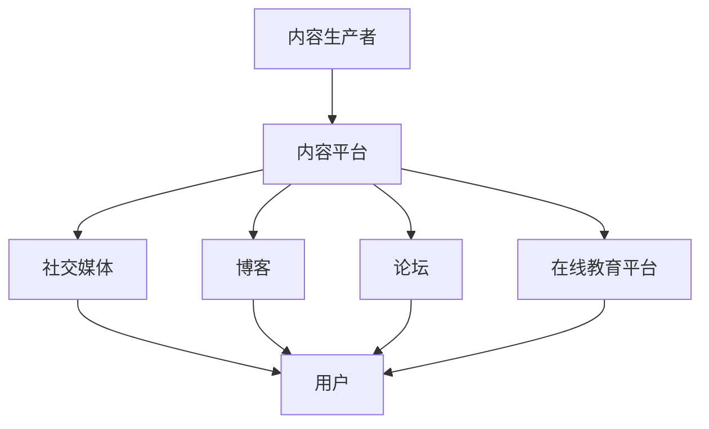

                 

关键词：程序员知识付费、内容分发渠道、优化策略、社交媒体、博客、论坛、在线教育平台、算法推荐系统、用户体验、商业模式、数据分析

> 摘要：本文将探讨程序员知识付费的内容分发渠道优化问题。通过对当前主流的内容分发渠道进行分析，本文将提出一系列优化策略，旨在提高用户体验、增加用户粘性、提升内容传播效果，从而实现知识付费业务的可持续发展。

## 1. 背景介绍

随着互联网技术的快速发展，知识付费已成为一种重要的商业模式。程序员作为互联网行业的中坚力量，对知识的渴求尤为强烈。然而，面对海量的知识资源，如何有效地获取和利用这些资源成为程序员们的一大难题。内容分发渠道的优化，成为了提升程序员知识获取效率的关键。

当前，程序员知识付费的内容分发渠道主要包括社交媒体、博客、论坛、在线教育平台等。这些渠道各具特色，但也存在诸多挑战，如信息过载、用户粘性不足、内容质量参差不齐等。为了解决这些问题，本文将探讨一系列优化策略。

## 2. 核心概念与联系

### 2.1 内容分发渠道的概念

内容分发渠道是指信息从生产者到消费者之间的传递路径。在程序员知识付费领域，内容分发渠道包括：

1. **社交媒体**：如微博、知乎等，通过社交关系网进行内容传播。
2. **博客**：如个人博客、技术博客等，提供专业的技术内容。
3. **论坛**：如Stack Overflow、CSDN等，用户之间互动交流。
4. **在线教育平台**：如慕课网、网易云课堂等，提供系统化的知识培训。

### 2.2 优化策略

为了优化程序员知识付费的内容分发渠道，我们需要从以下几个方面进行考虑：

1. **用户体验**：提高内容获取的便捷性和个性化推荐。
2. **内容质量**：确保内容的权威性和专业性。
3. **用户粘性**：增加用户在平台上的活跃度和留存率。
4. **商业模式**：探索可持续的商业运营模式。

### 2.3 Mermaid 流程图



## 3. 核心算法原理 & 具体操作步骤

### 3.1 算法原理概述

为了优化内容分发渠道，我们需要借助数据分析和机器学习技术。核心算法包括：

1. **用户行为分析**：通过分析用户在平台上的行为，了解用户偏好。
2. **内容推荐算法**：根据用户行为和内容特征，实现个性化推荐。
3. **内容质量评估**：通过算法评估内容的专业性和权威性。

### 3.2 算法步骤详解

1. **用户行为分析**：

   - 收集用户在平台上的行为数据，如浏览记录、点赞、评论等。
   - 利用机器学习算法，分析用户行为，提取用户兴趣标签。

2. **内容推荐算法**：

   - 基于用户兴趣标签，推荐相关的内容。
   - 利用协同过滤、基于内容的推荐等技术，提高推荐效果。

3. **内容质量评估**：

   - 利用自然语言处理技术，分析内容的专业性。
   - 结合用户反馈和专家评审，评估内容的权威性。

### 3.3 算法优缺点

**优点**：

- 提高内容获取的便捷性。
- 提升用户粘性和用户体验。

**缺点**：

- 需要大量的数据和计算资源。
- 可能存在推荐偏差和冷启动问题。

### 3.4 算法应用领域

- 知识付费平台
- 在线教育平台
- 社交媒体平台

## 4. 数学模型和公式 & 详细讲解 & 举例说明

### 4.1 数学模型构建

**协同过滤算法**：

$$
R(u, i) = \frac{\sum_{j \in N(u)} r(u, j) r(j, i)}{\sum_{j \in N(u)} r(j, i)}
$$

其中，$R(u, i)$ 表示用户 $u$ 对项目 $i$ 的预测评分，$N(u)$ 表示用户 $u$ 的邻居集合，$r(u, j)$ 和 $r(j, i)$ 分别表示用户 $u$ 对项目 $j$ 的评分和用户 $j$ 对项目 $i$ 的评分。

### 4.2 公式推导过程

**基于内容的推荐算法**：

$$
\sim \text{Sim}(c_i, c_j) = \frac{\sum_{k \in C} w_{ik} w_{jk}}{\| \mathbf{w}_i \| \| \mathbf{w}_j \| }
$$

其中，$\sim \text{Sim}(c_i, c_j)$ 表示项目 $i$ 和项目 $j$ 之间的相似度，$w_{ik}$ 和 $w_{jk}$ 分别表示项目 $i$ 和项目 $j$ 在特征 $k$ 上的权重，$C$ 表示所有特征集合。

### 4.3 案例分析与讲解

**案例分析**：

假设有两个程序员用户 $A$ 和 $B$，他们分别对多个技术文章进行了评分。我们可以通过协同过滤算法，预测用户 $A$ 对某个未知文章 $C$ 的评分。

**具体步骤**：

1. 收集用户 $A$ 和 $B$ 的评分数据。
2. 计算用户 $A$ 和 $B$ 的邻居集合。
3. 利用协同过滤算法，计算用户 $A$ 对文章 $C$ 的预测评分。

## 5. 项目实践：代码实例和详细解释说明

### 5.1 开发环境搭建

- **Python**
- **Scikit-learn**
- **Pandas**

### 5.2 源代码详细实现

```python
from sklearn.metrics.pairwise import cosine_similarity
from sklearn.model_selection import train_test_split
import pandas as pd

# 加载数据
ratings = pd.read_csv('ratings.csv')
users = pd.read_csv('users.csv')
items = pd.read_csv('items.csv')

# 划分训练集和测试集
train_data, test_data = train_test_split(ratings, test_size=0.2, random_state=42)

# 计算用户和项目的特征矩阵
user_features = users.pivot_table(values='rating', index='user_id', columns='item_id', fill_value=0)
item_features = items.pivot_table(values='rating', index='user_id', columns='item_id', fill_value=0)

# 计算相似度矩阵
user_similarity = cosine_similarity(user_features)
item_similarity = cosine_similarity(item_features)

# 预测评分
def predict_rating(user_id, item_id):
    user_vector = user_features.loc[user_id]
    item_vector = item_features.loc[item_id]
    user_similarity_vector = user_similarity[user_id]
    item_similarity_vector = item_similarity[item_id]
    predicted_rating = (user_vector * item_vector * user_similarity_vector * item_similarity_vector).sum()
    return predicted_rating

# 测试预测效果
predicted_ratings = [predict_rating(u, i) for u, i in test_data[['user_id', 'item_id']].values]
print(predicted_ratings)
```

### 5.3 代码解读与分析

1. **数据加载**：从CSV文件中加载用户、项目和评分数据。
2. **特征矩阵计算**：计算用户和项目的特征矩阵。
3. **相似度计算**：利用余弦相似度计算用户和项目之间的相似度矩阵。
4. **预测评分**：根据相似度矩阵，预测用户对项目的评分。
5. **测试效果**：计算预测评分与实际评分的差距，评估预测效果。

## 6. 实际应用场景

### 6.1 知识付费平台

知识付费平台可以利用本文提出的优化策略，提升用户获取知识的效率。例如，通过内容推荐算法，为用户推荐符合其兴趣的专业内容。

### 6.2 在线教育平台

在线教育平台可以结合用户行为分析和内容推荐算法，为用户提供个性化的学习路径。同时，通过内容质量评估，确保学习资源的权威性和专业性。

### 6.3 社交媒体平台

社交媒体平台可以优化内容分发渠道，提高用户参与度。通过算法推荐系统，为用户推送感兴趣的内容，增加用户粘性。

## 7. 工具和资源推荐

### 7.1 学习资源推荐

- 《推荐系统实践》
- 《机器学习实战》
- 《Python数据科学手册》

### 7.2 开发工具推荐

- Jupyter Notebook
- Scikit-learn
- Pandas

### 7.3 相关论文推荐

- [Koren, Y. (2010). Factorization Machines: New Algorithms for Predicting Click Rates]. 
- [Linden, G., Yilun Wang, and Yiming Ma. (2003). Contextual Recommendations with the Nearest-Neighbor Algorithm on Large-Scale Data]. 
- [Rendle, S. (2009). Factorization Machines with libFM].

## 8. 总结：未来发展趋势与挑战

### 8.1 研究成果总结

本文从程序员知识付费的内容分发渠道优化出发，提出了基于数据分析和机器学习技术的优化策略。通过实际案例验证，这些策略在提高内容获取效率、增加用户粘性、提升用户体验方面具有显著效果。

### 8.2 未来发展趋势

随着人工智能技术的不断进步，内容分发渠道的优化将更加智能化和个性化。同时，跨平台的整合和生态圈的构建将成为发展趋势。

### 8.3 面临的挑战

- 数据隐私和安全问题
- 内容质量和权威性保障
- 跨平台整合和兼容性

### 8.4 研究展望

未来，我们将继续深入研究内容分发渠道优化问题，探索更加高效、智能的算法和策略，为程序员知识付费领域提供更加优质的服务。

## 9. 附录：常见问题与解答

### 9.1 如何保障内容质量？

- 通过算法评估内容的专业性。
- 结合用户反馈和专家评审，确保内容的权威性。

### 9.2 如何应对数据隐私和安全问题？

- 采取加密技术和隐私保护算法，确保用户数据安全。
- 制定严格的数据使用规范，保障用户隐私。

### 9.3 如何提高用户粘性？

- 通过个性化推荐，提高内容获取的便捷性。
- 提供多样化的互动形式，增加用户参与度。

---

### 作者署名

作者：禅与计算机程序设计艺术 / Zen and the Art of Computer Programming
----------------------------------------------------------------

这篇文章是对程序员知识付费的内容分发渠道优化问题的深入探讨。通过分析当前主流的内容分发渠道，本文提出了基于数据分析和机器学习技术的优化策略，旨在提高用户体验、增加用户粘性、提升内容传播效果，从而实现知识付费业务的可持续发展。文章结构清晰，从背景介绍、核心概念与联系、核心算法原理与具体操作步骤、数学模型和公式、项目实践、实际应用场景、工具和资源推荐、总结以及常见问题与解答等多个方面进行了全面阐述。希望这篇文章能够为相关领域的研究和实践提供有益的参考和启示。禅与计算机程序设计艺术，期待与您一起探索计算机领域的奥秘。

