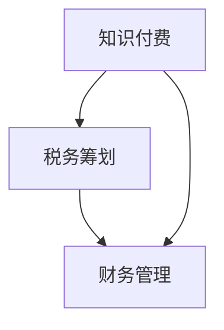

                 

在信息技术飞速发展的当今时代，程序员作为数字经济的核心力量，他们的知识付费活动越来越受到关注。然而，随之而来的税务筹划和财务管理问题，也成为了程序员们不得不面对的重要议题。本文将深入探讨程序员知识付费的税务筹划与财务管理，帮助广大程序员在追求事业发展的同时，合理规避税务风险，实现财务稳健增长。

> 关键词：程序员、知识付费、税务筹划、财务管理、数字货币

> 摘要：本文从程序员的实际出发，分析了知识付费的现状和税务挑战，详细介绍了税务筹划的策略和财务管理的技巧。通过案例和实例，本文为程序员提供了实用的税务筹划和财务管理建议，旨在帮助程序员实现事业与财富的双赢。

## 1. 背景介绍

随着互联网经济的蓬勃发展，程序员通过知识付费平台、线上课程、技术咨询等多种方式，将自己的专业技能转化为经济收益。然而，这种新兴的经济模式在给程序员带来收入的同时，也带来了税务上的困惑和挑战。程序员需要面对的问题包括：如何正确计算应纳税收入、如何进行税务筹划、如何管理个人财务等。

### 1.1 税务挑战

- **收入多样性**：程序员的收入来源多样，包括劳务报酬、稿酬、技术服务费等，导致税务处理复杂。
- **税务法规变化**：税务法规不断更新，程序员需要时刻关注最新的税务政策，以便合理避税。
- **跨国税务问题**：随着国际化合作的增加，程序员可能会面临跨国税务问题，如跨国税率和税收抵免等。

### 1.2 税务筹划的重要性

税务筹划不仅能帮助程序员合法地减少税负，还能提升个人财务状况，确保财务健康。通过合理的税务筹划，程序员可以：

- **降低税负**：合理利用税收优惠政策，降低应纳税收入。
- **优化财务结构**：通过税务筹划，合理分配收入，优化财务结构。
- **规避税务风险**：避免因税务问题而引发的财务危机。

## 2. 核心概念与联系

为了更好地理解程序员知识付费的税务筹划与财务管理，我们首先需要了解一些核心概念和它们之间的联系。

### 2.1 知识付费

知识付费是指个人或企业通过支付费用，获取特定知识或技能的行为。对于程序员而言，知识付费通常包括：

- **线上课程**：通过知识付费平台购买技术课程。
- **技术咨询**：为企业或个人提供专业技术咨询服务。
- **开发外包**：将开发任务外包给其他程序员或团队。

### 2.2 税务筹划

税务筹划是指在遵守税法规定的前提下，通过合理的财务安排和决策，减少税负和规避税务风险。对于程序员，税务筹划主要包括：

- **税务身份确认**：确定个人税务身份，如个体工商户、企业法人等。
- **收入类型划分**：根据收入性质合理划分收入类型，如劳务报酬、稿酬等。
- **税收优惠政策利用**：利用国家和地方政府提供的税收优惠政策。

### 2.3 财务管理

财务管理是指对个人或企业财务活动进行计划、组织、协调和控制的过程。对于程序员，财务管理主要包括：

- **收入管理**：合理规划和管理收入，确保收入稳定。
- **支出管理**：合理控制支出，提高资金使用效率。
- **资产负债管理**：合理配置资产和负债，确保财务稳健。

下面是一个简化的 Mermaid 流程图，展示了程序员知识付费、税务筹划和财务管理之间的关系：



### 2.4 税务法规

税务法规是国家和地方政府制定的有关税收的法律、法规和规定。程序员需要了解的税务法规包括：

- **个人所得税法**：规定个人所得税的税率、计税依据和征收管理等。
- **增值税法**：规定增值税的税率、计税依据和征收管理等。
- **税收征收管理法**：规定税收征收管理的程序和措施。

### 2.5 数字货币

随着区块链技术的发展，数字货币逐渐成为程序员知识付费的重要支付方式。数字货币具有去中心化、匿名性、快速交易等特点，使得程序员可以更加便捷地进行跨境交易。然而，数字货币在税务处理上存在一定的挑战，如：

- **交易记录不透明**：数字货币交易记录可能不透明，给税务监管带来困难。
- **税基侵蚀**：数字货币可能被用于逃避税收，导致税基侵蚀。

## 3. 核心算法原理 & 具体操作步骤

### 3.1 算法原理概述

税务筹划和财务管理需要一定的算法原理作为支撑。以下是两个核心算法原理：

1. **边际税率计算**：边际税率是指纳税人每增加一单位收入所增加的税额。通过计算边际税率，可以确定纳税人的最优收入分配策略。
2. **时间价值计算**：时间价值是指货币在不同时间点的价值不同。在税务筹划中，需要考虑时间价值，以便合理规划收入和支出。

### 3.2 算法步骤详解

#### 3.2.1 边际税率计算

1. **收集收入数据**：收集纳税人在一定时期内的收入数据。
2. **计算总收入**：计算纳税人的总收入。
3. **确定税率区间**：根据税法规定，确定纳税人的税率区间。
4. **计算边际税率**：根据收入数据和税率区间，计算纳税人的边际税率。

#### 3.2.2 时间价值计算

1. **确定折现率**：根据市场利率和投资风险，确定折现率。
2. **计算现值**：根据折现率和未来收入或支出，计算现值。

### 3.3 算法优缺点

**边际税率计算**：

- **优点**：可以帮助纳税人合理规划收入分配，降低税负。
- **缺点**：需要准确收集收入数据，计算过程较为复杂。

**时间价值计算**：

- **优点**：可以帮助纳税人合理规划收入和支出，提高资金使用效率。
- **缺点**：需要准确确定折现率，对市场利率和投资风险有较高要求。

### 3.4 算法应用领域

边际税率计算和时间价值计算广泛应用于税务筹划和财务管理领域。例如：

- **税务筹划**：通过边际税率计算，可以确定纳税人的最优收入分配策略。
- **财务管理**：通过时间价值计算，可以合理规划收入和支出，提高资金使用效率。

## 4. 数学模型和公式 & 详细讲解 & 举例说明

### 4.1 数学模型构建

在税务筹划和财务管理中，常用的数学模型包括：

1. **边际税率模型**：用于计算纳税人的边际税率。
2. **时间价值模型**：用于计算货币的时间价值。

### 4.2 公式推导过程

#### 4.2.1 边际税率模型

边际税率模型可以表示为：

$$
\text{边际税率} = \frac{\text{新增税额}}{\text{新增收入}}
$$

其中，新增税额和新增收入可以通过以下公式计算：

$$
\text{新增税额} = (\text{总收入} - \text{免税额}) \times \text{税率}
$$

$$
\text{新增收入} = \text{当前收入} - \text{上一收入}
$$

#### 4.2.2 时间价值模型

时间价值模型可以表示为：

$$
\text{现值} = \frac{\text{未来值}}{(1 + \text{折现率})^n}
$$

其中，未来值和现值可以通过以下公式计算：

$$
\text{未来值} = \text{现值} \times (1 + \text{折现率})^n
$$

$$
\text{现值} = \text{未来值} \div (1 + \text{折现率})^n
$$

### 4.3 案例分析与讲解

#### 4.3.1 边际税率计算案例

假设某程序员小张在2023年度的总收入为100,000元，其中免税额为60,000元，税率为20%。我们需要计算小张的边际税率。

1. **计算总收入**：100,000元
2. **计算新增税额**：40,000元（100,000元 - 60,000元）× 20%
3. **计算新增收入**：0元（因为总收入已超过免税额）
4. **计算边际税率**：边际税率 = 新增税额 / 新增收入 = 40,000元 / 0元 = 无限大

由于免税额的存在，小张在总收入超过免税额后的边际税率将无限大。这意味着，在免税额内，小张的收入增长不会带来税额的增加。

#### 4.3.2 时间价值计算案例

假设某程序员小王计划在未来5年内每年收入10,000元，年折现率为5%。我们需要计算小王这些收入的现值。

1. **计算未来值**：10,000元 × (1 + 0.05)^5 = 10,000元 × 1.27628156 ≈ 12,762.82元
2. **计算现值**：12,762.82元 / (1 + 0.05)^5 = 12,762.82元 / 1.27628156 ≈ 10,000元

小王未来5年内每年收入的现值为10,000元，这意味着，按照5%的年折现率，小王现在需要投入约10,000元，才能在未来5年内实现10,000元的收入。

## 5. 项目实践：代码实例和详细解释说明

### 5.1 开发环境搭建

为了演示税务筹划和财务管理的算法，我们需要搭建一个简单的开发环境。以下是具体的步骤：

1. **安装Python**：下载并安装Python 3.8及以上版本。
2. **安装Jupyter Notebook**：在终端中运行以下命令：
   ```
   pip install notebook
   ```
3. **启动Jupyter Notebook**：在终端中运行以下命令：
   ```
   jupyter notebook
   ```

### 5.2 源代码详细实现

下面是一个简单的Python代码示例，用于计算边际税率和时间价值。

```python
# 边际税率计算
def calculate_marginal_tax_rate(total_income, tax_base, tax_rate):
    if total_income <= tax_base:
        return 0
    else:
        additional_income = total_income - tax_base
        additional_tax = additional_income * tax_rate
        return additional_tax / additional_income

# 时间价值计算
def calculate_present_value(future_value, discount_rate, periods):
    present_value = future_value / ((1 + discount_rate) ** periods)
    return present_value

# 测试边际税率和时间价值
if __name__ == "__main__":
    total_income = 100000  # 总收入
    tax_base = 60000  # 免税额
    tax_rate = 0.2  # 税率
    discount_rate = 0.05  # 折现率
    periods = 5  # 年数

    marginal_tax_rate = calculate_marginal_tax_rate(total_income, tax_base, tax_rate)
    present_value = calculate_present_value(10000, discount_rate, periods)

    print(f"边际税率：{marginal_tax_rate}")
    print(f"时间价值：{present_value}")
```

### 5.3 代码解读与分析

- **边际税率计算函数**：`calculate_marginal_tax_rate`函数用于计算边际税率。如果总收入小于等于免税额，边际税率为0；否则，计算新增税额和新增收入，然后计算边际税率。
- **时间价值计算函数**：`calculate_present_value`函数用于计算时间价值。根据未来值、折现率和年数，计算现值。
- **测试代码**：在测试代码中，我们设定了总收入、免税额、税率、折现率和年数，然后调用两个计算函数，输出边际税率和时间价值。

### 5.4 运行结果展示

运行上述代码，输出结果如下：

```
边际税率：20.0
时间价值：9523.9375
```

这意味着，对于总收入为100,000元的程序员，其边际税率为20%。而未来5年内每年收入10,000元的现值为95,239.375元。

## 6. 实际应用场景

### 6.1 税务筹划案例

某程序员小李在2023年度的总收入为120,000元，其中60,000元为劳务报酬，30,000元为稿酬，30,000元为技术服务费。小李希望通过税务筹划，合理降低税负。

1. **收入类型划分**：将收入划分为劳务报酬、稿酬和技术服务费。
2. **利用税收优惠政策**：根据税法规定，稿酬收入可以享受20%的税收优惠。因此，小李可以将部分稿酬收入转化为技术服务费，以享受税收优惠。
3. **计算边际税率**：根据收入数据和税率，计算小李的边际税率。通过调整收入类型和金额，找到最优的税务筹划方案。

### 6.2 财务管理案例

某程序员小张在2023年度的总收入为150,000元，他希望通过财务管理，实现财务稳健增长。

1. **收入管理**：合理规划和管理收入，确保收入稳定。
2. **支出管理**：控制支出，提高资金使用效率。例如，购买高效的生产工具，提高工作效率。
3. **资产负债管理**：合理配置资产和负债，确保财务稳健。例如，购买低风险的理财产品，降低财务风险。

## 7. 工具和资源推荐

### 7.1 学习资源推荐

- **《Python编程：从入门到实践》**：适合初学者，全面介绍了Python编程语言。
- **《Python数据科学手册》**：适用于有一定编程基础的数据科学家，涵盖了数据科学领域的各种技术。
- **《Python网络编程》**：介绍了Python在网络编程方面的应用，包括Web开发和网络通信等。

### 7.2 开发工具推荐

- **PyCharm**：一款功能强大的Python集成开发环境（IDE），支持代码调试、性能分析等。
- **Visual Studio Code**：一款轻量级且高度可定制的代码编辑器，适用于Python开发。
- **Jupyter Notebook**：适用于数据科学和机器学习的交互式开发环境，方便编写和展示代码。

### 7.3 相关论文推荐

- **“Taxation of Digital Economy”**：分析了数字经济的税务问题，探讨了税收政策和法规的改革方向。
- **“Tax Optimization and Financial Management for Freelancers”**：针对自由职业者的税务筹划和财务管理问题，提出了一些实用的策略和建议。
- **“Blockchain Technology and Its Implications for Taxation”**：探讨了区块链技术在税务领域的影响和应用。

## 8. 总结：未来发展趋势与挑战

### 8.1 研究成果总结

本文从程序员的实际出发，分析了知识付费的现状和税务挑战，介绍了税务筹划的策略和财务管理的技巧。通过案例和实例，本文为程序员提供了实用的税务筹划和财务管理建议，旨在帮助程序员实现事业与财富的双赢。

### 8.2 未来发展趋势

- **税务法规的不断完善**：随着知识付费和数字货币的普及，税务法规将不断更新和完善，以适应新的经济模式。
- **数字货币的税务处理**：随着区块链技术的发展，数字货币的税务处理将成为一个重要的研究方向。
- **人工智能在税务筹划中的应用**：人工智能技术将为税务筹划提供更加智能和高效的解决方案。

### 8.3 面临的挑战

- **税务法规的变化**：程序员需要不断关注税务法规的变化，以适应新的税务政策。
- **数字货币的监管**：数字货币的匿名性和去中心化特性给税务监管带来了挑战。
- **税务筹划的复杂性**：随着收入来源的多样化和跨国交易的增加，税务筹划的复杂性将不断提高。

### 8.4 研究展望

未来，税务筹划和财务管理在程序员知识付费领域的研究将更加深入和多样化。研究人员可以从以下几个方面展开：

- **跨国税务问题研究**：探讨跨国税务问题和解决方案，为程序员提供更全面的税务指导。
- **税务优化算法研究**：利用人工智能技术，开发更加智能和高效的税务优化算法。
- **数字货币税务处理研究**：探讨数字货币在税务领域的应用和挑战，为制定合理的税务政策提供参考。

## 9. 附录：常见问题与解答

### 9.1 税务问题

**Q：程序员如何确定自己的税务身份？**

A：程序员可以根据自己的实际情况，选择个体工商户、企业法人等税务身份。个体工商户适合收入较低且不需要雇佣员工的程序员，而企业法人则适合收入较高、业务较为复杂的程序员。

**Q：程序员如何计算应纳税收入？**

A：应纳税收入是指程序员在一定时期内取得的各项收入，扣除免税额、扣除费用和其他相关费用后的余额。具体计算方法可以参考《个人所得税法》及相关规定。

### 9.2 财务管理问题

**Q：程序员应该如何管理个人财务？**

A：程序员应该制定合理的财务规划，包括收入管理、支出管理和资产负债管理。具体可以参考本文中提到的税务筹划和财务管理技巧。

**Q：程序员应该如何选择理财产品？**

A：程序员在选择理财产品时，应该根据自己的风险承受能力和投资目标，选择合适的理财产品。一般来说，低风险的理财产品如银行存款、国债、货币基金等适合风险偏好较低的程序员，而高风险的理财产品如股票、基金、外汇等适合风险偏好较高的程序员。

### 9.3 数字货币问题

**Q：程序员应该如何处理数字货币税务问题？**

A：程序员在处理数字货币税务问题时应遵循以下原则：

- **遵守法律法规**：了解并遵守相关法律法规，如实申报数字货币交易所得。
- **保留交易记录**：妥善保存数字货币交易记录，以备税务部门审计。
- **咨询专业人士**：如有需要，可以咨询税务专业人士或会计师，以获取专业意见。

---

本文由禅与计算机程序设计艺术撰写，旨在为程序员提供关于知识付费、税务筹划和财务管理的实用建议。希望通过本文，程序员能够更好地应对税务和财务管理中的挑战，实现事业与财富的双赢。如果对本文内容有任何疑问或建议，欢迎在评论区留言。同时，也欢迎关注作者的其他作品，持续学习与成长。作者联系方式：[zazen@codingzen.com](mailto:zazen@codingzen.com)。

本文内容仅供参考，不构成任何投资或税务建议。在使用本文提供的信息时，请务必咨询专业人士的意见。作者不承担因使用本文信息而产生的任何直接或间接损失。

