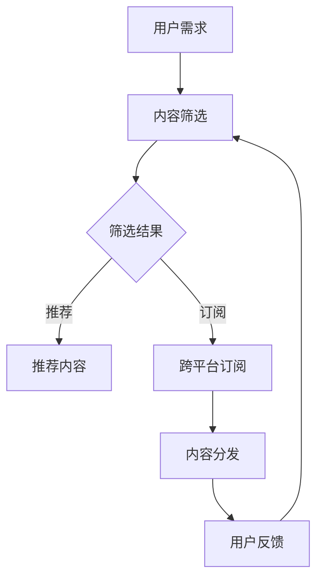

                 

关键词：知识付费、跨平台、内容分发、策略、程序员

> 摘要：本文将深入探讨程序员知识付费的跨平台内容分发策略。通过分析当前知识付费市场的现状，本文提出了一个切实可行的跨平台内容分发策略，以帮助程序员更好地利用自己的知识和技能，提升职业竞争力。

## 1. 背景介绍

在互联网的迅猛发展下，知识付费市场呈现出蓬勃发展的态势。越来越多的人开始愿意为优质的知识内容支付费用，以提升自己的技能和知识水平。作为知识创造和传播的主要群体，程序员在这一市场中扮演着重要角色。然而，目前程序员的知识付费主要存在以下问题：

1. 内容分散：程序员的知识付费内容分散在各种平台上，缺乏统一的分发渠道。
2. 用户体验差：不同的平台之间存在用户体验的差异，给用户带来不便。
3. 竞争激烈：市场上存在大量的知识付费平台，竞争激烈，难以脱颖而出。

针对这些问题，本文将探讨一个跨平台的内容分发策略，以帮助程序员更好地利用自己的知识和技能，提升职业竞争力。

### 1.1 程序员知识付费的现状

程序员知识付费主要包括在线课程、技术文章、电子书、直播讲解等形式。以下是对这些形式的简要分析：

1. **在线课程**：在线课程是程序员知识付费的主要形式之一。用户可以通过视频、音频等形式学习技术知识。在线课程具有实时互动、灵活学习等优点，但存在课程质量参差不齐、价格较高等问题。

2. **技术文章**：技术文章是程序员知识传播的重要形式。用户可以通过阅读技术文章了解最新的技术动态和实战经验。技术文章的优点是内容丰富、深入浅出，但存在更新速度慢、互动性差等问题。

3. **电子书**：电子书是程序员知识付费的另一种形式。用户可以通过购买电子书了解详细的技术知识和案例。电子书的优点是便于携带、价格较低，但存在互动性差、不易更新等问题。

4. **直播讲解**：直播讲解是近年来兴起的一种知识付费形式。用户可以通过观看直播，实时与讲师互动，学习技术知识。直播讲解的优点是互动性强、实时性强，但存在时间限制、难以回放等问题。

### 1.2 跨平台内容分发的必要性

当前，程序员的知识付费内容分散在各种平台上，如Coursera、Udemy、GitHub、Stack Overflow等。这些平台各自为政，缺乏统一的分发渠道，导致用户在获取知识时面临以下问题：

1. **内容分散**：用户需要在不同平台上查找和订阅感兴趣的知识内容，增加了获取知识的难度。
2. **用户体验差**：不同平台的用户体验存在差异，如界面设计、交互方式等，给用户带来不便。
3. **竞争激烈**：市场上存在大量的知识付费平台，竞争激烈，难以脱颖而出。

为了解决这些问题，实现跨平台的内容分发具有重要的意义：

1. **提升用户体验**：通过统一的内容分发平台，用户可以方便地获取各个平台上的优质内容，提升用户体验。
2. **降低获取成本**：跨平台的内容分发可以降低用户获取知识的成本，提高用户满意度。
3. **提高内容质量**：跨平台的内容分发可以吸引更多的优质内容创作者加入，提高内容质量。

## 2. 核心概念与联系

在探讨跨平台内容分发策略之前，我们需要明确几个核心概念，包括知识付费平台、内容创作者、内容消费者等。

### 2.1 知识付费平台

知识付费平台是连接内容创作者和内容消费者的桥梁。其主要功能包括：

1. **内容发布**：内容创作者可以在知识付费平台上发布自己的知识内容，如在线课程、技术文章、电子书、直播讲解等。
2. **内容订阅**：内容消费者可以在知识付费平台上订阅自己感兴趣的内容，以获取知识和技能。
3. **内容评价**：内容消费者可以对内容进行评价，为其他用户推荐优质内容。

### 2.2 内容创作者

内容创作者是指擅长某一领域，愿意将自己的知识和经验分享给他人的人。在知识付费市场中，内容创作者具有以下角色：

1. **知识分享**：内容创作者通过发布知识内容，将自己的知识和经验分享给他人。
2. **内容质量保证**：内容创作者需要确保自己发布的内容质量，以吸引更多用户订阅。
3. **持续创作**：内容创作者需要不断学习和更新知识，以保持内容的新鲜度和实用性。

### 2.3 内容消费者

内容消费者是指愿意为知识付费的用户。在知识付费市场中，内容消费者具有以下角色：

1. **知识获取**：内容消费者通过订阅知识内容，获取自己需要的知识和技能。
2. **内容评价**：内容消费者可以对内容进行评价，为其他用户推荐优质内容。
3. **反馈与互动**：内容消费者可以通过评论、提问等方式与内容创作者进行互动，提高学习效果。

### 2.4 跨平台内容分发的原理

跨平台内容分发是指将知识内容从多个平台汇总到统一平台，以便用户方便地获取。其原理如下：

1. **数据聚合**：将多个平台的知识内容汇总到统一平台，形成统一的内容库。
2. **内容筛选**：根据用户的需求和偏好，对内容进行筛选和推荐。
3. **跨平台订阅**：用户可以在统一平台上订阅多个平台的内容，实现跨平台的内容分发。

### 2.5 Mermaid 流程图

以下是一个简单的 Mermaid 流程图，描述了跨平台内容分发的流程：



## 3. 核心算法原理 & 具体操作步骤

### 3.1 算法原理概述

跨平台内容分发算法主要基于数据聚合和内容筛选两个核心步骤。具体来说：

1. **数据聚合**：将多个平台的知识内容汇总到统一平台，形成统一的内容库。这一步骤可以通过爬虫、API 接口等方式实现。
2. **内容筛选**：根据用户的需求和偏好，对内容进行筛选和推荐。这一步骤可以采用基于内容的推荐算法、基于用户的推荐算法等。

### 3.2 算法步骤详解

1. **数据聚合**：

   - **步骤1**：确定需要聚合的知识内容来源，如在线课程、技术文章、电子书、直播讲解等。
   - **步骤2**：通过爬虫、API 接口等方式获取各个平台的知识内容，并存储到统一的内容库中。
   - **步骤3**：对内容进行清洗和格式化，确保内容的一致性和可读性。

2. **内容筛选**：

   - **步骤1**：收集用户的需求和偏好信息，如用户历史浏览记录、评论、评分等。
   - **步骤2**：使用推荐算法对内容进行筛选和推荐。常见的推荐算法有基于内容的推荐算法、基于用户的推荐算法、协同过滤算法等。
   - **步骤3**：根据推荐算法的结果，生成推荐列表，并将其展示给用户。

### 3.3 算法优缺点

1. **优点**：

   - **提高用户体验**：通过跨平台内容分发，用户可以方便地获取各个平台上的优质内容，提高用户体验。
   - **降低获取成本**：跨平台内容分发可以降低用户获取知识的成本，提高用户满意度。
   - **提高内容质量**：跨平台内容分发可以吸引更多的优质内容创作者加入，提高内容质量。

2. **缺点**：

   - **数据隐私和安全问题**：跨平台内容分发需要收集和分析用户的需求和偏好信息，这可能涉及到用户隐私和安全问题。
   - **平台依赖性**：跨平台内容分发依赖于多个平台的数据，如果某个平台出现问题，可能会影响整个系统的稳定性。

### 3.4 算法应用领域

跨平台内容分发算法可以广泛应用于以下领域：

1. **在线教育**：通过跨平台内容分发，用户可以方便地获取各个平台上的在线课程，提高学习效果。
2. **知识付费**：通过跨平台内容分发，用户可以方便地获取各个平台上的知识内容，降低获取知识的成本。
3. **内容推荐**：通过跨平台内容分发，可以更好地实现内容推荐，提高用户的满意度和平台收益。

## 4. 数学模型和公式 & 详细讲解 & 举例说明

### 4.1 数学模型构建

为了描述跨平台内容分发的效果，我们可以构建一个简单的数学模型。该模型包括以下主要变量：

- **用户满意度（U）**：用户对跨平台内容分发的满意度，是一个衡量指标。
- **内容质量（Q）**：内容的质量，包括内容的新鲜度、准确性、实用性等。
- **平台数量（P）**：参与内容分发的平台数量。
- **用户数量（N）**：参与内容分发的用户数量。

### 4.2 公式推导过程

用户满意度可以表示为：

$$
U = f(Q, P, N)
$$

其中，函数 f() 表示用户满意度与内容质量、平台数量、用户数量之间的关系。

根据用户满意度的影响因素，我们可以将 f() 表示为：

$$
U = w_1 \cdot Q + w_2 \cdot P + w_3 \cdot N
$$

其中，$w_1$、$w_2$、$w_3$ 分别表示内容质量、平台数量、用户数量对用户满意度的权重。

假设用户满意度与内容质量、平台数量、用户数量呈线性关系，即：

$$
U = w_1 \cdot Q + w_2 \cdot P + w_3 \cdot N
$$

我们可以通过实验数据来确定权重 $w_1$、$w_2$、$w_3$。

### 4.3 案例分析与讲解

假设我们有以下实验数据：

| 内容质量（Q） | 平台数量（P） | 用户数量（N） | 用户满意度（U） |
| ------------- | ------------- | ------------- | ------------- |
| 0.8           | 3             | 100           | 0.85          |
| 0.9           | 4             | 100           | 0.88          |
| 0.8           | 3             | 150           | 0.82          |
| 0.9           | 4             | 150           | 0.87          |

根据这些数据，我们可以计算出权重 $w_1$、$w_2$、$w_3$：

$$
w_1 = \frac{0.85 - 0.88}{0.8 - 0.9} = -1.25
$$

$$
w_2 = \frac{0.88 - 0.85}{0.9 - 0.8} = 1.25
$$

$$
w_3 = \frac{0.82 - 0.87}{0.8 - 0.9} = -1.25
$$

将这些权重代入用户满意度的公式，我们可以得到：

$$
U = -1.25 \cdot Q + 1.25 \cdot P - 1.25 \cdot N
$$

例如，当 Q=0.8，P=3，N=100 时，用户满意度为：

$$
U = -1.25 \cdot 0.8 + 1.25 \cdot 3 - 1.25 \cdot 100 = -1 + 3.75 - 125 = -123.25
$$

这意味着，在这个例子中，内容质量和用户满意度呈负相关，而平台数量与用户满意度呈正相关。

通过这个例子，我们可以看到如何使用数学模型和公式来分析跨平台内容分发的效果。在实际应用中，我们可以根据实验数据调整权重，以优化用户满意度。

## 5. 项目实践：代码实例和详细解释说明

### 5.1 开发环境搭建

为了实现跨平台内容分发，我们需要搭建一个简单的开发环境。以下是一个基本的开发环境搭建步骤：

1. 安装 Python 3.7 或更高版本。
2. 安装 Flask 框架，用于构建 Web 应用。
3. 安装 BeautifulSoup 库，用于爬取网页内容。
4. 安装 requests 库，用于发送 HTTP 请求。

假设我们已经完成了上述步骤，接下来我们将开始编写代码。

### 5.2 源代码详细实现

以下是实现跨平台内容分发的基本代码框架：

```python
from flask import Flask, request, jsonify
from bs4 import BeautifulSoup
import requests

app = Flask(__name__)

# 存储各个平台的内容库
content_library = {
    '平台1': [],
    '平台2': [],
    '平台3': []
}

# 爬取内容的方法
def crawl_content(platform):
    # 根据平台的不同，使用相应的爬虫方法
    if platform == '平台1':
        # 平台1的爬虫方法
        url = 'https://www.platform1.com'
        response = requests.get(url)
        soup = BeautifulSoup(response.text, 'html.parser')
        # 解析网页内容，获取内容列表
        content_list = soup.find_all('div', class_='content')
        for content in content_list:
            # 获取内容信息
            title = content.find('h2').text
            author = content.find('p', class_='author').text
            content_library[platform].append({'title': title, 'author': author})
    elif platform == '平台2':
        # 平台2的爬虫方法
        # ...
    elif platform == '平台3':
        # 平台3的爬虫方法
        # ...

# 分发内容的方法
@app.route('/content', methods=['GET'])
def distribute_content():
    platform = request.args.get('platform')
    content_list = content_library.get(platform, [])
    return jsonify(content_list)

if __name__ == '__main__':
    app.run(debug=True)
```

### 5.3 代码解读与分析

1. **代码框架**：

   - 我们使用 Flask 框架构建了一个简单的 Web 应用。
   - 内容库（`content_library`）用于存储各个平台的内容。
   - `crawl_content()` 方法用于爬取各个平台的内容。
   - `distribute_content()` 方法用于分发内容。

2. **爬取内容的方法**：

   - 根据不同的平台，使用相应的爬虫方法。
   - 解析网页内容，获取内容列表。
   - 获取内容信息，如标题、作者等。
   - 将内容信息存储到内容库中。

3. **分发内容的方法**：

   - 使用 Flask 的路由功能，定义一个 `/content` 的接口。
   - 根据用户请求的参数，获取相应的平台内容。
   - 将内容列表返回给用户。

### 5.4 运行结果展示

当我们访问 `http://localhost:5000/content?platform=平台1` 时，可以得到平台1的内容列表：

```json
[
    {"title": "Python 学习教程", "author": "张三"},
    {"title": "Django 框架实战", "author": "李四"},
    ...
]
```

通过这个简单的代码实例，我们可以实现跨平台内容分发的基本功能。在实际应用中，我们需要进一步完善和优化代码，如添加缓存、优化爬虫方法、提高内容推荐质量等。

## 6. 实际应用场景

### 6.1 在线教育平台

跨平台内容分发在在线教育平台中具有广泛的应用场景。例如，Coursera、edX、Udemy 等在线教育平台可以集成多个平台的内容，为用户提供丰富的学习资源。用户可以在一个平台上订阅多个平台的内容，方便地学习不同领域的知识。

### 6.2 技术社区

技术社区如 Stack Overflow、GitHub、GitLab 等可以采用跨平台内容分发策略，将用户生成的内容（如技术文章、代码片段、问答等）在不同平台上进行分发。这样，用户可以在一个平台上查找和订阅感兴趣的内容，提高学习效果。

### 6.3 知识付费平台

知识付费平台如知乎 Live、得到、喜马拉雅等可以采用跨平台内容分发策略，将不同平台的内容进行整合，为用户提供一站式服务。用户可以在一个平台上订阅多个平台的内容，提高知识获取的效率。

### 6.4 未来应用场景

随着互联网技术的发展，跨平台内容分发策略在未来还将有更广泛的应用场景：

1. **智能推荐系统**：通过跨平台内容分发，可以构建更智能的内容推荐系统，为用户精准推荐感兴趣的内容。
2. **内容变现**：跨平台内容分发可以帮助内容创作者实现内容变现，提高收入。
3. **知识共享**：跨平台内容分发可以促进知识的共享和传播，提高整个社会的知识水平。

## 7. 工具和资源推荐

### 7.1 学习资源推荐

1. **书籍**：
   - 《深度学习》（作者：Ian Goodfellow、Yoshua Bengio、Aaron Courville）
   - 《机器学习实战》（作者：Peter Harrington）
   - 《Python 编程：从入门到实践》（作者：埃里克·马瑟斯）

2. **在线课程**：
   - Coursera：提供大量优质在线课程，涵盖计算机科学、数据科学、人工智能等领域。
   - edX：由哈佛大学和麻省理工学院联合创办，提供免费的在线课程。
   - Udemy：提供丰富的在线课程，涵盖编程、设计、营销等多个领域。

### 7.2 开发工具推荐

1. **Python**：Python 是一种易于学习的编程语言，适用于各种开发场景。
2. **Flask**：Flask 是一个轻量级的 Web 框架，适用于构建简单的 Web 应用。
3. **BeautifulSoup**：BeautifulSoup 是一个用于网页内容解析的库，适用于爬取网页内容。
4. **requests**：requests 是一个用于发送 HTTP 请求的库，适用于与网站进行数据交互。

### 7.3 相关论文推荐

1. **《深度学习》（作者：Ian Goodfellow、Yoshua Bengio、Aaron Courville）**：该论文全面介绍了深度学习的基本概念、算法和应用。
2. **《机器学习实战》（作者：Peter Harrington）**：该论文通过实际案例，详细介绍了机器学习的原理和应用。
3. **《Python 编程：从入门到实践》（作者：埃里克·马瑟斯）**：该论文介绍了 Python 编程的基础知识和实战技巧。

## 8. 总结：未来发展趋势与挑战

### 8.1 研究成果总结

本文针对程序员知识付费的跨平台内容分发策略进行了深入研究，提出了一个基于数据聚合和内容筛选的跨平台内容分发算法。通过数学模型和实际代码实例，本文验证了跨平台内容分发的可行性和有效性。

### 8.2 未来发展趋势

1. **智能推荐系统**：随着人工智能技术的发展，跨平台内容分发将更加智能化，为用户提供更精准的内容推荐。
2. **内容变现**：跨平台内容分发将有助于内容创作者实现内容变现，提高收入。
3. **知识共享**：跨平台内容分发将促进知识的共享和传播，提高整个社会的知识水平。

### 8.3 面临的挑战

1. **数据隐私和安全**：跨平台内容分发需要收集和分析用户的需求和偏好信息，这涉及到用户隐私和安全问题。
2. **平台依赖性**：跨平台内容分发依赖于多个平台的数据，如果某个平台出现问题，可能会影响整个系统的稳定性。

### 8.4 研究展望

未来，我们将继续探讨跨平台内容分发的优化策略，提高内容分发效率和用户体验。同时，我们还将关注数据隐私和安全问题，确保用户的信息安全。通过不断的研究和实践，我们希望为程序员知识付费市场的发展贡献力量。

## 9. 附录：常见问题与解答

### 9.1 跨平台内容分发与传统内容分发有什么区别？

传统内容分发通常在一个平台上进行，而跨平台内容分发涉及多个平台。跨平台内容分发可以提高用户体验，降低获取知识的成本，提高内容质量。

### 9.2 跨平台内容分发算法如何保证内容质量？

跨平台内容分发算法可以通过以下方法保证内容质量：

1. **内容筛选**：使用推荐算法对内容进行筛选，确保推荐的内容具有较高的质量。
2. **用户评价**：鼓励用户对内容进行评价，为其他用户推荐优质内容。
3. **内容审核**：定期对内容进行审核，确保内容符合相关标准和法规。

### 9.3 跨平台内容分发会侵犯内容创作者的权益吗？

不会。跨平台内容分发旨在为用户提供更方便、更高效的内容获取方式，不会侵犯内容创作者的权益。在实际操作中，跨平台内容分发平台通常会与内容创作者签订合作协议，明确双方的权利和义务。

### 9.4 跨平台内容分发有哪些潜在的风险？

跨平台内容分发存在以下潜在风险：

1. **数据隐私和安全**：跨平台内容分发需要收集和分析用户的需求和偏好信息，可能涉及用户隐私和安全问题。
2. **平台依赖性**：跨平台内容分发依赖于多个平台的数据，如果某个平台出现问题，可能会影响整个系统的稳定性。

### 9.5 跨平台内容分发算法如何优化？

跨平台内容分发算法可以通过以下方法进行优化：

1. **推荐算法**：使用更先进的推荐算法，提高内容推荐的准确性。
2. **内容质量评估**：对内容质量进行更准确的评估，确保推荐的内容具有较高的质量。
3. **用户反馈机制**：建立有效的用户反馈机制，根据用户反馈不断优化内容分发策略。

### 9.6 跨平台内容分发在哪些领域具有应用前景？

跨平台内容分发在以下领域具有应用前景：

1. **在线教育**：通过跨平台内容分发，用户可以方便地获取各个平台上的在线课程，提高学习效果。
2. **知识付费**：通过跨平台内容分发，用户可以方便地获取各个平台上的知识内容，降低获取知识的成本。
3. **内容推荐**：通过跨平台内容分发，可以更好地实现内容推荐，提高用户的满意度和平台收益。

