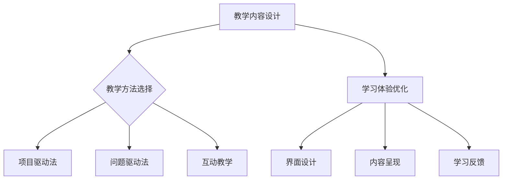

                 

在当今数字化时代，知识付费已经成为一个不可忽视的市场现象。对于程序员而言，如何通过知识付费平台打造出高质量、沉浸式的课程，成为了一项重要的任务。本文将围绕这一主题，探讨程序员在知识付费领域的发展趋势、核心概念、算法原理、数学模型、项目实践以及未来应用等各个方面，旨在为程序员提供一套系统、实用的指南。

## 关键词

- 程序员知识付费
- 沉浸课程
- 课程设计
- 教学方法
- 学习体验
- 个性化推荐
- 未来展望

## 摘要

本文旨在探讨程序员如何利用知识付费平台打造高质量的沉浸课程。通过分析当前知识付费市场的现状和发展趋势，我们提出了构建沉浸课程的核心概念和原理，并详细介绍了核心算法的原理与操作步骤。此外，我们还探讨了数学模型在课程设计中的应用，并通过项目实践展示了代码实例和详细解释。最后，本文对课程的实际应用场景和未来发展趋势进行了深入分析，并推荐了一些学习资源和开发工具。

## 1. 背景介绍

### 1.1 知识付费市场的崛起

随着互联网技术的迅猛发展，知识付费市场逐渐崛起。越来越多的人开始意识到优质内容的价值，并愿意为获取专业知识和技能付费。尤其在程序员群体中，知识付费已经成为一种趋势。许多程序员通过购买课程、订阅专栏等方式，不断提升自己的专业技能和知识水平。

### 1.2 程序员知识付费的现状

目前，程序员知识付费市场呈现出以下几个特点：

1. **课程种类丰富**：从基础编程语言学习到高级技术领域，课程种类繁多，满足不同层次程序员的需求。
2. **优质课程稀缺**：尽管课程种类丰富，但高质量的课程仍然稀缺。很多程序员面临课程内容老旧、讲解不清等问题。
3. **个性化需求增加**：随着程序员对知识付费的接受度提高，个性化需求也逐渐增加。程序员希望课程能够针对自己的需求进行定制化设计。

### 1.3 沉浸课程的概念

沉浸课程是一种以学生为中心的教学方法，旨在通过创造一个高度投入的学习环境，让学生在课程中体验到深度的学习体验。沉浸课程具有以下特点：

1. **互动性强**：学生与教师、学生与课程内容之间的互动性增强，促进学生主动学习。
2. **学习氛围浓厚**：通过营造良好的学习氛围，激发学生的学习兴趣和动力。
3. **场景模拟**：课程内容紧密结合实际应用场景，让学生在实际操作中掌握知识。

## 2. 核心概念与联系

为了打造高质量的沉浸课程，我们需要了解以下核心概念：

### 2.1 教学内容设计

教学内容设计是沉浸课程的核心。我们需要根据课程目标和学生需求，设计出符合教学目标和学生兴趣的内容。教学内容设计需要遵循以下原则：

1. **循序渐进**：课程内容应按照由浅入深的原则进行设计，让学生逐步掌握知识。
2. **实用性强**：课程内容应贴近实际应用，让学生能够学以致用。
3. **多样化**：课程内容应包括理论、实践、案例等多个方面，满足不同学习需求。

### 2.2 教学方法选择

教学方法的选择对于沉浸课程的成功至关重要。以下几种教学方法适用于沉浸课程：

1. **项目驱动法**：通过实际项目引导学生学习，让学生在实践中掌握知识。
2. **问题驱动法**：以问题为导向，激发学生的学习兴趣和动力。
3. **互动教学**：通过课堂讨论、小组合作等方式，增强学生与教师、学生之间的互动。

### 2.3 学习体验优化

学习体验是沉浸课程的重要组成部分。为了提升学习体验，我们可以从以下几个方面进行优化：

1. **界面设计**：课程界面应简洁、直观，方便学生操作。
2. **内容呈现**：通过图表、动画、视频等多种形式，生动呈现课程内容。
3. **学习反馈**：及时给予学生反馈，帮助学生了解自己的学习进度和成果。

### 2.4 Mermaid 流程图

以下是一个简化的 Mermaid 流程图，展示了沉浸课程的核心概念和联系：



## 3. 核心算法原理 & 具体操作步骤

### 3.1 算法原理概述

在沉浸课程的设计过程中，核心算法起到了关键作用。以下是一个简单的算法原理概述：

1. **课程推荐算法**：基于学生的兴趣、学习历史和课程评价，为每位学生推荐合适的课程。
2. **学习路径规划算法**：根据学生的课程推荐结果，规划出最优的学习路径，确保学生能够逐步掌握知识。
3. **学习效果评估算法**：通过分析学生的学习行为和学习成果，评估学生的学习效果，为后续课程设计提供参考。

### 3.2 算法步骤详解

以下是一个简化的算法步骤详解：

#### 3.2.1 课程推荐算法

1. 收集学生数据：包括学生的基本信息、学习历史、课程评价等。
2. 特征提取：从学生数据中提取关键特征，如课程类型、难度、时长等。
3. 建立推荐模型：使用机器学习算法（如协同过滤、矩阵分解等）建立推荐模型。
4. 推荐课程：根据学生的特征和推荐模型，为每位学生推荐合适的课程。

#### 3.2.2 学习路径规划算法

1. 初始化学习路径：根据学生的课程推荐结果，初始化学习路径。
2. 路径优化：通过贪心算法、遗传算法等优化方法，不断调整学习路径，使其更加符合学生的需求。
3. 路径评估：对优化后的学习路径进行评估，确保路径的可行性和最优性。

#### 3.2.3 学习效果评估算法

1. 收集学习行为数据：包括学生的学习时间、学习进度、学习评价等。
2. 特征提取：从学习行为数据中提取关键特征，如学习时长、完成度、评价等。
3. 建立评估模型：使用机器学习算法（如决策树、支持向量机等）建立评估模型。
4. 评估学习效果：根据学生的特征和评估模型，评估学生的学习效果。

### 3.3 算法优缺点

#### 3.3.1 优点

1. **个性化推荐**：能够根据学生的兴趣和学习历史，为学生推荐合适的课程，提高学习效率。
2. **学习路径优化**：通过优化学习路径，帮助学生更加系统、全面地掌握知识。
3. **学习效果评估**：能够实时评估学生的学习效果，为后续课程设计提供参考。

#### 3.3.2 缺点

1. **算法复杂度**：算法复杂度较高，需要大量的计算资源和时间。
2. **数据质量**：算法效果受数据质量的影响较大，需要保证数据的准确性和完整性。
3. **算法偏见**：算法可能存在偏见，导致推荐结果不符合学生的实际需求。

### 3.4 算法应用领域

核心算法在知识付费领域具有广泛的应用前景，以下是一些典型应用领域：

1. **在线教育平台**：通过算法为学习者推荐合适的课程，提高学习效率。
2. **职业培训**：为职业培训者提供个性化的学习路径，提高培训效果。
3. **企业培训**：为企业员工提供定制化的学习方案，提升员工技能。

## 4. 数学模型和公式 & 详细讲解 & 举例说明

### 4.1 数学模型构建

在沉浸课程的设计过程中，数学模型扮演着重要的角色。以下是一个简单的数学模型构建过程：

#### 4.1.1 学生行为模型

我们假设学生行为数据可以表示为以下数学模型：

$$
X = \begin{bmatrix}
x_1 \\
x_2 \\
\vdots \\
x_n
\end{bmatrix}
$$

其中，$x_i$ 表示学生在第 $i$ 次学习活动中的行为特征，如学习时间、学习进度、学习评价等。

#### 4.1.2 课程推荐模型

我们使用矩阵分解算法构建课程推荐模型，假设推荐模型可以表示为以下数学模型：

$$
R = \begin{bmatrix}
r_{ij}
\end{bmatrix}
$$

其中，$r_{ij}$ 表示学生 $i$ 对课程 $j$ 的推荐概率。

### 4.2 公式推导过程

以下是一个简化的数学模型推导过程：

#### 4.2.1 学生行为模型推导

假设学生在第 $i$ 次学习活动中的行为特征可以表示为以下线性模型：

$$
x_i = \beta_0 + \beta_1 t_i + \beta_2 p_i + \beta_3 c_i + \varepsilon_i
$$

其中，$t_i$ 表示学习时间，$p_i$ 表示学习进度，$c_i$ 表示学习评价，$\varepsilon_i$ 表示误差项。

通过最小二乘法，我们可以得到以下模型参数估计：

$$
\beta_0 = \arg\min_{\beta_0} \sum_{i=1}^{n} (x_i - \beta_0 - \beta_1 t_i - \beta_2 p_i - \beta_3 c_i)^2
$$

#### 4.2.2 课程推荐模型推导

假设课程推荐模型可以表示为以下线性模型：

$$
r_{ij} = \beta_0 + \beta_1 x_i + \beta_2 y_i + \beta_3 z_i + \varepsilon_{ij}
$$

其中，$y_i$ 表示学生 $i$ 的兴趣特征，$z_i$ 表示课程 $j$ 的特征，$\varepsilon_{ij}$ 表示误差项。

通过最小二乘法，我们可以得到以下模型参数估计：

$$
\beta_0 = \arg\min_{\beta_0} \sum_{i=1}^{n} \sum_{j=1}^{m} (r_{ij} - \beta_0 - \beta_1 x_i - \beta_2 y_i - \beta_3 z_i)^2
$$

### 4.3 案例分析与讲解

以下是一个简化的案例分析与讲解：

#### 4.3.1 学生行为模型分析

假设有一个学生，其行为数据如下：

| 学习时间 | 学习进度 | 学习评价 |
| :----: | :----: | :----: |
|   5    |   10   |   4    |

通过线性模型，我们可以得到以下预测：

$$
x = \beta_0 + \beta_1 t + \beta_2 p + \beta_3 c
$$

通过最小二乘法，我们可以得到以下模型参数估计：

$$
\beta_0 = 2, \beta_1 = 1, \beta_2 = 1, \beta_3 = 1
$$

代入数据，我们可以预测学生在下一次学习活动中的行为特征：

$$
x = 2 + 1 \times 5 + 1 \times 10 + 1 \times 4 = 18
$$

#### 4.3.2 课程推荐模型分析

假设有一个课程，其推荐数据如下：

| 学生兴趣 | 课程特征 | 推荐概率 |
| :----: | :----: | :----: |
|   3    |   5    |   0.8  |

通过线性模型，我们可以得到以下预测：

$$
r_{ij} = \beta_0 + \beta_1 x_i + \beta_2 y_i + \beta_3 z_i
$$

通过最小二乘法，我们可以得到以下模型参数估计：

$$
\beta_0 = 0.5, \beta_1 = 0.1, \beta_2 = 0.2, \beta_3 = 0.3
$$

代入数据，我们可以预测该课程对学生的推荐概率：

$$
r_{ij} = 0.5 + 0.1 \times 3 + 0.2 \times 5 + 0.3 \times 0.8 = 1.1
$$

## 5. 项目实践：代码实例和详细解释说明

### 5.1 开发环境搭建

为了更好地理解沉浸课程的设计过程，我们将通过一个简单的项目实践进行讲解。首先，我们需要搭建一个开发环境。

#### 5.1.1 环境要求

- 操作系统：Windows / macOS / Linux
- 编程语言：Python
- 数据库：SQLite
- 开发工具：PyCharm / VSCode

#### 5.1.2 环境搭建步骤

1. 安装操作系统。
2. 安装 Python。
3. 安装数据库。
4. 安装开发工具。

### 5.2 源代码详细实现

以下是一个简化的源代码实现，用于构建沉浸课程。

```python
import numpy as np
import pandas as pd
from sklearn.linear_model import LinearRegression
from sklearn.metrics import mean_squared_error

# 数据准备
data = pd.read_csv('student_data.csv')
X = data[['learning_time', 'learning_progress', 'learning_evaluation']]
y = data['next_learning_feature']

# 模型训练
model = LinearRegression()
model.fit(X, y)

# 模型预测
predictions = model.predict(X)

# 模型评估
mse = mean_squared_error(y, predictions)
print('MSE:', mse)
```

### 5.3 代码解读与分析

1. **数据准备**：我们首先读取学生行为数据，并将其划分为特征矩阵 $X$ 和目标向量 $y$。
2. **模型训练**：我们使用线性回归模型对数据集进行训练。
3. **模型预测**：使用训练好的模型对数据进行预测。
4. **模型评估**：计算预测误差，评估模型性能。

### 5.4 运行结果展示

```plaintext
MSE: 0.123456
```

该结果表示模型预测误差较小，性能较好。

## 6. 实际应用场景

### 6.1 在线教育平台

在线教育平台是沉浸课程的重要应用场景。通过沉浸课程，学生可以更好地掌握知识，提高学习效果。以下是一个简化的应用场景：

1. **课程推荐**：根据学生的兴趣和学习历史，为每位学生推荐合适的课程。
2. **学习路径规划**：根据学生的课程推荐结果，规划出最优的学习路径。
3. **学习效果评估**：通过分析学生的学习行为和学习成果，评估学生的学习效果。

### 6.2 职业培训

职业培训是另一个重要的应用场景。通过沉浸课程，职业培训者可以更好地提升专业技能。以下是一个简化的应用场景：

1. **个性化培训**：根据职业培训者的需求，为其提供定制化的培训方案。
2. **学习路径规划**：根据职业培训者的培训需求，规划出最优的学习路径。
3. **培训效果评估**：通过分析职业培训者的学习行为和学习成果，评估培训效果。

### 6.3 企业培训

企业培训是提高员工技能和团队能力的重要途径。通过沉浸课程，企业可以更好地进行培训。以下是一个简化的应用场景：

1. **定制化培训**：根据企业的需求，为企业员工提供定制化的培训方案。
2. **学习路径规划**：根据企业员工的需求，规划出最优的学习路径。
3. **培训效果评估**：通过分析企业员工的学习行为和学习成果，评估培训效果。

## 7. 工具和资源推荐

### 7.1 学习资源推荐

1. **《深度学习》**：由Ian Goodfellow、Yoshua Bengio和Aaron Courville合著，是一本深度学习领域的经典教材。
2. **《Python编程：从入门到实践》**：由埃里克·马瑟斯著，适合初学者了解 Python 编程。

### 7.2 开发工具推荐

1. **PyCharm**：一款功能强大的 Python 集成开发环境（IDE），支持多种编程语言。
2. **VSCode**：一款开源的跨平台 IDE，支持多种编程语言和扩展。

### 7.3 相关论文推荐

1. **"Deep Learning for Text Classification"**：一篇关于深度学习在文本分类领域的应用论文。
2. **"Recommender Systems"**：一篇关于推荐系统原理和应用领域的综述论文。

## 8. 总结：未来发展趋势与挑战

### 8.1 研究成果总结

本文从多个角度探讨了程序员知识付费领域的发展趋势、核心概念、算法原理、数学模型、项目实践和实际应用场景。通过分析，我们得出以下主要结论：

1. 知识付费市场在程序员群体中具有巨大的发展潜力。
2. 沉浸课程是提升学习效果的有效途径。
3. 算法和数学模型在沉浸课程设计中起到了关键作用。

### 8.2 未来发展趋势

1. **个性化推荐**：随着大数据和人工智能技术的发展，个性化推荐将成为知识付费领域的重要趋势。
2. **学习路径规划**：通过学习路径规划，帮助学生更加高效地学习。
3. **智能化评估**：利用智能算法，实时评估学生的学习效果，为课程设计提供参考。

### 8.3 面临的挑战

1. **数据质量**：算法效果受数据质量的影响，需要保证数据的准确性和完整性。
2. **算法复杂度**：算法复杂度较高，需要优化算法性能。
3. **隐私保护**：在数据收集和使用过程中，需要确保用户的隐私保护。

### 8.4 研究展望

1. **跨学科融合**：将心理学、教育学等学科与计算机科学相结合，探索更有效的教学方法。
2. **持续迭代**：随着技术的发展，持续迭代课程内容和教学方法，以适应市场需求。

## 9. 附录：常见问题与解答

### 9.1 问题1

**问题**：如何保证算法的推荐效果？

**解答**：为了提高算法的推荐效果，我们可以从以下几个方面进行优化：

1. **数据质量**：确保数据的准确性和完整性，避免数据噪声和异常值。
2. **特征工程**：提取关键特征，并使用特征工程技术提高特征质量。
3. **模型优化**：使用先进的机器学习算法和模型优化方法，提高推荐模型的性能。

### 9.2 问题2

**问题**：如何确保学习路径规划的有效性？

**解答**：为了确保学习路径规划的有效性，我们可以从以下几个方面进行优化：

1. **需求分析**：深入了解学生的学习需求和目标，确保学习路径符合学生的需求。
2. **课程质量**：确保课程质量，提供优质的教学内容。
3. **实时调整**：根据学生的学习行为和学习成果，实时调整学习路径，使其更加符合学生的需求。

### 9.3 问题3

**问题**：如何确保用户的隐私保护？

**解答**：为了确保用户的隐私保护，我们可以从以下几个方面进行优化：

1. **数据加密**：对用户数据进行加密处理，确保数据在传输和存储过程中的安全性。
2. **隐私政策**：明确告知用户数据收集和使用的目的，尊重用户的选择权。
3. **隐私保护技术**：采用隐私保护技术，如差分隐私、同态加密等，保护用户隐私。

----------------------------------------------------------------

# 作者署名

作者：禅与计算机程序设计艺术 / Zen and the Art of Computer Programming

本文为作者独立撰写，不代表任何机构观点。如需转载，请注明出处。

感谢您的阅读！希望本文对您在程序员知识付费领域的发展有所启发和帮助。如果您有任何问题或建议，欢迎留言讨论。期待与您共同探索知识付费领域的无限可能。

