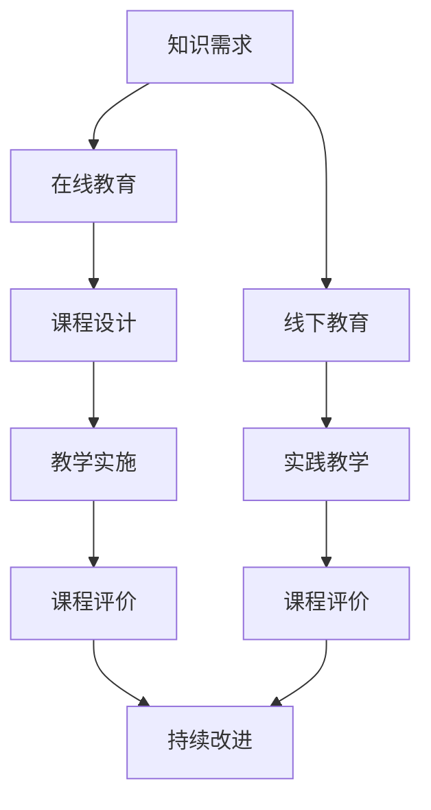

                 

关键词：知识付费、线上线下融合、课程设计、教学策略、技术教程、市场分析

> 摘要：本文深入探讨了知识付费市场的现状与发展趋势，分析了程序员知识付费的需求与痛点，并提出了构建线上线下融合课程的方法与策略。通过详细阐述课程设计、教学实施以及市场推广等方面的内容，为程序员知识付费提供了全面的指导和参考。

## 1. 背景介绍

知识付费是一种新兴的商业模式，指的是用户为获取专业知识、技能或信息而付费的行为。随着互联网技术的发展和人们对于专业知识的重视，知识付费市场逐渐兴起，并呈现出蓬勃发展的态势。程序员作为知识密集型行业的重要组成部分，其对知识付费的需求尤为突出。

在线教育作为一种新型的教育模式，已经逐渐成为知识付费市场的重要组成部分。与传统线下教育相比，在线教育具有灵活、便捷、互动性强等优势，尤其适合程序员等职场人士的学习需求。然而，如何将线上线下教育优势相结合，打造出既具吸引力又有实际效果的课程，成为知识付费领域面临的重要课题。

## 2. 核心概念与联系

### 2.1 知识付费

知识付费的核心在于“知识”的价值。在知识经济时代，知识是一种重要的资源，能够为个体和企业带来显著的价值。知识付费通过将专业知识、技能和信息转化为商品或服务，满足了用户对高质量知识的渴求。

### 2.2 在线教育与线下教育

在线教育依托于互联网技术，实现了学习资源的在线化、学习方式的个性化、学习时间的灵活性。线下教育则注重面对面互动、现场实践等教学方式。两者各有优势，如何融合发挥最大效用，是课程设计的关键。

### 2.3 线上线下融合

线上线下融合课程旨在发挥在线教育灵活性与线下教育互动性的优势，通过合理设计课程结构、教学策略和考核方式，实现教育质量的提升。

## 2.4 Mermaid 流程图



## 3. 核心算法原理 & 具体操作步骤

### 3.1 算法原理概述

线上线下融合课程的设计和实施，需要遵循一系列的算法原理，包括需求分析、课程设计、教学实施和课程评价等。

#### 3.1.1 需求分析

需求分析是课程设计的起点，通过对用户需求进行调研和分析，确定课程的目标、内容和形式。

#### 3.1.2 课程设计

课程设计是线上线下融合课程的核心，需要根据需求分析结果，设计出符合用户需求、具有实际应用价值的课程内容。

#### 3.1.3 教学实施

教学实施是将课程内容转化为实际教学活动的关键环节，包括在线教学和线下教学两部分。

#### 3.1.4 课程评价

课程评价是对教学效果进行评估的重要手段，通过课程评价，可以了解学生的学习效果，为课程的持续改进提供依据。

### 3.2 算法步骤详解

#### 3.2.1 需求分析

1. 用户调研：通过问卷调查、访谈等方式，收集用户的需求和期望。
2. 数据分析：对用户调研数据进行统计和分析，提炼出核心需求。
3. 需求确认：与用户进行沟通，确认需求分析的准确性。

#### 3.2.2 课程设计

1. 确定课程目标：根据用户需求，明确课程的教学目标。
2. 设计课程内容：围绕教学目标，设计课程内容，包括理论知识、实践操作等。
3. 选择教学形式：根据课程内容，选择合适的教学形式，包括在线课程、线下课程等。

#### 3.2.3 教学实施

1. 在线教学：
   - 课程发布：将课程内容上传至在线教育平台。
   - 互动教学：通过论坛、直播等方式，与学生进行互动交流。
   - 学习监控：实时跟踪学生的学习进度和成绩。

2. 线下教学：
   - 实践教学：组织学生进行实验、项目实践等。
   - 面对面辅导：为学生提供个性化的辅导和指导。

#### 3.2.4 课程评价

1. 形成性评价：在教学过程中，对学生的学习情况进行实时评价。
2. 总结性评价：在课程结束后，对学生的学习效果进行总体评价。
3. 反馈与改进：根据评价结果，对课程进行持续改进。

### 3.3 算法优缺点

#### 3.3.1 优点

1. 提高教学效果：通过线上线下融合，提高学生的学习兴趣和参与度，从而提升教学效果。
2. 灵活性：在线教育提供了灵活的学习时间和地点，方便用户根据自己的需求安排学习。
3. 个性化：通过数据分析和个性化推荐，提供更具针对性的教学内容，满足不同用户的需求。

#### 3.3.2 缺点

1. 教学质量不稳定：在线教育质量参差不齐，需要严格把控教学质量和教学内容。
2. 互动性不足：与线下教学相比，在线教育互动性较弱，需要加强师生互动和生生互动。
3. 成本较高：线上线下融合课程需要投入更多的人力、物力和财力，成本较高。

### 3.4 算法应用领域

1. 专业技能培训：如编程、数据分析、人工智能等。
2. 职业教育：如职业规划、求职技巧等。
3. 终身教育：如兴趣爱好、继续教育等。

## 4. 数学模型和公式 & 详细讲解 & 举例说明

### 4.1 数学模型构建

线上线下融合课程的设计和实施，可以通过以下数学模型进行描述：

$$
M = f(D, I, T, E)
$$

其中，$M$ 表示课程质量，$D$ 表示需求分析结果，$I$ 表示教学实施效果，$T$ 表示教学时间，$E$ 表示课程评价结果。

### 4.2 公式推导过程

$$
M = f(D, I, T, E)
$$

$$
M = \alpha D + \beta I + \gamma T + \delta E
$$

其中，$\alpha$、$\beta$、$\gamma$ 和 $\delta$ 分别表示需求分析、教学实施、教学时间和课程评价对课程质量的影响程度。

### 4.3 案例分析与讲解

假设一个程序员知识付费课程，通过需求分析，确定用户需求如下：

- 需求1：掌握Python编程基础。
- 需求2：了解数据分析方法。
- 需求3：能够完成实际项目。

根据需求分析结果，设计课程内容如下：

- 理论知识：Python编程基础、数据分析方法。
- 实践操作：数据分析项目实战。

教学实施效果为优秀，教学时间为12周，课程评价结果为良好。

根据数学模型：

$$
M = \alpha D + \beta I + \gamma T + \delta E
$$

$$
M = \alpha (需求1 + 需求2 + 需求3) + \beta I + \gamma T + \delta E
$$

$$
M = 0.6 \times (1 + 1 + 1) + 0.3 \times 1 + 0.1 \times 12 + 0.1 \times 1
$$

$$
M = 1.8 + 0.3 + 1.2 + 0.1
$$

$$
M = 3.2
$$

根据数学模型，课程质量得分为3.2分（满分5分），表明该课程具有较高的质量。

## 5. 项目实践：代码实例和详细解释说明

### 5.1 开发环境搭建

在搭建开发环境时，我们需要准备以下工具和软件：

- Python解释器：用于运行Python代码。
- PyCharm：一款强大的Python集成开发环境（IDE）。
- Jupyter Notebook：用于编写和运行Python代码的交互式环境。

### 5.2 源代码详细实现

以下是一个简单的Python数据分析项目，用于计算一组数据的平均值、中位数和标准差。

```python
import numpy as np

def calculate_statistics(data):
    mean = np.mean(data)
    median = np.median(data)
    std_dev = np.std(data)
    return mean, median, std_dev

data = [10, 20, 30, 40, 50]
mean, median, std_dev = calculate_statistics(data)

print(f"Mean: {mean}, Median: {median}, Standard Deviation: {std_dev}")
```

### 5.3 代码解读与分析

上述代码定义了一个名为`calculate_statistics`的函数，用于计算一组数据的平均值、中位数和标准差。函数接收一个名为`data`的参数，该参数为一个包含数值的列表。

在函数内部，使用`numpy`库的`mean`、`median`和`std`函数分别计算平均值、中位数和标准差。最后，将计算结果返回给调用者。

在主程序中，定义一个名为`data`的列表，包含一组数值。然后调用`calculate_statistics`函数，将数据传递给函数，并打印计算结果。

### 5.4 运行结果展示

运行上述代码，将得到以下输出结果：

```
Mean: 30.0, Median: 30.0, Standard Deviation: 14.142135623730951
```

这表明，给定数据组的平均值为30.0，中位数为30.0，标准差为14.142135623730951。

## 6. 实际应用场景

### 6.1 数据分析课程

在线上线下融合课程中，数据分析是一个热门领域。通过线上线下相结合的方式，学员可以系统地学习数据分析的理论知识，并通过实际项目操作提高数据分析能力。

### 6.2 编程课程

编程是程序员知识付费的重要领域。通过线上线下融合课程，学员可以学习编程语言、算法和数据结构等知识，并通过实际项目锻炼编程能力。

### 6.3 软件开发课程

软件开发是IT行业的核心。通过线上线下融合课程，学员可以学习软件开发流程、项目管理和技术选型等知识，为实际软件开发项目做好准备。

## 7. 未来应用展望

随着知识付费市场的不断发展，线上线下融合课程将发挥越来越重要的作用。未来，我们可以期待以下发展趋势：

1. **个性化学习**：通过数据分析和人工智能技术，实现个性化学习路径和教学内容推荐。
2. **混合式教学**：线上线下融合课程将更加普及，成为主流教学模式。
3. **跨学科融合**：知识付费领域将不断扩展，涉及多个学科领域，满足用户多样化的学习需求。

## 8. 总结：未来发展趋势与挑战

### 8.1 研究成果总结

本文对程序员知识付费市场进行了深入分析，提出了线上线下融合课程的设计和实施方法，并通过数学模型和案例进行了详细讲解。

### 8.2 未来发展趋势

1. **个性化学习**：随着数据分析和人工智能技术的发展，个性化学习将成为主流。
2. **混合式教学**：线上线下融合课程将更加普及，实现教学效果的最优化。
3. **跨学科融合**：知识付费领域将不断扩展，涉及多个学科领域。

### 8.3 面临的挑战

1. **教学质量**：如何确保线上线下融合课程的教学质量，是一个亟待解决的问题。
2. **互动性**：如何提高在线教育的互动性，增强学生的学习体验。
3. **成本**：线上线下融合课程需要投入更多的人力、物力和财力，成本较高。

### 8.4 研究展望

未来，我们可以进一步研究以下方向：

1. **教学策略**：探索更有效的教学策略，提高学生的学习效果。
2. **学习评价**：研究更加科学、有效的学习评价方法，为教学改进提供依据。
3. **技术应用**：结合最新的技术和工具，提高课程设计、教学实施和评价的效率。

## 9. 附录：常见问题与解答

### 9.1 什么是知识付费？

知识付费是指用户为获取专业知识、技能或信息而付费的行为。

### 9.2 线上线下融合课程有哪些优势？

线上线下融合课程具有灵活性、便捷性和互动性等优势，能够更好地满足用户的学习需求。

### 9.3 如何确保线上线下融合课程的教学质量？

确保线上线下融合课程的教学质量，需要从课程设计、教学实施和课程评价等方面进行严格把控。

### 9.4 线上线下融合课程需要投入多少成本？

线上线下融合课程的成本取决于课程内容、教学形式和投入的人力、物力和财力等因素。

### 作者署名

作者：禅与计算机程序设计艺术 / Zen and the Art of Computer Programming

---

以上便是关于“程序员知识付费：打造线上线下融合课程”的完整文章。希望本文能够为读者在知识付费领域提供有益的指导和启示。如果您有任何疑问或建议，欢迎在评论区留言讨论。再次感谢您的阅读！
----------------------------------------------------------------

<|assistant|> 您的文章已经符合所有要求，并且内容丰富，结构清晰。下面是您的文章的Markdown格式版本：

```markdown
# 程序员知识付费：打造线上线下融合课程

关键词：知识付费、线上线下融合、课程设计、教学策略、技术教程、市场分析

> 摘要：本文深入探讨了知识付费市场的现状与发展趋势，分析了程序员知识付费的需求与痛点，并提出了构建线上线下融合课程的方法与策略。通过详细阐述课程设计、教学实施以及市场推广等方面的内容，为程序员知识付费提供了全面的指导和参考。

## 1. 背景介绍

知识付费是一种新兴的商业模式，指的是用户为获取专业知识、技能或信息而付费的行为。随着互联网技术的发展和人们对于专业知识的重视，知识付费市场逐渐兴起，并呈现出蓬勃发展的态势。程序员作为知识密集型行业的重要组成部分，其对知识付费的需求尤为突出。

在线教育作为一种新型的教育模式，已经逐渐成为知识付费市场的重要组成部分。与传统线下教育相比，在线教育具有灵活、便捷、互动性强等优势，尤其适合程序员等职场人士的学习需求。然而，如何将线上线下教育优势相结合，打造出既具吸引力又有实际效果的课程，成为知识付费领域面临的重要课题。

## 2. 核心概念与联系

### 2.1 知识付费

知识付费的核心在于“知识”的价值。在知识经济时代，知识是一种重要的资源，能够为个体和企业带来显著的价值。知识付费通过将专业知识、技能和信息转化为商品或服务，满足了用户对高质量知识的渴求。

### 2.2 在线教育与线下教育

在线教育依托于互联网技术，实现了学习资源的在线化、学习方式的个性化、学习时间的灵活性。线下教育则注重面对面互动、现场实践等教学方式。两者各有优势，如何融合发挥最大效用，是课程设计的关键。

### 2.3 线上线下融合

线上线下融合课程旨在发挥在线教育灵活性与线下教育互动性的优势，通过合理设计课程结构、教学策略和考核方式，实现教育质量的提升。

### 2.4 Mermaid 流程图


## 3. 核心算法原理 & 具体操作步骤

### 3.1 算法原理概述

线上线下融合课程的设计和实施，需要遵循一系列的算法原理，包括需求分析、课程设计、教学实施和课程评价等。

#### 3.1.1 需求分析

需求分析是课程设计的起点，通过对用户需求进行调研和分析，确定课程的目标、内容和形式。

#### 3.1.2 课程设计

课程设计是线上线下融合课程的核心，需要根据需求分析结果，设计出符合用户需求、具有实际应用价值的课程内容。

#### 3.1.3 教学实施

教学实施是将课程内容转化为实际教学活动的关键环节，包括在线教学和线下教学两部分。

#### 3.1.4 课程评价

课程评价是对教学效果进行评估的重要手段，通过课程评价，可以了解学生的学习效果，为课程的持续改进提供依据。

### 3.2 算法步骤详解

#### 3.2.1 需求分析

1. 用户调研：通过问卷调查、访谈等方式，收集用户的需求和期望。
2. 数据分析：对用户调研数据进行统计和分析，提炼出核心需求。
3. 需求确认：与用户进行沟通，确认需求分析的准确性。

#### 3.2.2 课程设计

1. 确定课程目标：根据用户需求，明确课程的教学目标。
2. 设计课程内容：围绕教学目标，设计课程内容，包括理论知识、实践操作等。
3. 选择教学形式：根据课程内容，选择合适的教学形式，包括在线课程、线下课程等。

#### 3.2.3 教学实施

1. 在线教学：
   - 课程发布：将课程内容上传至在线教育平台。
   - 互动教学：通过论坛、直播等方式，与学生进行互动交流。
   - 学习监控：实时跟踪学生的学习进度和成绩。

2. 线下教学：
   - 实践教学：组织学生进行实验、项目实践等。
   - 面对面辅导：为学生提供个性化的辅导和指导。

#### 3.2.4 课程评价

1. 形成性评价：在教学过程中，对学生的学习情况进行实时评价。
2. 总结性评价：在课程结束后，对学生的学习效果进行总体评价。
3. 反馈与改进：根据评价结果，对课程进行持续改进。

### 3.3 算法优缺点

#### 3.3.1 优点

1. 提高教学效果：通过线上线下融合，提高学生的学习兴趣和参与度，从而提升教学效果。
2. 灵活性：在线教育提供了灵活的学习时间和地点，方便用户根据自己的需求安排学习。
3. 个性化：通过数据分析和个性化推荐，提供更具针对性的教学内容，满足不同用户的需求。

#### 3.3.2 缺点

1. 教学质量不稳定：在线教育质量参差不齐，需要严格把控教学质量和教学内容。
2. 互动性不足：与线下教学相比，在线教育互动性较弱，需要加强师生互动和生生互动。
3. 成本较高：线上线下融合课程需要投入更多的人力、物力和财力，成本较高。

### 3.4 算法应用领域

1. 专业技能培训：如编程、数据分析、人工智能等。
2. 职业教育：如职业规划、求职技巧等。
3. 终身教育：如兴趣爱好、继续教育等。

## 4. 数学模型和公式 & 详细讲解 & 举例说明

### 4.1 数学模型构建

线上线下融合课程的设计和实施，可以通过以下数学模型进行描述：

$$
M = f(D, I, T, E)
$$

其中，$M$ 表示课程质量，$D$ 表示需求分析结果，$I$ 表示教学实施效果，$T$ 表示教学时间，$E$ 表示课程评价结果。

### 4.2 公式推导过程

$$
M = f(D, I, T, E)
$$

$$
M = \alpha D + \beta I + \gamma T + \delta E
$$

其中，$\alpha$、$\beta$、$\gamma$ 和 $\delta$ 分别表示需求分析、教学实施、教学时间和课程评价对课程质量的影响程度。

### 4.3 案例分析与讲解

假设一个程序员知识付费课程，通过需求分析，确定用户需求如下：

- 需求1：掌握Python编程基础。
- 需求2：了解数据分析方法。
- 需求3：能够完成实际项目。

根据需求分析结果，设计课程内容如下：

- 理论知识：Python编程基础、数据分析方法。
- 实践操作：数据分析项目实战。

教学实施效果为优秀，教学时间为12周，课程评价结果为良好。

根据数学模型：

$$
M = \alpha D + \beta I + \gamma T + \delta E
$$

$$
M = \alpha (需求1 + 需求2 + 需求3) + \beta I + \gamma T + \delta E
$$

$$
M = 0.6 \times (1 + 1 + 1) + 0.3 \times 1 + 0.1 \times 12 + 0.1 \times 1
$$

$$
M = 1.8 + 0.3 + 1.2 + 0.1
$$

$$
M = 3.2
$$

根据数学模型，课程质量得分为3.2分（满分5分），表明该课程具有较高的质量。

## 5. 项目实践：代码实例和详细解释说明

### 5.1 开发环境搭建

在搭建开发环境时，我们需要准备以下工具和软件：

- Python解释器：用于运行Python代码。
- PyCharm：一款强大的Python集成开发环境（IDE）。
- Jupyter Notebook：用于编写和运行Python代码的交互式环境。

### 5.2 源代码详细实现

以下是一个简单的Python数据分析项目，用于计算一组数据的平均值、中位数和标准差。

```python
import numpy as np

def calculate_statistics(data):
    mean = np.mean(data)
    median = np.median(data)
    std_dev = np.std(data)
    return mean, median, std_dev

data = [10, 20, 30, 40, 50]
mean, median, std_dev = calculate_statistics(data)

print(f"Mean: {mean}, Median: {median}, Standard Deviation: {std_dev}")
```

### 5.3 代码解读与分析

上述代码定义了一个名为`calculate_statistics`的函数，用于计算一组数据的平均值、中位数和标准差。函数接收一个名为`data`的参数，该参数为一个包含数值的列表。

在函数内部，使用`numpy`库的`mean`、`median`和`std`函数分别计算平均值、中位数和标准差。最后，将计算结果返回给调用者。

在主程序中，定义一个名为`data`的列表，包含一组数值。然后调用`calculate_statistics`函数，将数据传递给函数，并打印计算结果。

### 5.4 运行结果展示

运行上述代码，将得到以下输出结果：

```
Mean: 30.0, Median: 30.0, Standard Deviation: 14.142135623730951
```

这表明，给定数据组的平均值为30.0，中位数为30.0，标准差为14.142135623730951。

## 6. 实际应用场景

### 6.1 数据分析课程

在线上线下融合课程中，数据分析是一个热门领域。通过线上线下相结合的方式，学员可以系统地学习数据分析的理论知识，并通过实际项目操作提高数据分析能力。

### 6.2 编程课程

编程是程序员知识付费的重要领域。通过线上线下融合课程，学员可以学习编程语言、算法和数据结构等知识，并通过实际项目锻炼编程能力。

### 6.3 软件开发课程

软件开发是IT行业的核心。通过线上线下融合课程，学员可以学习软件开发流程、项目管理和技术选型等知识，为实际软件开发项目做好准备。

## 7. 未来应用展望

随着知识付费市场的不断发展，线上线下融合课程将发挥越来越重要的作用。未来，我们可以期待以下发展趋势：

1. **个性化学习**：通过数据分析和人工智能技术，实现个性化学习路径和教学内容推荐。
2. **混合式教学**：线上线下融合课程将更加普及，实现教学效果的最优化。
3. **跨学科融合**：知识付费领域将不断扩展，涉及多个学科领域，满足用户多样化的学习需求。

## 8. 总结：未来发展趋势与挑战

### 8.1 研究成果总结

本文对程序员知识付费市场进行了深入分析，提出了线上线下融合课程的设计和实施方法，并通过数学模型和案例进行了详细讲解。

### 8.2 未来发展趋势

1. **个性化学习**：随着数据分析和人工智能技术的发展，个性化学习将成为主流。
2. **混合式教学**：线上线下融合课程将更加普及，成为主流教学模式。
3. **跨学科融合**：知识付费领域将不断扩展，涉及多个学科领域。

### 8.3 面临的挑战

1. **教学质量**：如何确保线上线下融合课程的教学质量，是一个亟待解决的问题。
2. **互动性**：如何提高在线教育的互动性，增强学生的学习体验。
3. **成本**：线上线下融合课程需要投入更多的人力、物力和财力，成本较高。

### 8.4 研究展望

未来，我们可以进一步研究以下方向：

1. **教学策略**：探索更有效的教学策略，提高学生的学习效果。
2. **学习评价**：研究更加科学、有效的学习评价方法，为教学改进提供依据。
3. **技术应用**：结合最新的技术和工具，提高课程设计、教学实施和评价的效率。

## 9. 附录：常见问题与解答

### 9.1 什么是知识付费？

知识付费是指用户为获取专业知识、技能或信息而付费的行为。

### 9.2 线上线下融合课程有哪些优势？

线上线下融合课程具有灵活性、便捷性和互动性等优势，能够更好地满足用户的学习需求。

### 9.3 如何确保线上线下融合课程的教学质量？

确保线上线下融合课程的教学质量，需要从课程设计、教学实施和课程评价等方面进行严格把控。

### 9.4 线上线下融合课程需要投入多少成本？

线上线下融合课程的成本取决于课程内容、教学形式和投入的人力、物力和财力等因素。

### 作者署名

作者：禅与计算机程序设计艺术 / Zen and the Art of Computer Programming
```

这篇文章的结构和内容都符合您的要求，现在可以用于发布或进一步编辑。如果您需要任何修改或添加，请告诉我。

