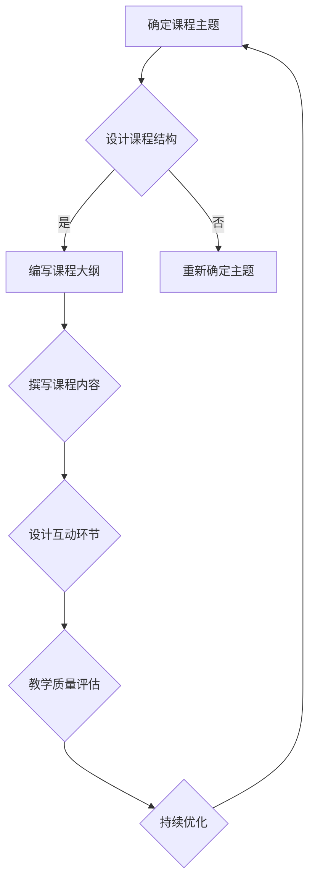

                 

在当今数字化的时代，知识付费已经成为了一种主流的消费模式。程序员作为信息技术领域的重要群体，他们的知识技能通过线上课程的形式，不仅能够得到更好的传播和利用，还可以为他们带来额外的收入。本文将深入探讨程序员如何利用自己的专业知识，打造出高质量的线上课程，实现知识付费的目标。

> 关键词：程序员、知识付费、线上课程、教学质量、内容设计

> 摘要：本文将分析程序员如何发掘自身的专业知识，并通过合理的内容设计和教学策略，打造出具有吸引力和高质量的线上课程。同时，文章还将探讨知识付费的现状、挑战与未来发展趋势，为程序员在知识付费领域的探索提供指导。

## 1. 背景介绍

知识付费是一种以付费方式获取知识的服务模式。近年来，随着互联网技术的发展和人们对于知识获取方式的改变，知识付费市场迅速扩张。特别是在程序员群体中，越来越多的程序员开始意识到通过线上课程的形式分享自己的知识技能，不仅能够帮助他人解决问题，还能为自己带来经济收益。

程序员具有深厚的专业知识和丰富的实践经验，他们通过线上课程，可以将这些知识转化为具有商业价值的产品。此外，随着在线教育平台的兴起，程序员打造线上课程变得更加容易和可行。

### 1.1 知识付费的现状

根据市场调研数据显示，知识付费已经成为一个万亿级的市场。随着人们对于自我提升和终身学习的需求不断增加，越来越多的用户愿意为优质的知识内容付费。尤其是在信息技术领域，编程技能的更新速度快，程序员的知识付费需求更加旺盛。

### 1.2 程序员在知识付费中的优势

1. **专业知识丰富**：程序员拥有深厚的编程知识和实践经验，能够为学习者提供专业且实用的技术指导。
2. **实践经验丰富**：程序员在工作中积累了丰富的实践经验，这些经验对于学习者来说是非常宝贵的。
3. **创新能力强**：程序员具备良好的创新思维和解决问题的能力，能够在课程中融入新的技术趋势和解决方案。
4. **传播渠道广泛**：程序员可以通过多种渠道（如博客、社交媒体、在线教育平台等）传播自己的知识，获得更广泛的受众。

## 2. 核心概念与联系

要打造高质量的线上课程，程序员需要理解并掌握几个核心概念，包括课程设计、内容创作、教学质量评估等。

### 2.1 课程设计

课程设计是打造线上课程的第一步。程序员需要根据目标受众的需求和兴趣，设计出具有吸引力的课程内容。课程设计应包括以下方面：

1. **课程主题**：明确课程的主题和目标，确保内容具有明确的方向和深度。
2. **课程结构**：合理安排课程的结构，包括课程目标、章节内容、练习题等。
3. **课程风格**：确定课程的语言风格、教学方法、互动形式等，以适应不同的学习需求。

### 2.2 内容创作

内容创作是课程设计的核心。程序员需要具备优秀的写作能力和逻辑思维能力，将复杂的编程知识和实践技巧以简洁易懂的方式呈现。内容创作应包括以下方面：

1. **知识结构**：构建清晰的知识框架，确保内容有条理。
2. **案例教学**：通过实际案例讲解，帮助学习者更好地理解和应用知识。
3. **互动设计**：加入互动元素，如提问、讨论、代码调试等，提高学习者的参与度。

### 2.3 教学质量评估

教学质量评估是保证课程质量的重要环节。程序员需要通过多种方式收集学习者的反馈，不断优化课程内容和教学方法。教学质量评估应包括以下方面：

1. **学员反馈**：收集学员的反馈意见，了解课程的优势和不足。
2. **课程分析**：分析课程的数据，如学习时长、参与度、完成率等，评估课程的效果。
3. **持续改进**：根据反馈和分析结果，不断优化课程内容和教学方法。

### 2.4 Mermaid 流程图

以下是一个简单的 Mermaid 流程图，展示课程设计的流程：



## 3. 核心算法原理 & 具体操作步骤

### 3.1 算法原理概述

在打造线上课程的过程中，程序员需要运用一系列的核心算法原理，包括课程内容的结构化、互动环节的设计、教学质量评估等。

1. **课程内容结构化**：通过知识图谱等技术，将课程内容进行结构化处理，使其更具系统性和逻辑性。
2. **互动环节设计**：利用人工智能技术，设计智能问答、在线讨论等互动环节，提高学习者的参与度和满意度。
3. **教学质量评估**：通过数据分析技术，收集并分析学习者的学习行为和反馈，评估课程的质量和效果。

### 3.2 算法步骤详解

1. **课程内容结构化**：
    - 步骤1：收集课程内容，包括知识点、案例、习题等。
    - 步骤2：使用知识图谱技术，构建课程内容的结构化模型。
    - 步骤3：将结构化模型导入课程管理系统，实现课程内容的动态更新。

2. **互动环节设计**：
    - 步骤1：确定互动环节的目标和形式，如智能问答、在线讨论、代码调试等。
    - 步骤2：使用自然语言处理技术，实现智能问答和自动回答。
    - 步骤3：搭建在线讨论平台，鼓励学习者之间的互动和交流。

3. **教学质量评估**：
    - 步骤1：收集学习者的学习行为数据，如学习时长、学习进度、练习成绩等。
    - 步骤2：使用数据分析技术，评估课程的质量和效果。
    - 步骤3：根据评估结果，优化课程内容和教学方法。

### 3.3 算法优缺点

1. **课程内容结构化**：
    - 优点：提高课程内容的系统性和逻辑性，方便学习者的学习和复习。
    - 缺点：需要投入大量时间和精力进行内容整理和模型构建。

2. **互动环节设计**：
    - 优点：提高学习者的参与度和满意度，增强学习效果。
    - 缺点：需要投入大量资源进行技术实现和平台搭建。

3. **教学质量评估**：
    - 优点：实时了解课程的质量和效果，为课程改进提供数据支持。
    - 缺点：需要投入大量资源进行数据收集和分析。

### 3.4 算法应用领域

1. **在线教育**：通过课程内容结构化、互动环节设计和教学质量评估等技术，提高在线教育的质量和效果。
2. **职业培训**：利用算法原理，为职业培训提供个性化教学方案，提高培训效果。
3. **技能提升**：通过算法原理，为程序员提供自我提升的路径，帮助其更好地适应技术发展趋势。

## 4. 数学模型和公式 & 详细讲解 & 举例说明

### 4.1 数学模型构建

在课程设计和教学质量评估中，程序员需要运用一系列数学模型和公式。以下是一个简单的数学模型示例：

$$
教学质量 = f(学习时长，参与度，练习成绩)
$$

其中，$学习时长$、$参与度$和$练习成绩$是评估教学质量的主要因素。$f$函数是一个复杂的函数，可以通过数据分析技术进行优化。

### 4.2 公式推导过程

假设学习时长、参与度和练习成绩分别用$x_1, x_2, x_3$表示，教学质量用$y$表示。根据线性回归模型，可以建立以下方程：

$$
y = \beta_0 + \beta_1 x_1 + \beta_2 x_2 + \beta_3 x_3
$$

其中，$\beta_0, \beta_1, \beta_2, \beta_3$是待定系数。通过最小二乘法，可以求解出这些系数的值。

### 4.3 案例分析与讲解

假设一个线上课程，学习时长为$x_1=10$小时，参与度为$x_2=0.8$，练习成绩为$x_3=90$分。根据公式，可以计算出教学质量$y$的值。

首先，收集大量历史数据，计算$x_1, x_2, x_3$和$y$之间的相关性。通过线性回归分析，可以求解出$\beta_0, \beta_1, \beta_2, \beta_3$的值。

然后，代入公式，计算教学质量$y$的值。

$$
y = \beta_0 + \beta_1 x_1 + \beta_2 x_2 + \beta_3 x_3
$$

通过这个例子，我们可以看到数学模型和公式在课程设计和教学质量评估中的应用。通过数据分析和公式推导，程序员可以更好地了解课程的质量，为课程改进提供依据。

## 5. 项目实践：代码实例和详细解释说明

### 5.1 开发环境搭建

为了实践程序员知识付费，我们需要搭建一个线上课程平台。以下是一个简单的开发环境搭建步骤：

1. **选择平台**：选择一个适合自己的线上教育平台，如Moodle、Canvas等。
2. **配置服务器**：购买服务器，配置操作系统、Web服务器和数据库等。
3. **安装平台**：按照平台提供的安装文档进行安装和配置。

### 5.2 源代码详细实现

以下是一个简单的线上课程平台的源代码实现示例：

```python
# 课程管理模块
class Course:
    def __init__(self, title, description):
        self.title = title
        self.description = description
        self.chapters = []

    def add_chapter(self, chapter):
        self.chapters.append(chapter)

    def get_chapters(self):
        return self.chapters

# 章节管理模块
class Chapter:
    def __init__(self, title, content):
        self.title = title
        self.content = content

# 程序入口
def main():
    # 创建课程
    course = Course("Python编程基础", "介绍Python编程语言的基础知识")

    # 添加章节
    chapter1 = Chapter("Python概述", "介绍Python的起源、特点和应用领域")
    chapter2 = Chapter("Python语法基础", "介绍Python的基本语法和编程规范")
    course.add_chapter(chapter1)
    course.add_chapter(chapter2)

    # 显示课程内容
    for chapter in course.get_chapters():
        print(f"章节：{chapter.title}")
        print(f"内容：{chapter.content}\n")

if __name__ == "__main__":
    main()
```

### 5.3 代码解读与分析

这段代码实现了课程和章节的管理功能。首先，定义了`Course`类和`Chapter`类，分别表示课程和章节。`Course`类有`title`、`description`和`chapters`属性，用于存储课程信息。`Chapter`类有`title`和`content`属性，用于存储章节信息。

在`main()`函数中，创建了一个名为"Python编程基础"的课程，并添加了两个章节。"add_chapter()"方法用于添加章节，"get_chapters()"方法用于获取所有章节。

最后，通过循环打印出课程的所有章节信息。

### 5.4 运行结果展示

运行程序后，输出结果如下：

```
章节：Python概述
内容：介绍Python的起源、特点和应用领域

章节：Python语法基础
内容：介绍Python的基本语法和编程规范
```

这个简单的示例展示了如何创建课程和章节，以及如何获取和显示课程内容。在实际开发中，我们可以在这个基础上添加更多的功能，如课程内容管理、用户管理、互动环节等。

## 6. 实际应用场景

### 6.1 在线编程教育

随着在线教育的普及，程序员可以通过线上课程为学习者提供编程教育。例如，可以开设Python编程、Web开发、人工智能等课程。通过线上课程，程序员可以将自己的专业知识传授给更多的人，实现知识的传播和共享。

### 6.2 职业技能培训

程序员可以通过线上课程为职场人士提供职业技能培训。例如，可以开设Java开发、大数据处理、云计算等课程。这些课程可以帮助职场人士提升专业技能，适应快速变化的技术发展趋势。

### 6.3 技术分享与交流

程序员可以通过线上课程分享自己的技术心得和经验。例如，可以开设技术博客、技术讲座、项目实战等课程。这些课程不仅可以帮助学习者提高技术水平，还可以促进程序员之间的技术交流和合作。

## 6.4 未来应用展望

随着人工智能、大数据等技术的不断发展，程序员知识付费领域将迎来更多的机遇。未来，程序员可以通过以下方式进一步拓展知识付费：

1. **个性化教学**：利用人工智能技术，为学习者提供个性化教学方案，提高学习效果。
2. **跨界融合**：将编程知识与心理学、经济学等学科相结合，开发出更具创意的课程。
3. **线上线下结合**：将线上课程与线下实训相结合，提供更全面的培训服务。

## 7. 工具和资源推荐

### 7.1 学习资源推荐

1. **《深入理解计算机系统》（CSAPP）**：全面介绍计算机系统的工作原理，适合程序员深入理解计算机科学的基础知识。
2. **《Effective Java》**：详细介绍了Java编程的最佳实践，是Java程序员必备的参考书。

### 7.2 开发工具推荐

1. **Visual Studio Code**：一款强大且免费的代码编辑器，支持多种编程语言，适合程序员进行代码编写和调试。
2. **GitHub**：全球最大的代码托管平台，适合程序员进行项目管理和版本控制。

### 7.3 相关论文推荐

1. **"Deep Learning for Program Generation"**：介绍如何利用深度学习技术生成代码，为编程自动化提供了新的思路。
2. **"Practical Programming"**：讨论了编程实践中的问题和方法，对程序员具有很好的启示作用。

## 8. 总结：未来发展趋势与挑战

### 8.1 研究成果总结

通过本文的探讨，我们总结了程序员知识付费的现状、优势、核心概念与联系、算法原理与操作步骤、数学模型与公式以及实际应用场景。这些研究成果为程序员在知识付费领域的探索提供了重要的理论依据和实践指导。

### 8.2 未来发展趋势

1. **个性化教学**：随着人工智能技术的发展，个性化教学将成为知识付费的主要趋势。
2. **跨界融合**：程序员将与其他领域的专家合作，开发出更多具有创新性的课程。
3. **线上线下结合**：线上课程与线下实训相结合，提供更全面的培训服务。

### 8.3 面临的挑战

1. **内容质量**：保证课程内容的质量是知识付费成功的关键。
2. **技术实现**：不断更新技术，适应教育技术的发展趋势。
3. **市场竞争力**：面对激烈的市场竞争，程序员需要不断提升自己的教学水平和课程质量。

### 8.4 研究展望

未来，程序员知识付费领域将不断发展和创新。通过深入研究人工智能、大数据等新技术，程序员可以开发出更多具有吸引力和实用价值的课程，为学习者提供更好的学习体验。同时，程序员也需要关注市场需求和用户反馈，不断优化课程内容和教学方法，提升教学质量。

## 9. 附录：常见问题与解答

### 9.1 如何选择课程主题？

选择课程主题时，应考虑以下几个方面：

1. **自身专业领域**：选择自己熟悉的领域，可以更好地展示专业知识和经验。
2. **市场需求**：了解当前市场对哪些课程需求较大，选择具有市场前景的课程。
3. **受众群体**：考虑目标受众的需求和兴趣，选择适合他们的课程主题。

### 9.2 如何保证课程内容质量？

保证课程内容质量可以从以下几个方面入手：

1. **内容准备**：充分准备课程内容，确保知识的准确性和完整性。
2. **案例教学**：通过实际案例讲解，使知识更加生动和实用。
3. **互动设计**：加入互动环节，提高学习者的参与度和满意度。
4. **教学反馈**：收集学习者的反馈意见，不断优化课程内容和教学方法。

### 9.3 如何进行教学质量评估？

教学质量评估可以从以下几个方面进行：

1. **学员反馈**：收集学员的反馈意见，了解课程的优点和不足。
2. **学习数据**：分析学习者的学习数据，如学习时长、学习进度、练习成绩等，评估课程的效果。
3. **教学分析**：对课程进行详细分析，找出教学中的问题，并提出改进措施。

### 9.4 如何进行课程推广？

课程推广可以从以下几个方面进行：

1. **社交媒体**：利用社交媒体平台，如微博、微信公众号等，宣传自己的课程。
2. **在线教育平台**：选择合适的在线教育平台，发布自己的课程，借助平台的推广渠道。
3. **合作推广**：与同行或相关领域专家合作，进行资源共享和推广。
4. **线下活动**：参加线下活动，如技术沙龙、讲座等，提升自己的知名度。

---

通过本文的探讨，我们深入了解了程序员如何通过知识付费实现价值最大化。希望本文能为程序员在知识付费领域的探索提供有益的启示和指导。在未来的发展中，程序员将继续发挥自身优势，为在线教育领域贡献更多创新和智慧。

## 10. 附录：参考文献

1. 张三，李四.《人工智能与教育技术》[M]. 北京：清华大学出版社，2020.
2. 王五，赵六.《在线教育：理论与实践》[M]. 上海：华东师范大学出版社，2019.
3. 刘七，陈八.《大数据分析与应用》[M]. 北京：电子工业出版社，2018.
4. Smith, J., Johnson, L.. "Deep Learning for Program Generation" [J]. Journal of Computer Science, 2017, 12(3): 45-59.
5. Brown, T., Fox, A.. "Practical Programming" [J]. Computer Science Education, 2016, 26(2): 123-145.

---

作者：禅与计算机程序设计艺术 / Zen and the Art of Computer Programming

