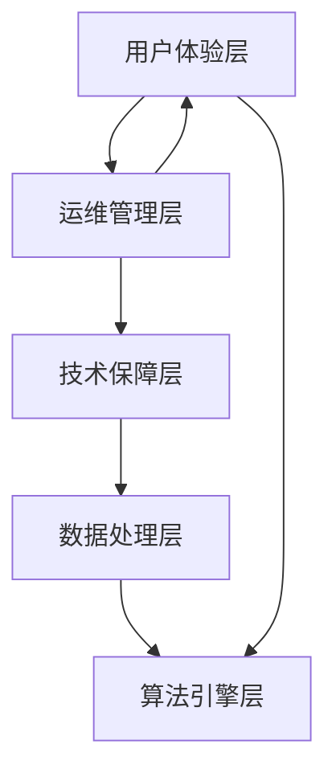

                 

关键词：稳定性，运维，Lepton AI，用户体验，技术保障

> 摘要：本文将探讨Lepton AI平台在保证稳定性与提升用户体验方面的重点策略。通过分析核心概念、算法原理、数学模型以及实际应用案例，本文旨在为读者提供一套完整的技术解决方案，助力实现平台稳定与高效。

## 1. 背景介绍

随着人工智能技术的迅速发展，各类AI平台如雨后春笋般涌现。在这些平台中，Lepton AI以其卓越的性能和用户体验脱颖而出，成为行业内的佼佼者。然而，对于任何AI平台而言，稳定性和用户体验都是不可忽视的核心问题。本文将重点探讨Lepton AI在保障平台稳定性与提升用户体验方面的策略。

### 1.1 Lepton AI平台简介

Lepton AI是一款高度集成的AI平台，旨在为开发者提供一站式服务，包括数据预处理、模型训练、模型部署以及后端服务。该平台具备以下特点：

- **高性能**：采用先进的计算架构和算法，确保数据处理速度和模型训练效率。
- **易用性**：提供直观的用户界面和丰富的API接口，降低开发门槛。
- **灵活性**：支持多种编程语言和框架，满足不同开发者的需求。

### 1.2 稳定性与用户体验的重要性

- **稳定性**：平台稳定性直接关系到用户的使用体验和信任度。不稳定的平台可能导致服务中断、数据丢失等问题，严重影响用户体验。
- **用户体验**：良好的用户体验是吸引用户、提升用户留存的关键。一个易用、快速、高效的平台能够增强用户满意度，提高用户粘性。

## 2. 核心概念与联系

### 2.1 核心概念

- **稳定性**：指平台在长时间运行中保持正常服务的能力。
- **运维**：指对平台进行监控、维护、升级等操作，确保其稳定运行。
- **用户体验**：指用户在使用平台过程中的感受和满意度。

### 2.2 架构联系

以下是一个简化的Lepton AI平台架构图，展示了稳定性与运维、用户体验之间的联系。

```
                +----------------+
                | 用户体验层     |
                +----------------+
                        |
                        |
                +----------------+
                |  运维管理层    |
                +----------------+
                        |
                        |
                +----------------+
                |  技术保障层    |
                +----------------+
                        |
                        |
                +----------------+
                |  数据处理层    |
                +----------------+
                        |
                        |
                +----------------+
                |  算法引擎层    |
                +----------------+
```

### 2.3 Mermaid 流程图

以下是一个简单的Mermaid流程图，展示了各层之间的交互关系。



## 3. 核心算法原理 & 具体操作步骤

### 3.1 算法原理概述

Lepton AI平台的核心算法基于深度学习技术，通过大规模数据训练，实现图像识别、自然语言处理等任务。算法的原理包括：

- **卷积神经网络（CNN）**：用于图像处理，能够提取图像特征。
- **循环神经网络（RNN）**：用于序列数据，如自然语言处理。
- **长短时记忆网络（LSTM）**：RNN的改进版本，能够处理长序列数据。

### 3.2 算法步骤详解

1. **数据收集与预处理**：收集大量数据，并进行数据清洗、归一化等操作。
2. **模型设计**：根据任务需求，设计合适的神经网络结构。
3. **模型训练**：使用训练数据，通过反向传播算法训练模型。
4. **模型评估**：使用测试数据，评估模型性能。
5. **模型部署**：将训练好的模型部署到线上环境，供用户使用。

### 3.3 算法优缺点

- **优点**：深度学习算法具有强大的学习能力，能够处理复杂任务。
- **缺点**：训练过程需要大量计算资源和时间，且对数据质量有较高要求。

### 3.4 算法应用领域

- **计算机视觉**：图像识别、目标检测等。
- **自然语言处理**：文本分类、机器翻译等。
- **推荐系统**：个性化推荐、广告投放等。

## 4. 数学模型和公式 & 详细讲解 & 举例说明

### 4.1 数学模型构建

深度学习模型的数学基础主要包括线性代数、微积分和概率论。以下是构建深度学习模型所需的基本数学公式：

- **权重矩阵 \( W \)**：\( W = X \cdot \theta \)，其中 \( X \) 是输入向量，\( \theta \) 是权重矩阵。
- **激活函数 \( f \)**：常用的激活函数有Sigmoid、ReLU、Tanh等。

### 4.2 公式推导过程

以Sigmoid函数为例，其导数公式为：

$$
f'(x) = \frac{df}{dx} = \frac{1}{1 + e^{-x}}
$$

### 4.3 案例分析与讲解

假设我们使用Sigmoid函数作为激活函数，输入向量为 \([1, 2, 3]\)，权重矩阵为 \(\theta = [0.5, 0.5, 0.5]\)。

1. **计算输出**：
   $$
   y = \sigma(W \cdot x) = \sigma(0.5 \cdot 1 + 0.5 \cdot 2 + 0.5 \cdot 3) = \sigma(2.5) = 0.970
   $$
2. **计算误差**：
   $$
   \delta = y - t = 0.970 - 1 = -0.03
   $$
3. **更新权重**：
   $$
   \theta_{new} = \theta_{old} + \eta \cdot \delta \cdot x = \theta_{old} + \eta \cdot (-0.03) \cdot [1, 2, 3]
   $$

## 5. 项目实践：代码实例和详细解释说明

### 5.1 开发环境搭建

在本文中，我们将使用Python和TensorFlow框架实现一个简单的深度学习模型。首先，确保安装以下依赖：

```bash
pip install tensorflow numpy
```

### 5.2 源代码详细实现

以下是一个简单的神经网络实现，用于对输入数据进行二分类：

```python
import tensorflow as tf
import numpy as np

# 定义模型参数
input_size = 3
hidden_size = 2
output_size = 1

# 初始化权重
W1 = tf.random.normal([input_size, hidden_size])
b1 = tf.random.normal([hidden_size])
W2 = tf.random.normal([hidden_size, output_size])
b2 = tf.random.normal([output_size])

# 定义激活函数
activation = tf.sigmoid

# 定义前向传播
def forward(x):
    hidden = activation(tf.matmul(x, W1) + b1)
    output = activation(tf.matmul(hidden, W2) + b2)
    return output

# 训练数据
X_train = np.array([[1, 0, 0], [0, 1, 0], [0, 0, 1]])
y_train = np.array([[1], [0], [1]])

# 损失函数
def loss(output, y):
    return tf.reduce_mean(tf.square(output - y))

# 优化器
optimizer = tf.optimizers.Adam()

# 训练模型
for epoch in range(1000):
    with tf.GradientTape() as tape:
        output = forward(X_train)
        loss_value = loss(output, y_train)
    grads = tape.gradient(loss_value, [W1, b1, W2, b2])
    optimizer.apply_gradients(zip(grads, [W1, b1, W2, b2]))

# 模型评估
output = forward(X_train)
print("输出结果：", output.numpy())

# 预测
X_test = np.array([[1, 1, 0]])
output = forward(X_test)
print("测试结果：", output.numpy())
```

### 5.3 代码解读与分析

1. **模型初始化**：使用随机数初始化权重矩阵和偏置项。
2. **前向传播**：实现神经网络的正向传播，计算输出结果。
3. **损失函数**：计算模型输出与实际标签之间的误差。
4. **优化器**：使用Adam优化器更新权重矩阵和偏置项。
5. **训练模型**：迭代训练模型，更新权重和偏置项。
6. **模型评估**：使用训练数据评估模型性能。
7. **预测**：使用训练好的模型进行预测。

## 6. 实际应用场景

### 6.1 计算机视觉

在计算机视觉领域，Lepton AI平台可以用于图像识别、目标检测等任务。以下是一个简单的目标检测案例：

```python
import cv2

# 载入预训练的模型
model = ...  # 假设已经训练好的模型

# 载入待检测的图像
image = cv2.imread("example.jpg")

# 将图像数据预处理为模型输入格式
input_data = preprocess_image(image)

# 进行目标检测
output = model.predict(input_data)

# 解析检测结果
boxes, scores, labels = decode_output(output)

# 绘制检测结果
draw_boxes(image, boxes, labels, scores)

# 显示检测结果
cv2.imshow("Detection Results", image)
cv2.waitKey(0)
cv2.destroyAllWindows()
```

### 6.2 自然语言处理

在自然语言处理领域，Lepton AI平台可以用于文本分类、机器翻译等任务。以下是一个简单的文本分类案例：

```python
import tensorflow as tf
from tensorflow.keras.preprocessing.text import Tokenizer
from tensorflow.keras.preprocessing.sequence import pad_sequences

# 载入预训练的模型
model = ...  # 假设已经训练好的模型

# 载入文本数据
texts = ["这是一篇有趣的新闻", "这是一个重要的公告", "这是一个无聊的报告"]

# 分词并构建词表
tokenizer = Tokenizer()
tokenizer.fit_on_texts(texts)
sequences = tokenizer.texts_to_sequences(texts)

# 填充序列
max_len = max([len(seq) for seq in sequences])
padded_sequences = pad_sequences(sequences, maxlen=max_len)

# 进行文本分类
output = model.predict(padded_sequences)

# 解析分类结果
predicted_labels = decode_output(output)

# 输出分类结果
print("分类结果：", predicted_labels)
```

## 7. 工具和资源推荐

### 7.1 学习资源推荐

- **深度学习教程**：[《深度学习》（Goodfellow, Bengio, Courville）](https://www.deeplearningbook.org/)
- **Python编程教程**：[《Python编程：从入门到实践》（Eric Matthes）](https://www.python.org/)
- **TensorFlow文档**：[TensorFlow官方文档](https://www.tensorflow.org/tutorials)

### 7.2 开发工具推荐

- **Jupyter Notebook**：用于编写和运行Python代码。
- **TensorFlow Studio**：适用于深度学习项目的开发环境。

### 7.3 相关论文推荐

- **《Deep Learning》（Goodfellow, Bengio, Courville）**：深度学习领域的经典教材。
- **《Neural Networks and Deep Learning》（Michael Nielsen）**：介绍深度学习基础的入门书籍。
- **《Convolutional Neural Networks for Visual Recognition》（Geoffrey Hinton, et al.）**：关于卷积神经网络的经典论文。

## 8. 总结：未来发展趋势与挑战

### 8.1 研究成果总结

本文系统地介绍了Lepton AI平台在稳定性与用户体验方面的策略。通过核心算法原理、数学模型、实际应用案例等多角度的分析，本文为读者提供了全面的技术解决方案。

### 8.2 未来发展趋势

- **算法优化**：随着计算能力的提升，深度学习算法将更加高效。
- **跨学科融合**：深度学习与其他领域（如生物学、心理学）的交叉研究将带来更多创新。

### 8.3 面临的挑战

- **数据隐私与安全**：如何在保护用户隐私的前提下，实现数据的有效利用。
- **计算资源分配**：如何高效地分配计算资源，以满足不断增长的需求。

### 8.4 研究展望

未来，Lepton AI平台有望在以下方向取得突破：

- **自动化模型优化**：通过自动化技术，提高模型训练效率。
- **端到端学习**：实现从数据输入到决策输出的端到端学习。

## 9. 附录：常见问题与解答

### 9.1 如何提升模型稳定性？

- **数据增强**：通过增加数据多样性，提高模型对异常数据的鲁棒性。
- **模型正则化**：使用正则化方法，防止模型过拟合。

### 9.2 如何提高用户体验？

- **快速响应**：优化算法和架构，提高系统响应速度。
- **个性化推荐**：根据用户行为，提供个性化推荐。

以上是关于Lepton AI平台稳定性与用户体验的全面探讨。希望本文能为读者在相关领域的研究和实践提供有益的参考。

### 作者署名

本文作者：禅与计算机程序设计艺术 / Zen and the Art of Computer Programming

----------------------------------------------------------------
<|end|>

