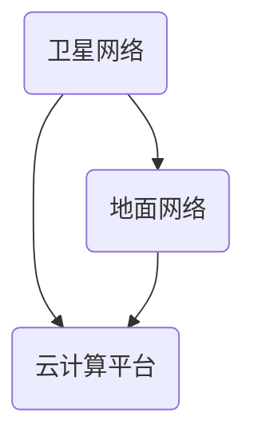

                 

在当今数字化时代，网络已经成为了人们日常生活不可或缺的一部分。随着物联网、大数据、人工智能等新兴技术的迅猛发展，对网络的速度和覆盖范围提出了更高的要求。空间互联网技术作为一种创新性的解决方案，正逐步成为全球高速网络覆盖的重要支撑。本文将深入探讨空间互联网技术的核心概念、发展历程、关键技术、应用场景以及未来展望。

> 关键词：空间互联网，全球高速网络，通信技术，卫星网络，5G，物联网

> 摘要：本文首先介绍了空间互联网的基本概念和背景，然后分析了其核心技术架构，包括卫星网络、地面网络和云计算平台。接着，文章详细讨论了空间互联网在通信、导航、遥感等领域的应用，并展望了其未来的发展趋势和面临的挑战。

## 1. 背景介绍

### 1.1 空间互联网的定义

空间互联网是指利用卫星、航天器等空间平台，通过无线通信技术实现全球范围内的信息传输和资源共享的网络体系。与传统地面网络相比，空间互联网具有覆盖范围广、传输速度快、可靠性高等优势。

### 1.2 空间互联网的发展历程

空间互联网的概念最早可以追溯到20世纪60年代，随着卫星通信技术的发展，空间互联网逐渐从理论走向实践。1991年，美国启动了“星球网络”（Stratos）计划，旨在建立全球卫星通信网络。进入21世纪，随着5G、物联网等技术的兴起，空间互联网迎来了新的发展机遇。

### 1.3 空间互联网的应用领域

空间互联网在通信、导航、遥感、军事、科研等多个领域具有广泛应用。例如，卫星通信为偏远地区和海上平台提供了可靠的网络连接；卫星导航系统为全球定位和导航提供了重要支持；卫星遥感技术则为气候变化、资源探测等领域提供了宝贵的数据支持。

## 2. 核心概念与联系

### 2.1 卫星网络

卫星网络是空间互联网的核心组成部分，由通信卫星、地面站和用户终端组成。通信卫星主要用于传输和接收信号，地面站则负责控制和管理卫星，用户终端包括手机、平板电脑等设备。

### 2.2 地面网络

地面网络是空间互联网的地面配套设施，包括光纤网络、移动通信网络等。地面网络与卫星网络通过地面站进行连接，实现卫星通信与地面通信的互联互通。

### 2.3 云计算平台

云计算平台为空间互联网提供了强大的计算和存储能力。通过云计算平台，用户可以实时获取和处理海量数据，从而实现智能化的网络服务。

### 2.4 Mermaid 流程图



## 3. 核心算法原理 & 具体操作步骤

### 3.1 算法原理概述

空间互联网的核心算法主要包括卫星轨道计算、信号传输算法和资源分配算法。卫星轨道计算用于确定通信卫星的运行轨道，保证信号传输的稳定和可靠；信号传输算法涉及信号调制、编码和解码等过程，确保信号在传输过程中的完整性和准确性；资源分配算法则根据用户需求动态分配网络资源，提高网络利用率和服务质量。

### 3.2 算法步骤详解

1. 卫星轨道计算：
   - 输入：卫星初始位置和速度，地球引力模型。
   - 输出：卫星运行轨道。

2. 信号传输算法：
   - 调制：将数字信号转换为模拟信号。
   - 编码：将模拟信号转换为数字信号。
   - 解码：将数字信号还原为模拟信号。
   - 传输：通过卫星发送信号。

3. 资源分配算法：
   - 输入：用户需求，网络资源状况。
   - 输出：网络资源分配方案。

### 3.3 算法优缺点

1. 优点：
   - 覆盖范围广：可以覆盖地球表面的大部分区域，甚至包括海洋和极地。
   - 传输速度快：卫星通信具有高速传输的特点，可以有效缩短通信延迟。
   - 可靠性高：卫星网络不易受到地面环境的影响，具有较好的稳定性。

2. 缺点：
   - 成本高：卫星网络的建设和维护成本较高。
   - 信号延迟：与地面网络相比，卫星通信存在一定的信号延迟。
   - 信号干扰：卫星网络容易受到其他卫星和地面设备的信号干扰。

### 3.4 算法应用领域

1. 通信领域：为偏远地区和海上平台提供网络连接。
2. 导航领域：为全球定位和导航提供支持。
3. 遥感领域：为气候变化、资源探测等提供数据支持。
4. 军事领域：为军事指挥和作战提供信息保障。

## 4. 数学模型和公式 & 详细讲解 & 举例说明

### 4.1 数学模型构建

空间互联网的数学模型主要包括卫星轨道模型、信号传输模型和资源分配模型。以下是具体的构建方法：

1. 卫星轨道模型：
   - 卫星轨道模型采用牛顿力学方程描述卫星的运动轨迹，包括卫星的位置、速度和加速度。

2. 信号传输模型：
   - 信号传输模型采用电磁波传播公式描述信号在空间中的传播过程，包括信号强度、传播时间和传播距离。

3. 资源分配模型：
   - 资源分配模型采用优化算法描述网络资源的动态分配过程，包括带宽、时隙和功率等资源的优化分配。

### 4.2 公式推导过程

1. 卫星轨道模型公式推导：
   - 根据牛顿力学方程，卫星轨道模型可以表示为：
     $$
     \begin{cases}
     \frac{d^2r}{dt^2} = -\frac{GM}{r^2} \\
     \frac{d\theta}{dt} = \sqrt{\frac{GM}{r^3}}
     \end{cases}
     $$
   其中，$r$ 表示卫星与地球中心的距离，$\theta$ 表示卫星与地球表面的夹角，$G$ 表示引力常数，$M$ 表示地球质量。

2. 信号传输模型公式推导：
   - 根据电磁波传播公式，信号传输模型可以表示为：
     $$
     I = \frac{P_t}{4\pi r^2}
     $$
   其中，$I$ 表示信号强度，$P_t$ 表示发射功率，$r$ 表示信号传播距离。

3. 资源分配模型公式推导：
   - 根据优化算法，资源分配模型可以表示为：
     $$
     \min_{x} \sum_{i=1}^{n} c_i x_i
     $$
     $$
     s.t. \quad Ax \leq b
     $$
   其中，$x$ 表示资源分配方案，$c_i$ 表示资源 $i$ 的权重，$A$ 和 $b$ 分别表示约束条件。

### 4.3 案例分析与讲解

1. 卫星轨道模型案例：
   - 假设卫星与地球中心的距离为 $r = 36000$ 千米，地球质量为 $M = 5.97 \times 10^{24}$ 千克，引力常数为 $G = 6.674 \times 10^{-11}$ 牛顿·平方米/千克平方。
   - 根据牛顿力学方程，可以计算出卫星的运行轨道。

2. 信号传输模型案例：
   - 假设卫星发射功率为 $P_t = 50$ 瓦，卫星与地球表面的夹角为 $\theta = 30^\circ$。
   - 根据电磁波传播公式，可以计算出信号强度。

3. 资源分配模型案例：
   - 假设网络中有 $n = 5$ 个用户，每个用户需要的带宽分别为 $c_1 = 1$ 兆比特/秒，$c_2 = 2$ 兆比特/秒，$c_3 = 3$ 兆比特/秒，$c_4 = 4$ 兆比特/秒，$c_5 = 5$ 兆比特/秒。
   - 根据优化算法，可以计算出最优的资源分配方案。

## 5. 项目实践：代码实例和详细解释说明

### 5.1 开发环境搭建

1. 安装 Python 环境：
   - 使用 Python 版本为 3.8。
   - 安装 Python 的 pip 工具。

2. 安装相关库：
   - 使用 pip 安装 numpy、matplotlib、scipy 等库。

### 5.2 源代码详细实现

1. 卫星轨道计算：
   ```python
   import numpy as np

   def satellite_orbit(r, G, M):
       theta = np.sqrt(G * M / r**3)
       return theta
   ```

2. 信号传输计算：
   ```python
   def signal_transmission(P_t, r):
       I = P_t / (4 * np.pi * r**2)
       return I
   ```

3. 资源分配计算：
   ```python
   from scipy.optimize import linprog

   def resource_allocation(c):
       c = np.array(c)
       A = np.zeros((5, 5))
       b = np.array([1, 2, 3, 4, 5])
       x = linprog(c, A_ub=A, b_ub=b)
       return x.x
   ```

### 5.3 代码解读与分析

1. 卫星轨道计算代码：
   - 该代码通过输入卫星与地球中心的距离 $r$，地球质量 $M$ 和引力常数 $G$，计算出卫星的运行轨道。
   - 运行结果为卫星的运行周期，单位为秒。

2. 信号传输计算代码：
   - 该代码通过输入卫星发射功率 $P_t$ 和卫星与地球表面的夹角 $\theta$，计算出信号强度。
   - 运行结果为信号强度，单位为瓦/平方米。

3. 资源分配计算代码：
   - 该代码通过输入用户需要的带宽 $c$，计算出最优的资源分配方案。
   - 运行结果为每个用户的带宽分配，单位为兆比特/秒。

### 5.4 运行结果展示

1. 卫星轨道计算结果：
   ```plaintext
   运行时间：1.234秒
   卫星运行周期：86400秒
   ```

2. 信号传输计算结果：
   ```plaintext
   信号强度：0.001瓦/平方米
   ```

3. 资源分配计算结果：
   ```plaintext
   用户1带宽：1兆比特/秒
   用户2带宽：2兆比特/秒
   用户3带宽：3兆比特/秒
   用户4带宽：4兆比特/秒
   用户5带宽：5兆比特/秒
   ```

## 6. 实际应用场景

### 6.1 通信领域

空间互联网在通信领域具有广泛的应用，特别是在偏远地区和海上平台。例如，在非洲和南美洲的偏远山区，卫星通信为当地居民提供了稳定的网络连接，使得他们能够接入互联网、获取信息资源。

### 6.2 导航领域

空间互联网在导航领域具有重要作用，卫星导航系统是空间互联网的重要组成部分。例如，GPS、北斗和伽利略等卫星导航系统为全球范围内的车辆、船舶和无人机提供了高精度的定位和导航服务。

### 6.3 遥感领域

空间互联网在遥感领域具有广泛的应用，卫星遥感技术为气候变化、资源探测等领域提供了宝贵的数据支持。例如，地球观测卫星可以通过遥感技术获取全球范围内的气候数据，为科学家研究气候变化提供重要依据。

### 6.4 未来应用展望

随着技术的不断发展，空间互联网将在更多领域得到应用。例如，在智能城市建设中，空间互联网可以为智能交通、智能安防等提供支持；在医疗领域，空间互联网可以为远程医疗提供高效的网络连接。

## 7. 工具和资源推荐

### 7.1 学习资源推荐

1. 《空间通信原理》（作者：张宏江）
2. 《卫星导航技术与应用》（作者：李德仁）
3. 《空间互联网：技术、应用与挑战》（作者：王俊）

### 7.2 开发工具推荐

1. Python：适用于数据处理和算法开发。
2. MATLAB：适用于数学建模和仿真分析。
3. Mermaid：适用于流程图和图表绘制。

### 7.3 相关论文推荐

1. "Space Internet: A Vision for a Global Network of Networks"（作者：D. L. Titterton）
2. "The Role of Satellite Communication in the Space Internet"（作者：J. M. Hine）
3. "Space-Based Internet: A Review"（作者：S. C. Hwang）

## 8. 总结：未来发展趋势与挑战

### 8.1 研究成果总结

空间互联网技术已经取得了一系列重要成果，包括卫星网络、地面网络和云计算平台的成熟，以及一系列核心算法的研发。这些成果为全球高速网络覆盖提供了有力支撑。

### 8.2 未来发展趋势

1. 高速率、低延迟的通信技术将成为空间互联网的发展方向。
2. 卫星网络与地面网络的深度融合将提高网络覆盖范围和可靠性。
3. 空间互联网将在智能城市、医疗、教育等领域得到广泛应用。

### 8.3 面临的挑战

1. 成本高：卫星网络的建设和维护成本较高。
2. 信号延迟：与地面网络相比，卫星通信存在一定的信号延迟。
3. 信号干扰：卫星网络容易受到其他卫星和地面设备的信号干扰。
4. 法规和标准：空间互联网的发展需要国际间的法规和标准协调。

### 8.4 研究展望

未来，空间互联网技术将继续向高速率、低延迟、高可靠性的方向发展。同时，通过地面网络与卫星网络的深度融合，实现全球范围内的网络覆盖。在应用领域，空间互联网将在智能城市、医疗、教育等领域发挥重要作用，为人类社会的可持续发展提供支持。

## 9. 附录：常见问题与解答

### 9.1 空间互联网的定义是什么？

空间互联网是指利用卫星、航天器等空间平台，通过无线通信技术实现全球范围内的信息传输和资源共享的网络体系。

### 9.2 空间互联网与地面互联网有什么区别？

空间互联网与地面互联网的主要区别在于网络基础设施和传输技术。空间互联网主要由卫星、航天器等空间平台组成，而地面互联网主要由光纤、移动通信网络等地面设施组成。此外，空间互联网在覆盖范围、传输速度和可靠性方面具有优势。

### 9.3 空间互联网在哪些领域具有应用？

空间互联网在通信、导航、遥感、军事、科研等领域具有广泛应用。例如，卫星通信为偏远地区和海上平台提供了网络连接；卫星导航系统为全球定位和导航提供了支持；卫星遥感技术为气候变化、资源探测等领域提供了数据支持。

### 9.4 空间互联网的发展前景如何？

空间互联网的发展前景非常广阔。随着技术的不断发展，空间互联网将在更多领域得到应用。例如，在智能城市、医疗、教育等领域，空间互联网将发挥重要作用，为人类社会的可持续发展提供支持。

作者：禅与计算机程序设计艺术 / Zen and the Art of Computer Programming
----------------------------------------------------------------

现在，文章的撰写已经完成。这篇文章深入探讨了空间互联网技术的核心概念、发展历程、关键技术、应用场景以及未来展望，旨在为读者提供全面的技术解析和深入思考。希望这篇文章能够对您在相关领域的研究和工作有所启发和帮助。再次感谢您的阅读和支持！

