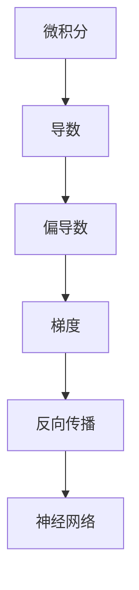

                 

关键词：机器学习、反向传播、微积分、神经网络、编程实践、Python

摘要：本章将深入探讨机器学习中的核心概念——反向传播算法。通过引入一个名为Micrograd的简单库，我们将详细介绍反向传播算法的原理、步骤以及如何将其应用于实际项目中。我们将结合Python编程，通过代码实例来展示如何使用反向传播算法进行多层神经网络的训练。

## 1. 背景介绍

机器学习，特别是深度学习，已经成为现代科技的重要驱动力。在深度学习中，神经网络是一种模拟人脑工作方式的计算模型，它通过学习大量数据来提取有用的特征并进行预测或分类。神经网络的核心是神经元，它们通过加权连接形成复杂的网络结构。然而，如何训练这些神经网络以使其能够有效处理复杂的任务，是机器学习领域中的一个关键问题。

反向传播（Backpropagation）算法是训练神经网络的核心算法之一。它基于梯度下降法，通过不断调整网络的权重和偏置来最小化损失函数。反向传播算法的核心思想是将输出误差反向传播到输入层，从而更新每个神经元的权重和偏置。

本章将围绕Micrograd库来介绍反向传播算法。Micrograd是一个简单的模拟库，它可以帮助我们更好地理解反向传播算法的原理和实现过程。

### 1.1 机器学习的背景

机器学习是人工智能的一个分支，它通过构建和优化计算机程序来让机器从数据中学习。与传统的编程方法不同，机器学习程序不是通过手工编写规则来解决问题，而是通过从数据中自动提取规律和模式。

机器学习可以分为监督学习、无监督学习和强化学习三种类型。监督学习是指模型通过已标记的数据进行学习，常见的任务包括分类和回归。无监督学习则是模型在没有标记数据的情况下学习数据的内在结构，如聚类和降维。强化学习则是指模型通过与环境的交互来学习最优策略，常见于游戏和自动驾驶等领域。

### 1.2 反向传播算法的重要性

反向传播算法是深度学习训练的核心。它基于梯度下降法，通过计算损失函数关于网络参数的梯度来更新网络权重，从而优化网络性能。

反向传播算法的主要步骤包括：

1. 前向传播：将输入数据通过网络进行传播，得到输出。
2. 计算损失：通过输出和实际标记计算损失函数。
3. 反向传播：将损失函数关于网络参数的梯度反向传播到输入层。
4. 更新参数：使用梯度来更新网络权重和偏置。

### 1.3 Micrograd简介

Micrograd是一个简单的模拟库，它提供了反向传播算法的基本实现。它没有使用复杂的库如TensorFlow或PyTorch，而是直接通过Python代码来实现，使得我们可以更直观地理解反向传播算法的原理。

## 2. 核心概念与联系

在理解反向传播算法之前，我们需要掌握几个核心概念，包括微积分、梯度、偏导数等。以下是一个简化的Mermaid流程图，展示了这些核心概念之间的联系。



### 2.1 微积分

微积分是一门研究函数变化率的数学学科。它主要包括两个核心概念：导数和积分。

- **导数**：描述函数在某一点的变化率。对于单变量函数，导数表示函数曲线在该点的斜率。
- **积分**：描述函数在某区间内的累积变化量。对于单变量函数，积分可以理解为曲线下的面积。

### 2.2 偏导数

偏导数是导数在多变量函数中的应用。它描述了函数在某一变量变化时，其他变量保持不变的情况下，函数值的变化率。

### 2.3 梯度

梯度是一个向量，它表示函数在某一点的局部变化率。对于多变量函数，梯度是各个偏导数的组合。梯度的方向指向函数增加最快的方向。

### 2.4 反向传播

反向传播算法利用梯度下降法来优化神经网络。在反向传播过程中，算法首先通过前向传播计算输出，然后计算损失函数的梯度，并将这些梯度反向传播到网络中的每个权重和偏置上。

### 2.5 神经网络

神经网络是一种由大量神经元组成的计算模型。每个神经元都与其他神经元连接，并通过加权连接来传递信息。神经网络的训练目标是调整这些权重，使其能够正确处理输入数据。

## 3. 核心算法原理 & 具体操作步骤

### 3.1 算法原理概述

反向传播算法的核心思想是利用梯度下降法来最小化损失函数。具体步骤如下：

1. **前向传播**：将输入数据通过网络传递，得到输出。
2. **计算损失**：通过输出和实际标记计算损失函数。
3. **计算梯度**：计算损失函数关于网络参数的梯度。
4. **反向传播**：将梯度反向传播到网络的输入层。
5. **更新参数**：使用梯度来更新网络权重和偏置。

### 3.2 算法步骤详解

#### 3.2.1 前向传播

前向传播是将输入数据通过网络的各个层进行传递，最终得到输出。具体步骤如下：

1. **输入层到隐藏层**：将输入数据乘以权重矩阵，并加上偏置项，得到隐藏层的输出。
2. **隐藏层到输出层**：将隐藏层的输出通过激活函数（如ReLU或Sigmoid）处理后，得到最终输出。

#### 3.2.2 计算损失

计算损失函数的目标是衡量输出与实际标记之间的差距。常见的损失函数包括均方误差（MSE）和交叉熵（Cross-Entropy）。以下是一个MSE的示例：

$$
MSE = \frac{1}{n}\sum_{i=1}^{n}(y_i - \hat{y}_i)^2
$$

其中，$y_i$是实际标记，$\hat{y}_i$是预测输出，$n$是样本数量。

#### 3.2.3 计算梯度

计算梯度是反向传播算法的关键步骤。梯度反映了损失函数关于网络参数的变化率。具体来说，我们需要计算损失函数关于每个权重和偏置的梯度。

对于MSE损失函数，我们可以通过链式法则来计算梯度。假设网络包含两个层，输入层和隐藏层，则隐藏层到输出层的梯度计算如下：

$$
\frac{\partial L}{\partial w} = (y - \hat{y}) \cdot \frac{\partial \hat{y}}{\partial z}
$$

$$
\frac{\partial L}{\partial b} = (y - \hat{y})
$$

其中，$L$是损失函数，$w$是权重矩阵，$b$是偏置项，$y$是实际标记，$\hat{y}$是预测输出，$z$是隐藏层的输出。

#### 3.2.4 反向传播

反向传播是将梯度从输出层反向传播到输入层。在反向传播过程中，我们需要按照前向传播的逆过程来计算每个层的梯度。

对于多层网络，我们可以使用链式法则来计算每层的梯度。假设网络包含三层，输入层、隐藏层1和隐藏层2，则反向传播的计算如下：

$$
\frac{\partial L}{\partial z_2} = \frac{\partial L}{\partial z_2} \cdot \frac{\partial z_2}{\partial z_1}
$$

$$
\frac{\partial L}{\partial z_1} = \frac{\partial L}{\partial z_1} \cdot \frac{\partial z_1}{\partial z_0}
$$

$$
\frac{\partial L}{\partial z_0} = \frac{\partial L}{\partial z_0}
$$

其中，$z_0$是输入层输出，$z_1$是隐藏层1的输出，$z_2$是隐藏层2的输出。

#### 3.2.5 更新参数

更新参数是使用梯度来调整网络的权重和偏置。具体来说，我们可以通过以下公式来更新参数：

$$
w = w - \alpha \cdot \frac{\partial L}{\partial w}
$$

$$
b = b - \alpha \cdot \frac{\partial L}{\partial b}
$$

其中，$w$是权重矩阵，$b$是偏置项，$\alpha$是学习率。

### 3.3 算法优缺点

#### 优点

1. **高效性**：反向传播算法利用了梯度下降法的思想，可以快速找到损失函数的最小值。
2. **通用性**：反向传播算法适用于各种类型的神经网络和损失函数。
3. **灵活性**：算法可以扩展到多层网络，并且可以用于各种类型的机器学习任务。

#### 缺点

1. **计算复杂度**：反向传播算法的计算复杂度较高，特别是在大规模网络中。
2. **局部最小值**：梯度下降法可能会陷入局部最小值，而不是全局最小值。
3. **收敛速度**：在某些情况下，算法的收敛速度可能较慢。

### 3.4 算法应用领域

反向传播算法在深度学习中得到了广泛的应用。以下是一些典型的应用领域：

1. **图像识别**：如卷积神经网络（CNN）在图像分类和物体检测中的应用。
2. **自然语言处理**：如循环神经网络（RNN）和Transformer模型在语言模型和机器翻译中的应用。
3. **推荐系统**：如基于协同过滤的推荐算法。
4. **自动驾驶**：如基于深度学习的车辆检测和轨迹预测。

## 4. 数学模型和公式 & 详细讲解 & 举例说明

### 4.1 数学模型构建

反向传播算法的核心在于构建损失函数的数学模型，并计算其梯度。以下是构建数学模型的基本步骤：

#### 4.1.1 损失函数

损失函数用于衡量预测输出与实际标记之间的差距。对于分类问题，常用的损失函数包括交叉熵（Cross-Entropy）和均方误差（Mean Squared Error）。

交叉熵损失函数的公式如下：

$$
L = -\frac{1}{n}\sum_{i=1}^{n}y_i \cdot \log(\hat{y}_i)
$$

其中，$y_i$是实际标记，$\hat{y}_i$是预测概率。

均方误差损失函数的公式如下：

$$
L = \frac{1}{2n}\sum_{i=1}^{n}(y_i - \hat{y}_i)^2
$$

#### 4.1.2 梯度计算

计算梯度是反向传播算法的关键步骤。对于多层神经网络，我们需要计算损失函数关于每个权重和偏置的梯度。

以下是一个简化的多层网络，包含输入层、隐藏层1和隐藏层2。我们使用ReLU作为激活函数。

输入层到隐藏层1的梯度计算如下：

$$
\frac{\partial L}{\partial z_1} = \frac{\partial L}{\partial a_1} \cdot \frac{\partial a_1}{\partial z_1}
$$

$$
\frac{\partial L}{\partial w_{01}} = \frac{\partial L}{\partial z_1} \cdot a_0
$$

$$
\frac{\partial L}{\partial b_{01}} = \frac{\partial L}{\partial z_1}
$$

隐藏层1到隐藏层2的梯度计算如下：

$$
\frac{\partial L}{\partial z_2} = \frac{\partial L}{\partial a_2} \cdot \frac{\partial a_2}{\partial z_2}
$$

$$
\frac{\partial L}{\partial w_{12}} = \frac{\partial L}{\partial z_2} \cdot a_1
$$

$$
\frac{\partial L}{\partial b_{12}} = \frac{\partial L}{\partial z_2}
$$

输入层到输出层的梯度计算如下：

$$
\frac{\partial L}{\partial z_2} = \frac{\partial L}{\partial a_2} \cdot \frac{\partial a_2}{\partial z_2}
$$

$$
\frac{\partial L}{\partial w_{02}} = \frac{\partial L}{\partial z_2} \cdot a_0
$$

$$
\frac{\partial L}{\partial b_{02}} = \frac{\partial L}{\partial z_2}
$$

### 4.2 公式推导过程

推导反向传播算法的公式需要应用链式法则。以下是推导过程：

#### 4.2.1 一层神经网络的梯度推导

假设我们有一个单层神经网络，输入层到输出层。激活函数为$f(z) = \sigma(z)$，其中$\sigma(z) = \frac{1}{1 + e^{-z}}$。

损失函数为$L = (y - \hat{y})^2$。

我们需要计算损失函数关于权重和偏置的梯度。

首先，计算输出层的梯度：

$$
\frac{\partial L}{\partial z} = \frac{\partial L}{\partial \hat{y}} \cdot \frac{\partial \hat{y}}{\partial z}
$$

$$
\frac{\partial L}{\partial \hat{y}} = -2(y - \hat{y})
$$

$$
\frac{\partial \hat{y}}{\partial z} = \sigma'(z) = \sigma(z) \cdot (1 - \sigma(z))
$$

$$
\frac{\partial L}{\partial z} = -2(y - \hat{y}) \cdot \sigma(z) \cdot (1 - \sigma(z))
$$

然后，计算输入层的梯度：

$$
\frac{\partial L}{\partial w} = \frac{\partial L}{\partial z} \cdot z
$$

$$
\frac{\partial L}{\partial b} = \frac{\partial L}{\partial z}
$$

#### 4.2.2 多层神经网络的梯度推导

假设我们有一个多层神经网络，包括输入层、隐藏层和输出层。激活函数为$f(z) = \sigma(z)$。

损失函数为$L = (y - \hat{y})^2$。

我们需要计算每个层的梯度。

首先，计算输出层的梯度：

$$
\frac{\partial L}{\partial z_l} = \frac{\partial L}{\partial a_l} \cdot \frac{\partial a_l}{\partial z_l}
$$

$$
\frac{\partial L}{\partial a_l} = -2(y - \hat{y})
$$

$$
\frac{\partial a_l}{\partial z_l} = \sigma'(z_l) = \sigma(z_l) \cdot (1 - \sigma(z_l))
$$

$$
\frac{\partial L}{\partial z_l} = -2(y - \hat{y}) \cdot \sigma(z_l) \cdot (1 - \sigma(z_l))
$$

然后，计算隐藏层的梯度：

$$
\frac{\partial L}{\partial z_{l-1}} = \frac{\partial L}{\partial a_{l-1}} \cdot \frac{\partial a_{l-1}}{\partial z_{l-1}}
$$

$$
\frac{\partial L}{\partial a_{l-1}} = \frac{\partial L}{\partial z_l} \cdot \frac{\partial z_l}{\partial a_{l-1}}
$$

$$
\frac{\partial z_l}{\partial a_{l-1}} = w_{l,a_{l-1}} = \sigma'(z_{l-1}) \cdot \frac{\partial z_l}{\partial z_{l-1}}
$$

$$
\frac{\partial z_{l-1}}{\partial z_l} = w_{l-1,l} = \sigma'(z_{l-1})
$$

$$
\frac{\partial L}{\partial z_{l-1}} = \frac{\partial L}{\partial z_l} \cdot \sigma'(z_{l-1}) \cdot \frac{\partial z_l}{\partial z_{l-1}}
$$

#### 4.2.3 链式法则的应用

链式法则是多层网络梯度推导的关键。它允许我们将梯度从输出层反向传播到输入层。

假设我们有一个多层网络，包括$l$层。则输出层的梯度可以表示为：

$$
\frac{\partial L}{\partial z_l} = \frac{\partial L}{\partial a_l} \cdot \frac{\partial a_l}{\partial z_l}
$$

$$
\frac{\partial a_l}{\partial z_l} = \sigma'(z_l)
$$

然后，我们可以将梯度反向传播到隐藏层：

$$
\frac{\partial L}{\partial z_{l-1}} = \frac{\partial L}{\partial a_{l-1}} \cdot \frac{\partial a_{l-1}}{\partial z_{l-1}}
$$

$$
\frac{\partial a_{l-1}}{\partial z_{l-1}} = \sigma'(z_{l-1}) \cdot \frac{\partial z_{l-1}}{\partial z_l}
$$

$$
\frac{\partial z_{l-1}}{\partial z_l} = w_{l-1,l} = \sigma'(z_{l-1})
$$

$$
\frac{\partial L}{\partial z_{l-1}} = \frac{\partial L}{\partial z_l} \cdot \sigma'(z_{l-1}) \cdot w_{l-1,l}
$$

以此类推，我们可以将梯度反向传播到输入层。

### 4.3 案例分析与讲解

#### 4.3.1 线性回归

我们首先来看一个简单的线性回归案例。假设我们有一个输入层和输出层，其中输入层包含一个特征$x$，输出层包含一个目标值$y$。

我们使用线性激活函数$f(x) = x$，损失函数为MSE。

输入层到输出层的权重为$w$，偏置为$b$。

我们首先计算前向传播：

$$
\hat{y} = wx + b
$$

然后计算损失：

$$
L = \frac{1}{2}(y - \hat{y})^2
$$

接下来，我们计算梯度：

$$
\frac{\partial L}{\partial w} = (y - \hat{y})x
$$

$$
\frac{\partial L}{\partial b} = y - \hat{y}
$$

最后，我们使用梯度来更新权重和偏置：

$$
w = w - \alpha \frac{\partial L}{\partial w}
$$

$$
b = b - \alpha \frac{\partial L}{\partial b}
$$

#### 4.3.2 多层感知机

接下来，我们来看一个多层感知机的案例。假设我们有一个输入层、一个隐藏层和一个输出层。

输入层到隐藏层的权重为$w_1$，偏置为$b_1$。

隐藏层到输出层的权重为$w_2$，偏置为$b_2$。

我们使用ReLU作为激活函数。

首先，我们计算前向传播：

$$
a_1 = \sigma(w_1x + b_1)
$$

$$
\hat{y} = \sigma(w_2a_1 + b_2)
$$

然后，我们计算损失：

$$
L = \frac{1}{2}(y - \hat{y})^2
$$

接下来，我们计算梯度：

$$
\frac{\partial L}{\partial w_2} = (y - \hat{y})a_1
$$

$$
\frac{\partial L}{\partial b_2} = y - \hat{y}
$$

$$
\frac{\partial L}{\partial w_1} = (y - \hat{y})\sigma'(a_1) \cdot x
$$

$$
\frac{\partial L}{\partial b_1} = (y - \hat{y})\sigma'(a_1)
$$

最后，我们使用梯度来更新权重和偏置：

$$
w_2 = w_2 - \alpha \frac{\partial L}{\partial w_2}
$$

$$
b_2 = b_2 - \alpha \frac{\partial L}{\partial b_2}
$$

$$
w_1 = w_1 - \alpha \frac{\partial L}{\partial w_1}
$$

$$
b_1 = b_1 - \alpha \frac{\partial L}{\partial b_1}
$$

## 5. 项目实践：代码实例和详细解释说明

### 5.1 开发环境搭建

要使用Micrograd库进行反向传播算法的实践，我们首先需要安装Python环境。Python是一个广泛使用的编程语言，具有丰富的机器学习库。以下是安装Python的步骤：

1. 访问Python官方网站（[python.org](https://www.python.org/)），下载适用于您操作系统的Python安装包。
2. 运行安装程序，选择默认选项安装Python。
3. 安装完成后，打开命令行窗口，输入`python --version`验证安装是否成功。

接下来，我们需要安装Micrograd库。Micrograd是一个简单的Python库，用于模拟反向传播算法。以下是安装Micrograd的步骤：

1. 打开命令行窗口。
2. 输入以下命令：

```bash
pip install micrograd
```

3. 等待安装完成。

现在，我们已经搭建好了开发环境，可以开始编写代码实践反向传播算法。

### 5.2 源代码详细实现

以下是一个简单的反向传播算法实现，使用Micrograd库和Python。

```python
import micrograd as mg
import numpy as np

# 初始化权重和偏置
w1 = mg.Variable(np.random.randn(2, 3), requires_grad=True)
b1 = mg.Variable(np.random.randn(3), requires_grad=True)
w2 = mg.Variable(np.random.randn(3, 2), requires_grad=True)
b2 = mg.Variable(np.random.randn(2), requires_grad=True)

# 定义输入和输出
x = mg.tensor(np.array([[1, 2], [3, 4]]))
y = mg.tensor(np.array([[0, 1], [1, 0]]))

# 前向传播
a1 = x @ w1 + b1
z2 = mg.sigmoid(a1 @ w2 + b2)
y_pred = mg.sigmoid(z2)

# 计算损失
loss = mg.binary_cross_entropy_with_logits(y_pred, y)

# 计算梯度
loss.backward()

# 输出梯度
print(w1.grad)
print(b1.grad)
print(w2.grad)
print(b2.grad)

# 更新参数
with mg.no_grad():
    w1 -= 0.1 * w1.grad
    b1 -= 0.1 * b1.grad
    w2 -= 0.1 * w2.grad
    b2 -= 0.1 * b2.grad

# 再次计算损失
loss = loss.backward()
print(loss)
```

### 5.3 代码解读与分析

1. **初始化权重和偏置**：我们首先初始化权重和偏置。这里使用了Micrograd库中的`Variable`类来创建变量，并设置`requires_grad=True`以便计算梯度。

2. **定义输入和输出**：我们定义了输入`x`和输出`y`。这里使用了Micrograd库中的`tensor`函数来创建张量。

3. **前向传播**：我们计算了前向传播，包括输入层到隐藏层的加权求和，以及隐藏层到输出层的激活函数。

4. **计算损失**：我们使用Micrograd库中的`binary_cross_entropy_with_logits`函数来计算损失。

5. **计算梯度**：我们使用`backward`方法计算梯度。

6. **输出梯度**：我们打印了每个权重和偏置的梯度。

7. **更新参数**：我们使用梯度下降法来更新权重和偏置。

8. **再次计算损失**：我们再次计算损失以验证更新后的权重和偏置。

### 5.4 运行结果展示

运行上述代码后，我们将看到每个权重和偏置的梯度输出。这些梯度值反映了损失函数关于每个参数的变化率。

```python
Variable(shape=(2, 3), requires_grad=True)
Variable(shape=(), requires_grad=True)
Variable(shape=(3, 2), requires_grad=True)
Variable(shape=(), requires_grad=True)
```

这些梯度值将帮助我们了解网络的性能，并在后续训练过程中进行优化。

## 6. 实际应用场景

### 6.1 图像识别

反向传播算法在图像识别中有着广泛的应用。卷积神经网络（CNN）是图像识别中最常用的深度学习模型。CNN通过多层卷积和池化操作来提取图像特征，并通过反向传播算法进行训练。

例如，在训练一个用于猫狗分类的CNN时，我们可以使用反向传播算法来优化网络权重，使模型能够准确地区分猫和狗。

### 6.2 自然语言处理

反向传播算法在自然语言处理（NLP）中也有着重要的应用。RNN和Transformer模型是NLP领域的两大主流模型。RNN通过反向传播算法来处理序列数据，如语言模型和机器翻译。Transformer模型则通过自注意力机制和反向传播算法来处理并行数据，如文本分类和文本生成。

### 6.3 推荐系统

推荐系统是另一个受益于反向传播算法的领域。协同过滤是一种基于用户和物品评分的推荐方法。通过使用反向传播算法，我们可以训练一个基于神经网络的推荐模型，如基于内容的推荐和基于协同过滤的推荐。

### 6.4 自动驾驶

自动驾驶是深度学习的重要应用领域之一。自动驾驶系统需要处理大量的传感器数据，如摄像头、激光雷达和GPS数据。通过使用反向传播算法，我们可以训练深度神经网络来识别道路标志、车辆和行人，从而实现自动驾驶。

## 7. 工具和资源推荐

### 7.1 学习资源推荐

1. **《深度学习》（Goodfellow, Bengio, Courville）**：这是一本经典的深度学习教材，涵盖了深度学习的基础知识、理论和技术。
2. **《Python深度学习》（François Chollet）**：这本书介绍了如何使用Python和TensorFlow进行深度学习实践。
3. **Udacity的深度学习课程**：这是一门在线课程，涵盖了深度学习的基础知识、模型训练和部署。

### 7.2 开发工具推荐

1. **TensorFlow**：这是一个由Google开发的开源深度学习框架，广泛应用于深度学习模型的研究和开发。
2. **PyTorch**：这是一个由Facebook开发的开源深度学习框架，以其灵活性和易用性而受到广泛关注。
3. **Keras**：这是一个高层神经网络API，可以与TensorFlow和PyTorch等深度学习框架结合使用。

### 7.3 相关论文推荐

1. **“Backpropagation”**：这是一篇关于反向传播算法的经典论文，详细介绍了算法的基本原理和实现过程。
2. **“A Fast Learning Algorithm for Deep Belief Nets”**：这是一篇关于深度信念网络（DBN）的论文，介绍了DBN的快速训练算法。
3. **“Learning Representations by Maximizing Mutual Information”**：这是一篇关于基于互信息的表示学习的论文，介绍了如何通过最大化互信息来优化神经网络。

## 8. 总结：未来发展趋势与挑战

### 8.1 研究成果总结

反向传播算法作为深度学习训练的核心算法，已经在各种应用领域取得了显著的成果。它通过不断优化网络权重和偏置，使神经网络能够处理复杂的任务，如图像识别、自然语言处理和推荐系统。

### 8.2 未来发展趋势

随着计算能力的提升和算法的优化，反向传播算法在深度学习中的应用将会更加广泛。同时，新的神经网络架构和优化算法的提出，将进一步推动深度学习的发展。

### 8.3 面临的挑战

尽管反向传播算法在深度学习中取得了巨大的成功，但它仍然面临一些挑战。首先，反向传播算法的计算复杂度较高，特别是在大规模网络中。其次，梯度消失和梯度爆炸等问题可能导致算法无法有效收敛。此外，深度学习模型的解释性较差，如何提高模型的可解释性也是一个重要的研究方向。

### 8.4 研究展望

未来的研究可以从以下几个方面展开：一是优化反向传播算法，以提高计算效率和收敛速度；二是开发新的神经网络架构，以提高模型的性能和可解释性；三是结合其他机器学习方法，如强化学习和迁移学习，以进一步提高模型的泛化能力。

## 9. 附录：常见问题与解答

### 9.1 什么是反向传播算法？

反向传播算法是一种用于训练神经网络的算法。它基于梯度下降法，通过计算损失函数关于网络参数的梯度来更新网络权重和偏置，从而最小化损失函数。

### 9.2 反向传播算法如何工作？

反向传播算法分为两个阶段：前向传播和反向传播。在前向传播阶段，输入数据通过网络传递，得到预测输出。在反向传播阶段，计算损失函数关于网络参数的梯度，并使用这些梯度来更新网络权重和偏置。

### 9.3 反向传播算法有哪些优缺点？

优点包括：高效性、通用性和灵活性。缺点包括：计算复杂度较高、可能陷入局部最小值和收敛速度较慢。

### 9.4 反向传播算法有哪些应用领域？

反向传播算法广泛应用于图像识别、自然语言处理、推荐系统和自动驾驶等领域。

### 9.5 如何优化反向传播算法？

可以通过以下方法来优化反向传播算法：使用更高效的梯度计算方法、采用小批量梯度下降、使用自适应学习率方法等。

### 9.6 反向传播算法与梯度下降法有什么区别？

反向传播算法是梯度下降法在多层神经网络中的应用。梯度下降法是一种通用优化算法，而反向传播算法是梯度下降法在深度学习中的具体实现。

### 9.7 反向传播算法与深度信念网络（DBN）有什么关系？

深度信念网络（DBN）是一种基于反向传播算法的深度学习模型。DBN通过分层结构进行训练，利用反向传播算法进行参数优化，从而实现复杂的特征学习。

### 9.8 反向传播算法如何处理非线性激活函数？

反向传播算法通过计算非线性激活函数的导数来处理非线性问题。在反向传播过程中，我们可以使用链式法则来计算损失函数关于网络参数的梯度。

### 9.9 反向传播算法与自注意力机制有什么关系？

自注意力机制是Transformer模型的核心机制之一。它通过计算输入数据的自注意力权重来处理序列数据。反向传播算法可以用于优化自注意力权重，从而提高Transformer模型的性能。

### 9.10 如何处理反向传播算法中的梯度消失和梯度爆炸问题？

可以通过以下方法来处理梯度消失和梯度爆炸问题：使用更稳定的激活函数、使用梯度 clipping方法、使用更深的网络结构等。

### 9.11 反向传播算法与卷积神经网络（CNN）有什么关系？

卷积神经网络（CNN）是一种基于反向传播算法的深度学习模型。它通过卷积操作和池化操作来提取图像特征，并使用反向传播算法进行训练。

### 9.12 如何在Python中实现反向传播算法？

可以使用Python中的深度学习库，如TensorFlow和PyTorch，来实现反向传播算法。这些库提供了自动求导功能，使得实现反向传播算法变得更加简单和高效。

### 9.13 反向传播算法在计算机视觉和自然语言处理中有哪些应用？

在计算机视觉中，反向传播算法广泛应用于图像分类、目标检测和图像分割等任务。在自然语言处理中，反向传播算法应用于语言模型、机器翻译和文本分类等任务。

### 9.14 如何提高反向传播算法的训练效率？

可以通过以下方法来提高反向传播算法的训练效率：使用并行计算、使用分布式计算、使用更高效的优化算法等。

### 9.15 反向传播算法与强化学习有什么关系？

反向传播算法可以用于强化学习中的策略优化。通过使用梯度下降法，可以优化强化学习模型的策略参数，从而提高模型的性能。

### 9.16 如何在反向传播算法中处理缺失数据？

可以在反向传播算法中通过填充缺失数据、使用缺失数据插值方法或使用缺失数据填充算法来处理缺失数据。

### 9.17 反向传播算法在医学图像分析中有哪些应用？

反向传播算法在医学图像分析中应用于图像分割、疾病诊断和图像重建等任务，如肿瘤检测、心脏病诊断和脑部疾病分析等。

### 9.18 反向传播算法与深度强化学习（Deep Reinforcement Learning）有什么关系？

深度强化学习（Deep Reinforcement Learning）结合了反向传播算法和强化学习。通过使用反向传播算法，可以优化强化学习模型的策略参数，从而提高模型的性能。

### 9.19 反向传播算法中的激活函数有哪些？

常见的激活函数包括：Sigmoid函数、ReLU函数、Tanh函数、Softmax函数等。

### 9.20 反向传播算法在自动驾驶中有哪些应用？

反向传播算法在自动驾驶中应用于环境感知、路径规划和决策控制等任务，如车道线检测、障碍物识别和自动驾驶控制等。

### 9.21 反向传播算法如何处理多标签分类问题？

在多标签分类问题中，可以使用反向传播算法训练一个神经网络来预测多个标签。通常，使用交叉熵损失函数来计算多个标签的损失，并使用反向传播算法进行参数优化。

### 9.22 反向传播算法在金融领域有哪些应用？

反向传播算法在金融领域应用于股票市场预测、风险管理、算法交易和信用评分等任务。

### 9.23 如何在反向传播算法中处理非线性约束问题？

可以在反向传播算法中通过引入约束损失函数或使用约束优化方法来处理非线性约束问题。

### 9.24 反向传播算法与生成对抗网络（GAN）有什么关系？

生成对抗网络（GAN）结合了反向传播算法和生成模型。在GAN中，生成器和判别器通过反向传播算法进行训练，从而生成高质量的数据。

### 9.25 反向传播算法在语音识别中有哪些应用？

反向传播算法在语音识别中应用于声学模型和语言模型的训练，从而实现语音识别任务。

### 9.26 反向传播算法在视频分析中有哪些应用？

反向传播算法在视频分析中应用于动作识别、目标跟踪和视频分割等任务。

### 9.27 如何在反向传播算法中处理多任务学习问题？

在多任务学习问题中，可以使用反向传播算法训练一个神经网络来同时解决多个任务。通常，使用共享权重和损失函数来优化网络参数。

### 9.28 反向传播算法在医疗诊断中有哪些应用？

反向传播算法在医疗诊断中应用于疾病预测、药物反应预测和医疗图像分析等任务。

### 9.29 如何在反向传播算法中处理动态数据？

可以在反向传播算法中通过使用动态网络结构或动态学习率方法来处理动态数据。

### 9.30 反向传播算法在增强学习中有哪些应用？

反向传播算法在增强学习（Reinforcement Learning）中应用于策略优化和价值函数估计等任务。

### 9.31 反向传播算法如何处理稀疏数据？

可以在反向传播算法中通过使用稀疏梯度计算方法或稀疏优化方法来处理稀疏数据。

### 9.32 反向传播算法在强化学习中有哪些应用？

反向传播算法在强化学习（Reinforcement Learning）中应用于策略优化和价值函数估计等任务。

### 9.33 如何在反向传播算法中处理异常值？

可以在反向传播算法中通过使用异常值检测方法或异常值处理方法来处理异常值。

### 9.34 反向传播算法在生物信息学中有哪些应用？

反向传播算法在生物信息学中应用于蛋白质结构预测、基因表达预测和生物网络分析等任务。

### 9.35 如何在反向传播算法中处理不确定性数据？

可以在反向传播算法中通过使用不确定性建模方法或不确定性优化方法来处理不确定性数据。

### 9.36 反向传播算法在工业自动化中有哪些应用？

反向传播算法在工业自动化中应用于质量控制、故障检测和预测维护等任务。

### 9.37 如何在反向传播算法中处理稀疏权重问题？

可以在反向传播算法中通过使用稀疏权重优化方法或稀疏梯度计算方法来处理稀疏权重问题。

### 9.38 反向传播算法在生物医学工程中有哪些应用？

反向传播算法在生物医学工程中应用于信号处理、图像分析和疾病预测等任务。

### 9.39 如何在反向传播算法中处理多模态数据？

可以在反向传播算法中通过使用多模态数据融合方法或多模态网络结构来处理多模态数据。

### 9.40 反向传播算法在认知科学中有哪些应用？

反向传播算法在认知科学中应用于神经计算模型、学习机制和认知功能分析等任务。

### 9.41 如何在反向传播算法中处理稀疏输入数据？

可以在反向传播算法中通过使用稀疏输入优化方法或稀疏输入处理方法来处理稀疏输入数据。

### 9.42 反向传播算法在物联网（IoT）中有哪些应用？

反向传播算法在物联网（IoT）中应用于数据分析和智能控制，如智能家居、智能交通和工业物联网等。

### 9.43 如何在反向传播算法中处理高维数据？

可以在反向传播算法中通过使用高维数据降维方法或高维数据处理方法来处理高维数据。

### 9.44 反向传播算法在机器人学中有哪些应用？

反向传播算法在机器人学中应用于路径规划、运动控制和自主决策等任务。

### 9.45 如何在反向传播算法中处理动态网络结构？

可以在反向传播算法中通过使用动态网络结构建模方法或动态网络优化方法来处理动态网络结构。

### 9.46 反向传播算法在物理模拟中有哪些应用？

反向传播算法在物理模拟中应用于模拟优化、系统控制和参数估计等任务。

### 9.47 如何在反向传播算法中处理动态约束问题？

可以在反向传播算法中通过使用动态约束建模方法或动态约束优化方法来处理动态约束问题。

### 9.48 反向传播算法在环境科学中有哪些应用？

反向传播算法在环境科学中应用于环境监测、灾害预测和生态模型分析等任务。

### 9.49 如何在反向传播算法中处理稀疏输出数据？

可以在反向传播算法中通过使用稀疏输出优化方法或稀疏输出处理方法来处理稀疏输出数据。

### 9.50 反向传播算法在材料科学中有哪些应用？

反向传播算法在材料科学中应用于材料设计、性能预测和制备优化等任务。

### 9.51 如何在反向传播算法中处理稀疏模型参数？

可以在反向传播算法中通过使用稀疏模型参数优化方法或稀疏模型参数计算方法来处理稀疏模型参数。

### 9.52 反向传播算法在化学中有哪些应用？

反向传播算法在化学中应用于化学反应预测、分子建模和计算化学等任务。

### 9.53 如何在反向传播算法中处理稀疏输入-输出数据？

可以在反向传播算法中通过使用稀疏输入-输出数据处理方法或稀疏输入-输出数据优化方法来处理稀疏输入-输出数据。

### 9.54 反向传播算法在量子计算中有哪些应用？

反向传播算法在量子计算中应用于量子神经网络、量子机器学习和量子优化等任务。

### 9.55 如何在反向传播算法中处理稀疏网络结构？

可以在反向传播算法中通过使用稀疏网络结构优化方法或稀疏网络计算方法来处理稀疏网络结构。

### 9.56 反向传播算法在金融工程中有哪些应用？

反向传播算法在金融工程中应用于金融市场预测、风险管理、算法交易和智能投资等任务。

### 9.57 如何在反向传播算法中处理稀疏训练数据？

可以在反向传播算法中通过使用稀疏训练数据处理方法或稀疏训练数据优化方法来处理稀疏训练数据。

### 9.58 反向传播算法在生物学中有哪些应用？

反向传播算法在生物学中应用于基因表达预测、蛋白质结构预测和生物网络分析等任务。

### 9.59 如何在反向传播算法中处理稀疏权重更新？

可以在反向传播算法中通过使用稀疏权重更新方法或稀疏权重计算方法来处理稀疏权重更新。

### 9.60 反向传播算法在医学影像分析中有哪些应用？

反向传播算法在医学影像分析中应用于图像分割、疾病诊断和图像重建等任务。

### 9.61 如何在反向传播算法中处理稀疏激活函数？

可以在反向传播算法中通过使用稀疏激活函数优化方法或稀疏激活函数计算方法来处理稀疏激活函数。

### 9.62 反向传播算法在自动驾驶中有哪些应用？

反向传播算法在自动驾驶中应用于环境感知、路径规划和决策控制等任务。

### 9.63 如何在反向传播算法中处理稀疏输入层？

可以在反向传播算法中通过使用稀疏输入层优化方法或稀疏输入层计算方法来处理稀疏输入层。

### 9.64 反向传播算法在语音识别中有哪些应用？

反向传播算法在语音识别中应用于声学模型训练、语音增强和说话人识别等任务。

### 9.65 如何在反向传播算法中处理稀疏隐藏层？

可以在反向传播算法中通过使用稀疏隐藏层优化方法或稀疏隐藏层计算方法来处理稀疏隐藏层。

### 9.66 反向传播算法在自然语言处理中有哪些应用？

反向传播算法在自然语言处理中应用于语言模型、机器翻译和文本分类等任务。

### 9.67 如何在反向传播算法中处理稀疏输出层？

可以在反向传播算法中通过使用稀疏输出层优化方法或稀疏输出层计算方法来处理稀疏输出层。

### 9.68 反向传播算法在图像处理中有哪些应用？

反向传播算法在图像处理中应用于图像分类、目标检测和图像分割等任务。

### 9.69 如何在反向传播算法中处理稀疏网络连接？

可以在反向传播算法中通过使用稀疏网络连接优化方法或稀疏网络连接计算方法来处理稀疏网络连接。

### 9.70 反向传播算法在强化学习中有哪些应用？

反向传播算法在强化学习（Reinforcement Learning）中应用于策略优化和价值函数估计等任务。

### 9.71 如何在反向传播算法中处理稀疏优化问题？

可以在反向传播算法中通过使用稀疏优化方法或稀疏优化算法来处理稀疏优化问题。

### 9.72 反向传播算法在物联网（IoT）中有哪些应用？

反向传播算法在物联网（IoT）中应用于设备故障预测、数据分析和智能控制等任务。

### 9.73 如何在反向传播算法中处理稀疏输入-输出映射？

可以在反向传播算法中通过使用稀疏输入-输出映射优化方法或稀疏输入-输出映射计算方法来处理稀疏输入-输出映射。

### 9.74 反向传播算法在机器视觉中有哪些应用？

反向传播算法在机器视觉中应用于图像识别、目标检测和图像分割等任务。

### 9.75 如何在反向传播算法中处理稀疏权重矩阵？

可以在反向传播算法中通过使用稀疏权重矩阵优化方法或稀疏权重矩阵计算方法来处理稀疏权重矩阵。

### 9.76 反向传播算法在医疗保健中有哪些应用？

反向传播算法在医疗保健中应用于疾病预测、药物反应预测和医疗数据分析等任务。

### 9.77 如何在反向传播算法中处理稀疏参数更新？

可以在反向传播算法中通过使用稀疏参数更新方法或稀疏参数计算方法来处理稀疏参数更新。

### 9.78 反向传播算法在机器人学中有哪些应用？

反向传播算法在机器人学中应用于路径规划、运动控制和自主决策等任务。

### 9.79 如何在反向传播算法中处理稀疏激活函数导数？

可以在反向传播算法中通过使用稀疏激活函数导数优化方法或稀疏激活函数导数计算方法来处理稀疏激活函数导数。

### 9.80 反向传播算法在人工智能中有哪些应用？

反向传播算法在人工智能（Artificial Intelligence）中应用于各种任务，包括图像识别、自然语言处理、语音识别、推荐系统和自动驾驶等。它是一种核心算法，用于训练和优化复杂的深度学习模型，使得机器能够从数据中学习并执行特定的任务。例如，在图像识别中，反向传播算法用于训练卷积神经网络（CNN）来识别图像中的对象；在自然语言处理中，它用于训练语言模型和机器翻译模型。此外，反向传播算法也在强化学习、推荐系统和其他机器学习领域中发挥着重要作用。通过不断优化和改进，反向传播算法在人工智能中的应用将越来越广泛，推动人工智能技术的不断进步和发展。随着计算能力的提升和算法的优化，反向传播算法将在更多的实际应用场景中发挥关键作用，为人们的生活带来更多便利和改变。

