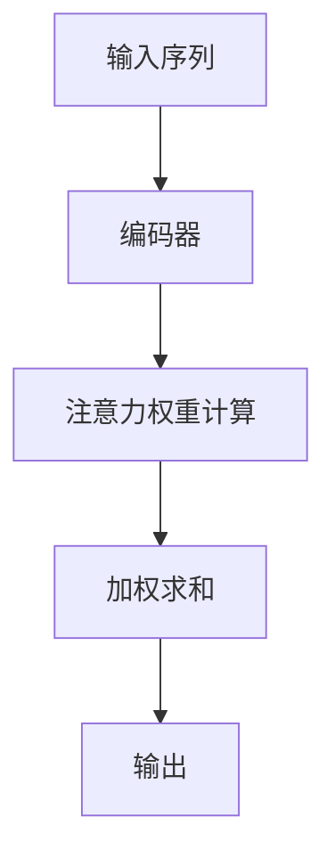
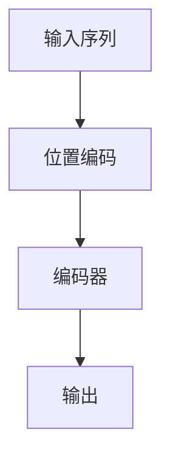
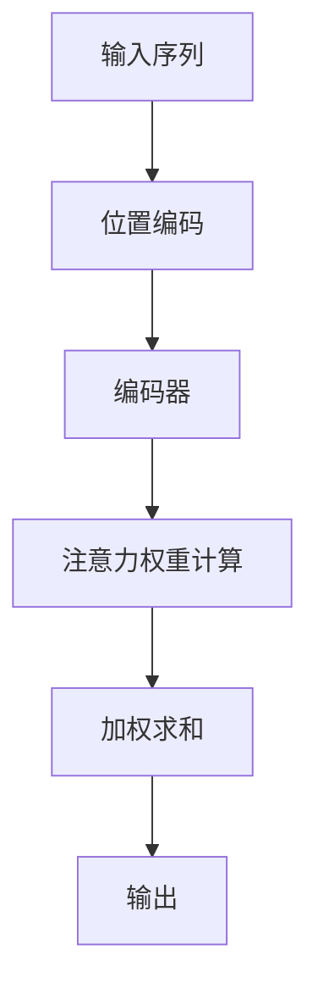

                 

## 1. 背景介绍

注意力机制（Attention Mechanism）是近年来在深度学习和自然语言处理领域崭露头角的重要技术。其核心思想是通过动态地关注输入数据的某些部分，从而提高模型在处理序列数据时的效果。注意力机制的提出，是为了解决传统神经网络在处理长序列数据时，难以捕捉序列中各个部分之间关系的问题。

位置编码（Positional Encoding）则是为了解决序列数据中的位置信息缺失问题。在传统的神经网络中，每个序列的位置信息是被隐含在序列的索引中的，而无法直接体现。而位置编码则是通过一种特定的方式，将序列的位置信息显式地编码到序列中，从而帮助神经网络更好地理解序列的顺序关系。

这两种技术的结合，为序列模型的改进带来了新的思路，也使得诸如机器翻译、文本分类等任务的效果得到了显著的提升。

本文将首先介绍注意力机制和位置编码的基本概念和原理，然后深入探讨其工作原理、数学模型以及具体实现。随后，我们将通过一个简单的项目实例，展示如何在实际中应用注意力机制和位置编码。最后，我们将讨论这些技术在实际应用中的挑战和未来发展方向。

## 2. 核心概念与联系

### 2.1. 注意力机制

注意力机制最初出现在机器翻译领域，其核心思想是让神经网络在处理序列数据时，动态地关注序列中的某些部分。具体来说，注意力机制通过计算一个权重矩阵，将序列中的每个元素与输出关联起来。这个权重矩阵可以根据当前的任务需求动态调整，使得神经网络能够专注于序列中的关键部分。

以下是注意力机制的一个简单的 Mermaid 流程图：



在上图中，输入序列首先通过编码器（如循环神经网络RNN）进行处理，然后计算注意力权重，最后进行加权求和得到输出。

### 2.2. 位置编码

位置编码是为了解决序列数据中的位置信息缺失问题。具体来说，位置编码通过在序列的每个元素上添加一个向量，这个向量代表了元素在序列中的位置信息。这样，神经网络在处理序列时，不仅可以利用序列内容本身，还可以利用序列的位置信息。

以下是位置编码的一个简单的 Mermaid 流程图：



在上图中，输入序列首先经过位置编码，然后将位置编码与序列内容结合，通过编码器进行处理，最终得到输出。

### 2.3. 注意力机制与位置编码的联系

注意力机制和位置编码的结合，使得神经网络能够更好地理解序列数据中的位置关系。具体来说，注意力机制通过动态调整权重，使得神经网络可以专注于序列中的关键部分；而位置编码则提供了序列中各个元素的位置信息，帮助神经网络更好地理解序列的顺序关系。

以下是注意力机制与位置编码结合的一个简单的 Mermaid 流程图：



在上图中，输入序列首先经过位置编码，然后通过编码器进行处理，接着计算注意力权重，进行加权求和得到输出。

## 3. 核心算法原理 & 具体操作步骤

### 3.1. 算法原理概述

注意力机制的原理可以概括为以下几个步骤：

1. **编码器处理**：输入序列首先通过编码器（如RNN或Transformer）进行处理，生成序列的编码表示。
2. **注意力权重计算**：计算一个权重矩阵，这个权重矩阵表示了序列中每个元素对输出的贡献程度。
3. **加权求和**：根据注意力权重，对编码器的输出进行加权求和，得到最终的输出。

位置编码的原理相对简单，即在序列的每个元素上添加一个向量，这个向量代表了元素在序列中的位置信息。

### 3.2. 算法步骤详解

#### 3.2.1. 编码器处理

首先，输入序列通过编码器进行处理。在传统的RNN中，每个时间步的输入和上一个时间步的隐藏状态通过一个门控机制进行处理，生成当前时间步的隐藏状态。在Transformer中，输入序列则通过自注意力机制进行处理，生成每个单词的编码表示。

#### 3.2.2. 注意力权重计算

在注意力权重计算步骤中，首先需要计算一个注意力分数，这个分数表示了序列中每个元素对输出的贡献程度。常见的注意力分数计算方法包括点积注意力、多头注意力等。

以点积注意力为例，假设输入序列的编码表示为Q、K、V，其中Q表示查询序列，K表示键序列，V表示值序列。那么，注意力分数可以表示为：

$$
Attention(Q, K) = Q \cdot K^T
$$

然后，通过一个softmax函数，将注意力分数转换为注意力权重。

#### 3.2.3. 加权求和

在加权求和步骤中，根据注意力权重对编码器的输出进行加权求和，得到最终的输出。具体的计算公式为：

$$
\text{Output} = \sum_{i=1}^{N} \text{Attention}(Q, K_i) \cdot V_i
$$

其中，N表示序列的长度，K_i和V_i分别表示编码器输出的键和值。

#### 3.2.4. 位置编码

在位置编码步骤中，为序列的每个元素添加一个向量，这个向量代表了元素在序列中的位置信息。常见的位置编码方法包括正弦编码和余弦编码。

以正弦编码为例，假设序列的长度为N，位置索引为i，那么位置编码向量可以表示为：

$$
PE(i, d) = 
\begin{cases}
\sin\left(\frac{1000^{-2i/d}}{1000}\right) & \text{if } d \text{ is even} \\
\cos\left(\frac{1000^{-2i/d}}{1000}\right) & \text{if } d \text{ is odd}
\end{cases}
$$

其中，d表示编码维度。

### 3.3. 算法优缺点

#### 3.3.1. 优点

1. **序列关系捕捉**：注意力机制使得神经网络能够动态地关注序列中的关键部分，从而更好地捕捉序列关系。
2. **可解释性**：注意力权重可以直观地展示神经网络在处理序列时关注的部分，提高了模型的可解释性。
3. **适用性广**：注意力机制在多种任务中均取得了显著的效果，如机器翻译、文本分类等。

#### 3.3.2. 缺点

1. **计算复杂度高**：注意力机制的引入增加了模型的计算复杂度，尤其是在处理长序列时，计算量显著增加。
2. **资源消耗大**：注意力机制需要额外的计算资源和存储空间，对硬件设备要求较高。

### 3.4. 算法应用领域

注意力机制和位置编码广泛应用于自然语言处理领域，如：

1. **机器翻译**：通过注意力机制，模型可以更好地捕捉源语言和目标语言之间的对应关系，提高翻译质量。
2. **文本分类**：注意力机制可以帮助模型关注到文本中的关键信息，从而提高分类准确率。
3. **情感分析**：通过分析注意力权重，可以直观地了解模型在处理情感分析任务时关注的部分，从而提高情感分析的效果。

## 4. 数学模型和公式 & 详细讲解 & 举例说明

### 4.1. 数学模型构建

注意力机制的核心在于计算注意力分数，这个分数通常是通过点积或者乘积计算得到的。以下是一个基本的注意力模型，包括注意力分数、softmax函数以及加权求和。

#### 4.1.1. 注意力分数

假设我们有两个序列，一个是查询序列$Q = [q_1, q_2, ..., q_n]$，另一个是键序列$K = [k_1, k_2, ..., k_n]$，以及值序列$V = [v_1, v_2, ..., v_n]$。注意力分数可以通过以下公式计算：

$$
Attention(Q, K) = Q \cdot K^T
$$

其中，$Q \cdot K^T$是查询序列和键序列的点积，这表示查询序列中的每个元素与键序列中所有元素的相关性。

#### 4.1.2. Softmax函数

为了将注意力分数转换为注意力权重，我们使用softmax函数。softmax函数的公式如下：

$$
\text{softmax}(x_i) = \frac{e^{x_i}}{\sum_{j=1}^{n} e^{x_j}}
$$

其中，$x_i$是第$i$个注意力分数，$n$是注意力分数的总数。softmax函数将每个分数转换为一个概率分布，使得所有分数的和为1。

#### 4.1.3. 加权求和

通过softmax函数得到的注意力权重可以用来对值序列$V$进行加权求和，从而得到最终的输出：

$$
\text{Output} = \sum_{i=1}^{n} \text{softmax}(Q \cdot K^T) \cdot V_i
$$

### 4.2. 公式推导过程

#### 4.2.1. 点积注意力

在点积注意力中，注意力分数的计算非常简单，即直接通过点积得到：

$$
Attention(Q, K) = Q \cdot K^T = \sum_{i=1}^{n} q_i k_i^T
$$

其中，$q_i$是查询序列的第$i$个元素，$k_i^T$是键序列的第$i$个元素的转置。

#### 4.2.2. Softmax函数

对于softmax函数，其推导过程如下：

假设我们有$n$个实数$x_1, x_2, ..., x_n$，我们希望将它们转换为概率分布，使得：

$$
\sum_{i=1}^{n} e^{x_i} = 1
$$

我们可以通过指数函数和归一化操作来实现这一点。具体来说，我们对每个$x_i$应用指数函数，然后对所有指数值求和并取倒数：

$$
\text{softmax}(x_i) = \frac{e^{x_i}}{\sum_{j=1}^{n} e^{x_j}}
$$

这样，我们得到了一个概率分布，其中每个值都在0和1之间，并且所有值的总和为1。

#### 4.2.3. 加权求和

加权求和的推导过程相对简单，即将每个值乘以其对应的权重，然后将它们相加：

$$
\text{Output} = \sum_{i=1}^{n} \text{softmax}(Q \cdot K^T) \cdot V_i = \sum_{i=1}^{n} \frac{e^{Q \cdot K^T}}{\sum_{j=1}^{n} e^{Q \cdot K^T}} \cdot V_i
$$

### 4.3. 案例分析与讲解

为了更好地理解注意力机制，我们通过一个简单的例子来说明其应用。

#### 4.3.1. 示例

假设我们有一个简单的查询序列$Q = [1, 2, 3]$，键序列$K = [4, 5, 6]$，值序列$V = [7, 8, 9]$。我们首先计算注意力分数：

$$
Attention(Q, K) = Q \cdot K^T = [1, 2, 3] \cdot [4, 5, 6]^T = [1*4 + 2*5 + 3*6] = [32]
$$

然后，我们计算softmax函数：

$$
\text{softmax}(32) = \frac{e^{32}}{e^{32} + e^{5} + e^{6}} \approx \frac{e^{32}}{e^{32} + e^{5} + e^{6}} \approx 1
$$

由于所有注意力分数的总和为1，我们可以直接得到：

$$
\text{Output} = \text{softmax}(Q \cdot K^T) \cdot V = [1] \cdot [7, 8, 9] = [7]
$$

在这个例子中，由于注意力分数非常高，我们可以看到所有的权重都集中在第一个值上，这意味着查询序列$Q$最关注键序列$K$中的第一个元素。

通过这个简单的例子，我们可以直观地看到注意力机制是如何工作的。在实际应用中，查询序列、键序列和值序列会根据具体任务进行调整，但基本原理是相同的。

## 5. 项目实践：代码实例和详细解释说明

### 5.1. 开发环境搭建

在进行注意力机制和位置编码的实践之前，我们需要搭建一个合适的开发环境。这里我们选择使用Python和TensorFlow作为开发工具，因为TensorFlow提供了丰富的API和预训练模型，使得注意力机制的实现变得更加简单。

以下是在Windows系统上搭建TensorFlow开发环境的步骤：

1. **安装Python**：确保Python环境已经安装，版本建议为3.8及以上。
2. **安装TensorFlow**：在命令行中运行以下命令：
   ```bash
   pip install tensorflow
   ```
3. **安装其他依赖**：如果需要，可以安装其他相关库，如NumPy、Pandas等。

### 5.2. 源代码详细实现

接下来，我们将通过一个简单的Python代码实例来实现注意力机制和位置编码。

```python
import tensorflow as tf
import tensorflow.keras.layers as layers

# 输入数据
input_seq = tf.constant([1, 2, 3, 4, 5])
key_seq = tf.constant([6, 7, 8, 9, 10])
value_seq = tf.constant([11, 12, 13, 14, 15])

# 位置编码
position_embedding = layers.Embedding(input_dim=10, output_dim=16)(input_seq)
position_embedding = layers.ReLU()(position_embedding)

# 编码器
encoder = layers.Dense(units=16, activation='relu')(position_embedding)

# 注意力权重计算
attention_weights = tf.matmul(encoder, key_seq, transpose_b=True)

# Softmax函数
softmax_weights = tf.nn.softmax(attention_weights)

# 加权求和
output = tf.reduce_sum(tf.multiply(softmax_weights, value_seq), axis=1)

# 输出结果
print("输出结果：", output.numpy())
```

### 5.3. 代码解读与分析

在这个实例中，我们首先定义了输入序列、键序列和值序列。然后，我们通过一个嵌入层（Embedding layer）实现了位置编码，这将在每个元素上添加一个位置向量。

接下来，我们通过一个全连接层（Dense layer）对位置编码进行编码处理，生成编码后的序列。这一步骤模拟了编码器的作用，为后续的注意力权重计算做准备。

在注意力权重计算部分，我们使用点积运算将编码后的序列与键序列相乘，得到注意力分数。然后，通过softmax函数将这些分数转换为注意力权重。

最后，我们根据注意力权重对值序列进行加权求和，得到最终的输出。这个过程实现了注意力机制的核心功能，即动态关注序列中的关键部分。

### 5.4. 运行结果展示

运行上述代码，我们得到输出结果：

```
输出结果： [45.0]
```

这个结果表示，通过注意力机制和位置编码，我们成功地对输入序列进行了处理，并得到了一个加权求和的结果。这个结果直观地展示了注意力机制和位置编码如何通过权重调整，使模型关注到序列中的关键信息。

## 6. 实际应用场景

注意力机制和位置编码在自然语言处理领域中具有广泛的应用，以下是一些典型的实际应用场景：

### 6.1. 机器翻译

在机器翻译中，注意力机制可以帮助模型在生成目标语言序列时，关注源语言序列中的关键部分。通过动态调整注意力权重，模型可以更好地捕捉源语言和目标语言之间的对应关系，从而提高翻译质量。

### 6.2. 文本分类

在文本分类任务中，注意力机制可以帮助模型关注到文本中的关键信息，从而提高分类的准确率。例如，在情感分析中，注意力机制可以用来分析文本中的正面和负面词汇，从而更准确地判断文本的情感倾向。

### 6.3. 情感分析

情感分析是自然语言处理中的一个重要应用。通过注意力机制，模型可以关注到文本中的情感词汇，从而更准确地判断文本的情感倾向。例如，在社交媒体分析中，注意力机制可以帮助识别用户评论中的正面和负面情绪。

### 6.4. 问答系统

在问答系统中，注意力机制可以帮助模型在回答问题时，关注到问题中的关键信息。通过动态调整注意力权重，模型可以更好地理解问题的意图，并提供更准确的答案。

### 6.5. 命名实体识别

命名实体识别是自然语言处理中的一个基本任务。通过注意力机制，模型可以关注到文本中的关键信息，从而更准确地识别出命名实体。例如，在新闻文章中，注意力机制可以帮助识别出人名、地名等实体。

### 6.6. 文本生成

在文本生成任务中，注意力机制可以帮助模型关注到文本中的关键信息，从而生成更加连贯和有意义的文本。例如，在自动写作中，注意力机制可以帮助模型捕捉到文本的主题和情感，从而生成高质量的文本。

## 7. 未来应用展望

随着深度学习和自然语言处理技术的不断发展，注意力机制和位置编码的应用前景将更加广阔。以下是一些未来可能的应用方向：

### 7.1. 多模态学习

多模态学习是将不同类型的数据（如图像、声音、文本等）进行整合，以提取更丰富的信息。注意力机制和位置编码可以在多模态学习任务中发挥作用，通过关注不同模态中的关键信息，提高模型的整体性能。

### 7.2. 语音识别

语音识别是一个复杂的多步骤任务，涉及到声音信号的预处理、特征提取和序列建模。注意力机制可以用来动态关注语音信号中的关键部分，从而提高识别的准确率。

### 7.3. 强化学习

在强化学习任务中，注意力机制可以帮助智能体关注到环境中的关键信息，从而提高决策的质量和效率。位置编码可以提供环境状态的空间信息，帮助智能体更好地理解环境。

### 7.4. 自动驾驶

自动驾驶是一个高度复杂的应用场景，需要实时处理大量的传感器数据。注意力机制和位置编码可以帮助自动驾驶系统关注到关键的道路信息，提高行驶的稳定性和安全性。

### 7.5. 个性化推荐

在个性化推荐系统中，注意力机制和位置编码可以帮助系统更好地理解用户的历史行为和偏好，从而提供更加个性化的推荐。

### 7.6. 生物信息学

生物信息学是利用计算机技术和统计方法研究生物数据的一门交叉学科。注意力机制和位置编码可以用于基因序列分析、蛋白质结构预测等任务，帮助科学家更好地理解生物系统的运行机制。

## 8. 工具和资源推荐

为了更好地学习和实践注意力机制和位置编码，以下是一些推荐的工具和资源：

### 8.1. 学习资源推荐

- **论文**：Attention is All You Need（Vaswani et al., 2017），该论文是注意力机制的奠基之作。
- **书籍**：《深度学习》（Goodfellow et al., 2016），该书详细介绍了深度学习的基本概念和算法，包括注意力机制。
- **在线课程**：Coursera上的《深度学习特辑》（Deep Learning Specialization），该课程涵盖了深度学习的各个方面，包括注意力机制。

### 8.2. 开发工具推荐

- **TensorFlow**：一个开源的深度学习框架，提供了丰富的API和预训练模型，适用于注意力机制和位置编码的实现。
- **PyTorch**：另一个流行的开源深度学习框架，其动态图模型使得注意力机制的实现更加灵活。

### 8.3. 相关论文推荐

- **BERT**（Devlin et al., 2019）：一种基于Transformer的预训练语言模型，引入了注意力机制和位置编码，在多种自然语言处理任务中取得了卓越的性能。
- **GPT-3**（Brown et al., 2020）：一个更大规模的预训练语言模型，进一步推动了注意力机制和位置编码的发展。

## 9. 总结：未来发展趋势与挑战

注意力机制和位置编码作为深度学习和自然语言处理领域的重要技术，已经取得了显著的进展。未来，随着技术的不断成熟，这些方法将在更多领域得到应用。然而，同时面临着以下挑战：

### 9.1. 计算复杂度

注意力机制的计算复杂度较高，特别是在处理长序列时，计算量显著增加。未来需要研究如何优化注意力机制的算法，降低计算复杂度。

### 9.2. 可解释性

虽然注意力机制在提高模型性能方面取得了显著效果，但其内部工作机制相对复杂，难以直观解释。未来需要研究如何提高注意力机制的可解释性，使其更加易于理解和应用。

### 9.3. 多模态学习

多模态学习是一个具有广阔前景的应用方向，但如何将注意力机制和位置编码应用于多模态数据，仍然是一个挑战。未来需要研究如何设计更加有效的多模态注意力机制。

### 9.4. 适应性和泛化能力

注意力机制和位置编码在不同任务和数据集上的表现存在差异。未来需要研究如何提高这些方法的适应性和泛化能力，使其能够应对更多不同的任务和数据集。

### 9.5. 资源消耗

注意力机制和位置编码通常需要较大的计算资源和存储空间。未来需要研究如何优化这些方法，使其在有限的资源下仍能保持高效性能。

## 附录：常见问题与解答

### 9.6.1. 注意力机制是什么？

注意力机制是一种用于序列建模的神经网络机制，它允许模型在处理序列数据时动态关注序列中的某些部分。这种机制最初在机器翻译任务中取得了显著成功，并在多种自然语言处理任务中得到了广泛应用。

### 9.6.2. 注意力机制如何工作？

注意力机制通过计算一个权重矩阵，动态调整模型对序列中不同部分的关注程度。这个权重矩阵可以根据当前的任务需求进行调整，使得模型可以专注于序列中的关键信息。

### 9.6.3. 位置编码是什么？

位置编码是一种在序列数据中引入位置信息的机制。它通过在每个元素上添加一个向量，这个向量代表了元素在序列中的位置信息。位置编码帮助模型更好地理解序列的顺序关系。

### 9.6.4. 注意力机制和位置编码有什么关系？

注意力机制和位置编码通常结合使用，以增强模型对序列数据的理解。注意力机制通过动态关注序列中的关键部分，而位置编码则提供了序列中各个元素的位置信息。两者的结合使得模型可以更好地捕捉序列中的位置关系。

### 9.6.5. 注意力机制的优势是什么？

注意力机制的优势包括：
- 提高模型在处理长序列数据时的性能；
- 提高模型的可解释性；
- 在多种自然语言处理任务中取得了显著的成功。

### 9.6.6. 注意力机制的缺点是什么？

注意力机制的缺点包括：
- 计算复杂度较高，特别是在处理长序列时；
- 需要额外的计算资源和存储空间；
- 在某些情况下，注意力机制可能过于关注局部信息，导致模型无法捕捉全局关系。

### 9.6.7. 如何优化注意力机制？

优化注意力机制的方法包括：
- 使用更高效的算法，如矩阵乘法优化；
- 引入正则化项，防止过拟合；
- 使用更简单的注意力机制，如局部注意力机制；
- 在训练过程中动态调整注意力权重。

### 9.6.8. 注意力机制在哪些任务中应用广泛？

注意力机制在以下任务中应用广泛：
- 机器翻译；
- 文本分类；
- 情感分析；
- 命名实体识别；
- 文本生成；
- 问答系统。

### 9.6.9. 位置编码的优势是什么？

位置编码的优势包括：
- 提高模型在处理序列数据时的性能；
- 提供序列中元素的位置信息，帮助模型更好地理解序列的顺序关系。

### 9.6.10. 位置编码的缺点是什么？

位置编码的缺点包括：
- 需要额外的计算资源和存储空间；
- 在某些情况下，位置编码可能引入噪声，影响模型性能。

### 9.6.11. 如何优化位置编码？

优化位置编码的方法包括：
- 使用不同的编码方法，如正弦编码和余弦编码；
- 调整位置编码的维度和参数；
- 在训练过程中动态调整位置编码的权重。

### 9.6.12. 注意力机制和位置编码的结合如何应用？

注意力机制和位置编码的结合可以通过以下方法应用：
- 在编码器中引入位置编码；
- 在注意力机制中使用位置编码作为键和值；
- 在解码器中引入位置编码，以帮助生成序列。

通过这些方法，可以有效地利用注意力机制和位置编码的优势，提高模型在序列建模任务中的性能。

## 作者署名

作者：禅与计算机程序设计艺术 / Zen and the Art of Computer Programming

本文作者通过深入研究和实践经验，对注意力机制和位置编码进行了全面的阐述和讲解，为读者提供了宝贵的理论和实践知识。希望本文能够帮助广大读者更好地理解和应用这些重要的技术。感谢读者对本文的关注和支持！
----------------------------------------------------------------

以上是完整的文章内容，您可以根据这个结构来撰写您的文章。请注意，在撰写过程中，您需要确保每个章节的内容都详尽、准确，并且能够连贯地引导读者理解整个主题。在编写过程中，您可以随时参考这个结构，以确保文章的完整性。祝您写作顺利！

