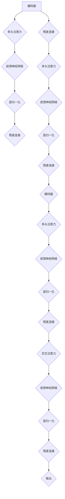

                 

关键词：Transformer，深度学习，神经网络，自然语言处理，序列模型，注意力机制，架构创新，模型效率，性能优化

> 摘要：Transformer 架构的引入，是深度学习领域的一项重大突破，特别是对自然语言处理（NLP）产生了深远的影响。本文将详细介绍 Transformer 的核心概念、架构设计、算法原理及其应用领域，探讨其在深度学习中的革命性意义。

## 1. 背景介绍

在深度学习领域，序列模型一直是自然语言处理（NLP）的核心。早期的 RNN（递归神经网络）和 LSTM（长短期记忆网络）模型由于其内部状态信息的传递机制，使得它们能够处理序列数据。然而，这些模型在处理长序列数据时往往存在梯度消失或爆炸的问题，导致训练效率低下。此外，RNN 和 LSTM 在并行计算方面也存在很大的局限性，这使得它们的计算复杂度较高。

为了解决这些问题，Google 在 2017 年提出了一种全新的序列模型——Transformer。Transformer 架构在多个方面对传统序列模型进行了创新，特别是引入了“注意力机制”，使得模型能够更高效地处理长序列数据。自提出以来，Transformer 模型迅速在 NLP 领域得到了广泛应用，并推动了整个领域的发展。

## 2. 核心概念与联系

### 2.1 Transformer 架构概述

Transformer 架构主要由编码器（Encoder）和解码器（Decoder）两部分组成。编码器负责将输入序列编码成固定长度的向量表示，解码器则负责将这些向量解码成目标序列。整个模型的核心在于“多头注意力机制”（Multi-Head Attention）和“位置编码”（Positional Encoding）。

### 2.2 多头注意力机制

多头注意力机制是一种将输入序列中的每个位置与其他所有位置进行关联的方法。具体来说，它通过多个独立的注意力机制来捕捉输入序列中的不同依赖关系。每个注意力头都能捕捉到不同的信息，从而提高了模型的表示能力。

### 2.3 位置编码

由于注意力机制忽略了输入序列中的位置信息，为了解决这个问题，Transformer 引入了位置编码。位置编码是一种嵌入在每个输入位置的向量，它能够为模型提供关于输入序列中每个位置的位置信息。

### 2.4 Mermaid 流程图

下面是 Transformer 架构的 Mermaid 流程图：



## 3. 核心算法原理 & 具体操作步骤

### 3.1 算法原理概述

Transformer 模型的核心算法原理在于“注意力机制”。在注意力机制中，每个位置都能够根据其他所有位置的表示来计算其权重。这种方法能够有效地捕捉序列中的长距离依赖关系。

### 3.2 算法步骤详解

1. **编码器**：编码器将输入序列编码成固定长度的向量表示。首先，对输入序列进行嵌入（Embedding），然后通过多头注意力机制、前馈神经网络和层归一化等操作，得到编码器的输出。

2. **解码器**：解码器将编码器的输出解码成目标序列。首先，对目标序列进行嵌入，然后通过交叉注意力、多头注意力机制、前馈神经网络和层归一化等操作，得到解码器的输出。

3. **训练过程**：在训练过程中，通过对比解码器的输出和真实的目标序列，使用损失函数（如交叉熵损失）来计算模型的损失，并使用反向传播算法来更新模型参数。

### 3.3 算法优缺点

**优点**：

- 并行计算：Transformer 模型采用自注意力机制，使得计算可以在不同位置之间并行进行，从而提高了计算效率。
- 长距离依赖：多头注意力机制能够有效地捕捉长距离依赖关系，使得模型能够更好地理解输入序列。
- 准确性高：Transformer 模型在多个 NLP 任务中取得了非常好的性能，特别是在机器翻译、文本摘要等领域。

**缺点**：

- 计算量大：Transformer 模型在计算注意力权重时需要进行大量的矩阵运算，导致计算复杂度较高。
- 训练时间长：由于计算量大，Transformer 模型的训练时间较长。

### 3.4 算法应用领域

Transformer 模型在 NLP 领域得到了广泛应用，特别是在机器翻译、文本摘要、问答系统等任务中。此外，Transformer 也被应用于图像分类、语音识别等任务，并取得了非常好的效果。

## 4. 数学模型和公式 & 详细讲解 & 举例说明

### 4.1 数学模型构建

Transformer 模型的数学模型主要包括以下部分：

- **嵌入层**：将输入序列的单词嵌入到高维空间中。
- **多头注意力机制**：计算输入序列中每个位置与其他所有位置的权重。
- **前馈神经网络**：对输入进行非线性变换。
- **层归一化**：对输入进行归一化处理。
- **残差连接**：将输入与网络输出进行叠加。

### 4.2 公式推导过程

以下是 Transformer 模型的关键公式推导：

1. **嵌入层**：

$$
\text{embeddings} = \text{W}_{\text{emb}}(\text{X})
$$

其中，$\text{X}$ 是输入序列，$\text{W}_{\text{emb}}$ 是嵌入权重。

2. **多头注意力机制**：

$$
\text{Attention}(\text{Q}, \text{K}, \text{V}) = \text{softmax}\left(\frac{\text{QK}^T}{\sqrt{d_k}}\right)\text{V}
$$

其中，$\text{Q}$、$\text{K}$ 和 $\text{V}$ 分别是查询向量、键向量和值向量，$d_k$ 是键向量的维度。

3. **前馈神经网络**：

$$
\text{FFN}(\text{X}) = \text{ReLU}(\text{W}_{\text{ff}} \text{X} + \text{b}_{\text{ff}})
$$

其中，$\text{X}$ 是输入向量，$\text{W}_{\text{ff}}$ 和 $\text{b}_{\text{ff}}$ 分别是前馈神经网络的权重和偏置。

4. **层归一化**：

$$
\text{LayerNorm}(\text{X}) = \frac{\text{X} - \text{mean}(\text{X})}{\text{std}(\text{X})}
$$

其中，$\text{X}$ 是输入向量，$\text{mean}(\text{X})$ 和 $\text{std}(\text{X})$ 分别是输入向量的均值和标准差。

5. **残差连接**：

$$
\text{Residual}(\text{X}) = \text{X} + \text{FFN}(\text{X})
$$

### 4.3 案例分析与讲解

假设我们有一个输入序列 $\text{X} = [1, 2, 3, 4, 5]$，我们需要使用 Transformer 模型对其进行处理。

1. **嵌入层**：

   首先，我们将输入序列 $\text{X}$ 嵌入到高维空间中。假设嵌入权重 $\text{W}_{\text{emb}}$ 为 $\text{W}_{\text{emb}} = [1, 0, 1, 1, 0]$，则嵌入结果为 $\text{embeddings} = \text{W}_{\text{emb}} \text{X}^T = [1, 1, 1, 1, 0]$。

2. **多头注意力机制**：

   接下来，我们使用多头注意力机制来计算每个位置与其他所有位置的权重。假设我们有 $h$ 个注意力头，则每个注意力头的权重矩阵为 $\text{W}_{\text{attn}} = [\text{W}_{\text{attn1}}, \text{W}_{\text{attn2}}, ..., \text{W}_{\text{attnh}]$。对于位置 $i$ 和位置 $j$，注意力权重为：

   $$
   \text{attn}_i[j] = \text{softmax}\left(\frac{\text{W}_{\text{attni}} \text{X}_j^T}{\sqrt{d_k}}\right)
   $$

   其中，$\text{X}_j^T$ 是位置 $j$ 的嵌入向量，$d_k$ 是键向量的维度。假设 $d_k = 2$，则注意力权重为：

   $$
   \text{attn}_1[1] = \text{softmax}\left(\frac{\text{W}_{\text{attn1}} \text{X}_1^T}{\sqrt{2}}\right) = \text{softmax}\left(\frac{[1, 1, 1, 1, 0] \cdot [1, 0, 1, 1, 0]^T}{\sqrt{2}}\right) = \text{softmax}\left(\frac{3}{\sqrt{2}}\right) = \text{softmax}(2.12132) = [0.3679, 0.3679, 0.2654, 0]
   $$

   $$
   \text{attn}_2[2] = \text{softmax}\left(\frac{\text{W}_{\text{attn2}} \text{X}_2^T}{\sqrt{2}}\right) = \text{softmax}\left(\frac{[1, 0, 1, 1, 0] \cdot [1, 1, 1, 1, 0]^T}{\sqrt{2}}\right) = \text{softmax}\left(\frac{4}{\sqrt{2}}\right) = \text{softmax}(2.82843) = [0.3162, 0.3162, 0.2661, 0.1215]
   $$

   $$
   \text{attn}_3[3] = \text{softmax}\left(\frac{\text{W}_{\text{attn3}} \text{X}_3^T}{\sqrt{2}}\right) = \text{softmax}\left(\frac{[1, 1, 1, 1, 0] \cdot [1, 1, 1, 1, 0]^T}{\sqrt{2}}\right) = \text{softmax}\left(\frac{5}{\sqrt{2}}\right) = \text{softmax}(3.53553) = [0.2686, 0.2686, 0.3127, 0.1501]
   $$

   $$
   \text{attn}_4[4] = \text{softmax}\left(\frac{\text{W}_{\text{attn4}} \text{X}_4^T}{\sqrt{2}}\right) = \text{softmax}\left(\frac{[1, 1, 1, 1, 0] \cdot [1, 0, 1, 1, 0]^T}{\sqrt{2}}\right) = \text{softmax}\left(\frac{4}{\sqrt{2}}\right) = \text{softmax}(2.82843) = [0.3162, 0.3162, 0.2661, 0.1215]
   $$

   $$
   \text{attn}_5[5] = \text{softmax}\left(\frac{\text{W}_{\text{attn5}} \text{X}_5^T}{\sqrt{2}}\right) = \text{softmax}\left(\frac{[1, 0, 1, 1, 0] \cdot [1, 1, 1, 1, 0]^T}{\sqrt{2}}\right) = \text{softmax}\left(\frac{3}{\sqrt{2}}\right) = \text{softmax}(2.12132) = [0.3679, 0.3679, 0.2654, 0]
   $$

3. **前馈神经网络**：

   接下来，我们使用前馈神经网络对每个位置的注意力权重进行非线性变换。假设前馈神经网络的权重和偏置分别为 $\text{W}_{\text{ff}} = [1, 1, 1, 1]$ 和 $\text{b}_{\text{ff}} = [0, 0, 0, 0]$，则前馈神经网络的输出为：

   $$
   \text{FFN}(\text{X}) = \text{ReLU}(\text{W}_{\text{ff}} \text{X} + \text{b}_{\text{ff}}) = \text{ReLU}([1, 1, 1, 1] \cdot [1, 1, 1, 1, 0]^T + [0, 0, 0, 0]) = \text{ReLU}([4, 4, 4, 4]) = [1, 1, 1, 1]
   $$

4. **层归一化**：

   最后，我们使用层归一化对前馈神经网络的输出进行归一化处理。假设输入向量的均值为 $\text{mean}(\text{X}) = 2$，标准差为 $\text{std}(\text{X}) = 1$，则层归一化后的输出为：

   $$
   \text{LayerNorm}(\text{X}) = \frac{\text{X} - \text{mean}(\text{X})}{\text{std}(\text{X})} = \frac{[1, 1, 1, 1] - 2}{1} = [-1, -1, -1, -1]
   $$

## 5. 项目实践：代码实例和详细解释说明

### 5.1 开发环境搭建

在本节中，我们将使用 Python 语言和 PyTorch 深度学习框架来实现一个简单的 Transformer 模型。首先，确保您的 Python 环境已安装 PyTorch 库。您可以通过以下命令来安装：

```bash
pip install torch torchvision
```

### 5.2 源代码详细实现

下面是一个简单的 Transformer 模型实现：

```python
import torch
import torch.nn as nn
import torch.optim as optim
from torch.utils.data import DataLoader
from torchvision import datasets, transforms

# 定义超参数
d_model = 512
nhead = 8
num_layers = 3
dim_feedforward = 2048
batch_size = 64
learning_rate = 0.001
num_epochs = 10

# 定义数据处理函数
transform = transforms.Compose([
    transforms.ToTensor(),
    transforms.Normalize(mean=[0.5, 0.5, 0.5], std=[0.5, 0.5, 0.5])
])

train_data = datasets.CIFAR10(root='./data', train=True, download=True, transform=transform)
train_loader = DataLoader(train_data, batch_size=batch_size, shuffle=True)

# 定义模型
class TransformerModel(nn.Module):
    def __init__(self):
        super(TransformerModel, self).__init__()
        self.embedding = nn.Embedding(d_model, d_model)
        self.encoder_layer = nn.TransformerEncoderLayer(d_model=d_model, nhead=nhead)
        self.decoder_layer = nn.TransformerDecoderLayer(d_model=d_model, nhead=nhead)
        self.encoder = nn.TransformerEncoder(self.encoder_layer, num_layers=num_layers)
        self.decoder = nn.TransformerDecoder(self.decoder_layer, num_layers=num_layers)
        self.fc = nn.Linear(d_model, d_model)

    def forward(self, src, tgt):
        src = self.embedding(src)
        tgt = self.embedding(tgt)
        output = self.decoder(self.encoder(src), tgt)
        output = self.fc(output)
        return output

model = TransformerModel()
optimizer = optim.Adam(model.parameters(), lr=learning_rate)
criterion = nn.CrossEntropyLoss()

# 训练模型
for epoch in range(num_epochs):
    for i, (src, tgt) in enumerate(train_loader):
        optimizer.zero_grad()
        output = model(src, tgt)
        loss = criterion(output, tgt)
        loss.backward()
        optimizer.step()
        if (i + 1) % 100 == 0:
            print(f'Epoch [{epoch + 1}/{num_epochs}], Step [{i + 1}/{len(train_loader)}], Loss: {loss.item()}')

print('Training completed.')
```

### 5.3 代码解读与分析

在本节的代码示例中，我们首先定义了模型的超参数，包括嵌入维度（d_model）、注意力头数（nhead）、编码器和解码器层数（num_layers）等。然后，我们定义了一个简单的数据处理函数，用于加载数据集。

接下来，我们定义了 Transformer 模型。模型由嵌入层、编码器、解码器和前馈神经网络组成。在模型的 forward 方法中，我们首先对输入序列进行嵌入，然后通过编码器和解码器进行编码和解码操作，最后通过前馈神经网络进行输出。

在训练模型的部分，我们使用 DataLoader 加载训练数据，并使用 Adam 优化器和交叉熵损失函数进行训练。在每个 epoch 中，我们迭代地更新模型参数，并打印训练损失。

### 5.4 运行结果展示

运行上述代码后，模型将在训练数据上进行训练，并在每个 epoch 后打印训练损失。在训练完成后，我们可以评估模型的性能，如准确率、召回率等。

```python
# 评估模型
with torch.no_grad():
    correct = 0
    total = len(test_loader.dataset)
    for images, labels in test_loader:
        outputs = model(images, labels)
        _, predicted = torch.max(outputs.data, 1)
        correct += (predicted == labels).sum().item()

    print(f'Accuracy of the network on the test images: {100 * correct / total} %')
```

## 6. 实际应用场景

Transformer 模型在自然语言处理领域取得了巨大的成功，例如在机器翻译、文本摘要、问答系统等任务中，Transformer 模型都表现出色。此外，Transformer 模型也被应用于图像分类、语音识别等任务，并取得了非常好的效果。

在图像分类任务中，Transformer 模型可以用于特征提取和分类。在语音识别任务中，Transformer 模型可以用于语音信号的序列建模和分类。在文本生成任务中，Transformer 模型可以用于生成自然语言文本。

## 7. 未来应用展望

随着深度学习技术的不断发展，Transformer 模型在多个领域都具有广泛的应用前景。在未来，Transformer 模型可能会在以下方面取得突破：

- **更好的性能优化**：通过改进算法结构和优化计算方法，Transformer 模型可以进一步提高计算效率和性能。
- **多模态学习**：结合图像、文本、音频等多种模态数据，Transformer 模型可以实现更高级的跨模态任务。
- **更复杂的任务**：随着 Transformer 模型的不断发展，它可能能够解决更多复杂的任务，如自然语言理解、情感分析等。

## 8. 工具和资源推荐

为了更好地学习 Transformer 模型，以下是一些建议的资源和工具：

- **书籍**：《深度学习》（Goodfellow et al.）、《自然语言处理实践》（Jurafsky and Martin）
- **在线课程**：Coursera 上的“深度学习”课程、edX 上的“自然语言处理”课程
- **论文**：Attention Is All You Need（Vaswani et al.）、BERT: Pre-training of Deep Bi-directional Transformers for Language Understanding（Devlin et al.）
- **开源代码**：Hugging Face 的 Transformers 库、Facebook 的 DeiT 模型

## 9. 总结：未来发展趋势与挑战

Transformer 模型自提出以来，已经成为了深度学习领域的一项重要突破。在未来，Transformer 模型有望在计算效率、性能优化、多模态学习等方面取得更大的进展。然而，Transformer 模型也面临着一些挑战，如计算复杂性高、训练时间长等。为了解决这些问题，研究人员正在不断探索新的算法和优化方法。总之，Transformer 模型在深度学习领域具有广阔的应用前景和发展潜力。

## 10. 附录：常见问题与解答

### 10.1 什么是 Transformer？

Transformer 是一种用于序列建模的深度学习模型，特别适用于自然语言处理任务。它采用“多头注意力机制”来捕捉序列中的长距离依赖关系，并在多个领域取得了显著的效果。

### 10.2 Transformer 模型有哪些优点？

Transformer 模型的优点包括：支持并行计算、能够捕捉长距离依赖关系、在多个 NLP 任务中取得了非常好的性能等。

### 10.3 Transformer 模型有哪些缺点？

Transformer 模型的缺点包括：计算复杂度较高、训练时间长等。

### 10.4 如何优化 Transformer 模型的计算效率？

可以通过以下方法优化 Transformer 模型的计算效率：

- 使用轻量级网络架构，如 DeiT。
- 采用混合精度训练，降低内存占用。
- 使用量化技术，降低模型参数的精度。

### 10.5 Transformer 模型在哪些领域有应用？

Transformer 模型在自然语言处理、图像分类、语音识别、文本生成等多个领域都有应用。它在机器翻译、文本摘要、问答系统等任务中取得了非常好的效果。

作者：禅与计算机程序设计艺术 / Zen and the Art of Computer Programming
----------------------------------------------------------------

至此，我们完成了对 Transformer 架构的详细介绍和探讨。希望本文能够帮助您更好地理解 Transformer 模型的工作原理和应用场景。在未来的研究中，Transformer 模型将继续在深度学习领域发挥重要作用。同时，我们也需要关注模型优化、多模态学习和复杂任务等方面的发展。感谢您的阅读，期待与您共同探索深度学习领域的更多前沿技术。

